# FastUMI: A Scalable and Hardware-Independent Universal Manipulation Interface with Dataset

Zhaxizhuoma1†, Kehui Liu1†, Chuyue Guan1†, Zhongjie Jia1,2†, Ziniu $\mathrm { \sf W u } ^ { 1 , 3 \dagger }$ , Xin Liu1,2† Tianyu Wang1,4∗, Shuai Liang1,2∗, Pengan Chen1,5∗, Pingrui Zhang1,4∗, Haoming Song1,2, Delin $\mathrm { Q u } ^ { 1 , 4 }$ , Dong Wang1, Zhigang Wang1, Nieqing Cao6, Yan Ding1†‡, Bin Zhao1‡, Xuelong $\mathrm { L i } ^ { 1 , 7 }$

1Shanghai AI Lab, 2Shanghai Jiao Tong University, 3University of Bristol,

4Fudan University, 5The University of Hong Kong, 6Xi’an Jiaotong-Liverpool University,

7Institute of AI, China Telecom Corp Ltd

† ∗ Equal Contribution, ‡Project Leader, Project Website: https://fastumi.com/

Abstract—Real-world manipulation data involving robotic arms is crucial for developing generalist action policies, yet such data remains scarce since existing data collection methods are hindered by high costs, hardware dependencies, and complex setup requirements. In this work, we introduce FastUMI, a substantial redesign of the Universal Manipulation Interface (UMI) system that addresses these challenges by enabling rapid deployment, simplifying hardware–software integration, and delivering robust performance in real-world data acquisition. Compared with UMI, FastUMI has several advantages: 1) It adopts a decoupled hardware design and incorporates extensive mechanical modifications, removing dependencies on specialized robotic components while preserving consistent observation perspectives. 2) It also refines the algorithmic pipeline by replacing complex Visual-Inertial Odometry (VIO) implementations with an offthe-shelf tracking module, significantly reducing deployment complexity while maintaining accuracy. 3) FastUMI includes an ecosystem for data collection, verification, and integration with both established and newly developed imitation learning algorithms, accelerating policy learning advancement. Additionally, we have open-sourced a high-quality dataset of over 10,000 realworld demonstration trajectories spanning 22 everyday tasks, forming one of the most diverse UMI-like datasets to date. Experimental results confirm that FastUMI facilitates rapid deployment, reduces operational costs and labor demands, and maintains robust performance across diverse manipulation scenarios, thereby advancing scalable data-driven robotic learning.

# I. INTRODUCTION

The scarcity of large-scale, high-quality, real-world interaction data remains a major bottleneck to progress in robotic manipulation, primarily due to challenges associated with efficient and scalable data collection methods [3, 10, 50]. Current methods can be broadly categorized into teleoperationbased techniques [51, 16, 47, 42], vision-driven demonstrations [3, 26], and sensor-enhanced interfaces [6, 40, 48]. While teleoperation enables precise data acquisition, it remains laborintensive, costly, and constrained by the challenges of nonintuitive and task-specific human-to-robot mapping[49, 35, 19]. Vision-driven approaches can provide large-scale, lowcost data but typically lack the rich, fine-grained interaction dynamics essential for policy learning. In contrast, sensor-

enhanced interfaces—exemplified by systems such as the Universal Manipulation Interface (UMI) [10]—offer a promising alternative. They directly capture diverse, multimodal signals that closely align with a robot’s onboard sensory modalities, preserving fidelity and precision, while enabling human demonstration data to be seamlessly transferred into robotic frameworks. Moreover, these interfaces can be manufactured and deployed at lower cost, thereby facilitating faster, highquality data collection under real-world conditions. In doing so, they narrow the gap between human demonstrations and autonomous robotic execution, enabling rapid and high-quality data collection.

While the UMI system addresses key challenges in human demonstration data collection and supports action policy learning in diverse scenarios, its current system design and implementation suffers from two key limitations. First, its tight coupling with specific robotic components (e.g., the Weiss WSG-50 gripper) restricts adaptability and increases both financial and logistical burdens. Integrating UMI into different robotic platforms requires not only designated grippers and related hardware, but also extensive efforts, including mechanical redesign, sensor recalibration, and code parameter modification. These adjustments impose significant labor overhead and lack generalizability, ultimately hindering widespread adoption across diverse deployment environments and application contexts.

The second limitation arises from the software framework, particularly the reliance on a GoPro-based VIO (Visual-Inertial Odometry) pipeline in conjunction with open-source SLAM algorithms [7]. Through experimental evaluation, we observe that the UMI system encounters difficulties in tasks that involve prolonged occlusions, such as hinged operations. As a result, the UMI software configuration struggles to maintain robust operation when visual signals are intermittently lost, thereby diminishing data quality and reducing its utility for subsequent learning tasks. Furthermore, the VIO process is sensitive to parameterization and requires complex calibration procedures and multiple coordinate transformations. These factors collectively increase operational complexity, hinder

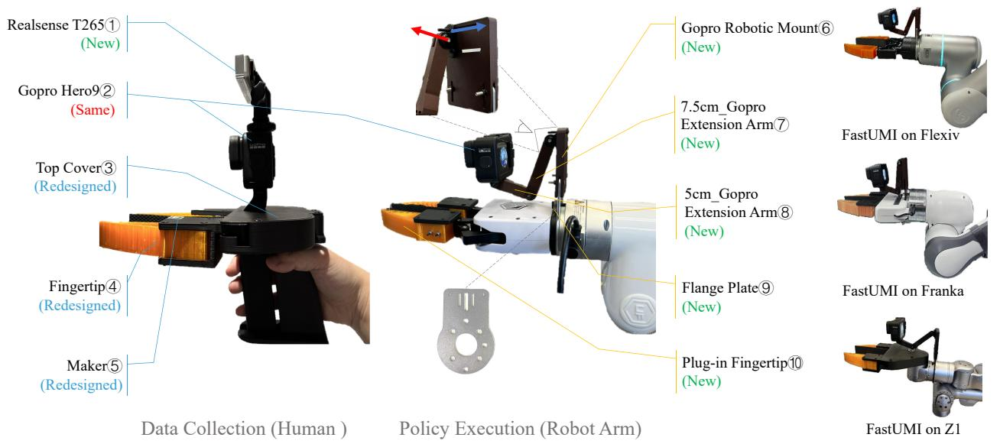  
Fig. 1. Physical prototypes of FastUMI. Left: The handheld device, used to collect demonstration data from human operators, includes a $\mathrm { G o P r o } \mathcal { Q }$ for visual feedback, a RealSense $\mathrm { T } 2 6 5 ( \mathrm { \Omega } )$ for end-effector pose tracking, fingertip markers $\textcircled{4} \textcircled{5}$ to measure the gripper aperture, and a top cover $\textcircled{3}$ to secure both the GoPro and T265. Middle: A robot-mounted device, used for executing learned policies on the robotic arm, mirrors the handheld configuration. It features an ISO-standard-compatible camera mounting solution (including gopro mount $\textcircled{6}$ , extension $\mathrm { a r m s } @ \textcircled { 8 }$ , and flange plate $\textcircled{9}$ ) that adapts to varying arm and gripper geometries. This design maintains consistent GoPro perspectives across different setups, enabling direct transfer of human demonstration views to autonomous robotic executions. Right: FastUMI can be easily deployed on various robotic arms and grippers. To distinguish FastUMI’s hardware configuration from that of the original UMI, we employ a color-coding scheme.

reproducibility, and undermine the user-friendliness of the overall framework.

To address the limitations of UMI, we undertake an extensive redesign centered around three primary objectives:

• Enhancing adaptability through hardware decoupling. By removing strict dependencies on specific robotic components, our hardware design can be seamlessly integrated with a wide range of robotic arms and grippers, facilitating rapid deployment across diverse platforms.   
• Improving efficiency with software-driven plug-and-play functionality. Our software stack emphasizes immediate usability, requiring minimal configuration and user training. This design choice facilitates rapid data collection and significantly reduces operational complexity. Moreover, it automatically adapts to evolving hardware configurations, ensuring long-term compatibility and reliability across both current and future robotic platforms.   
• Establishing a robust ecosystem to ensure data quality and algorithmic compatibility. Our ecosystem is designed to support various imitation learning algorithms (e.g., Action Chunking with Transformers (ACT) [49] and Diffusion Policy (DP) [9]) by providing essential data types, such as end-effector trajectory and joint trajectory. In addition, we offer tools for rapid data verification to ensure that collected datasets consistently meet the quality standards necessary for advancing manipulation capabilities.

Building upon the foundations of the original UMI, we present FastUMI, a redesigned system that addresses both hardware and software concerns to meet the stated objectives. On the hardware side, we introduce a set of standardized,

plug-and-play fingertip attachments—identical to those on the handheld device—that can be easily fitted onto a wide range of commonly used robotic grippers. To address the variability in robotic arm and gripper geometries, we provide a versatile, ISO-standard-compatible camera mounting solution. By adjusting this mount, users can maintain a uniform GoPro perspective across different hardware configurations. This modular approach ensures consistent viewpoints, allowing models trained on handheld-collected data to be seamlessly transferred to robot-mounted scenarios. In addition, we simplify the mechanical structures of the hand-held and robot-mounted components, enhancing overall stability and durability for extended data collection.

On the software side, we replace the UMI’s VIO-based localization with a RealSense T265 module, which integrates both visual and inertial data to provide more stable tracking in partially occluded environments. While the GoPro can still be used for capturing high-resolution video, it is no longer relied upon as the primary visual tracking sensor. This adjustment eliminates the necessity for separate VIO pipelines and reduces complex calibration procedures, thereby streamlining system integration and enabling rapid deployment. In addition, we provide a robust data collection, verification, and processing pipeline designed to enhance system versatility and usability. FastUMI supports generating two distinct types of datasets—end-effector trajectory and joint trajectory—to align with the specific input requirements of different algorithms. Specifically, the framework accommodates two prominent categories of imitation learning algorithms—ACT and DP. To tackle the unique policy-learning challenges posed by FastUMI’s data—including close-up first-person perspective,

variable scene geometry, and limited depth information—we develop multiple custom algorithmic variants, thereby extending the framework’s applicability and flexibility across diverse manipulation scenarios.

To validate the consistency of observations and the reliability of data collection, we conduct rigorous testing, confirming that FastUMI performs similarly with the original UMI system while significantly reducing user overhead. Comprehensive experimental evaluations demonstrate that the redesigned system delivers an integrated, user-friendly solution that seamlessly aligns the handheld interface with robot-mounted equipment, effectively enabling efficient and scalable data acquisition for robotic learning. We open-source over 10,000 demonstration trajectories collected in real-world settings across 22 everyday tasks, establishing our dataset as one of the most comprehensive UMI-like collections in terms of task variety. This broad range encompasses diverse manipulation scenarios and includes numerous instances of visual occlusions, which replicate real-world conditions where visual data may be intermittently obscured. By collecting such a diverse and challenging dataset, we not only demonstrate FastUMI’s adaptability and robustness across various manipulation scenarios but also provide a valuable training resource for imitation learning algorithms.

# II. HARDWARE-CENTRIC PROTOTYPE DESIGN

The FastUMI system embodies a hardware-centric redesign based on a decoupled design philosophy. This section introduces the guiding principles behind this approach and provides an overview of the hardware components.

# A. Hardware Design Challenges

Aligned with the stated objectives, our hardware design must overcome several critical challenges. The first involves decoupling the system from specific robotic hardware. By designing mechanical components that seamlessly integrate with diverse robotic arms and grippers—each varying in size, shape, and mechanical interface—we aim to minimize redesign efforts and configuration overhead. The second major challenge is maintaining visual consistency between handheld and robot-mounted devices, which is essential for effective policy transfer in robotic learning algorithms. Given the wide range of possible gripper dimensions, preserving uniform camera perspectives across different hardware setups becomes essential.

In addition, our design must accommodate a wider variety of robot-mounted grippers, moving beyond the parallel-jaw restriction and thereby broadening its applicability across various robotic platforms. Furthermore, fast deployment is a key requirement, so we strive for a plug-and-play solution that streamlines user setup, minimizing calibration and configuration efforts to promote widespread adoption. Finally, ensuring high data quality underlies the entire effort. Reliable hardware is crucial for obtaining accurate and consistent data, thus mitigating barriers in downstream learning tasks and enhancing overall system performance.

To address these challenges, FastUMI adopts a decoupled design philosophy that underpins its hardware architecture. The system is systematically decoupled along three primary dimensions. Details are presented at Sections II-B and II-C.

• Physical Decoupling: Standardized interfaces and modular components enable seamless integration across a range of robotic platforms, eliminating the need for extensive hardware-specific modifications.   
• Visual Consistency: Uniform camera perspectives between handheld and robot-mounted configurations ensure that data acquired in one setting can be readily transferred to another without requiring extensive recalibration. This consistency allows data from human demonstrations to be directly applicable to robotic execution.   
• Operational Independence: The system incorporates self-contained tracking and sensing modules, reducing reliance on external computational frameworks and ensuring robust performance across diverse deployment scenarios.

# B. Handheld Device Design

The handheld device (see the left subfigure in Fig. 1) enables manual data collection for training action policies. It comprises three primary components:

• Fisheye Camera Module $\textcircled{2}$ : A GoPro camera with a fisheye extension captures wide-angle images with a 155- degree field of view (FOV), significantly reducing occlusions and providing a broad perspective for robotic tasks. This FOV is substantially larger than that of commonly used cameras such as the RealSense D435i, whose narrower field of view has proven suboptimal for first-person view (FPV) data collection in our tests. In contrast, the wider coverage of a fisheye camera effectively captures more environmental context and enhances visual feature extraction, thereby improving policy learning outcomes.

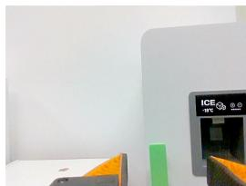

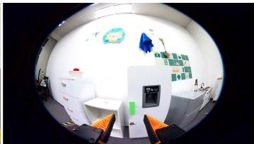  
Fig. 2. Left: D435i camera with a narrower field of view. Right: GoPro with a 155-degree wide-angle view.

• Pose Tracking Module①: The handheld interface lacks intrinsic joint feedback or an external motion-capture system, so we incorporate a RealSense T265 for robust tracking. The T265, featuring a high-performance integrated IMU, replaces UMI’s visual odometry solution, eliminating complex calibration steps and enhancing usability. In our experiments, this module consistently delivers stable pose estimation across a wide range of scenarios, including those involving partial visual occlusions (e.g., opening cabinets and drawers). This improved hardware design accommodates a broader set of conditions, which is crucial for data collection. Moreover, our system is robust to different camera models, allowing smooth integration of alternative sensors without major modifications to the existing pipeline. For instance, we have verified that the RoboBaton MINI provides performance comparable to the T265 while maintaining a fully compatible data interface, ensuring high-quality data collection and continued availability. A comparison of the T265 and MINI is presented in Section X-A.

• Top Cover, Fingertip, and Marker $\textcircled{3} ( \textcircled{4} ) ( \textcircled{5} )$ : In the original UMI design, the top cover often appears in the GoPro’s field of view, preventing complete hardware decoupling. To address this limitation, we reposition the GoPro closer to the fingertips and ensure the top cover remains outside the fisheye lens range, thereby accommodating setups where the cover may be absent (e.g., when mounted on a robot). Although moving the camera closer to the fingertips naturally introduces greater image distortion, we tackle this challenge by optimizing both the size and placement of the markers. These refinements minimize lens distortion effects, improve marker detection accuracy, and enhance durability and ease of attachment. This redesign increases system flexibility and reliability.

In this configuration, the camera is factory-calibrated and aligned with the fingertips, requiring no further user adjustment and enabling a straightforward plug-and-play experience. We employ two camera modules in FastUMI, each serving a distinct function: the T265 provides accurate pose tracking even under partial occlusions, while the GoPro delivers an expansive view crucial for environmental context capture, demonstration verification, and learning algorithm support. Because the GoPro is not responsible for pose tracking, it can be mounted more flexibly to maintain consistent viewpoints across both handheld and robot-mounted devices, whereas the T265 is placed in a more protected location to ensure stable pose tracking performance.

# C. Robot-Mounted Device Design

The robot-mounted device (see the middle subfigure in Fig. 1) follows the same design principles as its handheld counterpart but is engineered for broad compatibility with a wide range of robotic arms and grippers. Unlike the handheld configuration, the robot-mounted device does not include a T265 camera. Its main components include:

• Flange Plate $\textcircled{9}$ : Designed in compliance with ISO standards, the flange plate is compatible with a wide range of robotic arms, ensuring seamless integration and significantly reducing setup time.   
• Plug-in Fingertip⑩: Outwardly identical to the attachments used in the handheld device, these modules are internally contoured to accommodate varying gripper shapes while preserving uniform external interaction points, thereby facilitating effective policy transfer. Interchangeable fingertip modules establish standardized physical interaction points, supporting compatibility with various robotic and handheld grippers. To accommodate a wide range of robotic grippers, we design five customized fingertip attachments (e.g., the xArm gripper and Robotiq 2f-85) based on commonly used grippers in open-source datasets such as Open X-Embodiment [30], covering over $90 \%$ of the grippers in these datasets. Although not all gripper types are yet supported, our design can be readily adapted as needed. Fig. 4 illustrates our fingertip design integrated with the xArm Gripper.

• Adjustable Camera Mounting Structure $\textcircled{6} \textcircled{7} \textcircled{8}$ : Modular extension arms facilitate precise alignment of the GoPro with the gripper’s fingertips, ensuring consistent viewpoints across different robot setups. This structure comprises two key parts: 1) GoPro Robotic Mount $\textcircled{6}$ serves as the primary attachment point for the GoPro. 2) GoPro Extension $A r m @ \textcircled { 8 }$ enable both lateral positioning (indicated by the blue arrow) and vertical positioning (indicated by the red arrow) to align the camera with the robot gripper, as demonstrated in Fig. 1. Standardized male-female interfaces allow sequential connections of extension arms, providing adjustable length with minimal vibration (tested up to three extensions). By adjusting the extension arm, users can replicate the handheld device’s camera perspective, even when grippers vary widely in size or shape. Insertable fingertip extensions further ensure consistent viewpoints across heterogeneous hardware configurations.

Visual Alignment: To ensure visual consistency between the handheld and robot-mounted devices, we adopt a straightforward rule: “The bottom of the GoPro’s fisheye lens image aligns with the bottom of the gripper’s fingertips.”, as illustrated in Fig. 3. This standard viewpoint ensures that all users capture nearly identical observations, enhancing interoperability across different deployments. Although alternative standards could be defined, deviating from this alignment would reduce the utility of shared datasets for broader applications. If gripper sizes vary, our adjustable mechanical design accommodates fine-grained arm adjustments to maintain visual alignment. In practice, the handheld device employs a fixed camera configuration, whereas the robot-mounted device requires an adjustable setup due to variations in arm geometries and end-effector designs.

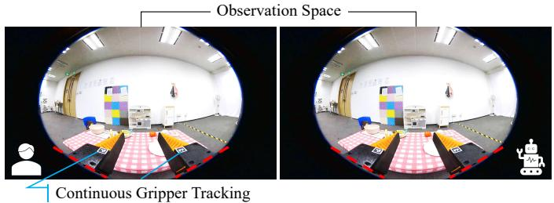  
Fig. 3. Visual alignment between the handheld device (Left) and the robotmounted device (Right). The two views demonstrate the consistent positioning of the GoPro’s fisheye lens image, with the bottom of the gripper’s fingertips aligned to the red dashed lines.

Although our handheld device is a parallel-motion gripper, many robot-mounted grippers, such as the xArm Gripper or Robotiq Gripper, do not strictly maintain parallel motion. For example, the xArm Gripper’s effective length changes by approximately 1 centimeter as it moves between fully open and closed positions (see Fig. 4). This discrepancy in gripper motion can create mismatches in the observed camera view, especially when transferring demonstrations collected on the handheld device to different robot-mounted setups. To resolve this challenge, we develop a dynamic error-compensation algorithm that compensates for gripper-specific motion differences during inference, thereby preserving consistent visual alignment between human demonstrations and robotic executions (see Section IV-E for details).

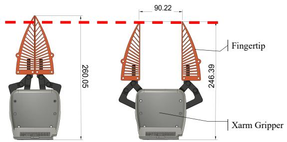  
Fig. 4. Our plug-in fingertip design integrated with the xArm Gripper; The effective length of the xArm Gripper changes by approximately 1 centimeter between fully closed and open positions, potentially causing misalignment when transferring demonstrations.

# D. Other Design Optimizations

To improve the stability and durability of FastUMI, we introduce three structural enhancements:

• Reinforced Key Mount Structure: Increased structural integrity to reduce vibration.   
• Carbon Fiber Components: Strengthened material properties while minimizing weight.   
• Standardized Male-Female Interface Design: Allowed sequential connection of extension arms to adjust length without significant vibration.

Overall, the extensive hardware-related designs ensure reliable performance during data collection and simplify hardware adjustments for users. Additionally, our system configuration allows for a single standardized handheld device to be shared among multiple users, while the robot-mounted device can be adapted to various grippers or robotic arms. This decoupled arrangement preserves uniform data collection workflows and advances our goal of making FastUMI accessible to a broader user community.

# III. SOFTWARE-FOCUSED FRAMEWORK

# A. Raw Data Acquisition

Overall Data Acquisition Pipeline: FastUMI employs three main ROS nodes to record multimodal demonstration data. First, a camera node continuously streams wide-angle images (e.g., $1 9 2 0 \times 1 0 8 0$ at 60 fps) from a GoPro Camera.

Second, a tracking node provides pose estimates from the T265 sensor at a higher rate (e.g., $2 0 0 ~ \mathrm { H z } )$ ). Each pose is represented as $( x , y , z , q _ { x } , q _ { y } , q _ { z } , q _ { w } )$ , where $( x , y , z )$ represents the translation vector and $( q _ { x } , q _ { y } , q _ { z } , q _ { w } )$ represents orientation in quaternion form. Finally, a storage node aggregates and synchronizes these streams in an Hierarchical Data Format version 5 (HDF5) file for subsequent processing. Because each sensor runs independently, the system is readily extensible to accommodate additional modalities (e.g., tactile sensors) by adding corresponding ROS nodes.

FastUMI’s reliance on the T265 not only improves reliability under partial occlusions but also removes the need for extensive calibrations and VIO parameter tuning, significantly accelerating deployment. Nonetheless, it introduces more demanding dual-sensor synchronization and drift management requirements, as detailed below.

Data Sub-Sampling and Synchronization: In multisensor data fusion, differing sampling rates and data patterns often hinder precise alignment. To address these challenges, we employ a unified ROS clock for consistent timestamping, a multithreaded buffering mechanism to handle each sensor stream independently, and synchronized sub-sampling at the greatest common frequency. This integrated strategy ensures robust multi-modal alignment without compromising data integrity. Such measures are necessary because certain sensors (e.g., the T265 at $2 0 0 ~ \mathrm { H z }$ and the GoPro at $6 0 ~ \mathrm { H z }$ ) exhibit mismatched rates, increasing the risk of misalignment and overload. In practice, each sensor’s data is tagged with the unified clock and routed into a dedicated thread-safe queue to prevent data loss under high throughput. Before each recording session, these queues are reset to maintain orderly buffers. We then sub-sample both streams at $2 0 \ \mathrm { H z }$ —identified as the greatest common frequency between $2 0 0 ~ \mathrm { H z }$ and $6 0 \ \mathrm { H z }$ —by retaining one in every three camera frames and pairing each retained frame with the temporally nearest T265 pose. This approach achieves sub-millisecond offsets, well within half the T265’s 1/200 s interval, minimizing interpolation errors and ensuring consistently synchronized data for downstream learning tasks.

Accumulated Drift Correction for T265: Although the T265 provides robust pose estimates, it can accumulate drift during substantial motion (e.g., sudden accelerations). To address this, we employ two main strategies: 1) Reinitialization. The simplest remedy is to restart the T265 in a stationary, predefined reference pose. This action resets the device’s internal state and restores accurate pose tracking. 2) Loop Closure. Another strategy leverages a visually distinct reference region—a blue 3D-printed groove on the table (Fig. 5 Left)—to facilitate loop closure. When the T265 revisits this area, it re-encounters previously mapped visual features, typically realigning the estimated trajectory with the initial reference (highlighted as a green dashed box in Fig. 5 Right) in RVIZ under minor drift. However, if significant misalignment persists even after returning to the marked area, loop closure is deemed ineffective, and the T265 must be reinitialized to restore accurate pose tracking.

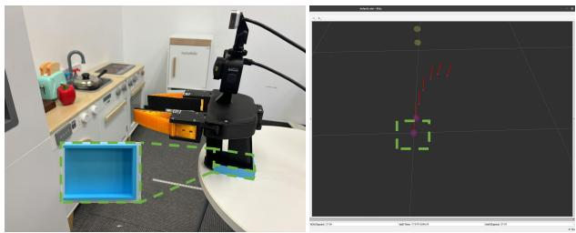  
Fig. 5. Left: The blue 3D-printed groove on the table, serving as a clear visual reference to aid loop closure. Right: The T265’s trajectory in RVIZ, illustrating alignment with the initial reference, highlighted as a green dashed box, after revisiting the blue groove.

# B. Raw Data Quality Assessment

Ensuring reliable demonstrations is crucial for downstream learning tasks; however, to our knowledge, no existing work fully quantifies what constitutes “ideal” data quality. In practice, we enforce consistency through sensor confidence and trajectory smoothness checks. The T265 provides four discrete confidence levels—Failed, Low, Medium, and High; to avoid prolonged low-confidence data, we first validate the environment by confirming that at least $9 5 \%$ of sample poses achieve High confidence. Our tests indicate that lighting conditions notably affect the T265’s performance, with dim or low-light environments often leading to reduced confidence levels and increased drift. During actual recordings, any low-confidence pose is excluded and interpolated from neighboring frames to maintain continuity. Meanwhile, user-defined thresholds on velocity, acceleration, and relative orientation identify abrupt transitions, further refining data fidelity. Although these strategies cannot guarantee an absolute benchmark for data quality, they help establish rigorous collection standards and minimize errors that could propagate into subsequent modeling and inference.

# C. Data Preparation for Training

Data Type Overview: To address the requirements of diverse imitation learning algorithms, we categorize trajectory data into two main types—TCP trajectories (both absolute and relative), and joint trajectories. At the software level, FastUMI facilitates seamless integration of various data formats and evolving algorithmic needs with minimal configuration. Below, we outline the procedures for generating these three data formats.

Input Data and Assumption: The principal raw inputs are pose estimates from the T265 camera, given by $\mathbf { p } _ { i }$ (position) and $\mathbf { R } _ { i }$ (orientation) in the camera’s local frame. The following additional information is also required:

• The known robotic arm’s Unified Robot Description Format (URDF).   
• The known offset $\Delta _ { c 2 g }$ from the T265 camera center to the gripper center (expressed in the camera frame), as shown in Fig. 6 (Left).

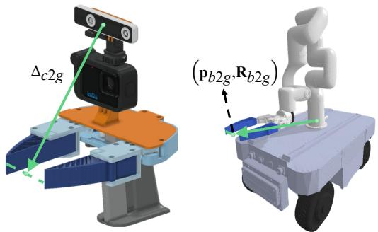  
Fig. 6. Illustration of the offset $\Delta _ { c 2 g }$ from the T265 center to the gripper center, and the gripper center pose $\left( \mathbf { p } _ { b 2 g } , \mathbf { R } _ { b 2 g } \right)$ in the robot base frame.

• The known pose $\left( \mathbf { p } _ { b 2 g } , \mathbf { R } _ { b 2 g } \right)$ of the gripper center in the robot base frame, as shown in Fig. 6 (Right), where $\mathbf { p } _ { b 2 g }$ is the position, and $\mathbf { R } _ { b 2 g }$ is the rotation.

We assume that the hand-held device motion precisely mirrors that of the robot end-effector. Under these conditions, the following trajectories can be derived: 1) Absolute TCP trajectories, 2) Relative TCP trajectories, and 3) Absolute joint trajectories. Details are outlined below.

Absolute TCP Trajectory: To compute this trajectory, the T265 coordinate system is first aligned with the robot base frame. At each timestamp i, the T265 provides $\left( \mathbf { p } _ { i } , \mathbf { R } _ { i } \right)$ , describing the camera’s motion relative to its initial pose. The camera’s absolute pose in the robot base frame is given by:

$$
\mathbf {p} _ {\mathrm {c a m}} ^ {(i)} = \mathbf {p} _ {\mathrm {b} 2 \mathrm {g}} + \mathbf {p} _ {i} - \mathbf {R} _ {\mathrm {b} 2 \mathrm {g}} \Delta_ {c 2 g}, \tag {1}
$$

$$
\mathbf {R} _ {\mathrm {c a m}} ^ {(i)} = \mathbf {R} _ {\mathrm {b a s e}} \cdot \mathbf {R} _ {i}. \tag {2}
$$

The absolute TCP pose $\left( \mathbf { p } _ { \mathrm { e e } } ^ { ( i ) } , \mathbf { R } _ { \mathrm { e e } } ^ { ( i ) } \right)$ is then obtained by incorporating the camera-to-gripper offset $\Delta _ { c 2 g }$ :

$$
\mathbf {p} _ {\mathrm {e e}} ^ {(i)} = \mathbf {p} _ {\mathrm {c a m}} ^ {(i)} + \mathbf {R} _ {\mathrm {c a m}} ^ {(i)} \Delta_ {c 2 g}, \tag {3}
$$

$$
\mathbf {R} _ {\mathrm {e e}} ^ {(i)} = \mathbf {R} _ {\mathrm {c a m}} ^ {(i)}. \tag {4}
$$

The resulting sequence $\{ ( \mathbf { p } _ { \mathrm { e e } } ^ { ( i ) } , \mathbf { R } _ { \mathrm { e e } } ^ { ( i ) } ) \}$ yields the absolute TCP trajectory in the robot base frame.

Relative TCP Trajectory: This trajectory is formed from ecutive absolute TCP, with absolute poses or ad and $i$ and, the $i + 1$ $\left( \mathbf { p } _ { \mathrm { e e } } ^ { ( i ) } , \mathbf { R } _ { \mathrm { e e } } ^ { ( i ) } \right)$ $\big ( \mathbf { p } _ { \mathrm { e e } } ^ { ( i + 1 ) } , \mathbf { R } _ { \mathrm { e e } } ^ { ( i + 1 ) } \big )$ relative transforms are:

$$
\mathbf {p} _ {\text {r e l}} ^ {(i)} = \mathbf {p} _ {\text {e e}} ^ {(i + 1)} - \mathbf {p} _ {\text {e e}} ^ {(i)}, \tag {5}
$$

$$
\mathbf {R} _ {\text {r e l}} ^ {(i)} = \left(\mathbf {R} _ {\mathrm {e e}} ^ {(i)}\right) ^ {- 1} \cdot \mathbf {R} _ {\mathrm {e e}} ^ {(i + 1)}. \tag {6}
$$

This formulation removes dependence on a global reference, facilitating more uniform data distributions and improving generalization when the base pose varies.

Absolute Joint Trajectory: To obtain it, inverse kinematics (IK) is solved for each absolute TCP pose $\left( \mathbf { p } _ { \mathrm { e e } } ^ { ( i ) } , \mathbf { R } _ { \mathrm { e e } } ^ { ( i ) } \right)$ using the robot’s URDF, typically via an iterative solver. To maintain continuity, the solution at frame $i$ serves as the initial guess

for frame $i + 1$ . If the URDF only extends to the flange, the flange-to-gripper offset is accounted for in the IK computations to ensure accurate joint solutions.

Continuous Gripper Width Computation: We propose a marker-based method that decouples software from the underlying mechanical structure, thereby facilitating compatibility with diverse gripper designs. Specifically, we measure the pixel distance between ArUco markers [20] on the gripper jaws and map it linearly to the gripper’s physical opening width. This approach obviates rigid hardware dependencies, reducing design constraints and streamlining integration of new or differently sized grippers.

In our setup, we attach two ArUco markers to the gripper and define two hyperparameters: $d _ { \mathrm { m a x } }$ and $d _ { \mathrm { m i n } }$ . These values represent the pixel distances between the markers at the gripper’s maximum and minimum openings, respectively. For each image frame, we detect the markers and compute the pixel distance d. If only one marker is identified, we estimate $d$ by mirroring the known marker about the gripper’s central axis; if no markers are detected, an imputed value is inserted to maintain continuity. Consequently, each frame is guaranteed a valid marker distance. Finally, the physical gripper width, denoted as W , is determined by normalizing the measured distance with respect to $d _ { \mathrm { m a x } }$ and $d _ { \mathrm { m i n } }$ , then scaling by $G _ { \mathrm { m a x } }$ , which denotes the jaws’ maximum physical opening:

$$
W = \frac {d - d _ {\operatorname* {m i n}}}{d _ {\operatorname* {m a x}} - d _ {\operatorname* {m i n}}} \times G _ {\max } \tag {7}
$$

# IV. ALGORITHMIC ADAPTATIONS FOR FASTUMI

# A. Motivation: Beyond Hardware Decoupling

In earlier sections, we introduce how FastUMI attains hardware decoupling. This design choice lowers the cost and complexity of system deployment across heterogeneous platforms, including handheld and robot-mounted configurations. However, while hardware decoupling supports seamless data acquisition across various setups, it does not by itself address the distinct policy-learning challenges arising from FastUMI’s data distributions (details in Section IV-B). Hence, hardware decoupling alone cannot fully realize FastUMI’s potential. By incorporating data-driven refinements into baseline algorithms to accommodate FastUMI’s unique data characteristics, we enable efficient multi-platform deployment with consistently high performance while also laying the groundwork for more advanced methods in the future.

# B. Data Challenges with FastUMI

Compared to conventional third-person or fixed-base perspectives, FastUMI’s wrist- or handheld-mounted viewpoints introduce several distinct data characteristics:

• Close-up First-Person Perspective: Cameras positioned near the end-effector capture detailed manipulation cues but offer limited visibility of the full robotic arm, increasing dependence on priors to maintain kinematic feasibility.

• Variable Geometry and Scene Layout: FastUMI’s hardware-agnostic design generates heterogeneous data across different arm configurations, base frames, and environments, complicating efforts to achieve consistent policy learning.   
• Limited Depth Information: Single-view fisheye images lack explicit three-dimensional spatial cues, making precise depth estimation difficult. Tasks demanding accurate positioning, including object alignment and gripper closure, are particularly vulnerable to errors when depth signals are absent.

To address these challenges, we present adaptations for two primary imitation learning algorithms: ACT and DP. These enhancements promote robust policy execution, ensure kinematic feasibility, and integrate depth-awareness for tasks that require higher precision.

# C. Enhanced ACT for First-Person Perspectives

The standard ACT predicts absolute joint trajectories for the robotic arm, performing effectively in third-person or fixedcamera scenarios. However, under FastUMI’s first-person wrist-mounted perspective, large portions of the robotic arm remain unseen, making ACT susceptible to producing illicit joint configurations during inference. These configurations can exhibit extreme end-effector orientations that violate kinematic constraints or diverge substantially from demonstration trajectories. Consequently, we introduce two targeted refinements to the original ACT to address visibility limitations inherent in first-person data.

1) Smooth-ACT: Local Temporal Smoothing. To address abrupt or infeasible joint transitions, we introduce Smooth-ACT, which enhances action continuity by incorporating a Gated Recurrent Unit (GRU) layer on top of the Transformer decoder [12]. While the Transformer captures global spatiotemporal patterns, the GRU refines local continuity, smoothing sudden deviations between successive frames. During training, two action sequences are produced: $\hat { a }$ from the Transformer decoder and $\hat { a } _ { \mathrm { G R U } }$ from the GRU layer. Both are compared against ground truth actions with the loss function $\mathcal { L }$ :

$$
\mathscr {L} = \| \hat {a} - a \| _ {1} + \| \hat {a} _ {\mathrm {G R U}} - a \| _ {1} + \lambda \operatorname {K L} (\mu , \log \sigma^ {2}), \tag {8}
$$

where $\mathrm { K L } \left( \mu , \log \sigma ^ { 2 } \right)$ regularizes model outputs for stability. This hierarchical setup preserves the Transformer’s capacity for global attention while enforcing local smoothing, thereby reducing kinematically invalid actions.

2) PoseACT: End-Effector Pose Prediction. Beyond mitigating trajectory discontinuities, we further enhance ACT’s robustness by introducing PoseACT, a variant that replaces absolute joint predictions with an end-effector (TCP) pose representation. This formulation incorporates both absolute and relative motion trajectories, offering two key benefits:

• Platform Independence: Expressing actions in terms of local end-effector movement reduces sensitivity to

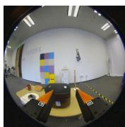

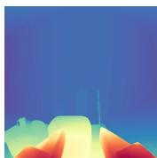  
Step=0

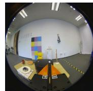

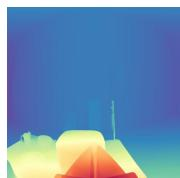  
Step=20

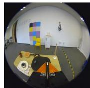

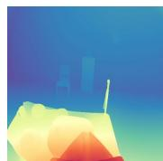  
Step=40

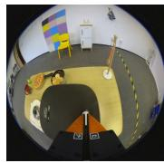

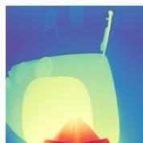  
Step=60

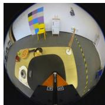

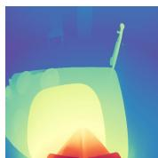  
Step=80

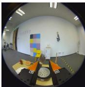

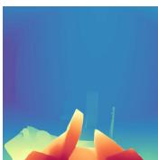  
Step=100

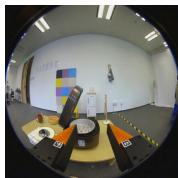

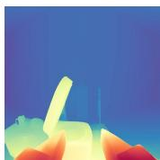  
Step=119   
Fig. 7. Illustration of the depth-mapping process from Step 0 to Step 119. The top row displays the cropped GoPro frames (rectified from their original circular format), and the bottom row presents corresponding depth estimations produced by Depth Anything V2.

base-frame or arm-geometry variations, facilitating multiplatform policy transfer.   
• Numerical Stability: Relative trajectories generally show less variability, mitigating outlier effects and improving generalization to novel configurations.

During inference, the policy outputs relative poses, which are subsequently mapped back to absolute joint angles via the robot’s kinematic model. Our evaluations suggest this baseagnostic approach increases policy robustness and minimizes extreme joint commands, especially under limited first-person observations.

# D. Depth-Enhanced Diffusion Policy

We apply DP from the original UMI (which includes relative TCP trajectory prediction and latency matching) to our robotic platform, and observe promising initial results. However, we identify a limitation: the DP struggle with tasks requiring high precision in depth estimation. For instance, it occasionally fails to accurately reach the target or prematurely closed the grippers. This reveals the inadequacy of the current policy when operating without depth information, especially in scenarios where precise spatial reasoning is essential.

To address this issue, we incorporate depth information to improve the original DP, resulting in a variant, called Depth-Enhanced DP. While existing works incorporating depth into DP often rely on dedicated sensors to capture real-time depth data [46, 24], we aim to explore a more lightweight and efficient approach without adding hardware complexity or additional costs. Specifically, we adopt a post-processing strategy to generate depth maps. Using the open-source depth estimation tool Depth Anything V2 [43], we supplement each frame in our dataset with corresponding depth maps. However, our images, which include significant black margins, negatively impact the performance of Depth Anything V2. To overcome this challenge, we pre-process the images by cropping them to retain only the rectangular regions inscribed within the circles and resizing them to $4 4 8 \times 4 4 8$ , as shown in Fig. 7. This ensures both high-quality depth maps and a focus on the operational areas associated with the grippers. Furthermore, the RGB images are also cropped along the black

margins on both sides, followed by resizing to $4 4 8 \times 4 4 8$ , in order to enhance the accuracy of image observation.

During training, we expand the single-channel depth data into three-channel pseudo-color depth maps, which are then encoded alongside the RGB images using the same ViT-based CLIP visual encoder (ViT-Base Patch 16, input $2 2 4 \times 2 2 4$ ) [32] respectively. The resulting embeddings are concatenated and used for downstream processing. For real-time inference during the diffusion policy rollout, we implement Depth Anything V2 with its large pre-trained model [43], achieving an inference frequency of $2 \mathbf { 0 } \ \mathbf { H } \mathbf { z }$ on an RTX 4090 GPU. This improvement is achieved without the need for additional sensors or multi-view camera setups, providing a practical and efficient solution to enhance policy performance in precisioncritical applications.

# E. Dynamic Error-Compensation Algorithm

Non-parallel-jaw grippers on robotic arms can shift the TCP as the jaws close. Because the jaws move inward, the effective TCP often translates along the gripper’s local Z-axis, leading to misalignment in tasks that require fine precision, such as picking up small objects. To mitigate these shifts, we propose a dynamic error-compensation algorithm that adjusts the commanded TCP in real time. It includes two stages.

Stage 1: Compensation Distance. Let $W ( i )$ be the measured gripper width at frame i, and denote the gripper’s maximum width by $W _ { \mathrm { m a x } }$ . We define a compensation distance $d ( i )$ to counteract TCP displacement caused by non-parallel jaws. Let $d _ { \mathrm { c l o s e } }$ be the maximum compensation distance when the gripper is fully closed, and $d _ { \mathrm { o p e n } }$ be the minimum distance when it is fully open. We then compute

$$
d (i) = d _ {\text {c l o s e}} - \frac {d _ {\text {c l o s e}} - d _ {\text {o p e n}}}{W _ {\max }} W (i). \tag {9}
$$

As $W ( i )$ decreases, the end-effector is shifted further along the negative Z-axis of TCP frame, thereby offsetting the forward motion introduced by closing gripper jaws.

Stage 2: Pose Correction. Let $\mathbf { p } _ { \mathrm { e e } } ^ { ( i ) }$ and $\mathbf { R } _ { \mathrm { e e } } ^ { ( i ) }$ be the desired TCP position and orientation at frame $i$ , respectively. The rotation matrix $\mathbf { R } _ { \mathrm { e e } } ^ { ( i ) }$ defines the TCP coordinate frame’s orientation

relative to the robot’s base frame. To determine the direction of displacement, we first extract the TCP frame’s local Z-axis, expressed in the base coordinate frame:

$$
\mathbf {z} _ {\text {a x i s}} ^ {(i)} = \mathbf {R} _ {\mathrm {e e}} ^ {(i)} \hat {\mathbf {e}} _ {z}, \tag {10}
$$

where $\hat { \mathbf { e } } _ { z } = [ 0 , 0 , 1 ] ^ { \top }$ is the local Z-axis of the TCP coordinate frame. The corrected TCP position $\mathbf { p } _ { \mathrm { e e } } ^ { \prime ( i ) }$ in the base coordinate frame is then computed as:

$$
\mathbf {p} _ {\mathrm {e e}} ^ {\prime (i)} = \mathbf {p} _ {\mathrm {e e}} ^ {(i)} - d (i) \mathbf {z} _ {\text {a x i s}} ^ {(i)}. \tag {11}
$$

Finally, inverse kinematics (IK) is solved using the corrected TCP position $\mathbf { p } _ { \mathrm { e e } } ^ { \prime ( i ) }$ , while maintaining the original orientation $\mathbf { R } _ { \mathrm { e e } } ^ { ( i ) }$ , yielding the joint vector $\theta ^ { ( i ) }$ :

$$
\boldsymbol {\theta} ^ {(i)} = \mathrm {I K} \left(\mathbf {p} _ {\mathrm {e e}} ^ {\prime (i)}, \mathbf {R} _ {\mathrm {e e}} ^ {(i)}\right). \tag {12}
$$

# V. OPEN-SOURCE DATASET

# A. Dataset Overview

We present the FastUMI Dataset, consisting of 10,000 demonstration sequences, each containing synchronized Go-Pro video and end-effector trajectories captured in domestic settings. The dataset covers 22 tasks, 19 object categories, and 12 distinct manipulation skills, with each demonstration lasting approximately 6-12 seconds, where most demonstrations are 9 seconds. Fig. 8 (Left) illustrates representative frames from selected collection environments; orange text boxes denote specific tasks, while blue numerals indicate corresponding demonstration counts. Fig. 8 (Right) provides two distribution plots: the upper plot details task-level proportions, whereas the lower plot illustrates the breakdown of manipulation skills (e.g., pick, open, etc.).

# B. Dataset Acquisition Process

The dataset is collected by five operators using three FastUMI devices, ensuring diversity in user interactions and environmental contexts. Each recorded task involves a fixed target object (e.g., a specific drawer or container), while the surrounding background (e.g., table clutter, lighting) is randomized to introduce variability. During acquisition, operators utilize RVIZ for real-time visualization, enabling verification of the T265 sensor output and ensuring high-quality demonstrations. We enforce a quality-assurance protocol by continuously monitoring critical metrics (e.g., T265 tracking confidence) and discarding or re-recording sequences affected by sensor drift.

# C. Dataset Storage and Format

All raw sensor data are initially recorded locally before undergoing post-processing. To support various imitation learning and control paradigms, we provide multiple data representations—most notably, joint trajectories and TCP trajectories. Each demonstration is stored in a dedicated HDF5 file, encapsulating both observations (e.g., images, tracked poses) and actions (e.g., gripper commands) within a unified dataset. For broader compatibility, we also provide scripts to convert HDF5

files into Zarr format, which maintains a hierarchical structure while offering greater flexibility in storage backends, chunking, compression, and parallel access. Detailed specifications of the dataset schema and file organization are provided in Section X-B.

# VI. SYSTEM EVALUATION

We assess our system across four primary dimensions: 1) Data Quality, 2) Baseline Performance, 3) Algorithmic Enhancements, and 4) Additional Factors, detailed in Sections VI-A, VI-B, VI-C, and VI-D, respectively. Initially, we evaluate the reliability of the T265 and MINI modules in pose tracking to ensure that the collected data meets the prerequisites for downstream applications. Subsequently, we demonstrate the system’s effectiveness through extensive experiments encompassing a variety of manipulation tasks, thereby highlighting its robustness using baseline ACT and DP methodologies. We then quantify the improvements in task success rates attributable to our algorithmic refinements. Finally, we examine additional variables, such as the utilization of fisheye cameras and the size of the training dataset, to evaluate their influence on policy performance.

Prior to presenting the experimental results, we introduce the 12 tasks employed for policy inference evaluation, as illustrated in Fig. 9. These tasks are designed to encompass a broad spectrum of real-world manipulation challenges, including hinged operations and pick-and-place activities, thereby providing a comprehensive benchmark for assessing the proposed system. Unless otherwise specified, all experiments are conducted using an xArm 6 robotic platform.

# A. Data Quality

In TABLE I, we summarize the pose estimation errors of both T265 and MINI across three representative tasks: “Pick Cup,” a straightforward pick-and-place action (as shown in Fig. 10 Right); “Open container,” which involves hinged motion and partial occlusion; and “Rearrange Coke,” a more complex scenario with substantial occlusion. To establish ground-truth trajectories, four reflective markers are affixed to the handheld device and tracked by an optical motion-capture system (Fig. 10 Left). Simultaneously, the device poses are recorded through our data collection pipeline. All data streams are synchronized within ROS via unified timestamps, and ten trajectories per sensor are collected for each task. The evo toolkit is used to compute all reported errors [21].

In the “Pick Cup” scenario, where occlusion is minimal, T265 achieves an average positioning error of $1 0 . 5 ~ \mathrm { m m }$ , while MINI’s error averages $1 5 . 2 \mathrm { \ m m }$ . In the “Open Container,” T265’s error increases to $1 7 . 7 ~ \mathrm { \ m m }$ , reflecting the partial obstruction of its field of view, whereas MINI’s error decreases to $1 1 . 2 ~ \mathrm { \ m m }$ . T265’s performance degrades further in the “Rearrange Coke,” where placing an object inside a cabinet induces significant occlusion. These findings indicate that T265 is particularly susceptible to severe visual obstruction at close range. In contrast, MINI demonstrates relatively stable cross-task performance—albeit with slightly reduced accuracy

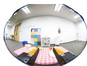  
Pick Bread

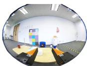  
Pick Pen

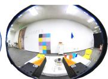  
Pick Lid

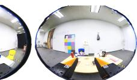  
Sweep Trash   
512

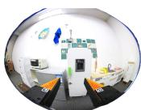  
Open   
Container

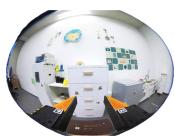  
Open   
Drawer

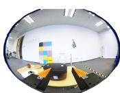  
Open   
Ricecooker

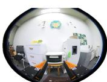  
Open   
Roaster

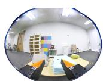  
  
Open

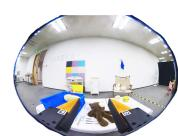  
Pick Bear

Pick Bear Pick Bear

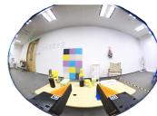  
  
546   
Clear Table

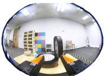  
Close   
Ricecooker

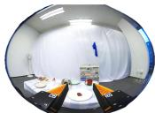  
Cover Beef

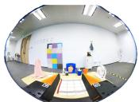  
Fold Towel

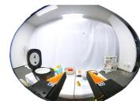  
Place Hotdog   
in Ricecooker   
100

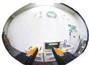  
Place Hotdog   
in Roaster

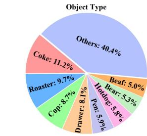  
  
500   
50F

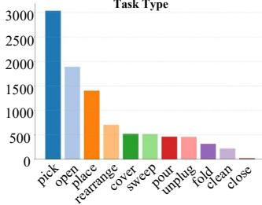

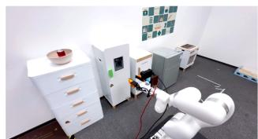  
Fig. 8. Left: Representative GoPro frames from the FastUMI dataset, with orange labels indicating specific tasks and blue numerals showing demonstration counts. Right: Two distribution plots—the top plot depicts the proportion of various tasks in the dataset, while the bottom plot shows the distribution of manipulation skills.   
(1) Open Container

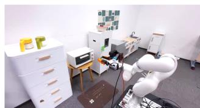  
(2) Open Roaster

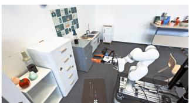  
(3) Open Drawer

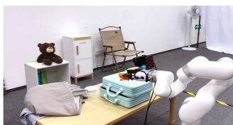  
(4) Open Suitcase

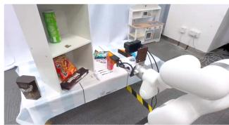  
(5) Rearrange Coke

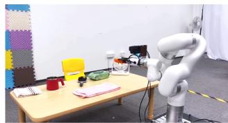  
(6) Fold Towel

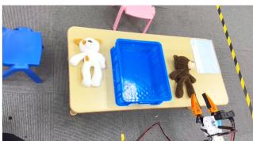  
(7)Pick Bear

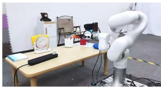  
(8) Unplug Charger

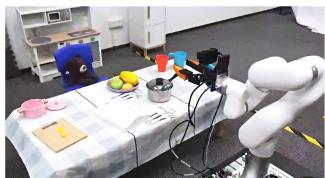  
(9)Pick Lid

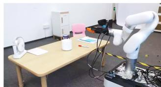  
(10) Pick Pen

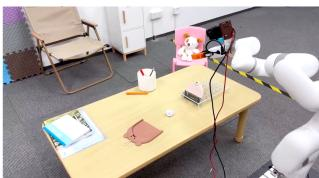  
(11) Sweep Trash

  
(12) Open Ricecooker   
Fig. 9. Twelve tasks used for policy inference evaluation, covering a broad range of real-world manipulation challenges. These include hinged operations (Tasks 1–4), pick-and-place activities (Tasks 5–10), pick-push manipulation (Task 11), and button press actions (Task 12), providing a comprehensive benchmark for the proposed system.

in low-occlusion scenarios. T265 offers superior localization when visual inputs are largely unobstructed, whereas MINI exhibits more consistent performance under varying levels of occlusion. We also observe that the VIO error typically remains low at the beginning and end of each trajectory but grows noticeably in the middle. Fig. 11 illustrates this pattern for T265 during the “Pick Cup” task: as the gripper moves closer to the table, occlusion reduces visible features and causes two pronounced error peaks. During intermediate movement, partial visibility leads to moderate errors, though

still higher than at the outset. By the final stage, returning to the original viewpoint restores abundant features, and loopclosure mechanisms recover tracking accuracy to near-initial levels.

# B. Baseline Performance

We conduct a comparative study of two baseline approaches for policy inference—ACT with absolute joint-space outputs and DP with relative TCP-based outputs—across 12 diverse manipulation tasks. Each task is trained on 200 demonstrations, randomly selected from our open-source dataset. Among

TABLE I ERROR ANALYSIS OF TRAJECTORIES FOR DIFFERENT TASKS (VALUES IN MM).   

<table><tr><td>Pose Tracking Module</td><td>Task</td><td>Traj 1</td><td>Traj 2</td><td>Traj 3</td><td>Traj 4</td><td>Traj 5</td><td>Traj 6</td><td>Traj 7</td><td>Traj 8</td><td>Traj 9</td><td>Traj 10</td></tr><tr><td rowspan="3">RealSense T265</td><td>Pick Cup</td><td>11</td><td>10</td><td>12</td><td>11</td><td>11</td><td>12</td><td>11</td><td>10</td><td>7</td><td>10</td></tr><tr><td>Open Container</td><td>19</td><td>16</td><td>18</td><td>17</td><td>19</td><td>17</td><td>17</td><td>17</td><td>18</td><td>19</td></tr><tr><td>Rearrange Coke</td><td>36</td><td>21</td><td>21</td><td>20</td><td>19</td><td>22</td><td>21</td><td>25</td><td>22</td><td>26</td></tr><tr><td rowspan="2">RoboBaton MINI</td><td>Pick Cup</td><td>17</td><td>15</td><td>16</td><td>14</td><td>13</td><td>15</td><td>15</td><td>14</td><td>16</td><td>17</td></tr><tr><td>Open Container</td><td>10</td><td>11</td><td>10</td><td>11</td><td>11</td><td>12</td><td>11</td><td>12</td><td>12</td><td>12</td></tr></table>

TABLE II SUCCESS RATES FOR DP AND ACT IN DIFFERENT TASKS, SORTED BY MANIPULATION TYPE.   

<table><tr><td>Index</td><td>Task</td><td>Manipulation Type</td><td>Success Rate (%) of DP (Relative TCP)</td><td>Success Rate (%) of ACT (Absolute Joint)</td></tr><tr><td>1</td><td>Open Container</td><td>Hinged</td><td>93.33</td><td>86.67</td></tr><tr><td>2</td><td>Open Roaster</td><td>Hinged</td><td>80.00</td><td>86.67</td></tr><tr><td>3</td><td>Open Drawer</td><td>Hinged</td><td>53.33</td><td>80.00</td></tr><tr><td>4</td><td>Open Suitcase</td><td>Hinged</td><td>40.00</td><td>86.67</td></tr><tr><td>5</td><td>Rearrange Coke</td><td>Pick-Place</td><td>80.00</td><td>86.67</td></tr><tr><td>6</td><td>Fold Towel</td><td>Pick-Place</td><td>93.33</td><td>73.33</td></tr><tr><td>7</td><td>Pick Bear</td><td>Pick-Place</td><td>80.00</td><td>20.00</td></tr><tr><td>8</td><td>Unplug Charger</td><td>Pick-Place</td><td>86.67</td><td>86.67</td></tr><tr><td>9</td><td>Pick Lid</td><td>Pick-Place</td><td>53.33</td><td>93.33</td></tr><tr><td>10</td><td>Pick Pen</td><td>Pick-Place</td><td>53.33</td><td>20.00</td></tr><tr><td>11</td><td>Sweep Trash</td><td>Pick-Push</td><td>46.67</td><td>6.67</td></tr><tr><td>12</td><td>Open Ricecooker</td><td>Button Press</td><td>20.00</td><td>80.00</td></tr></table>

  
Fig. 10. Left: Four reflective markers attached to the FastUMI handheld device, tracked by an optical motion-capture system for ground-truth trajectory collection. Right: Example scenarios from the “Pick Cup” task.

  
Fig. 11. Representative T265 VIO error over time during the “Pick Cup” task. Error peaks appear when the gripper nears the table and occludes visual features, then recover once it returns to the original viewpoint.

the 200 pieces of data, every 50 pieces are a group. The robotic arm’s initial configuration and environment in one group are fixed, while the target object’s position varies within a predefined range. Across groups, both the arm’s starting pose and the scene arrangement are altered. Each algorithm is trained on the same training data. During testing, we use object poses that appear in the training set but place them in new scene contexts. Each task is attempted 15 times, and success rates are recorded.

The results are shown in TABLE II. Both ACT and DP achieve relatively high success rates on most tasks, indicating that the collected dataset is sufficiently diverse and general to support different policy representations. Notably, tasks involving substantial occlusion (e.g., “Rearrange Coke” and “Open Container”) can still be effectively handled, suggesting that our data collection strategy is robust to partial visibility.

In tasks requiring precise depth estimation —such as “Open Drawer,” “Pick Lid,” and “Open Ricecooker”—the baseline DP algorithm’s limitations become evident. In particular, DP struggled with pressing actions in “Open Ricecooker,” where small deviations in relative motion can prevent successful button presses. By contrast, in the baseline ACT algorithm, tasks like “Open Suitcase,” exhibit more accurate depth reasoning but less sensitivity to specific trajectory requirements. In “Pick Bear,” ACT occasionally generates joint configurations unseen during training (e.g., producing a fully inverted gripper posture when the dataset predominantly showed a downward TCP orientation), which highlights a known limitation of the original ACT approach, typically reliant on third-person viewpoints

for global state estimation. Similar issues arise in “Pick Pen” and “Sweep Trash,” with the latter also revealing a workspace mismatch: ACT’s absolute joint predictions sometimes yield unreachable targets if training data contained trajectories that exceeded the xArm’s operational envelope. By contrast, DP’s incremental relative-position strategy partly alleviated this problem, although multi-step tasks like “Sweep Trash” remain challenging for both models.

# C. Algorithmic Enhancements

We evaluate our algorithmic refinements on two tasks—“Pick Lid” and “Open Ricecooker”—where the baseline DP approach most struggles with depth estimation. We retain the same training data and parameters as in the previous experiment for both ACT and DP, and employ the same testing protocol.

In the Depth-Enhanced DP, we incorporate depth information into the original DP algorithm. As shown in TA-BLE III, success rates increase by $2 6 . 6 7 \%$ on “Pick Lid” and $7 3 . 3 3 \%$ on “Open Ricecooker.” These results highlight the importance of depth cues for precise object manipulation tasks, particularly those requiring accurate vertical alignment or force application. For ACT, we introduce two variants called Smooth-ACT and PoseACT, which incorporate GRU-based temporal modeling and integrates TCP (end-effector state) inputs. We demonstrate that these two variants yield substantial improvements in success rate compared to the original ACT, as shown in TABLE IV. Furthermore, we explore relative TCP to reduce dependence on absolute coordinates, aiming to capture the shape and dynamics of the trajectory more robustly. As the table indicates, this enhancement performs well on tasks featuring extended or repetitive trajectories (e.g., “Sweep Trash”). However, for tasks requiring precise height estimation (such as “Pick Bear”), removing absolute pose information can degrade vertical positioning accuracy, underscoring a trade-off between relative and absolute coordinate representations.

TABLE III COMPARISON OF SUCCESS RATES FOR DP AND DP $^ +$ DEPTH IN TASKS WITH SIGNIFICANT DEPTH-ESTIMATION CHALLENGES.   

<table><tr><td>Task</td><td>Success Rate (%) of Original DP</td><td>Success Rate (%) of Depth-Enhanced DP</td></tr><tr><td>Pick Lid</td><td>53.33%</td><td>80.00%</td></tr><tr><td>Open Ricecooker</td><td>20.00%</td><td>93.33%</td></tr></table>

TABLE IV COMPARISON OF SUCCESS RATES FOR DIFFERENT ACT VARIANTS ACROSS REPRESENTATIVE TASKS.   

<table><tr><td rowspan="2">Task</td><td colspan="2">Joint</td><td colspan="2">TCP</td></tr><tr><td>ACT</td><td>Smooth-ACT</td><td>PoseACT (Absolute)</td><td>PoseACT (Relative)</td></tr><tr><td>Pick Bear</td><td>20.00%</td><td>60.00%</td><td>80.00%</td><td>73.33%</td></tr><tr><td>Sweep Trash</td><td>6.67%</td><td>26.67%</td><td>53.33%</td><td>60.00%</td></tr></table>

# D. Additional Factors

We further investigate the influence of camera configurations and training data size on policy inference performance. TABLE V compares different camera setups for both pickand-place and hinged operations. For each configuration (i.e., camera model and lens type), we collected 50 demonstrations under identical scene settings, with only the target object’s position randomly varied within a small range. All trajectories were obtained via direct teleoperation. The original ACT algorithm is then evaluated on object positions seen during training but under new trials, each repeated 15 times to compute the success rate. Notably, a fisheye lens at the end-effector achieves performance comparable to multi-view setups, potentially because its wide field of view captures richer contextual information for decision-making.

Next, to assess how the amount of training data affects generalization, we conducted an experiment on a “Pick Cup” task with 200, 400, and 800 demonstrations (TABLE VI). In this scenario, the cup and coaster were each placed in five distinct positions, repeated three times with different handle orientations. The original ACT model must learn not only positional information but also handle orientation to generate an appropriate grasp trajectory. As the dataset grew larger, success rates significantly improved, indicating that data abundance bolsters the model’s capacity to generalize across varied object placements and orientations.

TABLE V COMPARISON OF TASK PERFORMANCE UNDER VARYING CAMERA SETUPS (LENS TYPE AND VIEWPOINT).   

<table><tr><td></td><td>D435i
(First-Person)</td><td>GoPro with Flat Lens
(First-Person)</td></tr><tr><td>Pick Bear</td><td>0%</td><td>6.67%</td></tr><tr><td>Open Container</td><td>0%</td><td>93.33%</td></tr><tr><td></td><td>D435i
(First-Person&amp;Third-person)</td><td>GoPro with Fisheye Lens
(First-Person)</td></tr><tr><td>Pick Bear</td><td>86.67%</td><td>80.00%</td></tr><tr><td>Open Container</td><td>100.00%</td><td>100.00%</td></tr></table>

TABLE VI SUCCESS RATES IN THE “PICK CUP” TASK USING DIFFERENT TRAINING DATASET SIZES.   

<table><tr><td>Task</td><td>Data Size (200)</td><td>Data Size (400)</td><td>Data Size (800)</td></tr><tr><td>Pick Cup</td><td>20.00%</td><td>26.67%</td><td>53.33%</td></tr></table>

# VII. LIMITATIONS

While FastUMI demonstrates effective policy execution across diverse tasks, several limitations remain:

1) Limited Sensing Modalities. FastUMI currently relies on visual data, which may prove insufficient for tasks requiring precise force or tactile feedback—such as handling fragile objects. Integrating tactile or force sensors could enable richer environmental representations and more robust policy learning,

particularly for tasks necessitating delicate or high-precision interactions.

2) Restricted Robot Compatibility. Although FastUMI accommodates single-arm or dual-arm platforms, it is not yet adapted for more complex morphologies, including mobile manipulators requiring whole-body control. Future endeavors could focus on expanding the hardware and software ecosystem to support advanced platforms with larger workspaces and non-static bases.

3) Wired Data Transfer. Reliance on wired connections constrains portability and limits field applications where mobility or standalone operation is pivotal. A wireless solution with onboard processing or seamless network connectivity would greatly expand FastUMI’s applicability and facilitate broader deployment.

# VIII. RELATED WORK

# A. Data Collection Methods

High-quality data is fundamental to the success of learning algorithms [4]. Here, we introduce several data collection systems and compare them to our Fast-UMI. Teleoperated systems represent one of the most widely adopted methodologies for data collection in imitation learning. This approach enables researchers to intuitively gather demonstration data, establishing a direct correspondence between observed visual inputs and associated actions [48]. Various control interfaces, including AR controllers [31, 8], haptic controllers [29, 13], 3D spacemouses [27], and newly explored leader-follower systems [42] are developed to build teleoperated systems. However, these systems inherently depend on real robotic arms during data collection. Additionally, hardware-specific constraints often necessitate modifications to enable crossplatform compatibility, significantly reducing efficiency. In contrast, Fast-UMI requires only a handheld device, enabling portable and flexible data collection.

An alternative data collection paradigm involves capturing multi-view human demonstration videos. Robots can extract actionable knowledge from these recordings by leveraging adversarial learning objectives [28], contextualized annotations [37], and hybrid CNN-probabilistic parsing techniques [44]. This approach circumvents the need for physical robotic platforms and facilitates the construction of reusable datasets. However, it presents several inherent limitations. Since the action data are inferred from raw videos, these actions sometimes may not precisely reflect the true actions, which hinders the formation of generalizable policies. Furthermore, the embodiment mismatch remains a persistent challenge, as discrepancies between the domain in which data is collected and the deployment environment can lead to policy failures [15]. In contrast, Fast-UMI directly collects precise action information during demonstrations and minimizes domain shift by aligning video observation of wrist-mounted cameras on both the hand-held device and the on-robot device.

Sensor-enhanced interfaces (i.e., handheld grippers) offer a promising alternative for data collection, addressing some

of the aforementioned challenges. However, obtaining precise TCP pose information remains nontrivial. Existing solutions incorporate SLAM-based estimation from video streams [10], motion capture systems [40], and vision-based tracking algorithms [36]. These techniques, however, often necessitate extensive post-processing or rely on fixed infrastructure, reducing overall efficiency. In contrast, Fast-UMI employs the T265 to directly capture accurate pose data, eliminating the need for cumbersome SLAM pipelines or motion capture systems. Additionally, its wrist-mounted gopro camera records highresolution visual data at variable frame rates, providing a rich observational dataset to support policy learning.

# B. Imitation Learning

Unlike methods that heavily rely on human programming [1] and task-specific reward functions [2, 11], Imitation Learning (IL) enables robots to autonomously perform tasks by learning from expert demonstrations [34, 22, 17, 38, 45]. With the large-scale collection of robotic manipulation datasets in recent years [30, 39, 5, 25, 23, 18], IL has been widely adopted in robotic manipulation, demonstrating remarkable performance across diverse task domains. Depending on the nature of the collected data, IL algorithms can leverage realrobot demonstrations [49, 19, 35], video-based observations without explicit action labels [40, 3], or data obtained from decoupled handheld tracking devices [10, 14, 33]. Furthermore, in dexterous hand manipulation tasks, IL has been extended to learn from human hand motion demonstrations [41, 8]. The ACT algorithm applies imitation learning to absolute joint pose data collected from robotic arms and utilizes temporal ensemble techniques over fixed-length action sequences to enable smooth and autonomous dual-arm control [49]. The work [35] integrates a language modality into the ACT algorithm, finetuning a vision-language model to facilitate language-based interaction with dual-arm robots. DP generates actions in the robotic action space through a conditional denoising process, offering advantages such as expressing multimodal action distributions, handling high-dimensional output spaces, and providing stable training [9]. UMI demonstrates that UMIlike data can be effectively used to train diffusion policy, and yield promising results [10]. In our work, we validate our system’s performance using data collected through ACT [49] and DP [9]. We further analyze the characteristics of the data collected by Fast-UMI and evaluate its impact on these algorithms. Based on this analysis, we implement a series of optimizations and adaptations, enhancing the performance of these algorithms when applied to Fast-UMI data.

# IX. CONCLUSION

In this work, we introduce FastUMI, a redesigned system built on the original UMI to streamline real-world data collection for robotic manipulation. Our hardware modifications enable quick deployment across diverse arms and grippers, removing dependencies on specialized components. By replacing complex SLAM with T265-based tracking, FastUMI

reduces calibration overhead and maintains robust performance despite occlusions. We also open-source a dataset of 10,000 real-world demonstrations spanning 22 everyday tasks. Experiments confirm that FastUMI lowers costs, simplifies deployment, and supports large-scale data-driven policy learning. Future work will focus on integrating richer sensing modalities and extending FastUMI to more complex platforms.

# REFERENCES

[1] Constructions Aeronautiques, Adele Howe, Craig Knoblock, ISI Drew McDermott, Ashwin Ram, Manuela Veloso, Daniel Weld, David Wilkins Sri, Anthony Barrett, Dave Christianson, et al. Pddl— the planning domain definition language. Technical Report, Tech. Rep., 1998.   
[2] Kai Arulkumaran, Marc Peter Deisenroth, Miles Brundage, and Anil Anthony Bharath. Deep reinforcement learning: A brief survey. IEEE Signal Processing Magazine, 34(6):26–38, 2017.   
[3] Shikhar Bahl, Abhinav Gupta, and Deepak Pathak. Human-to-robot imitation in the wild, 2022. URL https://arxiv.org/abs/2207.09450.   
[4] Suneel Belkhale, Yuchen Cui, and Dorsa Sadigh. Data Quality in Imitation Learning. In A. Oh, T. Naumann, A. Globerson, K. Saenko, M. Hardt, and S. Levine, editors, Advances in Neural Information Processing Systems, volume 36, pages 80375– 80395. Curran Associates, Inc., 2023. URL https: //proceedings.neurips.cc/paper files/paper/2023/file/ fe692980c5d9732cf153ce27947653a7-Paper-Conference. pdf.   
[5] Anthony Brohan, Noah Brown, Justice Carbajal, Yevgen Chebotar, Joseph Dabis, Chelsea Finn, Keerthana Gopalakrishnan, Karol Hausman, Alex Herzog, Jasmine Hsu, et al. Rt-1: Robotics transformer for real-world control at scale. arXiv preprint arXiv:2212.06817, 2022.   
[6] Serkan Cabi, Sergio Gomez Colmenarejo, Alexander ´ Novikov, Ksenia Konyushkova, Scott Reed, Rae Jeong, Konrad Zolna, Yusuf Aytar, David Budden, Mel Vecerik, Oleg Sushkov, David Barker, Jonathan Scholz, Misha Denil, Nando de Freitas, and Ziyu Wang. Scaling data-driven robotics with reward sketching and batch reinforcement learning, 2020. URL https://arxiv.org/abs/ 1909.12200.   
[7] Carlos Campos, Richard Elvira, Juan J Gomez ´ Rodr´ıguez, Jose MM Montiel, and Juan D Tard ´ os. ´ Orb-slam3: An accurate open-source library for visual, visual–inertial, and multimap slam. IEEE Transactions on Robotics, 37(6):1874–1890, 2021.   
[8] Sirui Chen, Chen Wang, Kaden Nguyen, Li Fei-Fei, and C Karen Liu. Arcap: Collecting high-quality human demonstrations for robot learning with augmented reality feedback. arXiv preprint arXiv:2410.08464, 2024.   
[9] Cheng Chi, Zhenjia Xu, Siyuan Feng, Eric Cousineau, Yilun Du, Benjamin Burchfiel, Russ Tedrake, and Shuran Song. Diffusion policy: Visuomotor policy learning via

action diffusion. The International Journal of Robotics Research, page 02783649241273668, 2023.   
[10] Cheng Chi, Zhenjia Xu, Chuer Pan, Eric Cousineau, Benjamin Burchfiel, Siyuan Feng, Russ Tedrake, and Shuran Song. Universal manipulation interface: In-thewild robot teaching without in-the-wild robots. arXiv preprint arXiv:2402.10329, 2024.   
[11] Christian Daniel, Malte Viering, Jan Metz, Oliver Kroemer, and Jan Peters. Active reward learning. In Robotics: Science and systems, volume 98, 2014.   
[12] Rahul Dey and Fathi M Salem. Gate-variants of gated recurrent unit (gru) neural networks. In 2017 IEEE 60th international midwest symposium on circuits and systems (MWSCAS), pages 1597–1600. IEEE, 2017.   
[13] Runyu Ding, Yuzhe Qin, Jiyue Zhu, Chengzhe Jia, Shiqi Yang, Ruihan Yang, Xiaojuan Qi, and Xiaolong Wang. Bunny-VisionPro: Real-Time Bimanual Dexterous Teleoperation for Imitation Learning, July 2024. URL http://arxiv.org/abs/2407.03162. arXiv:2407.03162 [cs].   
[14] Kiran Doshi, Yijiang Huang, and Stelian Coros. On hand-held grippers and the morphological gap in human manipulation demonstration. arXiv preprint arXiv:2311.01832, 2023.   
[15] Chrisantus Eze and Christopher Crick. Learning by Watching: A Review of Video-based Learning Approaches for Robot Manipulation, September 2024. URL http://arxiv.org/abs/2402.07127. arXiv:2402.07127 [cs].   
[16] Wen Fan, Xiaoqing Guo, Enyang Feng, Jialin Lin, Yuanyi Wang, Jiaming Liang, Martin Garrad, Jonathan Rossiter, Zhengyou Zhang, Nathan Lepora, Lei Wei, and Dandan Zhang. Digital twin-driven mixed reality framework for immersive teleoperation with haptic rendering. IEEE Robotics and Automation Letters, 8(12): 8494–8501, 2023. doi: 10.1109/LRA.2023.3325784.   
[17] Bin Fang, Shidong Jia, Di Guo, Muhua Xu, Shuhuan Wen, and Fuchun Sun. Survey of imitation learning for robotic manipulation. International Journal of Intelligent Robotics and Applications, 3:362–369, 2019.   
[18] Hao-Shu Fang, Hongjie Fang, Zhenyu Tang, Jirong Liu, Chenxi Wang, Junbo Wang, Haoyi Zhu, and Cewu Lu. Rh20t: A comprehensive robotic dataset for learning diverse skills in one-shot. In 2024 IEEE International Conference on Robotics and Automation (ICRA), pages 653–660. IEEE, 2024.   
[19] Zipeng Fu, Tony Z Zhao, and Chelsea Finn. Mobile aloha: Learning bimanual mobile manipulation with low-cost whole-body teleoperation. arXiv preprint arXiv:2401.02117, 2024.   
[20] S. Garrido-Jurado, R. Munoz-Salinas, F.J. Madrid- ˜ Cuevas, and M.J. Mar´ın-Jimenez. Automatic genera- ´ tion and detection of highly reliable fiducial markers under occlusion. Pattern Recognition, 47(6):2280–2292, 2014. ISSN 0031-3203. doi: https://doi.org/10.1016/ j.patcog.2014.01.005. URL https://www.sciencedirect. com/science/article/pii/S0031320314000235.   
[21] Michael Grupp. evo: Python package for the evaluation

of odometry and slam. https://github.com/MichaelGrupp/ evo, 2017.   
[22] Ahmed Hussein, Mohamed Medhat Gaber, Eyad Elyan, and Chrisina Jayne. Imitation learning: A survey of learning methods. ACM Computing Surveys (CSUR), 50 (2):1–35, 2017.   
[23] Dmitry Kalashnikov, Alex Irpan, Peter Pastor, Julian Ibarz, Alexander Herzog, Eric Jang, Deirdre Quillen, Ethan Holly, Mrinal Kalakrishnan, Vincent Vanhoucke, et al. Scalable deep reinforcement learning for visionbased robotic manipulation. In Conference on robot learning, pages 651–673. PMLR, 2018.   
[24] Tsung-Wei Ke, Nikolaos Gkanatsios, and Katerina Fragkiadaki. 3d diffuser actor: Policy diffusion with 3d scene representations. arXiv preprint arXiv:2402.10885, 2024.   
[25] Alexander Khazatsky, Karl Pertsch, Suraj Nair, Ashwin Balakrishna, Sudeep Dasari, Siddharth Karamcheti, Soroush Nasiriany, Mohan Kumar Srirama, Lawrence Yunliang Chen, Kirsty Ellis, et al. Droid: A large-scale in-the-wild robot manipulation dataset. arXiv preprint arXiv:2403.12945, 2024.   
[26] Sergey Levine, Peter Pastor, Alex Krizhevsky, and Deirdre Quillen. Learning hand-eye coordination for robotic grasping with deep learning and large-scale data collection, 2016. URL https://arxiv.org/abs/1603.02199.   
[27] Huihan Liu, Soroush Nasiriany, Lance Zhang, Zhiyao Bao, and Yuke Zhu. Robot learning on the job: Humanin-the-loop autonomy and learning during deployment. The International Journal of Robotics Research, page 02783649241273901, October 2024. ISSN 0278-3649. doi: 10.1177/02783649241273901. URL https://doi.org/ 10.1177/02783649241273901. Publisher: SAGE Publications Ltd STM.   
[28] Oier Mees, Markus Merklinger, Gabriel Kalweit, and Wolfram Burgard. Adversarial Skill Networks: Unsupervised Robot Skill Learning from Video. In 2020 IEEE International Conference on Robotics and Automation (ICRA), pages 4188–4194, May 2020. doi: 10.1109/ ICRA40945.2020.9196582. URL https://ieeexplore.ieee. org/abstract/document/9196582. ISSN: 2577-087X.   
[29] Parker Owan, Joseph Garbini, and Santosh Devasia. Faster Confined Space Manufacturing Teleoperation Through Dynamic Autonomy With Task Dynamics Imitation Learning. IEEE Robotics and Automation Letters, 5(2):2357–2364, April 2020. ISSN 2377-3766. doi: 10.1109/LRA.2020.2970653. URL https://ieeexplore. ieee.org/abstract/document/8976114. Conference Name: IEEE Robotics and Automation Letters.   
[30] Abby O’Neill, Abdul Rehman, Abhiram Maddukuri, Abhishek Gupta, Abhishek Padalkar, Abraham Lee, Acorn Pooley, Agrim Gupta, Ajay Mandlekar, Ajinkya Jain, et al. Open x-embodiment: Robotic learning datasets and rt-x models: Open x-embodiment collaboration 0. In 2024 IEEE International Conference on Robotics and Automation (ICRA), pages 6892–6903. IEEE, 2024.

[31] Younghyo Park, Jagdeep Singh Bhatia, Lars Ankile, and Pulkit Agrawal. DexHub and DART: Towards Internet Scale Robot Data Collection, November 2024. URL http: //arxiv.org/abs/2411.02214. arXiv:2411.02214 [cs].   
[32] Alec Radford, Jong Wook Kim, Chris Hallacy, Aditya Ramesh, Gabriel Goh, Sandhini Agarwal, Girish Sastry, Amanda Askell, Pamela Mishkin, Jack Clark, et al. Learning transferable visual models from natural language supervision. In International conference on machine learning, pages 8748–8763. PMLR, 2021.   
[33] Felipe Sanches, Geng Gao, Nathan Elangovan, Ricardo V Godoy, Jayden Chapman, Ke Wang, Patrick Jarvis, and Minas Liarokapis. Scalable. intuitive human to robot skill transfer with wearable human machine interfaces: On complex, dexterous tasks. In 2023 IEEE/RSJ International Conference on Intelligent Robots and Systems (IROS), pages 6318–6325. IEEE, 2023.   
[34] Stefan Schaal. Is imitation learning the route to humanoid robots? Trends in cognitive sciences, 3(6):233–242, 1999.   
[35] Lucy Xiaoyang Shi, Zheyuan Hu, Tony Z Zhao, Archit Sharma, Karl Pertsch, Jianlan Luo, Sergey Levine, and Chelsea Finn. Yell at your robot: Improving on-the-fly from language corrections. arXiv preprint arXiv:2403.12910, 2024.   
[36] Shuran Song, Andy Zeng, Johnny Lee, and Thomas Funkhouser. Grasping in the Wild: Learning 6DoF Closed-Loop Grasping From Low-Cost Demonstrations. IEEE Robotics and Automation Letters, 5(3):4978–4985, July 2020. ISSN 2377-3766. doi: 10.1109/LRA. 2020.3004787. URL https://ieeexplore.ieee.org/abstract/ document/9126187. Conference Name: IEEE Robotics and Automation Letters.   
[37] Sumedh Sontakke, Jesse Zhang, Seb Arnold, Karl ´ Pertsch, Erdem Bı yı k, Dorsa Sadigh, Chelsea Finn, and Laurent Itti. RoboCLIP: One Demonstration is Enough to Learn Robot Policies. In A. Oh, T. Naumann, A. Globerson, K. Saenko, M. Hardt, and S. Levine, editors, Advances in Neural Information Processing Systems, volume 36, pages 55681– 55693. Curran Associates, Inc., 2023. URL https: //proceedings.neurips.cc/paper files/paper/2023/file/ ae54ce310476218f26dd48c1626d5187-Paper-Conference. pdf.   
[38] Simon Stepputtis, Joseph Campbell, Mariano Phielipp, Stefan Lee, Chitta Baral, and Heni Ben Amor. Languageconditioned imitation learning for robot manipulation tasks. Advances in Neural Information Processing Systems, 33:13139–13150, 2020.   
[39] Homer Rich Walke, Kevin Black, Tony Z Zhao, Quan Vuong, Chongyi Zheng, Philippe Hansen-Estruch, Andre Wang He, Vivek Myers, Moo Jin Kim, Max Du, et al. Bridgedata v2: A dataset for robot learning at scale. In Conference on Robot Learning, pages 1723– 1736. PMLR, 2023.   
[40] Chen Wang, Linxi Fan, Jiankai Sun, Ruohan Zhang, Li Fei-Fei, Danfei Xu, Yuke Zhu, and Anima Anand-

kumar. Mimicplay: Long-horizon imitation learning by watching human play, 2023. URL https://arxiv.org/abs/ 2302.12422.   
[41] Chen Wang, Haochen Shi, Weizhuo Wang, Ruohan Zhang, Li Fei-Fei, and C Karen Liu. Dexcap: Scalable and portable mocap data collection system for dexterous manipulation. arXiv preprint arXiv:2403.07788, 2024.   
[42] Philipp Wu, Yide Shentu, Zhongke Yi, Xingyu Lin, and Pieter Abbeel. Gello: A general, low-cost, and intuitive teleoperation framework for robot manipulators. In 2024 IEEE/RSJ International Conference on Intelligent Robots and Systems (IROS), pages 12156–12163. IEEE, 2024.   
[43] Lihe Yang, Bingyi Kang, Zilong Huang, Zhen Zhao, Xiaogang Xu, Jiashi Feng, and Hengshuang Zhao. Depth anything v2, 2024. URL https://arxiv.org/abs/2406. 09414.   
[44] Yezhou Yang, Yi Li, Cornelia Fermuller, and Yiannis Aloimonos. Robot Learning Manipulation Action Plans by ”Watching” Unconstrained Videos from the World Wide Web. Proceedings of the AAAI Conference on Artificial Intelligence, 29(1), March 2015. ISSN 2374- 3468. doi: 10.1609/aaai.v29i1.9671. URL https://ojs.aaai. org/index.php/AAAI/article/view/9671. Number: 1.   
[45] Maryam Zare, Parham M Kebria, Abbas Khosravi, and Saeid Nahavandi. A survey of imitation learning: Algorithms, recent developments, and challenges. IEEE Transactions on Cybernetics, 2024.   
[46] Yanjie Ze, Gu Zhang, Kangning Zhang, Chenyuan Hu, Muhan Wang, and Huazhe Xu. 3d diffusion policy. arXiv preprint arXiv:2403.03954, 2024.   
[47] Dandan Zhang, Ziniu Wu, Jin Zheng, Yifan Li, Zheng Dong, and Jialin Lin. Hubotverse: Toward internet of human and intelligent robotic things with a digital twin-based mixed reality framework. IEEE Robotics Automation Magazine, pages 2–12, 2024. doi: 10.1109/ MRA.2024.3417090.   
[48] Tianhao Zhang, Zoe McCarthy, Owen Jow, Dennis Lee, Xi Chen, Ken Goldberg, and Pieter Abbeel. Deep imitation learning for complex manipulation tasks from virtual reality teleoperation, 2018. URL https://arxiv.org/ abs/1710.04615.   
[49] Tony Z Zhao, Vikash Kumar, Sergey Levine, and Chelsea Finn. Learning fine-grained bimanual manipulation with low-cost hardware. arXiv preprint arXiv:2304.13705, 2023.   
[50] Zhaxizhuoma, Pengan Chen, Ziniu Wu, Jiawei Sun, Dong Wang, Peng Zhou, Nieqing Cao, Yan Ding, Bin Zhao, and Xuelong Li. Alignbot: Aligning vlm-powered customized task planning with user reminders through fine-tuning for household robots, 2024. URL https: //arxiv.org/abs/2409.11905.   
[51] Yifeng Zhu, Abhishek Joshi, Peter Stone, and Yuke Zhu. Viola: Imitation learning for vision-based manipulation with object proposal priors. In Conference on Robot Learning, pages 1199–1210. PMLR, 2023.

# X. APPENDIX

# A. RealSense T265 vs. RoboBaton MINI

We compare the main parameters between T265 and MINI.

TABLE VII DEVICE SPECIFICATIONS COMPARISON   

<table><tr><td></td><td>T265</td><td>MINI</td></tr><tr><td>Output Frequency (Hz)</td><td>200</td><td>20</td></tr><tr><td>Accuracy (mm)</td><td>10</td><td>10</td></tr><tr><td rowspan="3">FOV</td><td rowspan="3">163°(D)</td><td>164.7°(D)</td></tr><tr><td>164.7°(H)</td></tr><tr><td>123.8°(V)</td></tr><tr><td>Resolution</td><td>848×800</td><td>640×480</td></tr><tr><td>Weight (g)</td><td>55</td><td>68</td></tr><tr><td>Dimensions (mm)</td><td>108×24.5×12.5</td><td>101.6×32.25×17.70</td></tr><tr><td>SDK</td><td>Windows/Linux ROS1</td><td>Windows/Linux HTTP/ROS2</td></tr></table>

  
Fig. 12. The RoboBaton MINI product image.

# B. FastUMI Dataset

Our dataset is composed of more than 10000 demonstrations from 22 daily tasks. The dataset has been split into smaller parts. Users need to merge the files after downloading to reconstruct the original dataset. Each file is named with its corresponding task name and contains no more than 50 HDF5 files. Each HDF5 file corresponds to a single episode and encapsulates both observational data and actions. Below is the hierarchical structure of the HDF5 file:

```txt
episode_<idx>.hdf5  
|-- observations/  
| -- images/  
| | -- <camera_name_1> (Dataset)  
| -- qpos (Dataset)  
| -- action (Dataset)  
| -- attributes/  
| -- sim = False 
```

The variable “sim” indicates whether the data was recorded in simulation (True) or real-world (False). The “images” stores image data from cameras as uint8 and has a shape of (num frames, height=1920, width $\scriptstyle 1 = 1 0 8 0$ , channels $^ { = 3 }$ ). The “qpos” stores position and orientation data for each timestep

and has a shape of (num timesteps, 7), where the 7 columns correspond to [Pos X, Pos Y, Pos Z, Q X, Q Y, Q Z, Q W]. The “actions” stores action data corresponding to each timestep. In this script, actions mirror the qpos data.