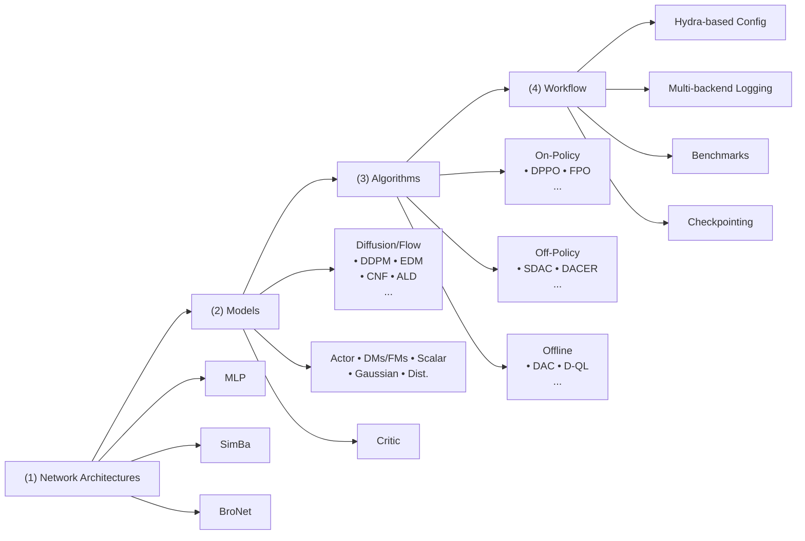

# FLOWRL: A Taxonomy and Modular Framework for Reinforcement Learning with Diffusion Policies

Chenxiao Gao1, Edward Chen1, Tianyi Chen1, Bo Dai1

{cgao,echen324,tchen667,bodai@gatech.edu}

1Georgia Institute of Technology

# Abstract

Thanks to their remarkable flexibility, diffusion models and flow models have emerged as promising candidates for policy representation. However, efficient reinforcement learning (RL) upon these policies remains a challenge due to the lack of explicit logprobabilities for vanilla policy gradient estimators. While numerous attempts have been proposed to address this, the field lacks a unified perspective to reconcile these seemingly disparate methods, thus hampering ongoing development. In this paper, we bridge this gap by introducing a comprehensive taxonomy for RL algorithms with diffusion/flow policies. To support reproducibility and agile prototyping, we introduce a modular, JAX-based open-source codebase that leverages JIT-compilation for high-throughput training. Finally, we provide systematic and standardized benchmarks across Gym-Locomotion, DeepMind Control Suite, and IsaacLab, offering a rigorous side-by-side comparison of diffusion-based methods and guidance for practitioners to choose proper algorithms based on the application. Our work establishes a clear foundation for understanding and algorithm design, a high-efficiency toolkit for future research in the field, and an algorithmic guideline for practitioners in generative models and robotics. Our code is available at https://github.com/typoverflow/flow-rl.

# 1 Introduction

Deep Reinforcement Learning (RL) has traditionally relied on simple distributions (Haarnoja et al., 2018; Fujimoto et al., 2018; Christodoulou, 2019), such as the diagonal Gaussian distribution or Dirac delta distribution for policy parameterization. The appeal of such simple distributions lies in their mathematical convenience: they permit easy log-probability computation, rapid sampling, and tractable reparameterization, making them compatible with various optimization paradigms. Despite these computational benefits, simple distributions often fail to capture complex and multi-modal action distributions encountered in high-dimensional control (Wang et al., 2022; Hansen-Estruch et al., 2023; Chen et al., 2022). This limitation becomes increasingly evident in recent work, when more efforts are dedicated to training generalist policies that are capable of capturing diverse human behaviors (Black et al., 2024; Kim et al., 2024).

Recently, diffusion models (DMs) (Ho et al., 2020; Song et al., 2020) and flow models (FMs) (Albergo et al., 2025; Lipman et al., 2022) have emerged as powerful alternatives for policy representation (Wang et al., 2022; Chen et al., 2022). They both employ an iterative sampling process and therefore offer greater flexibility in distribution modeling. However, integrating DMs and FMs into the RL optimization loop is non-trivial. Traditional RL workflows rely on policy gradient (Schulman et al., 2017; 2015) or the reparameterization trick (Fujimoto et al., 2018), both of which are notoriously difficult for DMs and FMs (Song et al., 2020). While in RL, the target action distribution is typically defined implicitly through the utilities measured by value functions or return functions (Haarnoja et al., 2017; Peng et al., 2019), from which direct samples are not available (Pan et al., 2024), making vanilla diffusion/flow model training losses intractable.

To address these challenges, recent literature has proposed various solutions for diffusion policybased Reinforcement Learning (DPRL). Existing methods span disparate scenarios, including offline (Wang et al., 2022; Fang et al., 2024; Gao et al., 2025), online (Psenka et al., 2024; Wang et al., 2024; Ma et al., 2025), and offline-to-online RL (Huang et al., 2025). Besides, they often involve confounding factors such as differences in noise schedules (Chen, 2023), network architectures (Hansen-Estruch et al., 2023; Celik et al., 2025; Nauman et al., 2024; Lee et al., 2024), and evaluation protocols. These discrepancies make it difficult to isolate the true drivers of the algorithmic performance.

Therefore, in this paper, we aim to systematize the landscape of DPRL, providing a unified perspective to study these methods. Specifically, our contributions are threefold:

1) We summarize and categorize modern DPRL algorithms based on their guidance mechanism and choice of reference policy. This taxonomy allows us to study these methods from first principles and expose the underlying mathematical relationships between them.   
2) Leveraging JIT-compilation provided by JAX (Bradbury et al., 2018) and its ecosystem (Deep-Mind et al., 2020; Heek et al., 2024), we provide a modular, open-source codebase for representative DPRL algorithms with high-throughput training and inference. Furthermore, the library’s modular design allows researchers to swap environments and algorithmic components with minimal effort, significantly reducing the migration cost and barrier for RL research.   
3) Based on our systematic taxonomy and high-performance algorithm library, we conduct a largescale comparative study of DPRL algorithms across three diverse continuous control suites: Gym-Locomotion, DeepMind Control (DMC), and IsaacLab. Our results establish rigorous baselines and provide practitioners with actionable insights tailored to specific application requirements.

Comparison to existing surveys. Several surveys examine diffusion models in RL from different angles. Zhu et al. (2023) and Xu et al. (2025) provide broad taxonomies of diffusion roles (planners, synthesizers, policies) but lack a deep dive into the underlying policy optimization process. Wolf et al. (2025) and Li et al. (2025) shift the focus on specific applications like robotics and broader decision-making tasks. The closest work to ours is Choi et al. (2026), which reviews online diffusion policy algorithms. However, their categorization focuses only on guidance mechanisms, whereas we additionally investigate DPRL methods with different regularization objectives, thereby providing a more comprehensive overview of DPRL across different settings.

# 2 Background

Reinforcement Learning is based on the framework of Markov Decision Process (MDP) $\langle S , A , T , R , \gamma , d _ { 0 } \rangle$ (Sutton et al., 1998), where S is the state space, A is the action space, $T ( s ^ { \prime } | s , a )$ denotes the transition function, $R ( s , a )$ is a bounded reward function, γ is the discount factor and $d _ { 0 } ( s _ { 0 } )$ denotes the initial state distribution. The agent aims to learn a policy $\pi : { \mathcal { S } }  \Delta ( { \mathcal { A } } )$ to maximize the expected discounted return $\textstyle \mathbb { E } _ { \pi } [ \sum _ { t = 0 } ^ { \infty ^ { - } } \gamma ^ { t } R ( s _ { t } , a _ { t } ) ]$ . In online RL, the agent can interact with the environment to gather experiences for policy optimization, while in offline RL, the agent is provided with an offline dataset $\boldsymbol { \mathcal { D } } = \{ ( s _ { t } , a _ { t } , s _ { t + 1 } , r _ { t } ) \}$ , where $s _ { t + 1 } \sim T ( \cdot | s _ { t } , a _ { t } )$ and $r _ { t } = R ( s _ { t } , a _ { t } ) \in \mathbb { R }$ . We define the value functions as the expected reward of executing a certain policy π:

$$
Q ^ {\pi} (s, a) = \mathbb {E} _ {\pi} \left[ \sum_ {t = 0} ^ {\infty} \gamma^ {t} r _ {t} | s _ {0} = s, a _ {0} = a \right], V ^ {\pi} (s) = \mathbb {E} _ {\pi} \left[ \sum_ {t = 0} ^ {\infty} \gamma^ {t} r _ {t} | s _ {0} = s \right], \tag {1}
$$

which satisfy the Bellman equation

$$
Q ^ {\pi} (s, a) = R (s, a) + \gamma \mathbb {E} _ {s ^ {\prime} \sim T} \left[ V (s ^ {\prime}) \right]. \tag {2}
$$

With value functions defined, we can define the policy optimization objective (Wu et al., 2019; Geist et al., 2019):

$$
\max _ {\pi \in \Pi} \mathbb {E} _ {\pi} [ Q ^ {\pi} (s, a) ] - \lambda D _ {\mathrm{KL}} (\pi \| \nu), \tag {3}
$$

where $D _ { \mathrm { K L } } ( \pi \Vert \nu )$ is introduced to shape the behavior of the final policy. The optimal solution to (3) can be obtained by the KKT conditions, i.e.,

$$
\pi^ {*} (a | s) \propto \nu (a | s) \exp (Q (s, a) / \lambda). \tag {4}
$$

Existing RL algorithms can be roughly categorized based on how the gradient is computed: 1), Policy Gradient methods (Sutton et al., 1999; Schulman et al., 2015; 2017), which uses the reinforce trick to derive the gradient of (3) as $\begin{array} { r l } { \nabla _ { \theta } \left( \mathbb { E } _ { \pi _ { \theta } } \left[ Q ( s , a ) \right] - \lambda D ( \pi _ { \theta } \| \nu ) \right) } & { = } \end{array}$ ${ \mathbb E } _ { \pi _ { \theta } } [ Q ( s , a ) \nabla _ { \theta }$ log $\pi _ { \boldsymbol { \theta } } ( a | s ) ] - \lambda \nabla _ { \boldsymbol { \theta } } D ( \pi _ { \boldsymbol { \theta } } \| \nu )$ , and 2) Reparameterization-based methods (Fujimoto et al., 2018; Haarnoja et al., 2018), which keeps the gradients through sampling and computes the gradients as $\mathbb { E } _ { \pi _ { \theta } } [ \nabla _ { a _ { \theta } } Q ( s , a _ { \theta } ) \nabla _ { \theta } a _ { \theta } ] - \lambda \nabla _ { \theta } D ( \pi _ { \theta } \| \nu )$ .

Diffusion Models (DMs) and Flow Models (FMs) approximate data distributions by gradually perturbing clean data $x ^ { 0 } \sim q _ { 0 } = p _ { \mathrm { d a t a } }$ with isotropic Gaussian noise according to a forward process (Song et al., 2020; Albergo et al., 2025):

$$
x ^ {(t)} = \alpha_ {t} x ^ {(0)} + \sigma_ {t} \epsilon , \quad \epsilon \sim \mathcal {N} (0, I), \tag {5}
$$

which emits the condition distribution $q _ { t | 0 } ( x ^ { ( t ) } | x ^ { ( 0 ) } ) = \mathcal { N } ( x ^ { ( t ) } ; \alpha _ { t } x ^ { ( 0 ) } , \sigma _ { t } ^ { 2 } )$ . It then learns the score function $s _ { \theta } ( x ^ { ( t ) } , t )$ or velocity function $v _ { \theta } ( x ^ { ( t ) } , t )$ to reverse this process to sample from the target distribution $p _ { \mathrm { d a t a } }$ . Since DMs and FMs mainly differ in the noise schedules $\left( \alpha _ { t } , \sigma _ { t } \right)$ and their network predictions $s _ { t }$ and $v _ { t }$ can be reparameterized interchangeably (Li & He, 2025; Lu & Song, 2024), we will discuss with DMs for simplicity, but we emphasize the proposed taxonomy can also be applicable to FMs. The target for the score function is to match the marginal score field,

$$
s _ {t} \left(x ^ {(t)}\right) = \mathbb {E} _ {x ^ {(0)} \sim p _ {0 | t} (\cdot | x ^ {(t)})} \left[ s _ {t | 0} \left(x ^ {(t)} \mid x ^ {(0)}\right) \right], \tag {6}
$$

where $p _ { 0 \mid t }$ is the posterior distribution defined via Bayes’ theorem as $\begin{array} { r l } { p _ { 0 | t } ( x ^ { ( 0 ) } | x ^ { ( t ) } ) } & { { } = } \end{array}$ ${ q _ { t | 0 } ( x ^ { ( t ) } | \dot { x ^ { ( 0 ) } } ) q _ { 0 } ( x ^ { ( 0 ) } ) } / { q _ { t } ( x ^ { ( t ) } ) }$ , and

$$
s _ {t | 0} (x ^ {(t)} | x ^ {(0)}) = \nabla_ {x ^ {(t)}} \log p _ {t | 0} (x ^ {(t)} | x ^ {(0)}) = - (x ^ {(t)} - \alpha_ {t} x ^ {(0)}) / \sigma_ {t} ^ {2}. \tag {7}
$$

However, the posterior is not accessible. In practice, we employ conditional score matching, which also yields the same target score:

$$
\mathcal {L} (\theta) = \mathbb {E} _ {x ^ {(0)}, x ^ {(t)}} \left[ \| s _ {\theta} (x ^ {(t)}, t) - s _ {t | 0} (x ^ {(t)}, x ^ {(0)}) \| ^ {2} \right]. \tag {8}
$$

After training, sampling is done by solving a stochastic or ordinary differential equation (SDE/ODE). For example,

$$
\mathrm{d} x ^ {(t)} = \left[ \frac {\dot {\alpha} _ {t}}{\alpha_ {t}} x ^ {(t)} - \sigma_ {t} ^ {2} \left(\frac {\dot {\sigma} _ {t}}{\sigma_ {t}} - \frac {\dot {\alpha} _ {t}}{\alpha_ {t}}\right) s _ {\theta} (x ^ {(t)}, t) - \eta s _ {\theta} (x ^ {(t)}, t) \right] \mathrm{d} t + \sqrt {2 \eta} \mathrm{d} \bar {w}, \tag {9}
$$

where $\eta \geqslant 0$ controls the stochasticity and w¯ is the Brownian motion in reverse time (Albergo et al., 2025; Albergo & Vanden-Eijnden, 2022).

Diffusion Policies (Chi et al., 2025; Wang et al., 2022; Kang et al., 2023; Ren et al., 2025) have been developed by exploiting conditional diffusion models for generating action a conditioned on a time t and k to denote the environment time. Under this terminology, given state s. In this paper, we use $\pi _ { t }$ to denote the distribution of intermediate samples at diffusion $a _ { k } ^ { ( t ) }$ denotes the intermediate action sample at $s _ { k }$ and diffusion step t.

# 3 Taxonomy of RL with Diffusion Policies

At its core, RL optimizes the regularized objective iteratively defined in (3), whose optimal policy takes the form $\pi ( a | s ) \propto \nu ( a | s ) \exp ( Q ( s , a ) )$ , where ν is a reference policy and $Q ( s , a )$ is the value function from policy evaluation. The choice of $\nu ( a | s )$ determines the algorithm’s behavior across different learning paradigms:

• Maximum Entropy RL: When $\nu = \operatorname { U n i f } ( A )$ , the KL divergence reduces to the policy entropy up to some constant, which is a standard approach in online RL to encourage exploration;   
• Policy Mirror Descent: When $\nu = \pi ^ { k - 1 }$ (the policy checkpoint from the last iteration), this ensures safe exploitation by constraining updates to the proximity of the current policy;   
• Behavior Regularized RL: When $\nu = \pi _ { \mathcal { D } }$ (the dataset’s behavior policy), this restricts the policy to the support of the offline data D, ensuring stable optimization in offline settings.

Consequently, implementing RL for diffusion policies requires addressing two concurrent challenges:

1. How to effectively guide diffusion policy optimization using the value function $Q ( s , a )$ , and

2. How to enforce proximity to the chosen reference policy ν.

Therefore, we examine existing literature through the lens of guidance method and reference policy, respectively. Table 1 provides a categorization of existing DPRL methods based on our taxonomy.

Table 1: Summarization of existing DPRL algorithms, based on their guidance mechanism and reference policy. 

<table><tr><td>Guidance Method</td><td>Reference Policy</td><td>Algorithm Name</td></tr><tr><td>BoN Sampling</td><td> $\pi_{\mathcal{D}}$ </td><td>IDQL (Hansen-Estruch et al., 2023), SfBC (Chen et al., 2022)</td></tr><tr><td rowspan="2">Q-value Guidance</td><td>Unif( $\mathcal{A}$ )</td><td>QSM (Psenka et al., 2024), iDEM (Akhound-Sadegh et al., 2024), DPS (Jain et al., 2024)</td></tr><tr><td> $\pi_{\mathcal{D}}$ </td><td>DAC (Fang et al., 2024), QGPO (Lu et al., 2023), Diffusion-DICE (Mao et al., 2024)</td></tr><tr><td rowspan="3">Weighted Matching</td><td>Unif( $\mathcal{A}$ )</td><td>SDAC (Ma et al., 2025), MaxEntDP (Dong et al., 2025), QVPO (Ding et al., 2024)</td></tr><tr><td> $\pi^{k-1}$ </td><td>DPMD (Ma et al., 2025), FPMD (Chen et al., 2025)</td></tr><tr><td> $\pi_{\mathcal{D}}$ </td><td>QIPO (Zhang et al., 2024)</td></tr><tr><td rowspan="2">Reparameterization</td><td>Unif( $\mathcal{A}$ )</td><td>DACER (Wang et al., 2024), DACERv2 (Wang et al., 2025), DIME (Celik et al., 2025)</td></tr><tr><td> $\pi_{\mathcal{D}}$ </td><td>D-QL (Wang et al., 2022), BDPO (Gao et al., 2025), EDP (Kang et al., 2023), FQL (Park et al., 2025)</td></tr><tr><td>Policy Gradient</td><td> $\pi^{k-1}$ </td><td>FPO (McAllister et al., 2025), GenPO (Ding et al., 2025), DPPO (Ren et al., 2025)</td></tr></table>

# 3.1 Best-of-N (BoN) Sampling

The simplest approach is pretraining a diffusion policy to approximate the reference distribution $\nu ( a | s )$ and refining it at inference time via Best-of-N sampling:

$$
a ^ {*} = \underset {a _ {i} \in \{a _ {1}, \dots , a _ {N} \}} {\operatorname{argmax}} Q (s, a _ {i}), \quad \text { where } a _ {i} \sim \nu (\cdot | s). \tag {10}
$$

This approach was first proposed in offline settings by Chen et al. (2022) and Hansen-Estruch et al. (2023), where a diffusion model is trained to represent the offline data distribution and actions are subsequently refined using a learned critic $Q ( s , a )$ . Today, BoN sampling is increasingly used in the evaluation of modern DPRL methods. Because diffusion policies exhibit superior coverage across the action space, applying BoN sampling at inference enables the agent to select the highestvalued actions within the distribution, effectively trading additional inference-time computation for improved performance.

# 3.2 Q-value Guidance

Drawing inspiration from classifier guidance (Dhariwal & Nichol, 2021), sampling from a $Q -$ weighted distribution $\pi ^ { * } ( a | s ) \propto \nu ( a | s ) \exp ( Q ( s , a ) / \lambda )$ can be achieved by injecting action gradients $\nabla _ { a } Q ( s , a )$ into the sampling process. This is due to the following score function relationship:

$$
\nabla_ {a} \log \pi^ {*} (a | s) = \nabla_ {a} \log \nu (a | s) + \nabla_ {a} Q (s, a) / \lambda . \tag {11}
$$

Some algorithms utilize an explicit policy optimization step to internalize this guidance, while others inject the action gradient directly during sampling. For example, in the offline RL setting, DAC (Fang et al., 2024) performs diffusion matching over offline dataset samples combined with the action gradient; in online RL, where $\nu = \operatorname { U n i f } ( A )$ , QSM (Psenka et al., 2024) directly regresses the score network towards the action gradients.

Unfortunately, directly using the action gradient is biased due to imprecise score mixing at intermediate diffusion steps. The precise score of diffusion step t is given by

$$
\nabla_ {a ^ {(t)}} \log \pi_ {t} ^ {*} (a ^ {(t)} | s) = \nabla_ {a ^ {(t)}} \log \nu_ {t} (a | s) + \nabla_ {a ^ {(t)}} \underbrace {\eta \log \mathbb {E} _ {a ^ {(0)} \sim p _ {0 | t}} [ \exp (Q (s , a ^ {(0)}) / \eta) ]} _ {Q _ {t} (s, a ^ {(t)})}. \tag {12}
$$

QGPO (Lu et al., 2023) first formalizes this mismatch in offline scenarios where $\nu = \pi _ { \mathcal { D } }$ , and introduces a contrastive learning objective to construct the intermediate $Q _ { t }$ -functions. Similarly, Diffusion-DICE (Mao et al., 2024) leverages Gumbel regression to estimate the intermediate $Q _ { t } .$ functions. In online scenarios where $\pi ^ { * } ( a | s ) \propto \exp ( Q ( s , a ) )$ , rather than learning the $Q _ { t }$ -function explicitly, iDEM (Akhound-Sadegh et al., 2024) and DPS (Jain et al., 2024) propose an importancesampling approach to estimate the intermediate scores:

$$
\nabla_ {a ^ {(t)}} \log \pi_ {t} ^ {*} (a ^ {(t)} | s) = \frac {\mathbb {E} _ {\hat {a} ^ {(0)} \sim p _ {t | 0}} [ \exp (Q (s , \hat {a} ^ {(0)})) \nabla_ {a ^ {(t)}} Q (s , \hat {a} ^ {(0)}) ]}{\mathbb {E} _ {\hat {a} ^ {(0)} \sim p _ {t | 0}} [ \exp (Q (s , \hat {a} ^ {(0)})) ]} \tag {13}
$$

where the RHS can be approximated by Monte-Carlo samples and reweighting. The resulting smoothing of the action gradients helps alleviate the slow mixing issue in Langevin-style sampling.

# 3.3 Reparameterization

Similar to reparameterization-based methods like SAC (Haarnoja et al., 2018) and TD3 (Fujimoto et al., 2018), recent work explores reparameterizing the diffusion sampling process, and optimizing the network by maximizing Q-values of the generated samples. A common approach is Backpropagation Through Time (BPTT) (Wang et al., 2022; 2024; 2025; Celik et al., 2025), which computes and backpropagates the gradients across the entire sampling chain:

$$
\max _ {\theta} \mathbb {E} _ {a ^ {(0: T)} \sim \pi_ {\theta}} [ Q (s, a _ {\theta} ^ {(0)}) ]. \tag {14}
$$

However, BPTT incurs significant memory and computational overhead due to the need to preserve the computational graph across all diffusion timesteps. To mitigate this, several methods aim to amortize or bypass the sampling cost. For example, BDPO (Gao et al., 2025) constructs step-level value functions $Q ( s , a , t )$ for each diffusion step t, and optimizes only for single-step transitions maxθ $\mathbb { E } _ { a ^ { ( t ) } \sim \pi _ { t \mid t + 1 , \theta } } \left[ Q ( s , a _ { \theta } ^ { ( t ) } , t ) \right]$ . EDP (Kang et al., 2023) leverages the posterior mean estimate $\hat { a } ^ { ( 0 ) }$ via the identity $\hat { a } ^ { ( 0 ) } = \mathbb { E } _ { a ^ { ( 0 ) } \sim p _ { 0 | t } } [ a ^ { ( 0 ) } ] \approx ( a ^ { ( t ) } + \sigma _ { t } ^ { 2 } \epsilon _ { \theta } ) / \alpha _ { t }$ t and turns to optimize an efficient yet biased objective:

$$
\max _ {\theta} \mathbb {E} _ {a ^ {(t)}, \hat {a} _ {\theta} ^ {(0)} = (a ^ {(t)} + \sigma_ {t} ^ {2} \epsilon_ {\theta}) / \alpha_ {t}} [ Q (s, \hat {a} _ {\theta} ^ {(0)}) ]. \tag {15}
$$

Another line of research, exemplified by FQL (Park et al., 2025), employs distillation to compress multi-step diffusion into single-step models, enabling efficient reparameterization in a single pass.

Nevertheless, a fundamental challenge for this guidance style is how to ensure the policy respects the regularization. Since the log-probability of actions is difficult to compute, these methods typically require additional loss terms for regularization. One approach is to sample from the reference distribution and apply a standard diffusion loss on these samples to anchor the policy. For example, D-QL (Wang et al., 2022) applies a score matching objective on samples from the offline dataset D to prevent the diffusion policy from deviating. Alternatively, BDPO formulates the KL constraint across the entire diffusion path and enforces the constraint at every denoising step by decomposing the pathwise KL. Similarly, DIME (Celik et al., 2025) derives a tractable lower bound for action entropy, which enables optimizing the diffusion policy with the maximum entropy framework.

# 3.4 Weighted Matching

Weighted matching methods optimize diffusion policies by reframing policy improvement as a weighted supervised learning task. These methods reweight the diffusion training objective using functions derived from the Q-function or advantage function to bias the learned policy toward highvalue actions. Zhang et al. (2024) and Ma et al. (2025) demonstrate that the weighted score/flow matching objective yields an optimal policy that exactly matches the closed-form expression in (4), providing formal guarantees for policy improvement.

In its general form, the weighted matching objective is defined as:

$$
\min _ {\theta} \mathbb {E} _ {a ^ {(0)}, a ^ {(t)} \sim \tilde {p} _ {0, t}} \left[ \exp \left(\frac {Q (s , a ^ {(0)})}{\lambda}\right) \left\| s _ {\theta} (a ^ {(t)}; s, t) - s _ {t | 0} (a ^ {(t)} | a ^ {(0)}) \right\| ^ {2} \right], \tag {16}
$$

where $\tilde { p } _ { 0 , t }$ represents a proposal distribution for the coupling $( a ^ { ( 0 ) } , a ^ { ( t ) } )$ , and the choice of this distribution varies by setting. In offline RL where $\nu = \pi _ { \mathcal { D } }$ , QIPO (Zhang et al., 2024) proves that sampling $a ^ { ( 0 ) } \sim \mathcal { D } , \overset { \cdot } { a } ^ { ( t ) } \sim \overset { \cdot } { q } _ { t | 0 }$ recovers the optimal policy (4). For mirror descent where $\nu = \pi ^ { k - 1 }$ , methods such as DPMD (Ma et al., 2025) and FPMD (Chen et al., 2025) sample $a ^ { ( 0 ) } \sim \pi ^ { k - 1 }$ and $a ^ { ( t ) } \sim q _ { t | 0 }$ , which also recovers the optimal policy in (4). In online RL, QVPO (Ding et al., 2024) samples $a ^ { ( 0 ) }$ from a mixture of the uniform distribution and the last policy checkpoint; while SDAC (Ma et al., 2025) and MaxEntDP (Dong et al., 2025) concurrently propose reverse sampling, where $a ^ { ( 0 ) }$ is drawn by reversing the forward perturbation kernel $q _ { t | 0 }$ given $a ^ { ( t ) }$ .

# 3.5 Policy Gradient

Policy gradient methods optimize the policy by estimating the gradients of the objective in (3) via the policy gradient theorem. A prominent example is Proximal Policy Optimization (PPO) (Schulman et al., 2017), which stabilizes training by applying proximal regularization relative to the previous iteration’s policy, $\pi ^ { k - 1 }$ . The training objective is

$$
\max _ {\theta} \mathbb {E} _ {a \sim \pi^ {k - 1}} \left[ \min \left(r (\theta) \hat {A}, \operatorname{clip} (r (\theta), 1 - \epsilon^ {\text { clip }}, 1 + \epsilon^ {\text { clip }}) \hat {A}\right) \right], \tag {17}
$$

where ϵclip is a clipping threshold to avoid large updates and r(θ) = πθ(a|s)πk−1(a|s) $\epsilon ^ { \mathrm { c l i p } }$ $\begin{array} { r } { r ( \theta ) = \frac { \pi _ { \theta } ( a | s ) } { \pi ^ { k - 1 } ( a | s ) } } \end{array}$ is the policy ratio.

The primary obstacle in applying policy gradient methods to diffusion policies is that computing the ratio $r ( \theta )$ requires the exact log-likelihood log $\pi ( a | s )$ , which is intractable due to the iterative generation process. By discretizing the generative SDE, DPPO (Ren et al., 2025) treats the denoising process as a Markov Decision Process (MDP) where each transition step is tractable. This allows extending PPO directly to the denoising steps. GenPO (Ding et al., 2025) constructs an invertible diffusion model by introducing dummy actions and uses the change-of-variables theorem to compute the action likelihood. However, this is computationally expensive. Finally, FPO (McAllister et al., 2025) employs the conditional flow matching (CFM) loss as an approximation of the evidence lower bound (ELBO), and estimates the policy ratio as:

$$
\hat {r} _ {\mathrm{FPO}} (\theta) = \exp \left(\hat {L} _ {\mathrm{CFM}, \theta^ {k - 1}} (a) - \hat {L} _ {\mathrm{CFM}, \theta} (a)\right), \tag {18}
$$

flowchart

Figure 1: The overview of FLOWRL.

where the CFM loss is estimated via Monte Carlo samples:

$$
\hat {L} _ {\mathrm{CFM}, \theta} (a) = \frac {1}{N} \sum_ {i = 1} ^ {N} \left\| s _ {\theta} \left(a ^ {(t)}, t\right) - s _ {t | 0} \left(a ^ {(t)}, a ^ {(0)}\right) \right\| ^ {2}. \tag {19}
$$

# 4 Design of FLOWRL

# 4.1 Design Principles

To support the large-scale comparative study and facilitate future research, our codebase, FLOWRL, is designed according to the following principles:

Modularity and Composability. The library decouples RL algorithms into orthogonal, reusable components, such as neural network architectures, actor/critic variants, generative models (flow and diffusion), and training infrastructure. Each component adheres to a shared interface, allowing researchers to combine them flexibly.

Computational Efficiency. FLOWRL is built around JAX and its ecosystem. Since diffusion models require multiple iterations to sample a single action, JAX’s Just-In-Time compilation provides a significant speedup in training and inference over PyTorch-based alternatives. Additionally, JAX’s functional paradigm enables the native use of transformations like vmap (used, e.g., for critic ensembles) and lax.scan (for the iterative denoising loop in diffusion).

# 4.2 Architecture Overview

Figure 1 provides a semantic overview of FLOWRL. The system is organized into four layers, described below from bottom to top.

(1) Network Architecture Layer. While traditional RL often relies on simple backbones like Multi-Layer Perceptrons (MLPs) with ReLU activations, recent evidence suggests that RL performance scales significantly with more sophisticated architectures and increased parameter counts. Accordingly, we support a diverse suite of backbones, including standard MLP, as well as modern alternatives such as SimBa (Lee et al., 2024) and BroNet (Nauman et al., 2024).   
(2) Model Layer. We implement DMs, FMs, and standard RL components with a common interface. For DMs, we support both discrete and continuous-time DDPM; for FMs, we support Continuous Normalizing Flows (CNFs). We also include annealed Langevin dynamics (ALD) due to its connection to DMs and FMs. The actor-critic framework supports actors parameterized by any of the aforementioned generative models or by standard deterministic and probabilistic distributions. For critics, both scalar and distributional critics are supported. All these models can utilize any architecture from the previous layer as their backbones.

MuJoCo (Gymnasium)   

natural_image

Two abstract geometric shapes: a yellow stick on a purple line and a pink square with a small blue dot (no text or symbols)

InvertedPendulum   
Reacher

DMC   

natural_image

Two orange 3D human figures in dynamic poses on a checkered floor against a starry blue background (no text or symbols)

Cheetah-run   
Hopper-Stand

IsaacLab   
  
Ant

  
Humanoid

natural_image

3D-rendered scene with a striped orange object on a black-and-white checkered floor, next to a purple curved object on a curved surface (no text or symbols)

Swimmer

natural_image

Two 3D human figure models in motion poses against a starry blue background (no text or symbols)

Walker-walk

  
Lift-Cube-Franka

  
Velocity-Flat-Anymal-D   
Figure 2: Representative tasks across three continuous-control suites. Left: MuJoCo Gymnasium. Middle: DeepMind Control Suite. Right: IsaacLab.

(3) Algorithm Layer. Algorithms are implemented as subclasses of a BaseAgent. To implement a new algorithm, the user only needs to define three components: 1) the initialization logic, which assembles tools and models from previous layers; 2) the update logic, which is JIT-compiled to maximize computational throughput; and 3) sampling logic, which is greatly simplified, as the underlying DMs and FMs already provide samplers that work out-of-the-box.   
(4) Workflow Layer. The workflow layer orchestrates all components through a main script. Specifically, a Hydra-based configuration system merges algorithm-specific YAMLs with shared settings, providing hierarchical hyperparameter management and command-line overrides. The main script also instantiates the environment, data buffer, and agent, then enters a loop alternating among environment interaction, dataset sampling, and compiled agent updates. The logging system supports simultaneous writes to multiple backends, including TensorBoard, Weights & Biases, and CSV files, while Orbax handles checkpointing. Finally, we support a diverse range of tasks, spanning 2D visualization datasets, classic locomotion benchmarks such as Gym-MuJoCo and the DeepMind Control Suite, high-dimensional control tasks like HumanoidBench, and IsaacLab, which enables large-scale, hardware-accelerated simulation across multiple embodiments.

# 5 Benchmarking RL with Diffusion Policies

# 5.1 Experiment Setup

Benchmarks. We select three complementary continuous control benchmarks that collectively span a wide range of task complexities and action dimensionalities. Gym-Locomotion (Towers et al., 2025) and DeepMind Control Suite (DMC) (Tassa et al., 2018) are both powered by the Mu-JoCo physics engine (Todorov et al., 2012) and provide standard locomotion and balancing tasks widely used in the RL literature. IsaacLab (NVIDIA et al., 2025) provides GPU-accelerated robotic environments that support massively parallel simulation across diverse embodiments, including locomotion and manipulation tasks. We use Gym-Locomotion and DMC for off-policy and offline settings, and IsaacLab for on-policy settings. The full list of tasks is provided in the Appendix A.1.

Algorithms. We evaluate representative DPRL methods from each guidance category in our taxonomy against strong Gaussian baselines. For online off-policy RL, we compare QSM (Psenka et al., 2024), DACER (Wang et al., 2024), DPMD (Ma et al., 2025), SDAC (Ma et al., 2025), and QVPO (Ding et al., 2024) against SAC (Haarnoja et al., 2018). For online on-policy RL, we compare DPPO (Ren et al., 2025), GenPO (Ding et al., 2025), and FPO (McAllister et al., 2025) against PPO (Schulman et al., 2017). For offline RL, we compare Diffusion-QL (Wang et al., 2022), FQL (Park et al., 2025), DAC (Fang et al., 2024), and BDPO (Gao et al., 2025) against IQL (Hansen-Estruch

line

| Environment Frames | Eval Return (Line 1) | Eval Return (Line 2) | Eval Return (Line 3) | Eval Return (Line 4) | Eval Return (Line 5) |
| ------------------ | -------------------- | -------------------- | -------------------- | -------------------- | -------------------- |
| 0.00               | 0                    | 0                    | 0                    | 0                    | 0                    |
| 0.25               | ~1000                | ~1500                | ~2000                | ~2500                | ~3000                |
| 0.50               | ~2000                | ~2500                | ~3000                | ~3500                | ~4000                |
| 0.75               | ~3000                | ~3500                | ~4000                | ~4500                | ~5000                |
| 1.00               | ~4000                | ~4500                | ~5000                | ~5500                | ~6000                |

line

| Environment Frames | Line 1 | Line 2 | Line 3 | Line 4 |
| ------------------ | ------ | ------ | ------ | ------ |
| 0.00               | 0      | 0      | 0      | 0      |
| 0.25               | 5000   | 6000   | 7000   | 8000   |
| 0.50               | 7000   | 8000   | 9000   | 10000  |
| 0.75               | 8000   | 9000   | 10000  | 11000  |
| 1.00               | 9000   | 10000  | 11000  | 12000  |

line

| Environment Frames | Hopper-v5 |
| ------------------ | --------- |
| 0.00               | 0         |
| 0.25               | ~2000     |
| 0.50               | ~3000     |
| 0.75               | ~3500     |
| 1.00               | ~3800     |

line

| Environment Frames | Eval Return (Line 1) | Eval Return (Line 2) | Eval Return (Line 3) | Eval Return (Line 4) |
| ------------------ | -------------------- | -------------------- | -------------------- | -------------------- |
| 0.00               | 0                    | 0                    | 0                    | 0                    |
| 0.25               | ~2000                | ~3000                | ~4000                | ~5000                |
| 0.50               | ~4000                | ~5000                | ~5500                | ~6000                |
| 0.75               | ~5000                | ~5500                | ~5800                | ~6000                |
| 1.00               | ~5500                | ~5800                | ~6000                | ~6200                |

line

| Environment Frames | Series 1 | Series 2 | Series 3 | Series 4 | Series 5 |
| ------------------ | -------- | -------- | -------- | -------- | -------- |
| 0.00               | 0        | 0        | 0        | 0        | 0        |
| 0.25               | 50       | 55       | 60       | 65       | 70       |
| 0.50               | 75       | 80       | 85       | 90       | 95       |
| 0.75               | 90       | 95       | 100      | 105      | 110      |
| 1.00               | 100      | 105      | 110      | 115      | 120      |

line

| Environment Frames | Series 1 | Series 2 | Series 3 | Series 4 | Series 5 | Series 6 | Series 7 |
| ------------------ | -------- | -------- | -------- | -------- | -------- | -------- | -------- |
| 0.00               | 0        | 0        | 0        | 0        | 0        | 0        | 0        |
| 0.25               | 2000     | 2500     | 3000     | 3500     | 4000     | 4500     | 5000     |
| 0.50               | 3000     | 3500     | 4000     | 4500     | 5000     | 5500     | 6000     |
| 0.75               | 3500     | 4000     | 4500     | 5000     | 5500     | 6000     | 6500     |
| 1.00               | 4000     | 4500     | 5000     | 5500     | 6000     | 6500     | 7000     |

SAC QSM DACER SDAC QVPO DPMD

Figure 4: Training curves of several off-policy DPRL algorithms across Gym-Locomotion tasks.   

line

| Environment Frames | Eval Return (Red) | Eval Return (Purple) | Eval Return (Green) | Eval Return (Blue) |
| ------------------ | ----------------- | -------------------- | ------------------- | ------------------ |
| 0                  | ~30               | ~25                  | ~20                 | ~10                |
| 20                 | ~80               | ~60                  | ~40                 | ~20                |
| 40                 | ~95               | ~75                  | ~55                 | ~25                |
| 60                 | ~105              | ~85                  | ~65                 | ~30                |
| 80                 | ~110              | ~90                  | ~70                 | ~30                |
| 100                | ~115              | ~95                  | ~75                 | ~30                |

line

| Environment Frames | Humanoid-v0 |
| ------------------ | ----------- |
| 0                  | 0           |
| 20                 | 50          |
| 40                 | 100         |
| 60                 | 100         |
| 80                 | 100         |
| 100                | 100         |

line

| Environment Frames | Red Line | Green Line | Purple Line | Blue Line |
| ------------------ | -------- | ---------- | ----------- | --------- |
| 0                  | 0        | 0          | 0           | 0         |
| 20                 | 80       | 40         | 30          | -20       |
| 40                 | 90       | 60         | 50          | -30       |
| 60                 | 95       | 70         | 60          | -35       |
| 80                 | 98       | 80         | 70          | -38       |
| 100                | 100      | 90         | 80          | -40       |

line

| Environment Frames (1e6) | Velocity (Blue) | Velocity (Red) | Velocity (Green) |
| ------------------------ | --------------- | -------------- | ---------------- |
| 0                        | -35             | 0              | 0                |
| 20                       | -10             | 5              | 5                |
| 40                       | 0               | 10             | 10               |
| 60                       | 5               | 15             | 15               |
| 80                       | 10              | 20             | 20               |
| 100                      | 15              | 25             | 25               |

PPO DPPO FPO GenPO

Figure 5: Training curves of on-policy DPRL algorithms on IsaacLab tasks.

et al., 2023). We also include reference scores of IDQL (Hansen-Estruch et al., 2023), QGPO (Lu et al., 2023), EDP (Kang et al., 2023) as a comparison.

Evaluation Setup. To ensure a fair comparison, all methods within each benchmark follow a standardized workflow. For offline settings, we keep the hyperparameters and network designs identical to their original papers. We use the D4RL datasets for training and report the average performance of the last policy checkpoint. For the online off-policy settings, each method is trained for 1M environment frames and evaluated every 10K frames across a span of 10 episodes. No observation or reward normalization is applied in this setting. Unless an algorithm explicitly designates a specific architectural choice as a core contribution, we align all hyperparameters, network structures, and diffusion model implementations across base-

line

| Threshold τ (normalized score) | SAC   | QSM   | DACER | SDAC  | QVPO  | DPMD  |
| ------------------------------- | ----- | ----- | ----- | ----- | ----- | ----- |
| 0.5                             | 0.95  | 0.92  | 0.88  | 0.94  | 0.96  | 0.93  |
| 0.6                             | 0.88  | 0.85  | 0.82  | 0.90  | 0.92  | 0.89  |
| 0.7                             | 0.80  | 0.78  | 0.75  | 0.85  | 0.87  | 0.84  |
| 0.8                             | 0.70  | 0.68  | 0.65  | 0.75  | 0.77  | 0.74  |
| 0.9                             | 0.50  | 0.48  | 0.45  | 0.55  | 0.57  | 0.54  |
| 1.0                             | 0.10  | 0.08  | 0.05  | 0.15  | 0.17  | 0.14  |

Figure 3: Performance profile on Gym-Locomotion tasks.

lines. For IsaacLab, the training pipeline follows the standard PPO rollout pipeline, utilizing 1024 parallel simulations for a total of 100M frames. For all environments, we report the undiscounted episodic return, visualized using the mean (solid line) and one standard deviation (shaded region). Detailed per-algorithm hyperparameters are provided in the Appendix A.

# 5.2 General Performance

Gym-Locomotion. Learning curves for the Gym-Locomotion environments are shown in Figure 4. In Figure 3, we further present the performance profiles of each algorithm by normalizing the evaluation returns and computing the fraction of runs that achieve performance above different thresholds τ . Comparing the area under the curve in Figure 3, SDAC, DACER, and DPMD deliver the strongest overall results and outperform the Gaussian baseline SAC. That said, no single DPRL algorithm dominates across all environments, and SAC remains competitive on the majority of tasks. QSM and QVPO underperform and show noticeable instability during training.

Table 2: Normalized returns of the final policy checkpoint for offline DPRL methods. Methods marked with † denote results reported in the original paper. Results are averaged over five independent runs of 10 evaluation episodes each. Numbers within 95% of the highest scores are bolded. 

<table><tr><td>Dataset</td><td>IQL</td><td>IDQL $^{\dagger}$ </td><td>QGPO $^{\dagger}$ </td><td>QIPO $^{\dagger}$ </td><td>Diffusion-QL</td><td>DAC</td><td>BDPO</td></tr><tr><td>halfcheetah-m</td><td>47.4</td><td>51.0</td><td>54.1</td><td>54.2±1.3</td><td>50.7±0.7</td><td>59.1±0.6</td><td>71.2±0.9</td></tr><tr><td>hopper-m</td><td>66.3</td><td>65.4</td><td>98.0</td><td>94.0±13.3</td><td>80.4±15.7</td><td>103.5±0.3</td><td>100.6±0.7</td></tr><tr><td>walker2d-m</td><td>78.3</td><td>82.5</td><td>86.0</td><td>87.6±1.5</td><td>86.7±1.6</td><td>97.9±0.9</td><td>93.4±0.5</td></tr><tr><td>halfcheetah-m-r</td><td>44.2</td><td>45.9</td><td>47.6</td><td>48.0±0.8</td><td>47.4±0.6</td><td>55.4±0.5</td><td>58.9±0.9</td></tr><tr><td>hopper-m-r</td><td>94.7</td><td>92.1</td><td>96.9</td><td>101.3±2.2</td><td>101.0±0.3</td><td>103.1±0.1</td><td>101.4±0.5</td></tr><tr><td>walker2d-m-r</td><td>73.9</td><td>85.1</td><td>84.4</td><td>75.6±25.1</td><td>95.7±1.4</td><td>98.4±0.5</td><td>95.5±1.6</td></tr><tr><td>halfcheetah-m-e</td><td>86.7</td><td>95.9</td><td>93.5</td><td>94.5±0.5</td><td>96.0±0.7</td><td>100.1±0.7</td><td>108.7±0.9</td></tr><tr><td>hopper-m-e</td><td>91.5</td><td>108.6</td><td>108.0</td><td>108.0±5.2</td><td>106.9±11.7</td><td>112.3±1.0</td><td>111.3±0.2</td></tr><tr><td>walker2d-m-e</td><td>109.6</td><td>112.7</td><td>110.7</td><td>110.9±1.0</td><td>108.7±0.2</td><td>115.3±7.5</td><td>115.6±0.4</td></tr></table>

IsaacLab. In Figure 5, we plot the return curves of three on-policy DPRL methods together with the baseline method, PPO. Overall, PPO delivers the best and most stable performance across the four tasks. Among the DPRL methods, GenPO achieves the strongest performance. However, its training cost is significantly higher due to Jacobian computation. We also observe that FPO occasionally collapses during training. After careful inspection, we find that this instability arises because, for samples with negative advantage, optimizing (17) with (18) effectively leads to an unbounded optimization problem.

D4RL. In Table 2, we find that DPRL methods, especially those leveraging RL to train the diffusion policy, significantly outperform traditional offline RL algorithms such as IQL and inferencetime refinement methods such as IDQL. These results demonstrate the efficacy of diffusion models not only as expressive priors for capturing complex, multi-modal offline distributions, but also as promising policy representations for offline RL.

# 5.3 Empirical Analysis

Effect of Action Dimensionality. A key distinction among different guidance methods is how each utilizes the Q-function: both Q-value guidance and reparameterization methods exploit first-order gradients $\nabla _ { a } Q$ for optimization, while weighted matching methods rely on function evaluations $Q ( s , a )$ to reweight sampled actions, which is less efficient and prone to higher variance in high-dimensional action spaces. In Figure 6, we select three representative methods, QSM (from Sec 3.2), DACER (from Sec 3.3), and SDAC (from Sec 3.4), and compare their performance relative to SAC with tasks of increasing action dimensionality.

We find that while QSM and DACER remain competitive, the performance of SDAC degrades significantly as dimensionality grows. This suggests that for weighted matching methods to remain effective, the proposal distribution must be meticulously designed to ensure high-valued actions can be sampled and reinforced during training.

Effect of Diffusion Steps. Since diffusion models refine samples through an iterative denoising process, a natural question is how the number of diffusion steps affects each algorithm. We again select QSM, DACER and SDAC and vary the number of diffusion steps in Figure 7. We discover that both QSM and SDAC improve monotonically with more diffusion steps, while SDAC works significantly better even with fewer diffusion steps. In contrast, DACER exhibits the opposite trend, with its performance degrading when the number of steps exceeds five. We attribute this behavior to the nature of reparameterization-based methods, which rely on techniques such as BPTT to optimize the diffusion policy. Increasing the number of diffusion steps complicates the optimization problem, making the training process more indirect and susceptible.

line

| Action Dimensionality | QSM   | DACER | SDAC  | SAC   |
| --------------------- | ----- | ----- | ----- | ----- |
| cartpole-balance       | 1.00  | 1.00  | 1.00  | 1.00  |
| hopper-stand          | 0.80  | 1.00  | 0.90  | 1.00  |
| cheetah-run           | 1.10  | 0.80  | 1.05  | 1.05  |
| quadruped-run         | 1.00  | 0.85  | 0.40  | 1.00  |
| humanoid-walk         | 1.00  | 1.40  | 0.05  | 1.00  |

Figure 6: Effect of Action Dimensionality. Performance is normalized by SAC across tasks of increasing action dimension.

Figure 7: Effect of diffusion steps on performance. Performance of QSM, SDAC, and DACER when varying the number of diffusion steps (2, 5, 10, and 50). Returns are normalized by taskspecific maximum scores and averaged across Ant, HalfCheetah, Humanoid, and Walker2d.   

line

| Environment Frames | Eval Return (Line 1) | Eval Return (Line 2) | Eval Return (Line 3) |
| ------------------ | -------------------- | -------------------- | -------------------- |
| 0.00               | 0                    | 0                    | 0                    |
| 0.25               | 750                  | 750                  | 250                  |
| 0.50               | 875                  | 875                  | 500                  |
| 0.75               | 900                  | 900                  | 750                  |
| 1.00               | 925                  | 925                  | 750                  |

line

| Environment Frames | Line 1 | Line 2 |
| ------------------ | ------ | ------ |
| 0.00               | 0      | 0      |
| 0.25               | 50     | 30     |
| 0.50               | 100    | 60     |
| 0.75               | 150    | 90     |
| 1.00               | 180    | 120    |

line

| Environment Frames | Humanoid-stand |
| ------------------ | -------------- |
| 0.00               | 0              |
| 0.25               | 250            |
| 0.50               | 500            |
| 0.75               | 750            |
| 1.00               | 1000           |

line

| Environment Frames | Dog-run (Line 1) | Dog-run (Line 2) |
| ------------------ | ---------------- | ---------------- |
| 0.00               | 0                | 0                |
| 0.25               | ~150             | ~50              |
| 0.50               | ~300             | ~100             |
| 0.75               | ~450             | ~150             |
| 1.00               | ~500             | ~200             |

  
Figure 8: Effect of network architecture. Comparison between MLP and SimBa backbones for QSM (blue) and DACER (green) on DMControl hard tasks. Solid lines denote MLP policies and dashed lines denote Simba policies.

Effect of Network Backbone. Recent studies (Lee et al., 2024; Nauman et al., 2024) have demonstrated that network architecture is a significant confounding factor in online Reinforcement Learning performance, yet their effects are often left unexamined in the existing literature. The modular design of FLOWRL enables users to seamlessly swap between neural network backbones. In Figure 8, we select the most difficult tasks from DMC and change the network architecture from MLP to SimBa. We find that all evaluated algorithms achieve significant performance gains on tasks previously considered challenging. These results highlight the importance of controlling for architecture when evaluating algorithmic improvements.

Effect of Noise Schedule. Prior work on DMs has shown that the choice of noise schedules can affect sample quality (Ho et al., 2020; Song et al., 2022). We investigate whether these design choices carry over to the RL setting by replacing the default cosine schedule with a linear schedule. As shown in Figure 9, switching to a linear noise schedule has minimal impact on performance across all three methods.

# 6 Closing Remarks

In this paper, we presented a systematic study of diffusion policy-based Reinforcement Learning. We first proposed a unified taxonomy that categorizes existing DPRL algorithms along two axes: diffusion policy optimization guidance and regularization objective. Building upon this taxonomy, we developed a modular, JAX-based library that enables high-throughput training and fair comparison of DPRL algorithms. Our standardized benchmark results across Gym-Locomotion, DeepMind Control Suite, and IsaacLab provide rigorous performance references and practical guidelines for

  
Cosine Noise Schedule Linear Noise Schedule

Figure 9: Effect of noise schedule. Performance of SDAC, QSM, and DACER with a cosine (black) or linear noise schedule.

selecting algorithm configurations. Important open questions remain in the field of DPRL, including designing algorithms robust to diverse environment characteristics, scaling to long-horizon and sparse-reward tasks, and developing a thorough understanding of the diffusion policy optimization landscape. We believe our proposed taxonomy and library provide a solid foundation for future research and practical applications in this direction.

# References

Tara Akhound-Sadegh, Jarrid Rector-Brooks, Avishek Joey Bose, Sarthak Mittal, Pablo Lemos, Cheng-Hao Liu, Marcin Sendera, Siamak Ravanbakhsh, Gauthier Gidel, Yoshua Bengio, et al. Iterated denoising energy matching for sampling from boltzmann densities. arXiv preprint arXiv:2402.06121, 2024.   
Michael Albergo, Nicholas M Boffi, and Eric Vanden-Eijnden. Stochastic interpolants: A unifying framework for flows and diffusions. Journal of Machine Learning Research, 26(209):1–80, 2025.   
Michael S Albergo and Eric Vanden-Eijnden. Building normalizing flows with stochastic interpolants. arXiv preprint arXiv:2209.15571, 2022.   
Kevin Black, Noah Brown, Danny Driess, Adnan Esmail, Michael Equi, Chelsea Finn, Niccolo Fusai, Lachy Groom, Karol Hausman, Brian Ichter, et al. π0: A vision-language-action flow model for general robot control. arXiv preprint arXiv:2410.24164, 2024.   
James Bradbury, Roy Frostig, Peter Hawkins, Matthew James Johnson, Chris Leary, Dougal Maclaurin, George Necula, Adam Paszke, Jake VanderPlas, Skye Wanderman-Milne, and Qiao Zhang. JAX: composable transformations of Python+NumPy programs, 2018. URL http://github.com/jax-ml/jax.   
Onur Celik, Zechu Li, Denis Blessing, Ge Li, Daniel Palenicek, Jan Peters, Georgia Chalvatzaki, and Gerhard Neumann. Dime: Diffusion-based maximum entropy reinforcement learning. In International Conference on Machine Learning, pp. 6958–6977. PMLR, 2025.   
Huayu Chen, Cheng Lu, Chengyang Ying, Hang Su, and Jun Zhu. Offline reinforcement learning via high-fidelity generative behavior modeling. arXiv preprint arXiv:2209.14548, 2022.   
Tianyi Chen, Haitong Ma, Na Li, Kai Wang, and Bo Dai. One-step flow policy mirror descent. arXiv preprint arXiv:2507.23675, 2025.   
Ting Chen. On the importance of noise scheduling for diffusion models. arXiv preprint arXiv:2301.10972, 2023.   
Cheng Chi, Zhenjia Xu, Siyuan Feng, Eric Cousineau, Yilun Du, Benjamin Burchfiel, Russ Tedrake, and Shuran Song. Diffusion policy: Visuomotor policy learning via action diffusion. The International Journal of Robotics Research, 44(10-11):1684–1704, 2025.

Wonhyeok Choi, Shutong Ding, Minwoo Choi, Jungwan Woo, Kyumin Hwang, Jaeyeul Kim, Ye Shi, and Sunghoon Im. A review of online diffusion policy rl algorithms for scalable robotic control. arXiv preprint arXiv:2601.06133, 2026.   
Petros Christodoulou. Soft actor-critic for discrete action settings. arXiv preprint arXiv:1910.07207, 2019.   
DeepMind, Igor Babuschkin, Kate Baumli, Alison Bell, Surya Bhupatiraju, Jake Bruce, Peter Buchlovsky, David Budden, Trevor Cai, Aidan Clark, Ivo Danihelka, Antoine Dedieu, Claudio Fantacci, Jonathan Godwin, Chris Jones, Ross Hemsley, Tom Hennigan, Matteo Hessel, Shaobo Hou, Steven Kapturowski, Thomas Keck, Iurii Kemaev, Michael King, Markus Kunesch, Lena Martens, Hamza Merzic, Vladimir Mikulik, Tamara Norman, George Papamakarios, John Quan, Roman Ring, Francisco Ruiz, Alvaro Sanchez, Laurent Sartran, Rosalia Schneider, Eren Sezener, Stephen Spencer, Srivatsan Srinivasan, Miloš Stanojevic, Wojciech Stokowiec, ´ Luyu Wang, Guangyao Zhou, and Fabio Viola. The DeepMind JAX Ecosystem, 2020. URL http://github.com/google-deepmind.   
Prafulla Dhariwal and Alexander Nichol. Diffusion models beat gans on image synthesis. Advances in neural information processing systems, 34:8780–8794, 2021.   
Shutong Ding, Ke Hu, Zhenhao Zhang, Kan Ren, Weinan Zhang, Jingyi Yu, Jingya Wang, and Ye Shi. Diffusion-based reinforcement learning via q-weighted variational policy optimization. Advances in Neural Information Processing Systems, 37:53945–53968, 2024.   
Shutong Ding, Ke Hu, Shan Zhong, Haoyang Luo, Weinan Zhang, Jingya Wang, Jun Wang, and Ye Shi. Genpo: Generative diffusion models meet on-policy reinforcement learning. arXiv preprint arXiv:2505.18763, 2025.   
Xiaoyi Dong, Jian Cheng, and Xi Sheryl Zhang. Maximum entropy reinforcement learning with diffusion policy. arXiv preprint arXiv:2502.11612, 2025.   
Linjiajie Fang, Ruoxue Liu, Jing Zhang, Wenjia Wang, and Bingyi Jing. Diffusion actor-critic: Formulating constrained policy iteration as diffusion noise regression for offline reinforcement learning. In The Thirteenth International Conference on Learning Representations, 2024.   
Scott Fujimoto, Herke Hoof, and David Meger. Addressing function approximation error in actorcritic methods. In International conference on machine learning, pp. 1587–1596. PMLR, 2018.   
Chen-Xiao Gao, Chenyang Wu, Mingjun Cao, Chenjun Xiao, Yang Yu, and Zongzhang Zhang. Behavior-regularized diffusion policy optimization for offline reinforcement learning. In Fortysecond International Conference on Machine Learning, 2025.   
Matthieu Geist, Bruno Scherrer, and Olivier Pietquin. A theory of regularized markov decision processes. In International conference on machine learning, pp. 2160–2169. PMLR, 2019.   
Tuomas Haarnoja, Haoran Tang, Pieter Abbeel, and Sergey Levine. Reinforcement learning with deep energy-based policies. In International conference on machine learning, pp. 1352–1361. PMLR, 2017.   
Tuomas Haarnoja, Aurick Zhou, Kristian Hartikainen, George Tucker, Sehoon Ha, Jie Tan, Vikash Kumar, Henry Zhu, Abhishek Gupta, Pieter Abbeel, et al. Soft actor-critic algorithms and applications. arXiv preprint arXiv:1812.05905, 2018.   
Philippe Hansen-Estruch, Ilya Kostrikov, Michael Janner, Jakub Grudzien Kuba, and Sergey Levine. Idql: Implicit q-learning as an actor-critic method with diffusion policies. arXiv preprint arXiv:2304.10573, 2023.   
Jonathan Heek, Anselm Levskaya, Avital Oliver, Marvin Ritter, Bertrand Rondepierre, Andreas Steiner, and Marc van Zee. Flax: A neural network library and ecosystem for JAX, 2024. URL http://github.com/google/flax.

Jonathan Ho, Ajay Jain, and Pieter Abbeel. Denoising diffusion probabilistic models. Advances in neural information processing systems, 33:6840–6851, 2020.   
Xiao Huang, Xu Liu, Enze Zhang, Tong Yu, and Shuai Li. Offline-to-online reinforcement learning with classifier-free diffusion generation. arXiv preprint arXiv:2508.06806, 2025.   
Vineet Jain, Tara Akhound-Sadegh, and Siamak Ravanbakhsh. Sampling from energy-based policies using diffusion. arXiv preprint arXiv:2410.01312, 2024.   
Bingyi Kang, Xiao Ma, Chao Du, Tianyu Pang, and Shuicheng Yan. Efficient diffusion policies for offline reinforcement learning. Advances in Neural Information Processing Systems, 36:67195– 67212, 2023.   
Moo Jin Kim, Karl Pertsch, Siddharth Karamcheti, Ted Xiao, Ashwin Balakrishna, Suraj Nair, Rafael Rafailov, Ethan Foster, Grace Lam, Pannag Sanketi, et al. Openvla: An open-source vision-language-action model. arXiv preprint arXiv:2406.09246, 2024.   
Hojoon Lee, Dongyoon Hwang, Donghu Kim, Hyunseung Kim, Jun Jet Tai, Kaushik Subramanian, Peter R Wurman, Jaegul Choo, Peter Stone, and Takuma Seno. Simba: Simplicity bias for scaling up parameters in deep reinforcement learning. arXiv preprint arXiv:2410.09754, 2024.   
Tianhong Li and Kaiming He. Back to basics: Let denoising generative models denoise. arXiv preprint arXiv:2511.13720, 2025.   
Yinchuan Li, Xinyu Shao, Jianping Zhang, Haozhi Wang, Leo Maxime Brunswic, Kaiwen Zhou, Jiqian Dong, Kaiyang Guo, Xiu Li, Zhitang Chen, et al. Generative models in decision making: A survey. arXiv preprint arXiv:2502.17100, 2025.   
Yaron Lipman, Ricky TQ Chen, Heli Ben-Hamu, Maximilian Nickel, and Matt Le. Flow matching for generative modeling. arXiv preprint arXiv:2210.02747, 2022.   
Cheng Lu and Yang Song. Simplifying, stabilizing and scaling continuous-time consistency models. arXiv preprint arXiv:2410.11081, 2024.   
Cheng Lu, Huayu Chen, Jianfei Chen, Hang Su, Chongxuan Li, and Jun Zhu. Contrastive energy prediction for exact energy-guided diffusion sampling in offline reinforcement learning. In International Conference on Machine Learning, pp. 22825–22855. PMLR, 2023.   
Haitong Ma, Tianyi Chen, Kai Wang, Na Li, and Bo Dai. Efficient online reinforcement learning for diffusion policy. In Forty-second International Conference on Machine Learning, 2025.   
Liyuan Mao, Haoran Xu, Xianyuan Zhan, Weinan Zhang, and Amy Zhang. Diffusion-dice: Insample diffusion guidance for offline reinforcement learning. Advances in Neural Information Processing Systems, 37:98806–98834, 2024.   
David McAllister, Songwei Ge, Brent Yi, Chung Min Kim, Ethan Weber, Hongsuk Choi, Haiwen Feng, and Angjoo Kanazawa. Flow matching policy gradients. arXiv preprint arXiv:2507.21053, 2025.   
Michal Nauman, Mateusz Ostaszewski, Krzysztof Jankowski, Piotr Miłos, and Marek Cygan. Big- ´ ger, regularized, optimistic: scaling for compute and sample efficient continuous control. Advances in neural information processing systems, 37:113038–113071, 2024.   
NVIDIA, :, Mayank Mittal, Pascal Roth, James Tigue, Antoine Richard, Octi Zhang, Peter Du, Antonio Serrano-Muñoz, Xinjie Yao, René Zurbrügg, Nikita Rudin, Lukasz Wawrzyniak, Milad Rakhsha, Alain Denzler, Eric Heiden, Ales Borovicka, Ossama Ahmed, Iretiayo Akinola, Abrar Anwar, Mark T. Carlson, Ji Yuan Feng, Animesh Garg, Renato Gasoto, Lionel Gulich, Yijie Guo, M. Gussert, Alex Hansen, Mihir Kulkarni, Chenran Li, Wei Liu, Viktor Makoviychuk, Grzegorz Malczyk, Hammad Mazhar, Masoud Moghani, Adithyavairavan Murali, Michael

Noseworthy, Alexander Poddubny, Nathan Ratliff, Welf Rehberg, Clemens Schwarke, Ritvik Singh, James Latham Smith, Bingjie Tang, Ruchik Thaker, Matthew Trepte, Karl Van Wyk, Fangzhou Yu, Alex Millane, Vikram Ramasamy, Remo Steiner, Sangeeta Subramanian, Clemens Volk, CY Chen, Neel Jawale, Ashwin Varghese Kuruttukulam, Michael A. Lin, Ajay Mandlekar, Karsten Patzwaldt, John Welsh, Huihua Zhao, Fatima Anes, Jean-Francois Lafleche, Nicolas Moënne-Loccoz, Soowan Park, Rob Stepinski, Dirk Van Gelder, Chris Amevor, Jan Carius, Jumyung Chang, Anka He Chen, Pablo de Heras Ciechomski, Gilles Daviet, Mohammad Mohajerani, Julia von Muralt, Viktor Reutskyy, Michael Sauter, Simon Schirm, Eric L. Shi, Pierre Terdiman, Kenny Vilella, Tobias Widmer, Gordon Yeoman, Tiffany Chen, Sergey Grizan, Cathy Li, Lotus Li, Connor Smith, Rafael Wiltz, Kostas Alexis, Yan Chang, David Chu, Linxi "Jim" Fan, Farbod Farshidian, Ankur Handa, Spencer Huang, Marco Hutter, Yashraj Narang, Soha Pouya, Shiwei Sheng, Yuke Zhu, Miles Macklin, Adam Moravanszky, Philipp Reist, Yunrong Guo, David Hoeller, and Gavriel State. Isaac lab: A gpu-accelerated simulation framework for multi-modal robot learning, 2025. URL https://arxiv.org/abs/2511.04831.   
Chaoyi Pan, Zeji Yi, Guanya Shi, and Guannan Qu. Model-based diffusion for trajectory optimization. Advances in Neural Information Processing Systems, 37:57914–57943, 2024.   
Seohong Park, Qiyang Li, and Sergey Levine. Flow q-learning, 2025. URL https://arxiv.org/abs/2502.02538.   
Xue Bin Peng, Aviral Kumar, Grace Zhang, and Sergey Levine. Advantage-weighted regression: Simple and scalable off-policy reinforcement learning. arXiv preprint arXiv:1910.00177, 2019.   
Michael Psenka, Alejandro Escontrela, Pieter Abbeel, and Yi Ma. Learning a diffusion model policy from rewards via q-score matching. In International Conference on Machine Learning, pp. 41163–41182. PMLR, 2024.   
Allen Z Ren, Justin Lidard, Lars L Ankile, Anthony Simeonov, Pulkit Agrawal, Anirudha Majumdar, Benjamin Burchfiel, Hongkai Dai, and Max Simchowitz. Diffusion policy policy optimization. In 13th International Conference on Learning Representations, ICLR 2025, pp. 58018– 58059. International Conference on Learning Representations, ICLR, 2025.   
John Schulman, Sergey Levine, Pieter Abbeel, Michael Jordan, and Philipp Moritz. Trust region policy optimization. In International conference on machine learning, pp. 1889–1897. PMLR, 2015.   
John Schulman, Filip Wolski, Prafulla Dhariwal, Alec Radford, and Oleg Klimov. Proximal policy optimization algorithms. arXiv preprint arXiv:1707.06347, 2017.   
Jiaming Song, Chenlin Meng, and Stefano Ermon. Denoising diffusion implicit models, 2022. URL https://arxiv.org/abs/2010.02502.   
Yang Song, Jascha Sohl-Dickstein, Diederik P Kingma, Abhishek Kumar, Stefano Ermon, and Ben Poole. Score-based generative modeling through stochastic differential equations. arXiv preprint arXiv:2011.13456, 2020.   
Richard S Sutton, Andrew G Barto, et al. Reinforcement learning: An introduction, volume 1. MIT press Cambridge, 1998.   
Richard S Sutton, David McAllester, Satinder Singh, and Yishay Mansour. Policy gradient methods for reinforcement learning with function approximation. Advances in neural information processing systems, 12, 1999.   
Yuval Tassa, Yotam Doron, Alistair Muldal, Tom Erez, Yazhe Li, Diego de Las Casas, David Budden, Abbas Abdolmaleki, Josh Merel, Andrew Lefrancq, Timothy Lillicrap, and Martin Riedmiller. Deepmind control suite, 2018. URL https://arxiv.org/abs/1801.00690.

Emanuel Todorov, Tom Erez, and Yuval Tassa. Mujoco: A physics engine for model-based control. 2012 IEEE/RSJ International Conference on Intelligent Robots and Systems, pp. 5026–5033, 2012. URL https://api.semanticscholar.org/CorpusID:5230692.   
Mark Towers, Ariel Kwiatkowski, Jordan Terry, John U. Balis, Gianluca De Cola, Tristan Deleu, Manuel Goulão, Andreas Kallinteris, Markus Krimmel, Arjun KG, Rodrigo Perez-Vicente, Andrea Pierré, Sander Schulhoff, Jun Jet Tai, Hannah Tan, and Omar G. Younis. Gymnasium: A standard interface for reinforcement learning environments, 2025. URL https://arxiv.org/abs/2407.17032.   
Yinuo Wang, Likun Wang, Yuxuan Jiang, Wenjun Zou, Tong Liu, Xujie Song, Wenxuan Wang, Liming Xiao, Jiang Wu, Jingliang Duan, et al. Diffusion actor-critic with entropy regulator. Advances in Neural Information Processing Systems, 37:54183–54204, 2024.   
Yinuo Wang, Likun Wang, Mining Tan, Wenjun Zou, Xujie Song, Wenxuan Wang, Tong Liu, Guojian Zhan, Tianze Zhu, Shiqi Liu, et al. Enhanced dacer algorithm with high diffusion efficiency. arXiv preprint arXiv:2505.23426, 2025.   
Zhendong Wang, Jonathan J Hunt, and Mingyuan Zhou. Diffusion policies as an expressive policy class for offline reinforcement learning. arXiv preprint arXiv:2208.06193, 2022.   
Rosa Wolf, Yitian Shi, Sheng Liu, and Rania Rayyes. Diffusion models for robotic manipulation: A survey. Frontiers in Robotics and AI, 12:1606247, 2025.   
Yifan Wu, George Tucker, and Ofir Nachum. Behavior regularized offline reinforcement learning. arXiv preprint arXiv:1911.11361, 2019.   
Changfu Xu, Jianxiong Guo, Yuzhu Liang, Haiyang Huang, Haodong Zou, Xi Zheng, Shui Yu, Xiaowen Chu, Jiannong Cao, and Tian Wang. Diffusion models for reinforcement learning: Foundations, taxonomy, and development. arXiv preprint arXiv:2510.12253, 2025.   
Shiyuan Zhang, Weitong Zhang, and Quanquan Gu. Energy-weighted flow matching for offline reinforcement learning. In The Thirteenth International Conference on Learning Representations, 2024.   
Zhengbang Zhu, Hanye Zhao, Haoran He, Yichao Zhong, Shenyu Zhang, Haoquan Guo, Tingting Chen, and Weinan Zhang. Diffusion models for reinforcement learning: A survey. arXiv preprint arXiv:2311.01223, 2023.

# A Experimental Details

# A.1 Benchmark Tasks

We evaluate on the following continuous control tasks across three benchmarks.

Gym-Locomotion (6 tasks). Ant-v5, HalfCheetah-v5, Hopper-v5, Humanoid-v5, Swimmer-v5, Walker2d-v5.

DeepMind Control Suite (8 tasks). Cartpole-Balance, Hopper-Stand, Cheetah-Run, Quadruped-Run, Humanoid-Walk, Humanoid-Run, Humanoid-Stand, Dog-Run.

IsaacLab (4 tasks). Isaac-Ant-v0, Isaac-Humanoid-v0, Isaac-Lift-Cube-Franka-v0, Isaac-Velocity-Flat-Anymal-D-v0.

# A.2 Shared Training Settings

Table 3: Shared training settings per benchmark. 

<table><tr><td>Setting</td><td>Gym-Locomotion</td><td>DMC</td><td>IsaacLab</td></tr><tr><td>Training frames</td><td>1M</td><td>1M</td><td>100M</td></tr><tr><td>Batch size</td><td>256</td><td>512</td><td>6144</td></tr><tr><td>Replay buffer size</td><td> $10^6$ </td><td> $10^6$ </td><td>—</td></tr><tr><td>Discount γ</td><td>0.99</td><td>0.99</td><td>0.99</td></tr><tr><td>Warmup frames</td><td>5K</td><td>10K</td><td>—</td></tr><tr><td>Random frames</td><td>5K</td><td>10K</td><td>—</td></tr><tr><td>Eval frequency (frames)</td><td>10K</td><td>10K</td><td>5M</td></tr><tr><td>Eval episodes</td><td>10</td><td>10</td><td>10</td></tr><tr><td>Observation norm.</td><td>No</td><td>No</td><td>Yes</td></tr><tr><td>Reward norm.</td><td>No</td><td>No</td><td>No</td></tr><tr><td>Parallel envs</td><td>1</td><td>1</td><td>1024</td></tr><tr><td>Frame skip</td><td>1</td><td>2</td><td>—</td></tr></table>

# A.3 Algorithm-Specific Hyperparameters

Shared off-policy defaults. Unless we state otherwise, all off-policy methods follow a standard setup. For the critic, we use a 2-layer MLP (256 units, ReLU) for Gym-Locomotion tasks and a deeper 3-layer MLP (512 units, ELU) for DMC, both utilizing an ensemble size of 2 and an EMA of 0.005.The diffusion actor uses a 3-layer MLP—sized at 256 for Gym or 512 for DMC—with Mish activation and a 64-dimensional Fourier time embedding. We run this for 20 DDPM steps using a cosine noise schedule and clip actions between -1 and 1. Finally, our SAC implementation relies on a standard Gaussian actor with tanh squashing and automatic entropy tuning.

Off-policy algorithm-specific hyperparameters. All off-policy diffusion methods use actor lr 3e-4 and critic lr 3e-4, except DACER (1e-4 for both) and DPMD (actor lr 1e-4, critic lr 3e-4). QVPO and SAC use a 2-layer (256, 256) actor; all other diffusion methods use a 3-layer (256, 256, 256) actor.

QSM samples num\_samples=10 actions per state for the score matching update, with temperature λ = 0.1.

DACER updates the actor every 2 critic steps. It uses entropy\_num\_samples=200 for Monte Carlo entropy estimation, noise\_scaler=0.1 (0.15 for HalfCheetah/Humanoid) for exploration, reward\_scale=0.2 (1.0 on DMC), and updates α every 10K steps with alpha\_lr=0.03.

DPMD constrains policy updates via target\_kl=2.5 and refreshes the reference policy every 1000 steps. It uses num\_particles=64 for policy evaluation, additive\_noise=0.2 (0.1 for Ant), and linear advantage reweighting.

SDAC draws num\_reverse\_samples=500 Monte Carlo samples during reverse diffusion for gradient estimation, with temperature λ=0.05 (0.01 on DMC).

QVPO trains with num\_train\_samples=64, advantage-based reweighting, entropy\_coef=0.01, and num\_behavior\_samples=2 (4 for HalfCheetah, 1 for Hopper).

Shared on-policy defaults. Unless otherwise specified, all on-policy methods utilize a standardized configuration. Both the actor and critic networks are implemented as 3-layer MLPs with hidden dimensions of (256, 256, 256); the critic uses a learning rate of $1 0 ^ { - 3 }$ , while the actor uses $1 0 ^ { - 4 }$ . For PPO-specific hyperparameters, we employ Generalized Advantage Estimation (GAE) with $\lambda = 0 . 9 5$ , a clipping parameter $\epsilon = 0 . 2$ , and a gradient clipping norm of 1.0. Training is conducted over 4 epochs per update using 4 minibatches with advantage normalization and a rollout length of 24. The infrastructure leverages 1024 parallel environments, resulting in a total batch size of 6144.

Table 4: On-policy algorithm-specific hyperparameters on IsaacLab. Only parameters that differ from the shared defaults are listed. 

<table><tr><td></td><td>DPPO</td><td>FPO</td><td>GenPO</td><td>PPO</td></tr><tr><td>Actor activation</td><td>Mish</td><td>SiLU</td><td>ELU</td><td>ELU</td></tr><tr><td>Critic activation</td><td>Mish</td><td>ELU</td><td>ELU</td><td>ELU</td></tr><tr><td>Denoising steps</td><td>10</td><td>10</td><td>5</td><td>—</td></tr><tr><td>Time embed dim</td><td>32</td><td>16</td><td>32</td><td>—</td></tr><tr><td>Clip ε</td><td>0.2</td><td>0.05</td><td>0.2</td><td>0.2</td></tr><tr><td>Entropy coef</td><td>—</td><td>—</td><td>0.002</td><td>1e-4</td></tr><tr><td>Compression coef</td><td>—</td><td>—</td><td>0.01</td><td>—</td></tr><tr><td>num_mc_samples</td><td>—</td><td>8</td><td>—</td><td>—</td></tr></table>

Table 5: Maximum return values used for normalization in performance profiles (Figures 3 and 7). 

<table><tr><td>Environment</td><td>Max Return</td></tr><tr><td>Ant-v5</td><td>6000</td></tr><tr><td>HalfCheetah-v5</td><td>11000</td></tr><tr><td>Hopper-v5</td><td>4000</td></tr><tr><td>Humanoid-v5</td><td>6000</td></tr><tr><td>Swimmer-v5</td><td>150</td></tr><tr><td>Walker2d-v5</td><td>6000</td></tr></table>