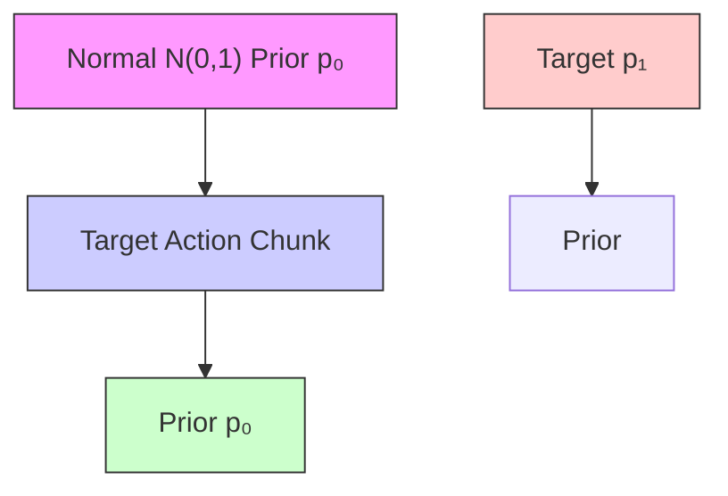
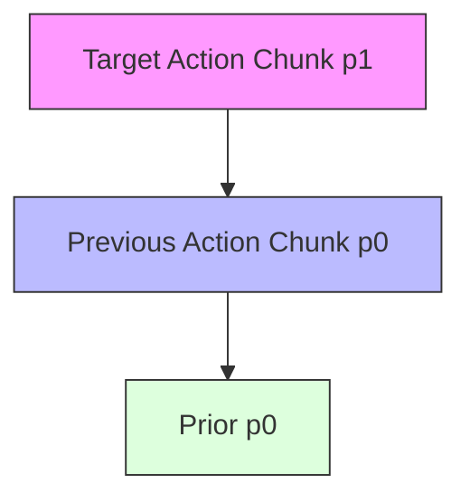
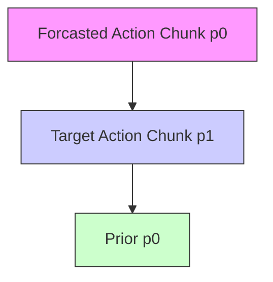
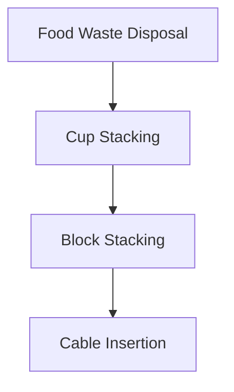

# WarmPrior: Straightening Flow-Matching Policies with Temporal Priors

Sinjae Kang1 Chanyoung Kim1 Kaixin Wang2 Li Zhao2 Kimin Lee1 1KAIST 2Microsoft Research

# Abstract

Generative policies based on diffusion and flow matching have become a dominant paradigm for visuomotor robotic control. We show that replacing the standard Gaussian source distribution with WarmPrior, a simple temporally grounded prior constructed from readily available recent action history, consistently improves success rates on robotic manipulation tasks. We trace this gain to markedly straighter probability paths, echoing the effect of optimal-transport couplings in Rectified Flow. Beyond standard behavior cloning, WarmPrior also reshapes the exploration distribution in prior-space reinforcement learning, improving both sample efficiency and final performance. Collectively, these results identify the source distribution as an important and underexplored design axis in generative robot control. Project page: https://sinnnj.github.io/WarmPrior/.

# 1 Introduction

Learning generative policies for robotic manipulation, such as diffusion policies and flow-matching policies, has become a dominant paradigm for multi-modal behavior cloning (Chi et al., 2023; Bjorck et al., 2025b; Black et al., 2025a). In these frameworks, a neural field transports samples from a fixed source distribution to the data manifold of action chunks. Almost universally, this source distribution is the isotropic Gaussian N (0, I), a convention inherited from diffusion’s denoising-from-noise interpretation (Ho et al., 2020; Song et al., 2021) and preserved by flow matching (Braun et al., 2024; Hu et al., 2024) and its few-step policy descendants (Prasad et al., 2024; Lu et al., 2024; Wang et al., 2025), while progress was pushed through the network, the interpolant, and the integrator. The prior space has been quietly left untouched. Yet as denoising schedules shorten, the starting point absorbs more of the burden that integration steps once carried. A stateless, uninformative source remains blind to the continuous, temporally correlated nature of robotic motion, forcing the policy to rebuild every action chunk from scratch.

We introduce WarmPrior, which replaces this stateless source with a temporally grounded prior whose mean is anchored on recent action history (Figure 1). We instantiate it in two minimal variants: WP-Past anchors the prior on the previously executed action chunk, while WP-Preview trains the policy to predict twice the chunk length at each inference step and reuses the model’s own previous forecast of the current chunk as the prior mean. Both add a residual Gaussian perturbation σ ε so that the source remains a proper distribution, and both leave the network, the interpolant, and the integrator untouched (Section 3).

This deliberately minimal intervention yields gains that compound along three independent axes. Geometrically, starting close to the target manifold shortens the transport and straightens the learned probability paths, acting as an implicit optimal-transport coupling that suppresses the irreducible endpoint ambiguity the network would otherwise average over (Section 5.1). Temporally, the residual scale σ becomes a continuous knob between within-rollout commitment and multimodal expressiveness, supplying an implicit form of the consistency that action chunking enforces explicitly, and largely recovering baseline performance even when chunking is disabled (Section 5.2). Downstream, WarmPrior recenters and shrinks the search space of prior-space reinforcement learning around a temporally grounded mean, so a tighter residual action on top of a pretrained policy outperforms vanilla DSRL (Wagenmaker et al., 2025) in both sample efficiency and asymptotic performance (Section 5.3).

flowchart

flowchart

flowchart

Figure 1: WarmPrior. Standard flow-matching policies transport samples from a context-free $\mathcal { N } ( 0 , I )$ to the action manifold (left). WarmPrior initializes the transport from a temporally grounded Gaussian centered on the recent past-action chunk (Past) or on the model’s own previous forecast of the current chunk (Preview) (middle, right). The resulting probability path is shorter, straighter, and temporally correlated across consecutive chunks.

Empirically, on Robomimic, MimicGen, and a real Franka Research 3 setup, WarmPrior consistently improves success rate over the $\mathcal { N } ( 0 , I )$ baseline with both the Diffusion Policy backbone (Chi et al., 2023) and the VLA model GR00T N1.5 (Bjorck et al., 2025a); the improvement is largest at the lowest inference budgets and on the harder tasks, where the curvature of the flow matters most (Section 4). Taken together, these results promote the source distribution from an inherited default to a first-class, and previously underexplored, design axis in generative robotic control.

# 2 Background and Related Work

Flow-matching policies. Flow matching (Lipman et al., 2023; Albergo et al., 2025) trains a velocity network $v _ { \theta } ( t , a _ { t } , o )$ along the linear interpolant $a _ { t } = \left( 1 - t \right) a _ { 0 } + t a _ { 1 }$ between a source $a _ { 0 } \sim p _ { 0 }$ and data $a _ { 1 } \sim p _ { \mathrm { d a t a } } ( \cdot \mid o )$ , and samples by integrating $\dot { a } _ { t } = v _ { \theta } ( t , a _ { t } , o )$ from $a _ { 0 }$ . This paradigm underlies diffusion and flow-matching policies for behavior cloning (Chi et al., 2023; Janner et al., 2022; Braun et al., 2024; Hu et al., 2024; Chisari et al., 2024) and vision-language-action models (Bjorck et al., 2025b; Black et al., 2025a; Physical Intelligence et al., 2025). Nearly all of them use $p _ { 0 } \stackrel { \cdot } { = } \mathcal { N } ( 0 , I )$ our work revisits that choice.

Optimal-transport couplings and straightened flows. Under the independent coupling $( a _ { 0 } , a _ { 1 } )$ ∼ $p _ { 0 } \otimes p _ { \mathrm { d a t a } }$ , crossing trajectories force the velocity network to average over ambiguous endpoints, producing curved paths. Rectified Flow (Liu et al., 2023), Multisample Flow Matching (Pooladian et al., 2023), OT-CFM (Tong et al., 2024a), and Schrödinger-bridge variants (Shi et al., 2023; Tong et al., 2024b) all reshape this coupling to approximate dynamic OT. WarmPrior is complementary: it leaves the coupling independent and instead reshapes the source distribution so the flow begins already close to data, straightening paths (Section 5.1) without any OT solver or retraining stage.

Informed priors for generative robot policies. Modifying the source of a generative policy is a small but emerging direction. BRIDGER (Chen et al., 2024) replaces the Gaussian source with a data-aware, non-Gaussian source policy and bridges it to the expert distribution via stochastic interpolants. In concurrent work, STEP (Li et al., 2026) trains an auxiliary action predictor whose output, perturbed by scheduled Gaussian noise, is injected at an intermediate denoising step rather than at $t = 0 ,$ so the warm start lives inside the diffusion trajectory. A2A (Jia et al., 2026) also anchors the prior on past actions, but encodes them deterministically into a latent source and composes deterministic ODE and decoder on top, making it effectively a history-conditioned deterministic flow transport model rather than a stochastic generative sampler. In contrast, WarmPrior preserves the stochastic flow-matching formulation end-to-end and focuses squarely on how to construct the prior space $p _ { 0 }$ itself (Section 3).

Algorithm 1 Training and inference of FM policy with WarmPrior.   
1: Input: dataset D, interpolant ( $\alpha, \beta$ ), noise scale $\sigma$ , chunk length H (prediction length is H for Past, 2H for Preview)
2: Parameters: velocity net $v_{\theta}$ (learnable)

TRAINING
3: for each iteration do
4: Sample ( $o, a_{1}, i$ ) ~ D
5: Draw $\varepsilon \sim \mathcal{N}(0, I)$ matching $a_{1}$ ; set $a_{0} \leftarrow \varepsilon$ 6: if PAST then
7: $a_{0} \leftarrow a^{data}[i-H:i] + \sigma\varepsilon$ (when $i \geq H$ )
8: else if PREVIEW then
9: $a_{0}[0:H] \leftarrow a_{1}[0:H] + \sigma\varepsilon[0:H]$ 10: end if
11: $t \sim \mathcal{U}(0,1)$ 12: $a_{t} \leftarrow \alpha(t)a_{0} + \beta(t)a_{1}$ 13: $\mathcal{L} \leftarrow \|v_{\theta}(t, a_{t}, o) - (\dot{\alpha}a_{0} + \dot{\beta}a_{1})\|_{2}^{2}$ 14: Gradient step on $\theta$ 15: end for

INFERENCE
16: $\hat{a}^{prev} \leftarrow \varnothing$ ; reset env, observe o
17: while episode not done do
18: Draw $\varepsilon \sim \mathcal{N}(0, I)$ ; set $a_{0} \leftarrow \varepsilon$ 19: if PAST and $\hat{a}^{prev} \neq \varnothing$ then
20: $a_{0} \leftarrow \hat{a}^{prev} + \sigma\varepsilon$ 21: else if PREVIEW and $\hat{a}^{prev} \neq \varnothing$ then
22: $a_{0}[0:H] \leftarrow \hat{a}^{prev}[H:2H] + \sigma\varepsilon[0:H]$ 23: end if
24: $\hat{a} \leftarrow FMSAMPLE(v_{\theta}, a_{0}, o)$ 25: Execute $\hat{a}[0:H]$ ; observe next o
26: $\hat{a}^{prev} \leftarrow \hat{a}$ 27: end while

# 3 WarmPrior

WarmPrior modifies only the source distribution of a flow-matching policy: it reshapes $p _ { 0 }$ while leaving the network, interpolant, and training objective untouched. We instantiate it as two minimal variants, WarmPrior-Past (WP-Past) and WarmPrior-Preview (WP-Preview), which differ only in how the prior mean is anchored to the agent’s own action history. Below we formalize the common template (Algorithm 1) and then specify each variant in turn.

Formulation. Let $a _ { 0 }$ denote the sample drawn from the prior that the flow-matching ODE transports into the predicted action chunk, with shape $H \times d _ { a }$ for Past and $2 H \times d _ { a }$ for Preview. For a warm index set W over the prediction positions, with cold complement C, and a mean $\mu$ defined on W, WarmPrior samples

$$
a _ {0} [ \tau ] = \left\{ \begin{array}{l l} \mu_ {\tau} + \sigma \varepsilon_ {\tau}, & \tau \in \mathcal {W}, \\ \varepsilon_ {\tau}, & \tau \in \mathcal {C}, \end{array} \right. \quad \varepsilon \sim \mathcal {N} (0, I). \tag {1}
$$

The cold region keeps the vanilla flow-matching prior intact, so positions without a reliable anchor behave exactly as in the standard flow-matching baseline. The scalar $\sigma > 0$ controls the residual noise on warm positions so that the warm region remains a proper distribution rather than a deterministic point mass; we fix σ per variant below and revisit it as a multimodality knob in Section 5.2. Under this formulation, WarmPrior is fully specified by the pair $( \mathcal { W } , \mu )$ together with the prediction length. Our primary goal is to start the generative flow from a plausible target action rather than pure noise, and we propose two variants that differ in how the prior mean $\mu$ is anchored.

WarmPrior-Past. The simplest plausible target is the previous action chunk: WP-Past predicts a single chunk of H actions and anchors $\mu$ on the previous action chunk.

At training, for each sample with in-buffer index i, we retrieve the H preceding actions the replay buffer (normalized to the training action space), verify via a binary searc $a _ { i - H : i } ^ { \mathrm { d a t a } }$ fromisode boundaries that the window lies within a single episode, and set:

$$
\mu_ {\tau} ^ {\text { Past }} = a ^ {\text { data }} [ i - H + \tau ], \quad \text { for } \tau \in \{0, \dots , H - 1 \}. \tag {2}
$$

When the window would cross an episode boundary (e.g., at the start of a demonstration), the sample falls back to $\mathcal { W } = \emptyset$ .

At inference, we directly use the previously executed action chunk, setting $\mu _ { \tau } ^ { \mathrm { P a s t } } = \hat { a } _ { \tau } ^ { \mathrm { p r e v } }$ with $\mathcal { W } = \{ 0 , \ldots , H - 1 \}$ , and fall back to $\mathcal { W } = \bar { \emptyset }$ at the first chunk. We use $\sigma = 0 . 5$ for this variant.

Table 1: Simulation success rate (%) on Robomimic and MimicGen (image) at $H = 8$ across three inference budgets. Parentheses show the absolute gain over the $\mathcal { N } ( 0 , I )$ baseline; green marks gains exceeding $\sigma _ { \mathrm { b a s e } } + \sigma _ { \mathrm { m e t h o d } }$ (non-overlapping 1σ seed intervals). Best per (task, NFE) in bold. 

<table><tr><td rowspan="2">Task</td><td colspan="3">NFE = 9</td><td colspan="3">NFE = 3</td><td colspan="3">NFE = 1</td></tr><tr><td>Base</td><td>WP-Past</td><td>WP-Preview</td><td>Base</td><td>WP-Past</td><td>WP-Preview</td><td>Base</td><td>WP-Past</td><td>WP-Preview</td></tr><tr><td colspan="10">Robomimic — state observation</td></tr><tr><td>Square-PH</td><td>86.7</td><td>88.1 (+1.4)</td><td>88.1 (+1.4)</td><td>86.2</td><td>88.0 (+1.8)</td><td>87.9 (+1.7)</td><td>83.6</td><td>86.6 (+3.0)</td><td>87.3 (+3.7)</td></tr><tr><td>Square-MH</td><td>65.9</td><td>69.2 (+3.3)</td><td>72.7 (+6.8)</td><td>65.4</td><td>73.2 (+7.8)</td><td>72.9 (+7.5)</td><td>65.9</td><td>70.1 (+4.2)</td><td>77.8 (+11.9)</td></tr><tr><td>Transport-PH</td><td>34.1</td><td>36.2 (+2.1)</td><td>43.3 (+9.2)</td><td>39.0</td><td>44.0 (+5.0)</td><td>49.1 (+10.1)</td><td>36.8</td><td>39.8 (+3.0)</td><td>47.6 (+10.8)</td></tr><tr><td>Transport-MH</td><td>16.3</td><td>20.7 (+4.4)</td><td>24.3 (+8.0)</td><td>21.3</td><td>30.7 (+9.4)</td><td>30.4 (+9.1)</td><td>23.3</td><td>30.2 (+6.9)</td><td>34.5 (+11.2)</td></tr><tr><td>Tool-Hang-PH</td><td>79.4</td><td>80.6 (+1.2)</td><td>82.8 (+3.4)</td><td>72.3</td><td>75.1 (+2.8)</td><td>75.8 (+3.5)</td><td>77.7</td><td>78.2 (+0.5)</td><td>81.9 (+4.2)</td></tr><tr><td colspan="10">Robomimic — image observation</td></tr><tr><td>Square-PH</td><td>86.9</td><td>88.2 (+1.3)</td><td>88.7 (+1.7)</td><td>87.7</td><td>89.2 (+1.4)</td><td>89.6 (+1.9)</td><td>88.7</td><td>89.3 (+0.6)</td><td>89.1 (+0.4)</td></tr><tr><td>Square-MH</td><td>76.1</td><td>78.0 (+1.9)</td><td>77.8 (+1.7)</td><td>73.8</td><td>77.9 (+4.1)</td><td>77.1 (+3.2)</td><td>72.4</td><td>77.6 (+5.2)</td><td>75.1 (+2.7)</td></tr><tr><td>Transport-PH</td><td>92.8</td><td>94.5 (+1.7)</td><td>94.3 (+1.6)</td><td>92.1</td><td>93.9 (+1.9)</td><td>94.9 (+2.9)</td><td>91.3</td><td>93.4 (+2.2)</td><td>93.7 (+2.4)</td></tr><tr><td>Transport-MH</td><td>74.8</td><td>79.7 (+4.9)</td><td>79.8 (+4.9)</td><td>73.8</td><td>80.0 (+6.2)</td><td>80.7 (+6.9)</td><td>74.3</td><td>78.6 (+4.3)</td><td>79.7 (+5.4)</td></tr><tr><td>Tool-Hang-PH</td><td>43.7</td><td>45.8 (+2.1)</td><td>56.3 (+12.6)</td><td>36.9</td><td>38.4 (+1.4)</td><td>50.7 (+13.8)</td><td>41.3</td><td>38.9 (-2.4)</td><td>54.0 (+12.7)</td></tr><tr><td colspan="10">MimicGen — image observation</td></tr><tr><td>Stack</td><td>21.4</td><td>22.8 (+1.4)</td><td>31.6 (+10.2)</td><td>21.3</td><td>23.7 (+2.4)</td><td>30.7 (+9.4)</td><td>21.3</td><td>22.4 (+1.1)</td><td>28.7 (+7.4)</td></tr><tr><td>Coffee</td><td>26.8</td><td>29.6 (+2.8)</td><td>34.7 (+7.9)</td><td>23.3</td><td>24.1 (+0.8)</td><td>33.4 (+10.1)</td><td>16.2</td><td>20.4 (+4.2)</td><td>29.4 (+13.2)</td></tr><tr><td>Threading</td><td>13.8</td><td>15.5 (+1.7)</td><td>20.9 (+7.1)</td><td>16.3</td><td>16.6 (+0.3)</td><td>22.0 (+5.7)</td><td>12.5</td><td>15.6 (+3.1)</td><td>18.0 (+5.5)</td></tr></table>

WarmPrior-Preview. WP-Preview trains the policy to look one chunk further than it needs to: instead of predicting a single chunk of H actions, it predicts 2H actions at each inference step and executes only the first H. The second H steps serve as a preview of the next chunk, acting as the model’s own forecast of future actions. When the next decision step arrives, this preview aligns exactly with the first H positions of the new prediction, providing a natural and highly accurate prior mean for the next generation process. Crucially, across both training and inference, the 2H-step generation is strictly partitioned: the first H steps (the actions to be executed) are generated starting from the WarmPrior $( \mathcal { W } = \{ 0 , \dots , H - 1 \} )$ , while the second H steps (the preview) are generated starting from pure Gaussian noise $( \mathcal C = \{ \dot { H } , \dots , 2 H - 1 \} )$ ).

At training, we face a chicken-and-egg problem: the ideal prior mean would be the model’s own past preview, which is unavailable before the model is trained. However, the ground-truth target itself is precisely the limit that a perfectly calibrated preview would converge to: at convergence, the model’s prior forecast of the current chunk should coincide with the chunk itself. Thus, we can simply use the ground-truth target itself as a proxy for a perfectly calibrated preview:

$$
\mu_ {\tau} ^ {\text { Preview }} = a _ {1} [ \tau ], \quad \text { for } \tau \in \{0, \dots , H - 1 \}, \tag {3}
$$

where $a _ { 1 } \in \mathbb { R } ^ { 2 H \times d _ { a } }$ spans the full 2H-step horizon. We use $\sigma = 1 . 0$ for this variant.

At inference, let $\hat { a } ^ { \mathrm { p r e v } } \in \mathbb { R } ^ { 2 H \times d _ { a } }$ be the previous 2H-step prediction. WP-Preview sets

$$
\mu_ {\tau} ^ {\text { Preview }} = \hat {a} ^ {\text { prev }} [ H + \tau ], \quad \text { for   } \tau \in \{0, \dots , H - 1 \}, \tag {4}
$$

so that the warm first half of the new prior carries the previous forecast of the current chunk, while the cold second half covers the new horizon that no previous preview has seen. At the first chunk of an episode, where no previous prediction exists, we fall back to $\mathcal { W } = \emptyset$ .

Optimal transport. Among the WarmPrior variants we consider, Preview is the choice that pushes the prior mean as close as possible to the target: when the preview is accurate, the flow starts directly on the model’s own forecast of the current chunk and only has to correct its residual error (Section 5.1).

Residual policy interpretation. Because the warm portion of the prior already is a prediction of the current chunk, the flow only needs to learn the correction $a _ { 1 } - \dot { \mu } ^ { \mathrm { P r e v i e w } }$ on top of a committed forecast. In this sense, WP-Preview turns the generative policy into a residual policy that refines its own previous plan.

# 4 Main Results

# 4.1 Simulation

Setup. We evaluate in simulation on two robotic manipulation benchmarks: Robomimic (Mandlekar et al., 2021) and MimicGen (Mandlekar et al., 2023). On Robomimic we evaluate under both stateand image-observation regimes on SQUARE, TRANSPORT, and TOOL-HANG in the PH (proficienthuman) split, plus the harder MH (multi-human) splits for SQUARE and TRANSPORT, omitting LIFT and CAN on which the flow-matching policy already saturates near 100% success rate. On MimicGen we use the human-demonstration datasets (10 demos per task) for STACK, COFFEE, and THREADING under image observations.

We evaluate WarmPrior on the Diffusion Policy (ChiTransformer) (Chi et al., 2023), a widely adopted policy architecture, trained here with flow matching. All methods share the linear flow interpolant; only the source distribution changes. Since behavior-cloning training curves for Diffusion Policy on Robomimic are known to be noticeably noisy across checkpoints (Mandlekar et al., 2021), we train these models for a sufficient 200k iterations at a batch size of 1024 (state) or 256 (image). To mitigate this variance, we evaluate at regularly spaced checkpoints and average the performance of the top-3 checkpoints per seed. The success rate is computed over 200 episodes and 3 seeds at three inference budgets $( \mathrm { N F E } \in \{ 9 , 3 , 1 \} )$ ). Unless stated otherwise, the action-chunk length is $H = 8$ for both Robomimic and MimicGen. Full training hyperparameters and additional implementation details are provided in Section C.

Performance improvements. Table 1 reports the full NFE sweep. The majority of evaluations exhibit non-overlapping one-standard-deviation intervals between the baseline and our method (green deltas), demonstrating that this simple modification to the prior distribution yields a highly significant performance boost. Furthermore, bold values highlight the best performance among the evaluated methods. While WP-Past achieves respectable performance gains, WP-Preview demonstrates even greater improvements. Finally, we observe that the magnitude of these improvements is most pronounced at the lowest inference budget, with the largest average performance gains occurring at NFE = 1. We discuss the underlying reasons for both observations in Section 5.1.

# 4.2 Real-Robot Experiments

To validate our approach in the real world, we deploy our method on a Franka Research 3. As illustrated in Figure 2, we construct four tabletop manipulation tasks and collect human teleoperation demonstrations using the DROID platform setup (Khazatsky et al., 2024). Each task is trained on a dataset of 30 demonstrations.

For the policy architecture, we employ the GR00T N1.5 VLA model (Bjorck et al., 2025a), which also utilizes a flow-matching action head. The models are trained for 30k steps with a batch size of 64; further training details are provided in Section C. During inference, the number of function evaluations (NFE) is fixed to 4. We evaluate the performance using 3 independent training seeds, conducting 50 evaluation trials per seed. As reported in Figure 3, WarmPrior consistently improves the overall success rate across all four real-world tasks, with the largest gains on the precision-demanding Cable Insertion and Block Stacking.

# 5 Understanding and Extending WarmPrior

In this section, we investigate why replacing the standard N (0, I) source with WarmPrior translates into the consistent gains of Section 4, and what further consequences follow. Section 5.1 gives a geometric account: WarmPrior shortens the transport and straightens the learned probability paths. Section 5.2 reveals a second, independent benefit, temporal consistency: WarmPrior supplies a σ-tunable form of the consistency that action chunking provides explicitly, and the effect is most pronounced when explicit chunking is turned off (H = 1). Section 5.3 then extends the same prior to reinforcement learning, showing that it also reshapes the exploration space of prior-space RL. The first two subsections explain the behavior-cloning gains of Table 1; the third is a natural extension of WarmPrior to a downstream setting.

flowchart

Figure 2: Real-robot tasks. Four tabletop manipulation scenes used in Figure 3: Food Waste Disposal, Cup Stacking, Block Stacking, and Cable Insertion.

bar

| Category | N(0, I) | WP-Past | WP-Preview |
| :--- | :--- | :--- | :--- |
| Food Waste Disposal | 0.76 | 0.90 | 0.87 |
| Cup Stacking | 0.33 | 0.36 | 0.45 |
| Block Stacking | 0.43 | 0.60 | 0.67 |
| Cable Insertion | 0.15 | 0.36 | 0.41 |

Figure 3: Real-robot success rate. We evaluate WP-Past, WP-Preview, and the $\mathcal { N } ( 0 , I )$ baseline on four tabletop manipulation tasks, reporting the mean and standard deviation over three training seeds (50 trials per seed).

# 5.1 WarmPrior Improves SR by Straightening Flow Trajectories

Empirical observation. Figure 4 shows the integration paths of $a _ { t }$ for a baseline flow policy and for WarmPrior on the same observations from Robomimic SQUARE-MH. The baseline paths curve noticeably as the network pulls samples from a random origin onto the action manifold; the WarmPrior paths, already starting close to the manifold, are visibly straighter and more parallel. Intuitively, because fewer flows cross one another, the conditional flowmatching network spends less capacity realigning samples from the random base distribution and can devote more to refining actions, exactly where it matters for downstream success rate.

Curvature diagnostic. To make the observation quantitative, we measure the pathwise curvature of the learned flow. For a smooth path $a : [ 0 , 1 ] $ $\mathbb { R } ^ { H \times d _ { a } }$ with $\dot { \boldsymbol { a } } _ { t } = v _ { \theta } ( t , { \boldsymbol { a } } _ { t } , o )$ we use the standard velocity-variance surrogate

$$
\kappa (o) = \int_ {0} ^ {1} \| \dot {a} _ {t} - \bar {v} \| _ {2} ^ {2} d t, \quad \bar {v} = \int_ {0} ^ {1} \dot {a} _ {t} d t, \tag {5}
$$

evaluated by finite differences along the Euler sampler with $N = 1 0 0$ steps. We compute $\kappa ( o )$ over 2,000 validation observations and report the average

line

| Normalized Action | p0 (Normal) | p0 (WP-Past) | p0 (WP-Preview) |
| ----------------- | ----------- | ------------ | --------------- |
| -1                | 0.0         | 0.0          | 0.0             |
| 0                 | 1.0         | 1.0          | 1.0             |
| 1                 | 0.0         | 0.0          | 0.0             |

Figure 4: Flow trajectories on SQUARE-MH. Normalized action coordinate vs. denoising time $t \in [ 0 , 1 ] ;$ bottom markers: prior p0, top markers: prediction $p _ { 1 }$ .

Table 2: Pathwise curvature $\kappa ( o )$ of the learned flow on state-observation tasks (Equation $( 5 ) ;$ lower is straighter; values normalized so the $\mathcal { N } ( 0 , I )$ baseline reads 1.000). 

<table><tr><td>Task</td><td> $\mathcal{N}(0, I)$ </td><td>WP-Past</td><td>WP-Preview</td></tr><tr><td>Square-PH</td><td>1.000</td><td>0.823</td><td>0.803</td></tr><tr><td>Square-MH</td><td>1.000</td><td>0.705</td><td>0.559</td></tr><tr><td>Transport-PH</td><td>1.000</td><td>0.720</td><td>0.692</td></tr><tr><td>Transport-MH</td><td>1.000</td><td>0.695</td><td>0.637</td></tr><tr><td>Tool-Hang-PH</td><td>1.000</td><td>0.806</td><td>0.807</td></tr></table>

in Table 2. Every task exhibits a reduction in mean curvature, and the relative reduction tracks the success-rate gain of Table 1: tasks with the largest curvature reduction (SQUARE-MH, TRANSPORT-MH) are also the tasks with the largest SR gain, supporting the straightening-explains-performance hypothesis.

Branching cost: an irreducible residual. The curvature reduction has a measure-theoretic origin we call the branching cost. Vectorize an action chunk into $\mathbb { R } ^ { d } .$ , let $( A _ { 0 } , A _ { 1 } ) \sim \Pi _ { o }$ denote the conditional joint law of source and target, and write $A _ { t } = ( 1 - t ) A _ { 0 } + t A _ { 1 }$ . The flow-matching objective $\begin{array} { r } { \mathcal { L } _ { o } ( v ) = \int _ { 0 } ^ { 1 } \mathbb { E } _ { \Pi _ { o } } [ \| v _ { t } ( A _ { t } , o ) - ( A _ { 1 } - A _ { 0 } ) \| ^ { 2 } \ | \ d ] ^ { \frac { } { } } } \end{array}$ o] dt regresses the transport direction $A _ { 1 } - A _ { 0 }$ , and because only $( A _ { t } , o )$ is observable, the best attainable predictor is the conditional expectation $v _ { t } ^ { \star } ( x , o ) = \mathbb { E } [ A _ { 1 } - A _ { 0 } \ | \ A _ { t } = x , o ]$ . The residual error this predictor cannot eliminate,

$$
\mathcal {B} (o) := \mathcal {L} _ {o} (v ^ {\star}) = \int_ {0} ^ {1} \frac {\mathbb {E} [ \| A _ {1} - \mathbb {E} [ A _ {1} | A _ {t} , o ] \| ^ {2} \mid o ]}{(1 - t) ^ {2}} d t, \tag {6}
$$

measures how ambiguous $A _ { 1 }$ remains after observing $A _ { t } \mathrm { : }$ when many distinct targets share an $A _ { t } ,$ $v ^ { \star }$ must average over them and the trajectory bends. A standard total-variance decomposition splits the coupling cost $\mathbb { E } [ \left. A _ { 1 } - A _ { 0 } \right. ^ { 2 } \big | ~ o ]$ into the kinetic action of $v ^ { \star }$ plus $B ( o )$ (see Section B for the full derivation); the second term is pure excess caused by directional ambiguity and vanishes for OT couplings, where $\boldsymbol { B } \equiv \boldsymbol { 0 }$ (McCann, 1997; Benamou and Brenier, 2000).

  
Figure 5: Mode switching in a 1D navigation toy. All policies share a 1024-d 4-layer MLP backbone trained for 50k iterations with batch size 256. Six demonstrations pass through two obstacles (three above, three below), inducing a bimodal $p ( a \mid o )$ at each position. (a) training data; (b) regression collapses to the mean; (c) naive flow matching recovers both modes but oscillates between them; (d) history-conditioned flow matching commits within a rollout but drifts off-manifold under inference-time history shift; (e, f) WarmPrior at $\sigma { = } 0 . \mathrm { \sigma }$ 1 and $\sigma { = } 0 . 5$ commits per rollout, with σ tuning between temporal consistency and multimodality.

How WarmPrior reduces the branching cost. WarmPrior writes the source as $A _ { 0 } = P _ { \tiny W } ( \mu +$ $\sigma \Xi ) + P c \Xi$ with $\Xi \sim \mathcal { N } ( 0 , I )$ independent of $( A _ { 1 } , \mu )$ given $^ { O , }$ where $P _ { \mathcal { W } }$ projects onto the warm coordinates $( d _ { \mathcal { W } }$ dimensions) and $P c = I - P _ { \ l W }$ . Bounding the optimal predictor’s error by that of the simpler predictor $P _ { \mathcal { W } } A _ { t }$ cancels the $( 1 - t ) ^ { 2 }$ factor in (6) (Section B, Proposition B.2), giving

$$
\mathcal {B} _ {\mathcal {W}} (o) \leq \underbrace {\mathbb {E} \left[ \| P _ {\mathcal {W}} (A _ {1} - \mu) \| ^ {2} \mid o \right]} _ {\text { mean   mismatch }} + \sigma^ {2} d _ {\mathcal {W}}. \tag {7}
$$

The warm-coordinate branching cost is therefore controlled by two intuitive quantities: how well the prior mean µ predicts the target, and how much residual noise σ is injected. This immediately explains the ordering of our variants. Preview sets $\mu$ to a forecast of the current chunk, so the mismatch reduces to the forecast error $\mathbb { E } [ \left. E \right. ^ { 2 } \big | \ o ]$ with $P _ { \mathcal { W } } A _ { 1 } = P _ { \mathcal { W } } \mu + E \mathrm { : }$ ; in the idealized limit of an exact forecast $( E = 0 )$ only the irreducible $\dot { \sigma } ^ { 2 } d _ { W }$ term survives. Past reuses the previously executed chunk, replacing E with the persistence residual R between consecutive chunks and yielding the same form (prediction error) $- \sigma ^ { 2 } d _ { W }$ . Whenever the forecaster improves on persistence $\left( \mathbb { E } [ \| E \| ^ { 2 } \ | \ o ] \leq \mathbb { E } [ \| R \| ^ { 2 } \ | \ o ] \right)$ , Preview attains a tighter bound, matching the ordering observed in Table 1. In both cases WarmPrior acts as an amortized approximation to the OT coupling, shortening transport and suppressing the directional ambiguity that bends the learned field.

The bound also exposes a trade-off along $\sigma ,$ an axis separate from aligning $\mu { : }$ smaller σ tightens $\sigma ^ { 2 } d _ { \mathcal { W } }$ in Equation (7) and favors a straighter field, but concentrates the source onto $\mu ,$ , which only helps if $\mu$ is reliable. In practice it is not (WP-Past carries the persistence residual, WP-Preview the forecast error), so an overly small σ leaves no slack to absorb this variability and degrades success rate. The right σ balances straightness against robustness to prior-mean diversity; we defer the full ablation to Section D.

# 5.2 WarmPrior as a Tunable Source of Temporal Consistency

Beyond the geometric benefit of Section 5.1, WarmPrior provides a second, independent advantage: a tunable form of implicit temporal consistency between consecutive inferences.

Mode switching in generative control policies. Consider the 1D navigation toy in Figure 5(a), where the observation o is the agent’s horizontal position and the action a is its vertical height. Demonstrations split evenly between passing above and passing below each obstacle, so the conditional distribution $p ( a \mid o )$ is multimodal at every o. A regression policy averages the branches and collapses to the mean, driving straight through the obstacle (Figure 5, panel b). A flow-matching policy trained on the standard objective recovers both modes, but only at the level of per-inference marginals: the objective places no constraint linking the chunk produced at one inference to the chunk produced at the next. The policy is therefore free to pick a different mode at each inference, yielding an execution that oscillates rapidly between them, a pathology we term mode switching (Figure 5, panel c). Action chunking (Zhao et al., 2023) enforces commitment within a chunk, but the objective still treats consecutive chunks independently and the oscillation persists at every chunk boundary. A natural remedy is to condition the policy on the action history h, but naive history conditioning is costly and fragile: it substantially slows convergence and inflates per-step compute and memory (Koo et al., 2025), and has two further drawbacks. First, conditioning on h pins the policy to whichever mode its history already commits to, reducing the effective multimodality of $p ( a \mid o ) ;$ : in Figure 5(d), every rollout follows either an above-above or a below-below path, with no recombination across branches. Second, at inference time small execution errors compound into a distributional shift over h.

Tunable temporal consistency via σ. Because the prior mean is correlated with the previous action chunk, a small σ keeps the new chunk inside the nearby mode’s basin and prevents the flow from crossing between distant modes (Figure 5, panel e), while a large σ broadens the source and recovers more of the multimodal distribution at every step (Figure 5, panel f). The prior variance therefore acts as a continuous regulator between temporal consistency and multimodality. Crucially, unlike history conditioning or long action chunks that explicitly enforce temporal consistency at training or inference time, WarmPrior only implicitly biases the source distribution: within each rollout it commits the policy to a single coherent mode, while leaving the generative policy’s room for multimodality intact across rollouts.

Isolating the consistency effect at $H = 1$ . To strip away explicit chunking and isolate the prior’s implicit consistency bias, we set $H = 1$ , so the policy runs a fresh inference every timestep and the WarmPrior becomes the sole source of inter-step consistency. Figure 6 reports SR at $H = 1$ and NFE = 1. The $\mathcal { N } ( 0 , I )$ baseline degrades sharply (e.g. TRANSPORT-MH: $2 3 . 3 \% \to 1 . 3 \% )$ , while WarmPrior recovers most of the lost performance, with gains of up to +14.8 on MimicGen COFFEE. These gains are consistently larger than at the default $\bar { H } = 8$ , confirming that the prior carries more weight once explicit chunking is stripped away.

Practical implication. Action chunking locks the policy to an H-step plan and cannot react to new observations within a chunk, which is a liability on tasks requiring fast reactivity. WarmPrior offers an alternative that preserves temporal consistency while allowing per-step re-planning, and we see this direction as a promising avenue for future work.

# 5.3 WarmPrior Improves Prior-Space RL Efficiency

Beyond behavior cloning, the same source-distribution shaping extends to the RL stage: using the WarmPrior-pretrained policy as the frozen base, the prior mean additionally reshapes the exploration space of prior-space reinforcement learning and yields a substantial efficiency gain.

Background: DSRL. DSRL (Wagenmaker et al., 2025) fine-tunes a pretrained diffusion policy with reinforcement learning by acting in the prior space: instead of having the RL agent output actions directly, the agent proposes the prior sample $a _ { 0 } ,$ , which is then mapped deterministically to an action $a _ { 1 }$ via the frozen pretrained policy’s ODE sampler (DDIM (Song et al., 2021) or flow-matching). The RL action space is $\mathbb { R } ^ { H \times d _ { a } }$ with the shape of the prior. By acting on the prior sample, DSRL eliminates the need to backpropagate through the diffusion sampler and makes the policy compatible with off-the-shelf RL algorithms. Two algorithms are commonly used within this framework: DSRL-$\mathbf { S A C } .$ , which applies SAC (Haarnoja et al., 2018) directly to the noise-space MDP, and DSRL-NA, which exploits the diffusion policy’s noise-aliasing structure through a dual-critic scheme that distills an action-space critic $Q ^ { A }$ into a noise-space critic $Q ^ { W }$ . However, the exploration space remains the uninformative $\mathcal { N } ( 0 , I )$ prior, forcing the RL agent to search across the full prior from scratch.

bar

| Method       | N(0, I) | WP-Past | WP-Preview |
| ------------ | ------- | ------- | ---------- |
| SQ PH        | 0.62    | 0.72    | 0.63       |
| SQ MH        | 0.24    | 0.37    | 0.35       |
| TP PH        | 0.05    | 0.26    | 0.08       |
| TP MH        | 0.01    | 0.06    | 0.02       |
| TH PH        | 0.30    | 0.43    | 0.29       |
| Stack        | 0.16    | 0.25    | 0.19       |
| Coffee       | 0.18    | 0.32    | 0.25       |
| Threading    | 0.11    | 0.11    | 0.13       |

Figure 6: Action-chunk length H = 1 results (NFE= 1). Five Robomimic state tasks and three MimicGen image tasks.

line

| Timesteps (×10⁶) | DSRL-SAC | DSRL-NA | WP-Past | WP-Preview |
| ---------------- | -------- | ------- | ------- | ---------- |
| 0.0              | 0.5      | 0.5     | 0.5     | 0.5        |
| 1.5              | 0.7      | 0.8     | 0.8     | 0.9        |
| 3.0              | 0.6      | 0.9     | 0.9     | 1.0        |
| 4.5              | 0.7      | 0.8     | 0.8     | 0.9        |
| 9.0              | 0.8      | 0.9     | 0.9     | 1.0        |

Figure 7: Prior-space RL. DSRL baselines vs. WarmPrior variants on Robomimic SQUARE and TRANSPORT, averaged over 3 seeds (±1σ shading).

Method: Conditioned-residual WarmPrior. WarmPrior offers an immediate structural improvement: because the WarmPrior mean is already close to the target action manifold, the RL agent only has to learn a bounded residual around it. Concretely, we extend the observation to $\tilde { o } = [ o , \mu ]$ and bound the RL action to a small magnitude δ:

$$
a _ {0} = \mu + \Delta , \quad \Delta = \pi_ {\mathrm{RL}} (\tilde {o}) \in [ - \delta , \delta ] ^ {H \times d _ {a}}. \tag {8}
$$

In practice we set $\delta = 0 . 5$ , compared to $\delta = 1 . 5$ used by vanilla DSRL. The RL agent now explores a 3× tighter region centered on a temporally grounded WarmPrior mean rather than the origin, so the agent no longer searches the full prior from scratch and instead refines a local correction around an anchor that is already a competent action. The RL policy also receives the prior mean $\mu$ as part of its augmented observation o˜. Since $\mu$ already encodes past chunks, appending it to the observation absorbs that dependency into the state so the RL problem stays Markovian, and it lets the residual ∆ adapt to the current anchor.

Setup. Among the Robomimic tasks, LIFT and CAN are already near-saturated under BC, so we run RL fine-tuning on SQUARE and TRANSPORT with a frozen WarmPrior backbone pretrained by behavior cloning for 3000 epochs. Our WP-Past and WP-Preview instantiate DSRL-NA with the conditioned residual of (8), and we compare against vanilla DSRL-SAC and DSRL-NA as baselines.

Findings. Figure 7 shows that WP-Past and WP-Preview learn faster, converge more stably, and reach a higher asymptote than both DSRL baselines: both consistently exceed 0.99 on SQUARE, and on TRANSPORT they attain ∼ 0.97, while DSRL-NA and DSRL-SAC plateau around 0.9. To our knowledge, this is the first result to stably surpass 95% success on TRANSPORT, the hardest of the Robomimic tasks, by RL fine-tuning of a flow-matching policy. Because WarmPrior provides an efficient, semantically meaningful prior space centered on $\mu ( o , h )$ , searching over it is far more valuable than exploring an uninformed random noise space.

# 6 Conclusion

We revisited the source distribution of generative robotic policies and showed that replacing the uninformative $\mathcal { N } ( 0 , I )$ with a temporally grounded WarmPrior consistently improves success rate on Robomimic, MimicGen, and a real Franka setup. This single design choice straightens the learned flow in an OT-aligned sense, exposes a continuous σ-knob between within-rollout consistency and multimodal expressiveness, and shrinks the search space of prior-space RL on top of the pretrained policy. Because WarmPrior leaves the network, interpolant, and loss untouched, we view the prior distribution as a new axis worth exploring in generative-policy design.

# References

Michael S. Albergo, Nicholas M. Boffi, and Eric Vanden-Eijnden. Stochastic interpolants: A unifying framework for flows and diffusions. Journal of Machine Learning Research, 26(209):1–80, 2025.   
Jean-David Benamou and Yann Brenier. A computational fluid mechanics solution to the Monge– Kantorovich mass transfer problem. Numerische Mathematik, 84(3):375–393, 2000.   
Johan Bjorck, Valts Blukis, Fernando Castañeda, Nikita Cherniadev, Xingye Da, Runyu Ding, Linxi Fan, Yu Fang, Dieter Fox, Fengyuan Hu, Spencer Huang, Joel Jang, Xiaowei Jiang, Jan Kautz, Kaushil Kundalia, Zhiqi Li, Kevin Lin, Zongyu Lin, Loic Magne, Yunze Man, Ajay Mandlekar, Avnish Narayan, Soroush Nasiriany, Scott Reed, You Liang Tan, Guanzhi Wang, Jing Wang, Qi Wang, Shihao Wang, Jiannan Xiang, Yuqi Xie, Yinzhen Xu, Seonghyeon Ye, Zhiding Yu, Yizhou Zhao, Zhe Zhang, Ruijie Zheng, and Yuke Zhu. GR00T N1.5: An open foundation model for generalist humanoid robots. NVIDIA Isaac GR00T technical report, 2025a.   
Johan Bjorck, Fernando Castañeda, Nikita Cherniadev, Xingye Da, Runyu Ding, Linxi Fan, Yu Fang, Dieter Fox, Fengyuan Hu, Spencer Huang, et al. GR00T N1: An open foundation model for generalist humanoid robots. arXiv preprint arXiv:2503.14734, 2025b.   
Kevin Black, Noah Brown, Danny Driess, Adnan Esmail, Michael Equi, Chelsea Finn, Niccolo Fusai, Lachy Groom, Karol Hausman, Brian Ichter, Szymon Jakubczak, Tim Jones, Liyiming Ke, Sergey Levine, Adrian Li-Bell, Mohith Mothukuri, Suraj Nair, Karl Pertsch, Lucy Xiaoyang Shi, James Tanner, Quan Vuong, Anna Walling, Haohuan Wang, and Ury Zhilinsky. π0: A vision-language-action flow model for general robot control. In Robotics: Science and Systems, 2025a.   
Kevin Black, Manuel Y. Galliker, and Sergey Levine. Real-time execution of action chunking flow policies. arXiv preprint arXiv:2506.07339, 2025b.   
Max Braun, Noémie Jaquier, Leonel Rozo, and Tamim Asfour. Riemannian flow matching policy for robot motion learning. In IEEE/RSJ International Conference on Intelligent Robots and Systems, 2024.   
Guo Chen, Zhiqi Li, Shihao Wang, Jindong Jiang, Yicheng Liu, Lidong Lu, De-An Huang, Wonmin Byeon, Matthieu Le, Tuomas Rintamaki, Tyler Poon, Max Ehrlich, Tong Lu, Limin Wang, Bryan Catanzaro, Jan Kautz, Andrew Tao, Zhiding Yu, and Guilin Liu. Eagle 2.5: Boosting long-context post-training for frontier vision-language models. arXiv preprint arXiv:2504.15271, 2025.   
Kaiqi Chen, Eugene Lim, Kelvin Lin, Yiyang Chen, and Harold Soh. Don’t start from scratch: Behavioral refinement via interpolant-based policy diffusion. arXiv preprint arXiv:2402.16075, 2024.   
Cheng Chi, Zhenjia Xu, Siyuan Feng, Eric Cousineau, Yilun Du, Benjamin Burchfiel, Russ Tedrake, and Shuran Song. Diffusion policy: Visuomotor policy learning via action diffusion. In Robotics: Science and Systems, 2023.   
Eugenio Chisari, Nick Heppert, Max Argus, Tim Welschehold, Thomas Brox, and Abhinav Valada. Learning robotic manipulation policies from point clouds with conditional flow matching. In Conference on Robot Learning, 2024.   
Tuomas Haarnoja, Aurick Zhou, Pieter Abbeel, and Sergey Levine. Soft actor-critic: Off-policy maximum entropy deep reinforcement learning with a stochastic actor. In International Conference on Machine Learning, 2018.   
Kaiming He, Xiangyu Zhang, Shaoqing Ren, and Jian Sun. Deep residual learning for image recognition. In IEEE Conference on Computer Vision and Pattern Recognition, 2016.   
Jonathan Ho, Ajay Jain, and Pieter Abbeel. Denoising diffusion probabilistic models. In Advances in Neural Information Processing Systems, 2020.   
Xixi Hu, Bo Liu, Xingchao Liu, and Qiang Liu. AdaFlow: Imitation learning with variance-adaptive flow-based policies. In Advances in Neural Information Processing Systems, 2024.

Michael Janner, Yilun Du, Joshua B. Tenenbaum, and Sergey Levine. Planning with diffusion for flexible behavior synthesis. In International Conference on Machine Learning, 2022.   
Jindou Jia, Gen Li, Xiangyu Chen, Tuo An, Yuxuan Hu, Jingliang Li, Xinying Guo, and Jianfei Yang. Action-to-action flow matching. arXiv preprint arXiv:2602.07322, 2026.   
Alexander Khazatsky, Karl Pertsch, Suraj Nair, Ashwin Balakrishna, Sudeep Dasari, Siddharth Karamcheti, Soroush Nasiriany, Mohan Kumar Srirama, Lawrence Yunliang Chen, Kirsty Ellis, et al. DROID: A large-scale in-the-wild robot manipulation dataset. In Robotics: Science and Systems, 2024.   
Myungkyu Koo, Daewon Choi, Taeyoung Kim, Kyungmin Lee, Changyeon Kim, Younggyo Seo, and Jinwoo Shin. HAMLET: Switch your vision-language-action model into a history-aware policy. arXiv preprint arXiv:2510.00695, 2025.   
Jinhao Li, Yuxuan Cong, Yingqiao Wang, Hao Xia, Shan Huang, Yijia Zhang, Ningyi Xu, and Guohao Dai. STEP: Warm-started visuomotor policies with spatiotemporal consistency prediction. arXiv preprint arXiv:2602.08245, 2026.   
Yaron Lipman, Ricky T. Q. Chen, Heli Ben-Hamu, Maximilian Nickel, and Matthew Le. Flow matching for generative modeling. In International Conference on Learning Representations, 2023.   
Xingchao Liu, Chengyue Gong, and Qiang Liu. Flow straight and fast: Learning to generate and transfer data with rectified flow. In International Conference on Learning Representations, 2023.   
Ilya Loshchilov and Frank Hutter. Decoupled weight decay regularization. In International Conference on Learning Representations, 2019.   
Guanxing Lu, Zifeng Gao, Tianxing Chen, Wenxun Dai, Ziwei Wang, Wenbo Ding, and Yansong Tang. ManiCM: Real-time 3D diffusion policy via consistency model for robotic manipulation. arXiv preprint arXiv:2406.01586, 2024.   
Ajay Mandlekar, Danfei Xu, Josiah Wong, Soroush Nasiriany, Chen Wang, Rohun Kulkarni, Li Fei-Fei, Silvio Savarese, Yuke Zhu, and Roberto Martín-Martín. What matters in learning from offline human demonstrations for robot manipulation. In Conference on Robot Learning, 2021.   
Ajay Mandlekar, Soroush Nasiriany, Bowen Wen, Iretiayo Akinola, Yashraj Narang, Linxi Fan, Yuke Zhu, and Dieter Fox. MimicGen: A data generation system for scalable robot learning using human demonstrations. In Conference on Robot Learning, 2023.   
Robert J. McCann. A convexity principle for interacting gases. Advances in Mathematics, 128(1): 153–179, 1997.   
William Peebles and Saining Xie. Scalable diffusion models with transformers. In IEEE/CVF International Conference on Computer Vision, 2023.   
Physical Intelligence, Kevin Black, Noah Brown, James Darpinian, Karan Dhabalia, Danny Driess, Adnan Esmail, Michael Equi, Chelsea Finn, Niccolo Fusai, Manuel Y. Galliker, Dibya Ghosh, Lachy Groom, Karol Hausman, Brian Ichter, Szymon Jakubczak, Tim Jones, Liyiming Ke, Devin LeBlanc, Sergey Levine, Adrian Li-Bell, Mohith Mothukuri, Suraj Nair, Karl Pertsch, Allen Z. Ren, Lucy Xiaoyang Shi, Laura Smith, Jost Tobias Springenberg, Kyle Stachowicz, James Tanner, Quan Vuong, Homer Walke, Anna Walling, Haohuan Wang, Lili Yu, and Ury Zhilinsky. π0.5: A vision-language-action model with open-world generalization. arXiv preprint arXiv:2504.16054, 2025.   
Aram-Alexandre Pooladian, Heli Ben-Hamu, Carles Domingo-Enrich, Brandon Amos, Yaron Lipman, and Ricky T. Q. Chen. Multisample flow matching: Straightening flows with minibatch couplings. In International Conference on Machine Learning, 2023.   
Aaditya Prasad, Kevin Lin, Jimmy Wu, Linqi Zhou, and Jeannette Bohg. Consistency policy: Accelerated visuomotor policies via consistency distillation. In Robotics: Science and Systems, 2024.

Qwen Team. Qwen3 technical report. arXiv preprint arXiv:2505.09388, 2025.   
Yuyang Shi, Valentin De Bortoli, Andrew Campbell, and Arnaud Doucet. Diffusion Schrödinger bridge matching. In Advances in Neural Information Processing Systems, 2023.   
Jiaming Song, Chenlin Meng, and Stefano Ermon. Denoising diffusion implicit models. In International Conference on Learning Representations, 2021.   
Alexander Tong, Kilian Fatras, Nikolay Malkin, Guillaume Huguet, Yanlei Zhang, Jarrid Rector-Brooks, Guy Wolf, and Yoshua Bengio. Improving and generalizing flow-based generative models with minibatch optimal transport. Transactions on Machine Learning Research, 2024a.   
Alexander Tong, Nikolay Malkin, Kilian Fatras, Lazar Atanackovic, Yanlei Zhang, Guillaume Huguet, Guy Wolf, and Yoshua Bengio. Simulation-free Schrödinger bridges via score and flow matching. In International Conference on Artificial Intelligence and Statistics, 2024b.   
TRI LBM Team. A careful examination of large behavior models for multitask dexterous manipulation. arXiv preprint arXiv:2507.05331, 2025.   
Ashish Vaswani, Noam Shazeer, Niki Parmar, Jakob Uszkoreit, Llion Jones, Aidan N. Gomez, Lukasz Kaiser, and Illia Polosukhin. Attention is all you need. In Advances in Neural Information Processing Systems, 2017.   
Andrew Wagenmaker, Mitsuhiko Nakamoto, Yunchu Zhang, Seohong Park, Waleed Yagoub, Anusha Nagabandi, Abhishek Gupta, and Sergey Levine. Steering your diffusion policy with latent space reinforcement learning. arXiv preprint arXiv:2506.15799, 2025.   
Zhendong Wang, Zhaoshuo Li, Ajay Mandlekar, Zhenjia Xu, Jiaojiao Fan, Yashraj Narang, Linxi Fan, Yuke Zhu, Yogesh Balaji, Mingyuan Zhou, Ming-Yu Liu, and Yu Zeng. One-step diffusion policy: Fast visuomotor policies via diffusion distillation. In International Conference on Machine Learning, 2025.   
Yuxin Wu and Kaiming He. Group normalization. In European Conference on Computer Vision, 2018.   
Xiaohua Zhai, Basil Mustafa, Alexander Kolesnikov, and Lucas Beyer. Sigmoid loss for language image pre-training. In IEEE/CVF International Conference on Computer Vision, 2023.   
Tony Z. Zhao, Vikash Kumar, Sergey Levine, and Chelsea Finn. Learning fine-grained bimanual manipulation with low-cost hardware. In Robotics: Science and Systems, 2023.

# A Visualizing Success-Rate Uncertainty with Beta Posteriors

We adopt the evaluation philosophy of TRI LBM Team (2025), which argues that single-number means with Gaussian error bars are an impoverished summary of policy performance and instead pushes for full posterior visualizations of the success-rate parameter. A seed-standard-error bar implicitly assumes the per-seed SR is symmetric and well approximated by a Gaussian; for a Bernoulli event near 0 or 1 the likelihood is skewed and the bar would cross an impossible boundary, and it conveys nothing about how overlapping two methods’ distributions are. We therefore complement the bar charts in the main paper with Beta-posterior violins: for each (method, task) cell with k successes out of $n = 2 0 0 \times 3 = 6 0 0$ rollouts (200 episodes per seed, 3 seeds), we visualize the posterior Beta(k+1, n−k+1) under a uniform Beta(1, 1) prior. The violin width at y is proportional to the posterior PDF, and the horizontal tick marks the posterior mean. This makes three things easy to read off: (i) the plot is bounded to [0, 1] and skewed near the edges, so near-saturated and near-zero cells are rendered honestly; (ii) posterior overlap between two methods is immediate, a more faithful proxy for significance than non-overlapping error bars; and (iii) high-variance cells (flatter violins) are visually distinguishable from confidently-estimated ones (tight violins).

One caveat: pooling all 600 rollouts into a single Beta posterior treats them as i.i.d. Bernoulli draws from a common success probability, folding the three seeds’ (different) policies into a single rate. This captures within-policy sampling uncertainty but absorbs across-seed (policy-level) variance into the same Bernoulli noise, so the posterior should be read as an estimate of the pooled success rate; the seed-SE bars in the main paper remain the appropriate reference for method-level uncertainty.

Figure 8 shows this analysis for the main setting (H = 8, NFE= 1), and Figure 9 shows it when chunking is disabled (H = 1, NFE= 1).

boxplot

| Category         | Method   | N(0, I) | WP-Past | WP-Preview |
| ---------------- | -------- | ------- | ------- | ---------- |
| Robomimic Image  | SQ PH    | 0.8     | 0.8     | 0.8        |
| Robomimic Image  | SQ MH    | 0.6     | 0.7     | 0.7        |
| Robomimic Image  | TP PH    | 0.3     | 0.4     | 0.5        |
| Robomimic Image  | TP MH    | 0.2     | 0.3     | 0.3        |
| Robomimic Image  | TH PH    | 0.7     | 0.7     | 0.7        |
| Robomimic State  | SQ PH    | 0.8     | 0.9     | 0.9        |
| Robomimic State  | SQ MH    | 0.7     | 0.7     | 0.8        |
| Robomimic State  | TP PH    | 0.4     | 0.4     | 0.5        |
| Robomimic State  | TP MH    | 0.2     | 0.3     | 0.3        |
| Robomimic State  | TH PH    | 0.8     | 0.8     | 0.8        |
| MimicGen Image   | Stack    | 0.2     | 0.2     | 0.3        |
| MimicGen Image   | Coffee   | 0.1     | 0.2     | 0.3        |
| MimicGen Image   | Threading| 0.1     | 0.2     | 0.2        |

Figure 8: Main results (H = 8, NFE= 1): Beta-posterior violins. Same data as the NFE= 1 column of Table 1; the violin width is proportional to the Beta $( k + 1 , n - k + 1 )$ posterior PDF over the success rate, with n = 600 rollouts per cell.

violin

| Dataset     | Robomimic State | MimicGen Image |
| ----------- | --------------- | -------------- |
| SQ PH       | 0.62            | 0.72           |
| SQ MH       | 0.24            | 0.38           |
| TP PH       | 0.06            | 0.26           |
| TP MH       | 0.02            | 0.08           |
| TH PH       | 0.31            | 0.44           |
| Stack       | 0.16            | 0.25           |
| Coffee      | 0.18            | 0.32           |
| Threading   | 0.11            | 0.13           |

Figure 9: Action-chunk length H = 1 results (NFE= 1): Beta-posterior violins. Same data as Figure 6; visualization is identical in style to Figure 8.

# B Why WarmPrior Straightens Flows: A Branching-Cost Analysis

This appendix develops the theory underlying WarmPrior. We first formalize how endpoint ambiguity in the source-target coupling induces a branching cost in the learned flow (Section B.1), and then derive a bound showing how WarmPrior provably reduces this cost (Section B.2). For readability, we vectorize an action chunk into a single vector in $\mathbb { R } ^ { d }$ , where $d = H d _ { a }$ , and condition throughout on the policy input $o .$ We write $( A _ { 0 } , A _ { 1 } ) \sim \Pi _ { o }$ for the conditional joint law induced by the training procedure, where $A _ { 0 }$ is the source sample and $A _ { 1 }$ is the target action chunk. Under the linear interpolant,

$$
A _ {t} = (1 - t) A _ {0} + t A _ {1}, \quad t \in [ 0, 1 ]. \tag {9}
$$

What the flow-matching loss is regressing. For the linear interpolant, the target velocity is

$$
\dot {A} _ {t} = A _ {1} - A _ {0}.
$$

Hence the population flow-matching objective for a velocity field $v _ { t } ( \cdot , o )$ is

$$
\mathcal {L} _ {o} (v) := \int_ {0} ^ {1} \mathbb {E} \left[ \| v _ {t} (A _ {t}, o) - (A _ {1} - A _ {0}) \| _ {2} ^ {2} \mid o \right] d t. \tag {10}
$$

This is simply an $L ^ { 2 }$ regression problem: from the observable pair $( A _ { t } , o )$ , the network tries to predict the transport direction $A _ { 1 } - A _ { 0 }$ .

# B.1 The branching cost as endpoint ambiguity

The next theorem states that the irreducible error of this regression problem is exactly the conditional variance of the endpoint $A _ { 1 }$ given the intermediate point $A _ { t }$ . This is the sense in which path intersection or branching creates curvature: if many distinct endpoints are compatible with the same intermediate point, the vector field must average over them.

Theorem B.1 (Exact formula for the branching cost). For each $t \in [ 0 , 1 )$ , the unique minimizer of $\mathcal { L } _ { o } ( v )$ is

$$
v _ {t} ^ {\star} (x, o) = \mathbb {E} [ A _ {1} - A _ {0} \mid A _ {t} = x, o ] = \frac {\mathbb {E} [ A _ {1} \mid A _ {t} = x , o ] - x}{1 - t}. \tag {11}
$$

Define

$$
\mathcal {B} (o) := \mathcal {L} _ {o} (v ^ {\star}). \tag {12}
$$

Then

$$
\mathcal {B} (o) = \int_ {0} ^ {1} \frac {1}{(1 - t) ^ {2}} \mathbb {E} \left[ \| A _ {1} - \mathbb {E} [ A _ {1} \mid A _ {t}, o ] \| _ {2} ^ {2} \mid o \right] d t. \tag {13}
$$

Proof sketch. The only information available to the predictor is $( A _ { t } , o )$ , so the best possible $L ^ { 2 }$ predictor of the target velocity $A _ { 1 } - A _ { 0 }$ is its conditional expectation given $( A _ { t } , o )$ . The minimum mean-squared error is therefore the conditional variance of that target velocity. For the linear interpolant, $A _ { 1 } - A _ { 0 } = ( A _ { 1 } - A _ { t } ) / ( 1 - t )$ , so this conditional variance can be rewritten directly in terms of the ambiguity of the endpoint $A _ { 1 }$ after observing the intermediate point $A _ { t }$ .

Proof. Fix $t < 1$ , and define

$$
\Delta := A _ {1} - A _ {0}.
$$

The integrand of (10) is an $L ^ { 2 }$ regression problem: among all $( A _ { t } , o )$ -measurable square-integrable random variables, the unique minimizer of

$$
g \mapsto \mathbb {E} [ \| g - \Delta \| _ {2} ^ {2} \mid o ]
$$

is the orthogonal projection of $\Delta$ onto the sigma-field generated by $( A _ { t } , o )$ , namely

$$
g ^ {\star} = \mathbb {E} [ \Delta \mid A _ {t}, o ].
$$

Therefore

$$
v _ {t} ^ {\star} (A _ {t}, o) = \mathbb {E} [ A _ {1} - A _ {0} \mid A _ {t}, o ].
$$

This proves the first equality in (11).

To prove the second equality, observe from (9) that

$$
A _ {t} = (1 - t) A _ {0} + t A _ {1} \implies A _ {1} - A _ {0} = \frac {A _ {1} - A _ {t}}{1 - t}.
$$

Taking the conditional expectation given $A _ { t } = x$ and o yields

$$
v _ {t} ^ {\star} (x, o) = \mathbb {E} [ A _ {1} - A _ {0} \mid A _ {t} = x, o ] = \frac {\mathbb {E} [ A _ {1} \mid A _ {t} = x , o ] - x}{1 - t},
$$

which proves (11).

We now compute the minimum value of the risk. By the standard projection identity for conditional expectation,

$$
\inf _ {g} \mathbb {E} [ \| g - \Delta \| _ {2} ^ {2} \mid o ] = \mathbb {E} [ \| \Delta - \mathbb {E} [ \Delta \mid A _ {t}, o ] \| _ {2} ^ {2} \mid o ].
$$

Hence

$$
\mathcal {B} (o) = \int_ {0} ^ {1} \mathbb {E} \left[ \| \Delta - \mathbb {E} [ \Delta \mid A _ {t}, o ] \| _ {2} ^ {2} \mid o \right] d t.
$$

Using again $\Delta = ( A _ { 1 } - A _ { t } ) / ( 1 - t )$ , we obtain

$$
\Delta - \mathbb {E} [ \Delta \mid A _ {t}, o ] = \frac {A _ {1} - \mathbb {E} [ A _ {1} \mid A _ {t} , o ]}{1 - t}.
$$

Substituting this into the previous display gives (13).

Interpretation. The quantity $B ( o )$ is the irreducible flow-matching error under the coupling $\Pi _ { o } .$ Equation (13) shows that it is exactly the time-integrated ambiguity of the endpoint $A _ { 1 }$ after observing the intermediate point $A _ { t } . \ \mathrm { H } \ A _ { t }$ almost surely determines $\breve { A _ { 1 } }$ , then $\boldsymbol { B } ( o ) = \boldsymbol { 0 }$ , meaning there is no branching ambiguity for the vector field to average over. This is the ideal non-branching situation realized by OT-style Monge couplings.

# B.2 A detailed derivation of the WarmPrior bound

We now prove the bound used in the main text. Let $P _ { \mathcal { W } }$ denote the orthogonal projection onto the warm coordinates and let $P c = I - P _ { \mathcal { W } }$ be the projection onto the cold coordinates. We write

$$
d _ {\mathcal {W}} := \operatorname{tr} (P _ {\mathcal {W}}),
$$

so that $d _ { \mathcal { W } }$ is exactly the number of warm scalar coordinates.

Under WarmPrior, the source sample takes the form

$$
A _ {0} = P _ {\mathcal {W}} (\mu + \sigma \Xi) + P _ {\mathcal {C}} \Xi , \quad \Xi \sim \mathcal {N} (0, I _ {d}), \tag {14}
$$

where $\Xi$ is conditionally independent of $( A _ { 1 } , \mu )$ given o. The first term says that on the warm coordinates we start near a structured mean $\mu ,$ , while on the cold coordinates we keep the vanilla Gaussian prior.

To isolate the effect of the warm part, define the warm-coordinate branching cost by

$$
\mathcal {B} _ {\mathcal {W}} (o) := \int_ {0} ^ {1} \frac {1}{(1 - t) ^ {2}} \mathbb {E} \left[ \| P _ {\mathcal {W}} A _ {1} - \mathbb {E} [ P _ {\mathcal {W}} A _ {1} | A _ {t}, o ] \| _ {2} ^ {2} \mid o \right] d t. \tag {15}
$$

Proposition B.2 (WarmPrior upper bound on the warm-coordinate branching cost). Under (14),

$$
\mathcal {B} _ {\mathcal {W}} (o) \leq \mathbb {E} \left[ \| P _ {\mathcal {W}} \left(A _ {1} - \mu\right) \| _ {2} ^ {2} \mid o \right] + \sigma^ {2} d _ {\mathcal {W}}. \tag {16}
$$

Proof sketch. The proof has one key idea. The conditional expectation $\mathbb { E } [ P _ { \mathcal { W } } A _ { 1 } \ | \ A _ { t } , o ]$ is the best predictor of the warm endpoint from $( A _ { t } , o )$ , so we may upper-bound its error by evaluating the same error at any simpler predictor. We choose the very simple predictor $P _ { \mathcal { W } } A _ { t }$ , because it is directly observable from the interpolated sample and because, under the linear interpolant, the difference $P _ { \mathcal { W } } A _ { 1 } - P _ { \mathcal { W } } A _ { t }$ contains an explicit factor of $( 1 - t )$ that exactly cancels the prefactor $1 / ( 1 - t ) ^ { 2 }$ in (15). After this cancellation, the remaining expression splits into a mean-mismatch term and a Gaussian-noise term.

Proof. We proceed in three explicit steps.

Step 1: replace the optimal predictor with a tractable surrogate. For any square-integrable random variables Y and X, the conditional expectation $\mathbb { E } [ Y \mid X ]$ is the unique minimizer of

$$
g \mapsto \mathbb {E} [ \| Y - g (X) \| _ {2} ^ {2} ].
$$

Equivalently,

$$
\mathbb {E} \left[ \| Y - \mathbb {E} [ Y | X ] \| _ {2} ^ {2} \right] \leq \mathbb {E} \left[ \| Y - g (X) \| _ {2} ^ {2} \right] \quad \text { for   every   measurable } g. \tag {17}
$$

We apply this with

$$
Y = P _ {\mathcal {W}} A _ {1}, X = (A _ {t}, o), g (A _ {t}, o) = P _ {\mathcal {W}} A _ {t}.
$$

This choice is valid because $P _ { \mathcal { W } } A _ { i }$ t is clearly measurable with respect to $( A _ { t } , o )$ . Using (17) inside (15) gives

$$
\mathcal {B} _ {\mathcal {W}} (o) \leq \int_ {0} ^ {1} \frac {1}{(1 - t) ^ {2}} \mathbb {E} \left[ \| P _ {\mathcal {W}} A _ {1} - P _ {\mathcal {W}} A _ {t} \| _ {2} ^ {2} \mid o \right] d t. \tag {18}
$$

Step 2: express the bound in the WarmPrior parameters $( \mu , \sigma )$ . From $A _ { t } = ( 1 - t ) A _ { 0 } + t A _ { 1 }$ , we have

$$
P _ {\mathcal {W}} A _ {t} = (1 - t) P _ {\mathcal {W}} A _ {0} + t P _ {\mathcal {W}} A _ {1}.
$$

Hence

$$
P _ {\mathcal {W}} A _ {1} - P _ {\mathcal {W}} A _ {t} = (1 - t) \left(P _ {\mathcal {W}} A _ {1} - P _ {\mathcal {W}} A _ {0}\right). \tag {19}
$$

Now substitute the WarmPrior form (14): on the warm coordinates,

$$
P _ {\mathcal {W}} A _ {0} = P _ {\mathcal {W}} (\mu + \sigma \Xi).
$$

Therefore

$$
P _ {\mathcal {W}} A _ {1} - P _ {\mathcal {W}} A _ {0} = P _ {\mathcal {W}} (A _ {1} - \mu) - \sigma P _ {\mathcal {W}} \Xi . \tag {20}
$$

Combining (19) and (20),

$$
P _ {\mathcal {W}} A _ {1} - P _ {\mathcal {W}} A _ {t} = (1 - t) \left(P _ {\mathcal {W}} \left(A _ {1} - \mu\right) - \sigma P _ {\mathcal {W}} \Xi\right). \tag {21}
$$

Squaring (21) produces a $( 1 - t ) ^ { 2 }$ factor that cancels the $1 / ( 1 - t ) ^ { 2 }$ prefactor in (18), leaving an integrand independent of t. Substituting and integrating over $t \in [ 0 , 1 ]$ yields

$$
\mathcal {B} _ {\mathcal {W}} (o) \leq \mathbb {E} \left[ \left\| P _ {\mathcal {W}} \left(A _ {1} - \mu\right) - \sigma P _ {\mathcal {W}} \Xi \right\| _ {2} ^ {2} \mid o \right]. \tag {22}
$$

Step 3: decompose into mismatch and noise. Expand the squared norm:

$$
\left\| P _ {\mathcal {W}} (A _ {1} - \mu) - \sigma P _ {\mathcal {W}} \Xi \right\| _ {2} ^ {2} = \| P _ {\mathcal {W}} (A _ {1} - \mu) \| _ {2} ^ {2} + \sigma^ {2} \| P _ {\mathcal {W}} \Xi \| _ {2} ^ {2} - 2 \sigma \big \langle P _ {\mathcal {W}} (A _ {1} - \mu), P _ {\mathcal {W}} \Xi \big \rangle . \tag {23}
$$

Taking the conditional expectation given o, the cross term vanishes. Indeed, by assumption, Ξ is conditionally independent of $( A _ { 1 } , \mu )$ given o, and has zero mean, so

$$
\mathbb {E} \left[ \left\langle P _ {\mathcal {W}} (A _ {1} - \mu), P _ {\mathcal {W}} \Xi \right\rangle \mid o \right] = 0.
$$

Therefore

$$
\mathbb {E} \left[ \left\| P _ {\mathcal {W}} (A _ {1} - \mu) - \sigma P _ {\mathcal {W}} \Xi \right\| _ {2} ^ {2} \mid o \right] = \mathbb {E} \left[ \| P _ {\mathcal {W}} (A _ {1} - \mu) \| _ {2} ^ {2} \mid o \right] + \sigma^ {2} \mathbb {E} \left[ \| P _ {\mathcal {W}} \Xi \| _ {2} ^ {2} \right]. \tag {24}
$$

Since $P _ { \mathcal { W } }$ is the orthogonal projection onto a $d _ { W }$ -dimensional subspace and $\Xi \sim \mathcal { N } ( 0 , I _ { d } )$ ,

$$
\mathbb {E} [ \| P _ {\mathcal {W}} \Xi \| _ {2} ^ {2} ] = d _ {\mathcal {W}}.
$$

Substituting into (24) and then into (22) yields

$$
\mathcal {B} _ {\mathcal {W}} (o) \leq \mathbb {E} \left[ \| P _ {\mathcal {W}} \left(A _ {1} - \mu\right) \| _ {2} ^ {2} \mid o \right] + \sigma^ {2} d _ {\mathcal {W}},
$$

which is exactly (16).

line

| prior std σ | Success rate |
| ----------- | ------------ |
| 1.5         | 0.75         |
| 1           | 0.78         |
| 0.5         | 0.74         |
| 0.3         | 0.72         |
| 0.1         | 0.48         |
| 0.05        | 0.38         |
| 0           | 0.30         |

(a) WP-Preview: peak at $\sigma = 1 . 0 .$

line

| prior std σ | Success rate |
| ----------- | ------------ |
| 1.5         | 0.62         |
| 1.0         | 0.65         |
| 0.5         | 0.70         |
| 0.3         | 0.70         |
| 0.1         | 0.62         |
| 0.05        | 0.40         |
| 0           | 0.05         |

(b) WP-Past: peak at $\sigma = 0 . 5$ .   
Figure 10: σ ablation on Square-MH (NFE = 1, H = 8, three seeds). Shaded band is ±1 seed std. The right end $( \sigma = 0 )$ is the regression limit. The persistence prior of WP-Past carries more residual error than the WP-Preview forecast, so it benefits from a tighter source $( \sigma = 0 . 5 \mathrm { v s } \sigma = 1 . 0 )$ .

Interpretation. Proposition B.2 shows that, on the warm coordinates, the branching cost is controlled by only two quantities: (i) the mismatch between the WarmPrior mean µ and the target A1, and (ii) the residual Gaussian noise level σ. Thus, on the warm coordinates, WarmPrior becomes straighter when its mean is closer to the target and when its residual noise is smaller. This explains the ordering of our variants. For Preview, the training construction makes the warm mean target-aligned, so the mismatch term vanishes and only the $\sigma ^ { \mathrm { { \scriptsize { 2 } } } } d \nu$ term remains. For Past, the mean is only an approximation to the current target chunk, so an additional residual mismatch term remains. The vanilla Gaussian baseline corresponds to a source mean that is far less aligned with the target, and therefore incurs a much larger ambiguity term.

# C Training Details

Table 3 lists all training hyperparameters used in this work. Robomimic and MimicGen experiments share the same Diffusion Policy (ChiTransformer) (Chi et al., 2023) backbone, which combines a Transformer (Vaswani et al., 2017) trunk with a ResNet-18 (He et al., 2016) image encoder, Group-Norm (Wu and He, 2018) normalization, and AdamW (Loshchilov and Hutter, 2019) optimization; the two settings differ only in batch size and iteration count. For the real-robot experiments we fine-tune GR00T N1.5-3B (Bjorck et al., 2025a,b), whose vision tower uses SigLIP-So400m (Zhai et al., 2023), language backbone uses Qwen3-1.7B (Qwen Team, 2025) embedded in the Eagle 2.5-VL stack (Chen et al., 2025), and action head uses a DiT (Peebles and Xie, 2023) module; we keep the LLM and vision tower frozen and update only the action-head projector and the DiT module.

# D σ Ablation

The bound in Equation (7) predicts a non-monotone dependence on the prior std σ: too large and the irreducible $\sigma ^ { 2 } \dot { d _ { \mathcal { W } } }$ term dominates, making the field bend to absorb a wide source; too small and the source concentrates onto the imperfect prior mean µ with no slack to absorb the persistence residual (WP-Past) or the forecast error (WP-Preview). We empirically validate this trade-off on the most multimodal Robomimic task, SQUARE-MH, by sweeping $\sigma \in \{ 1 . 5 , 1 . 0 , 0 . 5 , 0 . 3 , 0 . 1 , 0 . 0 5 , 0 \}$ and evaluating each configuration with three seeds at NFE = 1 and $H = 8 .$ . Figure 10 reports the resulting success rate and seed standard deviation.

Findings. WP-Preview peaks at $\sigma = 1 . 0$ with $\mathrm { S R } = 0 . 7 7 8$ , while WP-Past peaks at the smaller $\sigma = 0 . 5$ with $\mathrm { S R } = 0 . 7 0 1$ . This ordering is consistent with the role of $\mu$ in Equation (7): Past carries the persistence residual R in its mean-mismatch term, so concentrating the source onto µ via small σ is more costly for Past than for Preview, and Past’s optimum is pushed toward a smaller σ where the $\sigma ^ { 2 } d _ { W }$ penalty is reduced enough to compensate. Preview’s smaller forecast error E leaves the mean-mismatch term less sensitive to concentration, so its optimum sits where coverage of the multimodal target dominates the trade-off $( \sigma = 1 . 0 )$ . Both curves exhibit a broad plateau followed by a sharp collapse: WP-Preview stays within 0.06 of its optimum across $\sigma \in [ 0 . 3 , 1 . 5 ]$ , and WP-Past

Table 3: Training hyperparameters across all experiments. Robomimic and MimicGen use the ChiTransformer flowmatching backbone; real-robot experiments fine-tune GR00T N1.5-3B with the LLM and vision tower frozen. “—” marks rows that do not apply to a given setup. 

<table><tr><td></td><td>Robomimic(state / image)</td><td>MimicGen(image)</td><td>GR00T N1.5(real Franka)</td></tr><tr><td colspan="4">Architecture</td></tr><tr><td>Backbone</td><td>ChiTransformer</td><td>ChiTransformer</td><td>GR00T N1.5-3B</td></tr><tr><td>Embedding dim</td><td>384</td><td>384</td><td>—</td></tr><tr><td>Transformer layers</td><td>8</td><td>8</td><td>—</td></tr><tr><td>Attention heads</td><td>6</td><td>6</td><td>—</td></tr><tr><td>Timestep emb. dim</td><td>128</td><td>128</td><td>—</td></tr><tr><td>Attention dropout</td><td>0.1</td><td>0.1</td><td>—</td></tr><tr><td>Image encoder</td><td>ResNet-18 (ImageNet)</td><td>ResNet-18 (ImageNet)</td><td>SigLIP-So400m (frozen)</td></tr><tr><td>LLM</td><td>—</td><td>—</td><td>Qwen3-1.7B (frozen)</td></tr><tr><td>VLM backbone</td><td>—</td><td>—</td><td>Eagle 2.5-VL</td></tr><tr><td>Image input size</td><td> $84 \times 84$ </td><td> $84 \times 84$ </td><td> $224 \times 224$ </td></tr><tr><td>RGB cameras (image)</td><td>2 (1 TPV + 1 wrist)(Transport:  $2 \times (1 \text{ TPV} + 1 \text{ wrist})$ )</td><td>2 (1 TPV + 1 wrist)</td><td>3 (2 TPV + 1 wrist)</td></tr><tr><td>Image augmentation</td><td> $76 \times 76$  random crop,GroupNorm</td><td> $76 \times 76$  random crop,GroupNorm</td><td>0.95-scale random crop,resize to  $224 \times 224$ ,color jitter</td></tr><tr><td>State/action normalization</td><td>per-key min-max</td><td>per-key min-max</td><td>per-key min-max</td></tr><tr><td>Tuned components</td><td>all</td><td>all</td><td>action-head projector + DiT</td></tr><tr><td colspan="4">Optimization</td></tr><tr><td>Optimizer</td><td>AdamW</td><td>AdamW</td><td>AdamW</td></tr><tr><td>Learning rate</td><td> $1 \times 10^{-4}$ </td><td> $1 \times 10^{-4}$ </td><td> $1 \times 10^{-4}$ </td></tr><tr><td>Weight decay</td><td> $1 \times 10^{-5}$ </td><td> $1 \times 10^{-5}$ </td><td> $1 \times 10^{-5}$ </td></tr><tr><td>Adam ( $\beta_1$ ,  $\beta_2$ )</td><td>(0.9, 0.999)</td><td>(0.9, 0.999)</td><td>(0.95, 0.999)</td></tr><tr><td>Adam  $\epsilon$ </td><td> $1 \times 10^{-8}$ </td><td> $1 \times 10^{-8}$ </td><td> $1 \times 10^{-8}$ </td></tr><tr><td>LR schedule</td><td>warmup + cosine</td><td>warmup + cosine</td><td>warmup + cosine</td></tr><tr><td>Warmup ratio</td><td>0.20</td><td>0.20</td><td>0.05</td></tr><tr><td>Gradient accumulation</td><td>1</td><td>1</td><td>1</td></tr><tr><td>Gradient checkpointing</td><td>no</td><td>no</td><td>no</td></tr><tr><td>Mixed precision</td><td>FP32</td><td>FP32</td><td>bf16 + tf32</td></tr><tr><td>EMA rate</td><td>0.995</td><td>0.995</td><td>—</td></tr><tr><td>Batch size</td><td>1024 / 256</td><td>128</td><td>32</td></tr><tr><td>Iterations</td><td>200,000</td><td>50,000</td><td>20,000</td></tr><tr><td>Training seeds</td><td>3</td><td>3</td><td>3</td></tr><tr><td colspan="4">Policy and data</td></tr><tr><td>Action-chunk length H</td><td>8</td><td>8</td><td>16</td></tr><tr><td>Action dim</td><td>7–14 (per task)</td><td>7–14 (per task)</td><td>7</td></tr><tr><td>Observation steps</td><td>2</td><td>2</td><td>1</td></tr><tr><td>State dim</td><td>9–53 (per task)</td><td>9–53 (per task)</td><td>7</td></tr><tr><td>Demonstrations per task</td><td>250 (PH) / 300 (MH)</td><td>10</td><td>30</td></tr><tr><td>Interpolant</td><td>linear</td><td>linear</td><td>linear</td></tr><tr><td>Loss</td><td>flow matching</td><td>flow matching</td><td>flow matching</td></tr><tr><td>WP-Past noise scale  $\sigma$ </td><td>0.5</td><td>0.5</td><td>0.5</td></tr><tr><td>WP-Preview noise scale  $\sigma$ </td><td>1.0</td><td>1.0</td><td>1.0</td></tr><tr><td colspan="4">Evaluation</td></tr><tr><td>Inference NFE</td><td>{1, 3, 9}</td><td>{1, 3, 9}</td><td>4</td></tr><tr><td>Episodes per (task, seed)</td><td>200</td><td>200</td><td>50</td></tr><tr><td>Top-Kcheckpoint averaging</td><td>K = 3</td><td>K = 3</td><td>K = 1</td></tr><tr><td>Parallel envs</td><td>20</td><td>20</td><td>— (real)</td></tr></table>

stays within 0.08 of its optimum across $\sigma \in [ 0 . 3 , 1 . 0 ]$ , after which performance falls steeply for $\sigma \leq 0 . 1$ . The plateau makes the choice of σ forgiving in the moderate-noise regime.

Fixed σ across tasks. Based on this ablation we fix $\sigma = 1 . 0$ for WP-Preview and $\sigma = 0 . 5$ for WP-Past for all Robomimic, MimicGen, and real-robot experiments reported in the main paper. We did not tune σ per task. The plateau in Figure 10 indicates that the method is robust to the choice of σ in the moderate-noise regime, and the consistent gains obtained with these fixed values across eight benchmark tasks and a real-robot suite in Table 1 confirm that a single setting transfers cleanly across embodiments and task difficulties without per-task tuning.

The $\sigma \to 0$ limit. The right end of both curves $( \sigma = 0 )$ corresponds to a deterministic source $a _ { 0 } = \mu ,$ , at which point the policy reduces to a regression-style mapping $\mu \mapsto a _ { 1 }$ rather than a stochastic generative sampler. This is the regime explored by A2A (Jia et al., 2026), which encodes the action history into a deterministic latent source and composes a deterministic ODE on top. Such a deterministic prior accelerates training convergence because the source is no longer randomized, but it also collapses the conditional $p ( a \mid o )$ to a single mode, giving up the multimodal coverage that motivates generative imitation in the first place. Figure 10 makes this concrete: the $\sigma = 0$ end-point drops to $\mathrm { S \bar { R } \approx 0 . 3 1 }$ for Preview and to $\mathrm { S R } \approx 0 . 0 5$ for Past, an essentially complete failure. The Past collapse is the more severe of the two because its prior mean is the previously executed chunk: without injected noise the policy is asked to map the past chunk directly to the next chunk through a network that never saw such a deterministic source–target pairing during training. The full WarmPrior with $\sigma > 0$ retains the generative structure while still exploiting the temporally grounded prior, and our ablation shows that this stochastic regime is where the success rate is maximized.

# E Comparing WarmPrior with Real-Time Chunking

WarmPrior and Real-Time Chunking (RTC) (Black et al., 2025b) both exploit the fact that the previously executed action chunk carries a great deal of information about the next one, yet they intervene at different points in the policy stack. RTC is an inference-time procedure: at each new decision step the policy regenerates the next chunk while clamping its early positions to the actions still being executed, so the freshly generated chunk is forced to commit to the same mode as the one it overlaps with. WarmPrior is a training-time prior shaping mechanism (Section 3): it anchors the source distribution on the previous chunk and trains the velocity field under that anchored coupling, so the learned flow itself is shorter and straighter without any inference-time inpainting. Because both mechanisms read from the same “past chunk” signal, it is natural to ask whether they are merely two encodings of the same gain. This section disentangles the two.

Setup. This experiment uses a different backbone from Section 4.2: we evaluate on the $\pi _ { 0 . 5 }$ visionlanguage-action model (Physical Intelligence et al., 2025), whose flow-matching action head is the natural backbone to test alongside RTC. The remainder of the real-robot pipeline matches Section 4.2: a Franka Research 3 with teleoperated demonstrations collected on the DROID platform (Khazatsky et al., 2024), three training seeds, and 20 evaluation trials per seed. We deliberately pick two tasks where RTC is known to help, namely the dynamic and precision-sensitive Block Throwing and Towel Folding (Figure 11), and ask whether WarmPrior also gains in this regime.

We compare four configurations of the same flow-matching backbone: Base (vanilla $\mathcal { N } ( 0 , I )$ prior, independent per-chunk inference), RTC (the Base policy executed under the real-time chunking inference procedure), WarmPrior (WP-Preview with the temporally grounded prior, independent per-chunk inference), and RTC+WarmPrior (the WP-Preview policy executed under the same RTC procedure). The combined configuration is the natural “stack” of the two interventions: WP-Preview reshapes $p _ { 0 }$ at training time, and RTC additionally clamps the executing portion of the trajectory at inference time.

Findings. Figure 12 reports per-task success rate, and three observations follow.

(i) RTC is effective on highly dynamic tasks. RTC nearly doubles the baseline on Block Throwing $( 0 . 3 2  0 . 5 7 )$ and lifts Towel Folding from 0.50 to 0.67. This is consistent with the picture in which mode-switching across chunk boundaries is most damaging when the underlying motion is fast and committed, exactly the regime where RTC’s explicit inpainting suppresses inter-chunk discontinuities.

natural_image

Robotic arm operating on a white platform with an orange arrow indicating motion or force (no text or symbols visible)

Block Throwing

natural_image

Close-up of a robotic arm performing a 3D printing or scanning operation with a yellow curved arrow indicating motion (no text or symbols visible)

Towel Folding

Figure 11: RTC comparison tasks. The two highly dynamic real-robot scenes used in Figure 12: Block Throwing and Towel Folding. Both involve fast, committed whole-arm motions where mode-switching across chunk boundaries is particularly visible.   

bar

| Method | N(0, I) | RTC | WarmPrior | RTC+WarmPrior |
| :--- | :--- | :--- | :--- | :--- |
| Block Throwing | 0.32 | 0.57 | 0.48 | 0.62 |
| Towel Folding | 0.50 | 0.67 | 0.68 | 0.82 |

Figure 12: RTC vs. WarmPrior on highly dynamic tasks. Realrobot success rate of $\pi _ { 0 . 5 }$ (mean and seed standard deviation over three training seeds, 20 trials per seed). RTC and WarmPrior each improve over the baseline, and the combination exceeds both, suggesting their gains come from distinct mechanisms.

(ii) WarmPrior also provides consistent gains. WarmPrior alone improves both tasks (0.32 → 0.48 on Block Throwing, 0.50 → 0.68 on Towel Folding), and on Towel Folding its gain is comparable to that of RTC (0.68 vs 0.67). This is the picture predicted by Section 5.1: the prior mean drawn from the previous chunk reduces endpoint ambiguity for the velocity field on both tasks, with the bound of Equation (7) tightened by exactly the same temporally grounded signal that RTC also exploits.   
(iii) Combining the two yields an additional improvement. RTC+WarmPrior reaches 0.62 on Block Throwing and 0.82 on Towel Folding, exceeding both individual methods on both tasks; the increment is largest on Towel Folding, where the combination (0.82) sits well above either RTC alone (0.67) or WarmPrior alone (0.68). If the two methods relied on the same underlying effect, stacking them would saturate and produce no further gain. The fact that they compound is evidence that they reach their success rate via distinct mechanisms. We summarize the picture as follows. RTC enforces explicit mode commitment at inference time: by clamping the early portion of the flow to the chunk currently being executed, it guarantees zero discontinuity at the boundary, which is what stabilizes fast, committed motions across chunk transitions. WarmPrior reshapes the training-time coupling so that the learned velocity field is itself straighter, in the OT-aligned sense quantified by Table 2 and bounded in Equation (7). The two interventions address different failure modes of standard flow matching, namely curved learned flows (training side) and inter-chunk discontinuities (inference side), so combining them removes both at once.

Practical implications. A practical consequence: RTC requires chunks long enough to leave a meaningful overlap window, and it commits the policy to the chunk currently being executed before re-planning, which is awkward on tasks that demand fast within-chunk reactivity (Section 5.2). WarmPrior’s σ knob (Equation (7), Section 5.2) instead supplies a continuous trade-off between temporal commitment and multimodal expressiveness that remains operative even at H = 1, where action chunking is effectively disabled. WarmPrior should therefore be read as a complement to RTC when chunking is available, and as a viable alternative when it is not.