# Reinforcement Learning with Action Chunking

Qiyang Li, Zhiyuan Zhou, Sergey Levine

UC Berkeley

{qcli,zhiyuan\_zhou,svlevine}@eecs.berkeley.edu

# Abstract

We present Q-chunking, a simple yet effective recipe for improving reinforcement learning (RL) algorithms for long-horizon, sparse-reward tasks. Our recipe is designed for the offline-to-online RL setting, where the goal is to leverage anfi offline prior dataset to maximize the sample-efficiency of online learning. Effective exploration and sample-efficient learning remain central challenges in this setting, as it is not obvious how the offline data should be utilized to acquire a good exploratory policy. Our key insight is that action chunking, a technique popularized in imitation learning where sequences of future actions are predicted rather than a single action at each timestep, can be applied to temporal difference (TD)-based RL methods to mitigate the exploration challenge. Q-chunking adopts action chunking by directly running RL in a ‘chunked’ action space, enabling the agent to (1) leverage temporally consistent behaviors from offline data for more effective online exploration and (2) use unbiased n-step backups for more stable and efficient TD learning. Our experimental results demonstrate that Q-chunking exhibits strong offline performance and online sample efficiency, outperforming prior best offlineto-online methods on a range of long-horizon, sparse-reward manipulation tasks.

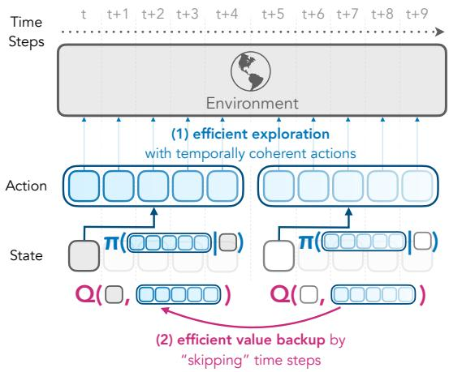

flowchart

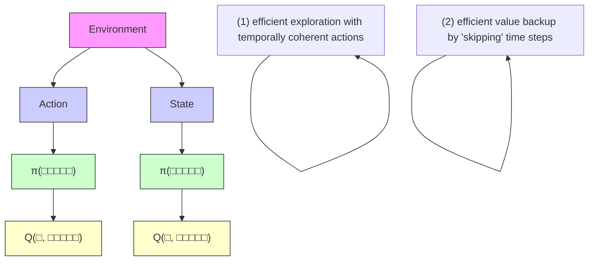

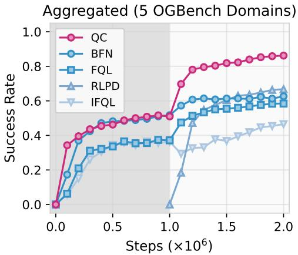

line

| Steps (x10^6) | QC    | BFN   | FQL   | RLPD  | IFQL  |
| ------------- | ----- | ----- | ----- | ----- | ----- |
| 0.0           | 0.0   | 0.0   | 0.0   | 0.0   | 0.0   |
| 0.5           | 0.5   | 0.4   | 0.35  | 0.3   | 0.25  |
| 1.0           | 0.5   | 0.5   | 0.4   | 0.2   | 0.3   |
| 1.5           | 0.8   | 0.6   | 0.55  | 0.45  | 0.4   |
| 2.0           | 0.85  | 0.65  | 0.6   | 0.65  | 0.45  |

Figure 1: Q-chunking uses action chunking to enable fast value backups and effective exploration with temporally coherent actions. left: an overview of our approach: Q-chunking operates in a temporally extended action space that allows for (1) efficient value backups and (2) effective exploration via temporally coherent actions; right: Our method (QC) first pre-trains on an offline dataset for 1M steps (grey) and then updates with online data for another 1M steps (white). Our method achieves strong aggregated performance over five challenging long-horizon sparse-reward domains in OGBench. Code: github.com/ColinQiyangLi/qc

# 1 Introduction

Reinforcement learning (RL) holds the promise of solving any given task based only on a reward function. However, this simple and direct formulation of the RL problem is often impractical: in complex environments, exploring entirely from scratch to learn an effective policy can be prohibitively expensive, as it requires the agent to successfully solve the task through random chance before learning a good policy. Indeed, even humans and animals rarely solve new tasks entirely from scratch, instead leveraging prior knowledge and skills from past experience. Inspired by this, a number of recent works have sought to incorporate prior offline data into online RL exploration [28, 39, 85]. But this poses a new set of challenges: the distribution of offline data might not match the policy that the agent should follow online, introducing distributional shift, and it is not obvious how the offline data should be leveraged to acquire a good online exploratory policy.

In the adjacent field of imitation learning (IL), a widely used approach in recent years has been to employ action chunking, where instead of training policies to predict a single action based on the state observation from prior data, the policy is instead trained to predict a short sequence of future actions (an “action chunk”) [90, 11]. While a complete explanation for the effectiveness of action chunking in IL remains an open question, its effectiveness can be at least partially ascribed to better handling of non-Markovian behavior in the offline data, essentially providing a more powerful tool for modeling the kinds of complex distributions that might occur in (for example) human-provided demonstrations or mixtures of different behaviors [90]. Action chunking has not been used widely in RL, perhaps because optimal policies in fully observed MDPs are Markovian [74], and therefore chunking may appear unnecessary.

We make the observation that, though we might desire a final optimal Markovian policy, the exploration problem can be better tackled with non-Markovian and temporally extended skills, and that action chunking offers a very simple and convenient recipe for obtaining this. Furthermore, action chunking provides a better way to leverage offline data (with a better handling of non-Markovian behavior in the data), and even improves the stability and efficiency of TD-based RL, by enabling unbiased n-step backups (where n matches the length of the chunk). Thus, in combination with pretraining on offline data, action chunking offers a compelling and very simple way to mitigate the exploration challenge in RL.

We present Q-learning with action chunking (or Q-chunking in short), a recipe for improving generic TD-based actor-critic RL algorithms in the offline-to-online RL setting (Figure 1). The key idea is to run RL at an action sequence level — (1) the policy predicts a sequence of actions for the next h steps and executes them one-by-one open loop, and (2) the critic takes in the current state and a sequence of actions and estimates the value of carrying out the whole sequence rather than a single action. The benefits of operating RL on this extended action space are two-fold: (1) the policy can be optimized to generate temporally coherent actions by regularizing it towards some prior behavior data that exhibit such coherency, (2) the critic trained with a standard TD-backup loss is effectively performing n-step backups, with no off-policy bias (that typically occurs in naïve n-step return methods), since the critic takes the full action sequence into account.

Our main contribution is QC, a practical offline-to-online RL algorithm that is instantiated from our Q-chunking recipe, essentially running RL with behavior regularization in the chunked action space. QC is simple to implement, requiring only training (1) an action chunking behavior policy using a standard flow-matching loss, and (2) a temporally extended critic with the standard TD-loss (Algorithm 1). QC achieves strong performance on a range of six challenging long-horizon, sparsereward domains, outperforming prior offline-to-online methods. Moreover, Q-chunking is a generic recipe that can be applied to existing offline-to-online algorithms with minimal modification. In this work, we demonstrate one such instantiation by applying it to FQL [58], resulting in QC-FQL (Algorithm 2), which shows significant improvements over the original method.

# 2 Related Work

Offline-to-online reinforcement learning methods focus on leveraging prior offline data to accelerate reinforcement learning online [88, 71, 37, 1, 89, 91, 7, 51, 92, 39]. The simplest way to tackle offlineto-online RL is to use an existing offline RL algorithm to first pretrain on the offline data and then use the same offline optimization objective to continue training online using a growing dataset that combines the original offline data and the replay buffer data [50, 36, 33, 77, 58, 2, 42, 37]. While straightforward, this naïve approach often result in overly pessimistic that hinders exploration and consequently the online sample-efficiency. Several prior works have attempted to address this issue by adjusting the degree of pessimism online [92, 51, 42, 37, 82]. However, these approaches can be difficult to tune and sometimes stills fall short in online sample efficiency compared to a simple, wellregularized online RL algorithm learning from scratch on both offline data and online replay buffer data [7]. Our approach takes a step towards improving the sample efficiency of offline-to-online RL methods via value backup acceleration and temporally coherent exploration.

Action chunking is a technique popularized by roboticists for imitation learning (IL), where the policy predicts and executes a sequence of actions in an open-loop manner (“an action chunk”) [90]. Action chunking has been shown to improve policy robustness [90, 23, 8], and handle non-Markovian behavior in offline data [90]. Existing RL methods that incorporate action chunking typically focus on fine-tuning a policy pre-trained with imitation learning [61]. Tian et al. [78] propose to learn a critic on action chunks by integrating n-step returns with a transformer. However, their method only applies chunking to the critic, while still optimizing a single-step actor. Li et al. [38] also observe that learning a critic over short action chunks removes the off-policy bias in n-step return backups, leading to more stable and effective value learning. There are key differences between their work and ours — Li et al. [38] operate in the online episodic RL setting [84, 31] and use Gaussian policies to predict parameters of movement primitives (MP) [63, 54], which are then used to generate full action sequences at the beginning of each episode. In contrast, we operate in the conventional offline-toonline RL setting and leverage more expressive flow-matching-based policies (as we find Gaussian policies to be ineffective as shown in Figure 2) to predict short action sequences directly in the raw action space. Seo and Abbeel [65] also train critics on action chunks and impose a behavior cloning loss that aligns with the principles behind Q-chunking. The key distinction from our work lies in their use of a multi-level, factorized critic architecture [66], which generates and refines action chunks from coarse to fine granularity via iterative discretization. At each level, the action space is discretized into bins, and the Q-function is modeled independently for each action dimension and timestep, conditioned on the whole action chunks predicted at the previous coarser level. While this factorized critic design enables tractable value-maximizing action sampling, it imposes strong structural assumptions on the action space, limiting policy expressiveness at each refinement level. In contrast, we make no such assumptions in our recipe which allows us to derive two general algorithms where both the critic and policy operate directly on action chunks without requiring factorization or iterative discretization/refinement.

Exploration with temporally coherent actions. Existing methods either rely on temporally correlated action noises [40] that are constructed through heuristics; hierarchically structured policies (see the next paragraph), which are often tricky to stabilize during online training; or pre-trained frozen skill policies [60, 85], which are not amendable for fine-grained online fine-tuning. Our method uses a single network to represent the policy to generate temporally extended action chunk and it is trained using a single objective function that is stable to optimize. There is also no frozen, pretrained components in our approach, ensuring its online fine-tuning flexibility.

Hierarchical reinforcement learning, options framework. Learning temporally extended actions have also been widely studied in the hierarchical reinforcement learning (HRL) literature [14, 16, 80, 13, 35, 81, 59, 62, 49, 3, 67, 60, 22, 87]. HRL methods typically train a space of low-level policies that can directly interact with the environment along with a high-level policy that selects among these low-level policies. These low-level policies can be hand-crafted [12], automatically discovered online [16, 35, 80, 81, 49], or pretrained using offline skill discovery methods [54, 47, 67, 3, 70, 60, 79, 52, 28, 20, 9, 57]. The options framework provides a slightly more sophisticated and more powerful formulation, where the low-level policy is additionally associated with learnable initiation condition and termination condition that makes utilization of the low-level policy more flexible [75, 46, 10, 44, 68, 69, 32, 13, 72, 53, 19, 4, 30, 5, 6, 15]. A long-lasting challenge in HRL is its bi-level optimization problem: when both low-level and high-level policies are updated during training, the high-level policies must optimize a moving objective function, which can lead to instability [49]. To mitigate this, some methods keep the low-level policies frozen after initial pretraining [3, 60, 85] to improve stability during online training. Our approach is a special case of HRL where the low-level skill executes a sequence of actions open-loop. This design choice allows us to collapse the bi-level optimization problem into a standard RL objective in a temporally extended action space, while retaining many of the exploration benefits associated with HRL methods. While prior work in HRL has also explored such idea [45, 17], they often leverage a discrete set of action sequences that is either heuristically extracted from the prior experience or given in advance. In contrast, we use an expressive flow-matching based policy to directly parameterize a continuous space of action sequences, and are directly trained and fine-tuned online with RL.

Multi-step latent space planning and search is a technique commonly used in model-based RL methods where they use a learned model to optimize a short-horizon action sequence towards highreturn trajectories [53, 64]. These approaches work by training a dynamics model on an encoded latent space, where the model takes in a latent state and an action to predict the next latent state and the associated reward value. This latent dynamics model, along with a value network on the latent state, can then provide an estimate of the Q-value on-the-fly for any given action sequence starting from a given latent state by simply simulating the action sequence in the latent dynamics model. In contrast, we do not learn a latent dynamics model and instead train a Q-network to directly estimate the value of the action sequence. Lastly, these approaches operate in the purely online RL setting whereas we focus on the offline-to-online RL setting.

# 3 Background

Offline-to-online RL. In this paper, we consider an infinite-horizon, fully observable Markov decision process $( \mathrm { M D P } ) , ( S , A , \rho , T , r , \gamma )$ , where S is the state space, A is the action space, $T ( s ^ { \prime } | s , a )$ : ${ \mathcal { S } } \times { \mathcal { A } } \mapsto \Delta ( { \mathcal { S } } )$ is the transition kernel, $r ( s , a ) : \mathcal { S } \times \mathcal { A } \mapsto$ R is the reward function, $\rho : \Delta (  { \boldsymbol { S } } )$ is the initial state distribution and $\gamma \in [ 0 , 1 )$ is the discount factor. We also assume there is a prior offline dataset D that consists of transitions rollouts $\{ ( s , a , s ^ { \prime } , r ) \}$ from M. The goal of offline-to-online RL is to find a policy $\pi ( a \mid s ) : S \mapsto \Delta ( { \mathcal { A } } )$ that maximizes the expected discounted cumulative reward (or discounted return): online RL algorithms o $\begin{array} { r } { \eta ( \pi ) : = \mathbb { E } _ { s _ { t + 1 } \sim T ( s _ { t } , a _ { t } ) , a _ { t } \sim \pi ( \cdot | s _ { t } ) } \left[ \sum _ { t = 0 } ^ { \infty } \gamma ^ { t } r ( s _ { t } , a _ { t } ) \right] } \end{array}$ ]. Oftentimes, offline-to- a policy is pretrained on the offline data D and an online phase where the policy is further fine-tuned online with environment interactions. Our approach follows the same regime.

Temporal difference and multi-step return. TD-based RL algorithms typically learn $Q _ { \theta } ( s , a )$ to approximate the maximum expected discounted cumulative reward that a policy can receive starting from state s and action a by using a temporal difference (TD) loss [74]:

$$
L (\theta) = \left[ Q _ {\theta} (s _ {t}, a _ {t}) - \hat {V} \right] ^ {2}, \tag {1}
$$

where $\hat { V }$ is an estimate of $Q ( s _ { t } , a _ { t } )$ that is commonly chosen as $\hat { V } _ { \mathrm { 1 - s t e p } }$

$$
\hat {V} _ {\text { 1   -   step }} := r _ {t} + \gamma Q _ {\bar {\theta}} (s _ {t + 1}, a _ {t + 1}), \quad a _ {t + 1} \sim \pi_ {\psi} (\cdot | s _ {t + 1}), \tag {2}
$$

and $s _ { t } , a _ { t } , s _ { t + 1 } , r$ are sampled from some off-policy trajectories and $\bar { \theta }$ is a delayed version of θ that does not allow the gradient to pass through for learning stability. When the TD error is minimized, the $Q _ { \theta }$ converges to the expected discounted value of the policy $\pi _ { \psi }$ . As the effective horizon $\tilde { H } = 1 / ( 1 - \gamma )$ goes up, the learning slows down as the value only propagates 1 step backward (from $s _ { t + 1 } \ \mathrm { t o } \ s _ { t } )$ . To speed-up long-horizon value backup, a common strategy is to sample a length-n trajectory segment, $( s _ { t } , a _ { t } , s _ { t + 1 } , \cdots , a _ { t + n - 1 } , s _ { t + n } )$ , and construct a n-step return from it [83, 74]:

$$
\hat {V} _ {\text { n   -   step }} := \sum_ {t ^ {\prime} = t} ^ {t + n - 1} \left[ \gamma^ {t ^ {\prime} - t} r _ {t ^ {\prime}} \right] + Q _ {\bar {\theta}} (s _ {t + n}, a _ {t + n}), \quad a _ {t + n} \sim \pi_ {\psi} (\cdot | s _ {t + n}), \tag {3}
$$

where again $r _ { t } = r ( s _ { t } , a _ { t } )$ . This value estimate of $Q ( s _ { t } , a _ { t } )$ allows for a n times speed-up in terms of the number of time steps that the value can propagate back across. This estimator is sometimes referred to as the uncorrected n-step return estimator [18, 34] because it is biased when the data collection policy is different from the current policy $\pi _ { \psi }$ . Nevertheless, due to the implementation simplicity of n-step return, it has been commonly adopted in large-scale RL systems [48, 26, 29, 86].

# 4 Q-Chunking

In this section, we first describe two main design principles of Q-chunking: (1) Q-learning on a temporally extended action space (the space of chunks of actions), and (2) behavior constraint in this extended action space, followed by practical implementations of Q-chunking (QC, QC-FQL) as effective TD-based offline-to-online RL algorithms.

# 4.1 Q-learning on a temporally extended action space

The first design principle of Q-chunking is to apply Q-learning on the temporally extended action space. Unlike normal 1-step TD-based actor-critic methods, which train a Q-function $Q ( s _ { t } , a _ { t } )$ and a policy $\pi ( \boldsymbol { a } _ { t } \mid \boldsymbol { s } _ { t } )$ , we instead train both the critic and the actor with a span of h consecutive actions:

$$
Q \text {-Chunking Policy:} \pi_ {\psi} (\boldsymbol {a} _ {t: t + h} \mid s _ {t}) := \pi_ {\psi} (a _ {t}, a _ {t + 1}, \dots , a _ {t + h - 1} \mid s _ {t})
$$

$$
Q \text {-Chunking Critic:} Q _ {\theta} (s _ {t}, \boldsymbol {a} _ {t: t + h}) := Q _ {\theta} (s _ {t}, a _ {t}, a _ {t + 1}, \dots , a _ {t + h - 1})
$$

In practice, this involves updating the critic and the actor on batches of transitions consisting of a random state $s _ { t }$ , an action sequence $\mathbf { \delta } a _ { t : t + h }$ followed by the state, and the state h steps into the future, $s _ { t + h }$ . Specifically, we train $Q _ { \theta }$ with the following TD loss,

$$
L (\theta) = \mathbb {E} _ {s _ {t}, \boldsymbol {a} _ {t: t + h}, s _ {t + h} \sim \mathcal {D}} \left[ \left(Q _ {\theta} (s _ {t}, \boldsymbol {a} _ {t: t + h}) - \sum_ {t ^ {\prime} = 0} ^ {h - 1} \gamma^ {t ^ {\prime}} r _ {t + t ^ {\prime}} - \gamma^ {h} Q _ {\bar {\theta}} (s _ {t + h}, \boldsymbol {a} _ {t + h: t + 2 h})\right) ^ {2} \right] \tag {4}
$$

with $a _ { t + h : t + 2 h } \sim \pi _ { \psi } ( \cdot \mid s _ { t + h } ) $ , and $\bar { \theta }$ being the target network parameters that are often an exponential moving average of θ [25].

The TD loss above shares striking similarity to the n-step return in Equation 3 (with n matches $h )$ but with a crucial difference — the Q-function used in the n-step return backup takes in only one action (at time step t) whereas our Q-function takes in the whole action sequence. The implication of this difference can be best explained after we write out the TD backup equations for standard 1-step TD, n-step return, and Q-chunking:

$$
Q (s _ {t}, a _ {t}) \leftarrow r _ {t} + \gamma Q (s _ {t + 1}, a _ {t + 1}) \quad (\text { standard   1 - step   TD }) \tag {5}
$$

$$
Q (s _ {t}, a _ {t}) \leftarrow \underbrace {\sum_ {t ^ {\prime} = t} ^ {t + h - 1} \left[ \gamma^ {t ^ {\prime} - t} r _ {t ^ {\prime}} \right]} _ {\text { biased }} + \gamma^ {h} Q (s _ {t + h}, a _ {t + h}), \quad (n \text {-step return, } n = h) \tag {6}
$$

$$
Q (s _ {t}, \boldsymbol {a} _ {t: t + h}) \leftarrow \underbrace {\sum_ {t ^ {\prime} = t} ^ {t + h - 1} \left[ \gamma^ {t ^ {\prime} - t} r _ {t ^ {\prime}} \right]} _ {\text { unbiased }} + \gamma^ {h} Q (s _ {t + h}, \boldsymbol {a} _ {t + h: t + 2 h}). \tag {7}
$$

For the standard 1-step TD, each backup step propagates the value back by only 1 time step. n-step return propagates the value back $h \times$ faster, but can suffer from a biased value estimation issue when $s _ { t : t + h }$ and $\pmb { a } _ { t : t + h }$ are off-policy [18]. This is because the discounted sum of the n-step rewards $\mathbf { \mathit { r } } _ { t : t + h }$ from the dataset or replay buffer is no longer an unbiased estimate of the expected n-step rewards under the current policy π. Q-chunking value backup is similar to the n-step return where each step also propagates the value back by h time steps, but does not suffer from this biased estimation issue. Unlike n-step return where we are propagating the value to a 1-step Q-function, Q-chunking backup propagates the value back to a h-step Q-function that takes in the exact same actions that are taken to obtain the n-step rewards $\mathbf { \mathit { r } } _ { t : t + h }$ , eliminating the biased value estimation. We formalize this argument in Theorem A.1. As a result, Q-chunking value backup enjoys the value propagation speedup while maintaining an unbiased value estimate.

# 4.2 Behavior constraints for temporally coherent exploration

The second design principle of Q-chunking addresses the action incoherency issues by leveraging a behavior constraint in the objective for the $\pi _ { \psi } \mathbf { : }$

$$
L (\psi) = - \mathbb {E} _ {\boldsymbol {a} _ {t: t + h} \sim \pi_ {\psi} (\cdot | s _ {t})} \left[ Q _ {\theta} (s _ {t}, \boldsymbol {a} _ {t: t + h}) \right], \text {   s.t.   } D (\pi_ {\psi} (\boldsymbol {a} _ {t: t + h} \mid s _ {t}), \pi_ {\beta} (\boldsymbol {a} _ {t: t + h} \mid s _ {t})) \leq \varepsilon \tag {8}
$$

where we denote $\pi _ { \beta } ( \pmb { a } _ { t : t + h } \ | \ s _ { t } )$ as the behavior distribution in the offline data $\mathcal { D } _ { : }$ , and $D$ as some distance metric that measures how different the learned policy π deviates from $\pi _ { \beta }$ .

Intuitively, a behavior constraint on the temporally extended action sequence allows us to leverage temporally coherent action sequences in the offline dataset. This is particularly advantageous in

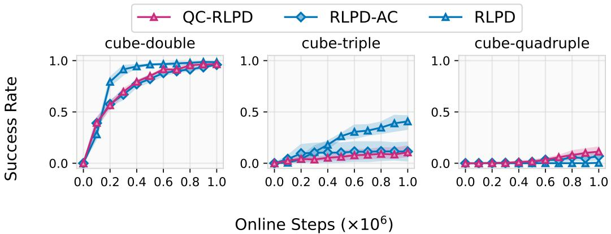  
QC-RLPD RLPD-AC RLPD

Figure 2: Naïvely using action chunking for online RL with Gaussian policies leads to poor performance. (1) RLPD runs online RL on both offline data and online replay buffer [7]. (2) RLPD-AC is the same algorithm as RLPD but operates in a temporally extended action space (action chunk size of 5). (3) QC-RLPD additionally uses a behavior cloning loss on the actor (4 seeds).

the temporally extended action space compared to in the original action space because offline data often exhibit non-Markovian structure (e.g., from scripted policies [56], human tele-operators [43], or noisy expert policies for sub-tasks [56, 21]) that cannot be well captured by a Markovian behavior constraint. Temporally coherent actions are desirable for online exploration because they resemble temporally extended skills (e.g., moving in a certain direction for navigation, jumping motions for going over obstacles) that help traverse the environment in a structured way rather than using random actions that often result in data that is localized near the initial states. Imposing behavior constraint for an action chunking policy is a very simple way to approximately extract skills without the need of training policy with bi-level structure as often necessitated by skill-based methods (see more discussion in Section 2). We observe that Q-chunking, with such behavior constraints, can explore with temporally coherent actions (see Section 5.3), mitigating the exploration challenge.

# 4.3 Practical implementations

A key implementation challenge of Q-chunking is to enforce a good behavior constraint that captures the non-Markovian behavior at the action sequence level. One prerequisites of imposing a good behavior constraint is the ability of the policy to capture the complex behavior distribution (e.g., with a flow/diffusion policy). A Gaussian policy, a default choice in online RL algorithms, does not suffice. Indeed, if we naïvely take an off-the-shelf online algorithm, RLPD [7] for example, and apply Qchunking with a behavior cloning loss, we find that it often performs poorly (Figure 2).

To enforce a good behavior constraint, we start by using flow-matching objective [41] to train a behavior cloning flow policy to capture the behavior distribution. The flow policy is parameterized by a state-conditioned velocity field prediction model $f ( s , z , u ) : \mathcal { S } \times \mathbb { R } ^ { \hat { A } h } \times \mathsf { \bar { [ 0 , 1 ] } } \mapsto \mathbb { R } ^ { A h }$ and we denote $f _ { \xi } ( { \bf \cdot } \mid s )$ as the action distribution that the flow policy parameterizes, which serves as an approximation of the true behavior distribution in the offline data $( f _ { \xi } \approx \pi _ { \beta } )$ . Now, we are ready to present our main method:

QC: Q-chunking with implicit KL behavior constraint. We consider a KL constraint on our policy through the learned behavior distribution:

$$
D _ {\mathrm{KL}} (\pi_ {\psi} \| f _ {\xi} (\cdot \mid s)) \leq \varepsilon \tag {9}
$$

While it is possible include the KL as part of the loss, estimating the KL divergence or log probability for flow models is practically challenging. Instead, we use best-of-N sampling [73] to maximize $\dot { Q } \mathrm { - }$ value while imposing this KL constraint implicitly altogether. Practically, this involves first sampling N action chunks from the learned behavior policy $f _ { \xi } ( \cdot \mid s )$ ,

$$
\left\{\boldsymbol {a} ^ {1}, \boldsymbol {a} ^ {2}, \dots , \boldsymbol {a} ^ {N} \right\} \sim f _ {\xi} (\cdot | s),
$$

and then picking the action chunk sample that maximizes the temporally extended Q-function:

$$
\boldsymbol {a} ^ {\star} \leftarrow \arg \max _ {\boldsymbol {a} \in \{\boldsymbol {a} ^ {1}, \boldsymbol {a} ^ {2}, \dots , \boldsymbol {a} ^ {N} \}} Q (s, \boldsymbol {a})
$$

It has been shown in prior work that best-of-N sampling admits a closed-form upper-bound on the KL divergence from the original distribution [27]:

$$
D _ {\mathrm{KL}} (\boldsymbol {a} ^ {\star} \| f _ {\xi} (\cdot \mid s)) \leq \log N - \frac {N - 1}{N}, \tag {10}
$$

which approximately satisfies KL constraint implicitly (Equation 9). Tuning the value of N directly corresponds to the strength of the constraint.

Since we approximate the policy optimization (Equation 8) with the best-of-N sampling, we can completely avoid separately parameterizing a policy $\pi _ { \psi }$ and only sample from the behavioral policy $f _ { \xi } ( { \bf \cdot } \mid s _ { t } )$ . In particular, we use the best-of-N sampling to generate actions to both (1) interact with the environment, and (2) provide the action samples in the TD backup following Ghasemipour et al. [24]. As a result, our algorithm has only one additional loss function:

$$
L (\theta) = \mathbb {E} _ {\substack {s _ {t}, \boldsymbol {a} _ {t} \sim D \\ \left\{\boldsymbol {a} _ {t + h} ^ {i} \right\} _ {i = 1} ^ {N} \sim f _ {\xi} (\cdot | s _ {t + h})}} \left[ \left(Q _ {\theta} (s _ {t}, \boldsymbol {a} _ {t}) - \sum_ {t ^ {\prime} = 0} ^ {h - 1} \gamma^ {t ^ {\prime}} r _ {t + t ^ {\prime}} - \gamma^ {h} Q _ {\bar {\theta}} (s _ {t + h}, \boldsymbol {a} _ {t + h} ^ {\star})\right) ^ {2} \right] \tag{11}
$$

where again $a _ { t + h } ^ { \star } : = \arg \operatorname* { m a x } _ { a \in \{ a _ { t + h } ^ { i } \} } Q ( s , a )$

While QC is simple and easy to implement, it does come with some additional computational costs associated with best-of-N sampling. In our experiments, we experiment with two other variants (QC-FQL and QC-IFQL) that leverage cheaper off-the-shelf offline/offline-to-online RL methods (FQL and IFQL respectively [58]). We present the FQL-version below as it performs better empirically.

QC-FQL: Q-chunking with 2-Wasserstein distance behavior constraint. For this variant of our method, we leverage the optimal transport framework to impose a Wasserstein distance $( W _ { 2 } )$ constraint, again, through the learned behavior policy $f _ { \xi } ( { \bf \cdot } | s )$ :

$$
W _ {2} (\pi_ {\psi}, f _ {\xi} (\cdot \mid s)) \leq \varepsilon \tag {12}
$$

Following FQL [58], we parameterize the policy $\pi _ { \psi }$ with a noise-conditioned action prediction model, $\mu _ { \psi } ( s , z ) : \mathcal { S } \times \mathbb { R } ^ { A h } \mapsto \mathbb { R } ^ { A h }$ , which directly outputs an action from Gaussian noise in one network forward pass. This noise-conditioned policy is trained to maximize the Q-chunking critic $Q _ { \theta } \big ( s _ { t } , \pmb { a } _ { t : t + h } \big )$ while being regularized to be close to the behavioral cloning flow-matching policy via a BC loss that is shown to be an upper-bound on the squared 2-Wasserstein distance [58]:

$$
L (\psi) = \mathbb {E} _ {s _ {t} \sim \mathcal {D}, \boldsymbol {z} ^ {0} \sim \mathcal {N} (0, \boldsymbol {I} _ {A h})} \left[ \alpha \left\| \boldsymbol {z} ^ {1} - \mu_ {\psi} \left(s _ {t}, \boldsymbol {z} ^ {0}\right) \right\| _ {2} ^ {2} - Q \left(s _ {t}, \mu_ {\psi} \left(s _ {t}, \boldsymbol {z}\right)\right) \right] \tag {13}
$$

$$
\geq \mathbb {E} _ {s _ {t} \sim \mathcal {D}, \boldsymbol {z} ^ {0} \sim \mathcal {N} (0, \boldsymbol {I} _ {A h})} \left[ \alpha W _ {2} (\pi_ {\psi} (\cdot | s _ {t}), f _ {\xi} (\cdot | s _ {t})) ^ {2} - Q (s _ {t}, \mu_ {\psi} (s _ {t}, \boldsymbol {z})) \right], \tag {14}
$$

where $z ^ { 1 }$ is the ODE solution from u = 0 to u = 1 following $\mathrm { d } z ^ { u } = f _ { \xi } ( s _ { t } , z ^ { u } , u )$ du (the initial value $z ^ { 0 }$ is sampled from the unit Gaussian). The real-valued hyperparameter α directly controls the magnitude of the distillation loss. Finally, the TD loss remains the same as the previous section with the only difference in how we parameterize the policy:

$$
L (\theta) = \mathbb {E} _ {\boldsymbol {s} _ {t}, \boldsymbol {a} _ {t}, s _ {t + h} \sim \mathcal {D}, \boldsymbol {z}} \left[ \left(Q _ {\theta} (s _ {t}, \boldsymbol {a} _ {t}) - \sum_ {t ^ {\prime} = 0} ^ {h - 1} \gamma^ {t ^ {\prime}} r _ {t + t ^ {\prime}} - \gamma^ {h} Q _ {\bar {\theta}} (s _ {t + h}, \mu_ {\psi} (s _ {t + h}, \boldsymbol {z}))\right) ^ {2} \right] \tag {15}
$$

where again $z \sim \mathcal { N } ( 0 , I _ { A h } )$ .

Offline-to-online RL considerations. Since both variants of our methods use behavior constraint (implicit KL for QC, explicit $W _ { 2 }$ for QC-FQL), we can also directly run them for offline RL pretraining. For both offline and online training, we use the same behavior constraint strength $( e . g . , N$ for QC and α for QC-FQL). We use the same algorithm for both offline and online training, and the only difference is whether there is environment interactions. See Section C, Algorithm 1 and Algorithm 2 for an overview of QC and QC-FQL during online training.

# 5 Experimental Results

We conduct extensive experiments to analyze the empirical effectiveness of our method on a range of long-horizon, sparse-reward domains. In particular, we are going to answer the following questions:

<table><tr><td colspan="2"></td><td>puzzle-3x3-sparse(5 tasks)</td><td>scene-sparse(5 tasks)</td><td>cube-double(5 tasks)</td><td>cube-triple(5 tasks)</td><td>cube-quadruple(5 tasks)</td><td>overall(25 tasks)</td></tr><tr><td rowspan="3">From Scratch (1-step TD)</td><td>RLPD</td><td>- → 100</td><td>- → 94</td><td>- → 99</td><td>- → 41</td><td>- → 0</td><td>- → 67</td></tr><tr><td>RLPD-AC</td><td>- → 100</td><td>- → 91</td><td>- → 96</td><td>- → 11</td><td>- → 7</td><td>- → 61</td></tr><tr><td>SUPE-GT</td><td>- → 100</td><td>- → 92</td><td>- → 67</td><td>- → 0</td><td>- → 0</td><td>- → 52</td></tr><tr><td rowspan="2">Gaussian (1-step TD)</td><td>IQL</td><td>0 → 20</td><td>0 → 39</td><td>0 → 0</td><td>0 → 0</td><td>0 → 0</td><td>0 → 12</td></tr><tr><td>ReBRAC</td><td>55 → 100</td><td>11 → 99</td><td>3 → 30</td><td>0 → 0</td><td>1 → 20</td><td>14 → 50</td></tr><tr><td rowspan="3">Flow (1-step TD)</td><td>IFQL</td><td>98 → 97</td><td>68 → 74</td><td>11 → 59</td><td>0 → 3</td><td>0 → 0</td><td>36 → 47</td></tr><tr><td>FQL</td><td>100 → 100</td><td>58 → 95</td><td>29 → 76</td><td>1 → 18</td><td>0 → 3</td><td>37 → 58</td></tr><tr><td>BFN</td><td>98 → 100</td><td>85 → 99</td><td>68 → 79</td><td>4 → 23</td><td>1 → 12</td><td>51 → 63</td></tr><tr><td rowspan="3">Flow (n-step TD)</td><td>IFQL-n</td><td>94 → 100</td><td>68 → 92</td><td>5 → 29</td><td>0 → 0</td><td>0 → 0</td><td>34 → 44</td></tr><tr><td>FQL-n</td><td>98 → 100</td><td>18 → 70</td><td>11 → 77</td><td>0 → 1</td><td>7 → 36</td><td>27 → 57</td></tr><tr><td>BFN-n</td><td>58 → 90</td><td>57 → 97</td><td>11 → 65</td><td>0 → 0</td><td>0 → 0</td><td>25 → 50</td></tr><tr><td rowspan="3">Q-chunking (Ours)</td><td>QC-IFQL</td><td>100 → 100</td><td>83 → 98</td><td>12 → 78</td><td>0 → 0</td><td>1 → 19</td><td>39 → 59</td></tr><tr><td>QC-FQL</td><td>63 → 100</td><td>84 → 99</td><td>39 → 100</td><td>4 → 53</td><td>1 → 77</td><td>38 → 86</td></tr><tr><td>QC</td><td>100 → 100</td><td>84 → 99</td><td>67 → 98</td><td>6 → 64</td><td>4 → 73</td><td>52 → 86</td></tr></table>

Table 1: Summary table for OGBench offline-to-online RL results. For each cell, we report the offline performance after 1M of training steps and then the online performance after 1M of additional online steps. The best method(s) for each column is highlighted in bold and color. Q-chunking methods outperform all prior methods at the end of the online training. See the full results in Table 6 (complete table) and Figure 10 (individual plot).

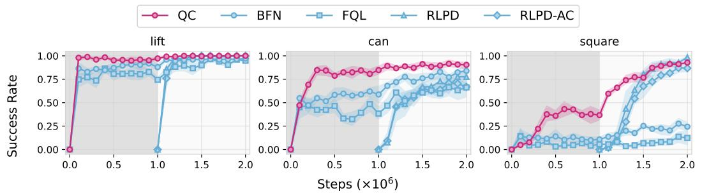

line

| Steps (×10⁶) | QC    | BFN   | FQL   | RLPD  | RLPD-AC |
| ------------ | ----- | ----- | ----- | ----- | ------- |
| 0.0          | 0.00  | 0.00  | 0.00  | 0.00  | 0.00    |
| 0.5          | 1.00  | 0.85  | 0.80  | 0.75  | 0.70    |
| 1.0          | 1.00  | 0.90  | 0.75  | 0.85  | 0.80    |
| 1.5          | 1.00  | 0.95  | 0.85  | 0.90  | 0.85    |
| 2.0          | 1.00  | 1.00  | 0.95  | 0.95  | 0.90    |

Figure 3: Robomimic results. QC achieves strong performance across all three robomimic tasks. The first 1M steps are offline and the next 1M steps are online with one environment step per training step (5 seeds).

(Q1) How well do Q-chunking methods perform compared to prior offline-to-online RL methods?   
(Q2) Why does action chunking helps online learning?   
(Q3) How does chunk length, critic ensemble size, and update-to-data ratio affect performance?

# 5.1 Environments and Datasets

We consider six sparse reward robotic manipulation domains with tasks of varying difficulties. This includes 5 domains (5 tasks each) from OGBench [55], scene-sparse, puzzle-3x3-sparse, cube-double/triple/quadruple and 3 tasks from robomimic [43]. For OGBench, we use the default play-style datasets except for cube-quadruple where we use the larger 100M-size dataset. For robomimic, we use the multi-human datasets. See more details in Appendix B.

# 5.2 Comparisons

We compare with prior methods that speedup value backup as well as the previous best offline-toonline RL methods. We include a brief description of them below with more details in Section C.

BFN (best-of-N) is a baseline that we propose to combine the expected-max Q operator [24] with an expressive behavior flow policy. BFN operates in the original action space and uses best-of-N sampling to pick the action (out of N ) that maximizes the current Q-value. This baseline is an ablation to isolate the benefit of Q-chunking in QC.

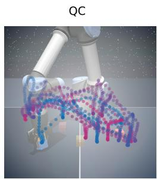

natural_image

Illustration of a robotic arm with colorful molecular structures (no text or symbols)

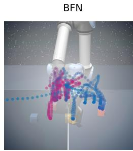

natural_image

3D rendering of a robotic arm with colored chains and a dotted line indicating motion (no text or symbols)

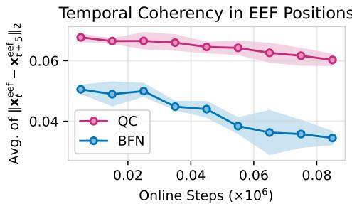

line

| Online Steps (×10⁶) | QC     | BFN    |
| ------------------- | ------ | ------ |
| 0.00                | 0.068  | 0.050  |
| 0.02                | 0.067  | 0.049  |
| 0.04                | 0.066  | 0.045  |
| 0.06                | 0.065  | 0.039  |
| 0.08                | 0.062  | 0.036  |

Figure 5: End-effector movements early in the training and temporal coherency analysis on cube-triple-task3. Left: QC covers a more diverse set of states compared to BFN in the first 1000 environment steps. Right: QC exhibits a higher temporal coherency in end-effector compared to BFN.

FQL [58] is a recently proposed offline RL method that achieves strong offline and offline-to-online RL performance. This baseline is an ablation to isolate the benefit of Q-chunking in QC-FQL.

BFN-n/FQL-n. These baselines are the same as BFN/FQL but uses n-step backup with n > 1 (Equation 3) instead of the standard 1-step TD backup. This baseline enjoys the benefits of value backup speedup, but does not use chunked critic or actor, and potentially suffer from the bias issue.

RLPD [7], RLPD-AC. RLPD is a sample-efficient RL algorithm that treats offline data as additional off-policy data and learn from scratch online. RLPD-AC is the same as RLPD but operates on the temporally extended action space. Both of them do not use a behavior constraint.

We also compare with SUPE-GT [85], a recently proposed skill-based that is designed for offlineto-online RL. The original method is designed to deal with unlabeled dataset by learning a reward model with reward bonuses. We adapt it to our setting by directly using the ground truth rewards.

Finally, we compare with additional baselines: IQL [33], ReBRAC [76], IFQL (a baseline implemented in Park et al. [58] that combines IQL with rejection sampling policy extraction), and IFQL-n (IFQL with n-step return backup).

# 5.3 How well does our method compare to prior offline-to-online RL methods?

We report the performance of all Q-chunking methods and the baselines in Table 1 (OGBench) and a selective (strong) subset in Figure 3 (robomimic). QC achieves competitive performance offline, often matching or sometimes outperforming best prior methods. In the online phase, QC shows strong sample-efficiency, especially on the two hardest OGBench domains (cube-triple/quadruple), where it outperforms all prior methods (especially on cube-quadruple) by a large margin. In addition, on OG-Bench domains, all Q-chunking methods (QC, QC-FQL, QC-IFQL) outperforms both their corresponding 1-step TD counterpart (BFN, FQL, IFQL) and their correspdoning n-step return counterpart (BFN-n, FQL-n, IFQL-n). A similar trend continues on robomimic tasks as shown in Figure 4. Across OGBench and robomimic, n-step return baselines, which do not use chunked critics or policies, perform significantly worse than Q-chunking methods.

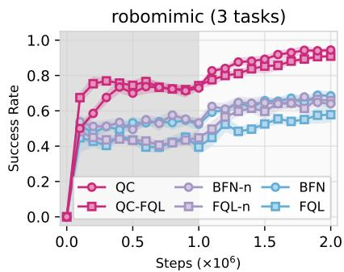

line

| Steps (×10⁶) | QC    | BFN-n | BFN   | QC-FQL | FQL-n | FQL   |
| ------------ | ----- | ----- | ----- | ------ | ----- | ----- |
| 0.0          | 0.0   | 0.0   | 0.0   | 0.0    | 0.0   | 0.0   |
| 0.5          | 0.7   | 0.5   | 0.4   | 0.8    | 0.4   | 0.4   |
| 1.0          | 0.8   | 0.6   | 0.5   | 0.8    | 0.5   | 0.5   |
| 1.5          | 0.9   | 0.7   | 0.6   | 0.9    | 0.6   | 0.6   |
| 2.0          | 0.95  | 0.75  | 0.65  | 0.95   | 0.65  | 0.65  |

Figure 4: n-step return ablations on robomimic. Both Q-chunking methods consistently outperform their n-step and 1-step TD counterparts (5 seeds).

# 5.4 Why does action chunking help exploration?

We hypothesize in Section 4.2 that action chunking policy produce more temporally coherent actions and thus lead to better state coverage and exploration. In this section, we study to what degree that holds empirically. We first visualize the end-effector movements early in the training for QC and BFN (Figure 5, left). BFN’s trajectory contains many pauses (as indicated by a very big and dense cluster near the center of the visualization), especially when the end-effector is being lowered to pickup a cube. In contrast, QC has fewer pauses (fewer and shallower clusters) and a more diverse state coverage in the end-effector space. We include additional examples in Appendix E, Figure 8 and Figure 9. To get a quantitative measure of the temporal cohD end-effector position throughout training every 5 time steps: $\{ \pmb { x } _ { 0 } ^ { \mathrm { e e f } } , \pmb { x } _ { 5 } ^ { \mathrm { e e f } } , \cdot \cdot \cdot \}$ , we record the 3- and compute the average $L _ { 2 }$ norm of the difference vector of two adjacent end-effector positions. This average norm would be small if there are any pauses or jittery motions, making a good proxy for measuring the temporal coherency in actions. As shown in Figure 5 (right), QC exhibits a higher action temporal coherency throughout training compared to BFN. This suggests that Q-chunking improves temporal coherency in actions, which explains the improved sample-efficiency that Q-chunking brings.

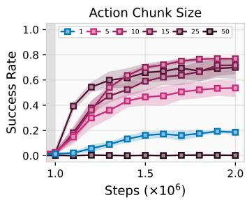

line

| Steps (×10⁶) | 1    | 5    | 10   | 15   | 25   | 50   |
| ------------ | ---- | ---- | ---- | ---- | ---- | ---- |
| 1.0          | 0.0  | 0.0  | 0.0  | 0.0  | 0.0  | 0.0  |
| 1.5          | 0.2  | 0.4  | 0.6  | 0.7  | 0.75 | 0.7  |
| 2.0          | 0.25 | 0.55 | 0.75 | 0.8  | 0.85 | 0.8  |

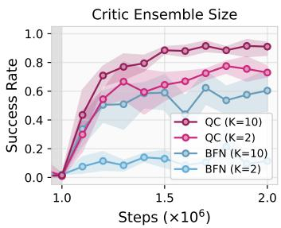

line

| Steps (×10⁶) | QC (K=10) | QC (K=2) | BFN (K=10) | BFN (K=2) |
| ------------ | --------- | -------- | ---------- | --------- |
| 1.0          | 0.0       | 0.0      | 0.0        | 0.0       |
| 1.2          | 0.7       | 0.6      | 0.5        | 0.4       |
| 1.4          | 0.8       | 0.7      | 0.6        | 0.5       |
| 1.6          | 0.9       | 0.8      | 0.7        | 0.6       |
| 1.8          | 0.9       | 0.8      | 0.7        | 0.6       |
| 2.0          | 0.9       | 0.7      | 0.6        | 0.6       |

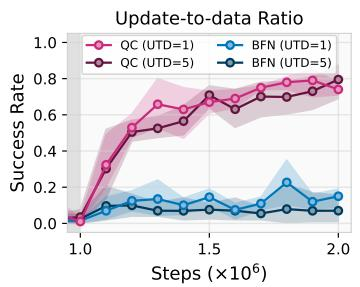

line

| Steps (x10^6) | QC (UTD=1) | QC (UTD=5) | BFN (UTD=1) | BFN (UTD=5) |
| ------------- | ---------- | ---------- | ----------- | ----------- |
| 1.0           | 0.0        | 0.0        | 0.0         | 0.0         |
| 1.5           | 0.7        | 0.7        | 0.1         | 0.1         |
| 2.0           | 0.8        | 0.8        | 0.2         | 0.1         |

Figure 6: Sensitivity analysis: action chunk size (h), critic ensemble size (K), and update-to-data ratio (UTD). Left: QC-FQL with different h on all 5 cube-triple tasks (5 seeds). QC-FQL with $h = 1$ is equivalent to FQL. Center: Increasing the ensemble size to $K = 1 0$ improves performance of both QC and BFN on cube-triple-task3 (5 seeds). Right: QC with UTD of 5 on cube-triple-task3 (5 seeds). We report only the online phase results, as all methods achieve near-zero success rates during the offline phase.

# 5.5 How does action chunk length, critic ensemble size, and UTD ratio affect performance?

In Figure 6 (left), we examine the performance of QC-FQL across different action chunk lengths $( h \in \{ 1 , 5 , 1 0 , 2 5 , 5 0 \} )$ on the cube-triple domain. Increasing the chunk length helps up to $h = 1 0$ , after which the asymptotic performance starts to drop. Although $h = 2 5$ shows faster early learning, it fails to achieve the same performance as $h = 1 0$ at the end of online fine-tuning. An even larger chunk length $( h = 5 0 )$ fails to achieve any success. We suspect that overly large chunk sizes either hurt policy reactivity too much or make policy learning too difficult, as the network must predict a much longer action sequence at once. We use $h = 5$ in all our other experiments as $h = 5$ generally performs well and is cheaper to run. We also include the individual task breakdown in Figure 14 and additional ablation results on cube-quadruple in Figure 15. In Figure 6 (center), we study how the critic ensemble size affects the performance of our method. Using 10 critics improves both QC and BFN. We use $K = 2$ in our other experiments as it is cheap to run. Using $K = \bar { 1 0 }$ could potentially make Q-chunking perform much better on the benchmark tasks we consider. Finally, increasing the update-to-data ratio (UTD) does not improve the sample efficiency of QC (Figure 6, right).

# 6 Discussions

We demonstrate how action chunking can be integrated into an offline-to-online RL agent with a simple recipe. Our approach speeds up value backup and explores more effectively online with temporally coherent actions. As a result, it outperforms prior offline-to-online methods on a range of challenging long-horizon tasks. Our work serves as a step towards training non-Markovian policy for effective online exploration from prior offline data. Several challenges remain, opening promising directions for future research. First, our approach use a fixed action chunk, but it is unclear how to choose this size other than task-specific hyperparameter tuning. A natural next step would be to develop mechanisms that automatically determine chunk boundaries. Second, action chunking represents only a limited subclass of non-Markovian policies and may perform poorly in settings where a high-frequency control feedback loop is essential. Developing practical techniques for training more general non-Markovian policies for online exploration would further improve the online sample efficiency of offline-to-online RL algorithms.

# Acknowledgments

This research was partially supported by RAI, and ONR N00014-22-1-2773. This research used the Savio computational cluster resource provided by the Berkeley Research Computing program at UC Berkeley. We would like to thank Seohong Park for providing the code infrastructure and the 100M dataset for cube-quadruple. We would also like to thank Ameesh Shah, Chuer Pan, Oleg Rybkin, Andrew Wagenmaker, Seohong Park, Yifei Zhou, Fangchen Liu, William Chen for discussions on the method and feedback on the early draft of the paper. We would also like to thank Chongyi Zheng and Hyunwoo Park for spotting typos in the paper. Finally, we would like to thank NeurIPS review committee for thoughtful comments and suggestions.

# References

[1] Rishabh Agarwal, Max Schwarzer, Pablo Samuel Castro, Aaron C Courville, and Marc Bellemare. Reincarnating reinforcement learning: Reusing prior computation to accelerate progress. In S. Koyejo, S. Mohamed, A. Agarwal, D. Belgrave, K. Cho, and A. Oh, editors, Advances in Neural Information Processing Systems, volume 35, pages 28955–28971. Curran Associates, Inc., 2022.   
[2] Rishabh Agarwal, Max Schwarzer, Pablo Samuel Castro, Aaron C Courville, and Marc Bellemare. Reincarnating reinforcement learning: Reusing prior computation to accelerate progress. Advances in neural information processing systems, 35:28955–28971, 2022.   
[3] Anurag Ajay, Aviral Kumar, Pulkit Agrawal, Sergey Levine, and Ofir Nachum. OPAL: Offline primitive discovery for accelerating offline reinforcement learning. In International Conference on Learning Representations, 2021. URL https://openreview.net/forum?id= V69LGwJ0lIN.   
[4] Pierre-Luc Bacon, Jean Harb, and Doina Precup. The option-critic architecture. In Proceedings of the AAAI conference on artificial intelligence, volume 31, 2017.   
[5] Akhil Bagaria and George Konidaris. Option discovery using deep skill chaining. In International Conference on Learning Representations, 2019.   
[6] Akhil Bagaria, Ben Abbatematteo, Omer Gottesman, Matt Corsaro, Sreehari Rammohan, and George Konidaris. Effectively learning initiation sets in hierarchical reinforcement learning. Advances in Neural Information Processing Systems, 36, 2024.   
[7] Philip J Ball, Laura Smith, Ilya Kostrikov, and Sergey Levine. Efficient online reinforcement learning with offline data. In International Conference on Machine Learning, pages 1577–1594. PMLR, 2023.   
[8] Homanga Bharadhwaj, Jay Vakil, Mohit Sharma, Abhinav Gupta, Shubham Tulsiani, and Vikash Kumar. Roboagent: Generalization and efficiency in robot manipulation via semantic augmentations and action chunking. In 2024 IEEE International Conference on Robotics and Automation (ICRA), pages 4788–4795. IEEE, 2024.   
[9] Boyuan Chen, Chuning Zhu, Pulkit Agrawal, Kaiqing Zhang, and Abhishek Gupta. Selfsupervised reinforcement learning that transfers using random features. Advances in Neural Information Processing Systems, 36, 2024.   
[10] Nuttapong Chentanez, Andrew Barto, and Satinder Singh. Intrinsically motivated reinforcement learning. Advances in neural information processing systems, 17, 2004.   
[11] Cheng Chi, Zhenjia Xu, Siyuan Feng, Eric Cousineau, Yilun Du, Benjamin Burchfiel, Russ Tedrake, and Shuran Song. Diffusion policy: Visuomotor policy learning via action diffusion. The International Journal of Robotics Research, page 02783649241273668, 2023.   
[12] Murtaza Dalal, Deepak Pathak, and Russ R Salakhutdinov. Accelerating robotic reinforcement learning via parameterized action primitives. Advances in Neural Information Processing Systems, 34:21847–21859, 2021.

[13] Christian Daniel, Gerhard Neumann, Oliver Kroemer, and Jan Peters. Hierarchical relative entropy policy search. Journal of Machine Learning Research, 17(93):1–50, 2016.   
[14] Peter Dayan and Geoffrey E Hinton. Feudal reinforcement learning. Advances in neural information processing systems, 5, 1992.   
[15] Anita de Mello Koch, Akhil Bagaria, Bingnan Huo, Zhiyuan Zhou, Cameron Allen, and George Konidaris. Learning transferable sub-goals by hypothesizing generalizing features. 2025.   
[16] Thomas G Dietterich. Hierarchical reinforcement learning with the maxq value function decomposition. Journal of artificial intelligence research, 13:227–303, 2000.   
[17] Ishan P Durugkar, Clemens Rosenbaum, Stefan Dernbach, and Sridhar Mahadevan. Deep reinforcement learning with macro-actions. arXiv preprint arXiv:1606.04615, 2016.   
[18] William Fedus, Prajit Ramachandran, Rishabh Agarwal, Yoshua Bengio, Hugo Larochelle, Mark Rowland, and Will Dabney. Revisiting fundamentals of experience replay. In International conference on machine learning, pages 3061–3071. PMLR, 2020.   
[19] Roy Fox, Sanjay Krishnan, Ion Stoica, and Ken Goldberg. Multi-level discovery of deep options. arXiv preprint arXiv:1703.08294, 2017.   
[20] Kevin Frans, Seohong Park, Pieter Abbeel, and Sergey Levine. Unsupervised zero-shot reinforcement learning via functional reward encodings. In Ruslan Salakhutdinov, Zico Kolter, Katherine Heller, Adrian Weller, Nuria Oliver, Jonathan Scarlett, and Felix Berkenkamp, editors, Proceedings of the 41st International Conference on Machine Learning, volume 235 of Proceedings of Machine Learning Research, pages 13927–13942. PMLR, 21–27 Jul 2024. URL https://proceedings.mlr.press/v235/frans24a.html.   
[21] Justin Fu, Aviral Kumar, Ofir Nachum, George Tucker, and Sergey Levine. D4RL: Datasets for deep data-driven reinforcement learning. arXiv preprint arXiv:2004.07219, 2020.   
[22] Jonas Gehring, Gabriel Synnaeve, Andreas Krause, and Nicolas Usunier. Hierarchical skills for efficient exploration. Advances in Neural Information Processing Systems, 34:11553–11564, 2021.   
[23] Abraham George and Amir Barati Farimani. One act play: Single demonstration behavior cloning with action chunking transformers. arXiv preprint arXiv:2309.10175, 2023.   
[24] Seyed Kamyar Seyed Ghasemipour, Dale Schuurmans, and Shixiang Shane Gu. Emaq: Expected-max q-learning operator for simple yet effective offline and online rl. In International Conference on Machine Learning, pages 3682–3691. PMLR, 2021.   
[25] Tuomas Haarnoja, Aurick Zhou, Pieter Abbeel, and Sergey Levine. Soft actor-critic: Offpolicy maximum entropy deep reinforcement learning with a stochastic actor. In International conference on machine learning, pages 1861–1870. PMLR, 2018.   
[26] Matteo Hessel, Joseph Modayil, Hado Van Hasselt, Tom Schaul, Georg Ostrovski, Will Dabney, Dan Horgan, Bilal Piot, Mohammad Azar, and David Silver. Rainbow: Combining improvements in deep reinforcement learning. In Proceedings of the AAAI conference on artificial intelligence, volume 32, 2018.   
[27] Jacob Hilton. Kl divergence of max-of-n, 2023. URL https://www.jacobh.co.uk/bon\_kl. pdf.   
[28] Hao Hu, Yiqin Yang, Jianing Ye, Ziqing Mai, and Chongjie Zhang. Unsupervised behavior extraction via random intent priors. In Thirty-seventh Conference on Neural Information Processing Systems, 2023. URL https://openreview.net/forum?id=4vGVQVz5KG.   
[29] Steven Kapturowski, Georg Ostrovski, John Quan, Remi Munos, and Will Dabney. Recurrent experience replay in distributed reinforcement learning. In International conference on learning representations, 2018.   
[30] Taesup Kim, Sungjin Ahn, and Yoshua Bengio. Variational temporal abstraction. Advances in Neural Information Processing Systems, 32, 2019.

[31] Jens Kober and Jan Peters. Policy search for motor primitives in robotics. Advances in neural information processing systems, 21, 2008.   
[32] George Dimitri Konidaris. Autonomous robot skill acquisition. University of Massachusetts Amherst, 2011.   
[33] Ilya Kostrikov, Ashvin Nair, and Sergey Levine. Offline reinforcement learning with implicit Q-learning. arXiv preprint arXiv:2110.06169, 2021.   
[34] Tadashi Kozuno, Yunhao Tang, Mark Rowland, Rémi Munos, Steven Kapturowski, Will Dabney, Michal Valko, and David Abel. Revisiting peng’s q (λ) for modern reinforcement learning. In International Conference on Machine Learning, pages 5794–5804. PMLR, 2021.   
[35] Tejas D Kulkarni, Karthik Narasimhan, Ardavan Saeedi, and Josh Tenenbaum. Hierarchical deep reinforcement learning: Integrating temporal abstraction and intrinsic motivation. Advances in neural information processing systems, 29, 2016.   
[36] Aviral Kumar, Aurick Zhou, George Tucker, and Sergey Levine. Conservative Q-learning for offline reinforcement learning. Advances in Neural Information Processing Systems, 33:1179– 1191, 2020.   
[37] Seunghyun Lee, Younggyo Seo, Kimin Lee, Pieter Abbeel, and Jinwoo Shin. Offline-to-online reinforcement learning via balanced replay and pessimistic Q-ensemble. In Conference on Robot Learning, pages 1702–1712. PMLR, 2022.   
[38] Ge Li, Dong Tian, Hongyi Zhou, Xinkai Jiang, Rudolf Lioutikov, and Gerhard Neumann. TOP-ERL: Transformer-based off-policy episodic reinforcement learning. In The Thirteenth International Conference on Learning Representations, 2025. URL https://openreview. net/forum?id=N4NhVN30ph.   
[39] Qiyang Li, Jason Zhang, Dibya Ghosh, Amy Zhang, and Sergey Levine. Accelerating exploration with unlabeled prior data. Advances in Neural Information Processing Systems, 36, 2024.   
[40] Timothy P Lillicrap, Jonathan J Hunt, Alexander Pritzel, Nicolas Heess, Tom Erez, Yuval Tassa, David Silver, and Daan Wierstra. Continuous control with deep reinforcement learning. arXiv preprint arXiv:1509.02971, 2015.   
[41] Xingchao Liu, Chengyue Gong, and Qiang Liu. Flow straight and fast: Learning to generate and transfer data with rectified flow. arXiv preprint arXiv:2209.03003, 2022.   
[42] Yicheng Luo, Jackie Kay, Edward Grefenstette, and Marc Peter Deisenroth. Finetuning from offline reinforcement learning: Challenges, trade-offs and practical solutions. arXiv preprint arXiv:2303.17396, 2023.   
[43] Ajay Mandlekar, Danfei Xu, Josiah Wong, Soroush Nasiriany, Chen Wang, Rohun Kulkarni, Li Fei-Fei, Silvio Savarese, Yuke Zhu, and Roberto Martín-Martín. What matters in learning from offline human demonstrations for robot manipulation. In arXiv preprint arXiv:2108.03298, 2021.   
[44] Shie Mannor, Ishai Menache, Amit Hoze, and Uri Klein. Dynamic abstraction in reinforcement learning via clustering. In Proceedings of the twenty-first international conference on Machine learning, page 71, 2004.   
[45] Amy McGovern and Richard S Sutton. Macro-actions in reinforcement learning: An empirical analysis. 1998.   
[46] Ishai Menache, Shie Mannor, and Nahum Shimkin. Q-cut—dynamic discovery of sub-goals in reinforcement learning. In Machine Learning: ECML 2002: 13th European Conference on Machine Learning Helsinki, Finland, August 19–23, 2002 Proceedings 13, pages 295–306. Springer, 2002.   
[47] Josh Merel, Leonard Hasenclever, Alexandre Galashov, Arun Ahuja, Vu Pham, Greg Wayne, Yee Whye Teh, and Nicolas Heess. Neural probabilistic motor primitives for humanoid control. arXiv preprint arXiv:1811.11711, 2018.

[48] Volodymyr Mnih, Adria Puigdomenech Badia, Mehdi Mirza, Alex Graves, Timothy Lillicrap, Tim Harley, David Silver, and Koray Kavukcuoglu. Asynchronous methods for deep reinforcement learning. In International conference on machine learning, pages 1928–1937. PmLR, 2016.   
[49] Ofir Nachum, Shixiang Shane Gu, Honglak Lee, and Sergey Levine. Data-efficient hierarchical reinforcement learning. Advances in neural information processing systems, 31, 2018.   
[50] Ashvin Nair, Abhishek Gupta, Murtaza Dalal, and Sergey Levine. Awac: Accelerating online reinforcement learning with offline datasets. arXiv preprint arXiv:2006.09359, 2020.   
[51] Mitsuhiko Nakamoto, Simon Zhai, Anikait Singh, Max Sobol Mark, Yi Ma, Chelsea Finn, Aviral Kumar, and Sergey Levine. Cal-QL: Calibrated offline RL pre-training for efficient online fine-tuning. Advances in Neural Information Processing Systems, 36, 2024.   
[52] Soroush Nasiriany, Tian Gao, Ajay Mandlekar, and Yuke Zhu. Learning and retrieval from prior data for skill-based imitation learning. In Conference on Robot Learning, 2022.   
[53] Junhyuk Oh, Satinder Singh, and Honglak Lee. Value prediction network. Advances in neural information processing systems, 30, 2017.   
[54] Alexandros Paraschos, Christian Daniel, Jan R Peters, and Gerhard Neumann. Probabilistic movement primitives. Advances in neural information processing systems, 26, 2013.   
[55] Seohong Park, Kevin Frans, Benjamin Eysenbach, and Sergey Levine. Ogbench: Benchmarking offline goal-conditioned rl. ArXiv, 2024.   
[56] Seohong Park, Kevin Frans, Benjamin Eysenbach, and Sergey Levine. Ogbench: Benchmarking offline goal-conditioned rl. arXiv preprint arXiv:2410.20092, 2024.   
[57] Seohong Park, Tobias Kreiman, and Sergey Levine. Foundation policies with hilbert representations. In Forty-first International Conference on Machine Learning, 2024. URL https: //openreview.net/forum?id=LhNsSaAKub.   
[58] Seohong Park, Qiyang Li, and Sergey Levine. Flow Q-learning. arXiv preprint arXiv:2502.02538, 2025.   
[59] Xue Bin Peng, Glen Berseth, KangKang Yin, and Michiel Van De Panne. Deeploco: Dynamic locomotion skills using hierarchical deep reinforcement learning. Acm transactions on graphics (tog), 36(4):1–13, 2017.   
[60] Karl Pertsch, Youngwoon Lee, and Joseph Lim. Accelerating reinforcement learning with learned skill priors. In Conference on robot learning, pages 188–204. PMLR, 2021.   
[61] Allen Z Ren, Justin Lidard, Lars L Ankile, Anthony Simeonov, Pulkit Agrawal, Anirudha Majumdar, Benjamin Burchfiel, Hongkai Dai, and Max Simchowitz. Diffusion policy policy optimization. arXiv preprint arXiv:2409.00588, 2024.   
[62] Martin Riedmiller, Roland Hafner, Thomas Lampe, Michael Neunert, Jonas Degrave, Tom Wiele, Vlad Mnih, Nicolas Heess, and Jost Tobias Springenberg. Learning by playing solving sparse reward tasks from scratch. In International conference on machine learning, pages 4344– 4353. PMLR, 2018.   
[63] Stefan Schaal. Dynamic movement primitives-a framework for motor control in humans and humanoid robotics. In Adaptive motion of animals and machines, pages 261–280. Springer, 2006.   
[64] Julian Schrittwieser, Ioannis Antonoglou, Thomas Hubert, Karen Simonyan, Laurent Sifre, Simon Schmitt, Arthur Guez, Edward Lockhart, Demis Hassabis, Thore Graepel, et al. Mastering atari, go, chess and shogi by planning with a learned model. Nature, 588(7839):604–609, 2020.   
[65] Younggyo Seo and Pieter Abbeel. Reinforcement learning with action sequence for dataefficient robot learning. arXiv preprint arXiv:2411.12155, 2024.

[66] Younggyo Seo, Jafar Uruç, and Stephen James. Continuous control with coarse-to-fine reinforcement learning. In 8th Annual Conference on Robot Learning, 2024. URL https: //openreview.net/forum?id=WjDR48cL3O.   
[67] Tanmay Shankar and Abhinav Gupta. Learning robot skills with temporal variational inference. In International Conference on Machine Learning, pages 8624–8633. PMLR, 2020.   
[68] Özgür ¸Sim¸sek and Andrew G Barto. Using relative novelty to identify useful temporal abstractions in reinforcement learning. In Proceedings of the twenty-first international conference on Machine learning, page 95, 2004.   
[69] Özgür ¸Sim¸sek and Andrew G. Barto. Betweenness centrality as a basis for forming skills. Workingpaper, University of Massachusetts Amherst, April 2007.   
[70] Avi Singh, Huihan Liu, Gaoyue Zhou, Albert Yu, Nicholas Rhinehart, and Sergey Levine. Parrot: Data-driven behavioral priors for reinforcement learning. In International Conference on Learning Representations, 2021. URL https://openreview.net/forum?id=Ysuv-WOFeKR.   
[71] Yuda Song, Yifei Zhou, Ayush Sekhari, Drew Bagnell, Akshay Krishnamurthy, and Wen Sun. Hybrid RL: Using both offline and online data can make RL efficient. In The Eleventh International Conference on Learning Representations, 2023. URL https://openreview. net/forum?id=yyBis80iUuU.   
[72] Aravind Srinivas, Ramnandan Krishnamurthy, Peeyush Kumar, and Balaraman Ravindran. Option discovery in hierarchical reinforcement learning using spatio-temporal clustering. arXiv preprint arXiv:1605.05359, 2016.   
[73] Nisan Stiennon, Long Ouyang, Jeffrey Wu, Daniel Ziegler, Ryan Lowe, Chelsea Voss, Alec Radford, Dario Amodei, and Paul F Christiano. Learning to summarize with human feedback. Advances in neural information processing systems, 33:3008–3021, 2020.   
[74] Richard S Sutton, Andrew G Barto, et al. Reinforcement learning: An introduction, volume 1. MIT press Cambridge, 1998.   
[75] Richard S Sutton, Doina Precup, and Satinder Singh. Between MDPs and semi-MDPs: A framework for temporal abstraction in reinforcement learning. Artificial intelligence, 112(1-2): 181–211, 1999.   
[76] Denis Tarasov, Vladislav Kurenkov, Alexander Nikulin, and Sergey Kolesnikov. Revisiting the minimalist approach to offline reinforcement learning. Advances in Neural Information Processing Systems, 36:11592–11620, 2023.   
[77] Denis Tarasov, Vladislav Kurenkov, Alexander Nikulin, and Sergey Kolesnikov. Revisiting the minimalist approach to offline reinforcement learning. Advances in Neural Information Processing Systems, 36, 2024.   
[78] Dong Tian, Ge Li, Hongyi Zhou, Onur Celik, and Gerhard Neumann. Chunking the critic: A transformer-based soft actor-critic with n-step returns. arXiv preprint arXiv:2503.03660, 2025.   
[79] Ahmed Touati, Jérémy Rapin, and Yann Ollivier. Does zero-shot reinforcement learning exist? In The Eleventh International Conference on Learning Representations, 2022.   
[80] Alexander Vezhnevets, Volodymyr Mnih, Simon Osindero, Alex Graves, Oriol Vinyals, John Agapiou, et al. Strategic attentive writer for learning macro-actions. Advances in neural information processing systems, 29, 2016.   
[81] Alexander Sasha Vezhnevets, Simon Osindero, Tom Schaul, Nicolas Heess, Max Jaderberg, David Silver, and Koray Kavukcuoglu. Feudal networks for hierarchical reinforcement learning. In International conference on machine learning, pages 3540–3549. PMLR, 2017.   
[82] Shenzhi Wang, Qisen Yang, Jiawei Gao, Matthieu Lin, Hao Chen, Liwei Wu, Ning Jia, Shiji Song, and Gao Huang. Train once, get a family: State-adaptive balances for offline-to-online reinforcement learning. Advances in Neural Information Processing Systems, 36:47081–47104, 2023.

[83] Christopher John Cornish Hellaby Watkins et al. Learning from delayed rewards. 1989.   
[84] Darrell Whitley, Stephen Dominic, Rajarshi Das, and Charles W Anderson. Genetic reinforcement learning for neurocontrol problems. Machine Learning, 13(2):259–284, 1993.   
[85] Max Wilcoxson, Qiyang Li, Kevin Frans, and Sergey Levine. Leveraging skills from unlabeled prior data for efficient online exploration. arXiv preprint arXiv:2410.18076, 2024.   
[86] Peter R Wurman, Samuel Barrett, Kenta Kawamoto, James MacGlashan, Kaushik Subramanian, Thomas J Walsh, Roberto Capobianco, Alisa Devlic, Franziska Eckert, Florian Fuchs, et al. Outracing champion gran turismo drivers with deep reinforcement learning. Nature, 602(7896): 223–228, 2022.   
[87] Kevin Xie, Homanga Bharadhwaj, Danijar Hafner, Animesh Garg, and Florian Shkurti. Latent skill planning for exploration and transfer. In International Conference on Learning Representations, 2021. URL https://openreview.net/forum?id=jXe91kq3jAq.   
[88] Tengyang Xie, Nan Jiang, Huan Wang, Caiming Xiong, and Yu Bai. Policy finetuning: Bridging sample-efficient offline and online reinforcement learning. Advances in neural information processing systems, 34:27395–27407, 2021.   
[89] Haichao Zhang, Wei Xu, and Haonan Yu. Policy expansion for bridging offline-to-online reinforcement learning. In The Eleventh International Conference on Learning Representations, 2023. URL https://openreview.net/forum?id=-Y34L45JR6z.   
[90] Tony Z Zhao, Vikash Kumar, Sergey Levine, and Chelsea Finn. Learning fine-grained bimanual manipulation with low-cost hardware. arXiv preprint arXiv:2304.13705, 2023.   
[91] Han Zheng, Xufang Luo, Pengfei Wei, Xuan Song, Dongsheng Li, and Jing Jiang. Adaptive policy learning for offline-to-online reinforcement learning. In Proceedings of the AAAI Conference on Artificial Intelligence, volume 37, pages 11372–11380, 2023.   
[92] Zhiyuan Zhou, Andy Peng, Qiyang Li, Sergey Levine, and Aviral Kumar. Efficient online reinforcement learning fine-tuning need not retain offline data. arXiv preprint arXiv:2412.07762, 2024.

# A Theoretical Justification

Proposition A.1 (Q-chunking performs unbiased n-step return backup). Let $s _ { t } , a _ { t } , \cdots , s _ { t + n }$ be a trajectory segment generated by following a data collection policy $\pi _ { \beta } ( a _ { t } , \cdot \cdot \cdot , a _ { t + n } \vert s _ { t } ) \ ( \mathrm { i . e . }$ , $s _ { t + k } \sim T ( \cdot \mid s _ { t + k - 1 } , a _ { t + k - 1 } ) , \forall k \in \{ 1 , \cdot \cdot \cdot , n \}$ , and $r _ { t } , r _ { t + 1 } , \cdot \cdot \cdot r _ { t + n - 1 }$ be the reward received at each corresponding time step $( \mathrm { i . e . , ~ } r _ { t + k } = r ( s _ { t + k } , a _ { t + k } ) )$ . Let $V ^ { \pi } ( s _ { t } )$ be the value for an action chunking policy $\pi ( a _ { t } , \cdot \cdot \cdot , a _ { t + n } | s _ { t } )$ starting from state $s _ { t } .$ . Let $Q ^ { \pi } ( s _ { t } , a _ { t } , a _ { t + 1 } , \cdot \cdot \cdot , a _ { t + n - 1 } )$ be the Q-value for π starting from state $s _ { t }$ and executing the action sequence $a _ { t } , a _ { t + 1 } , \cdot \cdot \cdot , a _ { t + n - 1 }$ .

The n-step return estimate $\begin{array} { r } { \hat { V } _ { \mathrm { n - s t e p } } : = \sum _ { t ^ { \prime } = t } ^ { t + n - 1 } \left[ \gamma ^ { t ^ { \prime } - t } r _ { t ^ { \prime } } \right] + \hat { V } ( s _ { t + n } ) } \end{array}$ under the trajectory segment distribution described above is unbiased for $Q ^ { \pi } ( s _ { t } , a _ { t } , \cdot \cdot \cdot , a _ { t + n - 1 } )$ as long as $\hat { V } \big ( s _ { t + n } \big )$ is unbiased for $V ^ { \pi } ( s _ { t + n } )$ .

Proof. From the definition of $Q ^ { \pi } ( s _ { t } , a _ { t } , a _ { t + 1 } , \cdot \cdot \cdot , a _ { t + n - 1 } )$ , we can write it as an expectation:

$$
Q ^ {\pi} (s _ {t}, a _ {t}, a _ {t + 1}, \dots , a _ {t + n - 1}) = \mathbb {E} _ {s _ {t ^ {\prime}} \sim T (\cdot | s _ {t ^ {\prime}}, a _ {t ^ {\prime}})} \left[ \sum_ {t ^ {\prime} = t} ^ {t + n - 1} \left[ \gamma^ {t ^ {\prime} - t} r (s _ {t ^ {\prime}}, a _ {t ^ {\prime}}) \right] + V ^ {\pi} (s _ {t + n}) \right] \tag {16}
$$

$$
= \mathbb {E} _ {s _ {t + n}, r _ {t + 1}, r _ {t + 2}, \dots , r _ {t + n - 1}} \left[ \sum_ {t ^ {\prime} = t} ^ {t + n - 1} \left[ \gamma^ {t ^ {\prime} - t} r _ {t ^ {\prime}} \right] + V ^ {\pi} (s _ {t + n}) \right] \tag {17}
$$

$$
= \mathbb {E} _ {s _ {t + n}, r _ {t + 1}, r _ {t + 2}, \dots , r _ {t + n - 1}} \left[ \sum_ {t ^ {\prime} = t} ^ {t + n - 1} \left[ \gamma^ {t ^ {\prime} - t} r _ {t ^ {\prime}} \right] + \hat {V} (s _ {t + n}) \right] \tag {18}
$$

$$
= \mathbb {E} \left[ \hat {V} _ {\mathrm{n-step}} \right]. \tag {19}
$$

The second line uses the fact that the rewards $r _ { t } , r _ { t + 1 } , \cdot \cdot \cdot , r _ { t + h - 1 }$ are associated with the trajectory segment $s _ { t } , a _ { t } , \cdots , s _ { t + n }$ . The third line uses the fact that $\hat { V } \big ( s _ { t + n } \big )$ is unbiased for $V ^ { \pi } ( s _ { t + n } )$ . The fourth line uses the definition of $\hat { V } _ { \mathrm { n - s t e p } }$ . □

The implication of this theorem is that if we use the n-step return backup for the chunked Qfunction $Q ( s _ { t } , a _ { t } , a _ { t + 1 } , \cdot \cdot \cdot , a _ { t + n - 1 } )$ (with a value estimate of $\hat { V } _ { s } \gets Q ( s _ { t } , a _ { t } , a _ { t + 1 } , \cdot \cdot \cdot , a _ { t + n - 1 } ) )$ , it converges to the ground truth Q-value under the same policy $Q ^ { \pi } ( s _ { t } , a _ { t } , a _ { t + 1 } , \cdot \cdot \cdot , a _ { t + n - 1 } )$ . In contrast, using n-step return backup in the original action space does not converge to the correct Q-value $( i . e . , Q ^ { \pi } ( s _ { t } , a _ { t } , a _ { t + 1 } , \cdot \cdot \cdot , a _ { t + n - 1 } ) )$ .

# B Domain Details

See an overview of the six domains we use in our experiments in Figure 7. We also include the dataset size, episode length and the action dimension in Table 2. In the following sections, we describe each domain in details.

# B.1 OGBench environments.

We consider five manipulation domains from OGBench [55] and take the publicly available singletask versions of it in our experiments. For scene-sparse and puzzle-3x3-sparse, we sparsify the reward function such that the reward values are −1 when the task is incomplete and 0 when the task is completed. For cube-double/triple/quadruple, the RL agent needs to command an UR-5 arm to pick and place two/three/four cubes to target locations. In particular, cube-triple and cube-quadruple are extremely difficult to solve from offline data only, and often achieve zero success rate. The RL agent must explore efficiently online in these domains to solve the tasks. The cube-\* domains provide a great test ground for sample-efficiency of offline-to-online RL algorithms which we primarily focus on. For cube-quadruple, we use the 100M-size dataset. The dataset is too big to fit our CPU memory, so we periodically (after every 1000 gradient steps) load in a 1Msize chunk of the dataset for offline training. For online training of RLPD, QC-RLPD, we use the same strategy where we load in a 1M-size chunk of the dataset as the offline data and perform 50/50 sampling (e.g., 50% of the data comes from the 1M-chunk of the offline data, 50% of the data comes from the online replay buffer). For online fine-tuning of QC-\*, FQL, FQL-n, BFN, and BFN-n, we keep a fixed 1M-size chunk of the offline dataset as the initialization of D and adds new data to D directly. The remaining 99M transitions in the offline data are not being used online. We now describe each of the five domains in details:

<table><tr><td>Tasks</td><td>Dataset Size</td><td>Episode Length</td><td>Action Dimension (A)</td></tr><tr><td>scene-sparse-*</td><td>1M</td><td>750</td><td>5</td></tr><tr><td>puzzle-3x3-sparse-*</td><td>1M</td><td>500</td><td>5</td></tr><tr><td>cube-double-*</td><td>1M</td><td>500</td><td>5</td></tr><tr><td>cube-triple-*</td><td>3M</td><td>1000</td><td>5</td></tr><tr><td>cube-quadruple-100M-*</td><td>100M</td><td>1000</td><td>5</td></tr><tr><td>lift</td><td>31 127</td><td>500</td><td>7</td></tr><tr><td>can</td><td>62 756</td><td>500</td><td>7</td></tr><tr><td>square</td><td>80 731</td><td>500</td><td>7</td></tr></table>

Table 2: Domain metadata. Dataset size (number of transitions), episode length, and the action dimension. For OGBench tasks, the action dimension is 5 (x position, y position, z position, gripper yaw and gripper opening). For robomimic tasks, the action dimension is 7 for square to control one arm (3 degree of freedoms (DoF) for translation, 3 DoF for rotation, and one final DoF for the gripper opening).

scene-sparse: This domain involves a drawer, a window, a cube and two button locks that control whether the drawer and the window can be opened. These tasks typically involve a sequence of actions. For example, scene-task2 requires the robotic arm to unlock both locks, move the drawer and the window to the desired position, and then lock both locks. scene-task4 requires the robotic arm to unlock the drawer, open the drawer, put the cube into the drawer, close the drawer. The reward is binary: −1 if the desired configuration is not yet reached and 0 if the desired configuration is reached (and the episode terminates).

puzzle-3x3-sparse: This domain contains a 3 × 3 grid of buttons. Each button has two states represented by its color (blue or red). Pressing any button causes its color and the color of all its adjacent buttons to flip (red → blue and blue → red). The goal is to achieve a pre-specified configuration of colors. puzzle-3x3-task2 starts with all buttons to be blue, and the goal is to flip exactly one button (the top-left one) to be red. puzzle-3x3-task4 starts with four buttons (topcenter, bottom-center, left-center, right-center) to be blue, and the goal is to turn all the buttons to be blue. The reward is binary: −1 if the desired configuration is not yet reached and 0 if the desired configuration is reached (and the episode terminates).

cube-double/triple/quadruple: These three domains contain 2/3/4 cubes respectively. The tasks in the three domains all involve moving the cubes to their desired locations. The reward is $- n _ { \mathrm { w r o n g } }$ where $n _ { \mathrm { w r o n g } }$ is the number of the cubes that are at the wrong position. The episode terminates when all cubes are at the correct position (reward is 0).

# B.2 Robomimic environments.

We use three challenging tasks from the robomimic domain [43]. We use the multi-human datasets that were collected by six human operators. Each dataset contains 300 successful trajectories. The three tasks are as described as follows.

• lift: This task requires the robot arm to pick a small cube. This is the simplest task of the benchmark.   
• can: This task requires the robot arm to pick up a coke can and place in a smaller container bin.   
• square: This task requires the robot arm to pick a square nut and place it on a rod. The nut is slightly bigger than the rod and requires the arm to move precisely to complete the task successfully.

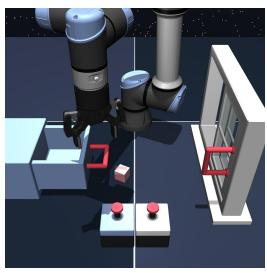

natural_image

3D rendering of a robotic arm operating on a mechanical assembly with red buttons (no text or symbols visible)

a) scene

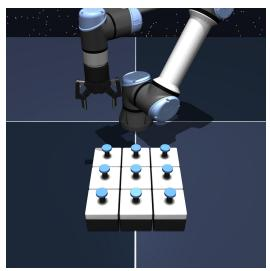

natural_image

3D rendering of a robotic arm interacting with a grid of blue pins (no text or symbols visible)

b) puzzle-3x3

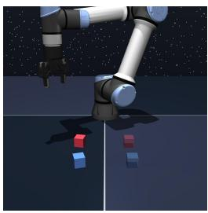

natural_image

3D rendering of a robotic arm in space with floating cubes against a starry background (no text or symbols)

c) cube-double

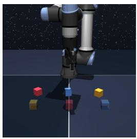

natural_image

3D rendering of a robotic arm in space with colored cubes on a dark surface (no text or symbols)

d) cube-triple

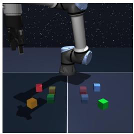

natural_image

3D rendering of a robotic arm in space with colorful cubes on a dark surface (no text or symbols)

e) cube-quadruple

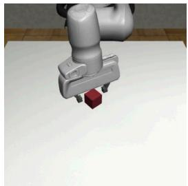

natural_image

3D rendering of a robotic arm with a red cube on a white surface (no text or symbols visible)

f) lift

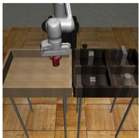

natural_image

3D rendering of a robotic arm interacting with a table and mechanical components on a wooden floor (no text or symbols visible)

g) can

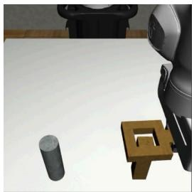

natural_image

3D rendering of a robotic arm interacting with a gray cylinder and a wooden stand (no text or symbols visible)

h) square   
Figure 7: We experiment on several challenging long-horizon, sparse-reward domains. See detailed task description for each domain in Appendix B. The rendered images of the robomimic tasks above are taken from Mandlekar et al. [43].

All of the three robomimic tasks use binary task completion rewards where the agent receives −1 reward when the task is not completed and 0 reward when the task is completed.

# C Implementation Details

In this section, we provide more implementation details on both of our Q-chunking methods (QC, QC-FQL) and our baselines used in our experiments. For IFQL, ReBRAC, IQL, we directly use the implementation from Park et al. [58].

# Algorithm 1 QC

Input: Behavior policy and critic: $f _ { \xi } \left( \boldsymbol { a } _ { t : t + h } | s \right)$ and $Q _ { \theta } \big ( s _ { t } , \pmb { a } _ { t : t + h } \big )$ .

$\mathcal { D }  \mathbf { o }$ ffline prior data.

for every environment step t do

if t mod $h \equiv 0$ then

$$
\boldsymbol {a} _ {t: t + h} ^ {1} \dots \boldsymbol {a} _ {t: t + h} ^ {N} \sim f _ {\xi} (\cdot | s _ {t})
$$

$$
\pmb {a} _ {t: t + h} ^ {\star} \leftarrow \arg \max _ {\pmb {a} _ {t: t + h} ^ {i}} Q _ {\theta} (s, \pmb {a} _ {t: t + h} ^ {i})
$$

Act with $a _ { t } ^ { \star }$ and receive $s _ { t + 1 } , r _ { t } .$

$$
\mathcal {D} \leftarrow \mathcal {D} \cup \left\{\left(s _ {t}, a _ {t} ^ {\star}, s _ {t + 1}, r _ {t}\right) \right\}
$$

Update $f _ { \xi }$ via flow-matching loss using D .

Update $\dot { Q _ { \theta } }$ via Eq (11) using D.

Output: $f _ { \xi } , Q _ { \theta } .$

# Algorithm 2 QC-FQL

Input: Behavior policy, critic, one-step policy:

$$
f _ {\xi} \left(\boldsymbol {a} _ {t: t + h} | s\right), Q _ {\theta} \left(s _ {t}, \boldsymbol {a} _ {t: t + h}\right), \mu_ {\psi} (s, \boldsymbol {z}).
$$

D ← offline prior data.

for every environment step t do

if t mod $h \equiv 0$ then

$$
\boldsymbol {z} \sim \mathcal {N} (0, \boldsymbol {I} _ {A h})
$$

$$
\boldsymbol {a} _ {t: t + h} \leftarrow \mu_ {\psi} (s _ {t}, \boldsymbol {z})
$$

Act with $a _ { t }$ and receive $s _ { t + 1 } , r _ { t } .$

$$
\mathcal {D} \leftarrow \mathcal {D} \cup \left\{\left(s _ {t}, a _ {t}, s _ {t + 1}, r _ {t}\right) \right\}
$$

Update $f _ { \xi }$ via flow-matching loss using D.

Update $\mu _ { \psi }$ and $Q _ { \theta }$ via Eq. (13, 15) using D.

Output: $f _ { \xi } , Q _ { \theta } , \mu _ { \psi } ( s , z )$ .

# C.1 QC-FQL

We build the implementation of our method on top of FQL [58], a recently proposed offline RL/offlineto-online RL method that uses TD3+BC-style objective. It is implemented with a one-step noiseconditioned policy (instead of a Gaussian policy that is commonly used in RL) and it uses a distillation loss from a behavior flow-matching policy as the BC loss. To adapt this method to use action chunking, we simply apply FQL on the temporally extended action space – the behavior flow-matching policy generates a sequence of actions, the one-step noise-conditioned policy predicts a sequence of actions, and the Q-network also takes in a state and a sequence of actions. More concretely, we train three networks:

1. $Q _ { \theta } ( s , a _ { 1 } , \cdot \cdot \cdot a _ { h } ) : \mathcal { S } \times \mathcal { A } ^ { h } \mapsto \mathbb { R }$ — the value function that takes in a state and a sequence of actions (action chunk). In practice, we train an ensemble of Q networks. We denote the weight of the ensemble element as $\theta = ( \theta _ { 1 } , \cdots , \theta _ { K } )$ .   
2. $\mu _ { \psi } ( s , z ) : \mathcal { S } \times \mathbb { R } ^ { A h } \mapsto \mathbb { R } ^ { A h }$ — the one-step noise-conditioned policy that takes in a state and a noise, and outputs a sequence of actions conditioned on them.   
3. $f _ { \xi } ( s , m , u ) : S \times \mathbb { R } ^ { A h } \times [ 0 , 1 ] \mapsto \mathbb { R } ^ { A h } -$ the flow-matching behavior policy parameterized by a velocity prediction network. The network predicts takes in a state, an intermediate state of the flow and a time, and outputs the velocity direction that the intermediate action sequence should move in at the specified time. See Algorithm 3 for more details on how this velocity prediction network is used to generate an action from a noise vector.

We denote our policy as $\pi _ { \psi } ( \cdot | s )$ ). It is implemented by first sampling a Gaussian noise $z \sim \mathcal { N } ( 0 , I _ { A h } )$ and run it through the one-step noise-conditioned policy $[ a _ { 1 } \quad \cdot \cdot \cdot \quad a _ { h } ] \gets \mu _ { \psi } ( s , z )$ . To train these three networks, we sample a high-level transition, $w = ( s _ { t } , a _ { t } , a _ { t + 1 } , \cdot \cdot \cdot , a _ { t + h - 1 } , s _ { t + h } , R _ { t } ^ { h } ) \sim \mathcal { D }$ where $\begin{array} { r } { R _ { t } ^ { h } = \sum _ { t ^ { \prime } = 0 } ^ { h - 1 } \gamma ^ { t ^ { \prime } } r _ { t + t ^ { \prime } } } \end{array}$ , to construct the following losses:

# (1) Critic loss:

$$
L \left(\theta_ {k}, w\right) = \left(Q _ {\theta_ {k}} \left(s _ {t}, a _ {t}, \dots , a _ {t + h - 1}\right) - R _ {t} ^ {h} - \frac {\gamma^ {h}}{K} \sum_ {k ^ {\prime} = 1} ^ {K} Q _ {\bar {\theta} _ {k ^ {\prime}}} \left(s _ {t + h}, a _ {t + h}, \dots , a _ {t + 2 h - 1}\right)\right) ^ {2}, \tag {20}
$$

where $\left[ a _ { t + h } \quad \cdot \cdot \cdot \quad a _ { t + 2 h - 1 } \right] \sim \pi _ { \psi } ( \cdot | s _ { t + h } ) , k \in \{ 1 , 2 , \cdot \cdot \cdot , K \}$

# (2) Actor loss:

$$
L (\psi , w) = - Q _ {\theta} (s _ {t}, \mu_ {\psi} (s _ {t}, z _ {t})) + \alpha \left\| \mu_ {\psi} (s _ {t}, z _ {t}) - \left[ a _ {t} ^ {\xi} \quad \dots \quad a _ {t + h - 1} ^ {\xi} \right] \right\| _ {2} ^ {2}, \tag {21}
$$

where $z _ { t } \sim \mathcal { N } ( 0 , I _ { A h } )$ and $\begin{array} { r l } { \left\lceil a _ { t } ^ { \xi } \quad \ldots \quad a _ { t + h - 1 } ^ { \xi } \right\rceil } \end{array}$ aξt+h−1 is the result of running the behavior policy $f _ { \xi } ( s , m , t )$ with Algorithm 3 from $z _ { t } ,$ , and $\alpha \in \mathbb { R }$ is a tunable parameter that controls the strength of the behavior regularization (higher α leads to stronger behavior regularization).

# (3) Flow-matching behavior policy loss:

$$
L (\xi , w) = \left\| f _ {\xi} \left(s _ {t}, u \left[ a _ {t} \quad \dots \quad a _ {t + h - 1} \right] + (1 - u) z _ {t}, u\right) - \left(\left[ a _ {t} \quad \dots \quad a _ {t + h - 1} \right] - z _ {t}\right) \right\| _ {2} ^ {2}, \tag {22}
$$

where $u \sim U ( [ 0 , 1 ] ) , z _ { t } \sim \mathcal { N } ( 0 , I _ { A h } )$ .

for each network: Practically, we sample a batch of transitions $\begin{array} { r l r } { \mathcal { L } ( \boldsymbol { \theta } ) } & { = } & { \frac { 1 } { M } \sum _ { i = 1 } ^ { M } \sum _ { k = 1 } ^ { K } \mathcal { L } ( \boldsymbol { \theta } _ { k } , \boldsymbol { w } _ { i } ) , \mathcal { L } ( \boldsymbol { \psi } ) ~ = ~ \frac { 1 } { N } \sum _ { i = 1 } ^ { M } \mathcal { L } ( \boldsymbol { \psi } , \boldsymbol { w } _ { i } ) , \mathcal { L } ( \boldsymbol { \xi } ) ~ = ~ \frac { 1 } { N } \sum _ { i = 1 } ^ { M } \mathcal { L } ( \boldsymbol { \psi } , \boldsymbol { w } _ { i } ) , } \end{array}$ $\{ w _ { 1 } , w _ { 2 } , \cdot \cdot \cdot , w _ { M } \}$ and optimize the average loss $\begin{array} { r } { \frac { 1 } { N } \sum _ { i = 1 } ^ { M } \mathcal { L } ( \xi , w _ { i } ) } \end{array}$ .

# C.2 FQL

FQL [58] is a recently proposed offline RL/offline-to-online RL method that uses TD3+BC-style objective. It is equivalent to our method with $h = 1$ . For completeness, we write out the objectives for a transition sample $w = ( s _ { t } , a _ { t } , r _ { t } , s _ { t + 1 } )$ :

$$
L (\theta_ {k}, w) = \left(Q _ {\theta_ {k}} (s _ {t}, a _ {t}) - r _ {t} - \frac {\gamma}{K} \sum_ {k ^ {\prime} = 1} ^ {K} Q _ {\bar {\theta} _ {k ^ {\prime}}} (s _ {t + 1}, \mu_ {\psi} (s _ {t + 1}, z _ {t} ^ {k ^ {\prime}}))\right) ^ {2}, z _ {t} ^ {k ^ {\prime}} \sim \mathcal {N} (0, I _ {A}), \tag {23}
$$

$$
L (\psi , w) = - Q _ {\theta} (s _ {t}, \mu_ {\psi} (s _ {t}, z _ {t})) + \alpha \left\| \mu_ {\psi} (s _ {t}, z _ {t}) - a _ {t} ^ {\xi} \right\| _ {2} ^ {2}, \tag {24}
$$

$$
a _ {t} ^ {\xi} \leftarrow \text { FlowODE\_Euler } (s _ {t}, z _ {t}, f _ {\xi}, T), z _ {t} \sim \mathcal {N} (0, I _ {A}), \tag {25}
$$

$$
L (\xi , w) = \| f _ {\xi} (s _ {t}, u a _ {t} + (1 - u) z _ {t}, u) - (a _ {t} - z _ {t}) \| _ {2} ^ {2}, z _ {t} \sim \mathcal {N} (0, I _ {A}), u \sim U ([ 0, 1 ]). \tag {26}
$$

In practice, we sample a batch of transitions $\{ w _ { 1 } , w _ { 2 } , \cdot \cdot \cdot , w _ { N } \}$ and optimize the average loss for each network: $\begin{array} { r } { \mathcal { L } ( \boldsymbol { \theta } ) = \frac { 1 } { N } \sum _ { i = 1 } ^ { N } \sum _ { k = 1 } ^ { K } \mathcal { L } ( \boldsymbol { \theta } _ { k } , \boldsymbol { w } _ { i } ) , \mathcal { L } ( \boldsymbol { \psi } ) = \frac { 1 } { N } \sum _ { i = 1 } ^ { N } \mathcal { L } ( \boldsymbol { \psi } , \boldsymbol { w } _ { i } ) , \mathcal { L } ( \boldsymbol { \xi } ) = \frac { 1 } { N } \sum _ { i = 1 } ^ { N } \mathcal { L } ( \boldsymbol { \xi } , \boldsymbol { w } _ { i } ) } \end{array}$

Algorithm 3 FlowODE\_Euler $( s _ { t } , z _ { t } , f _ { \xi } , T )$ : generate actions from the behavior flow policy $f _ { \xi } ( s , m , u )$ with Euler’s method.

Input: State $s _ { t } ,$ , noise $z _ { t }$ and flow model $f _ { \xi } ( s , m , u )$ , number of flow steps $T .$

$$
m ^ {0} \leftarrow z _ {t}
$$

for $i \in \{ 1 , \cdots , T \}$ do

$$
\lfloor \quad m ^ {i} \leftarrow f _ {\xi} (s _ {t}, m ^ {i - 1}, (i - 1) / T)
$$

Output: $m ^ { T } .$

# C.3 FQL-n

To implement the n-step return baseline, we take FQL and replace the 1-step TD update with the h-step TD update:

$$
L \left(\theta_ {k}, w\right) = \left(Q _ {\theta_ {k}} \left(s _ {t}, a _ {t}\right) - \sum_ {t ^ {\prime} = 0} ^ {h - 1} \left(\gamma^ {t ^ {\prime}} r _ {t + t ^ {\prime}}\right) - \frac {\gamma^ {h}}{K} \sum_ {k ^ {\prime} = 1} ^ {K} Q _ {\bar {\theta} _ {k ^ {\prime}}} \left(s _ {t + h}, \mu_ {\psi} \left(s _ {t + h}, z _ {t} ^ {k ^ {\prime}}\right)\right)\right) ^ {2}, \tag {27}
$$

where $z _ { t } ^ { k ^ { \prime } } \sim \mathcal { N } ( 0 , I _ { A } )$ for all $k ^ { \prime } \in \{ 1 , 2 , \cdots , K \}$ . The actor loss and flow-matching loss remain the same as FQL.

# C.4 QC

The flow-matching behavior policy is trained with the same loss as used in QC-FQL (Equation (22)). On top of the flow-matching behavior policy, we simply parameterize the policy π implicitly by sampling multiple action chunks from the behavior policy and pick the one that maximizes the $Q \cdot$ value. Specifically, let $\{ z _ { t } ^ { 1 } , z _ { t } ^ { 2 } , \cdot \cdot \cdot , z _ { t } ^ { N } \} \sim \mathcal { N } ( 0 , I _ { A h } ) $ and

$$
\left[ \begin{array}{c c c} a _ {t} ^ {i} & \dots & a _ {t + h - 1} ^ {i} \end{array} \right] = \text { FlowODE\_Euler } (s _ {t}, z _ {t} ^ {i}, f _ {\xi}, T)
$$

The policy outputs the one action chunk out of N that maximizes the Q-value, $\left[ a _ { t } ^ { i ^ { \star } } \quad \cdot \cdot \quad a _ { t + h - 1 } ^ { i ^ { \star } } \right]$ where

$$
i ^ {\star} \leftarrow \arg \max _ {i \in [ N ]} Q (s, \left[ \begin{array}{c c c} a _ {t} ^ {i} & \dots & a _ {t + h - 1} ^ {i} \end{array} \right]).
$$

Finally, we directly use this implicitly parameterize policy to generate actions for computing the TD target for our TD loss:

$$
L \left(\theta_ {k}, w\right) = \left(Q _ {\theta_ {k}} \left(s _ {t}, a _ {t}, \dots , a _ {t + h - 1}\right) - R _ {t} ^ {h} - \frac {\gamma^ {h}}{K} \sum_ {k ^ {\prime} = 1} ^ {K} Q _ {\bar {\theta} _ {k ^ {\prime}}} \left(s _ {t + h}, a _ {t + h} ^ {i ^ {\star}}, \dots , a _ {t + 2 h - 1} ^ {i ^ {\star}}\right)\right) ^ {2} \tag {28}
$$

where ai t+h, · $a _ { t + h } ^ { i ^ { \star } } , \cdot \cdot \cdot , a _ { t + 2 h - 1 } ^ { i ^ { \star } } \sim \pi ( \cdot | s _ { t + h } ) .$

The baselines BFN-n and BFN are implemented similarly to FQL-n and FQL by operating in the original action space.

# C.5 RLPD, RLPD-AC, QC-RLPD

All the RLPD baseline results are obtained by running the official codebase (as linked in Ball et al. [7]) with additional modification to incorporate action chunking and behavior cloning. This baseline runs online RL from scratch using off-policy transitions where 50% of them come from the offline dataset and the other 50% come from the online replay buffer. It essentially up-weights the online data more, allowing the online RL agent to learn more quickly. This is different from how QC-\*, BFN, BFN-n, FQL, FQL-n samples off-policy transitions (where we sample from the dataset that combines the offline dataset and online replay buffer data with no weighting). RLPD baselines all use Gaussian policy. This is also different from our method as our method uses noise-conditioned policy that can represent a wider range of distributions. For RLPD-AC, we change all the actor and critic networks such that they work with an action chunk rather than a single action. The baseline is exactly the same as our method except that actor and the critic are updated the same as how RLPD updates its actor and critic. For QC-RLPD, we add a behavior cloning loss in the actor loss as follows (highlighted in red below):

$$
\mathcal {L} (\psi) = \mathbb {E} _ {a _ {t} ^ {\prime} \sim \pi_ {\psi} (\cdot | s _ {t})} \left[ - \frac {1}{K} \sum_ {k = 1} ^ {K} Q _ {\theta_ {k}} (s _ {t}, a _ {t} ^ {\prime}) - \alpha \log \pi_ {\psi} (a _ {t} | s _ {t}) \right]. \tag {29}
$$

# C.6 SUPE-GT

For this baseline, we adapt from a recently proposed skill-based offline-to-online RL method [85]. The original method has additional modules such reward models and random distillation networks to deal with the problem setting where offline dataset is unlabeled (e.g., reward information is missing). We remove these two modules as we have ground truth reward information in our offline dataset. The method has two stages: (1) skill-pretraining and (2) online RL with skills. In the first stage, the baseline uses a trajectory VAE to learn latent-conditioned skill policy. In the second stage, the baseline uses RLPD to learn a high-level policy that outputs latent vector to command the latent-conditioned skill policy after every h steps. Such a skill-based method in theory also allows temporally coherent actions for exploration and value backup speedup.

# D Experiment Details

# D.1 Computational resources

We use NVIDIA RTX-A5000 GPU to run all our experiments. Each complete offline-to-online experiment run takes around 4-7 hours. To reproduce all our results in Table 6, we estimate that it would take around $6 \times 1 5 \times 2 5 \times 4 = 9 0 0 0$ 6 GPU hours. Each robomimic |{z}hours per single run |{z}# of methods |{z}# of tasks |{z}# of seeds

experiment run takes longer (around 8-12 hours). While each single run takes longer, we only run a subset of strong methods/baselines on robomimic tasks. We estimate it would take around $\textcircled { 1 0 } \times \textcircled { 8 } \times \textcircled { 3 } \times \textcircled { 5 } = 1$ 350 GPU hours. In total, we estimate that it would |{z}hours per single run |{z}# of methods |{z}# of tasks |{z}# of seeds

take around 10 350 GPU hours to reproduce all the main results in our paper.

# D.2 Evaluation protocol

Unless specified otherwise, for all methods, we run 4 seeds on each OGBench task and 5 seeds on each robomimic task. All plots use 95% confidence interval with stratified sampling (5000 samples). The success rate is computed by running the policy in the environment for 50 episodes and record the number of times that the policy succeeds at solving the task (and divide it by 50).

# D.3 Hyperparameter tuning

QC, BFN, BFN-n. We tune the number of actions sampled, N , for the expected-max Q operator. On OGBench domains, we sweep over {2, 4, 8, 16, 32, 64, 128} and select the best parameter for each domain and for each method on task2. We report the performance of each method with the best α in Table 1 and Figure 1 (on all tasks). Table 5 summarizes the α value we use for each task.

QC-FQL, FQL, FQL-n. We tune the behavior regularization coefficient α. On OGBench domains, we take the default hyperparameter of FQL for each domain $\alpha _ { \mathrm { d e f a u l t } }$ and tune all methods on task2 of each domain with three choices of α: $\lbrace \alpha _ { \mathrm { d e f a u l t } } / 3 , \alpha _ { \mathrm { d e f a u l t } } , 3 \alpha _ { \mathrm { d e f a u l t } } \rbrace$ (our $\alpha _ { \mathrm { d e f a u l t } }$ comes from Table 6 in Park et al. [58]). On robomimic domain, we sweep over much large α values: {100, 1000, 10000}. We report the performance of each method with the best α in in Table 1 and Figure 1 (on all tasks). Table 4 summarizes the α value we use for each task.

RLPD, RLPD-AC, QC-RLPD. We sweep over (1) whether or not to use clipped double Q-learning (CDQ), and (2) whether or not to use entropy backup. We find that not using CDQ and not using entropy backup to perform the best for all of the RLPD baselines and use that across all domains. Even though our method and the other FQL baselines use $K = 2$ critic ensemble size, we use $K = 1 0$ critic ensemble size for RLPD to keep it the same as the hyperparameter in the original paper [7].

<table><tr><td>Parameter</td><td>Value</td></tr><tr><td>Batch size (M)</td><td>256</td></tr><tr><td>Discount factor (γ)</td><td>0.99</td></tr><tr><td>Optimizer</td><td>Adam</td></tr><tr><td>Learning rate</td><td> $3 \times 10^{-4}$ </td></tr><tr><td>Target network update rate (τ)</td><td> $5 \times 10^{-3}$ </td></tr><tr><td>Critic ensemble size (K)</td><td>10 for RLPD, RLPD-AC, QC-RLPD, and SUPE-GT2 for QC-FQL, FQL, FQL-n, QC-BFN, BFN, BFN-n</td></tr><tr><td>UTD Ratio</td><td>1</td></tr><tr><td>Number of flow steps (T)</td><td>10</td></tr><tr><td>Number of offline training steps</td><td> $10^6$  except RLPD-based approaches (0)</td></tr><tr><td>Number of online environment steps</td><td> $1 \times 10^6$ </td></tr><tr><td>Network width</td><td>512</td></tr><tr><td>Network depth</td><td>4 hidden layers</td></tr></table>

Table 3: Common hyperparameters.

<table><tr><td>Environments</td><td>FQL</td><td>FQL-n</td><td>QC-FQL</td><td>ReBRAC</td></tr><tr><td>scene-sparse-*</td><td>300</td><td>100</td><td>300</td><td>0.1</td></tr><tr><td>puzzle-3x3-sparse-*</td><td>100</td><td>100</td><td>300</td><td>0.1</td></tr><tr><td>cube-double-*</td><td>300</td><td>100</td><td>300</td><td>0.1</td></tr><tr><td>cube-triple-*</td><td>300</td><td>100</td><td>100</td><td>0.1</td></tr><tr><td>cube-quadruple-100M-*</td><td>300</td><td>100</td><td>100</td><td>0.1</td></tr><tr><td>lift</td><td>10000</td><td>10000</td><td>10000</td><td>-</td></tr><tr><td>can</td><td>10000</td><td>10000</td><td>10000</td><td>-</td></tr><tr><td>square</td><td>10000</td><td>10000</td><td>10000</td><td>-</td></tr></table>

Table 4: Behavior regularization coefficient (α).

For QC-RLPD, we sweep over behavior regularization coefficient $\alpha \in \{ 0 . 0 0 1 , 0 . 0 1 , 0 . 1 \}$ and pick 0.01 since it works the best.

SUPE-GT. We tune the KL coefficient for the VAE skill-pretraining from {0.001, 0.003, 0.01, 0.03, 0.1} and pick 0.003 as it works the best.

ReBRAC. We tune the behavior regularization coefficient from $\{ 0 . 0 1 , 0 . 0 3 , 0 . 1 , 0 . 3 , 1 . 0 \}$ and pick 0.1 as it works the best.

IFQL. We directly use the default hyperparameter from Park et al. [58] $( N = 3 2 , \tau = 0 . 9 )$ for this baseline. The first parameter, $N = 3 \bar { 2 }$ , means that for both online policy rollout and policy evaluation, we sample 32 actions and pick the action that has the highest Q-value. The second parameter, $\tau = 0 . 9$ is the expectile coefficient.

IQL. We directly use the default hyperparameter from Park et al. [58] for this baseline. For cube-\*, we use $\alpha = 0 . 3$ . For scene and puzzle-3x3, we use $\alpha = 1 0 . 0$ . For the expectile coefficient, we use $\tau = 0 . 9$ .

# E Full Results

# E.1 End-effector visualization

We provide more examples of the trajectory rollouts from QC and BFN over the course of online training on cube-triple-task3. In Figure 8, we show the first 9000 time steps (broken down into 9 subplots where each visualizes 1000 time steps). In Figure 9, we show another 9000 time steps but late in the training (from environment step $9 \times 1 0 ^ { 5 } )$ . The first example is the same as the one used in Figure 5.

<table><tr><td>Environments</td><td>BFN</td><td>BFN-n</td><td>QC-BFN</td></tr><tr><td>scene-sparse*</td><td>4</td><td>4</td><td>32</td></tr><tr><td>puzzle-3x3-sparse-*</td><td>4</td><td>4</td><td>64</td></tr><tr><td>cube-*</td><td>4</td><td>4</td><td>32</td></tr><tr><td>lift, can, square</td><td>4</td><td>4</td><td>16</td></tr></table>

Table 5: Number of actions sampled for the expected-max Q operator (N) for BFN methods.

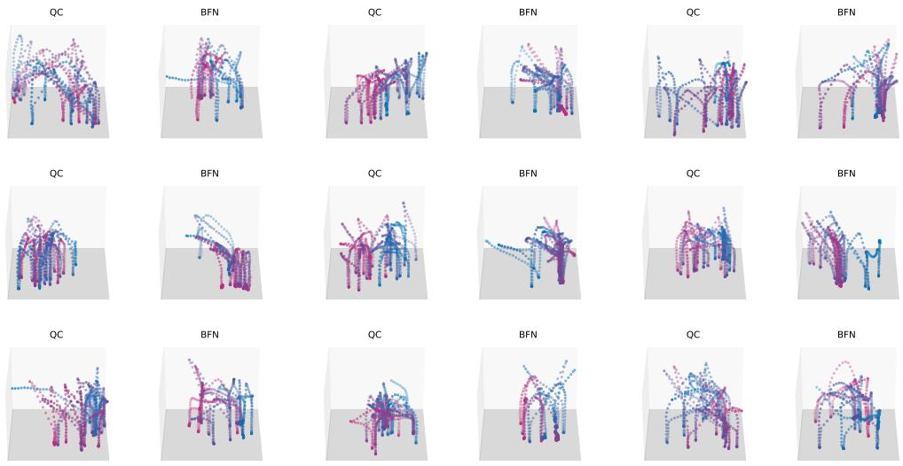

Figure 8: End-effector trajectory early in the training. Each subplot above shows the trajectory for a consecutive of 1000 time steps. We include up to Step 9000.   
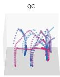

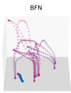

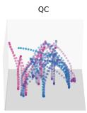

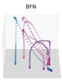

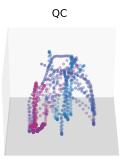

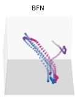

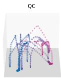

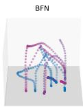

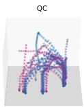

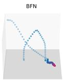

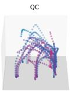

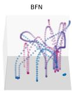

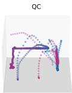

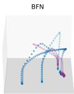

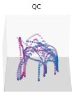

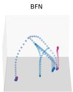

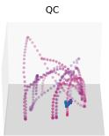

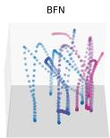  
Figure 9: End-effector trajectory visualization late in the training. Each subplot above shows the trajectory for a consecutive of 1000 time steps (from Step 900000 to Step 909000).

# E.2 OGBench results by individual task

Main results by task. Table 1 and Figure 10 shows the performance breakdown for all methods.

<table><tr><td colspan="2"></td><td>RLPD</td><td>RLPD-AC</td><td>SUPE-GT</td><td>IQL</td><td>ReBRAC</td><td>IFQL</td><td>FQL</td><td>BFN</td><td>IFQL-n</td><td>FQL-n</td><td>BFN-n</td><td>QC-RLPD</td><td>QC-IFQL</td><td>QC-FQL</td><td>QC</td></tr><tr><td rowspan="7">puzzle-3x3-sparse</td><td rowspan="2">task1</td><td>→ 100</td><td>→ 100</td><td>→ 100</td><td>0 → 99</td><td>264,600</td><td>264,600</td><td>264,600</td><td>264,600</td><td>264,600</td><td>264,600</td><td>264,600</td><td>264,600</td><td>264,600</td><td>264,600</td><td>264,600</td></tr><tr><td>→ 100</td><td>→ 100</td><td>→ 100</td><td>0 → 0</td><td>264,600</td><td>264,600</td><td>264,600</td><td>264,600</td><td>264,600</td><td>264,600</td><td>264,600</td><td>264,600</td><td>264,600</td><td>264,600</td><td>264,600</td></tr><tr><td rowspan="2">task2</td><td>→ 100</td><td>→ 100</td><td>→ 100</td><td>0 → 0</td><td>70 → 100</td><td>98 → 100</td><td>99 → 100</td><td>98 → 100</td><td>98 → 100</td><td>100 → 100</td><td>100 → 100</td><td>88 → 100</td><td>100 → 100</td><td>100 → 100</td><td>100 → 100</td></tr><tr><td>→ 100</td><td>→ 100</td><td>→ 100</td><td>0 → 0</td><td>264,600</td><td>264,600</td><td>264,600</td><td>264,600</td><td>264,600</td><td>264,600</td><td>264,600</td><td>264,600</td><td>264,6</td><td>264,6</td><td>264,6</td></tr><tr><td rowspan="2">task3</td><td>→ 100</td><td>→ 100</td><td>→ 100</td><td>0 → 0</td><td>264,600</td><td>264,600</td><td>264,600</td><td>264,600</td><td>264,600</td><td>264,600</td><td>264,600</td><td>264,600</td><td>264,6</td><td>264,6</td><td></td></tr><tr><td>→ 100</td><td>→ 100</td><td>→ 100</td><td>0 → 0</td><td>264,600</td><td>264,600</td><td>264,600</td><td>264,600</td><td>264,600</td><td>264,600</td><td>264,600</td><td>264,6</td><td>264,6</td><td>264,6</td><td></td></tr><tr><td>task4</td><td>→ 100</td><td>→ 100</td><td>→ 100</td><td>0 → 0</td><td>264,600</td><td>264,600</td><td>264,600</td><td>264,600</td><td>264,600</td><td>264,600</td><td>264,600</td><td>264,6</td><td>264,6</td><td>264,6</td><td></td></tr></table>

Table 6: Complete OGBench offline-to-online RL results. 4 seeds. 95% confidence interval.

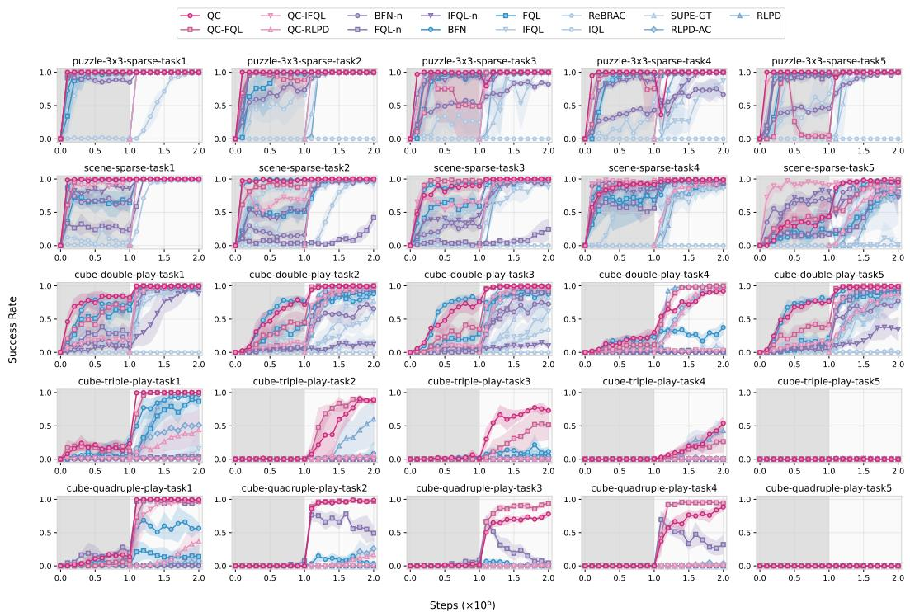  
Figure 10: Complete OGBench offline-to-online RL results by task. 4 seeds. 95% confidence interval.

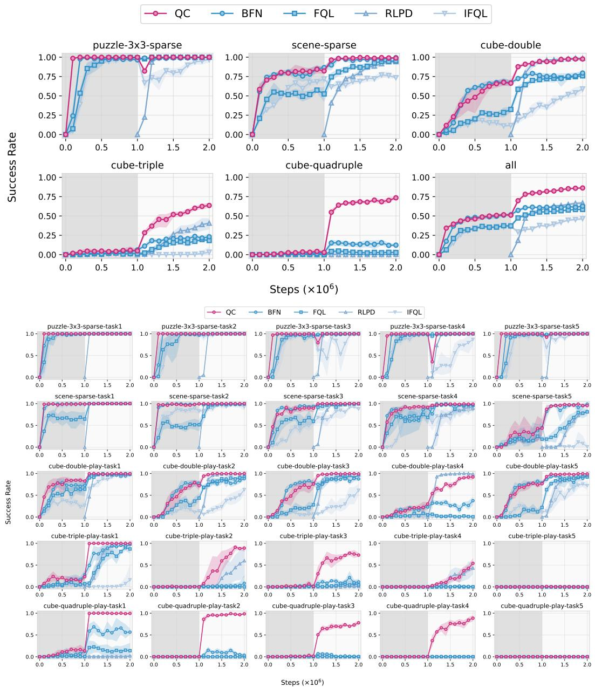  
Figure 11: Full OGBench results by task (selected baselines). Top: summary plots by domain; Bottom: individual plots by task.

Selected baselines. Figure 11 shows the results for selected baselines (e.g., BFN, FQL, RLPD and RLPD-AC).

n-step return ablation results by task. Figure 12 shows the performance breakdown for Figure 4.

Q-chunking with Gaussian policies. The following plot shows the performance breakdown for Figure 2. In addition, we include a new method for comparison, QC-RLPD, where we add a behavior cloning loss to RLPD-AC (RLPD with action chunking).

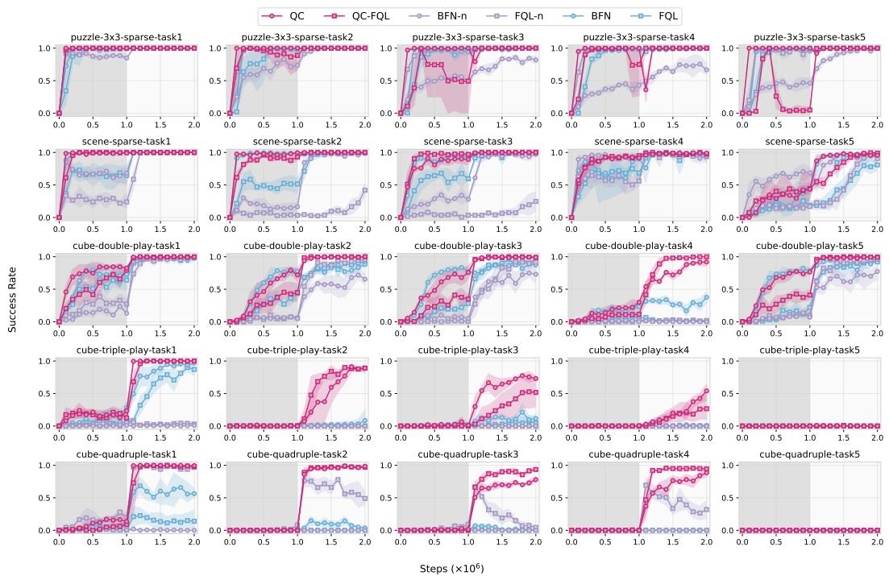

Figure 12: Full OGBench results by task (selected baselines).   
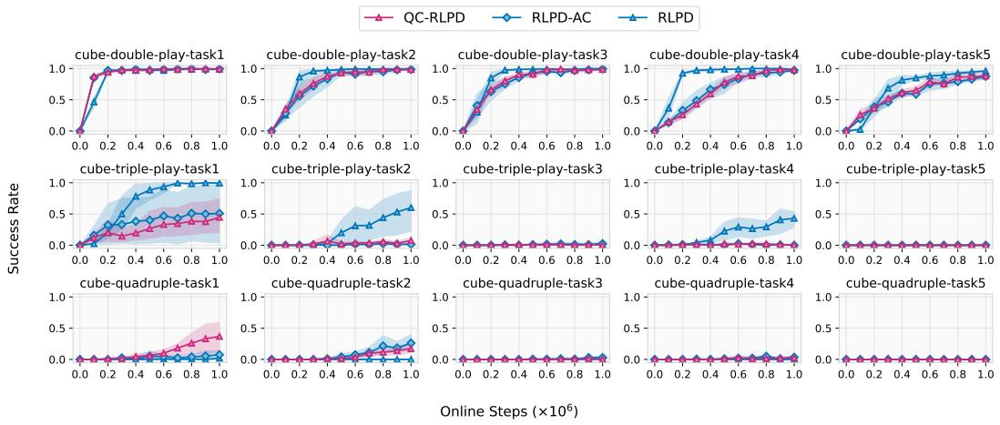  
Figure 13: Full RLPD results by task. QC-RLPD is RLPD-AC (RLPD on the temporally extended action space) where we additionally add a fixed behavior cloning coefficient of 0.01.

Action chunking size ablations. Figure 14 includes individual task results for the action chunking size ablation study. We also include results on the hardest cube-quadruple task in Figure 15.

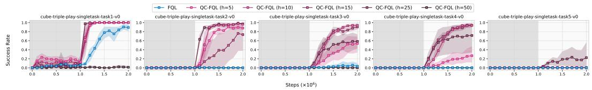  
Figure 14: Action chunking size ablation on cube-triple-\*. Increasing the action chunking size generally helps until h = 25. Surprisingly, h = 25 is the only chunk size where QC-FQL achieves non-trivial success on the hardest cube-triple-play-task5 (none of other methods can).

text_image

QC-FQL (h=9)
QC-FQL (h=7)
QC-FQL (h=5)
QC-FQL (h=3)
FQL
FQL-n (n=9)
FQL-n (n=7)
FQL-n (n=5)
FQL-n (n=3)

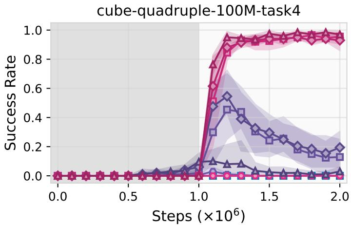

line

| Steps (×10⁶) | Success Rate (Line 1) | Success Rate (Line 2) | Success Rate (Line 3) |
| ------------ | --------------------- | --------------------- | --------------------- |
| 0.0          | 0.0                   | 0.0                   | 0.0                   |
| 0.5          | 0.0                   | 0.0                   | 0.0                   |
| 1.0          | 0.0                   | 0.0                   | 0.0                   |
| 1.5          | 0.95                  | 0.3                   | 0.1                   |
| 2.0          | 0.98                  | 0.2                   | 0.05                  |

Figure 15: Action chunking size ablation on cube-quadruple-play-task4. The n-step return baselines (i.e., FQL-n) can achieve good initial success during online learning but quickly collapse. In contrast, our method (i.e., QC-FQL) does not suffer from such collapse and solves the task consistently across reasonably large chunk sizes (e.g., $h \in \{ 5 , 7 , 9 \} ,$ . The results are over 5 seeds.

# E.3 Robomimic ablation results

Figure 16 shows the performance of QC, QC-FQL, BFN-n, FQL-n, BFN, FQL our three robomimic tasks. This plot shows the performance breakdown for Figure 4 (right).

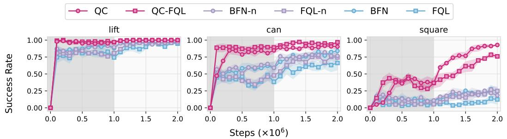

line

| Steps (×10⁶) | QC    | QC-FQL | BFN-n | FQL-n | BFN   | FQL   |
| ------------ | ----- | ------ | ----- | ----- | ----- | ----- |
| 0.0          | 0.00  | 0.00   | 0.00  | 0.00  | 0.00  | 0.00  |
| 0.5          | 0.95  | 0.95   | 0.85  | 0.85  | 0.85  | 0.85  |
| 1.0          | 0.95  | 0.95   | 0.85  | 0.85  | 0.85  | 0.85  |
| 1.5          | 0.95  | 0.95   | 0.85  | 0.85  | 0.85  | 0.85  |
| 2.0          | 0.95  | 0.95   | 0.85  | 0.85  | 0.85  | 0.85  |

Figure 16: Full robomimic ablation by task. For each method on each task, we use 5 seeds.

# E.4 How resource efficient is Q-chunking?

In Figure 17, we report the runtime for our approach and our baselines on a representative task cube-triple-task1. In general, QC-FQL has a comparable run-time as our baselines (e.g., FQL and RLPD) for both offline and online. QC is slower for offline training as it requires sampling 32 actions for each training example for the agent update (BFN is faster because it only needs to sample 4 actions). For online training, we are doing one gradient update per environment step, and it makes QC only around 50% more expensive than other methods.

Finally, we include the parameter count of each of these method on the representative domain cube-triple-\* in Table 7 below (assuming h = 5 for all Q-chunking methods).

<table><tr><td>Methods</td><td>Parameter Count (in millions)</td></tr><tr><td>QC</td><td>≈ 4.2</td></tr><tr><td>BFN</td><td>≈ 4.1</td></tr><tr><td>QC-FQL</td><td>≈ 5.0</td></tr><tr><td>FQL</td><td>≈ 4.9</td></tr><tr><td>RLPD</td><td>≈ 17.2</td></tr></table>

Table 7: Parameter count for each method. RLPD has a much larger parameter count because it uses $K = 1 0$ critic networks whereas all the other methods and baselines use only K = 2.

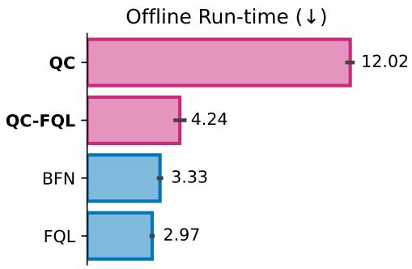

bar

Offline Run-time (↓)
| Method | Offline Run-time (minutes) |
| :--- | :--- |
| QC | 12.02 |
| QC-FQL | 4.24 |
| BFN | 3.33 |
| FQL | 2.97 |

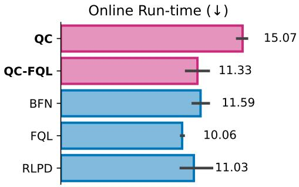

bar

Online Run-time (↓)
| Method | Online Run-time (minutes) |
| :--- | :--- |
| QC | 15.07 |
| QC-FQL | 11.33 |
| BFN | 11.59 |
| FQL | 10.06 |
| RLPD | 11.03 |

Figure 17: How long does each method take for one step in milliseconds. Left: offline. Right: online (one agent training step and an environment step). The runtime is measured using the default hyperparameters in our paper on cube-triple-task1 on a single RTX-A5000.