# VLA-RL: Towards Masterful and General Robotic Manipulation with Scalable Reinforcement Learning

Guanxing Lu1, Wenkai Guo2, Chubin Zhang1, Yuheng Zhou2, Haonan Jiang1 Zifeng Gao1, Yansong Tang1:, Ziwei Wang2

1 Tsinghua Shenzhen International Graduate School, Tsinghua University 2 School of Electrical and Electronic Engineering, Nanyang Technological University github.com/GuanxingLu/vlarl

# Abstract

Recent high-capacity vision-language-action (VLA) models have demonstrated impressive performance on a range of robotic manipulation tasks by imitating human demonstrations. However, exploiting offline data with limited visited states will cause execution failure in out-of-distribution scenarios. Intuitively, an exploration-based method that improves on online collected data at test time could address this limitation. We present VLA-RL, an algorithmic and systematic framework that leverages online reinforcement learning (RL) to improve pretrained auto-regressive VLAs in downstream tasks. Within a unified perspective, we first introduce a trajectory-level RL formulation for auto-regressive VLA training, which models general robotic manipulation trajectory as multi-modal multi-turn conversation. To address the challenge of sparse rewards, we fine-tune a pretrained vision-language model as a robotic process reward model, which is trained on pseudo reward labels annotated on automatically extracted task segments. To scale up, we identify several implementation findings that improve the stability and efficiency including curriculum selection strategy, GPU-balanced vectorized environments, batch decoding, and critic warmup. VLA-RL enables OpenVLA-7B to surpass the strongest finetuned baseline by 4.5% on 40 challenging robotic manipulation tasks in LIBERO, and even matches the performance of advanced commercial models such as π0-FAST. Notably, we observe that VLA-RL benefits from increased test-time optimization, indicating an early spark of inference scaling laws in robotics.

“We want AI agents that can discover like we can, not which contain what we have discovered.”

— The Bitter Lesson

# 1 Introduction

Large foundation models pretrained on internet-scale datasets have demonstrated effectiveness across a variety of domains, such as text [56, 13, 17], image [79, 74, 81, 80], video [87, 73], and audio [14]. Recently, large vision-language-action (VLA) models [9, 8, 68, 39, 44, 35, 36, 19, 6, 7, 57, 32] have been proposed by imitating large-scale human demonstrations [15, 20, 58, 52, 35, 23, 16, 10, 33, 18, 72, 6, 37], which indicates a possible pathway towards generalist robots that can perform diverse manipulation tasks. However, exploiting offline data with limited visited states will cause execution failure in Out-of-Domain (OOD) scenarios at test time.

We believe the key to overcoming such challenges lies in transforming exploitation-based approaches into exploration-based methods, as exemplified by Reinforcement Learning (RL) [63]. Recent breakthroughs witnessed in applying RL to large language models (LLMs) have shown remarkable progress [17, 82, 47, 31], where the scaling benefits from imitation pretraining on offline web data are approaching their limits. Consequently, reinforcement learning has emerged as a promising paradigm for achieving test-time scaling improvements by training on online collected data with unlimited state coverage. It is natural to ask: can we achieve similar RL-based test-time scaling benefits in the field of robotic manipulation?

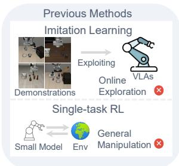

<details>
<summary>flowchart</summary>

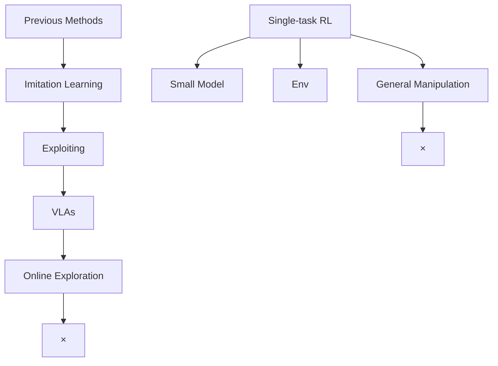
</details>

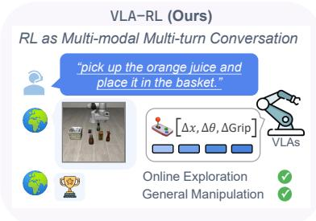

<details>
<summary>text_image</summary>

VLA-RL (Ours)
RL as Multi-modal Multi-turn Conversation
"pick up the orange juice and place it in the basket."
[Δx, Δθ, ΔGrip]
VLAs
Online Exploration
General Manipulation
</details>

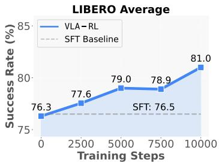

<details>
<summary>line</summary>

| Training Steps | VLA-RL | SFT Baseline |
| -------------- | ------ | ------------ |
| 0              | 76.3   | 76.5         |
| 2500           | 77.6   | 76.5         |
| 5000           | 79.0   | 76.5         |
| 7500           | 78.9   | 76.5         |
| 10000          | 81.0   | 76.5         |
</details>

Figure 1: Previous VLAs focus on imitation learning that exploits the offline demonstrations, while VLA-RL explores improving high-capacity VLAs with scalable reinforcement learning. For evaluation, we train OpenVLA-7B to master 40 challenging robotic manipulation tasks in LIBERO, and show a notable consistent improvement over the imitation learning baseline.

On the other hand, many efforts have been proposed to apply RL to robotics [66]. However, traditional RL from scratch often suffers from data inefficiency and requires extensive reward engineering [2, 29, 85, 91]. Thus, previous works focus on simple domains, with low-dimensional state spaces [60, 24, 54] and small-scale network architecture (e.g. MLP)[60, 70, 1, 50, 51], singletask learning [92, 40]. In contrast, fine-tuning from large robotics foundation models with rich representational knowledge may significantly reduce the search space and enable the model to learn complex motion patterns, making training on general tasks and environments possible.

We explore this question through a systematic study. To efficiently implement scalable RL training, we present VLA-RL, a unified framework that leverages online RL to improve pretrained auto-regressive VLAs. Specifically, within a unified perspective, we first introduce a general RL formulation for auto-regressive VLA training, which models general robotic manipulation trajectory as multi-modal multi-turn conversation. To address challenges associated with sparse rewards in the expansive robot action space, we instantiate a robotic process reward model as vision-language model finetuned on automatically extracted pseudo reward labels. Based on VLA-RL, we identify systematic implementation improvements, including task selection, GPU-balanced environments, batch decoding, and critic warmup—to enhance stability and efficiency. Empirically, we adopt OpenVLA-7B [39] as the base VLA and apply our method to 40 challenging robotic tasks in LIBERO [45]. The results show that VLA-RL improves the base model by a large margin of 4.5% and even matches the performance of advanced commercial models such as π0-FAST [57]. Furthermore, VLA-RL’s performance consistently improves with increased test-time computation, suggesting preliminary evidence of inference scaling laws [64] in robotics.

# 2 Related Work

Robotic Foundation Models. Robotic foundation models demonstrating remarkable potential in developing generalizable robot behaviors through multi-task training [9, 8, 68, 39, 44, 35, 36, 19, 6, 7, 57, 32, 48, 46] on extensive multi-task and multi-embodiment robot datasets [15, 20, 16, 18, 72, 37]. Notably, OpenVLA-7B [39] finetunes high-capacity vision-language models to generate robot actions as language tokens in the model vocabulary, depicting impressive generalizability across various tasks. However, these VLAs trained through imitation learning face significant deployment challenges when dealing with OOD scenarios that are not covered in the offline expert demonstrations.

Reinforcement Learning for Robotics Models. Although reinforcement learning has demonstrated numerous achievements in robotics [66], implementing RL methods from the ground up typically demands sophisticated reward and training paradigm designs [2, 29, 85, 91, 28, 89, 22]. Consequently, researchers have thoroughly investigated the utilization of pretrained models to enhance RL performance [65, 38, 67, 54, 25, 24, 34, 49, 4, 93, 76, 70, 27, 77]. However, prior studies necessitate complete offline dataset availability throughout the fine-tuning process[54, 1, 25, 24, 34, 71, 40, 49, 60, 5].

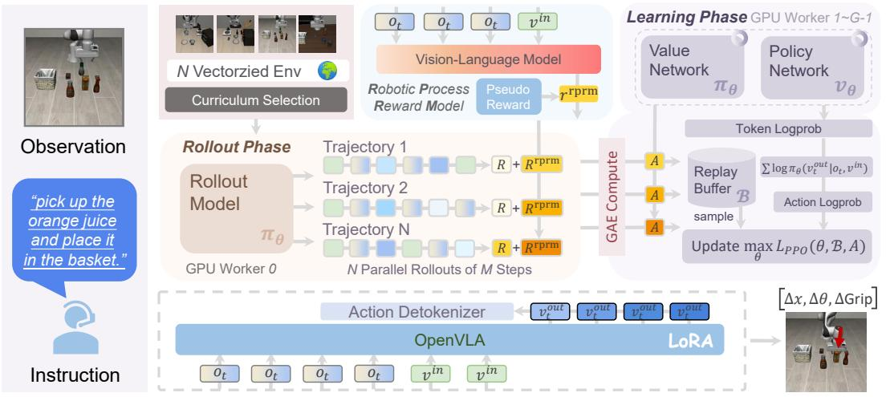

<details>
<summary>flowchart</summary>

```mermaid
graph TD
    A["Observation"] --> B["N Vectorized Env Curriculum Selection"]
    B --> C["Vision-Language Model"]
    C --> D["Robotic Process Reward Model"]
    D --> E["Pseudo Reward"]
    E --> F["r^rprm"]
    F --> G["Rollout Phase"]
    G --> H["Trajectory 1"]
    G --> I["Trajectory 2"]
    G --> J["Trajectory N"]
    H --> K["R + R^rprm"]
    I --> L["R + R^rprm"]
    J --> M["R + R^rprm"]
    K --> N["N Parallel Rollouts of M Steps"]
    L --> N
    M --> N
    N --> O["GAE Compute"]
    O --> P["A"]
    O --> Q["A"]
    O --> R["A"]
    P --> S["Token Logprob"]
    Q --> S
    R --> S
    S --> T["Replay Buffer sample"]
    T --> U["Σ log πθ(vt^out | ot, v^in)"]
    U --> V["Action Logprob"]
    V --> W["Update max θ L_PPO(θ, B, A)"]
    W --> X["OpenVLA"]
    X --> Y["Action Detokenizer"]
    Y --> Z["v_t^out"]
    Y --> AA["v_t^out"]
    Y --> AB["v_t^out"]
    Y --> AC["v_t^out"]
    Z --> AD["LoRA"]
    AA --> AD
    AB --> AD
    AC --> AD
    AD --> AE["[Δx, Δθ, ΔGrip"]]
```
</details>

Figure 2: The overall pipeline of VLA-RL, which is composed of a transformer-based policy, a homogeneous value model, a frozen robotic process reward model, and the vectorized environments.

Furthermore, other proposed methodologies are exclusively tested in environments with simplified state representations [60, 24, 54], naive neural network structures [60, 70, 1, 50, 51], and narrow single-task training paradigms [92, 40]. In contrast, VLA-RL explores fine-tuning from large robotics foundation models with trajectory-level RL, where the rich representational knowledge significantly reduces the search space and enables the model to learn complex motion patterns, making training on general tasks and environments possible.

Reinforcement Learning for Large Models. Reinforcement learning has significantly enhanced LLMs’ reasoning capabilities through approaches that inspire our work [62, 17, 88, 43, 56, 11, 75, 82, 47, 31, 3]. This family of methods begins with STaR [84] and includes reinforced selftraining [21] and rejection fine-tuning [83], relying on solutions generated by LLMs for interactive self-updating. To facilitate more autonomous exploration and exploitation, policy optimization methods like PPO [62] are widely used in current practice. For example, GRPO [17] strengthens systematic problem-solving capabilities particularly relevant to sequential decision-making. Approaches enabling reasoning include Process Reward Models [88, 43] that evaluate intermediate reasoning, and conversation-based training methods [56, 11, 75] that optimize multi-turn interactions. Recent proposed RL techniques [82, 47, 31] demonstrate that different implementation details significantly improve the scaling of reasoning in language models. Our work bridges these advances to robotics by formulating trajectory-level optimization as a multi-modal, multi-turn conversation, enabling robots to benefit from similar RL frameworks that have proven effective for large language models.

# 3 VLA-RL

In this section, we start with brief preliminaries on the problem descriptions and open-sourced VLA models (Sec. 3.1). We present an overview of our pipeline (Sec. 3.2). Subsequently, we introduce the mathematical formulation of general robotic manipulation as multi-modal multi-turn conversation (Sec. 3.3). Then we present robotic process reward model for reward densification (Sec. 3.4). To implement in practice, we build and present the VLA-RL system (Sec. 3.5) with several key findings that facilitate scalable VLA training with RL.

# 3.1 Preliminaries

General robotic manipulation has been a core pursuit of the robotic community for a long time. The agent is required to interactively determine the next robot action (the end-effector’s pose) to perform diverse tasks, based on the visual observation and the human instruction that specifies the current task. Recently, high-capacity, pretrained vision-and-language models have demonstrated generalizability across a wide range of language-conditioned manipulation tasks. Among these, OpenVLA-7B [39] is a leading open-source VLA, which hence acts as the base model of our method. At its core lies an auto-regressive LLM Llama-2-7B [69] with a two-stream visual encoder that consists of pretrained SigLIP [86] and DinoV2 [55] models. At each timestep t, it takes the captured image $\mathbf { o } _ { t }$ by a third-person camera and the human instruction ${ \bf v } _ { t } ^ { \mathrm { i n } }$ as input and outputs an action token sequence $\dot { \mathbf { v } } _ { t } ^ { \mathrm { o u t } } \in \mathcal { V } ^ { n }$ , where each action token represents a discrete bin of one dimension of the robot action space. The final robot action is extracted from this sequence using a post-processing function f , resulting in $\mathbf { a } _ { t } = f ( \mathbf { v } _ { t } ^ { \mathrm { o u t } } )$ . However, optimizing the auto-regressive VLA poses challenges in both algorithmic and systematic aspects, including RL for general manipulation, sparse reward issue, and large-scale evaluation and optimization, etc.

Algorithm 1: VLA-RL   
Input: number of environments N, initial VLA policy with parameters $\theta_{0}$ , trained robotic process reward model with parameters $\phi$ , post-processing function f, steps per update M, discount factor $\gamma$ , GAE parameter $\lambda_{GAE}$ Output: Improved VLA policy $\theta_{K}$ 1 envs ← VecEnv(num_envs = N)

2 $o_{0} \leftarrow$ envs.reset()

3 $d_{0} \leftarrow \{0\}^{N}$ # Terminal state indicators

4 for k = 0 to K - 1 do

5 $B_{k} \leftarrow \emptyset$ 6 # Rollout Phase: Collect trajectories from N parallel environments

7 for t = 0 to M - 1 do

8 $v_{t}^{in} \leftarrow h(\mathbf{o}_{t})$ # Apply vision-text processor to all observations

9 $v_{t}^{out} \leftarrow \pi_{\theta_{k}}(\mathbf{o}_{t}, \mathbf{v}_{t}^{in})$ # Policy model generates

10 $a_{t} \leftarrow f(\mathbf{v}_{t}^{out})$ # Extract actions

11 # Compute action log probabilities as sum of token log probs

12 $\log \pi_{\theta_{k}}(\mathbf{a}_{t}|\mathbf{o}_{t}, \mathbf{v}_{t}^{in}) \leftarrow \sum_{i} \log \pi_{\theta_{k}}(\mathbf{v}_{t,i}^{out}|\mathbf{o}_{t}, \mathbf{v}_{t}^{in})$ 13 $V_{t} \leftarrow V_{\theta_{k}}(\mathbf{o}_{t}, \mathbf{v}_{t}^{in})$ # Value model estimates

14 $o_{t+1}, r_{t}^{sparse}, d_{t+1}, i_{t} \leftarrow \text{envs.step}(\mathbf{a}_{t})$ 15 $r_{t}^{rprm} \leftarrow R_{\phi}(\mathbf{o}_{t}, \mathbf{a}_{t})$ # Robotic process reward model

16 $r_{t} \leftarrow r_{t}^{sparse} + r_{t}^{rprm}$ 17 $B_{k} \leftarrow B_{k} \cup \{(\mathbf{o}_{t}, \mathbf{a}_{t}, r_{t}, d_{t}, v_{t}^{out}, \log \pi_{\theta_{k}}(\mathbf{a}_{t}|\mathbf{o}_{t}, v_{t}^{in}), V_{t})\}$ 18 $A^{GAE} \leftarrow GAE(B_{k}, V_{M}, \gamma, \lambda_{GAE})$ # Compute advantages

19 $\theta_{k+1} \leftarrow PPO(\theta_{k}, B_{k}, A^{GAE})$ # Learning Phase: Update policy parameters

20 return $\theta_{K}$

# 3.2 Overall Pipeline

The overall pipeline of VLA-RL is shown in Fig. 2, in which we develop an algorithmic and systematic framework to train auto-regressive VLAs with RL. The system consists of three models, including the policy and value model that need to be trained in the commonly used actor-critic framework, and a frozen robotic process reward model that densifies the sparse reward given by the environment. At the algorithmic level, we formulate auto-regressive VLA-RL training as a multi-modal and multi-turn conversation. The systematic techniques such as GPU-balanced vectorized environment, batch decoding, curriculum selection strategy, and critic warmup further contribute to the training efficiency and stability of the system. Finally, the post-trained VLA model is able to produce feasible actions by optimizing the expected reward, thereby performing diverse manipulation tasks successfully.

# 3.3 General Robotic Manipulation as Multi-turn Conversation

To extend RL to optimize auto-regressive VLAs for general manipulation, we first formulate the Markovian Decision Process as multi-turn conversation. Let V represent the discrete, finite set of vocabulary tokens. The spaces $\mathcal { V } ^ { m }$ and $\mathcal { V } ^ { n }$ denote the possible input and output text sequences, with m and n specifying the maximum sequence lengths for inputs and outputs, respectively. We define the state space as the Cartesian product $\boldsymbol { S } = \boldsymbol { \mathcal { O } } \times \mathcal { V } ^ { m }$ , where O is the image space. The action space is given by the set of all possible output utterances, $\mathcal { V } ^ { n }$ , generated by VLAs. Accordingly, the VLA policy parameterized by θ can be formalized as a mapping $\pi _ { \theta } : \mathcal { O } \stackrel { \cdot } { \times } \mathcal { V } ^ { m }  \mathcal { V } ^ { n }$ . At each timestep, the policy assigns a probability $\pi _ { \theta } \big ( \mathbf { v } _ { t } ^ { \mathrm { o u t } } \mid o _ { t } , \mathbf { v } _ { t } ^ { \mathrm { i n } } \big ) \in [ 0 , 1 ]$ to emitting the output sequence ${ \bf v } _ { t } ^ { \mathrm { o u t } }$ given the input image $o _ { t }$ and prompt ${ \bf v } _ { t } ^ { \mathrm { i n } }$ . The environment’s transitions are governed by the function $\mathcal { T } : \bar { S \times A } \mapsto \bar { S }$ , describing how states evolve after each action. The environmental reward function, $R : S  \mathbb { R }$ , quantifies the quality of outcomes as $r _ { t }$ following each action taken. Over a trajectoryř of $T$ timesteps, the objective is to maximize the discounted sum of rewards, $\begin{array} { r } { R ^ { \gamma } = \sum t = \bar { 0 } ^ { T } \gamma ^ { t } r _ { t } } \end{array}$ , where $\gamma$ is the discount factor. We employ Proximal Policy Optimization (PPO) [62] for stable policy optimization.

Rollout Phase. We first merge the updated LoRA [26] weights with the original checkpoint and broadcast it to the inference engine. Then the agent interacts with the environment according to its current policy $\pi _ { \theta _ { o l d } } ,$ generating a sequence of states, actions, and rewards (i.e., trajectories). The log-probability of an action sequence can be decomposed into the summation of token-level log probabilities in auto-regressive models:

$$
\log \pi_ {\theta} (\mathbf {a} _ {t} | \mathbf {o} _ {t}, \mathbf {v} _ {t} ^ {\text { in }}) = \sum_ {i = 1} ^ {| \mathcal {A} |} \log \pi_ {\theta} (\mathbf {v} _ {t, i} ^ {\text { out }} | \mathbf {o} _ {t}, \mathbf {v} _ {t} ^ {\text { in }}) \tag {1}
$$

where $| { \mathcal { A } } | = 7$ is the degrees of freedom of the action space of OpenVLA.

Learning Phase. The PPO objective function utilizes importance sampling with clipping to ensure stable updates:

$$
\mathcal {L} _ {\mathrm{ppo}} (\theta) = \mathbb {E} _ {t} \left[ \min \left(\frac {\pi_ {\theta} \left(\mathbf {a} _ {t} \mid \mathbf {o} _ {t} , \mathbf {v} _ {t} ^ {\text { in }}\right)}{\pi_ {\theta_ {o l d}} \left(\mathbf {a} _ {t} \mid \mathbf {o} _ {t} , \mathbf {v} _ {t} ^ {\text { in }}\right)} A _ {t}, \operatorname{clip} \left(\frac {\pi_ {\theta} \left(\mathbf {a} _ {t} \mid \mathbf {o} _ {t} , \mathbf {v} _ {t} ^ {\text { in }}\right)}{\pi_ {\theta_ {o l d}} \left(\mathbf {a} _ {t} \mid \mathbf {o} _ {t} , \mathbf {v} _ {t t} ^ {\text { in }}\right)}, 1 - \epsilon , 1 + \epsilon\right) A _ {t}\right) \right] \tag {2}
$$

where ϵ is the clipping parameter that restricts the ratio between the new and old policies, preventing excessive policy updates. For each state, the advantage $A _ { t }$ is computed via Generalized Advantage Estimation (GAE) [61]. The overall process is summarized in Alg. 1.

# 3.4 Robotic Process Reward Model

Reward modeling is the crux of applying RL to general manipulation, which needs to: (1) provide dense rewards in environments with naturally sparse feedback; (2) avoid reward hacking where agents exploit the reward function in unintended ways. To this end, we propose robotic process reward model, a novel approach for reward densification that aligns with the VLA’s token generation process.

Reward Modeling as Next-token Prediction. Traditional reinforcement learning in robotics often suffers from sparse rewards, typically binary signals provided only upon task completion. We reformulate reward modeling as a next-token prediction problem, leveraging the auto-regressive nature of pretrained vision-language models. Given a trajectory of states and actions, Robotic Process Reward Model (RPRM) predicts the likelihood of successful action sequences. The training objective is to maximize the log-likelihood of promising action tokens, weighted by a pseudo-reward signal that indicates progress towards task completion:

$$
\mathcal {L} _ {\mathrm{rprm}} (\phi) = - \mathbb {E} _ {t} \left[ \sum_ {j = 1} \log p _ {\phi} \left(\mathbf {v} _ {t, j} ^ {\mathrm{rprm}} \mid \mathbf {v} _ {t, <   j} ^ {\text { out }}, \mathbf {o} _ {t}, \mathbf {v} _ {t} ^ {\text { in }}\right) \right] \tag {3}
$$

where $\phi$ are the parameters of the robotic process reward model model, $p _ { \phi } ( \mathbf { v } _ { j } ^ { \mathrm { r p r m } } | \cdot )$ is the predicted probability of the next token ${ \bf v } _ { j } ^ { \mathrm { r p r m } }$ by robotic process reward model.

Autonomous Pseudo Reward Label Generation. To train the robotic process reward model effectively without extensive human labeling, we develop an autonomous label generation pipeline that creates high-quality pseudo-reward labels from successful trajectories: (1) Milestone Segmentation: We collect a dataset of diverse successful trajectories from expert demonstrations and previous model runs. We segment trajectories into subtasks based on significant changes in gripper openness, as these often signify the completion of a functional step. (2) Progress Labeling: Within each segmented subtask, we identify keyframes where the robot’s end-effector velocity approaches zero. These points often correspond to stable states or the completion of fine-grained motions. A positive pseudo-reward is assigned to the VLA action sequences leading to these keyframes.

The final reward is the direct summation of the golden sparse reward and the predicted reward from robotic process reward model. Our empirical analysis shows that this approach substantially accelerates learning while maintaining strong correlation with actual task success.

# 3.5 The VLA-RL System

As RL performance highly depends on the implementation details, we would like to share some tricks we have adopted in this project to increase the learning efficiency and stability.

Curriculum Selection Strategy. We implement an adaptive curriculum that selects tasks based on the agent’s current capabilities. For each task consists of an instruction and an initial state, we track success rates sj and compute sampling probabilities as:

$$
P (t a s k _ {j}) \propto \exp \left((0. 5 - s _ {j}) / \tau\right) \tag {4}
$$

where τ controls exploration. This equation prioritizes tasks with „ 50% success rate as the frontier of the agent’s capabilities, while maintaining exposure to both mastered and challenging tasks, improving sample efficiency and generalization.

Critic Warmup. When training the value model (critic) from scratch, it initially produces inaccurate value estimates, which can mislead the model during the early stage of training. To address this issue, we implement a critic warmup phase where we collect initial trajectories using the imitation pretrained policy and train the value network exclusively for several iterations before joint policy-value optimization begins.

GPU-balanced Vectorized Environments We implement multiple vectorized environments for parallel rollout, where each training GPU holds a subset of environments. Modern renderers often rely on GPUs for acceleration, but as the number of vectorized environments increases, GPU memory consumption can grow significantly. To address this, we assign each GPU worker its own set of environments to interact with and learn from. At the same time, we use an ‘all\_reduce‘ operation to gather the environmental states across all workers for the inference engine.

Infrastructure. The PPO infrastructure uses bfloat16 to fit models into memory. Given G GPUs in total, we allocate a dedicated 1 GPU to do inference with vLLM [41] acceleration and other G´1 GPUs for learning by Ray [53], like done in OpenRLHF [30] and open-instruct [42]. In our codebase, we have implemented OpenVLA [39] in the vLLM plugins to avoid using the original Huggingface transformers generation function, which leads to wrong results when dealing with large batch size. The distributed training process is managed by PyTorch Fully Sharded Data Parallel (FSDP) [90] to support large-scale training.

# 4 Experiments

In our experiments, we focus on the following questions:

1. How does VLA-RL perform in commonly-used robotic manipulation benchmarks?   
2. Does VLA-RL scale with test time computing in general robotic manipulation?   
3. Why does VLA-RL show higher robustness than behavior cloning in terms of the state and action coverage of the training data?   
4. How do the proposed techniques and implementation details impact VLA-RL’s performance?

In the following sections, we describe these key topics in detail with carefully controlled experiments.

# 4.1 Major Experiments

Experimental Setup. This section explores adapting VLA-RL to simulated robot setups and tasks, specifically utilizing the LIBERO benchmark [45]. The LIBERO benchmark [45] encompasses four challenging task suites: LIBERO-Spatial, LIBERO-Object, LIBERO-Goal, and LIBERO-Long (or LIBERO-10), focusing on various spatial relationships, object categories, goal objectives, and extended sequential challenges. In our experiments, we focus on conducting RL starting from a base model OpenVLA-7B [39] trained with supervised fine-tuning (SFT) for each task suite. In the test phase, all counterparts are evaluated across 500 episodes for each suite. Fig. 3 shows several successful samples of the benchmark.

Baselines. For RL training, we use the released checkpoints from [39] as the base SFT model. Besides the SFT baseline, we report the performance of Diffusion Policy [12] trained from scratch, fine-tuned diffusion-based VLA Octo [68], and GRAPE [89] trained with Direct Preference Optimization (DPO) [59] for better reference. In terms of metrics, we report the average success rates (SR) and the average ranking following [39].

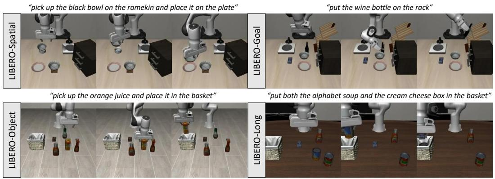

<details>
<summary>text_image</summary>

"pick up the black bowl on the ramekin and place it on the plate"
"put the wine bottle on the rack"
LIBERO-Spatial
LIBERO-Goal
"pick up the orange juice and place it in the basket"
"put both the alphabet soup and the cream cheese box in the basket"
LIBERO-Object
LIBERO-Long
</details>

Figure 3: Environments and Tasks. For simulation, we evaluate on a commonly-used robotic manipulation benchmark named LIBERO with four task suites that focus on different challenges.

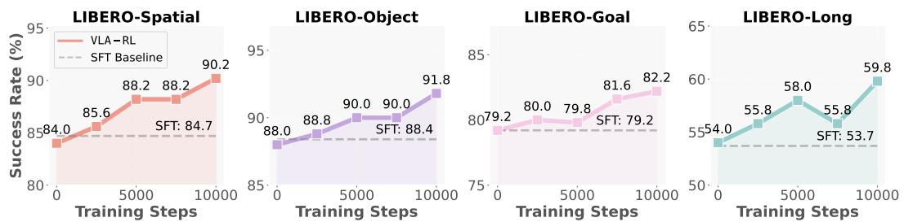

<details>
<summary>line</summary>

| Training Steps | VLA-RL Success Rate (%) | SFT Baseline Success Rate (%) |
|---|---|---|
| 0 | 84.0 | 84.7 |
| 2500 | 85.6 | 84.7 |
| 5000 | 88.2 | 84.7 |
| 7500 | 88.2 | 84.7 |
| 10000 | 90.2 | 84.7 |
| 0 | 88.0 | 88.4 |
| 2500 | 88.8 | 88.4 |
| 5000 | 90.0 | 88.4 |
| 7500 | 90.0 | 88.4 |
| 10000 | 91.8 | 88.4 |
| 0 | 79.2 | 79.2 |
| 2500 | 80.0 | 79.2 |
| 5000 | 79.8 | 79.2 |
| 7500 | 81.6 | 79.2 |
| 10000 | 82.2 | 79.2 |
| 0 | 54.0 | 53.7 |
| 2500 | 55.8 | 53.7 |
| 5000 | 58.0 | 53.7 |
| 7500 | 55.8 | 53.7 |
| 10000 | 59.8 | 53.7 |
</details>

Figure 4: Test-time Scaling Curve. We evaluate the fine-tuned OpenVLA-7B every 2500 training steps on the complete suite and report the average task success rates.

Performance Comparisons. We present the LIBERO experimental results in Tab. 1 after the RL training process. VLA-RL improves the OpenVLA-7B checkpoint with SFT and DPO by sizable margins of 4.5% and 1.8% respectively, which demonstrates the effectiveness of the online RL and the proposed VLA-RL framework. Notably, after only 48 GPU hours of RL training, the fine-tuned OpenVLA-7B matches the performance of an advanced commercial model $\pi _ { 0 } .$ -FAST trained with high-quality SFT data, while the increasing trends are still consistent. The results imply the unlimited potential of boosting high-capacity VLAs with large-scale RL.

Test-time Scaling. We report the test success rates along the RL training process of four LIBERO tasks in Fig. 4. The evaluation success rates on all four task suites are consistently improved with the test time optimization, indicating an early spark of inference scaling laws [64] in robotics.

# 4.2 Training Dynamics.

Reinforcement learning on large models requires careful monitoring of key metrics to identify discrepancies and refine the system [82]. Following the common practice [82, 42], we report and analyze the learning dynamics to share some key findings regarding training VLAs with RL. The results are shown in Fig. 5.

Length of Generated Episodes We observe that successful VLA-RL training leads to gradually decreasing episode lengths, indicating the model learns more efficient action sequences for manipulation tasks. This contrasts with LLM-based RL where longer sequences often correlate with improved reasoning capability.

Dynamics of Reward During Training. Reward trends show consistent improvement across training, with periodic plateaus corresponding to curriculum transitions between task difficulties. The reward improvements correlate strongly with physical task success rates, suggesting our robotic process reward model effectively captures meaningful progress in manipulation capabilities.

Table 1: LIBERO simulation benchmark results. We present average success rates and ranks based on 500 evaluation episodes for each method across LIBERO’s four task suites. Methods are ranked 1 „ 5 within each suite, with 1 indicating best performance and 5 indicating worst. We also add an advanced commercial auto-regressive model π0-FAST [57] for reference. 

<table><tr><td rowspan="2"></td><td colspan="2">LIBERO-Spatial</td><td colspan="2">LIBERO-Object</td><td colspan="2">LIBERO-Goal</td><td colspan="2">LIBERO-Long</td><td colspan="2">Average</td></tr><tr><td>SR (↑)</td><td>Rank (↓)</td><td>SR (↑)</td><td>Rank (↓)</td><td>SR (↑)</td><td>Rank (↓)</td><td>SR (↑)</td><td>Rank (↓)</td><td>SR (↑)</td><td>Rank (↓)</td></tr><tr><td>Diffusion Policy [12]</td><td>78.3%</td><td>5</td><td>92.5%</td><td>1</td><td>68.3%</td><td>5</td><td>50.5%</td><td>5</td><td>72.4%</td><td>4.0</td></tr><tr><td>Octo (SFT) [68]</td><td>78.9%</td><td>4</td><td>85.7%</td><td>5</td><td>84.6%</td><td>1</td><td>51.1%</td><td>4</td><td>75.1%</td><td>3.5</td></tr><tr><td>OpenVLA (SFT) [39]</td><td>84.7%</td><td>3</td><td>88.4%</td><td>4</td><td>79.2%</td><td>4</td><td>53.7%</td><td>3</td><td>76.5%</td><td>3.5</td></tr><tr><td>GRAPE (DPO) [89]</td><td>87.6%</td><td>2</td><td>91.2%</td><td>3</td><td>82.2%</td><td>2</td><td>55.8%</td><td>2</td><td>79.2%</td><td>2.3</td></tr><tr><td> $\pi_0$ -FAST [57]</td><td>96.4%</td><td>-</td><td>96.8%</td><td>-</td><td>88.6%</td><td>-</td><td>60.2%</td><td>-</td><td>85.5%</td><td>-</td></tr><tr><td>VLA-RL (Ours)</td><td>90.2%</td><td>1</td><td>91.8%</td><td>2</td><td>82.2%</td><td>2</td><td>59.8%</td><td>1</td><td>81.0%</td><td>1.5</td></tr></table>

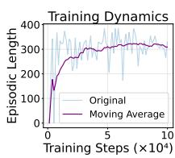

<details>
<summary>line</summary>

| Training Steps (×10⁴) | Original | Moving Average |
| ---------------------- | -------- | -------------- |
| 0                      | 0        | 0              |
| 5                      | 300      | 300            |
| 10                     | 300      | 300            |
</details>

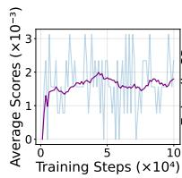

<details>
<summary>line</summary>

| Training Steps (×10⁴) | Average Scores (×10⁻³) |
| --------------------- | ---------------------- |
| 0                     | 0                      |
| 1                     | 1.5                    |
| 2                     | 1.8                    |
| 3                     | 2.0                    |
| 4                     | 2.2                    |
| 5                     | 2.1                    |
| 6                     | 2.0                    |
| 7                     | 1.9                    |
| 8                     | 1.8                    |
| 9                     | 1.7                    |
| 10                    | 1.6                    |
</details>

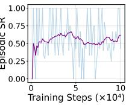

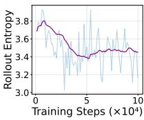

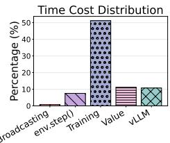

<details>
<summary>bar</summary>

| Category     | Percentage (%) |
| ------------ | -------------- |
| broadcasting  | 0              |
| env.step()   | 7              |
| Training     | 50             |
| Value        | 10             |
| vLLM         | 10             |
</details>

Figure 5: Training Dynamics. We draw the length of generated episodes, reward dynamics and rollout entropy along the training process on LIBERO-Long.

Rollout Entropy of the Policy. Appropriate action entropy is crucial: too low restricts exploration, while too high results in unstable improvements. Our implementation maintains moderate entropy levels that gradually decrease as training progresses while allowing initial exploration.

Timing Analysis. The time cost distribution for various components of our system is illustrated in the right subfigure of Fig. 5. With the implementation of GPU-balanced vectorized environments and vLLM acceleration, the time spent on environmental evolution and model rollout has been significantly reduced. As a result, the primary focus now shifts to the training phase, which indicates that further improvements in training efficiency could lead to substantial gains in overall performance.

# 4.3 Ablation Study

We further conduct additional ablation experiments on LIBERO-Spatial task suite to more thoroughly validate the proposed design choices in VLA-RL, encompassing both the technical aspects and implementation details. The results of these comparative studies are presented in Tab. 2.

Table 2: Ablation Study. We show the final average success rates on LIBERO-Spatial. Eliminating any individual stabilizing technique from VLA-RL leads to rapid collapse, highlighting the critical importance of each technique introduced in VLA-RL. 

<table><tr><td>Hyperparameter</td><td>LIBERO-Spatial</td></tr><tr><td>VLA-RL</td><td>90.2</td></tr><tr><td>Remove Robotics PRM</td><td>85.8</td></tr><tr><td>Remove Curriculum</td><td>88.0</td></tr><tr><td>Temperature = 1.5 → 1.0</td><td>85.8</td></tr><tr><td>Critic Warmup Steps = 5 → 0</td><td>80.0</td></tr><tr><td>LR = 2e-5 → 2e-4</td><td>0.2</td></tr></table>

Choice of Reward Densification. The proposed robotic process reward model enhances the success rate from 85.8% to 90.2% compared to the sparse reward baseline, which demonstrates the significance of reward densification. robotic process reward model provides more frequent and informative signals that guide the agent toward successful task completion, especially in long-horizon tasks where sparse rewards can lead to inefficient exploration.

Choice of Curriculum Selection Strategy. Curriculumbased task selection outperforms uniform random selection, improving success rate from 88.0% to 90.2%. By gradually increasing task complexity based on agent

performance, the policy learns more effectively on simpler tasks before tackling difficult ones. This reduces catastrophic forgetting and enables better generalization across the task distribution.

Choice of Sampling Temperature. Lower temperatures hamper exploration, causing convergence to suboptimal policies. To verify this, lowering temperature from 1.5 to 1.0 decreases success rate from 90.2% to 85.8%, indicating reduced randomness harms policy evaluation and optimization.

Choice of Critic Warmup. Warming up the value model before policy updates improves SR from 80.0% to 90.2%. This pre-training provides more accurate feedback for policy gradients, whereas without warmup, initially noisy value estimates negatively impact policy learning.

Choice of Learning Rate. A low learning rate $( 2 e ^ { - 5 } )$ reaches impressive performance. Higher rates $( 2 e ^ { - 4 } )$ cause instability, aligning with the observations in [28]. However, low learning rates also slow down convergence, which indicates the importance of implementation details in RL systems.

The ablation study highlights the importance of each component in VLA-RL, with the full method achieving the highest performance at 90.2% success rate. Removing any single component leads to a noticeable performance drop, demonstrating that all proposed techniques contribute synergistically to the overall effectiveness of our approach.

# 4.4 RL vs. SFT

Action Coverage Analysis. We visualize the projected XY plane of the collected actions in Fig. 6. In LIBERO-Spatial, the robot arm is required to navigate to precisely reach a designated contact point. Analysis of the action distributions reveals a distinct contrast between offline and online data collection. Expert actions tend to cluster near the center of the action space, reflecting a preference for positions and often exhibiting repeated motion patterns. In contrast, actions generated by RL agents are distributed more uniformly across the entire action space, which enables RL policies to adapt to a wider variety of states. As a result, the policy trained

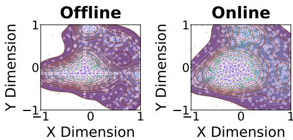

<details>
<summary>contour</summary>

| Category | X Dimension | Y Dimension |
| -------- | ----------- | ----------- |
| Offline  | -1 to 1     | -1 to 1     |
| Online   | -1 to 1     | -1 to 1     |
</details>

Figure 6: Action Coverages of SFT and RL methods. We visualize the first two dimensions of the collected actions (relative end-effector poses) on LIBERO-Spatial.

on RL-collected data exhibits stronger robustness than the SFT model trained on offline data.

Case Study. To explore the scenarios where reinforcement learning showcases especial effectiveness, we analyze the rollout trajectories of both RL and SFT models in LIBERO-Goal. As shown in Fig. 7, the agent is instructed to "pick up the black bowl on the wooden cabinet and place it on the plate", which requires fine-grained interaction. The model fine-tuned with VLA-RL grasps the bottle successfully, while the SFT baseline fails by trying to grasp at a deviated point. We conclude that policies trained with RL-collected data consistently help with alignment issues in contact-rich tasks and reduce premature gripper closure during grasping, aligning with the observations in [78].

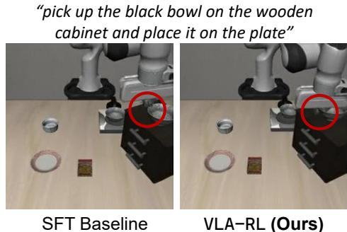

<details>
<summary>text_image</summary>

"pick up the black bowl on the wooden cabinet and place it on the plate"
SFT Baseline
VLA-RL (Ours)
</details>

Figure 7: Case Study. We show the robot trajectories generated by the starting SFT baseline and VLA-RL.

# 5 Conclusions and Limitations

Conclusions. We present VLA-RL, a scalable reinforcement learning framework that enhances pretrained VLAs through online policy optimization. By formulating general robotic manipulation as multi-modal multi-turn conversations, our approach enables VLA models to explore beyond the limitations of offline demonstration data. Our unified robotic process reward model using fine-tuned vision-language models effectively addresses sparse reward challenges in complex tasks. Through several systematic design choices, we achieve substantial performance gains, surpassing a strong imitation learning baseline OpenVLA-7B by 4.5% on LIBERO benchmarks. Importantly, our observation that performance scales with test-time optimization suggests an emerging principle analogous to inference scaling laws in language models.

Limitations. While promising, our approach faces several challenges. For instance, the proposed heuristics for extracting pseudo reward labels may not fully capture the nuances of more dexterous manipulation tasks, potentially leading to inefficient policy optimization. Future work includes training diffusion-based policies [7, 68] with reinforcement learning beyond auto-regressive VLAs, and exploring online self-improvement with large-scale real-world experience.

# References

[1] Agarwal, R., Schwarzer, M., Castro, P.S., Courville, A.C., Bellemare, M.: Reincarnating reinforcement learning: Reusing prior computation to accelerate progress. Proceedings of Advances in Neural Information Processing Systems (NeurIPS) 35, 28955–28971 (2022) 2, 3   
[2] Akkaya, I., Andrychowicz, M., Chociej, M., Litwin, M., McGrew, B., Petron, A., Paino, A., Plappert, M., Powell, G., Ribas, R., et al.: Solving rubik’s cube with a robot hand. arXiv preprint arXiv:1910.07113 (2019) 2   
[3] Bai, S., Li, M., Liu, Y., Tang, J., Zhang, H., Sun, L., Chu, X., Tang, Y.: Univg-r1: Reasoning guided universal visual grounding with reinforcement learning. arXiv preprint arXiv:2505.14231 (2025) 3   
[4] Baker, B., Akkaya, I., Zhokov, P., Huizinga, J., Tang, J., Ecoffet, A., Houghton, B., Sampedro, R., Clune, J.: Video pretraining (vpt): Learning to act by watching unlabeled online videos. Proceedings of Advances in Neural Information Processing Systems (NeurIPS) 35, 24639– 24654 (2022) 2   
[5] Ball, P.J., Smith, L., Kostrikov, I., Levine, S.: Efficient online reinforcement learning with offline data. In: Proceedings of International Conference on Machine Learning (ICML). pp. 1577–1594. PMLR (2023) 2   
[6] Bharadhwaj, H., Vakil, J., Sharma, M., Gupta, A., Tulsiani, S., Kumar, V.: Roboagent: Generalization and efficiency in robot manipulation via semantic augmentations and action chunking. arXiv preprint arXiv:2309.01918 (2023) 1, 2   
[7] Black, K., Brown, N., Driess, D., Esmail, A., Equi, M., Finn, C., Fusai, N., Groom, L., Hausman, K., Ichter, B., et al.: zpi\_0: A vision-language-action flow model for general robot control. arXiv preprint arXiv:2410.24164 (2024) 1, 2, 9   
[8] Brohan, A., Brown, N., Carbajal, J., Chebotar, Y., Chen, X., Choromanski, K., Ding, T., Driess, D., Dubey, A., Finn, C., et al.: Rt-2: Vision-language-action models transfer web knowledge to robotic control. arXiv preprint arXiv:2307.15818 (2023) 1, 2   
[9] Brohan, A., Brown, N., Carbajal, J., Chebotar, Y., Dabis, J., Finn, C., Gopalakrishnan, K., Hausman, K., Herzog, A., Hsu, J., et al.: Rt-1: Robotics transformer for real-world control at scale. arXiv preprint arXiv:2212.06817 (2022) 1, 2   
[10] Cabi, S., Colmenarejo, S.G., Novikov, A., Konyushkova, K., Reed, S., Jeong, R., Zolna, K., Aytar, Y., Budden, D., Vecerik, M., Sushkov, O., Barker, D., Scholz, J., Denil, M., de Freitas, N., Wang, Z.: Scaling data-driven robotics with reward sketching and batch reinforcement learning. Robotics: Science and Systems (RSS) (2019) 1   
[11] Chen, L., Lu, K., Rajeswaran, A., Lee, K., Grover, A., Laskin, M., Abbeel, P., Srinivas, A., Mordatch, I.: Decision transformer: Reinforcement learning via sequence modeling. arXiv preprint arXiv:2106.01345 (2021) 3   
[12] Chi, C., Feng, S., Du, Y., Xu, Z., Cousineau, E., Burchfiel, B., Song, S.: Diffusion policy: Visuomotor policy learning via action diffusion. In: Robotics: Science and Systems (RSS) (2023) 6, 8   
[13] Christiano, P., Leike, J., Brown, T.B., Martic, M., Legg, S., Amodei, D.: Deep reinforcement learning from human preferences (2023), https://arxiv.org/abs/1706.03741 1   
[14] Chu, Y., Xu, J., Zhou, X., Yang, Q., Zhang, S., Yan, Z., Zhou, C., Zhou, J.: Qwen-audio: Advancing universal audio understanding via unified large-scale audio-language models. arXiv preprint arXiv:2311.07919 (2023) 1   
[15] Collaboration, O.X.E.: Open X-Embodiment: Robotic learning datasets and RT-X models. https://arxiv.org/abs/2310.08864 (2023) 1, 2   
[16] Dasari, S., Ebert, F., Tian, S., Nair, S., Bucher, B., Schmeckpeper, K., Singh, S., Levine, S., Finn, C.: Robonet: Large-scale multi-robot learning. Conference on Robot Learning (CoRL) (2019) 1, 2

[17] DeepSeek-AI, et al.: Deepseek-r1: Incentivizing reasoning capability in llms via reinforcement learning (2025), https://arxiv.org/abs/2501.12948 1, 2, 3   
[18] Ebert, F., Yang, Y., Schmeckpeper, K., Bucher, B., Georgakis, G., Daniilidis, K., Finn, C., Levine, S.: Bridge data: Boosting generalization of robotic skills with cross-domain datasets. arXiv preprint arXiv:2109.13396 (2021) 1, 2   
[19] Ehsani, K., Gupta, T., Hendrix, R., Salvador, J., Weihs, L., Zeng, K.H., Singh, K.P., Kim, Y., Han, W., Herrasti, A., et al.: Imitating shortest paths in simulation enables effective navigation and manipulation in the real world. arXiv preprint arXiv:2312.02976 (2023) 1, 2   
[20] Fang, H.S., Fang, H., Tang, Z., Liu, J., Wang, C., Wang, J., Zhu, H., Lu, C.: Rh20t: A comprehensive robotic dataset for learning diverse skills in one-shot. Towards Generalist Robots: Learning Paradigms for Scalable Skill Acquisition@ CoRL2023 3, 5 (2023) 1, 2   
[21] Gulcehre, C., Paine, T.L., Srinivasan, S., Konyushkova, K., Weerts, L., Sharma, A., Siddhant, A., Ahern, A., Wang, M., Gu, C., et al.: Reinforced self-training (rest) for language modeling. arXiv preprint arXiv:2308.08998 (2023) 3   
[22] Guo, Y., Zhang, J., Chen, X., Ji, X., Wang, Y.J., Hu, Y., Chen, J.: Improving vision-languageaction model with online reinforcement learning. arXiv preprint arXiv:2501.16664 (2025) 2   
[23] Gupta, A., Murali, A., Gandhi, D.P., Pinto, L.: Robot learning in homes: Improving generalization and reducing dataset bias. Proceedings of Advances in Neural Information Processing Systems (NeurIPS) 31 (2018) 1   
[24] Gupta, A., Kumar, V., Lynch, C., Levine, S., Hausman, K.: Relay policy learning: Solving long-horizon tasks via imitation and reinforcement learning. Conference on Robot Learning (CoRL) (2019) 2, 3   
[25] Hester, T., Vecerik, M., Pietquin, O., Lanctot, M., Schaul, T., Piot, B., Horgan, D., Quan, J., Sendonaris, A., Osband, I., et al.: Deep q-learning from demonstrations. In: Proceedings of AAAI Conference on Artificial Intelligence (AAAI) (2018) 2   
[26] Hu, E.J., Shen, Y., Wallis, P., Allen-Zhu, Z., Li, Y., Wang, S., Wang, L., Chen, W., et al.: Lora: Low-rank adaptation of large language models. Proceedings of International Conference on Learning Representations (ICLR) 1(2), 3 (2022) 5   
[27] Hu, H., Mirchandani, S., Sadigh, D.: Imitation bootstrapped reinforcement learning. arXiv preprint arXiv:2311.02198 (2023) 2   
[28] Hu, J., Hendrix, R., Farhadi, A., Kembhavi, A., Martin-Martin, R., Stone, P., Zeng, K.H., Ehsan, K.: Flare: Achieving masterful and adaptive robot policies with large-scale reinforcement learning fine-tuning. arXiv preprint arXiv:2409.16578 (2024) 2, 9   
[29] Hu, J., Stone, P., Martín-Martín, R.: Causal policy gradient for whole-body mobile manipulation. arXiv preprint arXiv:2305.04866 (2023) 2   
[30] Hu, J., Wu, X., Zhu, Z., Wang, W., Zhang, D., Cao, Y., et al.: Openrlhf: An easy-to-use, scalable and high-performance rlhf framework. arXiv preprint arXiv:2405.11143 (2024) 6   
[31] Hu, J., Zhang, Y., Han, Q., Jiang, D., Zhang, X., Shum, H.Y.: Open-reasoner-zero: An open source approach to scaling up reinforcement learning on the base model (2025), https: //arxiv.org/abs/2503.24290 2, 3   
[32] Intelligence, P., Black, K., Brown, N., Darpinian, J., Dhabalia, K., Driess, D., Esmail, A., Equi, M., Finn, C., Fusai, N., et al.: zpi\_t0.5u: a vision-language-action model with open-world generalization. arXiv preprint arXiv:2504.16054 (2025) 1, 2   
[33] Jang, E., Irpan, A., Khansari, M., Kappler, D., Ebert, F., Lynch, C., Levine, S., Finn, C.: Bc-z: Zero-shot task generalization with robotic imitation learning. In: Conference on Robot Learning (CoRL). pp. 991–1002. PMLR (2022) 1

[34] Julian, R., Swanson, B., Sukhatme, G.S., Levine, S., Finn, C., Hausman, K.: Never stop learning: The effectiveness of fine-tuning in robotic reinforcement learning. arXiv preprint arXiv:2004.10190 (2020) 2   
[35] Kalashnikov, D., Irpan, A., Pastor, P., Ibarz, J., Herzog, A., Jang, E., Quillen, D., Holly, E., Kalakrishnan, M., Vanhoucke, V., et al.: QT-Opt: Scalable deep reinforcement learning for vision-based robotic manipulation. arXiv preprint arXiv:1806.10293 (2018) 1, 2   
[36] Kalashnkov, D., Varley, J., Chebotar, Y., Swanson, B., Jonschkowski, R., Finn, C., Levine, S., Hausman, K.: Mt-opt: Continuous multi-task robotic reinforcement learning at scale. arXiv (2021) 1, 2   
[37] Khazatsky, A., Pertsch, K., Nair, S., Balakrishna, A., Dasari, S., Karamcheti, S., Nasiriany, S., Srirama, M.K., Chen, L.Y., Ellis, K., et al.: Droid: A large-scale in-the-wild robot manipulation dataset. arXiv preprint arXiv:2403.12945 (2024) 1, 2   
[38] Khetarpal, K., Riemer, M., Rish, I., Precup, D.: Towards continual reinforcement learning: A review and perspectives. Journal of Artificial Intelligence Research 75, 1401–1476 (2022) 2   
[39] Kim, M.J., Pertsch, K., Karamcheti, S., Xiao, T., Balakrishna, A., Nair, S., Rafailov, R., Foster, E., Lam, G., Sanketi, P., et al.: Openvla: An open-source vision-language-action model. arXiv preprint arXiv:2406.09246 (2024) 1, 2, 3, 6, 7, 8   
[40] Kober, J., Mohler, B., Peters, J.: Imitation and reinforcement learning for motor primitives with perceptual coupling. In: From motor learning to interaction learning in robots, pp. 209–225. Springer (2010) 2, 3   
[41] Kwon, W., Li, Z., Zhuang, S., Sheng, Y., Zheng, L., Yu, C.H., Gonzalez, J., Zhang, H., Stoica, I.: Efficient memory management for large language model serving with pagedattention. In: Proceedings of the 29th Symposium on Operating Systems Principles. pp. 611–626 (2023) 6   
[42] Lambert, N., Morrison, J., Pyatkin, V., Huang, S., Ivison, H., Brahman, F., Miranda, L.J.V., Liu, A., Dziri, N., Lyu, S., et al.: Tz" ulu 3: Pushing frontiers in open language model post-training. arXiv preprint arXiv:2411.15124 (2024) 6, 7   
[43] Lightman, H., Kosaraju, V., Burda, Y., Edwards, H., Baker, B., Lee, T., Leike, J., Schulman, J., Sutskever, I., Cobbe, K.: Let’s verify step by step. arXiv preprint arXiv:2305.20050 (2023) 3   
[44] Lin, F., Hu, Y., Sheng, P., Wen, C., You, J., Gao, Y.: Data scaling laws in imitation learning for robotic manipulation (2024), https://arxiv.org/abs/2410.18647 1, 2   
[45] Liu, B., Zhu, Y., Gao, C., Feng, Y., Liu, Q., Zhu, Y., Stone, P.: Libero: Benchmarking knowledge transfer for lifelong robot learning. Proceedings of Advances in Neural Information Processing Systems (NeurIPS) 36 (2024) 2, 6   
[46] Liu, J., Dai, W., Wang, C., Cheng, Y., Tang, Y., Tong, X.: Plan, posture and go: Towards openvocabulary text-to-motion generation. In: Proceedings of European Conference on Computer Vision (ECCV). pp. 445–463. Springer (2024) 2   
[47] Liu, Z., Chen, C., Li, W., Qi, P., Tianyu Pang, C.D., Lee, W.S., Lin, M.: Understanding r1-zerolike training: A critical perspective (2025), https://arxiv.org/abs/2503.20783 2, 3   
[48] Lu, G., Wang, Z., Liu, C., Lu, J., Tang, Y.: Thinkbot: Embodied instruction following with thought chain reasoning. arXiv preprint arXiv:2312.07062 (2023) 2   
[49] Lu, Y., Hausman, K., Chebotar, Y., Yan, M., Jang, E., Herzog, A., Xiao, T., Irpan, A., Khansari, M., Kalashnikov, D., et al.: Aw-opt: Learning robotic skills with imitation and reinforcement at scale. arXiv preprint arXiv:2111.05424 (2021) 2   
[50] Luo, J., Hu, Z., Xu, C., Tan, Y.L., Berg, J., Sharma, A., Schaal, S., Finn, C., Gupta, A., Levine, S.: Serl: A software suite for sample-efficient robotic reinforcement learning. In: IEEE International Conference on Robotics and Automation (ICRA). pp. 16961–16969. IEEE (2024) 2, 3

[51] Luo, J., Xu, C., Wu, J., Levine, S.: Precise and dexterous robotic manipulation via human-inthe-loop reinforcement learning. arXiv preprint arXiv:2410.21845 (2024) 2, 3   
[52] Mandlekar, A., Zhu, Y., Garg, A., Booher, J., Spero, M., Tung, A., Gao, J., Emmons, J., Gupta, A., Orbay, E., et al.: Roboturk: A crowdsourcing platform for robotic skill learning through imitation. In: Conference on Robot Learning (CoRL). pp. 879–893. PMLR (2018) 1   
[53] Moritz, P., Nishihara, R., Wang, S., Tumanov, A., Liaw, R., Liang, E., Elibol, M., Yang, Z., Paul, W., Jordan, M.I., et al.: Ray: A distributed framework for emerging tAIu applications. In: 13th USENIX symposium on operating systems design and implementation (OSDI 18). pp. 561–577 (2018) 6   
[54] Nair, A., Gupta, A., Dalal, M., Levine, S.: Awac: Accelerating online reinforcement learning with offline datasets. arXiv preprint arXiv:2006.09359 (2020) 2, 3   
[55] Oquab, M., Darcet, T., Moutakanni, T., Vo, H., Szafraniec, M., Khalidov, V., Fernandez, P., Haziza, D., Massa, F., El-Nouby, A., et al.: Dinov2: Learning robust visual features without supervision. arXiv preprint arXiv:2304.07193 (2023) 4   
[56] Ouyang, L., Wu, J., Jiang, X., Almeida, D., Wainwright, C.L., Mishkin, P., Zhang, C., Agarwal, S., Slama, K., Ray, A., Schulman, J., Hilton, J., Kelton, F., Miller, L., Simens, M., Askell, A., Welinder, P., Christiano, P., Leike, J., Lowe, R.: Training language models to follow instructions with human feedback (2022), https://arxiv.org/abs/2203.02155 1, 3   
[57] Pertsch, K., Stachowicz, K., Ichter, B., Driess, D., Nair, S., Vuong, Q., Mees, O., Finn, C., Levine, S.: Fast: Efficient action tokenization for vision-language-action models. arXiv preprint arXiv:2501.09747 (2025) 1, 2, 8   
[58] Pinto, L., Gupta, A.: Supersizing self-supervision: Learning to grasp from 50k tries and 700 robot hours. In: IEEE International Conference on Robotics and Automation (ICRA). pp. 3406–3413. IEEE (2016) 1   
[59] Rafailov, R., Sharma, A., Mitchell, E., Manning, C.D., Ermon, S., Finn, C.: Direct preference optimization: Your language model is secretly a reward model. Proceedings of Advances in Neural Information Processing Systems (NeurIPS) (2023) 7   
[60] Rajeswaran, A., Kumar, V., Gupta, A., Vezzani, G., Schulman, J., Todorov, E., Levine, S.: Learning complex dexterous manipulation with deep reinforcement learning and demonstrations. arXiv preprint arXiv:1709.10087 (2017) 2, 3   
[61] Schulman, J., Moritz, P., Levine, S., Jordan, M., Abbeel, P.: High-dimensional continuous control using generalized advantage estimation. arXiv preprint arXiv:1506.02438 (2015) 5   
[62] Schulman, J., Wolski, F., Dhariwal, P., Radford, A., Klimov, O.: Proximal policy optimization algorithms. arXiv preprint arXiv:1707.06347 (2017) 3, 5   
[63] Silver, D., Sutton, R.S.: Welcome to the era of experience. Google AI (2025) 1   
[64] Snell, C., Lee, J., Xu, K., Kumar, A.: Scaling llm test-time compute optimally can be more effective than scaling model parameters. arXiv preprint arXiv:2408.03314 (2024) 2, 7   
[65] Taiga, A.A., Agarwal, R., Farebrother, J., Courville, A., Bellemare, M.G.: Investigating multitask pretraining and generalization in reinforcement learning. In: Proceedings of International Conference on Learning Representations (ICLR) (2023) 2   
[66] Tang, C., Abbatematteo, B., Hu, J., Chandra, R., Martín-Martín, R., Stone, P.: Deep reinforcement learning for robotics: A survey of real-world successes. arXiv preprint arXiv:2408.03539 (2024) 2   
[67] Taylor, M.E., Stone, P.: Transfer learning for reinforcement learning domains: A survey. Journal of Machine Learning Research (JMLR) 10(7) (2009) 2   
[68] Team, O.M., Ghosh, D., Walke, H., Pertsch, K., Black, K., Mees, O., Dasari, S., Hejna, J., Kreiman, T., Xu, C., et al.: Octo: An open-source generalist robot policy. arXiv preprint arXiv:2405.12213 (2024) 1, 2, 7, 8, 9

[69] Touvron, H., Martin, L., Stone, K., Albert, P., Almahairi, A., Babaei, Y., Bashlykov, N., Batra, S., Bhargava, P., Bhosale, S., et al.: Llama 2: Open foundation and fine-tuned chat models. arXiv preprint arXiv:2307.09288 (2023) 3   
[70] Uchendu, I., Xiao, T., Lu, Y., Zhu, B., Yan, M., Simon, J., Bennice, M., Fu, C., Ma, C., Jiao, J., et al.: Jump-start reinforcement learning. In: Proceedings of International Conference on Machine Learning (ICML). pp. 34556–34583. PMLR (2023) 2, 3   
[71] Vecerik, M., Hester, T., Scholz, J., Wang, F., Pietquin, O., Piot, B., Heess, N., Rothörl, T., Lampe, T., Riedmiller, M.: Leveraging demonstrations for deep reinforcement learning on robotics problems with sparse rewards. arXiv preprint arXiv:1707.08817 (2017) 2   
[72] Walke, H., Black, K., Lee, A., Kim, M.J., Du, M., Zheng, C., Zhao, T., Hansen-Estruch, P., Vuong, Q., He, A., Myers, V., Fang, K., Finn, C., Levine, S.: Bridgedata v2: A dataset for robot learning at scale (2023) 1, 2   
[73] Wang, Y., Zhang, H., Tang, Y., Liu, Y., Feng, J., Dai, J., Jin, X.: Hierarchical memory for long video qa. arXiv preprint arXiv:2407.00603 (2024) 1   
[74] Wang, Y., Zhang, H., Tian, J., Tang, Y.: Ponder & press: Advancing visual gui agent towards general computer control. arXiv preprint arXiv:2412.01268 (2024) 1   
[75] Wang, Z., Wang, K., Wang, Q., Zhang, P., Li, L., Yang, Z., Yu, K., Nguyen, M.N., Liu, L., Gottlieb, E., et al.: Ragen: Understanding self-evolution in llm agents via multi-turn reinforcement learning. arXiv preprint arXiv:2504.20073 (2025) 3   
[76] Wołczyk, M., Cupiał, B., Ostaszewski, M., Bortkiewicz, M., Zaj ˛ac, M., Pascanu, R., Łukasz Kucinski, Miło ´ s, P.: Fine-tuning reinforcement learning models is secretly a forgetting mitigation ´ problem (2024), https://arxiv.org/abs/2402.02868 2   
[77] Xing, J., Romero, A., Bauersfeld, L., Scaramuzza, D.: Bootstrapping reinforcement learning with imitation for vision-based agile flight. arXiv preprint arXiv:2403.12203 (2024) 2   
[78] Xu, C., Li, Q., Luo, J., Levine, S.: Rldg: Robotic generalist policy distillation via reinforcement learning. arXiv preprint arXiv:2412.09858 (2024) 9   
[79] Yang, A., Yang, B., Zhang, B., Hui, B., Zheng, B., Yu, B., Li, C., Liu, D., Huang, F., Wei, H., et al.: Qwen2. 5 technical report. arXiv preprint arXiv:2412.15115 (2024) 1   
[80] Ye, X., Gan, Y., Ge, Y., Zhang, X.P., Tang, Y.: Atp-llava: Adaptive token pruning for large vision language models. arXiv preprint arXiv:2412.00447 (2024) 1   
[81] Ye, X., Gan, Y., Huang, X., Ge, Y., Tang, Y.: Voco-llama: Towards vision compression with large language models. arXiv preprint arXiv:2406.12275 (2024) 1   
[82] Yu, Q., Zhang, Z., Zhu, R., Yuan, Y., Zuo, X., Yue, Y., Fan, T., Liu, G., Liu, L., Liu, X., Lin, H., Lin, Z., Ma, B., Sheng, G., Tong, Y., Zhang, C., Zhang, M., Zhang, W., Zhu, H., Zhu, J., Chen, J., Chen, J., Wang, C., Yu, H., Dai, W., Song, Y., Wei, X., Zhou, H., Liu, J., Ma, W.Y., Zhang, Y.Q., Yan, L., Qiao, M., Wu, Y., Wang, M.: Dapo: An open-source llm reinforcement learning system at scale (2025), https://arxiv.org/abs/2503.14476 2, 3, 7   
[83] Yuan, Z., Yuan, H., Li, C., Dong, G., Lu, K., Tan, C., Zhou, C., Zhou, J.: Scaling relationship on learning mathematical reasoning with large language models. arXiv preprint arXiv:2308.01825 (2023) 3   
[84] Zelikman, E., Wu, Y., Mu, J., Goodman, N.: Star: Bootstrapping reasoning with reasoning. Proceedings of Advances in Neural Information Processing Systems (NeurIPS) 35, 15476– 15488 (2022) 3   
[85] Zeng, K.H., Zhang, Z., Ehsani, K., Hendrix, R., Salvador, J., Herrasti, A., Girshick, R., Kembhavi, A., Weihs, L.: Poliformer: Scaling on-policy rl with transformers results in masterful navigators. arXiv preprint arXiv:2406.20083 (2024) 2

[86] Zhai, X., Mustafa, B., Kolesnikov, A., Beyer, L.: Sigmoid loss for language image pre-training. In: Proceedings of International Conference on Computer Vision (ICCV). pp. 11975–11986 (2023) 4   
[87] Zhang, H., Wang, Y., Tang, Y., Liu, Y., Feng, J., Dai, J., Jin, X.: Flash-vstream: Memory-based real-time understanding for long video streams. arXiv preprint arXiv:2406.08085 (2024) 1   
[88] Zhang, Z., Zheng, C., Wu, Y., Zhang, B., Lin, R., Yu, B., Liu, D., Zhou, J., Lin, J.: The lessons of developing process reward models in mathematical reasoning (2025), https: //arxiv.org/abs/2501.07301 3   
[89] Zhang, Z., Zheng, K., Chen, Z., Jang, J., Li, Y., Han, S., Wang, C., Ding, M., Fox, D., Yao, H.: Grape: Generalizing robot policy via preference alignment. arXiv preprint arXiv:2411.19309 (2024) 2, 7, 8   
[90] Zhao, Y., Gu, A., Varma, R., Luo, L., Huang, C.C., Xu, M., Wright, L., Shojanazeri, H., Ott, M., Shleifer, S., et al.: Pytorch fsdp: experiences on scaling fully sharded data parallel. arXiv preprint arXiv:2304.11277 (2023) 6   
[91] Zhu, H., Yu, J., Gupta, A., Shah, D., Hartikainen, K., Singh, A., Kumar, V., Levine, S.: The ingredients of real-world robotic reinforcement learning. arXiv preprint arXiv:2004.12570 (2020) 2   
[92] Zhu, Y., Wang, Z., Merel, J., Rusu, A., Erez, T., Cabi, S., Tunyasuvunakool, S., Kramár, J., Hadsell, R., de Freitas, N., Heess, N.: Reinforcement and imitation learning for diverse visuomotor skills. In: Robotics: Science and Systems (RSS) (2018) 2, 3   
[93] Zhu, Z., Lin, K., Jain, A.K., Zhou, J.: Transfer learning in deep reinforcement learning: A survey. Transactions on Pattern Analysis and Machine Intelligence (TPAMI) (2023) 2