# Flow Policy Gradients for Robot Control

Brent Yi12†∗ Hongsuk Choi12†∗ Himanshu Gaurav Singh12† Xiaoyu Huang12†

Takara E. Truong13† Carmelo Sferrazza1 Yi Ma24 Rocky Duan1‡

Pieter Abbeel12‡ Guanya Shi15‡ Karen Liu13‡ Angjoo Kanazawa12‡

1Amazon FAR 2UC Berkeley 3Stanford 4HKU 5CMU

\*Equal Contribution †Work done as an intern at Amazon FAR ‡Amazon FAR team co-lead

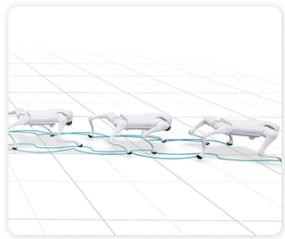

natural_image

Illustration of white horses pulling a blue line on a grid background (no text or symbols)

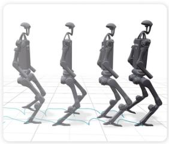

natural_image

Four identical 3D-rendered humanoid robots walking in a row on a tiled floor, no text or symbols visible

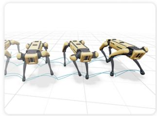

natural_image

3D illustration of four quadrupedoes on a grid surface, no text or symbols present

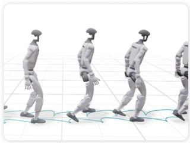

natural_image

Illustration of four human figures in motion on a tiled floor, no text or symbols present

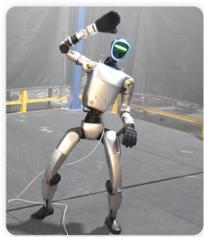

natural_image

3D-rendered humanoid robot in dynamic pose, wearing helmet and gloves, standing on a platform (no visible text or symbols)

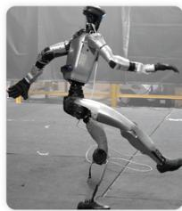

natural_image

Human figure in dynamic pose, possibly a robotic or humanoid robot, with no visible text or symbols

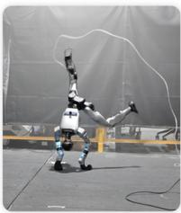

natural_image

Robot performing a dynamic pose with motion lines, no visible text or symbols

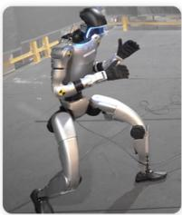

natural_image

3D rendered humanoid robot in motion on a paved surface, wearing a silver body and blue accents (no text or symbols visible)

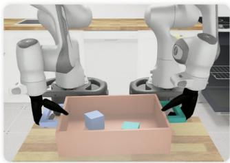

natural_image

Two robotic arms interacting with a pink box containing three colored blocks (no text or symbols visible)

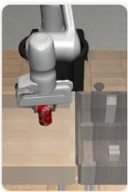

natural_image

3D rendering of a robotic arm with a red sensor suspended from a wooden surface (no text or symbols visible)

natural_image

Close-up of a robotic arm interacting with a wooden stand (no visible text or symbols)

Fig. 1: Flow policies for robot control. We show how robust control policies for quadrupeds, humanoids, and manipulators can be trained and deployed with the flow matching policy gradient framework [1].

Abstract—Likelihood-based policy gradient methods are the dominant approach for training robot control policies from rewards. These methods rely on differentiable action likelihoods, which constrain policy outputs to simple distributions like Gaussians. In this work, we show how flow matching policy gradients—a recent framework that bypasses likelihood computation—can be made effective for training and fine-tuning more expressive policies in challenging robot control settings. We introduce an improved objective that enables success in legged locomotion, humanoid motion tracking, and manipulation tasks, as well as robust sim-to-real transfer on two humanoid robots. We then present ablations and analysis on training dynamics. Results show how policies can exploit the flow representation for exploration when training from scratch, as well as improved fine-tuning robustness over baselines. Project webpage: hongsukchoi.github.io/fpo-control.

# I. INTRODUCTION

Likelihood-based policy gradient methods [2, 3] have driven a broad range of robot control results. This includes recent advances in legged locomotion [4], whole-body humanoid control [5, 6], and in-hand manipulation [7], where policies are trained from scratch, as well as for manipulation policies that are pretrained with demonstrations [8, 9].

Traditionally, policy gradient algorithms are run by sampling actions from stochastic policies, followed by a policy update that backpropagates through the differentiable likelihoods of sampled actions [2]. This is effective for simple action distributions, but problematic for more powerful policy representations: computing likelihoods in the flow policies used for imitation learning [10, 11], for example, requires expensive sampling or integration to account for volume changes in the underlying flow field [12, 13]. Reinforcement learning (RL) algorithms that support policy representations like flow-based policies promise more expressive distributions for exploration when training from scratch [1], as well as posttraining of more capable pretrained policies [8, 9].

In this work, we study robot control with flow matching policy gradients [1]: a framework for flow policy RL that uses conditional flow matching to circumvent likelihoods entirely. We find that existing flow policy gradient implementations— previously validated only in simpler synthetic settings—are unstable for more challenging robotics tasks. We show, however, that targeted algorithmic improvements make them practical for training robot control policies in a broad range of settings. Our contributions are as follows:

(1) We introduce an improved flow policy gradient algorithm that we call FPO++. FPO++ proposes two simple but effective changes, per-sample ratio clipping and an asymmetric trust region, that enable more robust training in challenging robotics settings.   
(2) We use tasks in legged locomotion, humanoid motion tracking, and both single-arm and bimanual manipulation to demonstrate settings where FPO++ succeeds: in learning policies from scratch, in sim-to-real transfer, and in fine-tuning

policies that are pretrained from demonstrations.

(3) We evaluate algorithmic choices: we ablate the effect of the proposed objective changes, as well as test-time sampling strategies used for evaluation metrics and sim-to-real transfer.   
(4) We analyze training dynamics, where we find desirable behavior: this includes improvements in quadruped locomotion gaits compared to Gaussian PPO baselines, even when the same rewards are used, as well as improved robustness to base policy choice when fine-tuning.

# II. BACKGROUND AND RELATED WORK

Policy gradients and PPO. Policy gradient techniques are the dominant approach for continuous control with RL [4, 7, 14–16]. These algorithms are on-policy; rollouts in the form of observation, action, and reward tuples $\left( o _ { t } , a _ { t } , r _ { t } \right)$ for each environment timestep t are used to update a policy $\pi _ { \boldsymbol { \theta } } { \left( a _ { t } \mid o _ { t } \right) }$ to maximize expected return. In the robotics community, the standard approach for achieving this is the clipped Proximal Policy Optimization (PPO) [3] objective. For an action with likelihood ratio $\rho _ { \theta }$ and advantage estimate [17] $\hat { A } _ { t }$ , this can be written as:

$$
\psi_ {\mathrm{PPO}} \left(\rho_ {\theta}, \hat {A} _ {t}\right) = \min \left(\rho_ {\theta} \hat {A} _ {t}, \operatorname{clip} \left(\rho_ {\theta}, 1 \pm \varepsilon^ {\text { clip }}\right) \hat {A} _ {t}\right). \tag {1}
$$

The overall optimization problem is then

$$
\max _ {\theta} \mathbb {E} _ {\pi_ {\theta_ {\text { old }}}} \left[ \psi_ {\mathrm{PPO}} \left(\rho_ {\theta}, \hat {A} _ {t}\right) \right]; \quad \rho_ {\theta} = \frac {\pi_ {\theta} (a _ {t} \mid o _ {t})}{\pi_ {\theta_ {\text { old }}} (a _ {t} \mid o _ {t})}. \tag {2}
$$

PPO is popular because it is simple to implement and provides strong empirical performance. It also inherits advantages of general policy gradient algorithms: unlike methods that rely on learned Q functions [18] or transition models [19], the PPO objective requires differentiability only from action likelihoods and not from rewards or environment dynamics.

Flow and diffusion policies. Flow and diffusion models [20, 21], which we consider equivalent in practice [22], are at the current frontier for supervised policy learning with continuous action spaces. Systems relying on these models typically train robot manipulation policies from human demonstrations [10, 23, 24], and have been validated with language conditioning at larger scales [11, 25]. Similar approaches have also been adopted in whole-body humanoid control, where iterative generative policies are supervised by Gaussian experts [5, 26]. All of these approaches need expert action labels. Instead, we study online RL where supervision is only provided in the form of environment rewards. This can be used to learn new behaviors or to fine-tune pretrained policies.

RL for flow and diffusion policies. Beyond imitation, recent works have also begun to integrate flow and diffusion policies into reinforcement learning settings. Many of these works study offline RL from static datasets (Appendix A). We instead consider online RL using policy gradient-style training. Existing work in this space is primarily focused on mechanisms for likelihood computation. Similar to image diffusion RL techniques that formulate denoising as an MDP [27, 28], DPPO [8] and ReinFlow [9] optimize likelihoods computed from stochastic sampling noises. NCDPO [29] optimizes likelihoods computed from both the initial noise and stochastic sampler noises, while backpropagating through unrolled denoising steps. GenPO [30] also unrolls denoising steps, while incorporating an invertible architecture inspired by normalizing flows [31]. In contrast, we study a flow policy gradient [1] approach that bypasses likelihoods entirely. It does not rely on noise likelihoods from specific stochastic sampling trajectories, which (i) inflate the credit assignment horizon and (ii) are not equivalent to action likelihoods marginalized over initial noises and sampling trajectories. It does not require specific network architectures or unrolling, which is expensive and risks vanishing or exploding gradients. We describe how this is achieved in the next section.

# III. IMPROVED FLOW POLICY OPTIMIZATION

We introduce FPO++, an updated version of the FPO (Flow Policy Optimization) algorithm that succeeds in real-world robotics tasks. We summarize FPO, then discuss FPO++.

# A. Preliminaries

Flow matching policy gradients. The goal of the FPO [1] algorithm is to enable policy gradient-style training of policies parameterized as flow models [20], without explicit likelihoods. Although action likelihoods under flow policies can be computed by accounting for changes in volume, the direct or indirect divergence integration required for this [12] is computationally prohibitive in RL settings.

FPO addresses this by proposing a surrogate for $\rho _ { \theta } .$ ,

$$
\hat {\rho} _ {\mathrm{FPO}} (\theta) = \exp \left(\hat {\mathcal {L}} _ {\mathrm{CFM}, \theta_ {\text { old }}} (a _ {t}; o _ {t}) - \hat {\mathcal {L}} _ {\mathrm{CFM}, \theta} (a _ {t}; o _ {t})\right), \tag {3}
$$

where $\hat { \mathcal { L } } _ { \mathrm { C F M } , \theta } ( a _ { t } ; o _ { t } )$ is a Monte Carlo estimate of the conditional flow matching (CFM) loss.

This formulation enables PPO-style training of flow-based policies, which can express more complex distributions than the diagonal Gaussians that are most common in online reinforcement learning for robotics [4, 6, 7]. FPO mirrors PPO’s clipped objective (Eq. 2), maximizing:

$$
\max _ {\theta} \mathbb {E} _ {\pi_ {\theta_ {\text { old }}}} \left[ \psi_ {\mathrm{PPO}} \left(\hat {\rho} _ {\mathrm{FPO}} (\theta), \hat {A} _ {t}\right) \right]. \tag {4}
$$

Intuitively, FPO’s ratio approximation uses CFM loss differences to approximate action log-likelihood differences. The final objective (Equation 4) then uses advantage estimates to shift probability flow toward higher-reward actions.

Conditional flow matching loss. To estimate CFM losses, FPO first draws $N _ { \mathrm { m c } }$ noise $\epsilon _ { i } ~ \sim ~ \mathcal { N } ( 0 , I )$ and flow step $\tau _ { i } \in [ 0 , 1 ]$ pairs for each action $a _ { t }$ and $i \in \{ 1 \ldots N _ { \mathrm { m c } } \}$ . Noised actions are then computed using an interpolation schedule. Linear interpolation is common in flow models:

$$
a _ {t} ^ {\tau_ {i}} = \tau_ {i} a _ {t} + (1 - \tau_ {i}) \epsilon_ {i}, \tag {5}
$$

which corresponds to the simple velocity field

$$
(\partial / \partial \tau_ {i}) a _ {t} ^ {\tau_ {i}} = a _ {t} - \epsilon_ {i}. \tag {6}
$$

Squared errors are computed and averaged for the policy’s velocity predictions $\hat { v } _ { \theta }$ ,

$$
\hat {\mathcal {L}} _ {\mathrm{CFM}, \theta} (a _ {t}; o _ {t}) = \frac {1}{N _ {\mathrm{mc}}} \sum_ {i} ^ {N _ {\mathrm{mc}}} \ell_ {\theta} ^ {(i, t)} \tag {7}
$$

$$
\ell_ {\theta} ^ {(i, t)} = \ell_ {\theta} (a _ {t}, \tau_ {i}, \epsilon_ {i}; o _ {t}) = \| \hat {v} _ {\theta} (a _ {t} ^ {\tau_ {i}}, \tau_ {i}; o _ {t}) - (a _ {t} - \epsilon_ {i}) \| _ {2} ^ {2}. \tag {8}
$$

These losses can then be used in the FPO ratio (Equation 3) for policy updates, which aims to decrease CFM losses for actions with positive advantages and increase CFM losses for actions with negative advantages. Without loss of generality, the network can also be trained to predict the clean action $a _ { t }$ , noise $\epsilon _ { i } ,$ , or a different combination of the pair [22].

# B. FPO++

While the standard FPO formulation succeeds in synthetic benchmarks [1], we found that it required refinements to achieve reliable performance in more difficult tasks. FPO++ proposes two changes to the FPO objective: (1) per-sample ratios and (2) an asymmetric trust region.

Per-sample ratio. FPO estimates CFM losses by averaging over multiple $( \tau _ { i } , \epsilon _ { i } )$ samples for each action. In the standard FPO algorithm [1], this produces a single ratio per action:

$$
\hat {\rho} _ {\mathrm{FPO}} (\theta) = \exp \left(\frac {1}{N _ {\mathrm{mc}}} \sum_ {i = 1} ^ {N _ {\mathrm{mc}}} \left(\ell_ {\theta_ {\text { old }}} ^ {(i, t)} - \ell_ {\theta} ^ {(i, t)}\right)\right). \tag {9}
$$

An important characteristic of this formulation is that ratios are clipped after averaging across samples. For a given action, this means that either all or no samples are clipped. In FPO++, we instead calculate a separate ratio for each sample i,

$$
\hat {\rho} _ {\mathrm{FPO} + +} ^ {(i)} (\theta) = \exp \left(\ell_ {\theta_ {\mathrm{old}}} ^ {(i, t)} - \ell_ {\theta} ^ {(i, t)}\right). \tag {10}
$$

The same advantage $\hat { A } _ { t }$ is shared across samples. Equations 9 and 10 produce identical gradients for on-policy data, where all ratios evaluate to 1. When taking multiple gradient steps, however, the per-sample ratio provides a finer-grained trust region than the original per-action formulation. It allows each $( \tau _ { i } , \epsilon _ { i } )$ pair to be clipped independently.

Asymmetric trust region (ASPO). We found that the stability of FPO when training policies from scratch can be improved by adjusting its trust region implementation. For solving these tasks in FPO++, we introduce an asymmetric trust region that we refer to as Asymmetric SPO (ASPO). We use PPO clipping (Equation 1) for positive-advantage actions where gradients push to decrease CFM losses; for negative-advantage actions where gradients push to increase the CFM loss, we adopt the more constrained Simple Policy Optimization (SPO) objective proposed by [32]:

$$
\psi_ {\mathrm{SPO}} \left(\rho_ {\theta}, \hat {A} _ {t}\right) = \rho_ {\theta} \hat {A} _ {t} - \frac {| \hat {A} _ {t} |}{2 \varepsilon^ {\mathrm{clip}}} (\rho_ {\theta} - 1) ^ {2}. \tag {11}
$$

Instead of zeroing out gradients for samples with ratios that surpass the trust region, the SPO objective provides a gradient signal that pulls ratios back.

Applying SPO to negative advantages disincentivizes large CFM loss increases during FPO++ updates. When interpreting the CFM loss as a variational bound [1, 33], this penalizes (i) aggressive decreases in action likelihoods and (ii) aggressive increases in the KL divergence between the sampled and learned denoising posteriors. The first property is attractive for preserving entropy [34], while the second property stabilizes the variational gap.

# C. FPO++ Objective

We now summarize the FPO++ objective by combining the modifications described above. For each action $a _ { t }$ with advantage ${ \hat { A } } _ { t } ,$ we draw $N _ { \mathrm { m c } }$ Monte Carlo pairs $( \tau _ { i } , \epsilon _ { i } )$ . The ASPO trust region combines Equations 1 and 11, defined piecewise based on the sign of the advantage:

$$
\psi_ {\mathrm{ASPO}} \left(\rho_ {\theta}, \hat {A} _ {t}\right) = \left\{ \begin{array}{l l} \psi_ {\mathrm{PPO}} \left(\rho_ {\theta}, \hat {A} _ {t}\right), & \hat {A} _ {t} \geq 0, \\ \psi_ {\mathrm{SPO}} \left(\rho_ {\theta}, \hat {A} _ {t}\right), & \hat {A} _ {t} <   0. \end{array} \right. \tag {12}
$$

The FPO++ objective is then

$$
\max _ {\theta} \mathbb {E} _ {\pi_ {\theta_ {\text { old }}}} \left[ \sum_ {i = 1} ^ {N _ {\mathrm{mc}}} \psi_ {\mathrm{ASPO}} \left(\hat {\rho} _ {\mathrm{FPO} + +} ^ {(i)} (\theta), \hat {A} _ {t}\right) \right]. \tag {13}
$$

Our experiments use the same clipping parameter for positive and negative advantages.

# D. Zero-Sampling

Policy gradient methods require stochastic policies for exploration during training. Performance at test-time, however, can benefit from deterministically choosing actions. During training, FPO++ policies explore by drawing initial noises from $\epsilon \sim \mathcal { N } ( 0 , I )$ and performing Euler integration over the learned flow field; at test-time and for computing evaluation metrics, we initialize flow integration from ϵ = ⃗0. We refer to this as zero-sampling. Similar to concurrent analysis on sampling in behavior cloning [35], we find that this improves performance across tasks.

# IV. EXPERIMENTS

The goal of our experiments is to evaluate FPO++ for practical robotics challenges. To do this, we first demonstrate successful training on three task categories: legged locomotion, humanoid sim-to-real, and manipulation fine-tuning. We then analyze the algorithm and training dynamics.

# A. Locomotion Benchmarks

Experiment setup. In our first set of experiments, we train policies using the standard IsaacLab [36] velocity-conditioned robot locomotion environments. We include results on four different robots: two quadrupeds (Unitree Go2, Boston Dynamics Spot) and two humanoids (Unitree H1 and G1). Policies in these environments take proprioceptive state, linear velocity target, and angular velocity target as input, and are rewarded for matching the given velocity targets.

Implementation details. All policies are 3-layer MLPs with 256 hidden units for the actor and 768 for the critic. Hyperparameters are based on the default configuration provided by IsaacLab: we train with 4096 parallel environments and take 24 environment steps between policy updates. We run 1500 policy updates for quadrupeds and 2000 for humanoids. We use 64 Euler steps for all rollouts. Low step counts (8, 16) reduced training stability without significantly impacting runtime; policy inference is fast, does not require gradients (even for training rollouts), and not a training bottleneck. More details and hyperparameter tuning discussion for all experiments are in the Appendix.

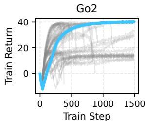

line

| Train Step | Train Return |
| ---------- | ------------ |
| 0          | 0            |
| 500        | ~30          |
| 1000       | ~35          |
| 1500       | ~40          |

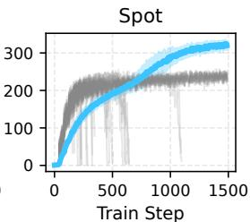

line

| Train Step | Value |
| ---------- | ----- |
| 0          | 0     |
| 500        | 200   |
| 1000       | 250   |
| 1500       | 300   |

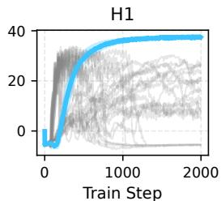

line

| Train Step | H1     |
| ---------- | ------ |
| 0          | 0      |
| 500        | 30     |
| 1000       | 35     |
| 1500       | 38     |
| 2000       | 40     |

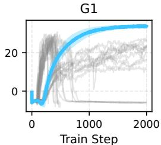

line

| Train Step | G1     |
| ---------- | ------ |
| 0          | 0      |
| 1000       | 25     |
| 2000       | 25     |

  
Fig. 2: Improved stability in IsaacLab locomotion environments. We compare episode returns from FPO++ training with FPO returns over many different hyperparameter choices: FPO++ rewards are averaged over 5 seeds, while FPO runs are included for all combinations of learning rate $\in \{ 1 0 ^ { - 5 } , 1 0 ^ { - 4 } , 3 \times 1 0 ^ { - 4 } \}$ , clip parameter ∈ {0.04, 0.05, 0.06}, and Monte Carlo samples $\in \{ 8 , 1 6 , 3 2 \}$ . FPO++ addresses stability problems that we were unable to solve by tuning FPO hyperparameters.

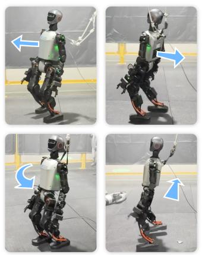

natural_image

Four-panel sequence showing a humanoid robot with green and red components, demonstrating motion poses (no text or symbols)

(a) T1 locomotion

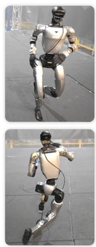

natural_image

Two identical humanoid robots in motion, captured from above and side views (no text or symbols visible)

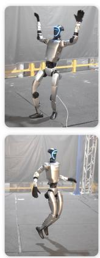

natural_image

Two-panel image showing a humanoid robot performing a dynamic pose, with no visible text or symbols.

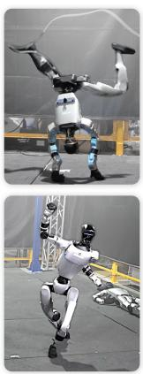

natural_image

Two-panel image showing a humanoid robot performing a dynamic pose, with no visible text or symbols.

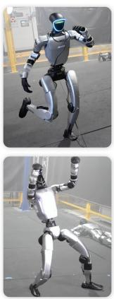

natural_image

Two-panel image showing a humanoid robot in motion, top panel with blue headlamp and black body, bottom panel with white body and ball (no text or symbols)

(b) G1 motion tracking

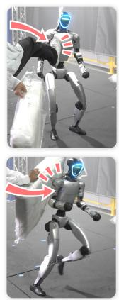

natural_image

Two-panel image showing a humanoid robot in motion, with red arrows indicating movement direction (no text or symbols)

natural_image

Two-panel image showing a humanoid robot in motion, with red arrows indicating movement direction (no text or symbols)

(c) G1 robustness test   
Fig. 3: Sim-to-real transfer. We deploy flow policies for locomotion to a Booster T1 and motion tracking to a Unitree G1. Policies are directly deployed to real robots with reduced sampling step counts, demonstrating stable gaits, tracking for long sequences, and robustness to external forces. The arrows in T1 locomotion (3a) indicate velocity commands, while the arrows in the robustness tests (3c) highlight external forces.

FPO++ dramatically improves stability. Figure 2 reports FPO and FPO++ training curves on each of the four robots. We found that standard FPO was more prone to local minima and catastrophic failures in these environments than the DeepMind Control Suite [37, 38] or PHC [39] tasks evaluated by prior work [1]. We attribute this to a combination of factors: highdimensional action spaces, realistic joint position and torque limits, and coarser reward functions. This was true even after tuning hyperparameters and adding details like gradient clipping and running observation normalization. In contrast, FPO++ was stable to train across all tasks. It achieves and then maintains high episode returns.

# B. Humanoid Sim-to-real

Experiment setup. Next, we consider sim-to-real transfer of flow policies using two humanoid robots: the Booster T1 and Unitree G1. We modify HumanoidVerse [40, 41] to train and deploy flow policies for velocity-conditioned T1 locomotion, and adapt the IsaacLab-based Beyond-Mimic [5] codebase to train and deploy flow policies for whole-body G1 motion tracking. Locomotion policies are conditioned on and trained to match linear and angular velocity targets; motion tracking policies are conditioned on and trained to match retargeted reference motions from the LAFAN dataset [42]. We use six reference motions: dance1 subject2, dance1 subject1, walk1 subject1, run1 subject2, fight1 subject2, and jumps1 subject1, which cover a wide variety of dynamic whole-body control challenges. Each motion sequence lasts around 2 minutes and 30

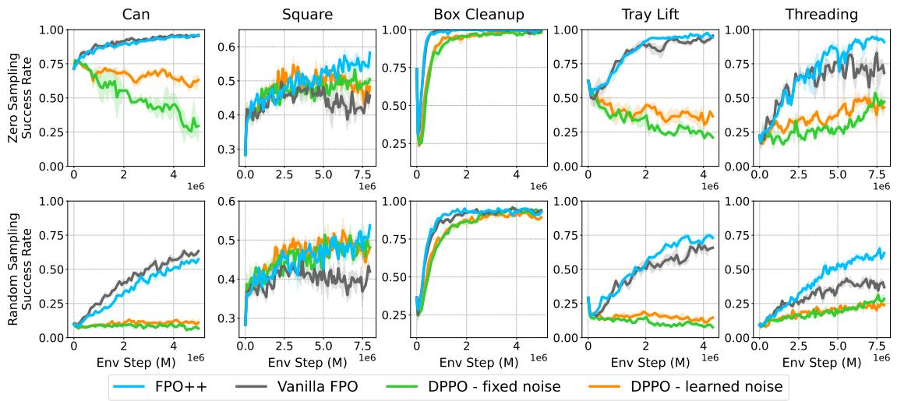  
FPO++ Vanilla FPO DPPO - fixed noise DPPO - learned noise

Fig. 4: Manipulation fine-tuning results. We compare the evaluation success rates for FPO++, FPO, and our two DPPO implementations. We show two rows: the first row contains policy success rates with zero-sampling $( \epsilon = \vec { 0 } )$ , while the second row contains policy success rates using standard random sampling $( \epsilon \sim \mathcal { N } ( 0 , I ) )$ . For each task, all algorithms are initialized from the same base policy, which is an image-based flow matching policy trained to predict action chunks.

seconds on average. We train one policy per motion and deploy each policy on the real robot, following the RL-based motion tracking protocol of BeyondMimic [5].

Implementation details. The T1 locomotion policy uses the same hyperparameters as the IsaacLab locomotion experiments. The G1 motion tracking policy uses 3-layer MLPs with hidden layer sizes of (1024, 512, 256) for both the actor and critic networks. We apply standard domain randomization techniques (friction, mass, external pushes, actuator delays) to improve transfer robustness. We use 50 flow integration steps during training rollouts. At deployment, we use zero-sampling with 5 flow integration steps to reduce latency.

FPO++ policies succeed on physical robots. FPO++ is able to learn robust gaits in locomotion, and robustly perform dynamic motion sequences in motion tracking. We show FPO++ policy deployment for T1 locomotion and G1 motion tracking in Figure 3. We consider this a significant result: to our knowledge, it is the first demonstration of humanoid simto-real using either (i) a flow policy trained without expert distillation or (ii) a policy gradient technique without explicit likelihoods. Importantly, it validates that FPO++ is robust enough to be used for real-world robotics tasks.

# C. Manipulation Fine-tuning

Experiment setup. One application not studied in prior flow policy gradient work [1] is reward-based fine-tuning for policies that are first trained from demonstrations. The success of flow policies in imitation learning [11] makes RL of flow policies uniquely important in this setting. To validate FPO++ for fine-tuning, we begin by pretraining image-based manipulation policies for tasks from RoboMimic [24] and DexMimicGen [43]. We follow the data processing of Res-FiT [44] for five tasks, which cover diverse embodiments and control regimes (Figure A.2). All policies use a 3-layer MLP backbone with a ViT [45] encoder for image observations. We then fine-tune flow policies using FPO++, FPO, and two baselines adapted from the DPPO [8] implementation in [1]: one that employs a fixed noise scale for exploration, and one with a predicted noise inspired by ReinFlow [9].

Implementation details. We train models to sample action chunks with horizon-length 16. During fine-tuning, we compute chunk-level ratios by summing CFM losses across all chunk timesteps. We use 10 flow steps for sampling in both training and evaluation. Additional discussion on implementation and baselines can be found in D.3. We disable ASPO for manipulation experiments (Section IV-D).

Flow policy gradients succeed in fine-tuning. We plot policy success rates using each fine-tuning algorithm in Figure 4. We find that FPO++ consistently achieves high success rates, converging more rapidly than baselines. Vanilla FPO also performs well on simpler manipulation tasks, suggesting that behavior cloning initialization can provide sufficient regularization for mitigating the instabilities we observed when training from scratch. Both DPPO variants underperform FPObased methods, which we attribute to the longer effective MDP horizon introduced by treating diffusion steps as decision points [29]. These results are notable given the emphasis on likelihood computation in prior RL for flow and diffusion fine-tuning methods, which introduce structures like two-layer MDPs [8] and learned noise predictors [9]. FPO++ results suggest that the explicit density estimates that motivate these changes are not necessary for effective flow RL training.

FPO++ runs were more robust to the initial base policy performance. We found that our DPPO runs often failed when base policies had low stochastic sampling success rates, like the Can example in Figure 4, which starts at ∼ 10% success

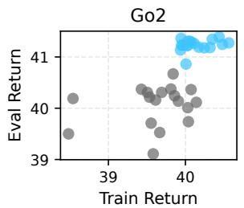

scatter

| Train Return | Eval Return |
| ------------ | ----------- |
| 38.5         | 39.5        |
| 39.0         | 40.0        |
| 39.5         | 40.5        |
| 40.0         | 41.0        |
| 40.5         | 41.5        |
| 41.0         | 42.0        |

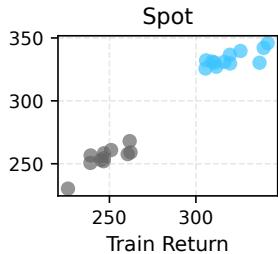

scatter

| Train Return | Value |
| ------------ | ----- |
| 250          | 260   |
| 260          | 270   |
| 270          | 280   |
| 280          | 290   |
| 290          | 300   |
| 300          | 310   |
| 310          | 320   |
| 320          | 330   |
| 330          | 340   |
| 340          | 350   |

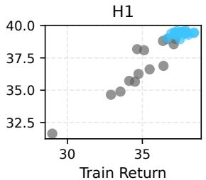

scatter

| Train Return | H1    |
| ------------ | ----- |
| 30           | 32.5  |
| 35           | 37.5  |
| 35           | 38.0  |
| 35           | 38.5  |
| 35           | 39.0  |
| 35           | 39.5  |
| 35           | 40.0  |

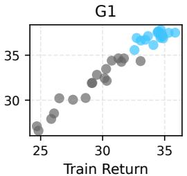

scatter

| Train Return | Value |
| ------------ | ----- |
| 25           | 28    |
| 26           | 29    |
| 27           | 30    |
| 28           | 31    |
| 29           | 32    |
| 30           | 33    |
| 31           | 34    |
| 32           | 35    |
| 33           | 36    |
| 34           | 37    |
| 35           | 38    |

FPO++ with per-action ratio FPO++ with per-sample ratio

Fig. 5: Per-sample ratios improve locomotion policies. We plot final training and evaluation returns, comparing FPO++ with per-sample ratios (Equation 10) against per-action ratios from prior work (Equation 9). We show results for many training runs: each point is a training run with clipping parameter sampled $\in \{ 0 . 0 4 , 0 . 0 5 , 0 . 0 6 \}$ and random seed $\in \{ 0 , 1 , 2 , 3 , 4 \}$ . Per-sample ratios produce higher and more consistent returns across environments.   
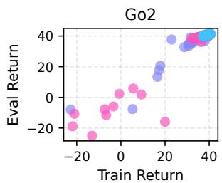

scatter

| Train Return | Eval Return | Group |
| ------------ | ----------- | ----- |
| -15          | -10         | Pink  |
| -10          | -15         | Pink  |
| -5           | -5          | Pink  |
| 0            | 0           | Pink  |
| 5            | 5           | Pink  |
| 10           | 10          | Pink  |
| 15           | 15          | Pink  |
| 20           | 20          | Pink  |
| 25           | 25          | Pink  |
| 30           | 30          | Pink  |
| 35           | 35          | Pink  |
| 40           | 40          | Pink  |
| -15          | -10         | Blue  |
| -10          | -5          | Blue  |
| -5           | 0           | Blue  |
| 0            | 5           | Blue  |
| 5            | 10          | Blue  |
| 10           | 15          | Blue  |
| 15           | 20          | Blue  |
| 20           | 25          | Blue  |
| 25           | 30          | Blue  |
| 30           | 35          | Blue  |
| 35           | 40          | Blue  |
| 40           | 45          | Blue  |

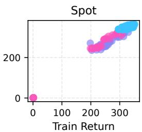

scatter

| Train Return | Value |
| ------------ | ----- |
| 0            | 0     |
| 200          | 200   |
| 300          | 300   |

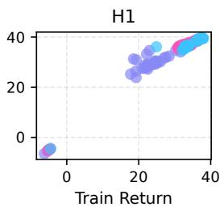

scatter

| Train Return | H1  |
| ------------ | --- |
| 0            | 0   |
| 20           | 30  |
| 30           | 40  |

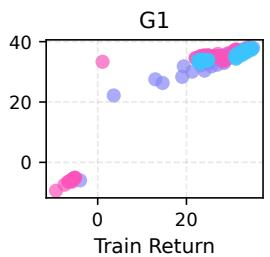

scatter

| Train Return | Value |
| ------------ | ----- |
| 0            | 35    |
| 5            | 25    |
| 10           | 30    |
| 15           | 35    |
| 20           | 40    |
| 25           | 40    |
| 30           | 40    |
| 35           | 40    |
| 40           | 40    |
| 45           | 40    |
| 50           | 40    |
| 55           | 40    |
| 60           | 40    |
| 65           | 40    |
| 70           | 40    |
| 75           | 40    |
| 80           | 40    |
| 85           | 40    |
| 90           | 40    |
| 95           | 40    |
| 100          | 40    |

FPO++ with PPO FPO++ with SPO FPO++ with ASPO

Fig. 6: ASPO trust region improves locomotion policies. We plot final training and evaluation returns, comparing FPO++ with different trust region implementations: standard PPO clipping, SPO [32], and our asymmetric ASPO objective. Each point is a training run with clipping parameter $\in \{ 0 . 0 4 , 0 . 0 5 , 0 . 0 6 \}$ and random seed $\in \{ 0 , 1 , 2 , 3 , 4 \}$ . ASPO produces higher and more consistent returns.

rate. The same task succeeds when initialized with higherquality base policies; examples are provided in Appendix D.4.

# D. Training Ablations

The experiments above demonstrate stable flow policy learning across locomotion, sim-to-real, and manipulation tasks. To better understand what makes this possible, we ablate FPO++’s per-sample ratio and ASPO trust region. We then discuss the effect of these changes on entropy, gradient variance, and finetuning performance.

FPO++ changes are critical for all locomotion embodiments. Figure 5 shows final training and evaluation returns for locomotion environments when we ablate the per-sample ratio; Figure 6 shows returns when we ablate the ASPO trust region. We include multiple hyperparameter configurations for thoroughness: each point is a run trained using a unique clipping parameter and random seed combination. We find that FPO++ achieves consistent policy performance across hyperparameters and random seeds. When either the persample ratio or ASPO trust region is disabled, average returns drop significantly across robot embodiments. The variance of returns also increases, suggesting that the ratio and ASPO trust region combination stabilizes learning.

ASPO successfully preserves entropy. We compare flow field visualizations for a policy trained using PPO and ASPO

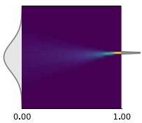

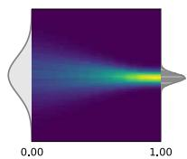  
Fig. 7: Effect of ASPO on entropy. We show a flow field during training of H1 locomotion for a single robot joint, with FPO++ using PPO clipping (left) and ASPO clipping (right). The x-axis is integration step t.

trust regions in Figure 7. We observed that policies trained using ASPO successfully solved tasks without entropy collapse, which explains the improved robustness in Figure 6. Additional flow field visualizations can be found in Appendix E.

FPO++ reduces empirical gradient variance. One motivation for the changes proposed by FPO++ is reduced gradient variance. We verified this empirically using a cosine similarity metric inspired by [46]. Results are shown in Appendix B.

ASPO can degrade fine-tuning performance. The persample ratio consistently improves results across tasks: locomotion, motion tracking, and manipulation. We observed, however, that ASPO sometimes degrades learning for manipulation fine-tuning (Appendix D.5). We attribute this to (1) entropy preservation being most important in tasks that require more exploration, such as for emergent gaits in locomotion, and (2) upper-bounding the growth of the variational gap being less critical when flow policies are well-initialized.

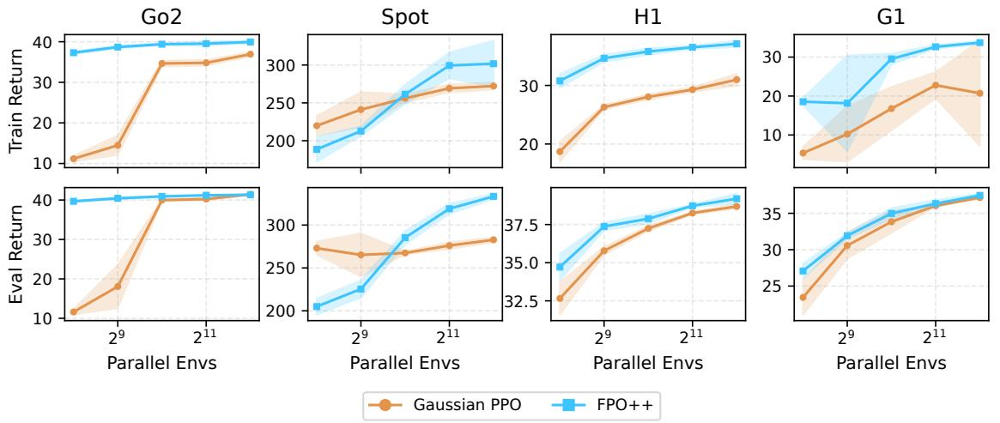

Fig. 8: Train and eval returns for FPO++ and Gaussian PPO. We compare final policy returns between Gaussian PPO and FPO++ with environment counts $\in \{ 2 ^ { 8 } , 2 ^ { 9 } , 2 ^ { 1 0 } , 2 ^ { 1 1 } , 2 ^ { 1 2 } \}$ . Minibatch size per policy update increases linearly with the number of parallel environments; other hyperparameters, including the total number of policy updates, are fixed between runs. The filled region shows sensitivity to random seed, with standard deviation computed over 5 seeds per setting. 

<table><tr><td>Sampling method</td><td>5 steps</td><td>50 steps</td></tr><tr><td>Random sampling</td><td>34.7 ± 55.0</td><td>38.4 ± 26.6</td></tr><tr><td>Zero-sampling</td><td>45.1 ± 27.4</td><td>45.5 ± 23.2</td></tr></table>

TABLE I: Zero-sampling improves motion tracking. Returns are computed over 100 rollouts of a 2.5min dancing sequence, with domain randomization and push perturbations. The policy is trained with 50 flow steps; we evaluate using random sampling and zero-sampling with 5 and 50 flow steps.

# E. Zero-sampling Ablation

In this section, we discuss the importance of zero-sampling at test-time (Section III-D). This can be observed in the gap between locomotion train and eval returns in Figure 8, in the gap between zero-initialization and stochastic sampling success rates for manipulation in Figure 4, and in motion tracking rewards with different sampling strategies in Table I.

Zero-sampling is critical, especially for sim-to-real. The gap between rollouts with stochastic sampling and rollouts with zero-sampling can be drastic: G1 policies trained with $2 ^ { 9 }$ parallel environments, for example, achieve an average train return of under 20 but eval return above 32. Success rates in manipulation base policies, before any fine-tuning is applied at all, can jump from around 10% to over 70%. We also observe in Table I that zero-sampling allows us to significantly reduce Euler integration steps with only a negligible drop in policy performance. This enables lower-latency action sampling using the on-board computer of the robot.

# F. Comparison with Gaussian PPO

Many FPO++ use cases, such as the fine-tuning experiments in Section IV-C, specifically require RL training for flow policies. Other tasks are designed for Gaussian PPO, which provides a well-understood baseline for validating that FPO++ training succeeds, for analyzing training dynamics, and for understanding properties like sample efficiency and the expressiveness of learned action distributions. We investigate these characteristics by first comparing FPO++ against IsaacLab’s default Gaussian PPO implementation [47] across locomotion tasks with varying amounts of parallelization (Figure 8). We then discuss the action distributions learned by FPO++, followed by limitations. Details and hyperparameter tuning information can be found in Appendix C.1.

FPO++ locomotion policies show sample efficiency advantages. We observe in Figure 8 that FPO++ locomotion policies for each environment count almost always converge to higher returns than the Gaussian PPO configurations we compare against, with reduced variance between random seeds. This suggests that the improved expressivity of the flow representation can be used to learn more from the same amount of environment data. We observe improved robustness to very small batch sizes in Go2, H1, and G1 locomotion, and better exploitation of increased parallelism for Spot locomotion.

FPO++ policies explore with more expressive action distributions. Consistent with [49], we found that the same rewards often produced different gaits with different algorithms. FPO++ policies trained with default Spot locomotion rewards, for example, produced more consistent “trot” gaits than Gaussian PPO policies, which had a tendency to learn more symmetric “pronk” gaits (Figure 9). We attribute this to the fact that action dimensions in standard Gaussian policies are sampled independently, making it more difficult to explore correlated or symmetric behaviors. In contrast, we observe more expressive distributions in FPO++ policies. We visualize this using cross-correlation heatmaps in Figure 10. We find that coupling between action dimensions—not possible to represent in Gaussian PPO implementations with diagonal covariances—emerges during training. Relationships are interpretable and consistent with alternating gaits like trotting: the left and right hip joints, for example, are negatively correlated for locomotion.

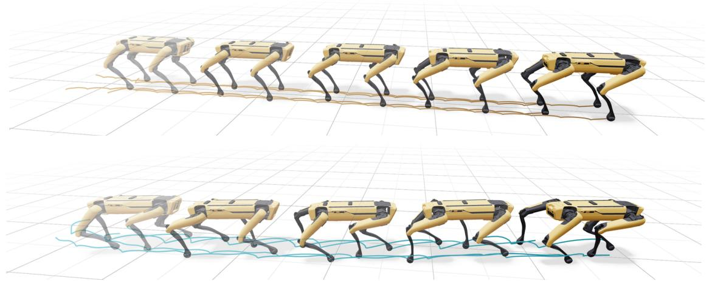

natural_image

Sequence of 3D quadrupedoes walking on a grid surface, no text or symbols present

Fig. 9: Different gaits from different algorithms. Rollouts using Gaussian PPO (top) and FPO++ (bottom) for 1500 policy updates. Policies are trained with the same rewards, 4096 parallel environments, and given the same forward velocity command (1m/s). We found differences reproducible across seeds, clip parameters, and learning rates. We use Viser [48] for visualization.

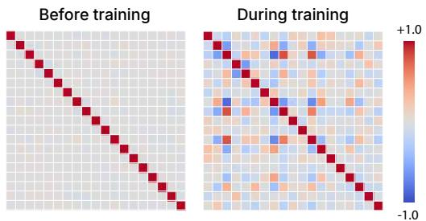

heatmap

| Condition       | Value |
| --------------- | ----- |
| Before training | +1.0  |
| During training | -1.0  |

Fig. 10: Correlations before and during training. We sample 10,000 actions conditioned on the same observation, and visualize the correlations between action dimensions before and during FPO++ training for an H1 locomotion policy.

Limitations and future work. One promising result of FPO++ is showing a unified algorithm and policy representation that succeeds in both policy training from scratch and finetuning, while also generalizing across different embodiments and tasks. A few challenges remain. FPO++ experiments generally take more wall-clock time than Gaussian PPO to run, which limits how attractive it is for tasks where Gaussian policies already succeed. For G1 locomotion on an L40S GPU, for example, our Gaussian PPO baseline reaches an evaluation return of 25 in 19 minutes. Our FPO++ experiments required 23 minutes to reach the same return. Motion tracking experiments used in sim-to-real validation can take as much as 3x longer than a tuned Gaussian PPO baseline; these achieve longer episode lengths but slightly lower returns, which we attribute to the absence of details like entropy regularization and adaptive learning rates in our FPO++ implementation (Appendix A.6). Future work may explore how to best incorporate these in FPO++, as well as approaches like few-step distillation [50, 51] for improving training and inference efficiency. Other directions include applications where Gaussian policies are simply not applicable, such as for tasks that require more expressive exploration dynamics or that benefit from diffusionbased sequence modeling [26, 52].

# V. CONCLUSION

In this paper, we presented a study on robot control using flow matching policy gradients. Results show that the proposed FPO++ algorithm is more stable than prior flow policy gradient implementations and enables success on practical robot locomotion, motion tracking, and manipulation finetuning tasks. Analysis highlights the effect of per-sample ratios and an asymmetric trust region on training, as well as zero-initialized sampling at test time.

Beyond validating a specific algorithm on specific tasks, FPO++ aims to serve as an existence proof that we are excited about for several reasons. FPO++ validates several possibilities, including policy gradient-style training of flow policies for real-world continuous control and sim-to-real transfer of these policies after training using only RL. Importantly, these results challenge the common assumption that explicit likelihoods are needed for policy gradient methods in robot control. By demonstrating that this constraint can be bypassed, FPO++ suggests new directions for expanding the design space of RL algorithms for future robot learning systems.

# REFERENCES

[1] David McAllister, Songwei Ge, Brent Yi, Chung Min Kim, Ethan Weber, Hongsuk Choi, Haiwen Feng, and Angjoo Kanazawa. Flow matching policy gradients. arXiv preprint arXiv:2507.21053, 2025.   
[2] Richard S Sutton, David McAllester, Satinder Singh, and Yishay Mansour. Policy gradient methods for reinforcement learning with function approximation. Advances in neural information processing systems, 1999.   
[3] John Schulman, Filip Wolski, Prafulla Dhariwal, Alec Radford, and Oleg Klimov. Proximal policy optimization algorithms. arXiv preprint arXiv:1707.06347, 2017.   
[4] Nikita Rudin, David Hoeller, Philipp Reist, and Marco Hutter. Learning to walk in minutes using massively parallel deep reinforcement learning. In Proceedings of the 5th Conference on Robot Learning, volume 164 of Proceedings of Machine Learning Research, pages 91– 100. PMLR, 2022.   
[5] Qiayuan Liao, Takara E Truong, Xiaoyu Huang, Guy Tevet, Koushil Sreenath, and C Karen Liu. Beyondmimic: From motion tracking to versatile humanoid control via guided diffusion. arXiv e-prints, pages arXiv– 2508, 2025.   
[6] Arthur Allshire, Hongsuk Choi, Junyi Zhang, David McAllister, Anthony Zhang, Chung Min Kim, Trevor Darrell, Pieter Abbeel, Jitendra Malik, and Angjoo Kanazawa. Visual imitation enables contextual humanoid control. In Conference on Robot Learning (CoRL), 2025.   
[7] Haozhi Qi, Brent Yi, Sudharshan Suresh, Mike Lambeta, Yi Ma, Roberto Calandra, and Jitendra Malik. General inhand object rotation with vision and touch. In Conference on Robot Learning, pages 2549–2564. PMLR, 2023.   
[8] Allen Z Ren, Justin Lidard, Lars L Ankile, Anthony Simeonov, Pulkit Agrawal, Anirudha Majumdar, Benjamin Burchfiel, Hongkai Dai, and Max Simchowitz. Diffusion policy policy optimization. arXiv preprint arXiv:2409.00588, 2024.   
[9] Tonghe Zhang, Chao Yu, Sichang Su, and Yu Wang. Reinflow: Fine-tuning flow matching policy with online reinforcement learning. arXiv preprint arXiv:2505.22094, 2025.   
[10] Cheng Chi, Zhenjia Xu, Siyuan Feng, Eric Cousineau, Yilun Du, Benjamin Burchfiel, Russ Tedrake, and Shuran Song. Diffusion policy: Visuomotor policy learning via action diffusion. The International Journal of Robotics Research, 2025.   
[11] Kevin Black, Noah Brown, Danny Driess, Adnan Esmail, Michael Equi, Chelsea Finn, Niccolo Fusai, Lachy Groom, Karol Hausman, Brian Ichter, Szymon Jakubczak, Tim Jones, Liyiming Ke, Sergey Levine, Adrian Li-Bell, Mohith Mothukuri, Suraj Nair, Karl Pertsch, Lucy Xiaoyang Shi, James Tanner, Quan Vuong, Anna Walling, Haohuan Wang, and Ury Zhilinsky. π0: A vision-language-action flow model for general robot control, 2024.

[12] Marta Skreta, Lazar Atanackovic, Avishek Joey Bose, Alexander Tong, and Kirill Neklyudov. The superposition of diffusion models using the ito density estimator, 2025. ˆ   
[13] Will Grathwohl, Ricky TQ Chen, Jesse Bettencourt, Ilya Sutskever, and David Duvenaud. Ffjord: Free-form continuous dynamics for scalable reversible generative models. arXiv preprint arXiv:1810.01367, 2018.   
[14] Joonho Lee, Jemin Hwangbo, Lorenz Wellhausen, Vladlen Koltun, and Marco Hutter. Learning quadrupedal locomotion over challenging terrain. Science Robotics, 5(47):eabc5986, 2020.   
[15] Haozhi Qi, Brent Yi, Mike Lambeta, Yi Ma, Roberto Calandra, and Jitendra Malik. From simple to complex skills: The case of in-hand object reorientation. arXiv preprint arXiv:2501.05439, 2025.   
[16] Danijar Hafner, Wilson Yan, and Timothy Lillicrap. Training agents inside of scalable world models. arXiv preprint arXiv:2509.24527, 2025.   
[17] John Schulman, Philipp Moritz, Sergey Levine, Michael Jordan, and Pieter Abbeel. High-dimensional continuous control using generalized advantage estimation. arXiv preprint arXiv:1506.02438, 2015.   
[18] Timothy P Lillicrap, Jonathan J Hunt, Alexander Pritzel, Nicolas Heess, Tom Erez, Yuval Tassa, David Silver, and Daan Wierstra. Continuous control with deep reinforcement learning. arXiv preprint arXiv:1509.02971, 2015.   
[19] Danijar Hafner, Timothy Lillicrap, Jimmy Ba, and Mohammad Norouzi. Dream to control: Learning behaviors by latent imagination. arXiv preprint arXiv:1912.01603, 2019.   
[20] Yaron Lipman, Ricky T. Q. Chen, Heli Ben-Hamu, Maximilian Nickel, and Matt Le. Flow matching for generative modeling, 2023.   
[21] Jonathan Ho, Ajay Jain, and Pieter Abbeel. Denoising diffusion probabilistic models. Advances in neural information processing systems, 2020.   
[22] Ruiqi Gao, Emiel Hoogeboom, Jonathan Heek, Valentin De Bortoli, Kevin P. Murphy, and Tim Salimans. Diffusion meets flow matching: Two sides of the same coin. 2024.   
[23] Lars Ankile, Anthony Simeonov, Idan Shenfeld, Marcel Torne, and Pulkit Agrawal. From imitation to refinement–residual rl for precise visual assembly. arXiv preprint arXiv:2407.16677, 2024.   
[24] Ajay Mandlekar, Danfei Xu, Josiah Wong, Soroush Nasiriany, Chen Wang, Rohun Kulkarni, Li Fei-Fei, Silvio Savarese, Yuke Zhu, and Roberto Mart´ın-Mart´ın. What matters in learning from offline human demonstrations for robot manipulation. In arXiv preprint arXiv:2108.03298, 2021.   
[25] Physical Intelligence, Kevin Black, Noah Brown, James Darpinian, Karan Dhabalia, Danny Driess, Adnan Esmail, Michael Equi, Chelsea Finn, Niccolo Fusai, et al. π0.5: a vision-language-action model with open-world generalization. arXiv preprint arXiv:2504.16054, 2025.   
[26] Xiaoyu Huang, Takara Truong, Yunbo Zhang, Fangzhou

Yu, Jean Pierre Sleiman, Jessica Hodgins, Koushil Sreenath, and Farbod Farshidian. Diffuse-cloc: Guided diffusion for physics-based character look-ahead control. ACM Transactions on Graphics (TOG), 44(4):1–12, 2025.   
[27] Kevin Black, Michael Janner, Yilun Du, Ilya Kostrikov, and Sergey Levine. Training diffusion models with reinforcement learning. arXiv preprint arXiv:2305.13301, 2023.   
[28] Ying Fan, Olivia Watkins, Yuqing Du, Hao Liu, Moonkyung Ryu, Craig Boutilier, Pieter Abbeel, Mohammad Ghavamzadeh, Kangwook Lee, and Kimin Lee. Dpok: Reinforcement learning for fine-tuning text-toimage diffusion models. Advances in Neural Information Processing Systems, 36:79858–79885, 2023.   
[29] Ningyuan Yang, Jiaxuan Gao, Feng Gao, Yi Wu, and Chao Yu. Fine-tuning diffusion policies with backpropagation through diffusion timesteps. arXiv preprint arXiv:2505.10482, 2025.   
[30] Shutong Ding, Ke Hu, Shan Zhong, Haoyang Luo, Weinan Zhang, Jingya Wang, Jun Wang, and Ye Shi. Genpo: Generative diffusion models meet on-policy reinforcement learning. arXiv preprint arXiv:2505.18763, 2025.   
[31] Laurent Dinh, Jascha Sohl-Dickstein, and Samy Bengio. Density estimation using real nvp. arXiv preprint arXiv:1605.08803, 2016.   
[32] Zhengpeng Xie, Qiang Zhang, Fan Yang, Marco Hutter, and Renjing Xu. Simple policy optimization. arXiv preprint arXiv:2401.16025, 2024. v9, revised 26 Jul 2025.   
[33] Diederik P. Kingma and Ruiqi Gao. Understanding diffusion objectives as the elbo with simple data augmentation, 2023.   
[34] Qiying Yu, Zheng Zhang, Ruofei Zhu, Yufeng Yuan, Xiaochen Zuo, Yu Yue, Tiantian Fan, Gaohong Liu, Lingjun Liu, Xin Liu, Haibin Lin, Zhiqi Lin, Bole Ma, Guangming Sheng, Yuxuan Tong, Chi Zhang, Mofan Zhang, Wang Zhang, Hang Zhu, Jinhua Zhu, Jiaze Chen, Jiangjie Chen, Chengyi Wang, Hongli Yu, Weinan Dai, Yuxuan Song, Xiangpeng Wei, Hao Zhou, Jingjing Liu, Wei-Ying Ma, Ya-Qin Zhang, Lin Yan, Mu Qiao, Yonghui Wu, and Mingxuan Wang. Dapo: An opensource llm reinforcement learning system at scale. 2025. version v2, submitted March 2025.   
[35] Chaoyi Pan, Giri Anantharaman, Nai-Chieh Huang, Claire Jin, Daniel Pfrommer, Chenyang Yuan, Frank Permenter, Guannan Qu, Nicholas Boffi, Guanya Shi, et al. Much ado about noising: Dispelling the myths of generative robotic control. arXiv preprint arXiv:2512.01809, 2025.   
[36] Mayank Mittal, Calvin Yu, Qinxi Yu, Jingzhou Liu, Nikita Rudin, David Hoeller, Jia Lin Yuan, Ritvik Singh, Yunrong Guo, Hammad Mazhar, Ajay Mandlekar, Buck Babich, Gavriel State, Marco Hutter, and Animesh Garg. Orbit: A unified simulation framework for interactive

robot learning environments. IEEE Robotics and Automation Letters, 8(6):3740–3747, 2023.   
[37] Yuval Tassa, Yotam Doron, Alistair Muldal, Tom Erez, Yazhe Li, Diego de Las Casas, David Budden, Abbas Abdolmaleki, Josh Merel, Andrew Lefrancq, et al. Deepmind control suite. arXiv preprint arXiv:1801.00690, 2018.   
[38] Kevin Zakka, Baruch Tabanpour, Qiayuan Liao, Mustafa Haiderbhai, Samuel Holt, Jing Yuan Luo, Arthur Allshire, Erik Frey, Koushil Sreenath, Lueder A Kahrs, et al. Mujoco playground. arXiv preprint arXiv:2502.08844, 2025.   
[39] Zhengyi Luo, Jinkun Cao, Kris Kitani, Weipeng Xu, et al. Perpetual humanoid control for real-time simulated avatars. In Proceedings of the IEEE/CVF International Conference on Computer Vision, pages 10895–10904, 2023.   
[40] LeCAR-Lab. Humanoidverse: A versatile and extendable reinforcement learning framework for humanoid robots. https://github.com/LeCAR-Lab/HumanoidVerse, 2023. Accessed: 2025-09-22.   
[41] Viktor Makoviychuk, Lukasz Wawrzyniak, Yunrong Guo, Michelle Lu, Kier Storey, Miles Macklin, David Hoeller, Nikita Rudin, Arthur Allshire, Ankur Handa, et al. Isaac gym: High performance gpu-based physics simulation for robot learning. arXiv preprint arXiv:2108.10470, 2021.   
[42] Felix G Harvey, Mike Yurick, Derek Nowrouzezahrai, ´ and Christopher Pal. Robust motion in-betweening. ACM Transactions on Graphics (TOG), 39(4):60–1, 2020.   
[43] Zhenyu Jiang, Yuqi Xie, Kevin Lin, Zhenjia Xu, Weikang Wan, Ajay Mandlekar, Linxi Jim Fan, and Yuke Zhu. Dexmimicgen: Automated data generation for bimanual dexterous manipulation via imitation learning. In 2025 IEEE International Conference on Robotics and Automation (ICRA), pages 16923–16930. IEEE, 2025.   
[44] Lars Ankile, Zhenyu Jiang, Rocky Duan, Guanya Shi, Pieter Abbeel, and Anusha Nagabandi. Residual offpolicy rl for finetuning behavior cloning policies. arXiv preprint arXiv:2509.19301, 2025.   
[45] Alexey Dosovitskiy, Lucas Beyer, Alexander Kolesnikov, Dirk Weissenborn, Xiaohua Zhai, Thomas Unterthiner, Mostafa Dehghani, Matthias Minderer, Georg Heigold, Sylvain Gelly, Jakob Uszkoreit, and Neil Houlsby. An image is worth 16x16 words: Transformers for image recognition at scale. ICLR, 2021.   
[46] Andrew Ilyas, Logan Engstrom, Shibani Santurkar, Dimitris Tsipras, Firdaus Janoos, Larry Rudolph, and Aleksander Madry. A closer look at deep policy gradients. arXiv preprint arXiv:1811.02553, 2018.   
[47] Clemens Schwarke, Mayank Mittal, Nikita Rudin, David Hoeller, and Marco Hutter. Rsl-rl: A learning library for robotics research. arXiv preprint arXiv:2509.10771, 2025.   
[48] Brent Yi, Chung Min Kim, Justin Kerr, Gina Wu, Rebecca Feng, Anthony Zhang, Jonas Kulhanek, Hongsuk

Choi, Yi Ma, Matthew Tancik, and Angjoo Kanazawa. Viser: Imperative, web-based 3d visualization in python. arXiv preprint arXiv:2507.22885, 2025.   
[49] Younggyo Seo, Carmelo Sferrazza, Haoran Geng, Michal Nauman, Zhao-Heng Yin, and Pieter Abbeel. Fasttd3: Simple, fast, and capable reinforcement learning for humanoid control. arXiv preprint arXiv:2505.22642, 2025.   
[50] Tim Salimans and Jonathan Ho. Progressive distillation for fast sampling of diffusion models. arXiv preprint arXiv:2202.00512, 2022.   
[51] Xingchao Liu, Chengyue Gong, and Qiang Liu. Flow straight and fast: Learning to generate and transfer data with rectified flow. arXiv preprint arXiv:2209.03003, 2022.   
[52] Boyuan Chen, Diego Marti Monso, Yilun Du, Max Simchowitz, Russ Tedrake, and Vincent Sitzmann. Diffusion forcing: Next-token prediction meets full-sequence diffusion. arXiv preprint arXiv:2407.01392, 2024.   
[53] Xue Bin Peng, Aviral Kumar, Grace Zhang, and Sergey Levine. Advantage-weighted regression: Simple and scalable off-policy reinforcement learning. arXiv preprint arXiv:1910.00177, 2019.   
[54] Bingyi Kang, Xiao Ma, Chao Du, Tianyu Pang, and Shuicheng Yan. Efficient diffusion policies for offline reinforcement learning. Advances in Neural Information Processing Systems, 2024.   
[55] Shutong Ding, Ke Hu, Zhenhao Zhang, Kan Ren, Weinan Zhang, Jingyi Yu, Jingya Wang, and Ye Shi. Diffusionbased reinforcement learning via q-weighted variational policy optimization. Advances in Neural Information Processing Systems, 37:53945–53968, 2024.   
[56] Shiyuan Zhang, Weitong Zhang, and Quanquan Gu. Energy-weighted flow matching for offline reinforcement learning. arXiv preprint arXiv:2503.04975, 2025.   
[57] Zhendong Wang, Jonathan J Hunt, and Mingyuan Zhou. Diffusion policies as an expressive policy class for offline reinforcement learning. arXiv preprint arXiv:2208.06193, 2022.   
[58] Cheng Lu, Huayu Chen, Jianfei Chen, Hang Su, Chongxuan Li, and Jun Zhu. Contrastive energy prediction for exact energy-guided diffusion sampling in offline reinforcement learning. In International Conference on Machine Learning, pages 22825–22855. PMLR, 2023.   
[59] Longxiang He, Li Shen, Linrui Zhang, Junbo Tan, and Xueqian Wang. Diffcps: Diffusion model based constrained policy search for offline reinforcement learning. arXiv preprint arXiv:2310.05333, 2023.   
[60] Zihan Ding and Chi Jin. Consistency models as a rich and efficient policy class for reinforcement learning. arXiv preprint arXiv:2309.16984, 2023.   
[61] Ruoqi Zhang, Ziwei Luo, Jens Sjolund, Thomas Sch ¨ on, ¨ and Per Mattsson. Entropy-regularized diffusion policy with q-ensembles for offline reinforcement learning. Advances in Neural Information Processing Systems, 37:98871–98897, 2024.

[62] Suzan Ece Ada, Erhan Oztop, and Emre Ugur. Diffusion policies for out-of-distribution generalization in offline reinforcement learning. IEEE Robotics and Automation Letters, 9(4):3116–3123, 2024.   
[63] Onur Celik, Zechu Li, Denis Blessing, Ge Li, Daniel Palenicek, Jan Peters, Georgia Chalvatzaki, and Gerhard Neumann. DIME: Diffusion-based maximum entropy reinforcement learning. In International Conference on Machine Learning (ICML), 2025.   
[64] Seohong Park, Qiyang Li, and Sergey Levine. Flow qlearning. arXiv preprint arXiv:2502.02538, 2025.   
[65] Michael Psenka, Alejandro Escontrela, Pieter Abbeel, and Yi Ma. Learning a diffusion model policy from rewards via q-score matching. arXiv preprint arXiv:2312.11752, 2023.   
[66] Qiyang Li and Sergey Levine. Q-learning with adjoint matching. arXiv preprint arXiv:2601.14234, 2026.   
[67] Aaron Havens, Benjamin Kurt Miller, Bing Yan, Carles Domingo-Enrich, Anuroop Sriram, Brandon Wood, Daniel Levine, Bin Hu, Brandon Amos, Brian Karrer, et al. Adjoint sampling: Highly scalable diffusion samplers via adjoint matching. arXiv preprint arXiv:2504.11713, 2025.

# Appendix of “Flow Policy Gradients for Robot Control”

APPENDIX A

FURTHER RELATED WORK

The main body of our paper discusses online RL, where policies are updated from their own experience. A related body of work has explored using flow and diffusion-based policies in offline RL. One common strategy is advantage weighted regression (AWR) [53–56]. Another line of work optimizes a Q-learning objective jointly with a generative-model loss [57–62], enabling value-based training while regularizing the policy through diffusion or flow matching. Maximumentropy approaches such as DIME [63] extend this direction by integrating diffusion policies with entropy-regularized RL, further improving robustness and sample quality in offline settings.

A key challenge in training diffusion or flow policies with Q-learning is that backpropagation through the multi-step denoising process is numerically unstable. FQL [64] addresses this by training a one-step flow policy without backpropagation through time (BPTT). Q-score matching [65] links the score of the diffusion policy to the action gradient of the Qfunction. Finally, QAM [66] leverages adjoint matching [67] to transform the critic’s action gradient into a step-wise objective for the policy.

# APPENDIX B EMPIRICAL GRADIENT VARIANCE

One explanation for FPO++’s improved stability over FPO is reduced gradient variance: finer-grained clipping with the per-sample ratio creates a larger effective batch size, while for negative advantages, ASPO provides gradients even for ratios beyond the trust region. We plot a cosine similarity metric inspired by [46] in Figure A.3: for each policy update, we compute cosine similarities between individual gradients and the average gradient within the policy update. We find higher similarity when the proposed ASPO and per-sample ratios are used during training.

# APPENDIX C EXPERIMENT DETAILS

In this section, we detail the experimental setup for the IsaacLab velocity-conditioned locomotion benchmarks, motion tracking benchmarks, and manipulation finetuning benchmarks used throughout the paper. The robots we used in the paper, including quadrupeds, humanoids, and manipulators, are illustrated in Figure A.1 and A.2.

# C.1 Locomotion Benchmarking

1) Hyperparameters: All policies for the locomotion benchmarking experiments utilize 3-layer Multi-Layer Perceptrons (MLPs). Specifically, the actor network employs 256 hidden units, and the critic network employs 768 hidden units per layer. Additional hyperparameters can be found in Table A.1.

Quadruped policies are trained for 1500 steps, and humanoid policies are trained for 2000 steps. For the Gaussian PPO results, we adopt the default hyperparameters provided by the rsl\_rl library, with additional sweeps performed over the clipping parameters in the set {0.1, 0.15, 0.2, 0.25}.

2) Environments and Rewards: All locomotion benchmarking experiments use the standard IsaacLab velocityconditioned locomotion environments with default reward weights. The following reward terms are shared across all robot configurations:

• Linear velocity tracking: Exponential reward for matching the commanded linear velocity in the horizontal plane.   
• Angular velocity tracking: Exponential reward for matching the commanded yaw rate.   
• Feet air time: Reward for keeping feet in the air for a sufficient duration during each step.   
• Angular velocity (xy): Penalty for roll and pitch angular velocities.   
• Joint accelerations: Penalty for large joint accelerations.   
• Action rate: Penalty for rapid changes in actions between consecutive timesteps.

The default quadruped environments (Go2, Anymal) use less reward shaping, relying on velocity tracking and a weak air time reward (weight: 0.125) to allow gaits to emerge naturally. These environments also include penalties for vertical base velocity, joint torques, and undesired contacts on non-foot body parts (e.g., thighs).

The Spot quadruped environment introduces several additional terms: a gait synchronization reward that encourages diagonal foot pair coordination for trotting, a foot clearance reward for achieving target swing height, an air time variance penalty for consistent swing timing across legs, and explicit foot slip and body orientation penalties.

The humanoid environments (H1, G1) include bipedspecific adaptations: a modified air time reward for two-legged locomotion, joint deviation penalties that regularize hip, arm, and torso positions toward default poses, feet slide penalties, and a large termination penalty to discourage falling. The G1 configuration uses higher angular velocity tracking weight and enables joint torque penalties, while H1 disables both torque penalties and vertical velocity penalties. Neither humanoid environment includes gait synchronization rewards.

For more details, we refer to the open-source IsaacLab [36] repository.

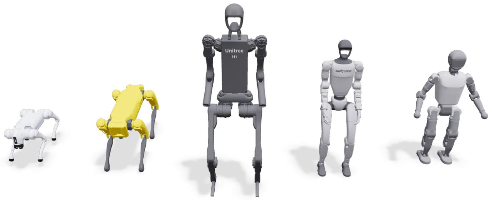

natural_image

Five 3D humanoid robots in various poses, including a white quadruped robot and four gray Unitree H1 variants (no text or symbols on the robots themselves)

Fig. A.1: Legged robots used for experiments. We train policies for the Go2, Spot, H1, and G1 robots in simulation. We deploy policies to physical G1 and Booster T1 robots.

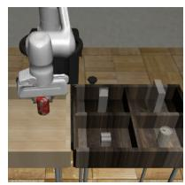

natural_image

3D rendering of a robotic arm interacting with a mechanical assembly (no visible text or symbols)

(a) Can

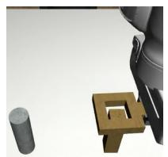

natural_image

3D rendered mechanical assembly with a cylindrical component and a square bracket (no text or symbols visible)

(b) Square   
Robomimic

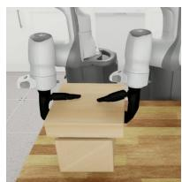

natural_image

Interior view of a modern office or meeting room with two white cylindrical devices and black footprints on a wooden table (no visible text or symbols)

(c) Box Cleanup

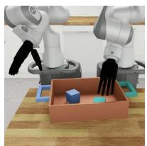

natural_image

3D illustration of two robotic arms interacting with a box containing colored blocks on a wooden surface (no text or symbols)

(d) Tray Lift   
DexMimicGen

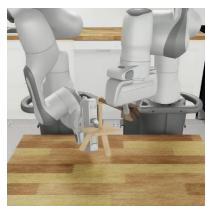

natural_image

Two robotic arms operating on a wooden table, no visible text or symbols

(e) Threading

Fig. A.2: Manipulation tasks. We compare FPO++ to baseline methods on manipulation tasks from Robomimic [24] and DexMimicGen [43]. We choose tasks that cover diverse embodiments and control regimes: both single-arm to bimanual manipulation, parallel-jaw grippers and dexterous hands, and both short-horizon and long-horizon tasks.   
(a) Effect of Ratio on Gradient Similarity   
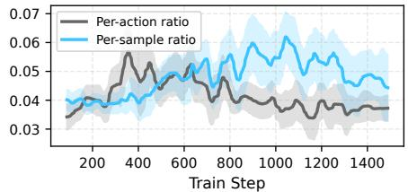

line

| Train Step | Per-action ratio | Per-sample ratio |
| ---------- | ---------------- | ---------------- |
| 200        | 0.04             | 0.04             |
| 400        | 0.05             | 0.04             |
| 600        | 0.04             | 0.05             |
| 800        | 0.04             | 0.05             |
| 1000       | 0.04             | 0.06             |
| 1200       | 0.04             | 0.05             |
| 1400       | 0.04             | 0.05             |

(b) Effect of Trust Region on Gradient Similarity   
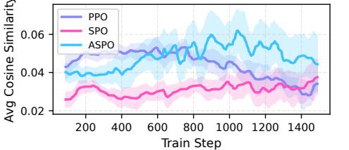

line

| Train Step | PPO    | SPO    | ASPO   |
| ---------- | ------ | ------ | ------ |
| 200        | 0.045  | 0.030  | 0.040  |
| 400        | 0.050  | 0.032  | 0.045  |
| 600        | 0.052  | 0.035  | 0.050  |
| 800        | 0.055  | 0.038  | 0.055  |
| 1000       | 0.058  | 0.040  | 0.060  |
| 1200       | 0.055  | 0.038  | 0.055  |
| 1400       | 0.052  | 0.035  | 0.050  |

Fig. A.3: Algorithmic updates in FPO++ reduce gradient variance. We observe that the per-sample ratio and ASPO trust region result in higher cosine similarity between gradients computed within each policy update, especially during the second half of training. Averages and standard deviations are reported over 5 seeds.

# C.2 Motion Tracking

Our motion tracking experiments train a policy for the Unitree G1 robot, which has 29 degrees of freedom (DoF). The control frequency is set to 50 Hz (with a simulation timestep ∆t = 0.005 s and decimation of 4). The reward design, observation space, and termination conditions follow BeyondMimic [5]. The following sections detail the specific hyperparameters used.

1) Domain Randomization: Domain randomization is applied to improve the policy’s sim-to-real transfer ability:

• Physics Material: Static friction (Uniform [0.3, 1.6]), Dynamic friction (Uniform [0.3, 1.2]), and Restitution (Uniform [0.0, 0.5]) are sampled at startup.   
• Joint Defaults: Default joint angles are uniformly offset by U (−0.01, 0.01) rad at startup.   
• Center of Mass (COM): The torso COM is offset uniformly in (x, y, z) at startup.

<table><tr><td>Hyperparameter category</td><td>Used value</td><td>Sweep range and notes</td></tr><tr><td colspan="3">FPO++</td></tr><tr><td>Flow integration steps</td><td>64</td><td>{8,16,32,64}</td></tr><tr><td>Network output</td><td>u</td><td>{u,x0},x0 denotes data</td></tr><tr><td>Samples per action</td><td>16</td><td>{8,16,32}</td></tr><tr><td colspan="3">Training</td></tr><tr><td>Learning rate</td><td> $1 \times 10^{-4}$ </td><td> $1 \times 10^{-5}$ ,  $1 \times 10^{-4}$ ,  $3 \times 10^{-4}$ </td></tr><tr><td>Weight decay / Adam betas</td><td> $1 \times 10^{-4}$  / (0.9,0.95)</td><td>AdamW parameters</td></tr><tr><td>Clip parameter</td><td>0.05</td><td>{0.03,0.04,0.05,0.06}</td></tr><tr><td>Discount factor (γ)</td><td>0.99</td><td></td></tr><tr><td>GAE lambda (λ)</td><td>0.95</td><td></td></tr><tr><td>Learning epochs</td><td>16 for Go2, others 32</td><td></td></tr><tr><td>Minibatches per update</td><td>4</td><td></td></tr><tr><td>Running observation normalization</td><td>Yes</td><td></td></tr></table>

TABLE A.1: FPO++ and training hyperparameters used for locomotion. We report both the final values we use for experiments and the values we performed sweeps over.

<table><tr><td>Hyperparameter category</td><td>Used value</td><td>Sweep range and notes</td></tr><tr><td colspan="3">FPO++</td></tr><tr><td>Flow integration steps</td><td>50</td><td>{10, 50}</td></tr><tr><td>Network output</td><td>u</td><td>{u, x0}, x0 denotes data</td></tr><tr><td>Samples per action</td><td>16</td><td>{8, 16, 32}</td></tr><tr><td colspan="3">Training</td></tr><tr><td>Learning rate</td><td>3 × 10-4</td><td></td></tr><tr><td>Weight decay / Adam betas</td><td>1 × 10-4 / (0.9, 0.95)</td><td>AdamW parameters</td></tr><tr><td>Clip parameter</td><td>0.01</td><td>{0.01, 0.05, 0.1}</td></tr><tr><td>Discount factor (γ)</td><td>0.99</td><td></td></tr><tr><td>GAE lambda (λ)</td><td>0.95</td><td></td></tr><tr><td>Learning epochs</td><td>5</td><td></td></tr><tr><td>Minibatches per update</td><td>4</td><td></td></tr><tr><td>Running observation normalization</td><td>Yes</td><td></td></tr></table>

TABLE A.2: FPO++ and training hyperparameters used for motion tracking. We report both the final values we use for experiments and the values we performed sweeps over.

• External Forces: Pushes are applied at regular intervals of 2.0 to 3.0 seconds. Each push applies a random linear velocity between -0.5 and 0.5 meters per second along the forward and sideways directions, and between -0.2 and 0.2 meters per second in the vertical direction. Angular velocity is randomized between -0.52 and 0.52 radians per second for pitch and roll, and between -0.78 and 0.78 radians per second for yaw.   
• Actuator Command Delay: Actuator latency is simulated by applying a random delay of 0 to 2 simulation steps (corresponding to 0 ms to 10 ms at $\Delta t = 0 . 0 0 5$ s) to the control commands (joint positions, velocities, efforts) at each environment reset to improve robustness and sim-to-real transfer.   
• Motion Initialization: Root position, orientation, and joint angle offsets are applied uniformly at episode reset.

2) Training Hyperparameters: Training is conducted across 4096 parallel environments, with a rollout length of 96 steps per environment. Both the actor and critic networks use 3- layer MLPs with hidden units sizes (1024, 512, 256). We will release code for further details. Additional hyperparameters can be found in Table A.2.

3) CFM loss implementation details: The FPO and FPO++ ratios (Equation 3) both exponentiate a difference between squared CFM losses. An early concern we had was that exponentiating a value computed from squares could cause numerical instabilities for outlier epsilon values. We ran experiments with details like Huber instead of squared CFM losses, as well as by applying both naive and gradient-preserving clamp operations to CFM loss differences. We found that a simple approach of (i) clamping CFM losses before taking differences and (ii) then clamping the difference before exponentiation was sufficient for stabilizing training.

# C.3 Manipulation finetuning

We use actor learning rates of $1 \times 1 0 ^ { - 5 }$ and critic learning rates of $1 \times 1 0 ^ { - 4 }$ in the final manipulation results. The generalized advantage estimation (GAE) parameter is fixed to λ = 0.99 across all five manipulation tasks. The discount factor γ varies by task: $\gamma ~ = ~ 0 . 9 9$ for RoboMimic Can, $\gamma ~ = ~ 0 . 9 9 5$ for RoboMimic Square and DexMimicGen Box Cleanup, and $\gamma ~ = ~ 0 . 9 9 9$ for DexMimicGen Tray Lift and Threading. These hyperparameters are shared across vanilla FPO and DPPO variants in Figure 4. For both FPO++ and vanilla FPO, we use 10 flow sampling steps and fix the number of Monte Carlo samples per action chunk to 8 across all manipulation tasks.

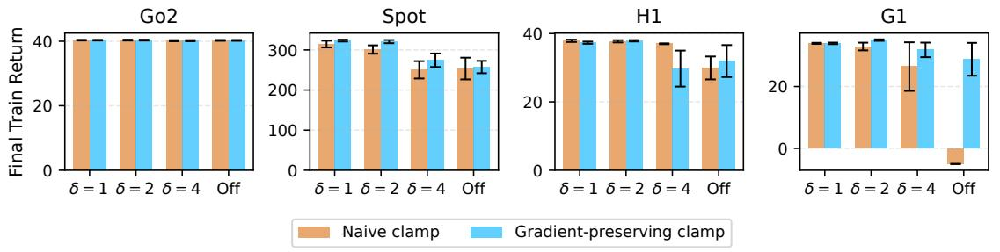

(a) Without CFM loss clamp.   
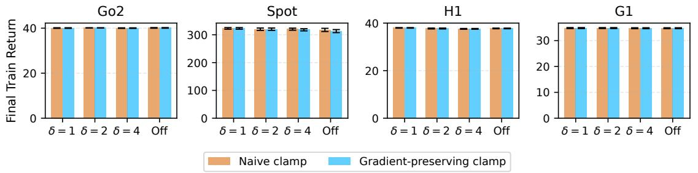  
(b) With CFM loss clamp.   
Fig. A.4: Clamping CFM losses helps stability. We present training returns for FPO++ runs after sweeping different CFM loss clamping, CFM loss difference clamping, and Huber loss configurations. The Huber loss is implemented by applying a Huber kernel to the CFM loss error. Orange bars indicate CFM differences clamped naively; blue bars indicate CFM differences clamped with straight-through gradients. Figure A.4a shows results without a clamp on the CFM losses (distinct from differences); Figure A.4b shows results with clamping on the CFM losses. Mean and standard error are computed over 5 seeds.

For our comparisons between FPO++, vanilla FPO, and two DPPO [8] variants in Figure 4, we adapt DPPO implementations from [1]. Some implementation details differ from the original DPPO implementation [8], for example, adopting velocity prediction instead of epsilon prediction [22]. This allowed comparisons between methods to be initialized from the same base policy and evaluated under more similar conditions. We extensively tuned baselines for fairness, sweeping over hyperparameters including PPO clipping thresholds, gradient norm clipping, and exploration noise scales. We present addition baselines in Appendix D.3.

# APPENDIX D MORE EXPERIMENTS

# D.1 Comparison with vanilla FPO for motion tracking

Figure A.5 shows the training curves for the motion-tracking policy that we deploy on the real G1 robot. As the plots illustrate, vanilla FPO initially learns but quickly collapses: the mean reward and episode length peak early and then deteriorate, while both the value loss and surrogate loss exhibit large spikes, indicating numerical instability. In contrast, FPO++ maintains stable value and policy losses throughout, continues improving monotonically, and successfully converges to the high-return policy used for real-world deployment. These curves provide evidence for a core motivation of our work: vanilla FPO is unstable on realistic, high-DoF robot control tasks, whereas the algorithmic components of FPO++ prevent collapse and enable successful sim-to-real transfer. We will release training code for reproducibility.

# D.2 Comparison with Gaussian PPO for motion tracking

FPO++ achieves stable sim-to-real transfer for complex and high-DoF motion tracking tasks. However, quantitative results in simulation show a slight performance gap when compared to highly tuned Gaussian PPO baselines in Figure A.6 (b).

We observed that while FPO++ often achieves slightly longer episode lengths, the Gaussian PPO baseline converges to higher total returns. We conjectured that this performance gap stems from the absence of explicit entropy regularization and KL-adaptive learning rates in the FPO++ algorithm. To investigate this, we conducted a two-part comparison:

• FPO++ vs. Simplified Baseline: When compared against a Gaussian PPO implementation without both entropy regularization and KL-adaptive learning rates, FPO++ demonstrates superior performance in both return and stability.   
• Impact of Regularization: When these features are added to both algorithms, the Gaussian PPO baseline achieves

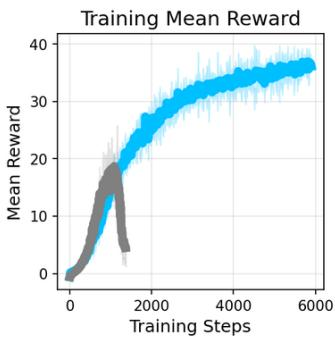

line

| Training Steps | Mean Reward |
| -------------- | ----------- |
| 0              | 0           |
| 1000           | 15          |
| 2000           | 25          |
| 3000           | 30          |
| 4000           | 35          |
| 5000           | 37          |
| 6000           | 38          |

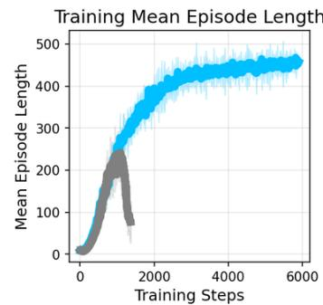

line

| Training Steps | Mean Episode Length |
| -------------- | ------------------- |
| 0              | 0                   |
| 1000           | 250                 |
| 2000           | 350                 |
| 3000           | 400                 |
| 4000           | 450                 |
| 5000           | 475                 |
| 6000           | 480                 |

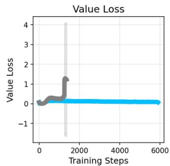

line

| Training Steps | Value Loss |
| -------------- | ---------- |
| 0              | 0.0        |
| 1000           | 0.5        |
| 2000           | 1.2        |
| 3000           | 0.1        |
| 4000           | 0.1        |
| 5000           | 0.1        |
| 6000           | 0.1        |

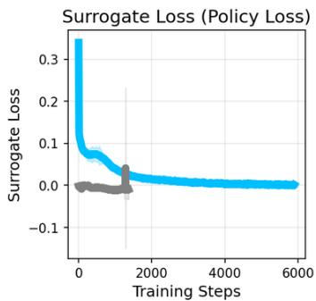

line

| Training Steps | Surrogate Loss |
| -------------- | -------------- |
| 0              | 0.3            |
| 1000           | 0.05           |
| 2000           | 0.02           |
| 3000           | 0.01           |
| 4000           | 0.01           |
| 5000           | 0.01           |
| 6000           | 0.01           |

FPO++ Vanilla FPO

Fig. A.5: Motion tracking training curves. Vanilla FPO fails in learning to track the motion, while FPO++ trains stably. Hyperparameters are shared between both runs.   
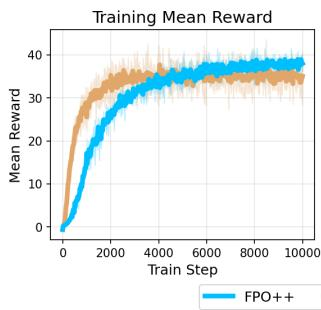

line

| Train Step | FPO++ | FPO++ Mean Reward |
| ---------- | ----- | ----------------- |
| 0          | 0     | 0                 |
| 2000       | 25    | 30                |
| 4000       | 35    | 38                |
| 6000       | 37    | 39                |
| 8000       | 38    | 39                |
| 10000      | 39    | 40                |

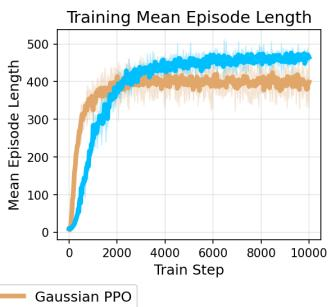

line

| Train Step | Gaussian PPO | Blue Line |
| ---------- | ------------ | --------- |
| 0          | 0            | 0         |
| 1000       | ~300         | ~350      |
| 2000       | ~380         | ~420      |
| 3000       | ~400         | ~450      |
| 4000       | ~410         | ~460      |
| 5000       | ~415         | ~470      |
| 6000       | ~420         | ~475      |
| 7000       | ~425         | ~480      |
| 8000       | ~430         | ~485      |
| 9000       | ~435         | ~490      |
| 10000      | ~440         | ~495      |

(a) Without entropy regularization or adaptive LR

line

| Train Step | FPO++ | FPO++ Mean Reward |
| ---------- | ----- | ----------------- |
| 0          | 0     | 0                 |
| 2000       | 30    | 35                |
| 4000       | 35    | 40                |
| 6000       | 38    | 42                |
| 8000       | 40    | 44                |
| 10000      | 42    | 45                |

line

| Train Step | Gaussian PPO | Blue Line |
| ---------- | ------------ | --------- |
| 0          | 0            | 0         |
| 1000       | ~300         | ~350      |
| 2000       | ~450         | ~470      |
| 3000       | ~460         | ~480      |
| 4000       | ~470         | ~485      |
| 5000       | ~475         | ~490      |
| 6000       | ~480         | ~495      |
| 7000       | ~485         | ~498      |
| 8000       | ~490         | ~500      |
| 9000       | ~495         | ~500      |
| 10000      | ~500         | ~500      |

(b) With entropy regularization and adaptive LR   
Fig. A.6: Training curves compared to Gaussian PPO for motion tracking. While FPO++ enables successful sim-to-real transfer, it currently achieves slightly lower returns than tuned Gaussian baselines.

higher peak returns. FPO++ maintains a slight advantage in episode length, but the overall return is lower.

Towards more rigorous comparison between FPO++ and Gaussian PPO baselines, we integrated simple entropy regularization and adaptive learning rate mechanisms into our FPO++ implementation.

Entropy regularization. To prevent entropy collapse and aid exploration, we employ a non-parametric Kozachenko-Leonenko estimator that approximates the differential entropy of the flow policy based on k-nearest neighbor distances between sampled actions. Flow policy entropy is then approximated by measuring local density via pairwise L2 distances.

KL-adaptive learning rate. We implemented a KLadaptive learning rate by approximating the Kullback-Leibler (KL) divergence between the current policy $\pi _ { \theta }$ and the old policy $\pi _ { \theta _ { \mathrm { o l d } } } .$ . We approximate this divergence by calculating the $L _ { 2 }$ distance between the predicted noise (ϵˆ) and the noise actually used in action sampling. ϵˆ is algebraically computed from velocity predictions and sampled actions.

While we found some improvement from these components, policy returns were still slightly lower than in standard Gaussian PPO. We hope to study them further in future work.

# D.3 Further comparisons with baselines in manipulation finetuning

We compare FPO++ with DPPO and ReinFlow [9] using the original implementations of these methods in Figure A.7. In this setting, we adapt our training pipeline to match their implementation details, including adopting an action chunk size of four, rather than sixteen, to align with the DPPO/ReinFlow formulation. We train FPO++ and vanilla FPO within this adapted codebase, and retrain DPPO and ReinFlow using the authors’ released code, using comparable base policies and evaluating all methods under the same simulation environments. This additional experiment allows for a further algorithmic comparison while controlling for implementation-specific factors.

Base policy setting. The base policies’ performance, reflected in the success rates at 0 total environment steps in Figure 4, provides the anchor for fine-tuning. FPO++ and Vanilla FPO share the same base policy, while DPPO and ReinFlow utilize different pre-trained policies structured according to their original papers. The policies for DPPO and ReinFlow were trained and evaluated using 100 denoising/flow steps, whereas the base policy for FPO++ and Vanilla FPO was trained and evaluated with 10 flow steps. The base policy success rates (evaluated on 1,000 episodes) are

• Can task: FPO++/ Vanilla FPO (73.76%), ReinFlow (76.3%), and DPPO (76.1%).   
• Square task: DPPO (37.6%), ReinFlow (36.5%), and FPO++/ Vanilla FPO (28.62%).

Analysis of fine-tuning performance. Figure A.7 shows fine-tuning success rates, evaluated by collecting 200 episodes per checkpoint using 50 parallel simulation environments. FPO++ achieves the highest final success rates on both the Can and Square tasks. On Can, FPO++ demonstrates rapid early learning, reaching high success significantly faster than all baselines. Notably, vanilla FPO also performs robustly in this fine-tuning setting, achieving competitive performance without the policy collapse or gradual degradation as observed in Figure 4. Nevertheless, FPO++ yields substantial gains over vanilla FPO, both in terms of convergence speed and final performance on the more challenging Square task, which requires higher-precision control.

line

| Env Step (M) | Robomimic CAN FPO++ | Robomimic CAN Vanilla FPO | Robomimic CAN DPPO | Robomimic CAN ReinFlow | Robomimic Square FPO++ | Robomimic Square Vanilla FPO | Robomimic Square DPPO | Robomimic Square ReinFlow |
| ------------ | ------------------- | ------------------------ | ------------------ | ---------------------- | --------------------- | ---------------------------- | --------------------- | ------------------------- |
| 0            | 0.64                | 0.64                     | 0.64               | 0.64                   | 0.30                  | 0.30                         | 0.30                  | 0.30                      |
| 1e6          | 0.96                | 0.96                     | 0.96               | 0.96                   | 0.75                  | 0.75                         | 0.75                  | 0.75                      |
| 2e6          | 0.97                | 0.97                     | 0.97               | 0.97                   | 0.85                  | 0.85                         | 0.85                  | 0.85                      |
| 3e6          | 0.97                | 0.97                     | 0.97               | 0.97                   | 0.90                  | 0.90                         | 0.90                  | 0.90                      |
| 4e6          | 0.97                | 0.97                     | 0.97               | 0.97                   | 0.92                  | 0.92                         | 0.92                  | 0.92                      |
| 5e6          | 0.97                | 0.97                     | 0.97               | 0.97                   | 0.93                  | 0.93                         | 0.93                  | 0.93                      |
| 6e6          | 0.97                | 0.97                     | 0.97               | 0.97                   | 0.94                  | 0.94                         | 0.94                  | 0.94                      |
| 7e6          | 0.97                | 0.97                     | 0.97               | 0.97                   | 0.95                  | 0.95                         | 0.95                  | 0.95                      |
| 8e6          | 0.97                | 0.97                     | 0.97               | 0.97                   | 0.96                  | 0.96                         | 0.96                  | 0.96                      |
| 9e6          | 0.97                | 0.97                     | 0.97               | 0.97                   | 0.97                  | 0.97                         | 0.97                  | 0.97                      |
| 1e6          | 0.97                | 0.97                     | 0.97               | 0.97                   | 0.98                  | 0.98                         | 0.98                  | 0.98                      |
| Final        | ~0.97               | ~0.97                    | ~0.97              | ~0.97                  | ~0.98                 | ~0.98                        | ~0.98                 | ~0.98                     |
| Final        (approx.) - Robomimic CAN: FPO++ / Vanilla FPO: DPPO / ReinFlow: Robomimic Square: Robomimic Square: Final values for each dataset are shown in separate panels.

Fig. A.7: Additional Manipulation Comparison. Fine-tuning success rates on the RoboMimic Can and Square tasks for flow-based RL methods. All methods start from pre-trained behavior-cloning base policies; FPO++ and Vanilla FPO share the same base policy, while DPPO and ReinFlow use architectures and implementation from their original papers. Please refer to the base policy setting written in the text for further details. FPO++ learns fastest and attains the highest final success on both tasks, while Vanilla FPO, DPPO, and ReinFlow remain stable but underperform relative to FPO++.

# D.4 Detailed analysis on Robomimic can experiment

Although the DPPO paper reports high success rates on the Can task, our experiments in the main text show DPPO variants struggling. We attribute this discrepancy to differences between base policies.

As illustrated in Figure A.8, our flow-based base policy exhibits a high success rate when evaluated with zero-sampling. However, the success rate under the random sampling used for exploration during training is significantly lower. As a result, very few trajectories successfully reach the goal in each rollout phase. Combined with rewards only provided at the end of rollouts, this results in high gradient variance.

We find that FPO++ and vanilla FPO are relatively robust to this high-variance learning regime, while DPPO variants degrade substantially. In particular, although all methods begin from the same base policy and therefore share the same initial success rate under random sampling, FPO-based methods achieve noticeably higher training returns early in fine-tuning, providing sufficient reward signal for stable policy-gradient updates. In contrast, DPPO introduces additional stochasticity by injecting noise at each diffusion timestep during training, which further reduces the probability that rollouts reach the task completion state and leads to near-zero returns for a large fraction of trajectories. This exacerbates gradient noise and prevents effective learning in the early stages of training. As shown in the bottom row of Figure A.8, when the base policy’s random sampling success rate is high enough (64.06%) to provide consistent initial rewards, DPPO variants succeed in fine-tuning the policy and achieving competitive success rates.

# D.5 Ablation study for manipulation finetuning

In our main manipulation fine-tuning experiments, we observed that while FPO++ consistently outperforms baselines, specific algorithmic components contribute differently to success than they do in the from-scratch locomotion setting.

We conducted an ablation study across two manipulation tasks: the Robomimic Square task and the DexMimicGen Threading task. These tasks both involve insertion, requiring high-precision control, and demonstrated a meaningful performance margin between FPO++ and vanilla FPO. As illustrated in Figure A.9, while the per-sample ratio consistently benefits FPO++ as it does in locomotion, the ASPO trust region is detrimental for manipulation fine-tuning.

We attribute the relative underperformance of ASPO in finetuning to two primary factors. (i) Exploration Requirements: ASPO is designed to preserve entropy, which is most beneficial for tasks requiring extensive exploration to discover emergent behaviors, such as new gaits in locomotion. In finetuning, where policies are already well-initialized via behavior cloning, increased entropy may instead introduce undesirable behaviors. (ii) Variational Gap Stability: ASPO helps stabilize training by upper-bounding the growth of the variational gap. This stabilization may be less critical when starting from a pretrained flow policy that already models a high-quality action distribution.

# APPENDIX E FULL ACTION SPACE FLOW FIELD

In addition to the qualitative analysis presented in the main text, we provide visualizations of the flow fields across the full action space (19 DoF) for the H1 humanoid’s velocityconditioned locomotion task. These supplementary figures illustrate the impact of the trust region objective on the policy distribution at different stages of training. Specifically, the FPO++ policy trained with the standard PPO trust region exhibits a clear narrowing of the action distribution (entropy collapse) as performance degrades, evident when comparing the field at its reward peak (Figure A.10) to the field during collapse (Figure A.11). In contrast, the policy trained with the ASPO trust region maintains a broader, more exploratory distribution, consistently preserving entropy from an intermediate checkpoint (Figure A.12) to its final, converged state (Figure A.13). This shows how the asymmetric objective prevents entropy collapse. For visualization, we plotted the transporting trajectories of the prior Gaussian noise to the action space by sampling 10,000 noises per state and using 8 discretized Euler integration steps.

  
FPO++ Vanilla FPO DPPO - fixed noise DPPO - learned noise

Fig. A.8: Analysis of base policy quality in Robomimic CAN. This figure illustrates how the initial success rate of the base policy impacts different fine-tuning methods. The top row shows results for a base policy with 71.35% success under zero-sampling versus 10.00% under random sampling, while the bottom row depicts a higher-quality base policy (96.11% zero-sampling / 64.36% random sampling), demonstrating that DPPO variants are significantly more sensitive to the base policy quality.   

line

| Env Step (M) | Square - FPO++ with PPO | Square - FPO++ with per-action ratio | Square - FPO++ with ASPO | Threading - FPO++ with PPO | Threading - FPO++ with per-action ratio | Threading - FPO++ with ASPO | Random Sampling - FPO++ with PPO | Random Sampling - FPO++ with per-action ratio | Random Sampling - FPO++ with ASPO |
| ------------ | ------------------------ | ------------------------------------- | ------------------------ | --------------------------- | ---------------------------------------- | --------------------------- | ------------------------------- | --------------------------------------------- | --------------------------------- |
| 0            | 0.3                      | 0.25                                  | 0.2                      | 0.2                         | 0.25                                     | 0.25                        | 0.3                             | 0.3                                           | 0.3                               |
| 2.5e6        | 0.5                      | 0.7                                   | 0.4                      | 0.7                         | 0.7                                      | 0.7                         | 0.45                            | 0.45                                          | 0.45                              |
| 5.0e6        | 0.6                      | 0.85                                  | 0.5                      | 0.85                        | 0.85                                     | 0.85                        | 0.5                             | 0.5                                           | 0.5                               |
| 7.5e6        | 0.6                      | 0.9                                   | 0.6                      | 0.9                         | 0.9                                      | 0.9                         | 0.6                             | 0.6                                           | 0.6                               |
| 1e6          | 0.6                      | 0.95                                  | 0.6                      | 0.95                        | 0.95                                     | 0.95                        | 0.6                             | 0.6                                           | 0.6                               |

Fig. A.9: Ablation study in manipulation tasks. We evaluate the impact of FPO++ design choices on fine-tuning performance. The blue curve represents our primary FPO++ configuration (per-sample ratio with PPO objective) used in the main text for manipulation finetuning. The light gray curve denotes FPO++ using the PPO objective with the per-action ratio. The dark gray curve denotes FPO++ using the persample ratio and the ASPO objective. The per-sample ratio consistently improved results across benchmarks. While the ASPO objective was critical for locomotion experiments, it reduced performance in these finetuning runs.

Fig. A.10: FPO++ with PPO clipping at peak performance. Policy flow field density for the Unitree H1 humanoid trained using the standard PPO trust region, captured at the point of maximum average return. The flow is still relatively broad, indicating adequate exploration.   
  
Fig. A.11: FPO++ with PPO clipping during policy collapse after convergence. Policy flow field density for the Unitree H1 humanoid trained using the standard PPO trust region, captured as the average return begins to collapse. The action distribution has narrowed significantly for many joints, demonstrating the entropy collapse that leads to instability and performance degradation.

Fig. A.12: FPO++ with ASPO objective at intermediate training stage. Policy flow field density for the Unitree H1 humanoid trained using the entropy-preserving ASPO objective, captured at an intermediate stage where the average return matches the peak average return of FPO++ with the standard PPO trust region. This distribution is already wider and more exploratory than the PPO-clipped policy at a similar or later time step, contributing to stable training.   
  
Fig. A.13: FPO++ with ASPO objective at converged state. Policy flow field density for the Unitree H1 humanoid trained using the ASPO objective, captured at its final, high-reward converged state. The distribution remains wide and exploratory, confirming that ASPO effectively preserves entropy and prevents the collapse observed with PPO clipping.