# Real-Time Execution of Action Chunking Flow Policies

Kevin Black1,2, Manuel Y. Galliker1 Sergey Levine1,2 1Physical Intelligence 2UC Berkeley {kevin,manuel,sergey}@physicalintelligence.company

## Abstract

Modern AI systems, especially those interacting with the physical world, increasingly require real-time performance. However, the high latency of state-of-the-art generalist models, including recent vision-language-action models (VLAs), poses a significant challenge. While action chunking has enabled temporal consistency in high-frequency control tasks, it does not fully address the latency problem, leading to pauses or out-of-distribution jerky movements at chunk boundaries. This paper presents a novel inference-time algorithm that enables smooth asynchronous execution of action chunking policies. Our method, real-time chunking (RTC), is applicable to any diffusion- or flow-based VLA out of the box with no re-training. It generates the next action chunk while executing the current one, “freezing” actions guaranteed to execute and “inpainting” the rest. To test RTC, we introduce a new benchmark of 12 highly dynamic tasks in the Kinetix simulator, as well as evaluate 6 challenging real-world bimanual manipulation tasks. Results demonstrate that RTC is fast, performant, and uniquely robust to inference delay, significantly improving task throughput and enabling high success rates in precise tasks—such as lighting a match—even in the presence of significant latency. See https://pi.website/research/real\_time\_chunking for videos.

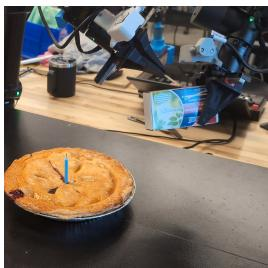

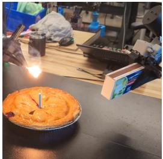

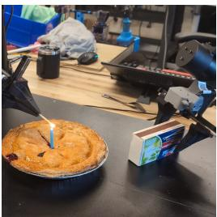

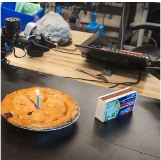

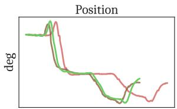

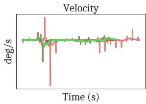

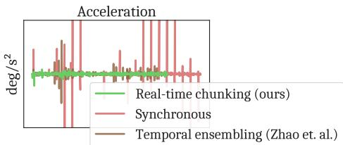  
Figure 1: Top: Real-time chunking (RTC) enables the robot to perform highly dexterous and dynamic tasks, such as lighting a match—even in the presence of inference delays in excess of 300 milliseconds, corresponding to more than 30% of the model’s prediction horizon. Bottom: RTC performs the same robot motion 20% faster than synchronous inference [5, 30, 8, 24, 31, 59], and smoother than all competing methods, including temporal ensembling [68]. The shown positions, velocities, and accelerations correspond to the shoulder joint of one arm, and are taken from the first 10 seconds of a real autonomous match-lighting rollout.

## 1 Introduction

As AI systems have become more capable, they have also interacted more and more directly with their environment. Whether they’re executing terminal commands [45], playing Pokémon on livestream [20], or browsing the web on your behalf [65], recent advances—driven primarily by large-scale deep learning—have enabled these systems to increasingly control, rather than merely process, the vast heterogeneity of the outside world. Embodied agents, where machine learning models directly control real, physical constructs, are perhaps the quintessential example. The same advances fueling agentic language and vision models are also making great strides in physical intelligence on platforms ranging from humanoid robots [4] to autonomous cars [60].

Cyber-physical systems, unlike chatbots and image generators, always operate in real time. While a robot is “thinking”, the world around it evolves according to physical laws. Thus, delays between inputs and outputs have a tangible impact on performance. For a language model, the difference between fast and slow generation is a satisfied or annoyed user; for a robot action model, on the other hand, it could be the difference between a robot handing you a hot coffee or spilling it in your lap.

Unfortunately, the effectiveness of modern large-scale machine learning comes with high latency as an unavoidable side effect. Large language models (LLMs), vision-language models (VLMs), and vision-language-action models (VLAs)—the last referring to a class of models designed for visuomotor control—have billions of parameters [8, 30, 5, 4, 58]. These models are not only slow to run, but also require heavy-duty hardware that is difficult to attach to edge devices such as mobile robots, adding even more overhead for remote inference. Edge hardware will improve over time, but as robot datasets grow in size, so will the best VLAs [28].

Thus, applying large models to real-time control problems effectively will require some form of asynchronicity: that is, a model must think about its future actions while executing a previous one. Action chunking [68, 33, 11], where a model outputs and executes a sequence of multiple actions for each inference call, presents a partial solution. Although action chunking has already achieved many state-of-the-art results in dexterous manipulation [5, 4, 58], it still suffers from the latency problem. Chunking sacrifices the reactivity of a system to external stimuli and also introduces discontinuities in the transition points between chunks, as adjacent chunks may jump between different modes (or “strategies”) from the learned action distribution. Such anomalies are especially harmful to learning-based systems, as they produce a distribution shift in dynamics that the model is likely not equipped to handle. Naive smoothing strategies, such as averaging multiple predictions together [68], are not guaranteed to produce valid actions and may only make matters worse (e.g., see Figure 2).

A good real-time system must produce a consistent and continuous control signal, incorporating the latest observations without perturbing the environment’s natural dynamics or the model’s ability to produce correct actions. In this work, we present real-time chunking (RTC), which poses asynchronous action chunking as an inpainting problem. Our algorithm generates the next action chunk while executing the previous one, freezing the actions that are guaranteed to be executed (due to inference delay) and “inpainting” the rest. It is applicable to any diffusion- [22] or flow-based [36] VLA, and operates purely at inference time, requiring no changes to existing training recipes.

Our contributions are as follows. First, we present a novel system for asynchronous, real-time inference of action chunking diffusion- or flow-based policies for continuous control. Since standard simulation benchmarks are quasi-static—and have mostly been saturated with pseudo open-loop inference strategies [11]—we devise a new benchmark based on the Kinetix simulator [43] consisting of 12 highly dynamic manipulation and locomotion tasks. In the real world, we evaluate RTC on 6 challenging bimanual manipulation tasks using the $\pi _ { 0 . 5 } \ \mathrm { V L A }$ [24] as the base policy. Across both simulation and the real world, we demonstrate that RTC is fast and performant; it is uniquely robust to inference latency, even in highly precise tasks such as lighting a match (Figure 1), and it achieves greatly improved task throughput on all real tasks.

## 2 Preliminaries and Motivation

We begin with an action chunking policy denoted by $\pi ( \mathbf { A } _ { t } | \mathbf { o } _ { t } )$ , where $\mathbf { A } _ { t } = [ \mathbf { a } _ { t } , \mathbf { a } _ { t + 1 } , . . . , \mathbf { a } _ { t + H - 1 } ]$ is a chunk of future actions, $\mathbf { o } _ { t }$ is an observation, and t indicates a controller timestep. We call H the prediction horizon. When action chunking policies are rolled out, only the first $s \leq H$ actions from each chunk are executed. We call s the execution horizon; often it is shorter than the prediction horizon, but still much greater than $1 \ ( { \mathrm { e . g . } } , s \approx H / 2$ [11, 5, 24]). Chunked execution ensures temporal consistency at the expense of reactivity. A long execution horizon reduces a policy’s responsiveness to new information, while a short one increases the likelihood of mode-jumping, jerky behavior resulting from discontinuities between chunks.

In this paper, we consider policies trained with conditional flow matching [36], though our method can also be used with diffusion policies by converting them to flow policies at inference time [48, 18]. To generate an action chunk from a flow policy, random noise ${ \bf A } _ { t } ^ { 0 }$ is first sampled from a standard Gaussian, and then the flow’s velocity field, $\mathbf { v } _ { \pi }$ (a learned neural network) is integrated from $\tau = 0$ to 1 using the update rule

$$
\mathbf {A} _ {t} ^ {\tau + \frac {1}{n}} = \mathbf {A} _ {t} ^ {\tau} + \frac {1}{n} \mathbf {v} _ {\pi} (\mathbf {A} _ {t} ^ {\tau}, \mathbf {o} _ {t}, \tau),\tag{1}
$$

where $\tau \in [ 0 , 1 )$ ) denotes a flow matching timestep, and n determines the number of denoising steps.

Now, let $\Delta t$ be sampling period of the controller, i.e., the duration of a controller timestep, and let δ be the time it takes for the policy to generate an action chunk. We say that a system is real-time if it is guaranteed to produce a response (in our case: ${ \bf a } _ { t } )$ to an event (receiving $\mathbf { o } _ { t } )$ within a fixed time constraint (∆t). $\mathrm { I f ~ } \delta \leq \Delta t .$ , then meeting the real-time constraint is trivial, since an entire chunk can be generated between two controller timesteps. However, this is near impossible to achieve with modern VLAs. For example, with an RTX 4090 GPU, the 3 billion parameter $\pi _ { 0 }$ VLA spends 46ms on the KV cache prefill alone, before any denoising steps [5], and targets a 50Hz control frequency $( \Delta t = 2 0 \mathrm { m s } )$ . Run in remote inference for mobile manipulation, $\pi _ { 0 }$ lists 13ms of network latency, in perfect conditions with a wired connection. In a more realistic setting, the network overhead alone could easily exceed 20ms. Kim et al. [31], who optimize the 7B OpenVLA model [30] specifically for inference speed, achieve no better than 321ms of latency on a server-grade A100 GPU.

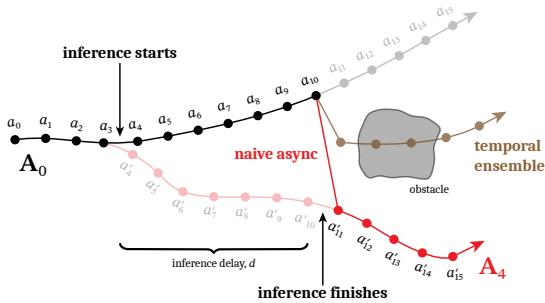  
Figure 2: An illustration of a typical bifurcation between consecutive chunks. Inference is started between timesteps 3 and 4. The original chunk that was executing, $\left\{ { { a } _ { t } } \right\}$ (black), had planned to go above the obstacle while the newly generated chunk $\left\{ a _ { t } ^ { \prime } \right\}$ (red) goes below the obstacle. However, $\left\{ a _ { t } ^ { \prime } \right\}$ is not available until $d = 7$ steps later. A naive asynchronous algorithm might jump from $a _ { 1 0 }$ to $a _ { 1 1 } ^ { \prime }$ , inducing a very high, outof-distribution acceleration. Temporal ensembling [68], i.e., interpolating between chunks, reduces the acceleration but produces poor actions.

Naive synchronous inference, the default in many prior works [5, 30, 8, 24, 31, 59], simply starts inference at the end of the execution horizon and waits while the policy generates the next chunk. When $\delta > \Delta t$ , this introduces visible pauses between chunks that not only slow down execution but also change the dynamics of the robot, introducing distribution shift between training and evaluation. To develop a real-time strategy, we must first introduce asynchronous inference, where inference is started early and happens concurrently with execution.

We define $d : = { \lvert \delta / \Delta t \rvert }$ and call this quantity the inference delay, corresponding to number of controller timesteps between when $\mathbf { o } _ { t }$ is received and when $\mathbf { A } _ { i }$ t is available.1 Let $\mathbf { a } _ { t ^ { \prime } | t }$ denote the $( t ^ { \prime } - t ) \cdot \mathrm { t h }$ action of chunk $\mathbf { A } _ { t } ,$ generated from observing $\mathbf { o } _ { t } . \mathrm { ~ I f ~ } \mathbf { A } _ { 0 }$ is currently executing, and we desire an execution horizon of s, then an asynchronous algorithm must start inference at $s - d .$ So long as $d \leq H - s ,$ , then this strategy will satisfy the real-time constraint and guarantee that an action is always available when it is needed. However, since the policy cannot know what will happen between steps $s - d$ and s while generating $\mathbf { A } _ { s - d } ,$ the transition point between $\mathbf { a } _ { s - 1 | 0 }$ and $\mathbf { a } _ { s \mid s - d }$ may be arbitrarily discontinuous and out-of-distribution. Similar to a too-short execution horizon, this strategy leads to jerky behavior that is worsened dramatically with higher delays; see Figure 2.

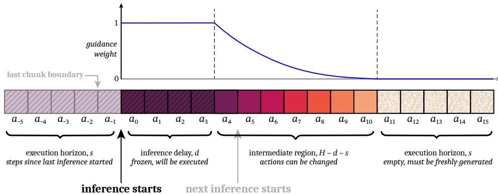  
Figure 3: A diagram illustrating how action generation attends to the previous action chunk in real-time chunking. If inference starts after the execution of $a \mathrm { - } 1$ and the inference delay is $d = 4 ,$ , then the newly generated chunk will not be available until after $a _ { 3 }$ is consumed. Therefore, $a _ { 0 : 3 }$ are “frozen” and are attended to with a full guidance weight of 1. In the intermediate region, $a _ { 4 : 1 0 } ,$ , actions from the previous chunk are available but may be updated, since inference will have finished before a4 is needed. This region is attended to with an exponentially decreasing guidance weight. Finally, the last $s = 5$ actions are beyond the end of the previous chunk, and need to be freshly generated. The execution horizon, s, is a hyperparameter constrained by $d \leq s \leq H - d .$

## 3 Real-Time Chunking via Inpainting

The key challenge in real-time execution is to maintain continuity between chunks. By the time a new chunk is available, the previous one has already been executed partway, and therefore the new chunk must be “compatible” with the previous one. At the same time, the new chunk should still incorporate new observations, so that the policy does not lose the ability to react and make corrections.

Our key insight is to pose real-time chunking as an inpainting problem. To make the new chunk “compatible”, we must use the overlapping timesteps where we have access to the remaining actions of the previous chunk. The first d actions from the new chunk cannot be used, since those timesteps will have already passed by the time the new chunk becomes available. Thus, it makes sense to “freeze” those actions to the values that we know will be executed; our goal is then to fill in the remainder of the new chunk in a way that is consistent with this frozen prefix (see Figure 3), much like inpainting a section of an image that has been removed. We describe this basic inpainting principle in Sec. 3.1. In Sec. 3.2, we introduce a soft masking extension that is critical for full cross-chunk continuity; finally, we describe our full real-time chunking system in Sec. 3.3.

## 3.1 Inference-Time Inpainting with Flow Matching

Inpainting is a known strength of iterative denoising frameworks such as diffusion and flow matching. We build on the training-free image inpainting algorithm from Pokle et al. [48], which is itself based on pseudoinverse guidance (ΠGDM; [55]). The algorithm operates by adding a gradient-based guidance term to the learned velocity field v at each denoising step (Equation 1) that encourages the final generation to match some target value, Y, which is a corrupted version of the desired result. In the case of image inpainting, the corruption operator is masking, Y is the masked image, and the desired result is a full image consistent with $\dot { \mathbf { Y } }$ in the non-masked areas. The ΠGDM gradient correction, specialized to our setting, is given by

$$
\mathbf {v} _ {\Pi G D M} (\mathbf {A} _ {t} ^ {\tau}, \mathbf {o} _ {t}, \tau) = \mathbf {v} (\mathbf {A} _ {t} ^ {\tau}, \mathbf {o} _ {t}, \tau) + \min \left(\beta , \frac {1 - \tau}{\tau \cdot r _ {\tau} ^ {2}}\right) \left(\mathbf {Y} - \widehat {\mathbf {A} _ {t} ^ {1}}\right) ^ {\top} \operatorname{diag} (\mathbf {W})   \frac {\partial \widehat {\mathbf {A} _ {t} ^ {1}}}{\partial \mathbf {A} _ {t} ^ {\tau}}\tag{2}
$$

$$
\mathrm{where} \widehat {\mathbf {A} _ {t} ^ {1}} = \mathbf {A} _ {t} ^ {\tau} + (1 - \tau) \mathbf {v} (\mathbf {A} _ {t} ^ {\tau}, \mathbf {o} _ {t}, \tau),\tag{3}
$$

$$
r _ {\tau} ^ {2} = \frac {(1 - \tau) ^ {2}}{\tau^ {2} + (1 - \tau) ^ {2}}.\tag{4}
$$

$\widehat { \mathbf { A } _ { t } ^ { 1 } }$ is an estimate of the final, fully denoised action chunk and W is the mask. We are abusing notation by treating $\mathbf { Y } , \mathbf { A } _ { t } ,$ and W as vectors of dimension HM where M is the dimension of each action. Thus, the guidance term is a vector-Jacobian product and can be computed using backpropagation. The guidance weight clipping, $\beta ,$ is our addition; we found that without it, the algorithm became unstable with the small number of denoising steps commonly used in control problems (see A.2 for an ablation).

## 3.2 Soft Masking for Improved Cross-Chunk Continuity

In practice, naively inpainting using only the first d timesteps of the previous action chunk is often insufficient to ensure that the new chunk takes a consistent strategy, particularly when d is small (e.g., see Figure 4). The ΠGDM correction is not perfect, and a small d leads to a weak guidance signal, which can allow for the new chunk to still switch strategies and cause discontinuities. Our solution, illustrated in Figure ${ \bar { 3 } } ,$ is to give our policy more crosschunk continuity by considering not just the first d overlapping actions, but all $\dot { H } - s$ overlapping actions. We do this via soft masking, setting W to real-valued weights rather than 1s and 0s. The first d actions get a weight of 1; the last s actions of the new chunk do not overlap with the previous chunk, so they get a weight of 0; the actions in between get weights that exponentially decay from 1 to 0, accounting for the fact that actions further in the future should be treated with more uncertainty. The resulting expression for W is given by

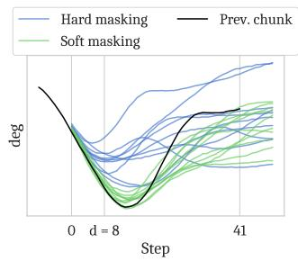  
Figure 4: A comparison of naive inpainting (hard masking) and our proposed soft masking method: note that hard masking does not match the frozen region very well and produces faster changes in direction.

$$
\mathbf {W} _ {i} = \left\{ \begin{array}{l l} 1 & \text { if } i <   d \\ c _ {i} \frac {e ^ {c _ {i}} - 1}{e - 1} & \text { if } d \leq i <   H - s \\ 0 & \text { if } i \geq H - s \end{array} \right. \quad \text { where } c _ {i} = \frac {H - s - i}{H - s - d + 1}, i \in \{0, \ldots , H - 1 \}.\tag{5}
$$

Intuitively, W modulates the “attention” paid to each corresponding action from the previous chunk. See Appendix A.4 for a comparison between different decay schedules.

## 3.3 Real-Time Chunking

We present our full real-time chunking system in Algorithm 1 (complemented by Figure 3). The controller interfaces with our algorithm via GETACTION, which is called every ∆t to consume an action $\mathbf { a } _ { t - 1 }$ and provide the next observation $\mathbf { o } _ { t }$ . The INFERENCELOOP runs in a background thread so that an action is always available. It forecasts the next delay, d, by keeping a buffer of past delays. The execution horizon, s, can change from chunk to chunk; the user provides a minimum desired horizon, $s _ { \mathrm { m i n } } .$ , and the actual horizon for a given chunk is max $\mathrm { : } ( d , s _ { \mathrm { m i n } } )$ where d is the delay encountered when computing the next chunk. Finally, the algorithm describes the inpainting with soft masking procedure in GUIDEDINFERENCE, which explicitly defines a denoising function (Eq. 3) and computes a vector-Jacobian product, which can be done with reverse-mode autodifferentiation [2].

Algorithm 1 Real-Time Chunking
Require: flow policy π with prediction horizon H, minimum execution horizon  $s_{min}$ , mutex M, condition variable C associated with M, initial chunk  $A_{init}$ , initial delay estimate  $d_{init}$ , delay buffer size b, number of denoising steps n, maximum guidance weight β
1: procedure INITIALIZESHAREDSTATE ▷ Initialize mutex-protected shared variables
2:  $t = 0; A_{cur} = A_{init}, o_{cur} = null$ 
3: function GETACTION( $o_{next}$ ) ▷ Called at an interval of  $\Delta t$  by controller
4: with M acquired do
5:  $t = t + 1$ 
6:  $o_{cur} = o_{next}$ 
7: notify C
8: return  $A_{cur}[t - 1]$

9: procedure INFERENCELOOP ▷ Run inference in a looping background thread
10: acquire M
11: Q = new Queue([dinit], maxlen=b) ▷ Holds a limited buffer of past inference delays
12: loop
13: wait on C until t ≥ smin
14: s = t ▷ s is the number of actions executed since last inference started
15: A$_{prev}$ = A$_{cur}$[s, s + 1, ..., H - 1] ▷ Remove the s actions that have already been executed
16: o = o$_{cur}$
17: d = max(Q) ▷ Estimate the next inference delay conservatively
18: with M released do
19: A$_{new}$ = GUIDEDINFERENCE(π, o, A$_{prev}$, d, s)
20: A$_{cur}$ = A$_{new}$ ▷ Swap to the new chunk as soon as it is available
21: t = t - s ▷ Reset t so that it indexes into A$_{new}$
22: enqueue t onto Q ▷ Record the observed delay
23: function GUIDEDINFERENCE(π, o, A$_{prev}$, d, s)
24: compute W using Eq. 5; right-pad A$_{prev}$ to length H; initialize A$^{0}$ ~ N(0, I)
25: for τ = 0 to 1 with step size 1/n do
26: f$_{\widehat{A^{1}}}$ = A' ↦ A' + (1 - τ)v$_{\pi}$(A', o, τ) ▷ Define denoising function (Eq. 3)
27: e = (A$_{prev}$ - f$_{\widehat{A^{1}}}$(A$^{\tau}$)$^{T}$ diag(W) ▷ Weighted error term from Eq. 2
28: g = e · ∂f$_{\widehat{A^{1}}}$ | A' = A$^{\tau}$ ▷ Compute vector-Jacobian product from Eq. 2 via autodiff
29: A$^{\tau+ \frac{1}{n}}$ = A$^{\tau}$ + $\frac{1}{n}$ (v$_{\pi}$(A$^{\tau}$, o, τ) + min (β, $\frac{1-\tau}{\tau \cdot r_{\tau}^{2}}$) g) ▷ Integration step (Eq. 1)
return A$^{1}$

## 4 Experiments

In our experiments, we aim to answer the following questions. First, how does RTC compare to existing methods in highly dynamic and stochastic environments, and under increasing inference delays? Second, how important is soft masking (Sec. 3.2) to RTC? Third, how does RTC affect the performance and speed of real-world dexterous robots?

We first evaluate RTC using a benchmark of 12 highly dynamic and stochastic environments in the Kinetix [43] simulator. We use this benchmark to compare the performance of RTC to other methods under simulated inference delays, as well as investigate the effect of soft masking. Then, using the $\pi _ { 0 . 5 } { \mathrm { V L A } } \left[ 2 4 \right]$ as the base model, we evaluate the performance and speed of RTC on 6 challenging bimanual dexterous manipulation tasks, including 2 mobile manipulation tasks.

## 4.1 Simulated Benchmark

Most simulated imitation learning benchmarks are quasi-static, and standard chunked execution with a long enough execution horizon can achieve near-perfect success rates [11]. We instead create a benchmark of 12 dynamic tasks in Kinetix [43], which uses force-based control, so inference delay necessitates asynchronous execution (there is no concept of “holding position”). We select 10 existing environments and create 2 new ones such that all environments involve dynamic motions like throwing, catching, and balancing. To simulate imperfect actuation, we add Gaussian noise to the actions, making closed-loop corrections crucial for success.

Setup. To generate data for imitation learning, we first train expert policies using RPO [50] and a binary success reward. For each environment, we train 6 expert policies with different seeds and then generate a 1M transition dataset with a different policy selected each episode. We then train action chunking flow policies with a prediction horizon of $H = 8$ and a 4-layer MLP-Mixer [61] architecture for 32 epochs. We report binary success rates with 2048 rollouts per data point, and simulate delays between 0 (fully closed-loop) and 4 (the maximum supported when $H = 8 )$

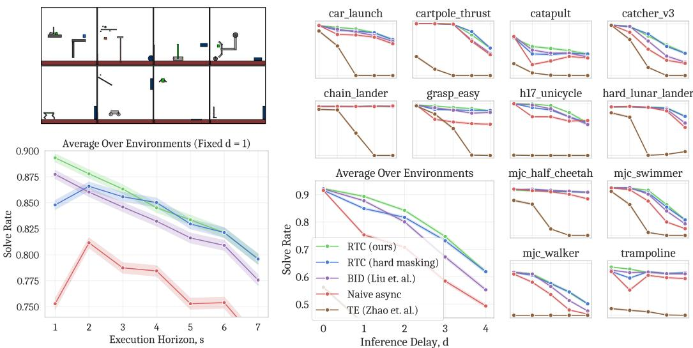  
Figure 5: Top left: Kinetix environments; each involves getting a green object on the left to touch a blue one on the right. Bottom left: Execution horizon vs. solve rate with a fixed inference delay of 1. Only RTC and BID take full advantage of faster updates, showing strictly increasing performance with decreasing execution horizon. Right: Inference delay vs. solve rate with a fixed execution horizon of $s = \operatorname* { m a x } ( d , 1 )$ ). RTC outperforms all baselines. Furthermore, soft masking (Sec. 3.2) improves performance at lower inference delays and execution horizons. Each data point represents 2048 trials, and 95% Wilson score intervals are shaded in.

Baselines. We compare against the following baselines:

• Naive async. This strategy does not pay attention to the previous action chunk at all when generating a new one, naively switching chunks as soon as the new one is ready.

• Bidirectional decoding $( B I D ; [ 3 9 ] )$ . This strategy uses rejection sampling to keep continuity across chunks. We use a batch size of $N = 3 2$ , mode size of $K = 3$ , and a checkpoint trained for 8 epochs as the weak policy.

• Temporal ensembling (TE; [68]). This strategy involves keeping a buffer of predicted action chunks and executing an average of all actions predicted for a particular timestep.

Results. Figure 5 shows the simulated results. In the delay plots (right): TE performs poorly across the board, even with an inference delay of $d = 0 ,$ , illustrating the multi-modality of our benchmark— averages of valid actions are not necessarily valid. RTC shows the most robustness to inference delays, outperforming BID, and the gap widens with increasing delay; note that BID uses significantly more compute than RTC by sampling batches of 64 action chunks, 32 from a strong model and 32 from a weak model. Additionally, we find that hard masking somewhat underperforms soft masking, particularly when d is smaller, supporting our claims in Sec. 3.2. Finally, in the execution horizon plot (left), we find that thanks to its continuity across chunks, RTC is better able to take advantage of closed-loop corrections, always performing better with a decreasing execution horizon.

## 4.2 Real-World Results

Next, we deploy our full real-time chunking system to the real world. We use the $\pi _ { 0 . 5 } { \mathrm { V L A } }$ [24] as our base policy, and evaluate RTC on a bimanual system with two 6-DoF arms and parallel jaw grippers. Unlike our simulated benchmark, the robots use position control, and so synchronous inference— stopping between chunks—is a reasonable default strategy, used in many prior works [5, 24, 31, 47]. Our goal is to improve upon synchronous inference in a combination of both performance and speed.

Setup. We use $\pi _ { 0 . 5 } \ : ( H = 5 0 , \Delta t = 2 0 \mathrm { m s } )$ with $n = 5$ denoising steps, giving a model latency of 76ms for the baselines and 97ms for RTC. We use remote inference over LAN, which adds 10-20ms of latency, giving a starting inference delay around $d \approx 6$ for RTC. However, we would like to understand how the system behaves with higher inference latencies, simulating, e.g., scaling up the model size or running inference on a distant cloud server. Thus, we also evaluate all methods with +100ms and +200ms of injected latency, corresponding to d $\approx 1 1$ and $d \approx 1 6$ , respectively.

Tasks and scoring. Each episode gets an integer score corresponding to how many substeps of the task it completed successfully. We evaluate the following tasks:

• Light candle (5 steps, 40s cutoff). Pick up a match and matchbox, strike the match, use it to light a candle, and drop it in a bowl.

• Plug ethernet (6 steps, 120s cutoff). Pick up the end of an ethernet cable, reorient it, plug it into a server rack, and repeat the process for the other end.

• Make bed, mobile (3 steps, 200s cutoff). Move the corner of a blanket and 2 pillows from the foot to the head of a bed.

• Shirt folding (1 step, 300s cutoff). Fold a shirt from a flattened position.

• Batch folding (4 steps, 300s cutoff). Take a varied, crumpled clothing item out of a bin, flatten it, fold it, then place it neatly on a pile.

• Dishes in sink, mobile (8 steps, 300s cutoff). Move 4 varied items from a counter into a sink.

See the accompanying blog post for videos of each task. We evaluate each task and method for 10 trials for a total of 480 episodes, adding up to 28 hours of pure robot execution time. We also post-hoc annotate the score for each episode and the timestamp at which each step is achieved.

Baselines. We compare to the following baselines:

• Synchronous. This corresponds to the default inference strategy in prior work [5, 24, 31, 47], which executes s = 25 actions and then pauses while the new chunk is generated.

• TE, sparse. This is similar to naive async in our simulated results; it executes s = 25 actions at a time while computing the next chunk in parallel. We found it significantly reduced jerkiness to also apply TE, even though only the first H − s − 2d executed steps of each chunk have overlapping actions to ensemble.

• TE, dense. This strategy is the closest to the original TE in Zhao et al. [68]. We run inference as often as possible, resulting in s = d for every chunk. This results in there always being at least 2 overlapping action chunks to ensemble, and often more.

We do not compare to BID [39] in the real world, as we found in simulation that it underperforms RTC while using significantly more compute—when applied to $\pi _ { 0 . \mathrm { i } }$ 5with a batch size of 16, BID has 2.3 times the latency of our method (see A.3 for latency measurements).

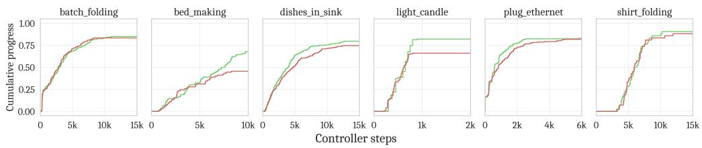

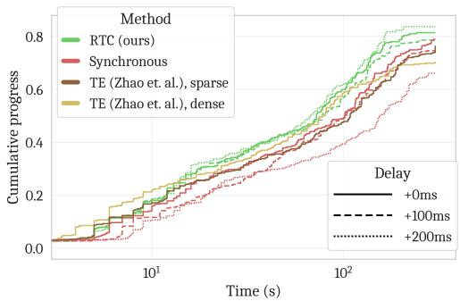

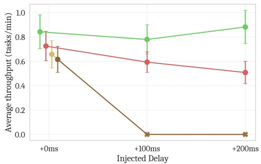  
Figure 6: Top: Controller steps (equivalent to elapsed time with inference pauses removed multiplied by 50Hz) vs. cumulative progress for each task, aggregated across all delays. Progress is measured in discrete steps corresponding to the subsections of each task. Left: Time (including inference pauses) vs. cumulative progress aggregated across all tasks. The x-axis is log scale to better show progress during both short and long-horizon tasks. Right: Inference delay vs. average throughput, defined as the proportion of task completed divided by duration of episode averaged over episodes. Error bars are ±1 SEM. Average throughput gives a balanced view of both speed and performance for each method. Neither TE variant can run at +100 or +200ms of injected latency, causing such high oscillations that the robot’s protective stop is triggered.

Results. We present the results in Figure 6. In average task throughput, a measurement of both speed and performance, RTC achieves the best score at all inference delays with a statistically significant result at +100 and +200ms. RTC is completely robust to injected delay, showing no degradation, whereas synchronous degrades linearly and both TE variants do not run at all due to causing such high oscillations that the robot’s protective stop is triggered (see videos). Inspecting the per-task results (Figure 5, top), we can conclude that RTC helps with more than just execution speed: it completes tasks faster than synchronous inference even when inference pauses are removed. All tasks, except for light candle, allow for retrying until the time limit (and $\pi _ { 0 . 5 }$ does, in general, exhibit robust retrying behavior). Even though synchronous inference often reaches a similar final score, RTC often completes more of the task earlier in the episode, reflecting fewer mistakes and less retrying. In light candle, the most precision-sensitive task—and also the only one without retrying—RTC shows a large advantage in final score, reflecting a higher overall success rate. Interestingly, the same is true in bed making, even though that task does elicit retrying. The policy particularly struggles to manipulate the pillows, and bed making is the hardest task overall, which may be why RTC has a strong effect.

## 5 Related Work

Action chunking, VLAs, and cascade control. Inspired in part by human motor control [33], action chunking has recently emerged as the de facto standard in imitation learning for visuomotor control [68, 11]. Learning to generate action chunks from human data requires expressive statistical models, such as variational inference [68, 19], diffusion [11, 12, 69, 68, 46, 59], flow matching [5, 6], vector quantization [34, 3, 44], or byte-pair encoding [47]. Recently, some of these methods have been scaled to billions of parameters, giving rise to VLAs [7, 13, 30, 5, 71, 10, 9, 70, 24, 47, 37], a class of large models built on pre-trained vision-language model backbones. With the capacity to fit ever growing robot datasets [13, 29, 62, 15, 41, 27], as well as Internet knowledge from vision-language pre-training, VLAs have achieved impressive results in generalizable robot manipulation. When applied to real-world robots, action chunking policies are often used in conjunction with a lower-level, higher-frequency control loop—such as a PID controller—which translates the outputs of the policy (e.g., joint positions) to hardware-specific control signals (e.g., joint torques). In these cases, action chunking policies can be viewed as a form of cascade control [14], with the learned policy acting the outermost control loop. However, this is not always the case: for example, our simulated experiments use learned policies that output torques and forces directly. As such, we defer any exploration of the intersection between cascade control theory and learned action chunking policies to future work.

Reducing inference latency. A natural approach to improve the real-time capabilities of a model is to simply speed it up. For instance, consistency policy [49] distills diffusion policies to elide expensive iterative denoising. Streaming diffusion policy [23] proposes an alternative training recipe that allows for very few denoising steps per controller timestep. Kim et al. [31] augment OpenVLA [30] with parallel decoding to elide expensive autoregressive decoding. More broadly, there is a rich literature on optimizing inference speed, both for diffusion models [52, 38, 56, 17] and large transformers in general [32, 25, 35]. Unfortunately, these directions cannot reduce inference cost below one forward pass. So long as this forward pass takes longer than the controller’s sampling period, other methods will be needed for real-time execution.

Inpainting and guidance. There is a rich literature on image inpainting with pre-trained diffusion and flow models [48, 55, 40, 42]. In our work, we incorporate one such method [48] into our novel real-time execution framework with modifications (namely, soft masking and guidance weight clipping) that we find necessary for our setting. For sequential decision-making, Diffuser [26] pioneered diffusion-based inpainting for following state and action constraints in long-term planning, though their inpainting method is not guidance-based. (See Appendix A.4 for a comparison to the inpainting method from Diffuser applied to our setting.) Diffuser and other work [64, 1] have also guided diffusion models with value functions to solve reinforcement learning (RL) problems. Our work is distinct in that it is the first to apply either inpainting or guidance to real-time control.

Real-time execution. Real-time control has been studied long before the advent of VLAs. Similar to action chunking, model predictive control (MPC; [51]) generates plans over a receding time horizon; like our method, it parallelizes execution and computation, and uses the prior chunk to warm-start planning for the next. Though recent works combining learning methods with MPC have demonstrated real-time control capabilities in narrow domains [53, 21], they rely on explicit, hand-crafted dynamics models and cost functions. These methods are not applicable to our setting, which considers model-free imitation learning policies and tests them on unstructured, open-world manipulation tasks. Separately, in reinforcement learning, a variety of prior works have developed time-delayed decision-making methods [57, 16, 54, 63, 66, 67]. However, these approaches are not always applicable to imitation learning, and none of them leverage action chunking. Most recently, hierarchical VLA designs [58, 4] have emerged where the model is split into a System 2 (high-level planning) and System 1 (low-level action generation) component. The System 2 component contains the bulk of the VLA’s capacity and runs at a low frequency, while the System 1 component is lightweight and fast. This approach is orthogonal to ours, and comes with its own tradeoffs (e.g., limiting the size of the System 1 component and requiring its own training recipe).

Bidirectional Decoding. The most closely related prior work is Bidirectional Decoding (BID; [39]), which enables fully closed-loop control with pre-trained action chunking policies via rejection sampling. While Liu et al. [39] do not consider inference delay, the BID algorithm can be used to accomplish the same effect as our guidance-based inpainting. We compare to BID in our simulated benchmark, finding that it underperforms RTC while using significantly more compute.

## 6 Discussion and Future Work

Real-time chunking is an inference-time algorithm for asynchronous execution of action chunking policies that demonstrates speed and performance across simulation and real-world experiments, including under significant inference delays. However, this work is not without limitations: it adds significant computational overhead compared to methods that sample directly from the base policy, and it is applicable only to diffusion- and flow-based policies. Additionally, while our real-world experiments cover a variety of challenging manipulation tasks, there are more dynamic settings that could benefit even more from real-time execution. One example is legged locomotion, which is represented in our simulated benchmark but not our real-world results.

## 7 Acknowledgements

We thank Charles Xu and Kay Ke for designing the Ethernet plug-in task. We thank Brian Ichter for suggesting the cumulative progress plots and for later feedback on figures. We thank Dibya Ghosh for suggesting the throughput metric to measure a combination of speed and performance. We thank Ury Zhilinsky, Karan Dhabalia, Haohuan Wang, and Dibya Ghosh for help with training infrastructure; Noah Brown, Szymon Jakubczak, Adnan Esmail, Tim Jones, Mohith Mothukuri, James Darpinian, and James Tanner for robot infrastructure; Adrian Li-Bell for evaluation infrastructure; Anna Walling, Chelsea Finn, and Karol Hausman for robot, data and evaluation operations; and Michael Equi, Quan Vuong, and Jost Tobias Springenberg for training some of the $\pi _ { 0 . 5 }$ policies used in the real-world experiments. We also thank Claudio Guglieri and Alex Krasikov for their help with visualizations for the blog post, and Jessica Dai for helpful copy editing of the paper manuscript. Finally, we are grateful to the whole team of robot operators at Physical Intelligence for their enormous contributions to running data collection and policy evaluations.

## References

[1] Anurag Ajay, Yilun Du, Abhi Gupta, Joshua Tenenbaum, Tommi Jaakkola, and Pulkit Agrawal. Is conditional generative modeling all you need for decision-making? arXiv preprint arXiv:2211.15657, 2022.

[2] Atilim Gunes Baydin, Barak A Pearlmutter, Alexey Andreyevich Radul, and Jeffrey Mark Siskind. Automatic differentiation in machine learning: a survey. Journal of machine learning research, 18(153):1–43, 2018.

[3] Suneel Belkhale and Dorsa Sadigh. Minivla: A better vla with a smaller footprint, 2024. URL https://github.com/Stanford-ILIAD/openvla-mini.

[4] Johan Bjorck, Fernando Castañeda, Nikita Cherniadev, Xingye Da, Runyu Ding, Linxi Fan, Yu Fang, Dieter Fox, Fengyuan Hu, Spencer Huang, et al. Gr00t n1: An open foundation model for generalist humanoid robots. arXiv preprint arXiv:2503.14734, 2025.

[5] Kevin Black, Noah Brown, Danny Driess, Adnan Esmail, Michael Equi, Chelsea Finn, Niccolo Fusai, Lachy Groom, Karol Hausman, Brian Ichter, et al. π0: A vision-language-action flow model for general robot control. arXiv preprint arXiv:2410.24164, 2024.

[6] Max Braun, Noémie Jaquier, Leonel Rozo, and Tamim Asfour. Riemannian flow matching policy for robot motion learning. In 2024 IEEE/RSJ International Conference on Intelligent Robots and Systems (IROS), pages 5144–5151. IEEE, 2024.

[7] Anthony Brohan, Noah Brown, Justice Carbajal, Yevgen Chebotar, Xi Chen, Krzysztof Choromanski, Tianli Ding, Danny Driess, Avinava Dubey, Chelsea Finn, Pete Florence, Chuyuan Fu, Montse Gonzalez Arenas, Keerthana Gopalakrishnan, Kehang Han, Karol Hausman, Alex Herzog, Jasmine Hsu, Brian Ichter, Alex Irpan, Nikhil Joshi, Ryan Julian, Dmitry Kalashnikov, Yuheng Kuang, Isabel Leal, Lisa Lee, Tsang-Wei Edward Lee, Sergey Levine, Yao Lu, Henryk Michalewski, Igor Mordatch, Karl Pertsch, Kanishka Rao, Krista Reymann, Michael Ryoo, Grecia Salazar, Pannag Sanketi, Pierre Sermanet, Jaspiar Singh, Anikait Singh, Radu Soricut, Huong Tran, Vincent Vanhoucke, Quan Vuong, Ayzaan Wahid, Stefan Welker, Paul Wohlhart, Jialin Wu, Fei Xia, Ted Xiao, Peng Xu, Sichun Xu, Tianhe Yu, and Brianna Zitkovich. Rt-2: Vision-language-action models transfer web knowledge to robotic control. In arXiv preprint arXiv:2307.15818, 2023.

[8] Anthony Brohan, Noah Brown, Justice Carbajal, Yevgen Chebotar, Xi Chen, Krzysztof Choromanski, Tianli Ding, Danny Driess, Avinava Dubey, Chelsea Finn, et al. Rt-2: Vision-languageaction models transfer web knowledge to robotic control. arXiv preprint arXiv:2307.15818, 2023.

[9] Chi-Lam Cheang, Guangzeng Chen, Ya Jing, Tao Kong, Hang Li, Yifeng Li, Yuxiao Liu, Hongtao Wu, Jiafeng Xu, Yichu Yang, Hanbo Zhang, and Minzhao Zhu. Gr-2: A generative video-language-action model with web-scale knowledge for robot manipulation. arXiv preprint arXiv:2410.06158, 2024.

[10] An-Chieh Cheng, Yandong Ji, Zhaojing Yang, Xueyan Zou, Jan Kautz, Erdem Biyik, Hongxu Yin, Sifei Liu, and Xiaolong Wang. NaVILA: Legged Robot Vision-Language-Action Model for Navigation. arXiv preprint arXiv:2412.04453, 2024.

[11] Cheng Chi, Zhenjia Xu, Siyuan Feng, Eric Cousineau, Yilun Du, Benjamin Burchfiel, Russ Tedrake, and Shuran Song. Diffusion policy: Visuomotor policy learning via action diffusion. The International Journal of Robotics Research, page 02783649241273668, 2023.

[12] Cheng Chi, Zhenjia Xu, Chuer Pan, Eric Cousineau, Benjamin Burchfiel, Siyuan Feng, Russ Tedrake, and Shuran Song. Universal manipulation interface: In-the-wild robot teaching without in-the-wild robots. arXiv preprint arXiv:2402.10329, 2024.

[13] OX-Embodiment Collaboration, A Padalkar, A Pooley, A Jain, A Bewley, A Herzog, A Irpan, A Khazatsky, A Rai, A Singh, et al. Open X-Embodiment: Robotic learning datasets and RT-X models. arXiv preprint arXiv:2310.08864, 1(2), 2023.

[14] Donald R. Coughanowr and Steven E. LeBlanc. Process Systems Analysis and Control, chapter 18. McGraw-Hill, New York, 3rd edition, 2009. ISBN 978-0073397894.

[15] Hao-Shu Fang, Hongjie Fang, Zhenyu Tang, Jirong Liu, Chenxi Wang, Junbo Wang, Haoyi Zhu, and Cewu Lu. Rh20t: A comprehensive robotic dataset for learning diverse skills in one-shot. In 2024 IEEE International Conference on Robotics and Automation (ICRA), pages 653–660. IEEE, 2024.

[16] Vlad Firoiu, Tina Ju, and Josh Tenenbaum. At human speed: Deep reinforcement learning with action delay. arXiv preprint arXiv:1810.07286, 2018.

[17] Kevin Frans, Danijar Hafner, Sergey Levine, and Pieter Abbeel. One step diffusion via shortcut models. arXiv preprint arXiv:2410.12557, 2024.

[18] Ruiqi Gao, Emiel Hoogeboom, Jonathan Heek, Valentin De Bortoli, Kevin P. Murphy, and Tim Salimans. Diffusion meets flow matching: Two sides of the same coin. 2024. URL https://diffusionflow.github.io/.

[19] Abraham George and Amir Barati Farimani. One act play: Single demonstration behavior cloning with action chunking transformers. arXiv preprint arXiv:2309.10175, 2023.

[20] Anthony Ha. Google’s gemini has beaten pokémon blue (with little help). https://techcrunch.com/2025/05/03/ googles-gemini-has-beaten-pokemon-blue-with-a-little-help/, May 2025. Accessed May 8, 2025.

[21] Nicklas Hansen, Xiaolong Wang, and Hao Su. Temporal difference learning for model predictive control, 2022. URL https://arxiv.org/abs/2203.04955.

[22] Jonathan Ho, Ajay Jain, and Pieter Abbeel. Denoising diffusion probabilistic models. Advances in neural information processing systems, 33:6840–6851, 2020.

[23] Sigmund H Høeg, Yilun Du, and Olav Egeland. Streaming diffusion policy: Fast policy synthesis with variable noise diffusion models. arXiv preprint arXiv:2406.04806, 2024.

[24] Physical Intelligence, Kevin Black, Noah Brown, James Darpinian, Karan Dhabalia, Danny Driess, Adnan Esmail, Michael Equi, Chelsea Finn, Niccolo Fusai, et al. π0.5: A visionlanguage-action model with open-world generalization. arXiv preprint arXiv:2504.16054, 2025.

[25] Benoit Jacob, Skirmantas Kligys, Bo Chen, Menglong Zhu, Matthew Tang, Andrew Howard, Hartwig Adam, and Dmitry Kalenichenko. Quantization and training of neural networks for efficient integer-arithmetic-only inference. In Proceedings of the IEEE conference on computer vision and pattern recognition, pages 2704–2713, 2018.

[26] Michael Janner, Yilun Du, Joshua B Tenenbaum, and Sergey Levine. Planning with diffusion for flexible behavior synthesis. arXiv preprint arXiv:2205.09991, 2022.

[27] Zhenyu Jiang, Yuqi Xie, Kevin Lin, Zhenjia Xu, Weikang Wan, Ajay Mandlekar, Linxi Fan, and Yuke Zhu. Dexmimicgen: Automated data generation for bimanual dexterous manipulation via imitation learning. arXiv preprint arXiv:2410.24185, 2024.

[28] Jared Kaplan, Sam McCandlish, Tom Henighan, Tom B Brown, Benjamin Chess, Rewon Child, Scott Gray, Alec Radford, Jeffrey Wu, and Dario Amodei. Scaling laws for neural language models. arXiv preprint arXiv:2001.08361, 2020.

[29] Alexander Khazatsky, Karl Pertsch, Suraj Nair, Ashwin Balakrishna, Sudeep Dasari, Siddharth Karamcheti, Soroush Nasiriany, Mohan Kumar Srirama, Lawrence Yunliang Chen, Kirsty Ellis, Peter David Fagan, Joey Hejna, Masha Itkina, Marion Lepert, Yecheng Jason Ma, Patrick Tree Miller, Jimmy Wu, Suneel Belkhale, Shivin Dass, Huy Ha, Arhan Jain, Abraham Lee, Youngwoon Lee, Marius Memmel, Sungjae Park, Ilija Radosavovic, Kaiyuan Wang, Albert Zhan, Kevin Black, Cheng Chi, Kyle Beltran Hatch, Shan Lin, Jingpei Lu, Jean Mercat, Abdul Rehman, Pannag R Sanketi, Archit Sharma, Cody Simpson, Quan Vuong, Homer Rich Walke, Blake Wulfe, Ted Xiao, Jonathan Heewon Yang, Arefeh Yavary, Tony Z. Zhao, Christopher Agia, Rohan Baijal, Mateo Guaman Castro, Daphne Chen, Qiuyu Chen, Trinity Chung, Jaimyn Drake, Ethan Paul Foster, Jensen Gao, David Antonio Herrera, Minho Heo, Kyle Hsu, Jiaheng Hu, Donovon Jackson, Charlotte Le, Yunshuang Li, Kevin Lin, Roy Lin, Zehan Ma, Abhiram Maddukuri, Suvir Mirchandani, Daniel Morton, Tony Nguyen, Abigail O’Neill, Rosario Scalise, Derick Seale, Victor Son, Stephen Tian, Emi Tran, Andrew E. Wang, Yilin Wu, Annie Xie, Jingyun Yang, Patrick Yin, Yunchu Zhang, Osbert Bastani, Glen Berseth, Jeannette Bohg, Ken Goldberg, Abhinav Gupta, Abhishek Gupta, Dinesh Jayaraman, Joseph J Lim, Jitendra Malik, Roberto Martín-Martín, Subramanian Ramamoorthy, Dorsa Sadigh, Shuran Song, Jiajun Wu, Michael C. Yip, Yuke Zhu, Thomas Kollar, Sergey Levine, and Chelsea Finn. Droid: A large-scale in-the-wild robot manipulation dataset. In Proceedings of Robotics: Science and Systems, 2024.

[30] Moo Jin Kim, Karl Pertsch, Siddharth Karamcheti, Ted Xiao, Ashwin Balakrishna, Suraj Nair, Rafael Rafailov, Ethan Foster, Grace Lam, Pannag Sanketi, et al. Openvla: An open-source vision-language-action model. arXiv preprint arXiv:2406.09246, 2024.

[31] Moo Jin Kim, Chelsea Finn, and Percy Liang. Fine-tuning vision-language-action models: Optimizing speed and success. arXiv preprint arXiv:2502.19645, 2025.

[32] Woosuk Kwon, Zhuohan Li, Siyuan Zhuang, Ying Sheng, Lianmin Zheng, Cody Hao Yu, Joseph Gonzalez, Hao Zhang, and Ion Stoica. Efficient memory management for large language model serving with pagedattention. In Proceedings of the 29th Symposium on Operating Systems Principles, pages 611–626, 2023.

[33] Lucy Lai, Ann Zixiang Huang, and Samuel J Gershman. Action chunking as policy compression. 2022.

[34] Seungjae Lee, Yibin Wang, Haritheja Etukuru, H Jin Kim, Nur Muhammad Mahi Shafiullah, and Lerrel Pinto. Behavior generation with latent actions. arXiv preprint arXiv:2403.03181, 2024.

[35] Ji Lin, Jiaming Tang, Haotian Tang, Shang Yang, Wei-Ming Chen, Wei-Chen Wang, Guangxuan Xiao, Xingyu Dang, Chuang Gan, and Song Han. Awq: Activation-aware weight quantization for on-device llm compression and acceleration. Proceedings of Machine Learning and Systems, 6:87–100, 2024.

[36] Yaron Lipman, Ricky TQ Chen, Heli Ben-Hamu, Maximilian Nickel, and Matt Le. Flow matching for generative modeling. arXiv preprint arXiv:2210.02747, 2022.

[37] Songming Liu, Lingxuan Wu, Bangguo Li, Hengkai Tan, Huayu Chen, Zhengyi Wang, Ke Xu, Hang Su, and Jun Zhu. Rdt-1b: a diffusion foundation model for bimanual manipulation. arXiv preprint arXiv:2410.07864, 2024.

[38] Xingchao Liu, Chengyue Gong, and Qiang Liu. Flow straight and fast: Learning to generate and transfer data with rectified flow. arXiv preprint arXiv:2209.03003, 2022.

[39] Yuejiang Liu, Jubayer Ibn Hamid, Annie Xie, Yoonho Lee, Maximilian Du, and Chelsea Finn. Bidirectional decoding: Improving action chunking via closed-loop resampling. arXiv preprint arXiv:2408.17355, 2024.

[40] Andreas Lugmayr, Martin Danelljan, Andres Romero, Fisher Yu, Radu Timofte, and Luc Van Gool. Repaint: Inpainting using denoising diffusion probabilistic models. In Proceedings of the IEEE/CVF conference on computer vision and pattern recognition, pages 11461–11471, 2022.

[41] Ajay Mandlekar, Yuke Zhu, Animesh Garg, Jonathan Booher, Max Spero, Albert Tung, Julian Gao, John Emmons, Anchit Gupta, Emre Orbay, et al. Roboturk: A crowdsourcing platform for robotic skill learning through imitation. In Conference on Robot Learning, pages 879–893. PMLR, 2018.

[42] Morteza Mardani, Jiaming Song, Jan Kautz, and Arash Vahdat. A variational perspective on solving inverse problems with diffusion models. arXiv preprint arXiv:2305.04391, 2023.

[43] Michael Matthews, Michael Beukman, Chris Lu, and Jakob Foerster. Kinetix: Investigating the training of general agents through open-ended physics-based control tasks. arXiv preprint arXiv:2410.23208, 2024.

[44] Atharva Mete, Haotian Xue, Albert Wilcox, Yongxin Chen, and Animesh Garg. Quest: Selfsupervised skill abstractions for learning continuous control, 2024. URL https://arxiv. org/abs/2407.15840.

[45] OpenAI. Introducing openai codex, August 2021. URL https://openai.com/index/ introducing-codex/. Accessed on May 27, 2025.

[46] Tim Pearce, Tabish Rashid, Anssi Kanervisto, Dave Bignell, Mingfei Sun, Raluca Georgescu, Sergio Valcarcel Macua, Shan Zheng Tan, Ida Momennejad, Katja Hofmann, et al. Imitating human behaviour with diffusion models. arXiv preprint arXiv:2301.10677, 2023.

[47] Karl Pertsch, Kyle Stachowicz, Brian Ichter, Danny Driess, Suraj Nair, Quan Vuong, Oier Mees, Chelsea Finn, and Sergey Levine. Fast: Efficient action tokenization for vision-language-action models. arXiv preprint arXiv:2501.09747, 2025.

[48] Ashwini Pokle, Matthew J Muckley, Ricky TQ Chen, and Brian Karrer. Training-free linear image inverses via flows. arXiv preprint arXiv:2310.04432, 2023.

[49] Aaditya Prasad, Kevin Lin, Jimmy Wu, Linqi Zhou, and Jeannette Bohg. Consistency policy: Accelerated visuomotor policies via consistency distillation. arXiv preprint arXiv:2405.07503, 2024.

[50] Md Masudur Rahman and Yexiang Xue. Robust policy optimization in deep reinforcement learning. arXiv preprint arXiv:2212.07536, 2022.

[51] J.B. Rawlings, D.Q. Mayne, and M. Diehl. Model Predictive Control: Theory, Computation, and Design. Nob Hill Publishing, 2017. ISBN 9780975937730. URL https://books.google. ch/books?id=MrJctAEACAAJ.

[52] Tim Salimans and Jonathan Ho. Progressive distillation for fast sampling of diffusion models. arXiv preprint arXiv:2202.00512, 2022.

[53] Tim Salzmann, Elia Kaufmann, Jon Arrizabalaga, Marco Pavone, Davide Scaramuzza, and Markus Ryll. Real-time neural mpc: Deep learning model predictive control for quadrotors and agile robotic platforms. IEEE Robotics and Automation Letters, 8(4):2397–2404, 2023.

[54] Erik Schuitema, Lucian Bu¸soniu, Robert Babuška, and Pieter Jonker. Control delay in reinforcement learning for real-time dynamic systems: A memoryless approach. In 2010 IEEE/RSJ international conference on intelligent robots and systems, pages 3226–3231. IEEE, 2010.

[55] Jiaming Song, Arash Vahdat, Morteza Mardani, and Jan Kautz. Pseudoinverse-guided diffusion models for inverse problems. In International Conference on Learning Representations, 2023.

[56] Yang Song, Prafulla Dhariwal, Mark Chen, and Ilya Sutskever. Consistency models. 2023.

[57] Jie Tan, Tingnan Zhang, Erwin Coumans, Atil Iscen, Yunfei Bai, Danijar Hafner, Steven Bohez, and Vincent Vanhoucke. Sim-to-real: Learning agile locomotion for quadruped robots. arXiv preprint arXiv:1804.10332, 2018.

[58] Gemini Robotics Team, Saminda Abeyruwan, Joshua Ainslie, Jean-Baptiste Alayrac, Montserrat Gonzalez Arenas, Travis Armstrong, Ashwin Balakrishna, Robert Baruch, Maria Bauza, Michiel Blokzijl, et al. Gemini robotics: Bringing ai into the physical world. arXiv preprint arXiv:2503.20020, 2025.

[59] Octo Model Team, Dibya Ghosh, Homer Walke, Karl Pertsch, Kevin Black, Oier Mees, Sudeep Dasari, Joey Hejna, Tobias Kreiman, Charles Xu, et al. Octo: An open-source generalist robot policy. arXiv preprint arXiv:2405.12213, 2024.

[60] Waywe Research Team et al. Lingo-2: Driving with natural language, 2024.

[61] Ilya O Tolstikhin, Neil Houlsby, Alexander Kolesnikov, Lucas Beyer, Xiaohua Zhai, Thomas Unterthiner, Jessica Yung, Andreas Steiner, Daniel Keysers, Jakob Uszkoreit, et al. Mlp-mixer: An all-mlp architecture for vision. Advances in neural information processing systems, 34: 24261–24272, 2021.

[62] Homer Rich Walke, Kevin Black, Tony Z Zhao, Quan Vuong, Chongyi Zheng, Philippe Hansen-Estruch, Andre Wang He, Vivek Myers, Moo Jin Kim, Max Du, et al. BridgeData v2: A dataset for robot learning at scale. In Conference on Robot Learning, pages 1723–1736. PMLR, 2023.

[63] Thomas J Walsh, Ali Nouri, Lihong Li, and Michael L Littman. Planning and learning in environments with delayed feedback. In Machine Learning: ECML 2007: 18th European Conference on Machine Learning, Warsaw, Poland, September 17-21, 2007. Proceedings 18, pages 442–453. Springer, 2007.

[64] Zhendong Wang, Jonathan J Hunt, and Mingyuan Zhou. Diffusion policies as an expressive policy class for offline reinforcement learning. arXiv preprint arXiv:2208.06193, 2022.

[65] Jason Wei, Zhiqing Sun, Spencer Papay, Scott McKinney, Jeffrey Han, Isa Fulford, Hyung Won Chung, Alex Tachard Passos, William Fedus, and Amelia Glaese. Browsecomp: A simple yet challenging benchmark for browsing agents. arXiv preprint arXiv:2504.12516, 2025.

[66] Ted Xiao, Eric Jang, Dmitry Kalashnikov, Sergey Levine, Julian Ibarz, Karol Hausman, and Alexander Herzog. Thinking while moving: Deep reinforcement learning with concurrent control. arXiv preprint arXiv:2004.06089, 2020.

[67] Bin Xu, Farzam Malmir, Dhruvang Rathod, and Zoran Filipi. Real-time reinforcement learning optimized energy management for a 48v mild hybrid electric vehicle. Technical report, SAE Technical Paper, 2019.

[68] Tony Z Zhao, Vikash Kumar, Sergey Levine, and Chelsea Finn. Learning fine-grained bimanual manipulation with low-cost hardware. arXiv preprint arXiv:2304.13705, 2023.

[69] Tony Z Zhao, Jonathan Tompson, Danny Driess, Pete Florence, Kamyar Ghasemipour, Chelsea Finn, and Ayzaan Wahid. Aloha unleashed: A simple recipe for robot dexterity. arXiv preprint arXiv:2410.13126, 2024.

[70] Haoyu Zhen, Xiaowen Qiu, Peihao Chen, Jincheng Yang, Xin Yan, Yilun Du, Yining Hong, and Chuang Gan. 3d-vla: 3d vision-language-action generative world model. arXiv preprint arXiv:2403.09631, 2024.

[71] Ruijie Zheng, Yongyuan Liang, Shuaiyi Huang, Jianfeng Gao, Hal Daumé III, Andrey Kolobov, Furong Huang, and Jianwei Yang. Tracevla: Visual trace prompting enhances spatial-temporal awareness for generalist robotic policies. arXiv preprint arXiv:2412.10345, 2024.

## NeurIPS Paper Checklist

## 1. Claims

Question: Do the main claims made in the abstract and introduction accurately reflect the paper’s contributions and scope?

Answer: [Yes]

Justification: Yes, the abstract and introduction accurately reflect our contributions. The abstract claims that we present a method for asynchronous execution of action chunking policies that improves speed and performance, which is demonstrated through extensive experiments in both simulation and real-world settings. The introduction expands on these claims while clearly stating limitations, such as the method only being applicable to diffusion and flow-based policies. All claims are supported by our experimental results.

Guidelines:

• The answer NA means that the abstract and introduction do not include the claims made in the paper.

• The abstract and/or introduction should clearly state the claims made, including the contributions made in the paper and important assumptions and limitations. A No or NA answer to this question will not be perceived well by the reviewers.

• The claims made should match theoretical and experimental results, and reflect how much the results can be expected to generalize to other settings.

• It is fine to include aspirational goals as motivation as long as it is clear that these goals are not attained by the paper.

## 2. Limitations

Question: Does the paper discuss the limitations of the work performed by the authors?

Answer: [Yes]

Justification: The limitations of the work are discussed in Sec. 6, which include the scope (diffusion- and flow-based policies only), computational efficiency, and shortcomings of the experiments.

Guidelines:

• The answer NA means that the paper has no limitation while the answer No means that the paper has limitations, but those are not discussed in the paper.

• The authors are encouraged to create a separate "Limitations" section in their paper.

• The paper should point out any strong assumptions and how robust the results are to violations of these assumptions (e.g., independence assumptions, noiseless settings, model well-specification, asymptotic approximations only holding locally). The authors should reflect on how these assumptions might be violated in practice and what the implications would be.

• The authors should reflect on the scope of the claims made, e.g., if the approach was only tested on a few datasets or with a few runs. In general, empirical results often depend on implicit assumptions, which should be articulated.

• The authors should reflect on the factors that influence the performance of the approach. For example, a facial recognition algorithm may perform poorly when image resolution is low or images are taken in low lighting. Or a speech-to-text system might not be used reliably to provide closed captions for online lectures because it fails to handle technical jargon.

• The authors should discuss the computational efficiency of the proposed algorithms and how they scale with dataset size.

• If applicable, the authors should discuss possible limitations of their approach to address problems of privacy and fairness.

• While the authors might fear that complete honesty about limitations might be used by reviewers as grounds for rejection, a worse outcome might be that reviewers discover limitations that aren’t acknowledged in the paper. The authors should use their best judgment and recognize that individual actions in favor of transparency play an important role in developing norms that preserve the integrity of the community. Reviewers will be specifically instructed to not penalize honesty concerning limitations.

## 3. Theory assumptions and proofs

Question: For each theoretical result, does the paper provide the full set of assumptions and a complete (and correct) proof?

Answer: [NA]

Justification: The paper does not include theoretical results.

Guidelines:

• The answer NA means that the paper does not include theoretical results.

• All the theorems, formulas, and proofs in the paper should be numbered and crossreferenced.

• All assumptions should be clearly stated or referenced in the statement of any theorems.

• The proofs can either appear in the main paper or the supplemental material, but if they appear in the supplemental material, the authors are encouraged to provide a short proof sketch to provide intuition.

• Inversely, any informal proof provided in the core of the paper should be complemented by formal proofs provided in appendix or supplemental material.

• Theorems and Lemmas that the proof relies upon should be properly referenced.

## 4. Experimental result reproducibility

Question: Does the paper fully disclose all the information needed to reproduce the main experimental results of the paper to the extent that it affects the main claims and/or conclusions of the paper (regardless of whether the code and data are provided or not)?

Answer: [Yes]

Justification: The paper provides a detailed algorithm in Algorithm 1 that can be used to reproduce the experimental results on real robots using any pre-trained flow-based policy. The full code to reproduce the simulated benchmark and its results are provided in the supplemental material.

## Guidelines:

• The answer NA means that the paper does not include experiments.

• If the paper includes experiments, a No answer to this question will not be perceived well by the reviewers: Making the paper reproducible is important, regardless of whether the code and data are provided or not.

• If the contribution is a dataset and/or model, the authors should describe the steps taken to make their results reproducible or verifiable.

• Depending on the contribution, reproducibility can be accomplished in various ways. For example, if the contribution is a novel architecture, describing the architecture fully might suffice, or if the contribution is a specific model and empirical evaluation, it may be necessary to either make it possible for others to replicate the model with the same dataset, or provide access to the model. In general. releasing code and data is often one good way to accomplish this, but reproducibility can also be provided via detailed instructions for how to replicate the results, access to a hosted model (e.g., in the case of a large language model), releasing of a model checkpoint, or other means that are appropriate to the research performed.

• While NeurIPS does not require releasing code, the conference does require all submis sions to provide some reasonable avenue for reproducibility, which may depend on the nature of the contribution. For example

(a) If the contribution is primarily a new algorithm, the paper should make it clear how to reproduce that algorithm.

(b) If the contribution is primarily a new model architecture, the paper should describe the architecture clearly and fully.

(c) If the contribution is a new model (e.g., a large language model), then there should either be a way to access this model for reproducing the results or a way to reproduce the model (e.g., with an open-source dataset or instructions for how to construct the dataset).

(d) We recognize that reproducibility may be tricky in some cases, in which case authors are welcome to describe the particular way they provide for reproducibility. In the case of closed-source models, it may be that access to the model is limited in some way (e.g., to registered users), but it should be possible for other researchers to have some path to reproducing or verifying the results.

## 5. Open access to data and code

Question: Does the paper provide open access to the data and code, with sufficient instructions to faithfully reproduce the main experimental results, as described in supplemental material?

Answer: [Yes] and [No]

Justification: The full code and instructions to reproduce the simulated benchmark and its results are provided in the supplemental material. The data used to train π0.5, as well as the real robot runtime code, are not released as these are proprietary.

Guidelines:

• The answer NA means that paper does not include experiments requiring code.

• Please see the NeurIPS code and data submission guidelines (https://nips.cc/ public/guides/CodeSubmissionPolicy) for more details.

• While we encourage the release of code and data, we understand that this might not be possible, so "No" is an acceptable answer. Papers cannot be rejected simply for not including code, unless this is central to the contribution (e.g., for a new open-source benchmark).

• The instructions should contain the exact command and environment needed to run to reproduce the results. See the NeurIPS code and data submission guidelines (https: //nips.cc/public/guides/CodeSubmissionPolicy) for more details.

• The authors should provide instructions on data access and preparation, including how to access the raw data, preprocessed data, intermediate data, and generated data, etc.

• The authors should provide scripts to reproduce all experimental results for the new proposed method and baselines. If only a subset of experiments are reproducible, they should state which ones are omitted from the script and why.

• At submission time, to preserve anonymity, the authors should release anonymized versions (if applicable).

• Providing as much information as possible in supplemental material (appended to the paper) is recommended, but including URLs to data and code is permitted.

## 6. Experimental setting/details

Question: Does the paper specify all the training and test details (e.g., data splits, hyperparameters, how they were chosen, type of optimizer, etc.) necessary to understand the results?

Answer: [Yes]

Justification: All training and testing hyperparameters are provided in the supplemental material.

Guidelines:

• The answer NA means that the paper does not include experiments.

• The experimental setting should be presented in the core of the paper to a level of detail that is necessary to appreciate the results and make sense of them.

• The full details can be provided either with the code, in appendix, or as supplemental material.

## 7. Experiment statistical significance

Question: Does the paper report error bars suitably and correctly defined or other appropriate information about the statistical significance of the experiments?

Answer: [Yes]

Justification: Error bars are reported, and described, everywhere in the experiments section where a mean of multiple data points is reported.

## Guidelines:

• The answer NA means that the paper does not include experiments.

• The authors should answer "Yes" if the results are accompanied by error bars, confidence intervals, or statistical significance tests, at least for the experiments that support the main claims of the paper.

• The factors of variability that the error bars are capturing should be clearly stated (for example, train/test split, initialization, random drawing of some parameter, or overall run with given experimental conditions).

• The method for calculating the error bars should be explained (closed form formula, call to a library function, bootstrap, etc.)

• The assumptions made should be given (e.g., Normally distributed errors).

• It should be clear whether the error bar is the standard deviation or the standard error of the mean.

• It is OK to report 1-sigma error bars, but one should state it. The authors should preferably report a 2-sigma error bar than state that they have a 96% CI, if the hypothesis of Normality of errors is not verified.

• For asymmetric distributions, the authors should be careful not to show in tables or figures symmetric error bars that would yield results that are out of range (e.g. negative error rates).

• If error bars are reported in tables or plots, The authors should explain in the text how they were calculated and reference the corresponding figures or tables in the text.

## 8. Experiments compute resources

Question: For each experiment, does the paper provide sufficient information on the computer resources (type of compute workers, memory, time of execution) needed to reproduce the experiments?

Answer: [Yes]

Justification: The paper provides compute details in the supplemental material.

Guidelines:

• The answer NA means that the paper does not include experiments.

• The paper should indicate the type of compute workers CPU or GPU, internal cluster, or cloud provider, including relevant memory and storage.

• The paper should provide the amount of compute required for each of the individual experimental runs as well as estimate the total compute.

• The paper should disclose whether the full research project required more compute than the experiments reported in the paper (e.g., preliminary or failed experiments that didn’t make it into the paper).

## 9. Code of ethics

Question: Does the research conducted in the paper conform, in every respect, with the NeurIPS Code of Ethics https://neurips.cc/public/EthicsGuidelines?

Answer: [Yes]

Justification: The authors have reviewed the NeurIPS Code of Ethics. This work aims primarily to advance the state of the art in end-to-end robot learning. While there is always the potential for technology to cause harm—for example, in military applications—the authors believe that this work does not contribute unduly to these risks. The particular applications considered in the experiments of this work are focused on household robotics.

Guidelines:

• The answer NA means that the authors have not reviewed the NeurIPS Code of Ethics.

• If the authors answer No, they should explain the special circumstances that require a deviation from the Code of Ethics.

• The authors should make sure to preserve anonymity (e.g., if there is a special consideration due to laws or regulations in their jurisdiction).

## 10. Broader impacts

Question: Does the paper discuss both potential positive societal impacts and negative societal impacts of the work performed?

Answer: [Yes]

Justification: A broader impacts statement is included in the supplemental material. Also see the response to the previous question.

Guidelines:

• The answer NA means that there is no societal impact of the work performed.

• If the authors answer NA or No, they should explain why their work has no societal impact or why the paper does not address societal impact.

• Examples of negative societal impacts include potential malicious or unintended uses (e.g., disinformation, generating fake profiles, surveillance), fairness considerations (e.g., deployment of technologies that could make decisions that unfairly impact specific groups), privacy considerations, and security considerations.

• The conference expects that many papers will be foundational research and not tied to particular applications, let alone deployments. However, if there is a direct path to any negative applications, the authors should point it out. For example, it is legitimate to point out that an improvement in the quality of generative models could be used to generate deepfakes for disinformation. On the other hand, it is not needed to point out that a generic algorithm for optimizing neural networks could enable people to train models that generate Deepfakes faster.

• The authors should consider possible harms that could arise when the technology is being used as intended and functioning correctly, harms that could arise when the technology is being used as intended but gives incorrect results, and harms following from (intentional or unintentional) misuse of the technology.

• If there are negative societal impacts, the authors could also discuss possible mitigation strategies (e.g., gated release of models, providing defenses in addition to attacks, mechanisms for monitoring misuse, mechanisms to monitor how a system learns from feedback over time, improving the efficiency and accessibility of ML).

## 11. Safeguards

Question: Does the paper describe safeguards that have been put in place for responsible release of data or models that have a high risk for misuse (e.g., pretrained language models, image generators, or scraped datasets)?

Answer: [NA]

Justification: The paper does not release data or models.

Guidelines:

• The answer NA means that the paper poses no such risks.

• Released models that have a high risk for misuse or dual-use should be released with necessary safeguards to allow for controlled use of the model, for example by requiring that users adhere to usage guidelines or restrictions to access the model or implementing safety filters.

• Datasets that have been scraped from the Internet could pose safety risks. The authors should describe how they avoided releasing unsafe images.

• We recognize that providing effective safeguards is challenging, and many papers do not require this, but we encourage authors to take this into account and make a best faith effort.

## 12. Licenses for existing assets

Question: Are the creators or original owners of assets (e.g., code, data, models), used in the paper, properly credited and are the license and terms of use explicitly mentioned and properly respected?

Answer: [Yes]

Justification: We cite the original creators of models (π0.5[24]) and simulators (Kinetix [43]) that we use in the paper. The Kinetix software is released under the MIT license.

Guidelines:

• The answer NA means that the paper does not use existing assets.

• The authors should cite the original paper that produced the code package or dataset.

• The authors should state which version of the asset is used and, if possible, include a URL.

• The name of the license (e.g., CC-BY 4.0) should be included for each asset.

• For scraped data from a particular source (e.g., website), the copyright and terms of service of that source should be provided.

• If assets are released, the license, copyright information, and terms of use in the package should be provided. For popular datasets, paperswithcode.com/datasets has curated licenses for some datasets. Their licensing guide can help determine the license of a dataset.

• For existing datasets that are re-packaged, both the original license and the license of the derived asset (if it has changed) should be provided.

• If this information is not available online, the authors are encouraged to reach out to the asset’s creators.

## 13. New assets

Question: Are new assets introduced in the paper well documented and is the documentation provided alongside the assets?

Answer: [Yes]

Justification: The full code to reproduce the simulated benchmark and its results are provided in the supplemental material.

Guidelines:

• The answer NA means that the paper does not release new assets.

• Researchers should communicate the details of the dataset/code/model as part of their submissions via structured templates. This includes details about training, license, limitations, etc.

• The paper should discuss whether and how consent was obtained from people whose asset is used.

• At submission time, remember to anonymize your assets (if applicable). You can either create an anonymized URL or include an anonymized zip file.

## 14. Crowdsourcing and research with human subjects

Question: For crowdsourcing experiments and research with human subjects, does the paper include the full text of instructions given to participants and screenshots, if applicable, as well as details about compensation (if any)?

Answer: [NA]

Justification: The paper does not involve crowdsourcing nor research with human subjects. Guidelines:

• The answer NA means that the paper does not involve crowdsourcing nor research with human subjects.

• Including this information in the supplemental material is fine, but if the main contribution of the paper involves human subjects, then as much detail as possible should be included in the main paper.

• According to the NeurIPS Code of Ethics, workers involved in data collection, curation, or other labor should be paid at least the minimum wage in the country of the data collector.

## 15. Institutional review board (IRB) approvals or equivalent for research with human subjects

Question: Does the paper describe potential risks incurred by study participants, whether such risks were disclosed to the subjects, and whether Institutional Review Board (IRB) approvals (or an equivalent approval/review based on the requirements of your country or institution) were obtained?

Answer: [NA]

Justification: The paper does not involve research with human subjects.

## Guidelines:

• The answer NA means that the paper does not involve crowdsourcing nor research with human subjects.

• Depending on the country in which research is conducted, IRB approval (or equivalent) may be required for any human subjects research. If you obtained IRB approval, you should clearly state this in the paper.

• We recognize that the procedures for this may vary significantly between institutions and locations, and we expect authors to adhere to the NeurIPS Code of Ethics and the guidelines for their institution.

• For initial submissions, do not include any information that would break anonymity (if applicable), such as the institution conducting the review.

## 16. Declaration of LLM usage

Question: Does the paper describe the usage of LLMs if it is an important, original, or non-standard component of the core methods in this research? Note that if the LLM is used only for writing, editing, or formatting purposes and does not impact the core methodology, scientific rigorousness, or originality of the research, declaration is not required.

## Answer: [NA]

Justification: The paper does not use LLMs as an important, original, or non-standard component of the core methods.

## Guidelines:

• The answer NA means that the core method development in this research does not involve LLMs as any important, original, or non-standard components.

• Please refer to our LLM policy (https://neurips.cc/Conferences/2025/LLM) for what should or should not be described.

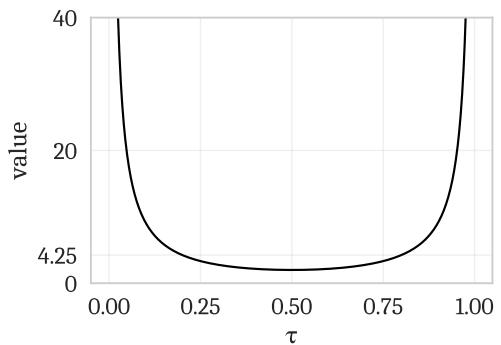

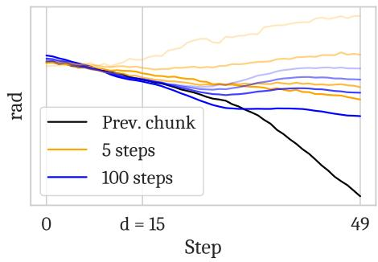

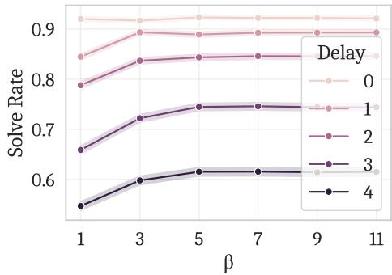

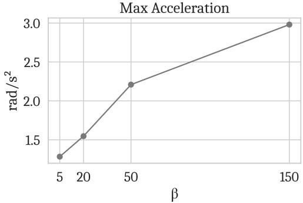  
Figure 7: Top left: The graph of the value $\frac { 1 - \tau } { \tau \cdot r _ { \tau } ^ { 2 } }$ from Eq. 2, which we clip at $\beta . \ \mathrm { A t } \tau = 0$ , clipping is needed to make the value finite. With 5 denoising steps, if $\beta \geq 4 . 2 5$ , the clipping only determines the guidance weight for the first step $( \tau = 0 )$ . Top right: An ablation of $\beta$ in our simulated benchmark. Increasing $\beta$ provides no marginal benefit beyond $\beta = 5$ . Bottom left: Example real robot action chunks generated from the same noise with 5 denoising steps $( n = 5 )$ ) and 100 denoising steps $( n = 1 0 0 )$ , with lower opacities corresponding to higher guidance weight clipping $( \beta = \{ 5 , 2 0 , 5 0 , 1 5 0 \} )$ ). With 5 denoising steps, the generated action chunks diverge when $\beta$ is too high. Bottom right: β vs. maximum acceleration (second discrete difference) for a batch of 325 action chunks generated with $d = 1 5$ and $n = 5$ . Higher $\beta$ leads to more jerkiness, a proxy for out-of-distribution actions.

## A Appendices

## A.1 Broader Impacts

The goal of our work is to improve the speed and performance of learned policies for control tasks, and our experiments primarily deal with household robots. This technology has great potential to improve lives, e.g., by automating dangerous and difficult jobs, or assisting the disabled and elderly. Like any technology, it also has the potential for harm—e.g., in military applications, or by displacing physical labor.

## A.2 The Necessity of Guidance Weight Clipping (β)

In Section 3.1, we describe how we adapt the inpainting algorithm from Pokle et al. [48] and Song et al. [55] to our setting. One modification we make is to add a clipping value, $\beta ,$ which limits weight applied to the guidance term (Eq. 2), and is necessary to make the weight finite at $\tau = 0 ^ { 2 }$ . While image inpainting typically uses a high number of denoising steps $( \mathbf { e } . \mathbf { g } . , n = 1 0 0$ in [48]), control problems often use very few steps $( \mathbf { e } . \mathbf { g } . , n = 5 $ in our experiments). In this case, we found that high guidance weights led to diverging action chunks, as shown in Figure 7, bottom left. Based on a simulated ablation (Figure 7, top right), we set $\beta$ to a conservative value of 5.

## A.3 Latency Measurements

<table><tr><td>Method</td><td>Latency</td></tr><tr><td>RTC (ours)</td><td>97ms</td></tr><tr><td>BID with N = 16 (no forward model)</td><td>115ms</td></tr><tr><td>BID with N = 16 (shared backbone)</td><td>169ms</td></tr><tr><td>BID with N = 16 (full)</td><td>223ms</td></tr><tr><td>Vanilla π0.5</td><td>76ms</td></tr></table>

Table 1: Latency measurements for various inference-time methods applied to $\pi _ { 0 . 5 }$ [24]. Numbers include on-GPU neural network inference only, and are averaged over 10 inference calls after 5 warmup calls. Inference runs on an NVIDIA RTX 4090 GPU using bfloat16 precision and $n = 5$ denoising steps. BID [39] slows down inference due to sampling batches of actions, whereas RTC slows down inference due to backpropagating through each denoising step. BID (no forward contrast) refers to a version of BID without the forward contrast loss, which elides the need for a second model. BID (shared backbone) refers to a version of BID optimized specifically for the $\pi _ { 0 }$ architecture, where the VLM backbone (3B parameters) is shared between the strong and weak model, so only two copies of the action expert (300M parameters) are needed. Full BID requires two copies of the entire model.

<table><tr><td>Component</td><td>Time (mobile)</td><td>Time (non-mobile)</td></tr><tr><td>Model</td><td>96.89 ± 0.16ms</td><td>97.43 ± 0.28ms</td></tr><tr><td>Network</td><td>21.20 ± 3.12ms</td><td>6.89 ± 2.39ms</td></tr><tr><td>Image resize</td><td>11.22 ± 5.00ms</td><td>1.44 ± 0.27ms</td></tr><tr><td>Other</td><td>9.67 ± 3.20ms</td><td>3.00 ± 0.68ms</td></tr><tr><td>Total</td><td>138.98 ± 6.71ms</td><td>108.76 ± 2.34ms</td></tr></table>

Table 2: Breakdown of total inference latency by component for RTC. The image resizing component happens on the CPU of the robot computer. In the mobile manipulation case, this computer is an Intel NUC portable computer with a 12th Gen Intel i7-1260P processor. In the non-mobile case, this computer is a desktop workstation with an AMD Ryzen 9 7950X processor. In both cases, the model runs on a separate workstation with an NVIDIA RTX 4090 GPU; the robot computer and the inference workstation are both connected to the same LAN via a wired Ethernet connection, and communication happens via the WebSocket protocol. Model inference uses bfloat16 precision and $n = 5$ denoising steps. Measurements are taken from 50 inference calls during a real episode rollout, and ± one standard deviation is shown.

<table><tr><td>Component</td><td>Time (no RTC)</td><td>Time (with RTC)</td></tr><tr><td>Image encoders (SigLIP)</td><td>18ms</td><td>18ms</td></tr><tr><td>LLM prefill (Gemma 2B)</td><td>44ms</td><td>44ms</td></tr><tr><td>Denoising step (x5)</td><td>14ms</td><td>35ms</td></tr><tr><td>Total</td><td>76ms</td><td>97ms</td></tr></table>

Table 3: Breakdown of model inference latency by component for vanilla $\pi _ { 0 . 5 }$ and RTC. Measurements are taken from a single profiling trace for each method, run on an RTX 4090 GPU. RTC incurs a 2.5x latency increase per denoising step.

## A.4 Additional Simulated Ablations

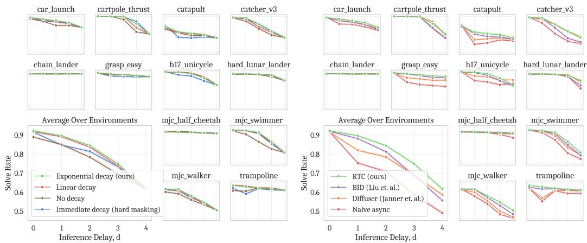  
Figure 8: Left: Simulated ablation over different schedules for soft masking weights (Eq. 5). Exponential decay performs the best overall, although linear decay is very close behind. Right: Comparison with the inpainting algorithm from Diffuser [26], which overwrites a portion of the action chunk with the desired actions at each denoising step. While this simpler (and cheaper) inpainting method still provides some benefit, it is outperformed by our guidance-based approach.

## A.5 Hyperparameters

<table><tr><td>Hyperparameter</td><td>Description</td><td>Simulation</td><td>Real-world</td></tr><tr><td>n</td><td>Denoising steps</td><td>5</td><td>5</td></tr><tr><td>H</td><td>Prediction horizon</td><td>8</td><td>50</td></tr><tr><td> $s_{\text{min}}$ </td><td>Minimum execution horizon</td><td>-</td><td>25</td></tr><tr><td>β</td><td>Guidance weight clipping</td><td>5</td><td>5</td></tr><tr><td>b</td><td>Delay buffer size</td><td>-</td><td>10</td></tr></table>

Table 4: Hyperparameters used for RTC (Algorithm 1). In simulation, d is held constant for each experiment, so smin and b are not needed. Additional hyperparameters for the simulated experiments can be found in the code.

## A.6 Code Release

The code for the simulated experiments is available at https://github.com/ Physical-Intelligence/real-time-chunking-kinetix.

## A.7 Compute Resources

All the experiments in this work use no more than 8 NVIDIA H100 GPUs (one NVIDIA DGX server) at a time. H100s are used via a cloud provider.

Simulated experiments. Training expert policies with RPO [50] with 6 seeds × 12 environments takes approximately 4 hours on 4xH100s. Generating data from those policies takes approximately 20 minutes on 6xH100s. Training imitation learning policies with flow matching for each environment takes approximately 1.5 hours on 2xH100s. Evaluating the policies for 2048 trials per environment takes approximately 5 minutes on 6xH100s.

Real-world experiments. We use policies fine-tuned from the $\pi _ { 0 . 5 } \left[ 2 4 \right]$ base model. Each fine-tuning run takes approximately 24 hours on 8xH100s. All of our real-world inference is done on a single NVIDIA RTX 4090 GPU in a workstation in the same building as the robots.