# Sci-VLA: Agentic VLA Inference Plugin for Long-Horizon Tasks in Scientific Experiments

Yiwen Pang1,2, Bo Zhou1,2, Changjin Li1,2, Xuanhao Wang1,2, Shengxiang Xu1,2, Deng-Bao Wang1,2, Min-Ling Zhang1,2, Shimin Di1,2

1School of Computer Science and Engineering & School of Software Engineering

& School of Artificial Intelligence, Southeast University, Nanjing, China

2Pattern Learning and Mining Lab, Southeast University, Nanjing, China

{pangyiwen, bozhou, changjinli, xuanhao\_wong, xushx, wangdb, zhangml, shimin.di}@seu.edu.cn

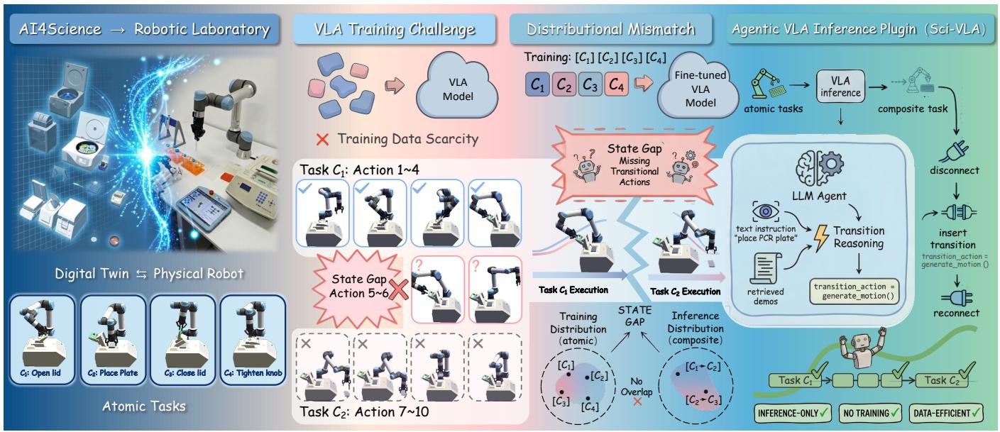

<details>
<summary>flowchart</summary>

```mermaid
graph TD
    A["AI4Science → Robotic Laboratory"] --> B["VLA Training Challenge"]
    B --> C["Training Data Scarcity"]
    C --> D["Task C1: Action 1~4"]
    D --> E["State Gap Action 5~6"]
    E --> F["Task C2: Action 7~10"]
    F --> G["Task C1 Execution"]
    G --> H["State Gap"]
    H --> I["Task C2 Execution"]
    I --> J["Inference Distribution (composite)"]
    J --> K["No Overlap"]
    K --> L["STATE GAP"]
    L --> M["Training Distribution (atomic)"]
    M --> N["[C1"]]
    M --> O["[C2"]]
    M --> P["[C3"]]
    M --> Q["[C4"]]
    I --> R["Transition Reasoning"]
    R --> S["Text instruction &quot;place PCR plate&quot;"]
    S --> T["Retrieved demos"]
    T --> U["transition_action = generate_motion()"]
    U --> V["reconnect"]
    V --> W["AGentic VLA Inference Plugin (Sci-VLA)"]
    W --> X["VLA inference"]
    X --> Y["atomic tasks"]
    Y --> Z["VLA inference"]
    Z --> AA["composite task"]
    AA --> AB["disconnect"]
    AB --> AC["insert transition transition_action = generate_motion()"]
    AC --> AD["reconnect"]
    AD --> AE["INFERENCE-ONLY ✓"]
    AE --> AF["NO TRAINING ✓"]
    AF --> AG["DATA-EFFICIENT ✓"]
```
</details>

Figure 1: Vision-language-action (VLA) models often suffer from the state gap issue when inferring the open and long-horizon task in scientific scenarios. This paper proposes an agentic VLA inference plugin to generate transitional actions, thus bridging the gaps among composite tasks. We verify its effectiveness on multiple 3-/5-/8-step tasks in the digital-twin system.

# Abstract

Robotic laboratories play a critical role in autonomous scientific discovery by enabling scalable, continuous experimental execution. Recent vision–language–action (VLA) models offer a promising foundation for robotic laboratories. However, scientific experiments typically involve long-horizon tasks composed of multiple atomic tasks, posing a fundamental challenge to existing VLA models. While VLA models fine-tuned for scientific tasks can reliably execute atomic experimental actions seen during training, they often fail to perform composite tasks formed by reordering and composing these known atomic actions. This limitation arises from a distributional mismatch between training-time atomic tasks and inference-time composite tasks, which prevents VLA models from executing necessary transitional operations between atomic tasks. To address this challenge, we propose an Agentic VLA Inference Plugin for Long-Horizon Tasks in Scientific Experiments. It introduces an LLM-based agentic inference mechanism that intervenes when executing sequential manipulation tasks. By performing explicit transition inference and generating transitional robotic action code, the proposed plugin guides VLA models through missing transitional steps, enabling reliable execution of composite scientific workflows without any additional training. This inference-only intervention makes our method computationally efficient, dataefficient, and well-suited for open-ended and long-horizon robotic laboratory tasks. We build 3D assets of scientific instruments and common scientific operating scenes within an existing simulation environment. In these scenes, we have verified that our method increases the average success rate per atomic task by 42% during inference. Furthermore, we show that our method can be easily transferred from the simulation to real scientific laboratories.

# Keywords

Vision-Language-Action Model, Robotic Lab, AI4Science

# 1 Introduction

In recent years, the AI4Science paradigm [42] has evolved from single-model approaches [3, 20] toward autonomous scientific discovery [14, 24, 34, 41]. Emerging research aims to directly embed artificial intelligence into scientific workflows to systematically enhance the entire research lifecycle [6, 24, 39]. In such a context, a robotic laboratory plays a critical role in enabling autonomous discovery [8, 13, 39]. It creates experimental environments with high-precision control, strong reproducibility, and large-scale execution capabilities, substantially accelerating scientific progress while reducing labor and time costs. Moreover, robots capable of continuous, unattended operation significantly reduce researchers’ exposure to hazardous experimental conditions. For example, mobile robotic chemists have demonstrated the feasibility of treating robots as human scientists [8]. And autonomous laboratories have successfully discovered correct synthesis routes for 41 theoretically predicted materials through large-scale automated material synthesis experiments [39].

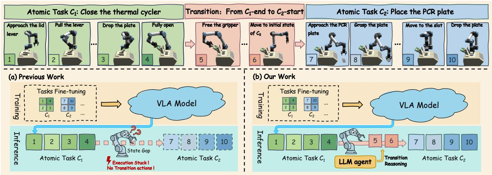

<details>
<summary>flowchart</summary>

```mermaid
graph TD
    A["Atomic Task C1: Close the thermal cycler"] --> B["Transition: From C1-end to C2-start"]
    B --> C["Atomic Task C2: Place the PCR plate"]
    
    subgraph (a) Previous Work
        D["Approach the lid lever 1"] --> E["Pull the lever 2"]
        E --> F["Drop the plate 3"]
        F --> G["Fully open 4"]
        G --> H["Free the gripper 5"]
        H --> I["Move to initial state of C2 6"]
        I --> J["Approach the PCR plate 7"]
        J --> K["Grasp the plate 8"]
        K --> L["Move to the slot 9"]
        L --> M["Drop the plate 10"]
    end
    
    subgraph (b) Our Work
        N["Training Tasks Fine-tuning 1 4 7 10 ... 2 3 8 9 ... C1 C2 ..."] --> O["VLA Model"]
        P["Inference Atomic Task C1 1 2 3 4 State Gap Execution Stuck I No Transition actions I"] --> Q["Atomic Task C2 7 8 9 10"]
        R["Inference Atomic Task C1 1 2 3 4 LLM agent Transition Reasoning"] --> S["Atomic Task C2 5 6 7 8 9 10"]
    end
```
</details>

Figure 2: Given a VLA model fine-tuned for atomic tasks in scientific experiments, it may fail to complete the composite task due to the state gap issue. In this paper, we propose a LLM-based agentic inference plugin to generate transitional robotic execution code, enabling execution of the long-horizon tasks.

Current robotic laboratories typically follow the automation paradigm based on manually programmed, fixed experimental procedures [12]. This choice is largely motivated by the highprecision requirements of scientific experiments. For instance, in high-throughput chemical screening [31], a single experimental cycle typically consists of sample preparation and reaction execution, for which fixed programs for robotic arms provide stability guarantees. However, such rigid workflows limit the robot’s ability to reconfigure task sequences or respond to unforeseen situations, making them ineffective in open-ended experimental settings [35]. As an example, the parameters of a thermal cycler—such as cycle numbers, temperatures, and durations—must be flexibly adjusted according to experimental objectives, templates, and primers (the scientific instrument in Fig. 2), and thus cannot be pre-encoded as a single robot trajectory. Researchers have to spend substantial time repeatedly reconfiguring robot parameters in the laboratory.

Compared with embodied intelligence approaches [1] based on reinforcement learning [38], recent vision–language–action (VLA) models [5, 21] with strong generalization capabilities are better suited to open-ended robotic laboratories. A typical VLA system integrates a vision–language model (VLM) [37, 44] with an action module (typically Transformer [40]), enabling it to interpret natural language instructions, perceive the current visual scene, and generate low-level robotic control commands. Unlike fixed-program systems, this paradigm allows robots to understand diverse natural language inputs and rapidly switch operational modes, making it potentially promising for open-ended laboratory scenarios.

In general, training data for VLA are difficult to acquire [33], and training or fine-tuning such models is computationally intensive [27]. As the set of atomic experimental procedures are generally fixed and finite, VLA models can be trained or fine-tuned using data collected only for atomic tasks. Then, to support diverse experimental protocols, these atomic procedures can be dynamically composed and reordered, resulting in the classic long-horizon challenge in robotics [17, 19]. Interestingly, we observe a long-horizon phenomenon of VLA for scientific experiments: a VLA model fine-tuned for scientific tasks can reliably execute atomic tasks seen during training, yet fails to correctly perform composite tasks constructed from these known atomic actions. As illustrated in Fig. 2 (a), a fine-tuned VLA model can independently execute open-thermal-cycler (Task C.1) and place-PCR-plate (Task C.2), but fails to correctly execute the composite task open–place. This limitation stems from the distributional mismatch between training-time data and inferencetime task, which prevents VLA from executing the necessary transitional operations between atomic Task C.1 and Task C.2.

To address this challenge, we propose the Agentic VLA Inference Plugin for Long-Horizon Tasks in Scientific Experiments. Given a VLA model fine-tuned for scientific experiments—i.e., one that has mastered atomic tasks—we introduce an LLM-based agentic inference mechanism that intervenes only when execution failures occur. The agent promptly identifies the state gap, performs transition inference, and generates transitional robotic execution code corresponding to the transition, enabling reliable execution of composite scientific workflows. This inference-only intervention eliminates the need for additional training while enabling VLA models to execute long-horizon scientific workflows, making it computationally efficient, data-efficient, and well-suited for openended, long-horizon robotic laboratory environments. We design multiple long-horizon scientific operation tasks in a simulation environment, and then we test our method on these long-horizon tasks. Experimental results show that our method can significantly improve the success rate on atomic tasks by about 42% across various VLA models. And it will enhance the robot’s execution coherence between every two continuous atomic tasks.

# 2 Related Work

# 2.1 Robotic Laboratories

Robotics labs primarily utilize automated processes involving robotic arms, wheeled robots, and drive shafts to replace human labor in laboratory experiments [7]. For example, a self-driven thin film laboratories [32]. HTRobot [45] can assemble approximately 1400 perovskite film arrangements. A-Lab [39] uses literature-trained language models and thermodynamically active sensing to propose a solid-state synthesis path. A mobile robot chemist [8] automatically explores the ten-dimensional photocatalytic parameter space to find catalysts with performance nearly six times that of the initial formulation. Adam [22] is the first scientist to autonomously discover the function of new genes in yeast through fully automated experiments and hypothesis testing.

# 2.2 Robot Manipulation

Reinforcement Learning-based Methods. Reinforcement learning [38] is a decision-making approach that interacts with the environment and uses rewards as the learning objective. It has demonstrated success in certain real-world scenarios. For example, a reinforcement-learning robot that can make hot dogs with dual arms [26]. A human-in-the-loop reinforcement learning system that achieved strong performance on a wide range of dexterous manipulation tasks [29]. A unified reinforcement learning–based control policy for the whole body to achieve effective shuttlecock tracking and striking [30]. However, robots based on reinforcement learning still find it difficult to be deployed in real open-world scenarios [18]. For example, in scientific experimental operations, continuous interactive learning in a real environment may lead to safety issues. Transferring knowledge from offline reinforcement learning to real-world scenarios is quite challenging [16].

Vision-Language-Action Models. Compared with the reinforcement learning paradigm, the presence of VLM [37, 44] significantly improves the model’s generalization performance in highly openended scenarios. Given discrete time steps $t = \{ 1 , . . . , T \}$ , visual $o _ { t } ^ { v } { : }$ language input $o ^ { l } \in O _ { l } .$ , action space $a _ { t } \in \mathcal { A } ,$ , and combined information defined as: $\mathcal { H } _ { t } = \{ o ^ { l } , o _ { t } ^ { v } \}$ . The goal of VLA is to learn a strategy $\pi : \mathcal { H } _ { t }  \mathcal { A } .$ Currently, there are two mainstream modeling approaches for VLA: autoregression-based methods [21, 46] and diffusion-based methods [5, 28].

Autoregression-based VLAs use combined information $\mathcal { H } _ { t }$ to predict discrete action vectors. First, it maps modal consent to the token sequence: visual observation token $\boldsymbol { z } _ { t } ^ { v } = f _ { v } ( \boldsymbol { o } _ { t } ^ { v } ) \in \mathbb { R } ^ { N _ { v } \times d }$ , language token $z ^ { l } = f _ { l } ( o ^ { l } ) \in \mathbb { R } ^ { N _ { l } \times d }$ . Then, implementing the policy function with a decoder-only transformer:

$$
p (z _ {t} ^ {a} \mid \mathcal {H} _ {t}) = \text { Transformer } _ {\theta} (\left[ z ^ {l}, z _ {1} ^ {v}, \ldots , z _ {t - 1} ^ {v}, z _ {t} ^ {v} \right]) \tag {1}
$$

where the action token $ { \boldsymbol { z } } _ { t } ^ { a }$ is detokenized into discrete action ???? :

$$
a _ {t} = \text { detokenize } (z _ {t} ^ {a}). \tag {2}
$$

For example, RT-2 [46] is an early end-to-end autoregression-based model. Subsequently, OpenVLA [21] replaces the VLM base with an open-source large model, further accelerating VLA model development. ??0\_?? ?????? [36] is an autoregressive VLA model that uses a fast tokenizer, enhancing training speed.

The diffusion-based method primarily follows the stepwise denoising paradigm of diffusion models, enabling VLA to predict continuous actions. Define an action chunk with a time length of ?? and a starting time step ?? : $a _ { t : t + H } .$ . Diffusion-based VLA implementing conditional probability distribution $p ( a _ { t : t + H } \mid \mathcal { H } _ { t } , \tilde { a } _ { t : t + H } )$ , where $\tilde { a } _ { t : t + H } \sim N ( 0 , I )$ is a noisy action chunk. The final continuous action vector needs to be obtained through multiple denoising steps. For example, diffusion policy [10] uses the diffusion model idea to generate action trajectories. RDT [28] uses more dual-arm robot training data and a larger transformer architecture, significantly improving zero-shot generalization performance. ??0 [5] and $\pi _ { 0 . 5 }$ [4] use flow matching algorithms to gradually denoise actions. They use the lightweight VLM: PaliGemma [2] as the base model. After fine-tuning on large-scale robot demonstration data, ??0 and ??0.5 achieve extremely strong generalization performance and can adapt to various household tasks.

Long-Horizon Challenges. Long-horizon tasks are complex tasks that span many time steps, typically formed by concatenating multiple atomic tasks. Solving a long-horizon task involves decomposing it into independent atomic tasks and optimizing each one. In reinforcement learning, hierarchical reinforcement learning is primarily used to decompose and solve long-horizon tasks [15, 23]. However, task decomposition can lead to issues such as error accumulation because it does not account for the connections and dependencies among atomic tasks. This is a challenge called skill chaining [23] that needs to be addressed by hierarchical reinforcement learning methods. For example, a reinforcement learning-based dressing robot that aligns the state distributions of pre- and post-tasks to address the skill chaining problem [11]. Sequential dexterity is a reinforcement learning system that progressively finetunes the sub-policies to enhance the chaining success rate [9].

VLA models leverage the task decomposition capabilities of VLM backbones or incorporate atomic task decomposition during training, which improve the model’s generalization to long-horizon tasks. For example, $\pi _ { 0 . 5 }$ [4] adds task decomposition data pairs during VLM pretraining. LohoVLA [43] generates token information for atomic tasks before generating action tokens. LongVLA [17] allows the model to focus on different visual information during different phases of movement and interaction, reducing the interference of redundant information during the task transition periods. However, most of this work focuses on task decomposition and dataset processing, requiring training to achieve performance on long-horizon tasks.

# 3 Sci-VLA: Agentic VLA Inference Plugin

We design a plugin to assist VLA’s inference. Specifically, when an atomic task sequence arrives, the plugin will repeatedly generate transitional actions between tasks and insert them into the actions output by VLA.

Agentic VLA Inference Plugin (Sci-VLA)   
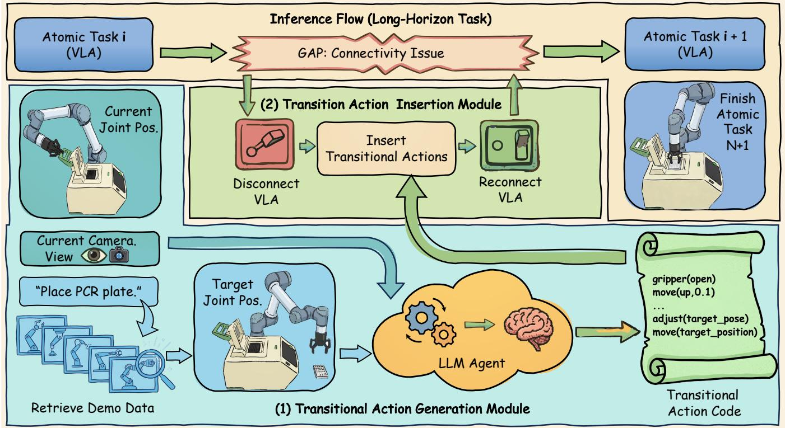

<details>
<summary>flowchart</summary>

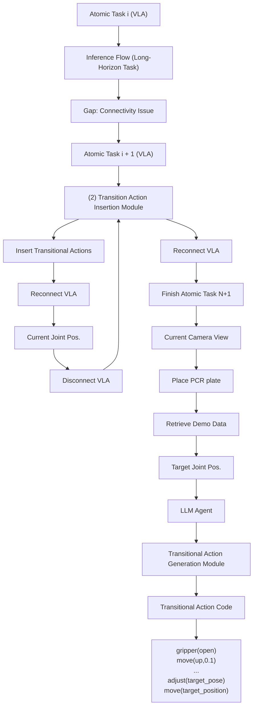
</details>

Figure 3: The illustration of the Sci-VLA pipeline. Includes two modules: transitional action generation and transitional action insertion. The plugin and VLA will alternate in executing the sequence of atomic tasks.

# 3.1 Finetuning VLA for Atomic Tasks

The process of fine-tuning the VLA is essentially the same as that used in traditional methods. In Sec. 4, we use $\pi _ { 0 } ~ [ 5 ] , \pi _ { 0 . 5 } ~ [ 4 ]$ and ?? ?????? [36] as our base VLA models. To make the VLA model more focused on atomic tasks, we collected task data that are all independent. For example, for a long sequence of tasks involving operating an instrument (i.e. ozone cleaner, see in Fig. 5), we break it down into multiple atomic tasks: open the instrument - place an object - close the instrument - manipulate the instrument panel. Each atomic task starts from a randomly selected initial position of the robotic arm, and the environment, including object positions, is randomized as well.

# 3.2 Inference Atomic Tasks Sequence

In the Sci-VLA inference process, the generation module generates a transitional action code after receiving the next atomic task ?? + 1 prompt. Then the insertion module interrupts VLA’s inference when the pre-atomic-task ?? finishes. The transitional actions will be generated and inserted into the action sequence. Finally, the VLA resumes inference for the subsequent task (See in Fig. 3). The two modules operate iteratively. This cycle continues until the entire long-horizon task is finished.

Transitional Action Generation Module. When VLA’s inference stops, the current information will be easily obtained, including the current joint positions ???????? \_????????, the current main

camera view image $o _ { t } ^ { v } ,$ and the description of the next atomic task $o _ { i + 1 } ^ { l }$ . Then, the generation module retrieves the target joint position ????????????\_???????? from the training data D by the target task description $o _ { i + 1 } ^ { l }$ . Specifically, we first extract a description set $\mathcal { P } = \{ p _ { 1 } , . . . , p _ { K } \}$ containing all descriptions of atomic tasks, where ?? stands for the number of training tasks. Then we let GPT-5.2 identify the task whose semantics are closest to the target task. It allows us to extract the target atomic task’s first joint position.

$$
\mathcal {P} = \operatorname{Extract} (\mathcal {D}) \tag {3}
$$

$$
t a r g e t \_ p o s = S e a r c h (o _ {i + 1} ^ {l}, \mathcal {P}, \mathcal {D}) \tag {4}
$$

After obtaining all the information we need, use GPT-5.2 to generate transitional action code $C _ { i \to i + 1 }$ .

$$
C _ {i \rightarrow i + 1} = \operatorname{GPT} (o _ {i + 1} ^ {l}, o _ {t} ^ {v}, t a r g e t \_ q p o s, c u r r \_ q p o s) \tag {5}
$$

However, contents generated by LLMs may exhibit hallucination. To address this issue and obtain the specified executable target code, we provide an output template in the prompt (See in Fig. 12). We annotate the parts that need to be modified in the execute function and provide each movable interface, such as translating along a certain axis and joint recovery. For the Agent, it only needs to analyze the direction and value of the end-effector movement.

Meanwhile, safety is the primary priority in scientific experiments. In both prompts and code templates, we add certain constraint terms, such as “avoiding collisions”. Additionally, in the code template, we set some rules: first, we must check whether the gripper of the robotic arm needs to be released and whether there are any obstacles near the gripper and the arm. This establishes that the first part of the transitional action is obstacle avoidance: moving the gripper to a safe position. Then, the target joint position is restored using the retrieved data. Once the restoration is successful, the VLA inference process can proceed. Fig. 13 illustrates an example of a generated result, where we first let the robotic arm avoid obstacles as much as possible, and then use the joint recovery function to reach the target joint positions. When the code is generated, control switches to the insertion module.

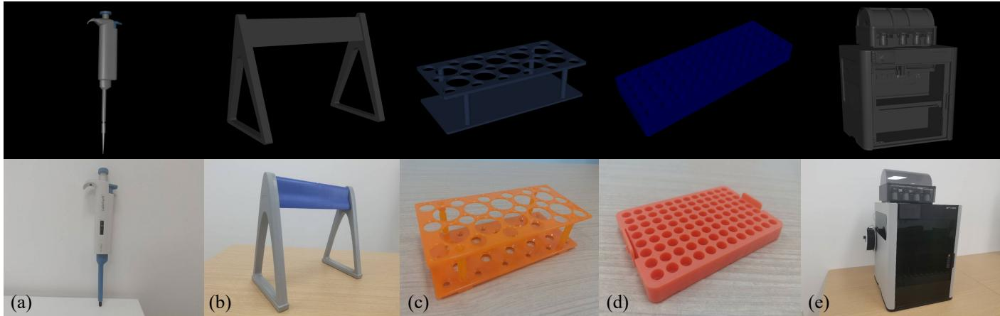  
Figure 4: Some scientific simulated objects we used and their corresponding real object. Top: 3D simulated assets. Bottom: real objects. (a) Pipette. (b) Pipette rack. (c) Centrifuge tube rack. (d) Centrifuge tube plate. (e) 3D printer.

Transitional Action Insertion Module. The insertion module is an action switch that toggles between the plugin and VLA. We set the maximum runtime ???? for each atomic task in advance (in the experiment section, this is the average demonstration time per atomic task). When the VLA reaches the final inference step, the module terminates the inference process regardless of the task completion status. In practice, if we do not actively terminate the VLA inference, the robotic arm will continue to tremble. Once the transitional actions are generated by the generation module, VLA’s inference is restored, allowing it to continue automatically executing the next atomic task.

# 3.3 Digital Twin

We utilize a simulated scientific laboratory system to verify our method. This simulation facilitates efficient data collection and prevents potential damage to physical instruments. In this paper, we employ the Autobio [25] laboratory environment, a biology lab built on the MuJoCo engine. It incorporates essential instruments and equipment for biological research. Experimental operations are performed using the UR5e robotic arm for long-horizon tasks. Additionally, to verify the effectiveness of our method, we have constructed a real-world scenario based on the simulation system to demonstrate the transferability of Sci-VLA from simulation to a real laboratory.

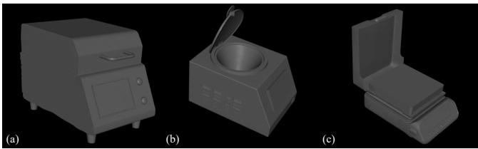

<details>
<summary>natural_image</summary>

Three grayscale 3D renderings of industrial devices: a microwave oven, a cylindrical tank with a lid, and an open toilet (no text or symbols visible)
</details>

Figure 5: Some newly added instrument 3D assets examples. (a) Ozone cleaner. (b) Spin coater. (c) Hot plate.

# 4 Experiments

# 4.1 Experiments Setup

Task Setup. First, we design a “cleaning table” task in pick-andplace scenarios. It is composed of 3 pick-and-place atomic tasks: (1) pick pipette tip box into the basket, (2) pick PCR plate into the basket, and (3) pick centrifuge tube into the basket (See in Fig. 9). The order of atomic tasks goes from simple to difficult. For example, a PCR plate is harder to pick up than a pipette tip box because it is wider and thinner. Centrifuge tubes have a smaller diameter, requiring more precise handling.

Then, we design 6 long-horizon tasks specifically for scientific operations (See in Fig. 7). These long-horizon tasks are primarily designed around interactions between scientific instruments (e.g., centrifuges and thermal cyclers) and objects (e.g., tube racks, tubes, and PCR plates). The end state of the previous atomic task will affect the execution of the next atomic task. For example, if the centrifuge lid does not open, placing the centrifuge tubes will inevitably fail.

We collect all these atomic tasks separately, and in each atomic task, we randomize the scenes. For example, test tubes are placed in a randomly selected slot on a rack, and PCR plates appear randomly within a designated area. During the inference phase, we will fix the prompt for each long task. Each time, we make slight perturbations to the robotic arm’s initial state.

Evaluation Metrics. For each long task sequence, we let Sci-VLA and the base VLA model repeatedly infer 20 times. One inference refers to a long task from atomic task 1 to the last atomic task.

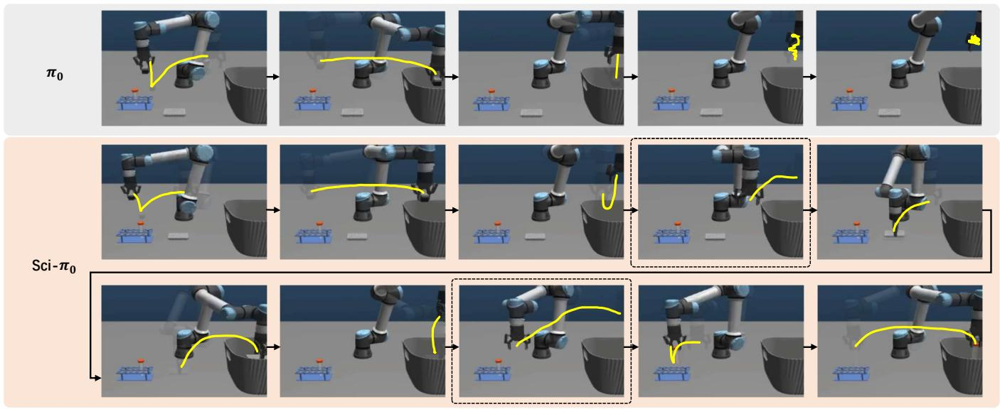

<details>
<summary>flowchart</summary>

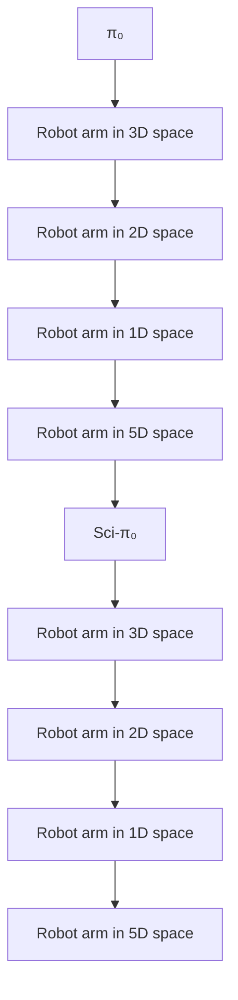
</details>

Figure 6: Action trajectory recording diagram for base model ??0 executing task sequence in 2 situations: simulation and realworld. The yellow lines represent the trajectory of the end effector. The dashed box indicates the trajectory of the transitional actions. Simulated cleaning table task: pick 3 objects into the basket.

We define from the end state of atomic task ?? to the end state of atomic task ?? + 1 as an atomic execution process. In each process, we record the success count over 20 tries.

In addition, we do not count instances where Sci-VLA fails to generate transitional action code (possible reasons include bugs in the code or network issues). All the data in the tables is obtained from executing complete action sequences.

# 4.2 Results

4.2.1 Basic Validation. We select two diffusion-based VLAs $\pi _ { 0 }$ [5] and $\pi _ { 0 . 5 } \left[ 4 \right]$ and one autoregression-based VLA ?? ?????? [36] as our base models. We generate 100 demonstrations for each atomic task in “cleaning table” and fine-tune all three base models for 80,000 steps. Then set the maximum inference time for each atomic task to 3 seconds. If the time limit is exceeded, the inference is automatically terminated, and the process immediately moves on to the next atomic task.

As shown in Tab. 1, base VLA models only achieve good performance on the first atomic task. Since our atomic task training data are collected separately, tasks can easily lack transitions. The robotic arm enters an out-of-distribution state after finishing the first task. It shows that VLA only memorizes the trajectory, without truly understanding the tasks. In addition, it can be observed that Sci-VLA has a low success rate on atomic task 2 and 3, which is due to the different performance of the base VLA models. It can be seen that $\pi _ { 0 }$ and $\pi _ { 0 . 5 }$ generalize better than ?? ??????. Compared to $\pi _ { 0 } .$ $\pi _ { 0 . 5 }$ is better suited for more challenging atomic tasks.

4.2.2 Atomic Task Coherence. In the “cleaning table” task, Sci-VLA achieves higher task coherence (shown in Fig. 6). The base model $\pi _ { 0 }$ is confused when starting the second atomic task, exhibiting continuous jitter. This jitter will not stop until the entire inference time

Table 1: Results of the baseline comparison for the “cleaning table” task. “Sci-” means the model uses our inference plugin. Test a total of 20 times. Each test requires the model to complete an entire atomic task sequence. Data statistics only check the final state of each atomic task. 

<table><tr><td rowspan="2">Method</td><td colspan="3">Success Rate</td></tr><tr><td>Atomic task 1</td><td>Atomic task 2</td><td>Atomic task 3</td></tr><tr><td> $\pi_0$  (finetuned)</td><td>14/20 (70%)</td><td>0/20 (0%)</td><td>0/20 (0%)</td></tr><tr><td>Sci- $\pi_0$  (ours)</td><td>14/20 (70%)-</td><td>10/20 (50%)50% ↑</td><td>4/20 (20%)20% ↑</td></tr><tr><td> $\pi_{0.5}$  (finetuned)</td><td>13/20 (65%)</td><td>0/20 (0%)</td><td>0/20 (0%)</td></tr><tr><td>Sci- $\pi_{0.5}$  (ours)</td><td>12/20 (60%)-</td><td>3/20 (15%)15% ↑</td><td>9/20 (45%)45% ↑</td></tr><tr><td>fast (finetuned)</td><td>10/20 (50%)</td><td>0/20 (0%)</td><td>0/20 (0%)</td></tr><tr><td>Sci-fast (ours)</td><td>10/20 (50%)-</td><td>5/20 (25%)25% ↑</td><td>5/20 (25%)25% ↑</td></tr></table>

is exhausted. On the contrary, Sci-??0 maintains a complete execution trajectory throughout all the atomic tasks. Even if one atomic task fails, Sci- $\cdot \pi _ { 0 } { } ^ { \ ' } \mathfrak { s }$ s transitional actions ensure that subsequent tasks’ actions.

4.2.3 Long Experimental Operation Tasks. For scientific operations, we still collect 100 demonstration data for each atomic task (a total of 14 different atomic tasks). We mix the data and set the batch size to 32, and use this dataset to fine-tune $\pi _ { 0 }$ for 100,000 steps on 4 NVIDIA H100 GPUs. Then the fine-tuned model is prepared to perform tasks with a robotic arm under random initial disturbances.

As shown in Fig. 7, Sci-VLA still achieves a higher success rate in scientific scenarios, regardless of the length of the task sequence.

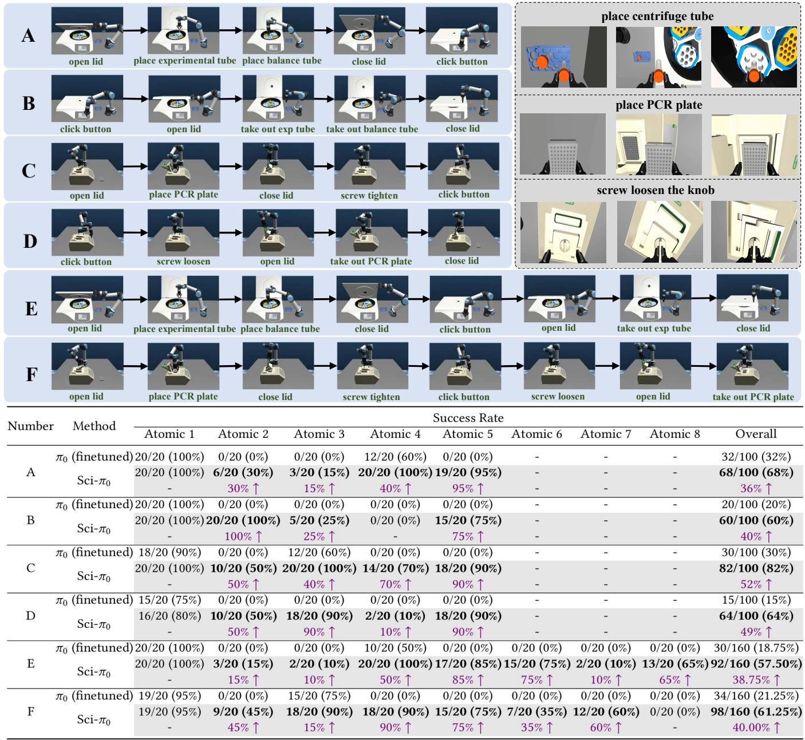  
Figure 7: Results of scientific operations in the centrifuge and thermal cycler scenario. Top left: Flow charts of continuous atomic tasks for operating instruments. Top right: Images from the wrist camera of 3 atomic tasks with high precision requirements. Bottom: Success rates of each atomic task. Each sequence is tested 20 times.

Notably, we observe some counterintuitive phenomena in the baseline results: the high success rates for task A.4 (close centrifuge lid) and task C.3 (close thermal cycler lid). The reason is that the initial states of task A4 align with the end state of A3. The gripper happened to be on the lid when performing task A.4. This indicates a strong reliance on the data among these base VLA models, as the limited training set does not include all joint positions.

Theoretically, Sci-VLA focuses only on transitions between atomic tasks and does not address issues within those tasks. Therefore,

for some tasks with high precision requirements, such as placing centrifuge tube or placing a PCR plate into slots(See top right in Fig. 7), the success rate depends solely on the VLA base model itself. Fig. 10 is an example of the thermal cycler slot. A PCR plate usually has many wells, and placing it into a slot from above requires extremely high precision. Additionally, PCR plates may be soft, and when the gripper holds the plate, deformation may occur. This situation significantly increases the difficulty of the atomic task. Future research should prioritize improving operational precision and balancing the distribution of simple and complex demonstrations in datasets to mitigate training imbalances.

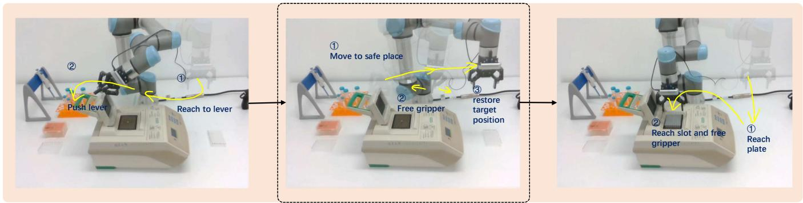

<details>
<summary>flowchart</summary>


</details>

Figure 8: Real scenario of operating the thermal cycler (Task ??1 → ??2). The trajectories within the dashed box indicate transitional actions.

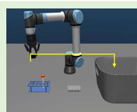  
place pipette tip box

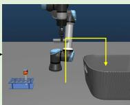  
place PCR plate

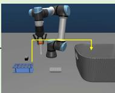  
place centrifuge tube   
Figure 9: The flow chart of “cleaning table” is composed of simple pick-and-place tasks. The order of execution goes from simple to difficult. Arrows represent the end effector’s motion trajectory.

4.2.4 Real Environment Demonstration. In this subsection, we verify that our method is not only applicable in simulated environments but also effective in real laboratory settings. We set up a real-world task scenario based on Task C in Fig. 7: operating a thermal cycler. This composite task consists of two atomic tasks: C.1:opening the thermal cycler lid and C.2:placing a PCR plate inside.

We finetune ??0 with these two atomic tasks. Fig. 8 illustrates a live demonstration of this sequence, showing the decomposition of actions in the transition trajectory inferred by our method. During this demonstration, the robotic arm first moves to a position away from the instrument cover. Then, the gripper releases, ensuring the execution of the next atomic task. Finally, the robotic arm moves to the starting position of the next atomic task. The trajectory of task C.1 to C.2 is complete and coherent.

# 5 Conclusion

This paper proposes an inference plugin for VLA models in scientific robot manipulation, requiring no retraining. It aims to address the discontinuity in transitions between atomic tasks during highintensity, continuous atomic-task operations at the VLA. Additionally, we augment the biological laboratory simulation environment provided by Autobio with objects and instruments commonly used

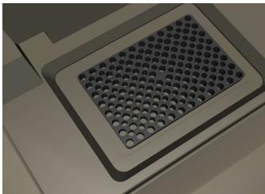

<details>
<summary>natural_image</summary>

Close-up of a perforated metal grate with circular holes, no text or symbols visible
</details>

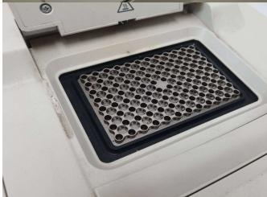

<details>
<summary>natural_image</summary>

Close-up of a laboratory pipette with a grid-patterned base (no visible text or symbols)
</details>

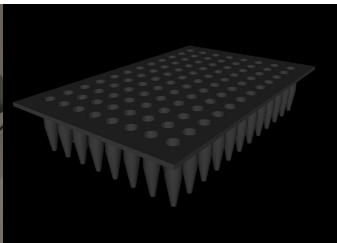

<details>
<summary>natural_image</summary>

3D rendering of a microarray pipette with uniform needle-like tip (no text or symbols)
</details>

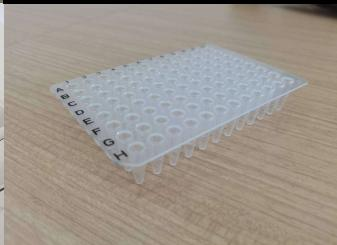

<details>
<summary>natural_image</summary>

Close-up of a small white laboratory pipette with hexagonal wells, placed on a wooden surface (no text or symbols visible)
</details>

Figure 10: Top: 3D assets of a thermal cycler slot (left) and a PCR plate (right). Bottom: corresponding real objects

in other laboratories (e.g., chemistry) and establish a test framework for continuous operational tasks in scientific laboratories. Experiments show that Sci-VLA will improve the success rate of subsequent atomic tasks and enhance their coherence.

Although our plugin includes some safety constraints in the code template, it cannot completely guarantee the correctness of the action trajectories generated by the LLM. In cases where collisions are likely, we will let GPT-5.2 repeatedly generate new actions, which will slow down the inference of the entire task. Future work could focus on aligning LLM-agent and VLA inference times to minimize latency. Or use a locally fine-tuned code agent for transitional action reasoning, which can eliminate the impact of network latency.

Meanwhile, our experiments show that VLA is highly sensitive to the quality of the training set. VLA continues to improve its generalization performance on new scenarios and tasks, relying on the diligent data-collection efforts of researchers. In future work, VLA should adapt low-quality data to learn high-quality execution capabilities.

# References

[1] Zhulin An, Xinqiang Yu, Chu Wang, Yinlong Zhang, and Chunhe Song. 2025. Embodied intelligence: Recent advances and future perspectives. The Innovation Informatics 1, 1 (2025), 100008–1.   
[2] Lucas Beyer, Andreas Steiner, André Susano Pinto, Alexander Kolesnikov, Xiao Wang, Daniel Salz, Maxim Neumann, Ibrahim Alabdulmohsin, Michael Tschannen, Emanuele Bugliarello, et al. 2024. PaliGemma: A versatile 3B VLM for transfer. CoRR (2024).   
[3] Kaifeng Bi, Lingxi Xie, Hengheng Zhang, Xin Chen, Xiaotao Gu, and Qi Tian. 2023. Accurate medium-range global weather forecasting with 3D neural networks. Nature 619, 7970 (2023), 533–538.   
[4] Kevin Black, Noah Brown, James Darpinian, Karan Dhabalia, Danny Driess, Adnan Esmail, Michael Robert Equi, Chelsea Finn, Niccolo Fusai, Manuel Y Galliker, et al. 2025. ??0.5: a Vision-Language-Action Model with Open-World Generalization. In 9th Annual Conference on Robot Learning.   
[5] Kevin Black, Noah Brown, Danny Driess, Adnan Esmail, Michael Equi, Chelsea Finn, Niccolo Fusai, Lachy Groom, Karol Hausman, Brian Ichter, et al. 2024. ??0: A Vision-Language-Action Flow Model for General Robot Control. arXiv preprint arXiv:2410.24164 (2024).   
[6] Daniil A Boiko, Robert MacKnight, Ben Kline, and Gabe Gomes. 2023. Autonomous chemical research with large language models. Nature 624, 7992 (2023), 570–578.   
[7] James Boyd. 2002. Robotic laboratory automation. Science 295, 5554 (2002), 517–518.   
[8] Benjamin Burger, Phillip M Maffettone, Vladimir V Gusev, Catherine M Aitchison, Yang Bai, Xiaoyan Wang, Xiaobo Li, Ben M Alston, Buyi Li, Rob Clowes, et al. 2020. A mobile robotic chemist. Nature 583, 7815 (2020), 237–241.   
[9] Yuanpei Chen, Chen Wang, Li Fei-Fei, and Karen Liu. 2023. Sequential Dexterity: Chaining Dexterous Policies for Long-Horizon Manipulation. In Conference on Robot Learning. PMLR, 3809–3829.   
[10] Cheng Chi, Zhenjia Xu, Siyuan Feng, Eric Cousineau, Yilun Du, Benjamin Burchfiel, Russ Tedrake, and Shuran Song. 2025. Diffusion policy: Visuomotor policy learning via action diffusion. The International Journal of Robotics Research 44, 10-11 (2025), 1684–1704.   
[11] Alexander Clegg, Wenhao Yu, Jie Tan, C Karen Liu, and Greg Turk. 2018. Learning to dress: Synthesizing human dressing motion via deep reinforcement learning. ACM Transactions on Graphics (TOG) 37, 6 (2018), 1–10.   
[12] Connor W Coley, Natalie S Eyke, and Klavs F Jensen. 2020. Autonomous discovery in the chemical sciences part I: Progress. Angewandte Chemie International Edition 59, 51 (2020), 22858–22893.   
[13] Connor W Coley, Dale A Thomas III, Justin AM Lummiss, Jonathan N Jaworski, Christopher P Breen, Victor Schultz, Travis Hart, Joshua S Fishman, Luke Rogers, Hanyu Gao, et al. 2019. A robotic platform for flow synthesis of organic compounds informed by AI planning. Science 365, 6453 (2019), eaax1566.   
[14] Yahao Dai, Henry Chan, Aikaterini Vriza, Jingyuan Fan, Fredrick Kim, Yunfei Wang, Wei Liu, Naisong Shan, Jing Xu, Max Weires, et al. 2025. Adaptive AI decision interface for autonomous electronic material discovery. Nature Chemical Engineering (2025), 1–11.   
[15] Thomas G Dietterich. 2000. Hierarchical reinforcement learning with the MAXQ value function decomposition. Journal of Artificial Intelligence Research 13 (2000), 227–303.   
[16] Gabriel Dulac-Arnold, Nir Levine, Daniel J Mankowitz, Jerry Li, Cosmin Paduraru, Sven Gowal, and Todd Hester. 2021. Challenges of real-world reinforcement learning: definitions, benchmarks and analysis. Machine Learning 110, 9 (2021), 2419–2468.   
[17] Yiguo Fan, Shuanghao Bai, Xinyang Tong, Pengxiang Ding, Yuyang Zhu, Hongchao Lu, Fengqi Dai, Wei Zhao, Yang Liu, Siteng Huang, et al. 2025. Long-VLA: Unleashing Long-Horizon Capability of Vision Language Action Model for Robot Manipulation. In Conference on Robot Learning. PMLR, 2018–2037.   
[18] Dibya Ghosh, Jad Rahme, Aviral Kumar, Amy Zhang, Ryan P Adams, and Sergey Levine. 2021. Why generalization in rl is difficult: Epistemic pomdps and implicit partial observability. Advances in neural information processing systems 34 (2021), 25502–25515.   
[19] Abhishek Gupta, Vikash Kumar, Corey Lynch, Sergey Levine, and Karol Hausman. 2020. Relay Policy Learning: Solving Long-Horizon Tasks via Imitation and Reinforcement Learning. In Conference on Robot Learning. PMLR, 1025–1037.   
[20] John Jumper, Richard Evans, Alexander Pritzel, Tim Green, Michael Figurnov, Olaf Ronneberger, Kathryn Tunyasuvunakool, Russ Bates, Augustin Žídek, Anna Potapenko, et al. 2021. Highly accurate protein structure prediction with AlphaFold. Nature 596, 7873 (2021), 583–589.   
[21] Moo Jin Kim, Karl Pertsch, Siddharth Karamcheti, Ted Xiao, Ashwin Balakrishna, Suraj Nair, Rafael Rafailov, Ethan P Foster, Pannag R Sanketi, Quan Vuong, et al. 2025. OpenVLA: An Open-Source Vision-Language-Action Model. In Conference on Robot Learning. PMLR, 2679–2713.   
[22] Ross D King, Jem Rowland, Stephen G Oliver, Michael Young, Wayne Aubrey, Emma Byrne, Maria Liakata, Magdalena Markham, Pinar Pir, Larisa N Soldatova, et al. 2009. The automation of science. Science 324, 5923 (2009), 85–89.

[23] George Konidaris and Andrew Barto. 2009. Skill discovery in continuous reinforcement learning domains using skill chaining. Advances in neural information processing systems 22 (2009).   
[24] Brent A Koscher, Richard B Canty, Matthew A McDonald, Kevin P Greenman, Charles J McGill, Camille L Bilodeau, Wengong Jin, Haoyang Wu, Florence H Vermeire, Brooke Jin, et al. 2023. Autonomous, multiproperty-driven molecular discovery: From predictions to measurements and back. Science 382, 6677 (2023), eadi1407.   
[25] Zhiqian Lan, Yuxuan Jiang, Ruiqi Wang, Xuanbing Xie, Rongkui Zhang, Yicheng Zhu, Peihang Li, Tianshuo Yang, Tianxing Chen, Haoyu Gao, et al. 2025. Autobio: A simulation and benchmark for robotic automation in digital biology laboratory. arXiv preprint arXiv:2505.14030 (2025).   
[26] Xiao Li, Zachary Serlin, Guang Yang, and Calin Belta. 2019. A formal methods approach to interpretable reinforcement learning for robotic planning. Science Robotics 4, 37 (2019), eaay6276.   
[27] Xinyu Lin, Wenjie Wang, Yongqi Li, Shuo Yang, Fuli Feng, Yinwei Wei, and Tat-Seng Chua. 2024. Data-efficient Fine-tuning for LLM-based Recommendation. In Proceedings of the 47th international ACM SIGIR conference on research and development in information retrieval. 365–374.   
[28] Songming Liu, Lingxuan Wu, Bangguo Li, Hengkai Tan, Huayu Chen, Zhengyi Wang, Ke Xu, Hang Su, and Jun Zhu. 2025. RDT-1B: a Diffusion Foundation Model for Bimanual Manipulation. In The Thirteenth International Conference on Learning Representations.   
[29] Jianlan Luo, Charles Xu, Jeffrey Wu, and Sergey Levine. 2025. Precise and dexterous robotic manipulation via human-in-the-loop reinforcement learning. Science Robotics 10, 105 (2025), eads5033.   
[30] Yuntao Ma, Andrei Cramariuc, Farbod Farshidian, and Marco Hutter. 2025. Learning coordinated badminton skills for legged manipulators. Science Robotics 10, 102 (2025), eadu3922.   
[31] Ricardo Macarron, Martyn N Banks, Dejan Bojanic, David J Burns, Dragan A Cirovic, Tina Garyantes, Darren VS Green, Robert P Hertzberg, William P Janzen, Jeff W Paslay, et al. 2011. Impact of high-throughput screening in biomedical research. Nature Reviews Drug Discovery 10, 3 (2011), 188–195.   
[32] Benjamin P MacLeod, Fraser GL Parlane, Thomas D Morrissey, Florian Häse, Loïc M Roch, Kevan E Dettelbach, Raphaell Moreira, Lars PE Yunker, Michael B Rooney, Joseph R Deeth, et al. 2020. Self-driving laboratory for accelerated discovery of thin-film materials. Science Advances 6, 20 (2020), eaaz8867.   
[33] Ajay Mandlekar, Soroush Nasiriany, Bowen Wen, Iretiayo Akinola, Yashraj Narang, Linxi Fan, Yuke Zhu, and Dieter Fox. 2023. MimicGen: A Data Generation System for Scalable Robot Learning using Human Demonstrations. In Conference on Robot Learning. PMLR, 1820–1864.   
[34] Alexander Novikov, Ngân Vu, Marvin Eisenberger, Emilien Dupont, Po-Sen ˜ Huang, Adam Zsolt Wagner, Sergey Shirobokov, Borislav Kozlovskii, Francisco JR Ruiz, Abbas Mehrabian, et al. 2025. AlphaEvolve: A coding agent for scientific and algorithmic discovery. arXiv preprint arXiv:2506.13131 (2025).   
[35] Koji Ochiai, Yuya Tahara-Arai, Akari Kato, Kazunari Kaizu, Hirokazu Kariyazaki, Makoto Umeno, Koichi Takahashi, Genki N Kanda, and Haruka Ozaki. 2025. Automating Care by Self-maintainability for Full Laboratory Automation. arXiv preprint arXiv:2501.05789 (2025).   
[36] Karl Pertsch, Kyle Stachowicz, Brian Ichter, Danny Driess, Suraj Nair, Quan Vuong, Oier Mees, Chelsea Finn, and Sergey Levine. 2025. Fast: Efficient action tokenization for vision-language-action models. arXiv preprint arXiv:2501.09747 (2025).   
[37] Alec Radford, Jong Wook Kim, Chris Hallacy, Aditya Ramesh, Gabriel Goh, Sandhini Agarwal, Girish Sastry, Amanda Askell, Pamela Mishkin, Jack Clark, et al. 2021. Learning transferable visual models from natural language supervision. In International conference on machine learning. PMLR, 8748–8763.   
[38] Bharat Singh, Rajesh Kumar, and Vinay Pratap Singh. 2022. Reinforcement learning in robotic applications: a comprehensive survey. Artificial Intelligence Review 55, 2 (2022), 945–990.   
[39] Nathan J Szymanski, Bernardus Rendy, Yuxing Fei, Rishi E Kumar, Tanjin He, David Milsted, Matthew J McDermott, Max Gallant, Ekin Dogus Cubuk, Amil Merchant, et al. 2023. An autonomous laboratory for the accelerated synthesis of novel materials. Nature 624, 7990 (2023), 86–91.   
[40] Ashish Vaswani, Noam Shazeer, Niki Parmar, Jakob Uszkoreit, Llion Jones, Aidan N Gomez, Łukasz Kaiser, and Illia Polosukhin. 2017. Attention is all you need. Advances in neural information processing systems 30 (2017).   
[41] Amanda A Volk, Robert W Epps, Daniel T Yonemoto, Benjamin S Masters, Felix N Castellano, Kristofer G Reyes, and Milad Abolhasani. 2023. AlphaFlow: autonomous discovery and optimization of multi-step chemistry using a selfdriven fluidic lab guided by reinforcement learning. Nature Communications 14, 1 (2023), 1403.   
[42] Hanchen Wang, Tianfan Fu, Yuanqi Du, Wenhao Gao, Kexin Huang, Ziming Liu, Payal Chandak, Shengchao Liu, Peter Van Katwyk, Andreea Deac, et al. 2023. Scientific discovery in the age of artificial intelligence. Nature 620, 7972 (2023), 47–60.   
[43] Yi Yang, Jiaxuan Sun, Siqi Kou, Yihan Wang, and Zhijie Deng. 2025. LoHoVLA: A Unified Vision-Language-Action Model for Long-Horizon Embodied Tasks.

arXiv preprint arXiv:2506.00411 (2025).

[44] Jingyi Zhang, Jiaxing Huang, Sheng Jin, and Shijian Lu. 2024. Vision-language models for vision tasks: A survey. IEEE transactions on pattern analysis and machine intelligence 46, 8 (2024), 5625–5644.   
[45] Yicheng Zhao, Jiyun Zhang, Zhengwei Xu, Shijing Sun, Stefan Langner, Noor Titan Putri Hartono, Thomas Heumueller, Yi Hou, Jack Elia, Ning Li, et al. 2021. Discovery of temperature-induced stability reversal in perovskites using highthroughput robotic learning. Nature Communications 12, 1 (2021), 2191.   
[46] Brianna Zitkovich, Tianhe Yu, Sichun Xu, Peng Xu, Ted Xiao, Fei Xia, Jialin Wu, Paul Wohlhart, Stefan Welker, Ayzaan Wahid, et al. 2023. Rt-2: Vision-languageaction models transfer web knowledge to robotic control. In Conference on Robot Learning. PMLR, 2165–2183.

# A Method Details

# A.1 Algorithm

Algorithm 1 Inference Process with Sci-VLA   
Require: Fine-tuned VLA model $M_{VLA}$ , Code agent $M_{VLM}$ , Target task prompt sequence $\{o_{1}^{l},\ldots,o_{N}^{l}\}$ , Atomic task i maximum time limit $T_{i}$ , Training dataset D, Extracted training data prompt set P

Ensure: Executable action sequence A

1: $A \leftarrow \emptyset$ , $i \leftarrow 1$ 2: while $i \leq N$ do

3: $t \leftarrow 0$ 4: while $t \leq T_{i}$ do

5: $a_{t} \leftarrow \mathcal{M}_{\mathrm{VLA}}(o_{i}^{l}, o_{t}^{v})$ 6: $A \leftarrow \text{Append}(a_{t})$ 7: $t \leftarrow t + 1$ 8: end while

9: if i < N then

10: target_qpos $\leftarrow \text{Search}(o_{i+1}^{l}, \mathcal{P}, \mathcal{D})$ 11: $C_{i \rightarrow i+1} \leftarrow \mathcal{M}_{\mathrm{VLM}}(o_{i+1}^{l}, o_{t}^{v}, \text{target\_qpos}, \text{curr\_qpos})$ 12: $a_{t} \leftarrow C_{i \rightarrow i+1}$ 13: $A \leftarrow \text{Append}(a_{t})$ 14: end if

15: $i \leftarrow i + 1$ 16: end while

17: return A

# A.2 Prompt for Agent

Taking the first two atomic tasks of Task A as an example (opening the centrifuge lid - placing a centrifuge tube), we introduce our prompt design for GPT-5.2. First, we let GPT-5.2 be a Python script programmer, and we specify it to generate a sequence of prerequisite actions for the target atomic task. The target atomic task refers to placing the centrifuge tube, and this task description can be easily obtained from the inference pipeline. Next, we specify a series of inputs, as shown in the Fig. 11. These inputs define all the information we can provide: the current task execution state (image), the current robot state (position vector), the target task description, and the target robot state (retrieved). From the current camera’s perspective, we provide cues for each coordinate axis to aid contextual understanding.

# A.3 Code Template

Fig. 12 is an example of a code template we used in the Autobio simulation environment. In the Autobio code, the classes for objects and robotic arms are still retained. We only allow the agent to replace the logic in the execute function.

# B Experiment Details

# B.1 Task Prompt Sequence

At the beginning of inference, we fix the prompt sequences for each long-horizon task and give them to the model. In Tab. 2, we provide all the prompt sequences we used. We will split the entire string into a list of prompts for the individual tasks.

# C Simulation and 3D Assets

Autobio is a biological laboratory simulation system. Fig. 4 lists some 3D assets and the corresponding object details in real-world scenarios. Based on Autobio, we have added some new equipment assets in the field of chemistry, such as the spin coater and ozone cleaner shown in Fig. 5.

You are a professional Python programmer. Please generate complete, executable Python code: a transition task expert who can perform actions from the current robotic arm state to the initial state of the target task.

Logic:   
```txt
Input: 1. target joint position vector: {target_joint_pos}
2. current joint position vector: {current_joint_pos}
3. target task prompt: {task_prompt}
4. current front camera image: The front-to-back direction is the x-axis, the left-to-right direction is the y-axis, and the up-and-down direction is the z-axis.
... 
```

Analyze all these informations, strictly follow the given code template, generate code so that it can execute: current state -> given task initial state safely.

```txt
... 
```

Figure 11: An example of prompts for GPT-5.2 solving opening the centrifuge lid - placing a centrifuge tube.   
```python
#Class definition can't be removed
...
# The real action needs to be replaced
def execute(target_task_prompt):
    # Initial IK, must not be removed
    ik.initial_qpos = data.qpos[self.jnt_span]

    # Firstly, free gripper if needed. Gripper control example: (0~250) 0:open, 250:fully close
    gripper_control(0)

    # Secondly, move to a safe position away from any obstacles
    # X-axis translation example, from current EE pose
    Move(cur_pose.pos + (0.1, 0.0, 0.0))
    # Y-axis translation example, from current EE pose
    ...

    # Thirdly, move to the target joint position. You need to find the target joint position from the target task initial state.
    # These 2 lines are needed in the end of the execute function.
    target_qpos = [0, 0, 0, 0, 0, 0]
    move_to_target_qpos(target_qpos) 
```  
Figure 12: An example of a code template. Different simulations or realistic environments may vary slightly.

```python
def execute(target_task_prompt):
    ...
    # --- Safety-first transition plan ---
    # We are near a centrifuge and a tube rack; safest generic maneuver:
    # 1) open gripper (avoid snagging)
    # 2) lift EE up in +Z (clear objects)
    # 3) shift slightly in -Y (move away from rack area, typically on robot's right in many bench setups)
    # 4) shift slightly in +X (create front clearance)
    # 5) lift a bit more
    # 6) then move in joint space to the target task initial joint state (provided).

    gripper_control(0)
    Move(cur_pose.pos + (0.0, 0.0, 0.12))
    Move(cur_pose.pos + (0.0, -0.10, 0.0))

    ...
    # --- Move to the target joint position (task initial state) ---
    # Searched target joint position vector:
    target_qpos = [0.00488135, -1.4635216, 1.48107634, -1.56855584, -1.44370356, -1.54162118]

    # Use a slightly slower joint interpolation for safety
    move_to_target_qpos(target_qpos, num_steps=1400) 
```  
Figure 13: An example of generated code.

Table 2: Long-horizon task prompt sequences for scientific experiment operations. Two scenarios are included: operating a centrifuge and operating a thermal cycler. In terms of task length, there are two types: 5-element and 8-element. 

<table><tr><td>Task Number</td><td>Task Prompt Sequence</td><td>Type</td></tr><tr><td>A</td><td>“open the lid of the centrifuge5910,pick the experimental centrifuge tube from thereal rack and place it into the centrifuge5910,pick the balance centrifuge tube from the rack and place it into the centrifuge5910,close the lid of the centrifuge5910,press the screen button to start the centrifuge5910”</td><td>5-element</td></tr><tr><td>B</td><td>“press the screen button to stop the centrifuge5910,open the lid of the centrifuge5910,pick the experimental centrifuge tube from the centrifuge5910 and place it on the rack,pick the balance centrifuge tube from the centrifuge5910 and place it on the rack,close the lid of the centrifuge5910”</td><td>5-element</td></tr><tr><td>C</td><td>“open the lid of the thermal cycler,place pcrPlate into the thermal cycler,close the lid of the thermal cycler,screw tighten the knob of the thermal cycler,press the button to start the thermal cycler”</td><td>5-element</td></tr><tr><td>D</td><td>“press the button of the thermal cycler,screw loosen the knob of the thermal cycler,open the lid of the thermal cycler,take pcrPlate from the thermal cycler,close the lid of the thermal cycler”</td><td>5-element</td></tr><tr><td>E</td><td>“open the lid of the centrifuge5910,pick the experimental centrifuge tube from the rack and place it into the centrifuge5910,pick the balance centrifuge tube from the rack and place it into the centrifuge5910,close the lid of the centrifuge5910,press the screen button to start the centrifuge5910,open the lid of the centrifuge5910,pick the experimental centrifuge tube from the centrifuge5910 and place it on the rack,close the lid of the centrifuge5910”</td><td>8-element</td></tr><tr><td>F</td><td>“open the lid of the thermal cycler,place pcrPlate into the thermal cycler,close the lid of the thermal cycler,screw tighten the knob of the thermal cycler,press the button to start the thermal cycler,screw loosen the knob of the thermal cycler,open the lid of the thermal cycler,take pcrPlate from the thermal cycler”</td><td>8-element</td></tr></table>