REVIEW OPEN ACCESS

# GPS‐Denied LiDAR‐Based SLAM—A Survey

Haolong Jiang1,2 | Yikun Cheng3 | Weichen Dai4 | Wenbin Wan5 | Qinyao Liu1 | Fanxin Wang1

1 School of Advanced Technology, Xi'an Jiaotong‐Liverpool University, Suzhou, China | 2 Computer Science, University of Liverpool, Liverpool, UK | 3 Department of Mechanical Science and Engineering, University of Illiois at Urbana‐Champaign, Urbana, Illinois, USA | 4 School of Computer Science, Hangzhou Dianzi University, Hangzhou, China | 5 Department of Mechanical Engineering, University of New Mexico, Albuquerque, New Mexico, USA

Correspondence: Fanxin Wang (Fanxin.Wang@xjtlu.edu.cn)

Received: 21 January 2025 | Revised: 19 June 2025 | Accepted: 18 August 2025

Keywords: filter‐based | GPS‐denied | LiDAR‐based | sensor fusion | SLAM (robots)

# ABSTRACT

In recent years, significant advancements have been made in enabling intelligent unmanned agents to achieve autonomous navigation and positioning within large‐scale indoor or underground environments. Central to these achievements is simultaneous localization and mapping (SLAM) technology. Concurrently, the rapid evolution of LiDAR technologies has revolutionised SLAM, enhancing localisation and mapping capabilities in extreme environments characterised by high dynamics, sparse features or GPS‐denied environment. Although much research has concentrated on camera‐based SLAM or GPS‐fused SLAM, this paper provides a comprehensive review of the development of LiDAR‐based multi‐sensor fusion SLAM with a particular emphasis on GPS‐denied environments and filter‐based sensor fusion techniques. The paper is structured as follows: The first section introduces the relevant hardware and datasets. The second section delves into the localisation methodologies employed. The third section discusses the mapping processes involved. The fourth section addresses open problems and suggests future research directions. Overall, this review aims to offer a thorough analysis of the development trends in SLAM with a focus on LiDAR‐based methods, covering both hardware and software aspects, providing readers with a clear reference on workflow for engineering deliverable technologies that can be adapted to various application scenarios.

# 1 | Introduction

The mobile robot is a complex system that integrates various technologies, including mechanical design, sensor technology, artificial intelligence (AI), decision and control and actuation [1]. To enhance human safety and production efficiency, mobile robots equipped with autonomous navigation capability are increasingly being applied in fields such as emergency rescue and industrial automation. Simultaneous localisation and mapping (SLAM) is widely considered to be the key technology for achieving fully autonomous mobile robots. SLAM enables autonomous systems to construct environmental maps and determine their positions in unknown or partially known environments. Especially for the GPS‐denied scenarios, such as indoors, underground or in densely built‐up urban areas, SLAM can fully harness its potential by using sensors such as cameras and LiDAR to compensate for the loss or error of GPS signals, contributing to more robust and reliable autonomous navigation [2].

For the visual‐based SLAM, Davison of Imperial College London demonstrated how to build a sparse and continuous map of natural landmarks in a probabilistic framework with a monocular camera instead of a binocular camera in 2007 [3]. That same year, the Parallel Tracking and Mapping (PTAM) [4] algorithm was proposed by Oxford University, which was the first SLAM algorithm to separate tracking and mapping as two threads and also distinguish the concept of the front‐end and back‐end in VSLAM. Later in 2015, ORB‐SLAM [5] extended the PTAM algorithm and became the most complete feature‐based VSLAM system of its time. Subsequent versions, such as ORB‐SLAM2 [6] and ORB‐SLAM3 [7], were published successively. Alongside feature‐based methods, direct methods also occupied

This is an open access article under the terms of the Creative Commons Attribution License, which permits use, distribution and reproduction in any medium, provided the original work is properly cited.

© 2025 The Author(s). IET Cyber‐Systems and Robotics published by John Wiley & Sons Ltd on behalf of Zhejiang University Press.

an important position in SLAM like LSD‐SLAM [8], SVO [9] and DSO [10]. In the same year, Whelan [11] of Imperial College London introduced the elastic fusion that made full use of the colour and depth information of RGB‐D cameras, estimated pose changes through iterative closest oint (ICP) [12] and improved the accuracy of camera pose estimation through continuous iterative optimisation. With advancements in deep learning, graph optimisation and other supporting methods, related SLAM algorithms such as DTAM [13], DVO [14] and RTAB‐MAP [15] were also developed. Visual‐based SLAM generates detailed, colour‐rich three‐dimensional (3D) maps by capturing extensive colour and texture information, making it particularly suitable for environments in which details are evident. Additionally, visual‐based SLAM algorithms can support multiple camera configurations in monocular [16], stereo [17] and RGB‐D [18] to meet various precision requirements due to the high flexibility. However, several limitations become apparent under specific conditions, restricting its applicability in complex environments. Firstly, visual‐based SLAM is highly dependent on lighting conditions. In low‐light or rapidly changing lighting environments (e.g., tunnels, mines or outdoor scenes at night), feature point extraction and matching can fail, leading to a significant decline in localisation accuracy or even total system failure [19]. Secondly, visual‐based SLAM is heavily reliant on texture in the environment. In low‐texture or repetitive texture settings (e.g., blank walls, glass, corridors or forests), the absence of effective feature points can make feature matching difficult, severely affecting the robustness and stability of the system. Furthermore, the performance of visual‐based SLAM is also compromised in dynamic environments with frequent movement of people, vehicles or other objects [20]. Although recent advancements have incorporated semantic segmentation and deep learning to enhance dynamic adaptability, the presence of frequent dynamic objects continues to disrupt the stable operation of the system.

For the LiDAR‐based SLAM, many excellent algorithms have also emerged. The first LiDAR‐based SLAM method FastSLAM was proposed in 2002 by Bian et al. [21] that uses a particle filter to estimate the robot pose to output a grid map in real time. Additionally, to address the memory costs for storing the particles in a large‐scale environment, the GMapping [22] algorithm improved the FastSLAM by a limited number of particles, utilising sampling from the predicted distribution and employing optimised scan matching to refine pose estimates. With the 2D LiDAR, Hector SLAM used the Gauss–Newton algorithm to deal the front‐end scan matching problem that was presented by Daun et al. [23] in 2015. In 2016, the Cartographer algorithm [24] combined constant speed motion (CSM) and gradient optimisation in the front‐end and integrated a loop closure detection, achieving high accuracy and robustness in mapping and localisation within complex environments. With the 3D LiDAR, LiDAR Odometry and Mapping in real time (LOAM) realised scan matching based on feature points and achieved the motion estimation by the nonlinear optimisation in 2014 [25]. 3D mapping was proposed to create detailed environmental models, effectively integrating depth data to enhance spatial understanding and navigation capabilities in 2020 [26]. Additionally, Fast‐LIO [27], LVIO [28], LEGO‐LOAM [29] and other multi‐sensor fusion methods also led a new trend in the SLAM research. LiDAR‐based SLAM generates detailed and accurate environmental maps using 3D point cloud data captured by laser scanners, making it particularly suitable for applications that demand high detail and precision. Additionally, LiDARbased SLAM algorithms exhibit strong robustness, enabling a stable operation in environments with varying lighting conditions, including darkness, bright light or complex illumination changes [30]. This provides LiDAR‐based SLAM with excellent environmental adaptability. However, the relatively high cost of LiDAR devices limits their widespread adoption in the consumer market. Furthermore, when dealing with environments that feature complex geometric structures, LiDAR may face challenges related to data redundancy and high processing complexity, particularly in large‐scale environments.

Currently, SLAM algorithms that rely on cameras, LiDARs and multi‐sensor fusion have demonstrated great potential across various application domains, including autonomous driving, mining, tunnel surveying, cultural heritage reconstruction, indoor navigation and augmented reality (AR). In autonomous driving [31], SLAM is utilised for real‐time environmental perception and localisation; in mining and tunnel surveying [32], it enhances the efficiency and accuracy of terrain mapping and structural monitoring; in cultural heritage reconstruction [33], SLAM combined with oblique photogrammetry generates 3D models to support heritage preservation. Moreover, SLAM improves user interaction experiences in AR and enables autonomous flight and real‐time map construction in drone surveying and forestry navigation. With its flexibility and adaptability, SLAM has significant academic and practical values in numerous fields.

This paper discusses various SLAM techniques, with a particular focus on LiDAR‐based SLAM. LiDAR‐based SLAM utilises LiDAR sensors to create detailed point cloud maps, enabling 3D direct environmental sensing. First, LiDAR measures the positions of surrounding objects by emitting and receiving laser beams, generating point cloud data that represents the environment's structure. The SLAM algorithm then extracts feature points from the point cloud, such as planes and edges, and matches similar features across different scans to maintain data coherence. Scan matching methods such as ICP or normal distributions transform (NDT) [34] are used to minimise errors between point clouds and estimate the sensor's motion trajectory. In the back‐end, nonlinear optimisation methods are used to optimise poses, reducing accumulated errors. Simultaneously, loop closure detection [35] ensures that when the system revisits previously explored areas, it identifies and matches prior features, further correcting the map and improving accuracy. Through these steps, LiDAR enables precise 3D environment mapping and localisation without the need for GPS, making it highly suitable for high‐precision scenarios such as autonomous driving, drone navigation [36] and underground surveying.

The discussion is organised into five main sections. The first section introduces the categories and datasets. The second section localisation is divided into forward propagation and backward propagation. The third section introduces mapping with the point insertion and rendering progress. The fourth section discusses some open problems and future directions. The final section gives the conclusion of the entire survey. A typical LiDAR‐inertia‐based SLAM workflow is shown in Figure 1. In the subsequent sections, we focus specifically on LiDAR‐based SLAM in GPS‐denied environments, utilising filter‐based sensor fusion. This approach is particularly well‐suited for cluttered environments, given the relevant application scenarios and the high refresh frequency required to navigate through such complex settings.

# 2 | Categories and Datasets

In SLAM, the front‐end is responsible for collecting and processing raw sensor data to create accurate environmental representations. And hardware and datasets used play an important role in ensuring high‐quality, real‐time perception and localisation. In this section, a detailed comparison and analysis will be presented regarding different sensor combinations, as well as the corresponding datasets used in different situations. The discussion will be helpful in selecting the hardware and datasets to achieve optimal performance in SLAM applications.

# 2.1 | Hardware Categories

Camera, LiDAR, and inertial measurement unit (IMU) are three sensors commonly used in front‐end hardware. The camera captures rich visual information, especially in texture‐rich scenes, helping with localisation and map creation through feature point extraction. The LiDAR emits laser pulses to measure distances in the environment, particularly in complex 3D environments, producing precise 3D point cloud data to realise high‐accuracy environmental perception. Meanwhile, the IMU use accelerometers and gyroscopes to measure the acceleration and angular velocity of the system, offering short‐term, stable estimates of motion and orientation. The typical hardware sets include 2D LiDAR combined with IMU, camera combined with IMU, 3D LiDAR combined with IMU and 3D LiDAR combined with camera and IMU (Figure 2).

# 2.1.1 | 2D LiDAR and IMU

The combination of a 2D LiDAR and an IMU represents a simple and budget‐friendly hardware set commonly used in SLAM systems for localisation and mapping in two‐dimensional (2D) environments. The 2D LiDAR captures environmental 2D point cloud data on the horizontal plane to build a map of the surrounding environment. Meanwhile, the IMU provides realtime measurements of acceleration and angular velocity, which compensates pose variation and motion deviations to improve the robustness and accuracy of the overall positioning.

Common SLAM algorithms using 2D LiDAR and IMU [43] are GMapping and Hector. GMapping is a 2D LiDAR‐based SLAM algorithm that uses particle filtering to achieve efficient localisation and mapping with a limited number of particles. The core principle is to estimate the robot's pose with particle filters, where each particle represents a possible pose and carries a weight reflecting its credibility. GMapping matched the LiDAR scan data with the map to optimise the pose. At the same time, it takes an intelligent resampling strategy that only resamples when necessary to reduce memory consumption and prevent particle depletion. Through these methods, GMapping achieves a trade‐off between accuracy and efficiency which is capable of real‐time processing and rapid 2D map building. Hector combines high‐frequency LiDAR and optional IMU that achieves fast localisation and mapping using high‐frequency LiDAR scan data. As for the Hector without an IMU, it is particularly suitable for lightweight devices and small UAV applications. Related algorithms of 2D LiDAR and IMU hardware set are budget‐friendly and easy to deploy, which are especially suitable for indoor scenarios with limited computational resources but still require real‐time feedback. It is an ideal hardware choice for applications such as low‐speed mobile robots, service robots and warehouse robots operating in controlled environments. For instance, TUG robots [44], manufactured by Aethon, uses this combination to navigate hospital corridors and transport medical supplies, and the iRobot [45] also uses this hardware set in the cleaning robots to map indoor environments for efficient path planning and cleaning (Figure 3).

However, this hardware set has notable limitations. It is restricted to 2D plane perception, making it unsuitable for environments with complex 3D structures, such as ramps and stairs. It also has poor robustness in dynamic environments, where moving objects can interfere and reduce localisation and mapping accuracy. Furthermore, algorithms associated with 2D LiDAR and IMU often lack global optimisation mechanisms and loop closure detection to solve cumulative errors from drift for long‐term modelling accuracy. These methods are particularly beneficial in applications where cost efficiency and rapid deployment are crucial, such as in indoor environments where the available computational resources may be limited.

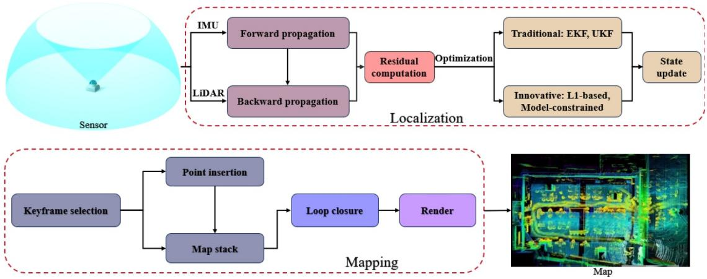

flowchart

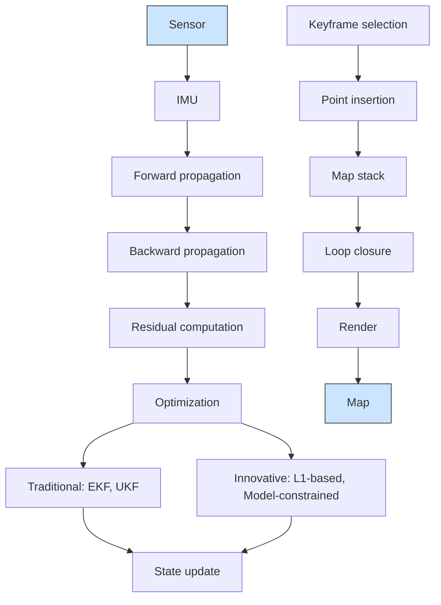

FIGURE 1 | Overall framework of SLAM: Localisation and mapping.

# 2.1.2 | Camera and IMU

The camera and IMU combination is a cost‐effective and adaptable hardware set in outdoor or complex environments. The camera extracts rich visual information from image features to create a detailed environmental map, whereas the IMU measures acceleration and angular velocity in real time, offering a short‐term compensation for the localisation drift of the

(a)   
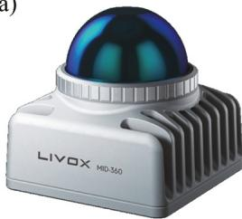

natural_image

Exterior view of a LIVOX Mid-350 sensor device (no signage or text beyond branding)

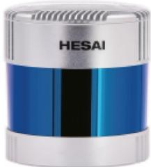

natural_image

HESAI brand light bulb with blue and silver casing (no visible text or symbols beyond branding)

（c）  
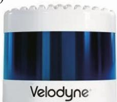

natural_image

Close-up of a blue and white product container labeled 'Velodyne' (no other text or symbols visible)

(d)   
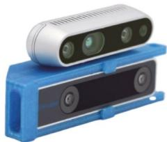

natural_image

3D rendered image of a blue mechanical device with a white sensor or camera module (no text or symbols visible)

（e)  
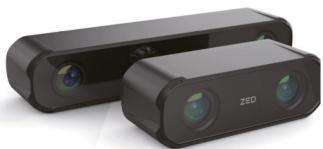

natural_image

Exterior view of two black ZEDD camera lenses (no text or symbols visible)

(f)   

FIGURE 2 | Different types of LiDAR. (a) DJI mid 360 [37], (b) Hesai 128 [38], (c) Velodyne 128 [39], (d) Intel RealSense D435 and T265 [40], (e) Zed‐X 03 [41], (f) Orbbec Femoto mega TOF [42].   
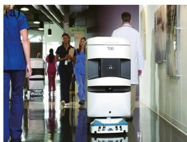

natural_image

Interior hallway scene with a white autonomous delivery robot and people observing (no visible text or symbols)

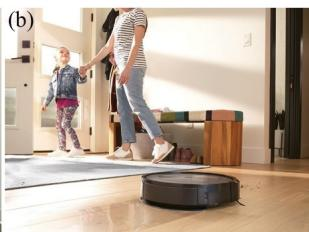

natural_image

Interior scene with two people walking on a robotic platform, one adult and one child in the background (no visible text or symbols)

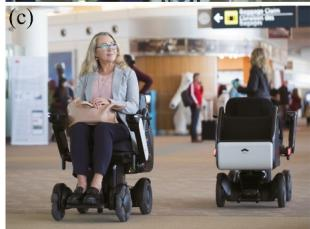

natural_image

Two women in electric mobility gear walking indoors, with people and signage in the background (no readable text on main subjects)

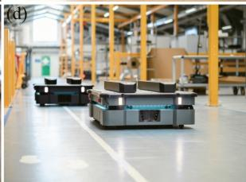

natural_image

Interior view of a modern automated factory floor with robotic machines and yellow safety railings (no visible text or symbols)

FIGURE 3 | 2D LiDAR and IMU applications. (a) TUG medical transport, (b) iRobot indoor cleaning, (c) WHILL smart wheelchair [46], (d) mobile industrial robots (MIR) warehouse transport [47].

camera during rapid motion. Together, the camera and IMU combination can provide reliable and stable performance in challenging conditions.

Common algorithms of a camera and an IMU [48] are VINS‐Mono and ORB‐SLAM. VINS‐Mono [49] is a visual‐inertial SLAM algorithm based on a monocular camera and IMU. The core principles are divided into three parts: visual‐inertial data fusion, sliding window optimisation [50] and loop closure. It fuses camera image features with IMU inertial data, performs nonlinear optimisation on recent frames in a sliding window and uses loop closure to reduce drift. It enables high‐precision pose estimation and trajectory optimisation for real‐time localisation. ORB‐SLAM is a feature‐based visual SLAM algorithm that includes three core principles: tracking, mapping and loop closure. The tracking part extracts ORB features from each image frame and uses feature matching to estimate camera pose. The mapping part converts feature points into 3D map points and optimises the map and pose through bundle adjustment (BA) for improved accuracy [51]. Loop closure detects revisited areas and applies pose graph optimisation to reduce accumulated drift and maintain map consistency. ORB‐SLAM achieves efficient real‐time pose estimation and 3D map generation that is suitable for various applications. The hardware set of camera and IMU can deal with the scenarios that require high‐precision positioning, real‐time response and environmental adaptability. For example, Tesla [52] and DJI's [53] autonomous systems use the fusion of camera and IMU data to achieve precise environmental perception and localisation under varying lighting conditions. And in the field of AR, Microsoft's HoloLens [54] and Apple's ARKit [55] apply the combination of camera and IMU and both employ this combination to provide highly realistic AR effects to users (see Figure 4).

# 2.1.3 | 3D LiDAR and IMU

The 3D LiDAR and IMU combination is a highly accurate and robust hardware setup, well‐suited for complex environments and applications requiring precise 3D spatial awareness. 3D LiDAR captures a detailed three‐dimensional point cloud by measuring the distance to surrounding objects, which enables high‐resolution mapping of the environment. The point cloud is complemented by the real‐time measurements of acceleration and angular velocity provided by IMU to compensate for shortterm pose variations and motion deviations.

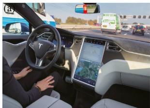

natural_image

Interior view of a modern electric vehicle with driver, dashboard, and highway (no visible text or symbols)

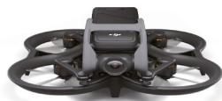

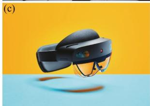

natural_image

Black and white photo of a smart glasses headset floating on a blue surface against a yellow background (no text or symbols visible)

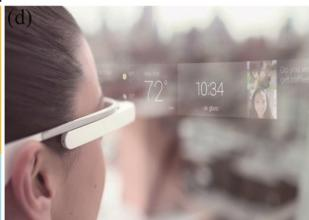

text_image

(d)
72
10:34
冰 glass

FIGURE 4 | Camera and IMU applications. (a) Tesla autonomous driving, (b) DJI autonomous flying, (c) HoloLens AR, (d) ARKit AR.

Common SLAM algorithms using a 3D LiDAR and IMU combnation [56] include LOAM and Fast‐LIO. LOAM is a SLAM algorithm specifically designed as a loosely coupled data fusion approach for 3D LiDAR and IMU to enhance accuracy and stability. Its core principles include feature extraction, scan matching and mapping. LOAM extracts geometric features from the 3D point cloud, such as edges and planar surfaces. By matching these features between constant frames, LOAM estimates motion and refines the map in real time. The frame‐by‐frame matching can provide high‐frequency pose updates and smooth trajectory estimation while reducing algorithmic complexity which enables the system to maintain high real‐time performance and localisation accuracy in dynamic or rapidly changing environments. Fast‐LIO is a SLAM algorithm that achieves high‐precision real‐time pose estimation through tightly coupled data fusion of 3D LiDAR and IMU measurements. Its core principles include tightly coupled sensor fusion and sliding window‐based optimisation. The IMU provides high‐frequency orientation data for rapid initialisation and prediction, whereas LiDAR point cloud feature extraction builds an environmental map to realise nonlinear optimisation and pose correction. By employing a sliding window optimisation strategy, Fast‐LIO can efficiently adjusts recent data, significantly reducing cumulative errors and drift. In practical applications, the combination of 3D LiDAR and IMU demonstrates strong environmental adaptability. Waymo [57], produced by Google, integrates 3D LiDAR and IMU in its autonomous vehicles to enable real‐time environmental sensing and precise localisation, ensuring safety on city streets and highways. Spot robot dog of Boston Dynamics [58] uses this set to navigate complex terrains and maintain balance, making it suitable for tasks such as building inspections, industrial checks and rescue missions. Husky unmanned ground vehicle (UGV) [59] benefits from this hardware set for accurate environmental mapping and localisation for construction sites and mining exploration. Handheld scanner of GoSLAM [60] employs the same combination to produce high‐precision 3D maps in tunnels and mines (see Figure 5).

Although the hardware set of 3D LiDAR and IMU provides high‐precision localisation and mapping capabilities, it also presents some limitations. Firstly, 3D LiDAR is expensive and consumes considerable power which will increase overall cost and energy requirements. Secondly, it is a burden for real‐time processing because the large volume of point cloud data generated by 3D LiDAR demands significant computational resources. Additionally, 3D LiDAR has reduced accuracy when measuring reflective or transparent surfaces, impacting the localisation accuracy. Therefore, in scenarios with budget or computational constraints, careful consideration is needed when deploying systems that rely on 3D LiDAR and IMU.

# 2.1.4 | 3D LiDAR, Camera and IMU

The combination of LiDAR, camera and IMU is a highly efficient and flexible hardware set capable of handling complex and dynamic environments. LiDAR provides high‐precision, dense point cloud data for generating detailed 3D maps of the surroundings. The camera captures rich visual information, enabling the extraction of texture and colour features to enhance scene understanding. And the IMU measures acceleration and angular velocity in real time, helping to reduce localisation drift during rapid motion and increase system stability. This combination allows LiDAR, camera and IMU to deliver reliable, accurate and stable performance to broaden the applications under challenging conditions.

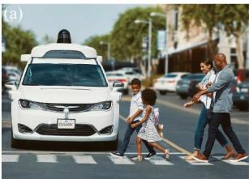

natural_image

Street scene with a white autonomous delivery vehicle and pedestrians crossing a pedestrian crossing (no visible text or symbols)

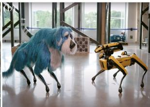

natural_image

Two small animal models: a blue-tinted dog and a yellow quadruped robot, standing indoors near windows (no text or symbols visible)

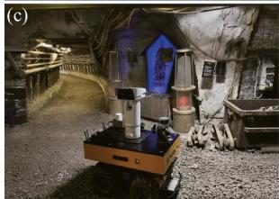

natural_image

Interior view of a dimly lit underground tunnel with a robotic arm and illuminated structure (no visible text or symbols)

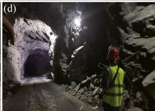

natural_image

Interior view of a dimly lit tunnel with a worker in safety gear observing from the entrance (no visible text or symbols)

FIGURE 5 | 3D LiDAR and IMU applications. (a) Waymo autonomous driving, (b) Spot robot dog, (c) Husky robot mine tunnel detection, (d) GoSLAM handheld detection device.

Common SLAM algorithms combines 3D LiDAR, camera and IMU [61] include the LIC‐FUSION [62], FAST‐LIVO [63], unscented Kalman filter (UKF‐SLAM) and particle filter (PF). LIC‐FUSION adopts a filter‐based approach to construct a model for multi‐sensor data joint processing. It deeply fuses and collaboratively optimises the environmental geometric structure information from the LiDAR, the texture features from the camera and the pose information from the IMU. By utilising filtering algorithms, it can effectively process the noise and uncertainties in the data, thereby generating a more accurate and detailed map. FAST‐LIVO utilises an efficient feature extraction and matching strategy to rapidly process the point cloud data from the LiDAR, the image information from the camera and the motion measurement values from the IMU. Through its parallel computing framework and filter‐based algorithms, FAST‐LIVO significantly improves the computing speed without sacrificing much accuracy. UKF‐SLAM employs the unscented Kalman filter to estimate the state of the fused data from 3D LiDAR, camera and IMU. It handles the nonlinear relationships in sensor data through the unscented transformation, effectively improving the estimation accuracy in complex nonlinear systems. The particle filter algorithm represents the probability distribution of the system state using a set of weighted particles. It updates the weights of the particles based on the measurement information from the LiDAR, camera and IMU and removes the particles with low weights while retaining and replicating the particles with high weights through the resampling process, gradually approaching the true state of the system. This method can flexibly handle nonlinear and non‐Gaussian problems in multi‐sensor data fusion even in complex dynamic environments and in the face of sudden changes in sensor data and noise interference. For example, Siemens [64] applies the combination of LiDAR, camera and IMU in smart building management and security monitoring to realise the real‐time 3D mapping and tracking within complex building interiors. In logistics and automated distribution, companies like Grey Orange [65] uses this hardware set to enhance navigation and sorting efficiency in warehouse environments. In detail, it uses LiDAR to generate environmental maps, cameras to identify barcodes on goods and IMUs to stabilise the robot's orientation during movement. In the medical field, the da Vinci [66] surgical system of Intuitive Surgical employs LiDAR to create 3D models of surgical areas, cameras to capture anatomical details and IMUs to maintain stability during procedures, significantly enhancing precision and safety in minimally invasive surgeries. In archaeology and cultural heritage preservation, Hexagon [67] scanning system uses LiDAR to capture 3D structures of heritage sites, cameras to record texture details and IMUs to provide stability on uneven terrain to provide high‐precision data for the digital preservation of historical artefacts (see Figure 6).

The combination of 3D LiDAR, camera and IMU in SLAM offers high‐precision localisation and mapping capabilities but also faces several limitations. Firstly, the high cost of 3D LiDAR significantly increases the overall system expense, limiting its adoption in consumer‐level and small‐to‐medium enterprise applications. The computational demand for multi‐sensor data fusion is substantial, heavily reliant on processor performance, which affects real‐time capabilities, particularly on embedded or mobile platforms. Furthermore, multi‐sensor data synchronisation requires precise calibration that adds the system design challenges. Additionally, the high power consumption of this combination restricts its suitability for applications with stringent battery life requirements. In summary, the high cost, computational resource requirements, environmental sensitivity, power consumption and synchronisation complexity limit the broader application of the hardware set.

# 2.1.5 | Comparison and Selection

In subsurface spaces, unstructured environments or extreme conditions, the performance of different sensor combinations in SLAM applications varies significantly. Selecting the appropriate sensor configuration based on specific application conditions is crucial. Here, we compare the common hardware sets from the perspectives of accuracy, environmental adaptability

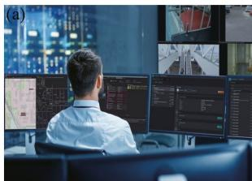

natural_image

Person monitoring multiple digital display screens in a control room (no visible text or symbols)

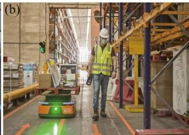

natural_image

Interior view of a warehouse with a worker in safety gear standing near an autonomous vehicle (no visible text or symbols)

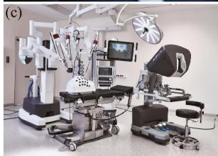

natural_image

Interior view of a modern surgical or operating room with multiple robotic arms and monitors (no visible text or symbols)

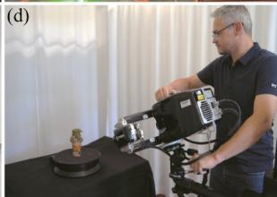

natural_image

Man operating a mechanical device on a black table, with a small object nearby (no visible text or symbols)

FIGURE 6 | 3D LiDAR, camera and IMU applications. (a) Siemens, (b) Grey Orange, (c) da Vinci, (d) Hexagon.

and system stability, providing insights into sensor selection for various challenging environments. Due to the overly limited application scenarios of the hardware set of 2D LiDAR and IMU, this section will not discuss it in detail and will only display it in the hardware set comparison Table 1.

The camera and IMU combination primarily relies on the camera to capture visual features of the environment, wereas the IMU provides short‐term motion compensation. However, this set encounters several limitations in subsurface, unstructured or extreme environments. Firstly, the camera is highly dependent on lighting conditions. In low‐light, no‐light or environments with significant lighting variations (such as mines, tunnels or forests), the camera struggles to capture stable features, which decreases positioning and mapping accuracy. Although the IMU can compensate for short‐term pose variations, its cumulative error increases over time. In GPS‐denied conditions, these errors cannot be effectively corrected, leading to significant drift in pose estimation. Additionally, standard cameras cannot directly obtain depth information, and it is a challenge to achieve consistent 3D environmental modelling in feature‐sparse or repetitive‐pattern environments (e.g., smooth walls or spaces with limited geometric features). In a word, the camera and IMU combination performs well especially in well‐lit and relatively simple terrains.

In contrast, the 3D LiDAR and IMU combination has significant advantages in complex and extreme environments. 3D LiDAR generates high‐resolution point cloud data that provides detailed 3D environmental information and operates independently of lighting conditions, allowing it to operate reliably in low‐light or completely dark environments. The IMU provides high‐frequency pose updates to estimate motion between LiDAR scans and reducing data inaccuracies due to motion. This hardware set of 3D LiDAR and IMU not only minimises pose drift errors effectively but also maintains high localisation accuracy and stability in GPS‐denied conditions. As a result, it is highly suited to precise 3D mapping tasks in tunnels, mines, forests and other complex environments. Additionally, 3D Li-DAR's high‐precision data remain robust in geometrically complex or obstacle‐dense scenarios, making it a reliable choice for extreme conditions.

The 3D LiDAR, IMU and camera combination further enhances environmental adaptability and mapping accuracy. 3D LiDAR provides precise 3D structural data, the IMU handles short‐term motion compensation and the camera captures texture and colour information that adds rich detail to the mapping process. In illuminated environments, the camera can also support pose correction through visual loop closure to reduce accumulated drift. This multi‐sensor fusion is particularly advantageous in GPS‐limited environments, enabling the system to maintain minimal cumulative errors over extended operation and ensuring global map consistency. This setup is ideal for complex, dynamically changing environments and is especially well‐suited for high‐precision tasks such as subsurface facility maintenance, tunnel surveying and mine navigation, where stable localisation and comprehensive map construction are required.

In most cases, the LiDAR‐based SLAM has greater reliability and accuracy compared to visual‐based SLAM, which is suitable for more application scenarios. The camera and IMU hardware set has serious requirements for lighting and environmental features, resulting in poor 3D mapping performance in low‐light and complex structured environments. In contrast, the 3D LiDAR and IMU combination demonstrates excellent accuracy and robustness in low‐light or no‐light conditions. And the 3D LiDAR, camera and IMU hardware set can even combine the advantages of all multiple sensors to achieve the optimal environmental adaptability, localisation accuracy and system robustness. This combination is particularly suitable for high‐precision localisation and mapping in complex scenarios such as subsurface exploration, tunnel maintenance and mining surveys. Therefore, this paper focuses on the LiDAR‐based SLAM systems that can realise the precise localisation and mapping requirements in GPS‐denied environments, especially in underground and tunnel settings.

TABLE 1 | The comparsion of different hardware sets. 

<table><tr><td>Sensor combination</td><td>Advantage</td><td>Disadvantage</td><td>Common algorithm</td></tr><tr><td>2D LiDAR + IMU</td><td>Simple structure, low cost, suitable for flat environments, low computation requirements</td><td>Unable to obtain 3D information, limited to 2D planes, weak adaptability to environmental changes</td><td>Hector SLAM, GMapping</td></tr><tr><td>Camera + IMU</td><td>Low cost, rich data, effective in texture-rich environments</td><td>Highly dependent on lighting and texture, performs poorly in low-light or texture-lacking environments</td><td>ORB-SLAM, VINS-mono</td></tr><tr><td>3D LiDAR + IMU</td><td>Capable of generating high-precision 3D point clouds, suitable for complex environments</td><td>High cost, intensive computation for point cloud processing, high storage requirements</td><td>LOAM, FAST-LIO</td></tr><tr><td>3D LiDAR + Camera + IMU</td><td>Provides colour point clouds and high-precision 3D information, adaptable to various complex environments</td><td>Complex system integration, high cost, high power consumption</td><td>V-LOAM [68], LVI-SAM [69], FAST-LIVO</td></tr></table>

# 2.2 | Update Scheme Categories

In the evolution of SLAM technology, different update scheme categories play an important role. Optimisation‐based methods achieve high‐precision positioning and map construction by accurately solving system state variables. On the other hand, filterbased methods, relying on probability filtering theory, recursively estimate the system state in complex and changeable environments, demonstrating excellent adaptability and real‐time performance. With their unique principles and mechanisms, the different kinds of update methods spread SLAM systems with distinct performance characteristics and application scenarios.

# 2.2.1 | Optimisation‐Based Method

The core of optimisation‐based methods is to transform the SLAM problem into an optimisation problem, construct an objective function and use optimisation algorithms to solve for system state variables.

In visual SLAM algorithms, for example, ORB‐SLAM2 takes the reprojection error as a key part of the objective function. This error measures the difference between the position of a map point projected onto the image plane through the current camera pose and map point position and the position of the actually observed image feature point. ORB‐SLAM2 uses nonlinear optimisation algorithms to continuously update the camera pose and map point coordinates to minimise the reprojection error, achieving accurate positioning and map construction. For LiDAR‐based SLAM algorithms like Cartographer, its objective function comprehensively considers the matching error of LiDAR scan data and the consistency of the map. Cartographer uses the branch‐and‐bound search to efficiently search the pose space and determine the optimal robot pose. When constructing the map, it aligns and fuses LiDAR scan data at different times and optimises the objective function to ensure the accuracy and coherence of the map. With the development of deep learning, some optimisationbased SLAM algorithms introduce neural networks to assist in optimisation. For instance, neural networks are used to predict environmental features and integrate them into the objective function to improve the performance and robustness of the SLAM system in complex environments.

Optimisation‐based SLAM excels at integrating diverse constraints, handling nonlinearities, constructing accurate maps using global information, reducing errors and flexibly fusing data, adapting to dynamics and leveraging priors for precise estimation. However, this kind of methods often demands substantial computational resources, is sensitive to initial parameter settings and may struggle with real‐time performance in highly dynamic or large‐scale scenarios due to the complexity of iterative optimisation processes.

# 2.2.2 | Filter‐Based Method

Filter‐based methods are widely applied in the SLAM field and attract significant attention from both the industrial and academic communities. The core principle is based on probability filtering theory to estimate the system state according to the observation data and state transition model.

Extended Kalman filter (EKF) is commonly used in the SLAM system with the VIO unit. For example, VINS‐Mono algorithm fuses the camera visual measurement information and the measurement information from the IMU. It predicts the system state transition relying on the IMU measurement values and simultaneously corrects the prediction results using the information of the feature points observed by the camera. In practical applications, the camera and the IMU work in collaboration. The IMU provides high‐frequency pose change information, whereas the camera provides accurate absolute position information. The EKF combines these two types of information, taking into account both real‐time performance and the accuracy of pose estimation. In recent years, to improve the performance of filter‐based methods, improved algorithms have emerged continuously. UKF adopts a deterministic sampling strategy and can approximate the nonlinear characteristics of the system more accurately than the EKF, showing better performance in strong nonlinear problems. PF is another common method and has obvious advantages in SLAM applications in complex environments. Different from the EKF, the PF represents the probability distribution of the system state through a large number of particles. Each particle has a weight that reflects the degree of matching between the state it represents and the observation data. In a LiDAR‐based SLAM system, the PF updates the particle weights according to the LiDAR scan data and adjusts the particle distribution through operations such as resampling to accurately estimate the robot pose. For example, in outdoor environments with complex terrains and interferences, the PF can better cope with environmental uncertainties and achieve reliable SLAM due to the diversity of particles.

At the same time, multi‐model filtering algorithms can adaptively select appropriate filtering models according to environmental conditions and system states, enhancing the robustness and adaptability of the SLAM system.

Filter‐based methods are widely used in both industrial and academic scenarios. The popularity stems from adaptability in handling complex SLAM problems. In industry, they are crucial for real‐time state estimation in robot and unmanned vehicle navigation. In academia, they are fundamental for exploring new SLAM algorithms. As this is more widely used in both industry and academy, we choose to structure the details of the method and recent development starting from the next chapter.

# 2.3 | Datasets

Evaluating the performance of SLAM algorithms is often inseparable from the help of open‐source datasets. For different sensor combinations, various datasets cover scenarios ranging from simple indoor environments to complex underground, unstructured and dynamic scenes, and the dataset summary is shown in Table 2.

The 2D LiDAR and IMU combination is mainly used for planar navigation and simple environments in SLAM research, such as warehouses or automated guided vehicles (AGVs). For example, the MIT Stata Centre dataset captures data in complex indoor environments, such as long corridors, open spaces and office areas to evaluate the performance of 2D LiDAR and IMU SLAM algorithms. Another commonly used dataset, the ROS TurtleBot dataset, primarily collected in household environments, includes the robot's trajectory in rooms, making it suitable for SLAM evaluation in domestic or small AGV scenarios. The camera and IMU combination is designed for well‐lit, feature‐rich environments and is sensitive to low‐light or no‐light conditions. The EuRoC MAV dataset is a well‐known example, providing monocular and stereo camera data along with IMU data to realise the localisation and mapping in industrial environments, laboratories and indoor areas. And the KITTI Vision Benchmark Suite offers camera images, GPS/IMU data and LiDAR point cloud, which is primarily used for autonomous driving in open environments. Additionally, the TUM VI dataset, provided by the Technical University of Munich, includes camera and IMU data across diverse indoor and outdoor lighting conditions, suitable for the dynamically changing lighting conditions.

The combination of 3D LiDAR and IMU performs especially well in low‐light or no‐light environments to realise reliable localisation and mapping capabilities even in complex and challenging settings. This type of dataset provides valuable 3D structural data and pose information to ideal underground or intricate environments. For instance, the Newer College Dataset, which covers a wide range of terrains and obstacles, is specifically designed to test SLAM algorithms in complex outdoor environments. Similarly, the NCLT dataset, provided by the University of Michigan, features 3D LiDAR, IMU and GPS data collected over extended periods on a campus, making it well‐suited for testing SLAM algorithms over long duration. The MulRan dataset, offered by KAIST, also collects 3D LiDAR, IMU and GPS data in challenging urban and tunnel environments to test the robustness and accuracy of SLAM algorithms in real‐world urban settings.

The 3D LiDAR, camera and IMU datasets integrate rich multisensor information and are ideal for high‐precision SLAM research in complex environments. These datasets provide a rich variety of data streams that support the creation of accurate 3D maps. For example, the complex urban dataset, provided by the Hong Kong University of Science and Technology, covers various lighting and weather conditions to evaluate multi‐sensor SLAM robustness in extreme conditions. The KITTI odometry and tracking dataset, widely used in autonomous driving research, includes camera images, 3D LiDAR, IMU and GPS data, enabling effective evaluation of multi‐sensor SLAM performance in urban environments. Similarly, the Apollo‐SouthBay dataset provided by Baidu also contains 3D LiDAR, camera, IMU and GPS data, making it suitable for multi‐sensor SLAM algorithms in autonomous driving applications. The NTU‐VIRAL dataset, provided by NTU Singapore, is designed specifically for UAVs. Its highfrequency data from multiple sensors and the collection of data across diverse flight scenarios offer comprehensive data support for evaluating the performance and reliability of SLAM algorithms in complex environments. And for the R3LIVE dataset, often used in the evaluation of the R3LIVE multi‐sensor fusion SLAM system. It contains diverse environmental scenarios from indoor spaces with intricate structures to outdoor terrains which allows researchers to test the adaptability of multi‐sensor SLAM algorithms across a wide range of environments, and the synchronised data streams from different sensors facilitate the development and validation of precise sensor fusion techniques.

The datasets described above cover a range of needs, from planar navigation to 3D environmental mapping, supporting SLAM research with different sensor configurations. The 2D LiDAR and IMU datasets are suitable for simple planar navigation environments, the camera and IMU datasets are ideal for visualinertial SLAM in well‐lit conditions and the 3D LiDAR and IMU datasets focus on 3D mapping in low‐light or no‐light environments, whereas the 3D LiDAR, camera and IMU datasets provide comprehensive multi‐sensor information for high‐precision SLAM in complex, dynamic environments. All datasets mentioned above are beneficial for developing the adaptability, accuracy and robustness of different sensor configurations in SLAM that provide reliable data support for the research and development in SLAM.

TABLE 2 | The datasets for different hardware configurations. 

<table><tr><td>Dataset name</td><td>Sensor combination</td><td>Environment type</td><td>Characteristic</td></tr><tr><td>MIT stata centre dataset [70]</td><td>2D LiDAR + IMU</td><td>Indoor</td><td>Complex indoor with corridors, open areas, offices</td></tr><tr><td>ROS TurtleBot dataset [71]</td><td>2D LiDAR + IMU</td><td>Indoor</td><td>Collected in home settings for basic navigation</td></tr><tr><td>EuRoC MAV dataset [72]</td><td>Monocular/Stereo Camera + IMU</td><td>Industrial/lab indoor</td><td>Lighting variations, suitable for visual-inertial SLAM</td></tr><tr><td>TUM VI dataset [73]</td><td>Camera + IMU</td><td>Indoor/outdoor</td><td>Dynamic lighting conditions for visual-inertial SLAM testing</td></tr><tr><td>KITTI vision benchmark suite [74]</td><td>Camera + IMU + GPS</td><td>Urban outdoor</td><td>Includes images, GPS/IMU and LiDAR for autonomous driving</td></tr><tr><td>Newer college dataset [75]</td><td>3D LiDAR + IMU</td><td>Outdoor complex</td><td>Varied terrain and obstacles for robust 3D LiDAR testing</td></tr><tr><td>NCLT dataset [76]</td><td>3D LiDAR + IMU + GPS</td><td>Campus</td><td>Long-term seasonal/weather variations</td></tr><tr><td>MulRan dataset [77]</td><td>3D LiDAR + IMU + GPS</td><td>Urban/tunnel</td><td>Dynamic urban and tunnel environments for robustness testing</td></tr><tr><td>Complex urban dataset [78]</td><td>3D LiDAR + IMU + Camera</td><td>Urban complex</td><td>Extreme lighting and weather conditions for robustness</td></tr><tr><td>Apollo-SouthBay dataset [79]</td><td>3D LiDAR + IMU + Camera + GPS</td><td>Urban roads</td><td>Multi-sensor data for complex urban navigation tasks</td></tr><tr><td>KITTI odometry and tracking dataset [80]</td><td>3D LiDAR + IMU + Camera + GPS</td><td>Urban</td><td>Multi-sensor dataset for autonomous driving in urban settings</td></tr><tr><td>NTU-VIRAL dataset [81]</td><td>Monocular Camera + IMU</td><td>Indoor</td><td>Captured different textures and structures in indoor environments</td></tr><tr><td>R3LIVE dataset [82]</td><td>Monocular/Stereo Camera + IMU</td><td>Indoor/outdoor</td><td>Designed for challenging scenarios such as fast motion, low light and large scale environments</td></tr></table>

# 3 | Localisation

Localisation is one of the core tasks in SLAM systems, aiming to accurately estimate a robot's position and orientation within an environment in real time by integrating multi‐sensor data. An efficient localisation module is not only crucial for ensuring the robustness, real‐time performance and high precision of the SLAM system but also provides reliable state information to support higher‐level tasks such as path planning.

In general, optimisation‐based SLAM methods can significantly benefit from global position feedback. For example, integrating GPS data into the optimisation framework can notably enhance the loop‐closure detection rate [83]. This augmentation helps mitigate cumulative errors over time, guiding the optimisation process towards more globally consistent solutions. However, in environments such as mine tunnels, indoor and GPS‐denied space, those global location sensors are not available. Additionally, these extreme environments always have variable lighting, vibrations and shadows to degrade camera‐captured data. Therefore, based on the above multi‐faceted considerations, our article focuses more on LiDAR‐based and filterbased SLAM, which have higher industrial application values and are applicable to a wider range of environments.

In SLAM systems, localisation is typically divided into two core steps: forward propagation and back propagation. This section will give a precise explanation of the localisation process mainly focused on the LiDAR‐based SLAM and all the data are transformed into the global frame. The localisation framework is shown in Figure 1.

# 3.1 | Forward Propagation

In GPS‐denied environment, it is typical to use IMU as a reliable sensor for basic state estimation, which would be used for the following reference position in backward propagation. Between frames of visual inputs (LiDAR/camera), IMU inputs would consistently (but also discretely) estimate the position change. Most methods in forward propagation are very similar, and the details vary from the estimation in bias and white noise, which leads into a stochastic random walk process. We adopt the model being introduced in FAST‐LIO [84] as the most typical example to introduce this part.

The core of forward propagation lies in utilising kinematic models and sensor data to perform real‐time estimation of a robot's state, such as position, orientation and velocity. A common implementation involves predicting the system's state using IMU data and then correcting it using additional sensor data, such as LiDAR or visual observations.

# 3.1.1 | IMU Model

The IMU model describes the relationship between the accelerations and angular velocities measured by the IMU sensors and their true values, primarily accounting for the effects of biases and noise.

$$
\boldsymbol {a} _ {\mathrm{m}} = \boldsymbol {a} _ {\mathrm{t}} + \boldsymbol {b} _ {\mathrm{a}} + \boldsymbol {n} _ {\mathrm{a}}, \tag {1}
$$

$$
\boldsymbol {\omega} _ {\mathrm{m}} = \boldsymbol {\omega} _ {\mathrm{t}} + \boldsymbol {b} _ {\omega} + \boldsymbol {n} _ {\omega}, \tag {2}
$$

where $\mathbf { a } _ { \mathrm { m } }$ and $\omega _ { \mathrm { m } }$ are the measured acceleration and angular velocity and $\pmb { a } _ { \mathrm { t } }$ and $\omega _ { \mathrm { t } }$ are the true acceleration and angular velocity. And $\pmb { n } _ { \mathrm { a } }$ and $\pmb { n } _ { \omega }$ are the noise of IMU measurements, $\pmb { b } _ { \mathrm { a } }$ and $\pmb { b } _ { \omega }$ are the IMU bias, for the subscripts a and ω are stands for the acceleration and angular velocity, respectively.

# 3.1.2 | State Propagation

3.1.2.1 | Continuous Model. The continuous model establishes the relationship between the IMU's acceleration and angular velocity data and the actual state variables, which primarily include the evolution of position, velocity and orientation, as well as the dynamic changes in IMU biases. First, we usually assume the IMU is rigidly attached to the body of the autonomous robot with a known extrinsic. Taking the IMU frame as the body frame of reference, we can get the kinematic model:

$$
\dot {\boldsymbol {p}} = \boldsymbol {v}, \tag {3}
$$

$$
\dot {\boldsymbol {v}} = \boldsymbol {R} \cdot (\boldsymbol {a} _ {\mathrm{m}} - \boldsymbol {b} _ {\mathrm{a}} - \boldsymbol {n} _ {\mathrm{a}}) + \boldsymbol {g}, \tag {4}
$$

$$
\dot {\boldsymbol {R}} = \boldsymbol {R} \cdot \left\lfloor \omega_ {\mathrm{m}} - \boldsymbol {b} _ {\omega} - \boldsymbol {n} _ {\omega} \right\rfloor^ {\wedge}, \tag {5}
$$

$$
\dot {\boldsymbol {b}} _ {\omega} = 0, \tag {6}
$$

$$
\dot {\boldsymbol {b}} _ {\mathrm{a}} = 0, \tag {7}
$$

where p, v and R are the position, velocity and attitude of the IMU, g is the gravity vector and the notation $| { \pmb x } | ^ { \wedge }$ denotes the skew‐symmetric matrix of vector $\pmb { S } \in \mathbb { R } ^ { 3 }$ that maps the crossproduct operation.

3.1.2.2 | Discrete Model. Actually, the motion data provided by the IMU is inherently continuous over time. To align with the discretely sampled data from other sensors, it is necessary to derive the state update equations in discrete time. Finally, the state propagation in the discrete model can be categorised into position update, velocity update, orientation update and bias update.

$$
\boldsymbol {p} _ {k} = \boldsymbol {p} _ {k - 1} + \Delta t \cdot \boldsymbol {v} _ {k - 1} + \frac {1}{2} \boldsymbol {R} _ {k - 1} (\boldsymbol {a} _ {\mathrm{m}} - \boldsymbol {b} _ {\mathrm{a}}) \Delta t ^ {2}, \tag {8}
$$

$$
\boldsymbol {v} _ {k} = \boldsymbol {v} _ {k - 1} + \boldsymbol {R} _ {k - 1} (\boldsymbol {a} _ {\mathrm{m}} - \boldsymbol {b} _ {\mathrm{a}}) \Delta t + \mathbf {g} \Delta t, \tag {9}
$$

$$
\boldsymbol {R} _ {k} = \boldsymbol {R} _ {k - 1} \cdot \exp ((\boldsymbol {\omega} _ {\mathrm{m}} - \boldsymbol {b} _ {\omega}) \Delta t), \tag {10}
$$

$$
\boldsymbol {b} _ {\mathrm{a}, k} = \boldsymbol {b} _ {\mathrm{a}, k - 1}, \tag {11}
$$

$$
\boldsymbol {b} _ {\omega , k} = \boldsymbol {b} _ {\omega , k - 1}, \tag {12}
$$

where $\Delta t$ is the time interval between consecutive IMU data samples and exp $( ( \omega _ { \mathrm { m } } \ : - \ : b _ { \omega } ) \Delta t )$ represents the exponential map on the Lie group, which converts the angular velocity vector into the rotation matrix increment.

With the integration of multiple sensors, the state propagation process has been correspondingly improved. For example, the VINS‐Mono integrates IMU data between two frames of the low‐frequency sensor to generate simplified motion increments, which is called pre‐integration in forward propagation [85].

# 3.1.3 | Covariance Propagation

Covariance propagation is an essential component of state estimation in SLAM systems. It is used to update the uncertainty of the system's state as it evolves over time. The primary objective is to quantify the growth of state estimation uncertainty caused by process noise, such as IMU biases and measurement errors.

$$
\boldsymbol {P} _ {k} = \boldsymbol {F} _ {k - 1} \boldsymbol {P} _ {k - 1} \boldsymbol {F} _ {k - 1} ^ {\mathrm{T}} + \boldsymbol {G} _ {k - 1} \boldsymbol {Q} _ {k - 1} \boldsymbol {G} _ {k - 1} ^ {\mathrm{T}} \tag {13}
$$

where $\pmb { F } _ { k - 1 }$ is the state transition matrix, $\mathbf { Q } _ { k - 1 }$ is the process noise covariance matrix, $\pmb { P } _ { k - 1 }$ is the covariance matrix at the current time step and $\mathbf { G } _ { k - 1 }$ is the influence of noise on the system. The propagation continues until reaching the end time of a new scan.

However, the covariance propagation assumes that the system's uncertainty follows a Gaussian distribution and applies linear approximations to the system model. It may have limitations in highly nonlinear or multimodal distribution scenarios. To address these challenges, several alternative or complementary methods have been proposed which are dependent on the optimisation process in backward propagation.

# 3.2 | Backward Propagation

Especially, in the GPS‐denied conditions the forward propagation has certain limitations, such as the accumulation of IMU data errors and the influence of environmental noise, which leads to a gradual decrease in the accuracy of state estimation over time. To overcome the problem of accumulated errors in forward propagation, SLAM systems typically combine backward propagation. The core idea is to compute the residual between the sensor observations and the system predictions.

Finally, it uses optimisation methods to feed the error back into the system for adjusting the state estimate. Figure 7 gives the actual results for better understanding of the backward propagation.

# 3.2.1 | Residual Computation

Since the point cloud data provided by sensors (e.g., LiDAR) represents actual observations of the environment while the point cloud predicted by forward propagation contains accumulated errors due to the kinematic model, the SLAM system identifies correspondences between the observed and predicted point clouds through point cloud matching.

First, we need to process the actual point cloud data measured by the LiDAR. In the forward propagation, the predicted state of the system at time k can be obtained:

$$
\boldsymbol {T} _ {k} = \left[ \begin{array}{c c} \boldsymbol {R} _ {k} & \boldsymbol {p} _ {k} \\ \mathbf {0} ^ {\mathrm{T}} & 1 \end{array} \right], \tag {14}
$$

where $\pmb { T } _ { k } \in \mathrm { S E } ( 3 )$ is the predicted pose matrix that includes the rotation matrix $\pmb { R } _ { k }$ and translation vector $\pmb { p } _ { k }$ . And the sensor observation data at time step k is provided by the LiDAR in the form of a point cloud:

$$
\boldsymbol {C} _ {k} ^ {\mathrm{o}} = \left\{\boldsymbol {p} _ {i} ^ {\mathrm{o}} \mid i = 1, 2, \dots , N \right\}, \tag {15}
$$

where ${ \pmb p } _ { i } ^ { 0 } \in { \pmb R } ^ { 3 }$ represents the i‐th observed point in N points at time step k.

Later, we can transform the point cloud from the previous frame at time step k − 1 into the current frame at time step k:

$$
\boldsymbol {C} _ {k} ^ {\mathrm{p}} = \boldsymbol {T} _ {k} \cdot \boldsymbol {C} _ {k - 1} = \left\{\boldsymbol {p} _ {i} ^ {\mathrm{p}} | i = 1, 2,..., M \right\}, \tag {16}
$$

where $\pmb { T } _ { k }$ is the predicted pose matrix of the current frame and $\pmb { C } _ { k - 1 }$ is the point cloud of the previous frame consisting of M points ${ \pmb p } _ { i } ^ { \mathrm r }$ . After transforming the point cloud using the predicted pose $\mathbf { \nabla } T _ { k } ,$ , the predicted coordinate of each reference point ${ \pmb p } _ { i } ^ { \mathrm r }$ in the current frame is given by

$$
\boldsymbol {p} _ {i} ^ {\mathrm{p}} = \boldsymbol {R} _ {k} \boldsymbol {p} _ {i} ^ {\mathrm{r}} + \boldsymbol {p} _ {k}, \tag {17}
$$

Then, the system will calculate the spatial residual between the two point clouds, which serves as the foundation for subsequent optimisation and state updates. Here, we take the commonly used ICP algorithm as an example. An efficient nearest neighbour search algorithm KD‐tree is employed to find the closest point $\pmb { p } _ { i } ^ { \mathrm { o } }$ in the observed point cloud $c _ { k } ^ { \mathrm { { o } } }$ for each predicted point $\pmb { p } _ { i } ^ { \mathrm { p } }$ . This matching is achieved by minimising the Euclidean distance:

$$
\boldsymbol {p} _ {i} ^ {\mathrm{o}} = \arg \min _ {\boldsymbol {p} \in \boldsymbol {P C} _ {k} ^ {\mathrm{o}}} \left\| \boldsymbol {p} _ {i} ^ {\mathrm{p}} - \boldsymbol {p} \right\| _ {2}, \tag {18}
$$

The set of point pairs is constructed through the above matching process:

$$
\boldsymbol {D} _ {k} = \left\{\left(\boldsymbol {p} _ {i} ^ {\mathrm{p}}, \boldsymbol {p} _ {i} ^ {\mathrm{o}}\right) | i = 1, 2,..., K \right\}, \tag {19}
$$

where $\pmb { D } _ { k }$ represents the set of all valid correspondences between the $K _ { \mathrm { t h } }$ predicted and observed points. Finally, the residual $r _ { i }$ of each point pair is computed as follows:

$$
\boldsymbol {r} _ {i} = \boldsymbol {p} _ {i} ^ {\mathrm{o}} - \boldsymbol {p} _ {i} ^ {\mathrm{p}}. \tag {20}
$$

In contrast, the scan to model matching, differs from the traditional ICP algorithm as it aligns the current scan with a pre‐built map instead of just matching consecutive scans. First, the current scan data undergoes preprocessing, such as noise removal and filtering. Then, an initial rough transformation is applied to align the current scan with the pre‐existing map. During the matching process, each point in the current scan is paired with the closest point in the pre‐built map by performing a nearest‐neighbour search. Efficient algorithms like KD‐tree are typically used to speed up this search. The different nearest neighbour search algorithm besides KD‐tree is shown in Table 3.

The system then constructs a set of matched point pairs, linking each scan point to its corresponding point in the map. By calculating the residuals between these point pairs, the system can iteratively optimise the pose of the current scan to achieve better alignment with the map. Compared to traditional ICP, scan to model matching benefits from the known map information, improving the alignment accuracy and reducing the errors caused by sensor noise, especially in GPS‐denied or dynamic environments. This enhances the robustness and precision of the SLAM system.

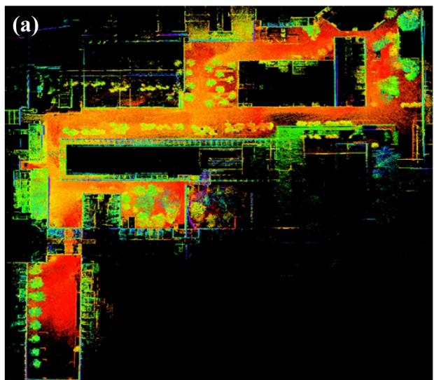

natural_image

Thermal or heat map image showing spatial distribution of a property or structure with color intensity from red to green (no text or symbols)

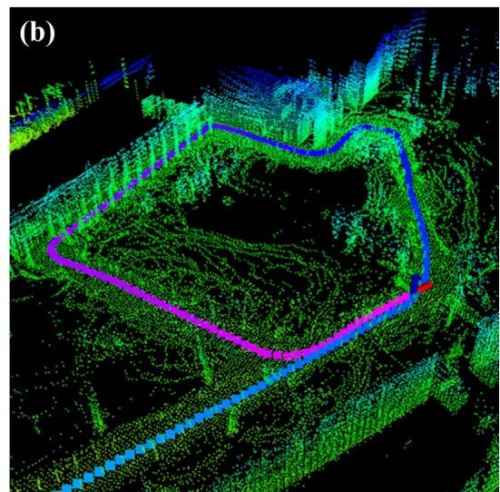

natural_image

3D terrain visualization with green and blue color-coded overlays, showing a highlighted rectangular region (no text or symbols)

FIGURE 7 | Comparison of two residual computations. (a) LIO‐SAM [86] using NDT. (b) LEGO‐LOAM [29] using ICP and ground optimisation.

In practical applications, in order to cater to different scenarios and hardware sets, methods other than ICP have been proposed, as shown in Table 4.

TABLE 3 | Comparison of nearest neighbour search algorithms. 

<table><tr><td>Algorithm</td><td>Advantages</td><td>Disadvantages</td><td>Suitable scenarios</td></tr><tr><td>KD-tree [87]</td><td>Fast for low-dimensional, evenly distributed data</td><td>Poor performance with high-dimensional data</td><td>3D point cloud registration, SLAM, LiDAR</td></tr><tr><td>Octree [88]</td><td>Efficient for large-scale, sparse point clouds</td><td>High construction cost, not for dynamic data</td><td>Urban modelling, large-scale 3D reconstruction</td></tr><tr><td>Brute force [89]</td><td>Simple, no overhead</td><td>Slow with large datasets</td><td>Small datasets, debugging, low precision needs</td></tr><tr><td>Local sensitive hashing (LSH) [90]</td><td>Fast for high-dimensional data</td><td>Approximate results, false matches.</td><td>Image retrieval, big data search, real time</td></tr><tr><td>Graph search [91]</td><td>Captures complex spatial relationships</td><td>High cost in construction and queries</td><td>Complex point cloud matching, urban modelling</td></tr><tr><td>Artificial neural network (ANN) [92]</td><td>Speeds up queries for large datasets</td><td>Approximate, requires tuning</td><td>Real-time SLAM, large-scale point cloud registration</td></tr></table>

TABLE 4 | Comparison of point cloud and feature matching methods with SLAM algorithms. 

<table><tr><td>Method</td><td>Advantage</td><td>Disadvantage</td><td>Applicable scenario</td><td>Algorithm</td><td>Cost</td></tr><tr><td colspan="6">Point cloud matching methods</td></tr><tr><td>ICP [93]</td><td>Simple, widely used</td><td>Sensitive to initial guess, poor in noisy environments</td><td>Indoor SLAM, static environments</td><td>GMapping, Hector SLAM</td><td> $O(N^2)$ </td></tr><tr><td>NDT [94]</td><td>Robust to noise and complex geometries</td><td>Computationally expensive</td><td>High-precision LiDAR SLAM, large-scale mapping</td><td>Cartographer, LIO-SAM</td><td> $O(N^3)$ </td></tr><tr><td>3D-ICP [95]</td><td>Robust to geometric deformations</td><td>Requires good initial alignment, slow for large datasets</td><td>LiDAR-based 3D mapping, large-scale environments</td><td>LIO-SAM, Cartographer</td><td> $O(N^2)$ </td></tr><tr><td colspan="6">Feature matching methods</td></tr><tr><td>Feature-based matching [96]</td><td>Robust to transformations and dynamic changes</td><td>Poor in low-texture or repetitive-texture areas</td><td>Camera-based SLAM, feature-rich environments</td><td>ORB-SLAM, LSD-SLAM</td><td> $O(N^2)$ </td></tr><tr><td>Bag of words (BoW) [97]</td><td>High robustness in feature matching, good for large-scale environments</td><td>Sensitive to initial keyframe selection and vocabulary size</td><td>Visual SLAM, static environments with rich visual features</td><td>ORB-SLAM2, SVO, LSD-SLAM, Amos-SLAM</td><td> $O(N^2)$ </td></tr><tr><td>ElasticFusion [98]</td><td>Combines depth and colour for 3D reconstruction</td><td>High computational cost, sensitive to motion</td><td>Real-time 3D reconstruction, indoor SLAM</td><td>ElasticFusion, RTAB-map</td><td> $O(N^3)$ </td></tr><tr><td>Direct methods [99]</td><td>No need for feature extraction, works in low-texture environments</td><td>Computationally expensive, sensitive to image quality</td><td>Monocular/stereo camera SLAM, dynamic environments</td><td>LSD-SLAM, DSO, VINS-mono</td><td> $O(N^2)$ </td></tr><tr><td>Deep learning [100]</td><td>Robust in dynamic environments, learns from data</td><td>Requires large datasets, computationally intensive</td><td>Dynamic environments, autonomous driving</td><td>DeepVO, DeepLIO</td><td> $O(N^3)$ </td></tr><tr><td>Multi-sensor fusion [101]</td><td>Combines strengths of both sensors for better precision</td><td>Requires accurate synchronisation and calibration</td><td>Multi-sensor SLAM, autonomous driving, GPS-denied</td><td>VINS-mono, LIO-LOAM, SGS-SLAM</td><td> $O(N^2)$ </td></tr></table>

# 3.2.2 | Optimisation

In recent years, there has been a growing focus on LiDARinertial fusion algorithms since IMU measures instant motion at a high frequency, which can be utilised to recover point clouds from highly dynamic motion distortion and predict the relative pose between two LiDAR frames. According to sensor fusion type, LiDAR‐inertial fusion algorithms can be categorised into either loosely coupled methods or tightly coupled methods. In loosely coupled SLAM, IMU and LiDAR data are processed independently. The IMU is used to estimate motion and update the position, whereas the LiDAR independently constructs the environmental map. The two sensors are only fused during the optimisation phase, resulting in lower computational cost, making it suitable for resource‐constrained scenarios. However, this approach may suffer from accuracy issues due to information loss during integration, especially in environments with high sensor noise. In contrast, tightly coupled SLAM deeply integrates IMU and LiDAR data, with the IMU data directly influencing both map construction and state estimation in real time. Although the computational complexity is higher, this method provides greater precision and robustness, particularly in dynamic, complex environments and GPS‐denied conditions.

In applications, loosely coupled methods [102], appealing for runtime, consider the estimation of the LiDAR and the estimation of the IMU separately, resulting in information loss and inaccurate estimates, whereas tightly‐coupled methods [103], aiming at accurate estimates, fuse point clouds and IMU measurements in an optimisation‐based or filtering‐based framework with higher computational costs. The results of the two fusion types are shown in Figure 8.

The current state‐of‐the‐art approaches to the two fusion types will be presented in this part. Actually, this section will provide a detailed discussion of the more complex tightly coupled SLAM approach, which could be referred in Figure 1. For loosely coupled SLAM, the typical approach involves processing LiDAR and IMU observations independently, followed by the fusion of their respective results (Figure 9).

3.2.2.1 | Traditional Optimisation. The main goal of traditional optimisation is to minimise the error in the system's state estimation, which is typically achieved by minimising the residuals between the sensor observations and the system predictions. Optimisation can be based on methods and also depended on the design of the SLAM system and the type of sensors used. The optimisation objective function is generally expressed as follows:

$$
\min _ {\boldsymbol {x}} \sum_ {i} ^ {K} \| \boldsymbol {r} _ {i} (\boldsymbol {x}) \| ^ {2} = \min _ {\boldsymbol {x}} \sum_ {i} ^ {K} \left\| \boldsymbol {p} _ {i, \mathrm{o}} - \boldsymbol {p} _ {i, \mathrm{p}} \right\| ^ {2}, \tag {21}
$$

where x represents the state variables and ${ \pmb r } _ { i } ( { \pmb x } )$ is the i‐th residual. To ensure stability and accuracy over long‐term operation, it is necessary to update the states such as position, velocity and attitude with the incremental results in time. We select the EKF as an example. We take the current state estimate $\pmb { x } _ { k }$ as a reference and perform a first‐order Taylor expansion of the residual:

$$
\boldsymbol {r} _ {i} (\boldsymbol {x}) \approx \boldsymbol {r} _ {i} (\boldsymbol {x} _ {k}) + \boldsymbol {H} _ {i} (\boldsymbol {x} - \boldsymbol {x} _ {k}), \tag {22}
$$

where $r _ { i } ( \pmb { x } _ { k } )$ is the residual at the current state and $\pmb { H } _ { i }$ is the Jacobian matrix of the residual function with respect to the state variable x that is calculated as follows:

$$
\boldsymbol {H} _ {i} = \frac {\partial \boldsymbol {r} _ {i} (\boldsymbol {x})}{\partial \boldsymbol {x}}. \tag {23}
$$

Then, the objective function can be obtained by performing a Taylor expansion and only the first‐order terms are kept:

$$
J (\boldsymbol {x}) = \sum_ {i} ^ {K} \left\| \boldsymbol {r} _ {i} (\boldsymbol {x} _ {k}) + \boldsymbol {H} _ {i} (\boldsymbol {x} - \boldsymbol {x} _ {k}) \right\| ^ {2}. \tag {24}
$$

By minimising the objective function $J ( x )$ , the state increment Δx will be obtained:

$$
\Delta \boldsymbol {x} = \left(\sum_ {i} ^ {K} \boldsymbol {H} _ {i} ^ {\mathrm{T}} \boldsymbol {H} _ {i}\right) ^ {- 1} \sum_ {i} ^ {K} \boldsymbol {H} _ {i} ^ {\mathrm{T}} \boldsymbol {r} _ {i} (\boldsymbol {x} _ {k}), \tag {25}
$$

where ${ \pmb H } _ { i } ^ { \mathrm { T } } { \pmb H } _ { i }$ represents the weighted sum of the Jacobian matrices and $\textstyle \sum _ { i } H _ { i } ^ { \mathrm { T } } r _ { i } ( { \pmb x } _ { k } )$ is the weighted sum of the residuals.

As for the Kalman gain in EKF, it is used to balance the prediction and observation information:

$$
\boldsymbol {K} = \left(\sum_ {i} ^ {K} \boldsymbol {H} _ {i} ^ {\mathrm{T}} \boldsymbol {H} _ {i} + \boldsymbol {R} _ {\mathrm{n}}\right) ^ {- 1} \sum_ {i} ^ {K} \boldsymbol {H} _ {i} ^ {\mathrm{T}} \boldsymbol {r} _ {i} (\boldsymbol {x} _ {k}), \tag {26}
$$

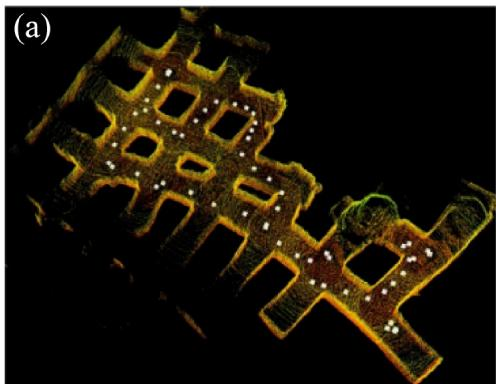

natural_image

Microscopic view of a porous material structure with embedded white particles (no text or symbols)

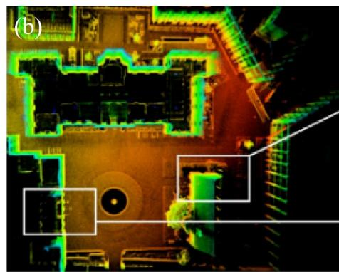

natural_image

Aerial view of a building complex with illuminated green and black outlines, no visible text or symbols.

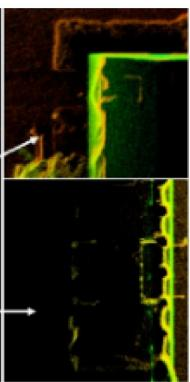

natural_image

Two-panel image showing a dark, green-lit object on the left and a black, yellow-green object on the right, with an arrow pointing to a feature (no text or symbols)

FIGURE 8 | SLAM results of two fusion types [104]. (a) Loosely coupled, (b) tightly coupled.

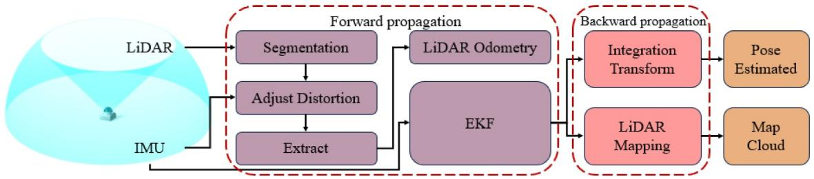

flowchart

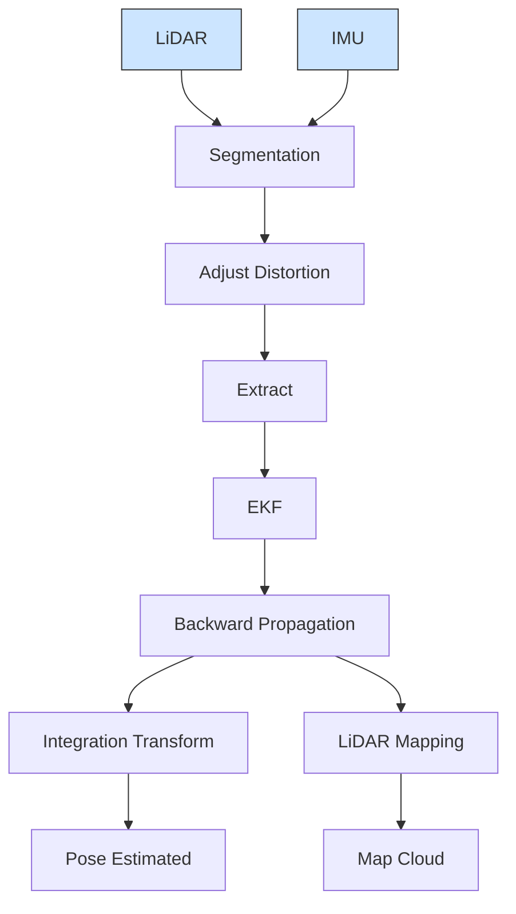

FIGURE 9 | Loosely coupled SLAM.

where $\pmb { R } _ { \mathrm { n } }$ is the covariance matrix of the observation noise and K is the Kalman gain, which is used to weigh the contributions of the residuals and Jacobian matrices.

Finally, the state estimate $\pmb { x } _ { k }$ is updated by adding the state increment Δx to the current estimate:

$$
\boldsymbol {x} _ {k} = \boldsymbol {x} _ {k} + \Delta \boldsymbol {x}. \tag {27}
$$

3.2.2.2 | Innovative Optimisation. In tightly coupled methods, data from all sensors are simultaneously integrated into a unified framework for joint estimation. The innovative optimisation component within these methods combines the advantages of traditional optimisation techniques with emerging technologies, enabling robust performance in high‐dimensional, nonlinear, multi‐objective, uncertain and dynamic environments. Here, we take the resilient state estimator used in UAVs [105] as an example to introduce a more advanced optimisation framework without constraints.

The state prediction is performed based on the system model as follows:

$$
\hat {\boldsymbol {x}} _ {k} ^ {-} = \boldsymbol {A} _ {k - 1} \hat {\boldsymbol {x}} _ {k - 1} + \boldsymbol {B} _ {k - 1} \boldsymbol {u} _ {k - 1}, \tag {28}
$$

where A and B are the parameter matrices and $\hat { \pmb x } _ { k } ^ { - }$ is the current state prediction, computed based on the previous state estimate $\hat { \pmb { x } } _ { k - 1 }$ and the control input ${ \pmb u } _ { k - 1 }$ . Subsequently, the unconstrained attack estimate is computed based on the measurement residual:

$$
\hat {\boldsymbol {d}} _ {k - 1} ^ {\mathrm{u}} = \boldsymbol {M} _ {k} \left(\boldsymbol {y} _ {k} - \boldsymbol {C} _ {k} \hat {\boldsymbol {x}} _ {k} ^ {-}\right), \tag {29}
$$

where $\pmb { M } _ { k }$ is the optimal filtering gain used to estimate the attack signal $\hat { \pmb { d } } _ { k - 1 } ^ { \mathrm { u } }$ . This algorithm implements an adaptive estimation mechanism like the $L _ { 1 }$ adaptive controller [106] through dynamic residual calculation and subsequently incorporates the estimated values into the state update via feedback.

The predicted attack estimate is incorporated into the time update:

$$
\hat {\boldsymbol {x}} _ {k} ^ {*} = \hat {\boldsymbol {x}} _ {k} - + \boldsymbol {G} _ {k - 1} \hat {\boldsymbol {d}} _ {k - 1} ^ {\mathrm{u}}, \tag {30}
$$

where $\hat { \pmb { x } } _ { k } ^ { * }$ represents the temporary updated state estimate. The state is further corrected using the measurement $y _ { k }$ :

$$
\hat {\boldsymbol {x}} _ {k} = \hat {\boldsymbol {x}} _ {k} ^ {*} + \boldsymbol {L} _ {k} \big (\boldsymbol {y} _ {k} - \boldsymbol {C} _ {k} \hat {\boldsymbol {x}} _ {k} ^ {*} \big), \tag {31}
$$

where $\scriptstyle { \mathbf { L } } _ { k }$ is the filter gain that is obtained by minimising the state error covariance $\pmb { P } _ { k } ^ { \mathrm { x , u } }$ .

Throughout the optimisation process, by appropriately selecting the filter gains $\pmb { M } _ { k }$ and $\scriptstyle { \mathbf { L } } _ { k } ,$ , the propagation of high‐frequency noise in the attack estimation can be limited, thereby improving the accuracy of the attack estimation.

During the projection update stage, constrained optimisation is applied to the attack signal and state estimate. The attack signal projection update is given by

$$
\hat {\boldsymbol {d}} _ {k - 1} ^ {\mathrm{u}} = \arg \min _ {\boldsymbol {d}} \left(\boldsymbol {d} - \hat {\boldsymbol {d}} _ {k - 1} ^ {\mathrm{u}}\right) ^ {\mathrm{T}} \boldsymbol {P} _ {k} ^ {\mathrm{d}, \mathrm{u}} \left(\boldsymbol {d} - \hat {\boldsymbol {d}} _ {k - 1} ^ {\mathrm{u}}\right), \tag {32}
$$

$$
\text { s.t. } A _ {k - 1} \boldsymbol {d} \leq \boldsymbol {b} _ {k - 1}.
$$

By projecting the unconstrained attack estimate $\hat { \pmb { d } } _ { k - 1 } \mathbf { u }$ into the constrained space, the constrained attack estimate $\hat { \pmb { d } } _ { k - 1 }$ is obtained. Similarly, the state projection update is formulated as follows:

$$
\hat {\boldsymbol {x}} _ {k} = \arg \min _ {\boldsymbol {x}} \left(\boldsymbol {x} - \hat {\boldsymbol {x}} _ {k} ^ {\mathrm{u}}\right) ^ {\mathrm{T}} \boldsymbol {P} _ {k} ^ {\mathrm{x}, \mathrm{u}} \left(\boldsymbol {x} - \hat {\boldsymbol {x}} _ {k} ^ {\mathrm{u}}\right), \quad \text {s.t.} \boldsymbol {B} _ {k} \boldsymbol {x} \leq \boldsymbol {c} _ {k} \tag {33}
$$

$$
\hat {\boldsymbol {x}} _ {k} = \arg \min _ {\boldsymbol {x}} \bigl (\boldsymbol {x} - \hat {\boldsymbol {x}} _ {k} ^ {\mathrm{u}} \bigr) ^ {\mathrm{T}} \boldsymbol {P} _ {\mathrm{x,u}} \bigl (\boldsymbol {x} - \hat {\boldsymbol {x}} _ {k} ^ {\mathrm{u}} \bigr), \quad \text {s.t.} \boldsymbol {B} _ {k} \boldsymbol {x} \leq \boldsymbol {c} _ {k}.
$$

By projecting the state estimate $\hat { \pmb { x } } _ { k } ^ { \mathrm { u } }$ into the constrained space, the final constrained state estimate $\hat { \boldsymbol { x } } _ { k }$ is obtained.

For the advanced optimisation framework with constraints, the vehicle's physical characteristics and motion constraints can be effectively integrated into trajectory estimation, achieving more accurate and realistic state estimation through an innovative optimisation method.

3.2.2.3 | Summary. Traditional optimisation methods and innovative optimisation methods play distinct yet complementary roles in SLAM systems, each excelling in different environments and requirements.

The primary goal of traditional optimisation methods is to minimise errors in the system's state estimation, typically achieved by minimising the residuals between observations and predictions. Techniques like Kalman filtering, such as EKF, are used to linearise the residuals through a first‐order Taylor expansion, enabling incremental state updates. These methods are generally efficient and well‐suited for most standard SLAM systems, particularly when sensor data errors are small and the system's state is relatively stable.

In contrast, innovative optimisation methods are more powerful in addressing the challenges posed by complex, nonlinear and dynamic environments. In tightly coupled methods, sensor data (such as IMU and LiDAR) are simultaneously integrated into a unified framework for joint estimation. These optimisation processes account for the multi‐objective, nonlinear characteristics and uncertainties in the system, resulting in improved robustness and accuracy in dynamic and complex settings. Innovative methods typically employ adaptive estimation mechanisms, residual calculations and dynamic updates to cope with high‐frequency noise and environmental variations.

Overall, traditional optimisation methods are suitable for simpler and more stable scenarios, whereas innovative optimisation methods excel in high‐dynamic, nonlinear or uncertain environments. In practical applications, combining both optimisation approaches can better balance computational efficiency with localisation accuracy, thereby enhancing the overall performance of SLAM systems. A summary of common optimisation methods is shown in Table 5.

# 3.3 | Comparison and Conclusion in Localisation

Not all SLAM methods use both forward and backward propagation. In this section, we compare several commonly used algorithms, as shown in Table 6. The table summarises the advantages of different SLAM algorithms based on their sensor configurations, including real‐time performance, accuracy, scalability and robustness in dynamic environments.

In GPS‐denied environments, the synergistic mechanism of forward propagation and backward propagation effectively mitigates cumulative drift and alleviates the impact of multisensor noise. However, camera‐based SLAM methods (e.g., monocular or stereo visual SLAM) typically lack a rigorous backward propagation process. Their pose optimisation primarily relies on front‐end feature matching and back‐end graph optimisation, making it difficult to explicitly correct motion estimates through point cloud residuals, as is common in LiDAR‐based SLAM. This distinction highlights the unique advantages of LiDAR‐based SLAM.

Forward propagation fuses IMU and LiDAR data, where the high‐frequency motion information from the IMU helps compensate for motion‐induced distortions in the point cloud and predicts the relative pose between two LiDAR frames, thereby improving short‐term localisation accuracy and reducing the impact of single sensor noise. However, IMU errors accumulate over time, leading to drift in the state estimation. To address this, SLAM systems incorporate backward propagation. By computing the residuals between the actual observations and the predicted values from forward propagation, the system detects and corrects errors. Point cloud matching (e.g., the ICP algorithm) minimises the Euclidean distance between observed and predicted points through nearest‐neighbour searches (such as KD‐tree), calculating residuals and refining the state estimate.

TABLE 5 | Optimisation methods in SLAM. 

<table><tr><td>Optimisation method</td><td>Advantage</td><td>Disadvantage</td><td>Applicable scenario</td><td>Representative SLAM</td></tr><tr><td>EKF [107]</td><td>Efficient for small-scale problems and handles nonlinearities</td><td>Sensitive to initial conditions</td><td>Small-scale SLAM</td><td>VINS-mono</td></tr><tr><td>Bundle adjustment</td><td>High precision in visual SLAM</td><td>Computationally expensive for large datasets</td><td>Visual SLAM</td><td>ORB-SLAM, PTAM</td></tr><tr><td>Nonlinear Least squares [108]</td><td>Efficient for nonlinear optimisation</td><td>Sensitive to local minima</td><td>Visual-inertial SLAM, LiDAR SLAM.</td><td>LIO-SAM, FAST-LIO</td></tr><tr><td>Particle filter [109]</td><td>Good for multimodal distributions and non-Gaussian noise</td><td>Computationally expensive</td><td>High uncertainty or dynamic conditions</td><td>FastSLAM, Monte Carlo localisation [110]</td></tr><tr><td>Information filter [111]</td><td>Efficient for sparse systems</td><td>Can be unstable in large systems</td><td>Sparse data or incremental updates</td><td>FastSLAM</td></tr><tr><td>Unscented Kalman filter [112]</td><td>Better at handling nonlinear systems than EKF</td><td>More computationally expensive</td><td>Systems with high nonlinearity</td><td>UKF-SLAM, R2D2 [113]</td></tr><tr><td>Deep learning</td><td>End-to-end learning, adapts to dynamic environments</td><td>Computationally expensive, needs large datasets</td><td>Dynamic environments, autonomous driving</td><td>DeepLIO [114], DeepVO [115], DeepFactor [116]</td></tr><tr><td>Gaussian</td><td>Optimises high-dimensional nonlinear problems using Gaussian models</td><td>High computational cost for large problems</td><td>Dynamic environments, large-scale SLAM</td><td>GS-SLAM [117]</td></tr><tr><td>L1 based [106]</td><td>Highly robust with strong adaptability</td><td>Computationally intensive for real-time applications</td><td>Dynamic, high interference, GPS-denied</td><td>Resilient state estimator</td></tr></table>

TABLE 6 | Advantages of different SLAM algorithms based on sensor Configuration. 

<table><tr><td>SLAM</td><td>Forward propagation</td><td>Backward propagation</td><td>Accuracy</td><td>Efficiency</td><td>Scalability</td></tr><tr><td colspan="6">Camera based SLAM</td></tr><tr><td>Amos-SLAM [118]</td><td>✓</td><td>X</td><td>X</td><td>X</td><td>X</td></tr><tr><td>SiLVR [119]</td><td>✓</td><td>X</td><td>X</td><td>X</td><td>X</td></tr><tr><td>SNI-SLAM [120]</td><td>✓</td><td>X</td><td>X</td><td>X</td><td>X</td></tr><tr><td colspan="6">LiDAR based SLAM</td></tr><tr><td>EKF-SLAM</td><td>✓</td><td>✓</td><td>X</td><td>✓</td><td>X</td></tr><tr><td>UKF-SLAM</td><td>✓</td><td>✓</td><td>✓</td><td>X</td><td>X</td></tr><tr><td>FAST-SLAM</td><td>✓</td><td>✓</td><td>✓</td><td>✓</td><td>✓</td></tr><tr><td>PF</td><td>✓</td><td>X</td><td>✓</td><td>X</td><td>X</td></tr><tr><td>FAST-LIO</td><td>✓</td><td>X</td><td>X</td><td>X</td><td>X</td></tr><tr><td>Cartographer</td><td>✓</td><td>✓</td><td>✓</td><td>✓</td><td>✓</td></tr><tr><td>GlORIE-SLAM [121]</td><td>✓</td><td>X</td><td>X</td><td>X</td><td>X</td></tr><tr><td colspan="6">LiDAR and camera SLAM</td></tr><tr><td>VIO</td><td>✓</td><td>✓</td><td>✓</td><td>✓</td><td>✓</td></tr><tr><td>SR-LIVO [122]</td><td>✓</td><td>X</td><td>X</td><td>X</td><td>X</td></tr><tr><td>NeuV-SLAM</td><td>✓</td><td>X</td><td>X</td><td>X</td><td>X</td></tr></table>

Optimisation methods like Kalman filtering or graph optimisation further adjust the state estimate, reducing the impact of sensor noise.

Forward propagation and backward propagation play complementary roles in SLAM systems. Forward propagation utilises high‐frequency sensor data to predict the system state, wheras backward propagation corrects errors through optimisation and loop closure detection. The combination of both ensures the stability of the system over extended periods of operation and maintains high precision and robustness in localisation and mapping, even in complex environments. Therefore, in practical applications, SLAM algorithms need to be designed and optimised for the specific sensor combinations, environmental characteristics and real‐time requirements, ensuring effective implementation of both forward and backward propagation. By combining forward and backward propagation in this way, SLAM systems can maintain low drift, improve localisation accuracy and ensure robustness and stability in long‐term operation, even in the absence of GPS.

# 4 | Mapping

The localisation part discussed earlier provides precise spatial references for the SLAM system and serves as the foundation for mapping. However, localisation is insufficient for complete environmental modelling and autonomous navigation without accurate mapping. Mapping not only records environmental information but also demands the precise modelling of spatial structures in a global coordinate system. Keyframe selection, map stacking, loop closure detection and map rendering are important to ensure map accuracy, real‐time performance and readability. Figure 10 shows the mapping results of two popular SLAM methods.

# 4.1 | Point Insertion and Map Stacking

Point insertion and map stacking are key techniques in LiDARbased SLAM systems for constructing and updating maps. Each time a new LiDAR observation is obtained, the SLAM system performs point insertion by adding the newly acquired point cloud data into the current map, gradually updating the local environmental model. This process helps incrementally improve the robot's localisation and map information with each LiDAR scan. Map stacking, on the other hand, is the process of merging multiple local maps obtained at different times or from different locations into a global map. As the robot moves, each new observation aligns with the existing map, and through map stacking, a more complete environmental representation is formed. Together, point insertion and map stacking allow the system to gradually build a high‐precision global map while reducing cumulative errors and localisation drift, thus improving the stability and accuracy of the SLAM system.

# 4.1.1 | Keyframe Selection

In SLAM systems, due to limitations in computational and storage resources, not all collected data can be used for map updating and optimisation. The selection of keyframes plays a crucial role in balancing storage space and map accuracy. By choosing representative and information‐rich keyframes, redundant data can be effectively reduced, optimising computational and storage load while providing more constraints, thus improving the accuracy of map construction and localisation.

To address various scenarios, different keyframe selection methods have emerged. For dynamic environments or complex map structures, the focus is often on selecting frames that can effectively represent environmental changes or capture sparse information. In other scenarios, the emphasis may be on ensuring sufficient geometric constraints between keyframes to avoid redundant data storage. Information gain‐driven keyframe selection methods quantify the contribution of each candidate keyframe to map state updates and optimisation, dynamically selecting keyframes that maximise information gain, thereby balancing computation and accuracy and enhancing the overall performance of the SLAM system.

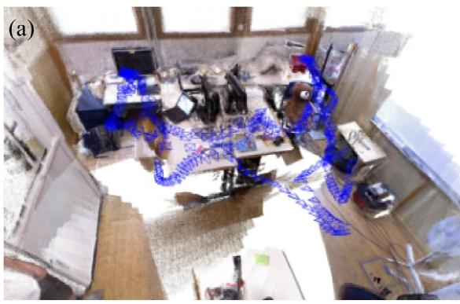

text_image

(a)

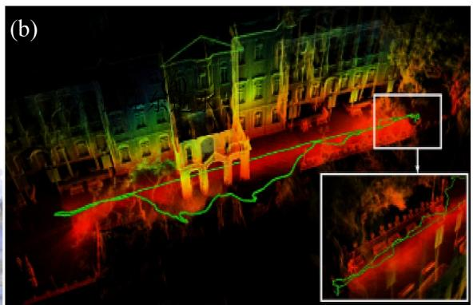

natural_image

Nighttime aerial view of a multi-story building with illuminated green and red light patterns, showing road and landscape features (no visible text or symbols)

FIGURE 10 | Comparison of mapping results. (a) Visual SLAM mapping result—ORBSLAM2 [6], (b) LiDAR SLAM mapping result—Fast‐LIO [27].

The core principle of information gain is the Fisher information matrix, which measures the contribution of the observation data to the accuracy of state estimation. By calculating the information matrix, we can quantitatively describe how current observations reduce the uncertainty in the state. In detail, the information matrix $\pmb { I } ( \pmb { x } )$ is calculated using the Jacobian matrix $\pmb { H } _ { i }$ of the observation model and the observation noise covariance matrix $\mathbf { } R _ { i } .$ The form of the information matrix is as follows:

$$
\boldsymbol {I} (\boldsymbol {x}) = \sum_ {i} ^ {K} \boldsymbol {H} _ {i} ^ {\mathrm{T}} \boldsymbol {R} _ {i} ^ {- 1} \boldsymbol {H} _ {i} \tag {34}
$$

where $\pmb { H } _ { i }$ is the Jacobian matrix of the observation equation with respect to the state and $\pmb { R } _ { i }$ is the covariance matrix of the observation noise, reflecting the effect of measurement noise. The larger the information matrix, the more accurate the current state estimate is and the smaller the system's uncertainty.

Information gain measures the contribution of each frame by comparing the difference in uncertainty between the current state estimate and the new state estimate. Suppose the current state estimate of a frame $\mathrm { i } \mathbf { s } \pmb { x } _ { k }$ and the information matrix is $\pmb { I } ( \pmb { x } _ { k } )$ . When new observation data arrive, the system updates the state estimate and covariance matrix, resulting in a new information matrix $\pmb { I } ( \pmb { x } _ { k + 1 } )$ . The calculation of information gain is as follows:

$$
\Delta \boldsymbol {I} = \boldsymbol {I} (\boldsymbol {x} _ {k}) - \boldsymbol {I} (\boldsymbol {x} _ {k + 1}) \tag {35}
$$

The information gain ΔI represents the improvement in state estimation accuracy due to the new frame's observation data. If the gain ΔI is sufficiently large, it indicates that the new frame's observation significantly contributes to the state estimate, and thus the current frame can be selected as a keyframe.

Recently, methods based on AI have gradually become a new trend. Next, we will compare common keyframe selection methods, including traditional approaches based on geometric features and information gain, as well as adaptive selection methods driven by AI technologies, analysing their advantages, disadvantages and applicable scenarios.

ORB‐SLAM2 employs a geometry‐based algorithm, primarily relying on inter‐frame pose changes and visual feature variations to select keyframes. LIO‐SAM uses an information gainbased algorithm, leveraging the information matrix to assess the contribution of each frame to the uncertainty in the current state estimate. G2O adopts a graph optimisation‐based algorithm, selecting keyframes based on pose change thresholds and the precision requirements of the graph optimisation. In contrast, AI‐driven algorithms, such as DeepSLAM, utilise deep learning or reinforcement learning techniques to automatically identify the most informative keyframes by training models. These algorithms can adaptively optimise keyframe selection strategies in complex environments. Each of these methods has its own advantages and is suitable for different application scenarios. Table 7 provides a detailed comparison of their characteristics, advantages and disadvantages.

# 4.1.2 | Data Structure

In the point insertion and map stacking processes, choosing the appropriate data structure is crucial for improving the efficiency of map building and state estimation. Commonly used data structures include KD‐tree, IKD‐tree, Octree and voxel grids.

The KD‐tree is a multidimensional data structure that enables efficient neighbourhood searches, making it particularly suitable for sparse data and feature matching tasks. The authors in ref. [129] utilised the KD‐tree method to optimise the classic ICP algorithm, improving the speed and accuracy of point cloud registration while significantly reducing computational time. The authors in ref. [130] improved the efficiency and accuracy of point cloud registration by combining the FPFH algorithm, ISS algorithm and KD‐tree structure. This approach significantly enhanced computational speed and accuracy, particularly in accelerating nearest neighbour searches and excluding erroneous point pairs. However, as the data volume increases, the performance of the KD‐tree may degrade, and the tree structure needs to be rebuilt during dynamic updates.

TABLE 7 | Comparison of keyframe selection algorithms. 

<table><tr><td>Keyframe selection</td><td>Advantage</td><td>Disadvantage</td><td>Representative algorithm</td><td>Application</td></tr><tr><td>Information gain-based</td><td>Improves localisation accuracy by quantifying precision contribution</td><td>High computational cost, sensitive to noise</td><td>LIO-SAM, FAST-LIO, LeGO-LOAM, LIO-LOAM, VINS-mono</td><td>LiDAR-based SLAM, high-precision tasks</td></tr><tr><td>Motion estimation-based</td><td>Works well in dynamic scenes, suitable for fast motion</td><td>May miss frames in low-dynamic environments</td><td>VINS-mono, MSCKF [123], SVO</td><td>Real-time applications with dynamic motion</td></tr><tr><td>Threshold-based</td><td>Simple, easy to implement, adjustable keyframe frequency</td><td>Threshold tuning required, needs dynamic adjustments</td><td>ORB-SLAM2, OKVIS [124], LSD-SLAM</td><td>General-purpose SLAM, adjustable frequency scenarios</td></tr><tr><td>Feature-based</td><td>Simple, captures visual changes effectively</td><td>Sensitive to lighting and occlusion, can select redundant frames</td><td>ORB-SLAM, DSO, PTAM, Amos-SLAM, SiLVR, SNI-SLAM.</td><td>Visual SLAM, environments with rich visual features</td></tr><tr><td>Deep learning-based</td><td>Adaptive, handles complex environments</td><td>Requires large datasets, high computational cost</td><td>DeepVO, DeepSLAM, NeuV-SLAM</td><td>Large-scale and dynamic environments</td></tr><tr><td>Reinforcement learning-based</td><td>Adapts to changing environments, optimises long-term performance</td><td>Needs extensive training, high computational demand.</td><td>DQN [125], PPO, SR-LIVO</td><td>Complex environments requiring optimisation over time</td></tr><tr><td>Self-supervised learning-based</td><td>No labelled data required, uses large unlabelled datasets</td><td>Sensitive to noise and environmental changes</td><td>SimCLR [126], SwAV [127]</td><td>Environments with limited labelled data</td></tr><tr><td>GNN-based</td><td>Captures global dependencies, improves accuracy</td><td>High computational and storage demands, complex training</td><td>GraphSLAM with GNN, GNN-based SLAM [128], GlORIE-SLAM</td><td>Large-scale SLAM systems, requiring global context</td></tr></table>

To overcome this issue, IKD‐tree introduces an incremental update mechanism that supports dynamically adding new points without reconstructing the entire tree, making it suitable for SLAM systems that require real‐time updates. The authors in ref. [131] proposed the IKD‐tree data structure that significantly reduces computation time by only updating the newly added points. It supports multi‐threaded parallel computation, improving point cloud data processing efficiency in robotic applications. The authors in ref. [132] proposed an efficient and precise 3D SLAM method for autonomous vehicles and mobile robots in complex dynamic environments. They used an IKDtree data structure to efficiently manage the map and employ an FCNN to accurately segment dynamic objects to improve the stability and accuracy of the SLAM system.

Octree is also a commonly used spatial partitioning data structure that recursively divides 3D space into eight subspaces. It is particularly suitable for efficient storage and processing of sparse point cloud data, enabling fast spatial queries such as neighbourhood search and point cloud matching without requiring global indexing. The authors in ref. [133] proposed OctAttention, a deep learning framework based on the Octree structure for point cloud compression. With the Octree data representation and an attention mechanism, the efficiency of point cloud distribution modelling is improved significantly. The author in ref. [134] proposed i‐Octree, a dynamic Octree data structure designed for fast nearest neighbour search and real‐time dynamic updates. Unlike traditional static tree structures, i‐Octree supports point insertion, deletion and downsampling operations within the tree. It utilises a local spatial continuity storage strategy, enabling quick point access while minimising memory usage.

The voxel grid data structure reduces the precision of the data by dividing the 3D space into uniform voxels, which in turn reduces memory consumption and computation, but may sacrifice some accuracy. The authors in ref. [135] improved localisation accuracy by using an efficient voxel hashing method, which allows querying visible points within the camera's field of view in constant time. The authors in ref. [136] proposed voxel‐SLAM, a complete, accurate and multifunctional LiDAR‐inertial SLAM system, where the core of the system uses a voxel data structure for map representation. Through short‐term, mid‐term, longterm and multi‐map data association, the system achieves efficient real‐time estimation and high‐precision map construction.

Different data structures have their own advantages and limitations. The selection of the appropriate structure depends on the specific application scenario, data characteristics and realtime requirements. A summary and comparison of commonly used data structures is shown in Table 8.

# 4.2 | Loop Closure

Loop closure is a critical process in SLAM, aimed at correcting accumulated localisation errors and improving the overall accuracy of the map by detecting whether the robot has returned to a previously visited location. Loop closure is not only crucial for accuracy but also prevents the long‐term effects of localisation drift, especially in large‐scale environments. The following will introduce several commonly used loop closure methods, along with a comparison and analysis of their accuracy, advantages, disadvantages and applicable scenarios.

TABLE 8 | Common data structures for point insertion and map stacking in SLAM. 

<table><tr><td>Data structure</td><td>Advantage</td><td>Disadvantage</td><td>Applicable scenario</td></tr><tr><td>KD-tree</td><td>Efficient for nearest-neighbour searches in low-dimensional spaces</td><td>Performance degrades in high dimensions. Slow insert/delete</td><td>Point cloud processing, feature matching in sparse datasets</td></tr><tr><td>IKD-tree</td><td>Enhances KD-tree with hierarchical interpolation for large datasets</td><td>High memory usage, computationally expensive construction</td><td>Large-scale point cloud queries, fast mapping</td></tr><tr><td>Octree</td><td>Scalable, efficient for large point clouds with dynamic updates</td><td>High storage cost in dense regions, computationally intensive</td><td>3D mapping, SLAM in dynamic environments</td></tr><tr><td>Voxel grid</td><td>Reduces point cloud size, simplifying computations</td><td>Fixed voxel size may cause loss of detail, unsuitable for dynamic scenes</td><td>Point cloud downsampling, real-time static SLAM</td></tr><tr><td>R-tree</td><td>Efficient for multidimensional spatial queries, dynamic updates</td><td>Query efficiency depends on data distribution, complex inserts</td><td>Spatial indexing, GIS, map construction</td></tr><tr><td>Hash map [137]</td><td>Fast query time (O (1)), efficient insertion and deletion</td><td>Not suitable for multidimensional spatial data</td><td>Feature storage, dynamic object retrieval in SLAM</td></tr></table>

Graph optimisation methods are one of the classic techniques for loop closure in SLAM, widely used in large‐scale environments, especially in scenarios where global constraints are of high importance. The core task is to build a pose graph from sensor data and correct localisation errors through loop closure detection. When a loop closure is detected, constraints between the current pose and historical poses are added to the graph, forming new edges, and the entire graph is optimised to reduce error accumulation. The authors in ref. [138] used a graph optimisationbased loop detection method, successfully correcting cumulative errors in robot localisation by reconstructing a 3D semantic graph and aligning matched objects. Their proposed object‐level data association algorithm significantly improved accuracy and was more robust than traditional nearest‐neighbour‐based methods, better handling environmental appearance changes.

The basic idea of scan matching is to compare the current scan with historical scans, calculate the matching error between them and determine if a loop closure exists. Once a loop is confirmed, the matching result can be used to optimise the map and correct accumulated errors. LiDAR scan data contain geometric features of the environment, and by matching these features, it is possible to effectively determine whether the robot has returned to a previously visited location. The authors in ref. [139] used a scan‐matching‐based loop closure detection method, estimating the similarity between LiDAR scans through a modified Siamese network. They successfully implemented loop closure detection and global localisation. Their method estimates the similarity of scan pairs using different cues in the LiDAR data and further provides a relative yaw angle estimate. Experimental results show that their method outperforms existing methods in loop closure detection and reliably performs global localisation in various environments.

The BoW model, initially used in natural language processing as an information retrieval model, has been widely applied in loop closure detection in visual SLAM systems. The BoW method discretises image feature descriptors into a vocabulary and matches these feature vectors with historical data in a database to identify loop closures. The authors in ref. [140] used a BoW‐based loop closure detection method and proposed BoW3D. This method not only efficiently identifies revisited locations but also corrects the full 6 degrees of freedom loop closure pose in real time. Experimental results show that BoW3D outperforms existing technologies in multiple scenarios and has high scalability.

In recent years, with the rapid development of AI, AI‐based loop closure methods have gradually become an important research direction in loop detection. Deep learning methods construct neural networks to learn feature representations in the environment and use these representations for loop closure detection. The authors in ref. [141] proposed a DL‐based loop closure detection method, using local 3D deep descriptors (L3Ds) for loop closure detection. By calculating the metric error between descriptors and registering loop closure candidate point clouds, this method can accurately detect loop closures and estimate 6‐DoF poses, significantly improving localisation accuracy. Moreover, RL technology has also shown potential in loop closure. By designing adaptive learning strategies, reinforcement learning can continuously optimise the loop closure process through interaction with the environment. The authors in ref. [142] proposed a deep reinforcement learning loop closure detection method, using a reward‐driven optimisation process to learn the loop closure task. They validated the framework in a simulated grid environment and demonstrated the process of converting real‐world maps and features into the simulated environment.

In conclusion, different methods have their own advantages in terms of accuracy, real‐time performance and applicable scenarios. The comparison of the loop closure methods is shown in Table 9. And Figure 11 will directly show the improvement of the loop closure.

# 4.3 | Render

In SLAM and robotic vision, point cloud rendering is a key technology that converts 3D information of the environment into visualised images. Through rendering, the acquired point cloud data can intuitively display environmental features, supporting environmental perception, map analysis and improving localisation accuracy. Different sensor configurations, data fusion strategies and rendering methods directly affect the accuracy and processing speed of point cloud visualisation.

TABLE 9 | Comparison of loop closure methods. 

<table><tr><td>Method</td><td>Accuracy</td><td>Applicable scenario</td><td>Representative algorithm</td></tr><tr><td>Graph-based methods</td><td>High</td><td>Large-scale environments with strong global constraints</td><td>G2O, iSAM, LeGO-LOAM, LIO-SAM, LIO-LOAM</td></tr><tr><td>BoW</td><td>High</td><td>Visual SLAM, static environments with rich visual features</td><td>ORB-SLAM2, SVO, LSD-SLAM, Amos-SLAM</td></tr><tr><td>Scan matching</td><td>High</td><td>LiDAR-based SLAM, high-precision mapping in structured environments</td><td>LIO-SAM, FAST-LIO, LeGO-LOAM, Cartographer</td></tr><tr><td>Deep learning-based methods</td><td>High</td><td>Large-scale and dynamic environments, especially unstructured settings</td><td>DeepVO, DeepSLAM, NeuV-SLAM</td></tr><tr><td>Visual-inertial methods</td><td>Medium-high</td><td>Dynamic environments, environments with limited visual data</td><td>VINS-mono, OKVIS, VIO</td></tr><tr><td>Hybrid methods</td><td>Medium-high</td><td>Environments with varied sensor data and dynamic conditions</td><td>LIO-SAM, LIO-LOAM, Cartographer</td></tr><tr><td>RL-based methods</td><td>Low</td><td>Complex environments requiring long-term optimisation</td><td>DQN, PPO, SR-LIVO</td></tr></table>

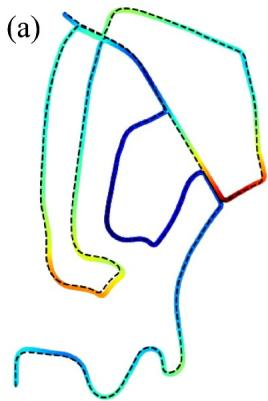

natural_image

Abstract line drawing with multiple colored curves and a wavy base, no text or symbols present

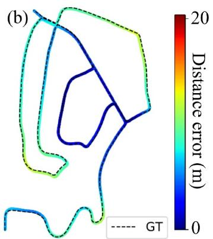

line

| x | y | Distance error (m) |
| --- | --- | --- |
| 0 | 0 | 0 |
| 1 | 1 | 5 |
| 2 | 2 | 10 |
| 3 | 3 | 15 |
| 4 | 4 | 20 |
| 5 | 5 | 15 |
| 6 | 6 | 10 |
| 7 | 7 | 5 |
| 8 | 8 | 0 |
| 9 | 9 | -5 |
| 10 | 10 | -10 |
| 11 | 11 | -15 |
| 12 | 12 | -20 |
| 13 | 13 | -15 |
| 14 | 14 | -10 |
| 15 | 15 | -5 |
| 16 | 16 | 0 |
| 17 | 17 | -5 |
| 18 | 18 | -10 |
| 19 | 19 | -15 |
| 20 | 20 | -20 |
| 21 | 21 | -15 |
| 22 | 22 | -10 |
| 23 | 23 | -5 |
| 24 | 24 | 0 |
| 25 | 25 | -5 |
| 26 | 26 | -10 |
| 27 | 27 | -15 |
| 28 | 28 | -20 |
| 29 | 29 | -15 |
| 30 | 30 | -10 |
| 31 | 31 | -5 |
| 32 | 32 | 0 |
| 33 | 33 | -5 |
| 34 | 34 | -10 |
| 35 | 35 | -15 |
| 36 | 36 | -20 |
| 37 | 37 | -15 |
| 38 | 38 | -10 |
| 39 | 39 | -5 |
| 40 | 40 | 0 |
| 41 | 41 | -5 |
| 42 | 42 | -10 |
| 43 | 43 | -15 |
| 44 | 44 | -20 |
| 45 | 45 | -15 |
| 46 | 46 | -10 |
| 47 | 47 | -5 |
| 48 | 48 | 0 |
| 49 | 49 | -5 |
| 50 | 50 | -10 |
| 51 | 51 | -15 |
| 52 | 52 | -20 |
| 53 | 53 | -15 |
| 54 | 54 | -10 |
| 55 | 55 | -5 |
| 56 | 56 | 0 |
| 57 | 57 | -5 |
| 58 | 58 | -10 |
| 59 | 59 | -15 |
| 60 | 60 | -20 |
| 61 | 61 | -15 |
| 62 | 62 | -10 |
| 63 | 63 | -5 |
| 64 | 64 | 0 |
| 65 | 65 | -5 |
| 66 | 66 | -10 |
| 67 | 67 | -15 |
| 68 | 68 | -20 |
| 69 | 69 | -15 |
| 70 | 70 | -10 |
| 71 | 71 | -5 |
| 72 | 72 | 0 |
| 73 | 73 | -5 |
| 74 | 74 | -10 |
| 75 | 75 | -15 |
| 76 | 76 | -20 |
| 77 | 77 | -15 |
| 78 | 78 | -10 |
| 79 | 79 | -5 |
| 80 | 80 | 0 |
| 81 | 81 | -5 |
| 82 | 82 | -10 |
| 83 | 83 | -15 |
| 84 | 84 | -20 |
| 85 | 85 | -15 |
| 86 | 86 | -10 |
| 87 | 87 | -5 |
| 88 | 88 | 0 |
| 89 | 89 | -5 |
| 90 | 90 | -10 |
| 91 | 91 | -15 |
| 92 | 92 | -20 |
| 93 | 93 | -15 |
| 94 | 94 | -10 |
| 95 | 95 | -5 |
| 96 | 96 | 0 |
| 97 | 97 | -5 |
| 98 | 98 | -10 |
| 99 | 99 | -15 |
| Note: The GT series is not explicitly labeled in the code. The y-axis label is "Distance error (m)". The x-axis label is "GT". The color bar indicates "Distance error (m)".

FIGURE 11 | Performance of LIO‐SAM with the original loop closure detection method (a) compared to LCD‐net deep loop closure detection (b) on sequence 02 of the KITTI dataset [143].

In this section, we explore two LiDAR‐based point cloud rendering methods: one based on LiDAR sensors for point cloud rendering and the other combining LiDAR and camera information for colour point cloud rendering. The former focuses on utilising the spatial geometric information captured by LiDAR for 3D reconstruction, whereas the latter enriches the point cloud's expressiveness by integrating colour information from the camera, enhancing the rendering accuracy and detail representation.

# 4.3.1 | LiDAR Only Point Cloud Visualisation

In SLAM systems that use LiDAR as the sole sensor, point cloud rendering mainly relies on the ranging capability of LiDAR data to visualise point cloud information in the environment. This is crucial for robot localisation, path planning and map construction in GPS‐denied and unknown environments.

LiDAR is based on the time‐of‐flight (ToF) principle or phaseshift ranging. The LiDAR emits laser pulses towards target objects, and when the laser pulse hits the object surface, it is reflected back to the sensor. After receiving the reflected signal, the sensor calculates the time difference Δt between emission and reception of the pulse. And the distance d of the laser pulse can be calculated as follows:

$$
d = \frac {c \Delta t}{2} \tag {36}
$$

After obtaining the depth value d for each laser pulse, the 3D coordinates (x, y, z) of each measurement point can be determined with the rotation and translation of LiDAR. These 3D coordinates together form the point cloud data, providing a sparse representation of the surrounding environment.

Point rendering is one of the most common methods for visualising point clouds, where each point is directly represented as a small dot or circle in 3D space. This method is simple and intuitive, providing an effective way to display the spatial distribution and position of the points. The process begins with transforming the coordinates of the points, typically using a transformation matrix, such as a rotation matrix and translation vector. For a point with original coordinates (x, y, z), its coordinates in a new perspective $\left( x ^ { \prime } , y ^ { \prime } , z ^ { \prime } \right)$ can be calculated using the following equation:

$$
\left( \begin{array}{l} x ^ {\prime} \\ y ^ {\prime} \\ z ^ {\prime} \end{array} \right) = \boldsymbol {R} \cdot \left( \begin{array}{l} x \\ y \\ z \end{array} \right) + \boldsymbol {T} \tag {37}
$$

where R represents the rotation matrix, describing the rotation from the original coordinate system to the target system and T is the translation vector, representing the translation of the coordinate system. After the coordinate transformation, the next step is projecting the 3D point cloud onto a 2D plane. This is commonly done using perspective or orthogonal projection, with the points being projected onto the image plane according to the equations:

$$
x _ {2 \mathrm{D}} = \frac {x ^ {\prime}}{z ^ {\prime}} \cdot f, \quad y _ {2 \mathrm{D}} = \frac {y ^ {\prime}}{z ^ {\prime}} \cdot f \tag {38}
$$

where $( x , y , z )$ are the original 3D coordinates, f is the focal length and $\left( x _ { 2 \mathrm { D } } , y _ { 2 \mathrm { D } } \right)$ are the projected 2D coordinates. Finally, the 2D points are rendered onto the screen, typically as small dots or circles to represent the 3D points.

Volume rendering, on the other hand, does not directly render individual points but visualises the entire space, generating a continuous volume representation. Common volume rendering methods include volume rendering and surface reconstruction techniques. In volume rendering, the point cloud data undergoes interpolation, filtering and other operations to generate a smoother surface or volumetric effect, allowing better display of the details in the point cloud. Popular algorithms include voxel grid rendering and NDT. These techniques are particularly effective for visualising dense or noisy data, as they can generate a more continuous and visually cohesive representation of the environment, making them suitable for applications requiring high‐fidelity visualisations.

To help better understand the advantages and disadvantages of these methods, Table 10 summarises several common point cloud rendering methods, mainly comparing their speed and accuracy.

# 4.3.2 | LiDAR and Camera Point Cloud Visualisation

When the data from LiDAR and a camera are combined for point cloud rendering, the point cloud visualisation not only relies on the geometric data provided by the LiDAR but also maps the colour information from the camera onto the 3D point cloud, resulting in a coloured point cloud image. Specifically, the camera provides a colour value for each point in the point cloud, so each point not only has spatial coordinates $( x , y , z )$ but also carries colour information (r, g, b). The implementation of this rendering process typically involves several steps, starting with the synchronisation and registration of the LiDAR and camera data to ensure that both datasets correspond to the same location in the same space. Common techniques for this include time synchronisation between the image and LiDAR data and spatial alignment $\mathrm { ( e . g . }$ , using calibration to obtain the transformation matrix between the sensors). Once the data are aligned, projection methods are used to map the 3D point cloud onto the camera's image plane. The colour information for each point in the point cloud is then assigned by using the pixel values from the image. This mapping can be expressed by the following formula:

$$
\mathbf {S} _ {i} = \mathbf {Z} _ {i} (x, y, z) \tag {39}
$$

where $\pmb { S } _ { i }$ is the colour information of the i‐th point, and $\pmb { Z } _ { i } ( x , y , z )$ is the corresponding location of that point in the camera's image. Finally, the point cloud with colour information is rendered and displayed, with each point carrying not only its position but also its colour, resulting in a 3D visualisation that showcases richer environmental details.

TABLE 10 | Comparison of different point cloud rendering methods. 

<table><tr><td>Method</td><td>Speed</td><td>Accuracy</td><td>Tool</td></tr><tr><td>Basic point cloud rendering</td><td>High</td><td>Low</td><td>PCL (point cloud Library), ROS visualisation tools (Rviz)</td></tr><tr><td>Voxel grid rendering</td><td>Medium</td><td>Medium</td><td>VoxelGrid (PCL), Octomap</td></tr><tr><td>Point-based rendering with colour coding</td><td>Medium</td><td>High</td><td>PCL, Open3D</td></tr><tr><td>Octree-based rendering</td><td>Low</td><td>High</td><td>Octomap, PCL</td></tr><tr><td>Surface reconstruction</td><td>Low</td><td>High</td><td>Poisson surface reconstruction, Open3D, Meshlab</td></tr></table>

For traditional methods, cameras are often the sole sensor used for environmental data acquisition. Taking oblique photogrammetry [144] as an example, its core idea is to reconstruct the 3D structure of the environment from images captured from multiple perspectives. First, images of the target area are taken from different angles using a camera. These images typically have some overlapping regions, which provide the possibility for subsequent image registration and fusion. Image registration is performed using feature matching algorithms to align the images from different viewpoints, obtaining the relative position relationships between the images. Next, using the correspondences between the images, 3D reconstruction techniques (such as stereo vision, structured light or bundle adjustment) are applied to compute the coordinates of each image pixel in 3D space, generating a set of 3D point clouds. These point clouds represent the geometric shapes of objects or terrain in the scene but typically contain only spatial coordinates without colour information.

For popular point cloud rendering and 3D reconstruction algorithms, we will introduce 3DGS and neural radiance fields (NeRF) [145] as examples and provide a comparison of common methods. The core idea of 3DGS [146] is to combine the 3D geometric information of the scene with images captured from different viewpoints, thus obtaining a richer and more accurate 3D representation. It integrates data from LiDAR, oblique photogrammetry and other sensor information, such as IMUs. Through data fusion, it is possible to preserve the accuracy of the geometric structure while adding more visual details, making the reconstructed 3D model more realistic and detailed. In practice, the 3DGS method first collects scene data using multiple sensors. LiDAR provides high‐precision geometric data, whereas the camera captures rich texture and colour information. Next, using data registration techniques, the measurement results from LiDAR and the camera are aligned in the same spatial coordinate system. This process typically includes time synchronisation and spatial alignment, ensuring that the data captured by different sensors correspond in the same space, thus avoiding errors caused by sensor discrepancies. After data fusion, the 3D geometric structure of the scene can be reconstructed based on LiDAR point cloud data, whereas the images obtained from the camera add colour and texture to the point cloud, further enhancing the visual effect of the 3D reconstruction. Finally, using texture mapping, the colour information from the images is projected onto the 3D point cloud, making the final generated 3D model not only contain accurate geometric data but also realistic colour and texture details. This process is usually rendered using traditional computer graphics techniques, combining multi‐view image data to ensure the final rendering effect is realistic and immersive.

NeRF [147], as an innovative neural rendering technique, is redefining the paradigm of 3D reconstruction through deep integration with LiDAR and camera‐based point cloud visualisation technologies. This combination fully leverages the advantages of multimodal data: high‐precision geometric point clouds from LiDAR serve as strong constraints, significantly enhancing the stability of NeRF training and reconstruction accuracy, whereas multi‐view images captured by cameras achieve photorealistic rendering effects that surpass traditional methods through neural radiance fields. The synergy between these two not only addresses the distortion issues of purely visual methods in textureless regions but also overcomes the limitations of traditional point cloud visualisation in detail representation. For instance, in autonomous driving, LiDAR‐NeRF systems enable real‐time scene reconstruction with centimetre‐level accuracy while maintaining cinematic‐quality rendering. In industrial inspection, hybrid systems combining high‐precision point clouds with neural radiance fields can achieve submillimetre‐level defect detection [148]. This novel 3D reconstruction approach not only represents the latest technological trend in the field of computer vision but also charts a clear direction for the future development of intelligent perception systems.

To better understand the trade‐offs between these methods, Table 11 summarises the comparison of popular point cloud rendering techniques based on their speed and accuracy. And Figure 12 compares different rendering methods.

# 5 | Experimental Results Comparison

After comprehensively analysing a large number of academic papers, this section carefully collects and standardises the experimental data from public datasets in different sources and environments. This approach enables a clear and accurate comparison of the performance differences of various SLAM methods in practical applications, providing useful insights into their effectiveness and adaptability.

TABLE 11 | Comparison of different point cloud rendering methods. 

<table><tr><td>Method</td><td>Speed</td><td>Accuracy</td></tr><tr><td>Traditional</td><td>Moderate</td><td>High</td></tr><tr><td>Stereo vision</td><td>Moderate to high</td><td>Moderate to high</td></tr><tr><td>3DGS</td><td>Moderate</td><td>Very high</td></tr><tr><td>NeRF</td><td>Low</td><td>Very high</td></tr></table>

We first provide two tables to show the comprehensive performances of different state‐of‐art SLAM algorithms. The table head includes scenarios in urban, forest and road. Table 12 shows the evaluation time of each computational loop. The table head includes scenarios in urban, forest and road. Table 13 shows the absolute pose error in the different simulation environments. The nclt, utbm, ulhk and liosam are different datasets provided by University of Michigan, University of Technology of Belfort‐Montbéliard, UrbanLoco and OpenLab, respectively. The root mean square error (RMSE) shown here is the result of multiple experiments. It is an important statistical indicator used to measure the degree of deviation between the predicted values and the true values.

LiDAR, especially the Livox Mid‐360 type, is highly cost‐effective and is widely integrated into commercially available robotic platforms, with large field of view‐hemispheric shape scanning in 10 Hz one‐shot with a high precision of 1 σ of 3 cm. For example, quadruped robots such as DeepRobotics X30 has been widely used for power plant surveillance and handheld LiDAR scanner like SHARE SLAM S10 is thriving in mining or building scanning. The current evaluation of SLAM methods mainly focuses on the accuracy and the computational time of optimisation. There is a noticeable lack of evaluation criteria related to the mapping process itself. Thus, we have conducted performance tests on popular algorithms for indoor localisation and mapping. We employed the Livox Mid‐360 on a hand‐held scanning system embedded with NVIDIA Jetson Orin Nano (1.5 GHz, with 1024 CUDA cores). We utilised this scanning system to capture 3D reconstruction maps across three floors (from the third to the fifth floor) within the stairwells and lobbies of an office building. A representative example of Faster‐LIO reconstruction example is demonstrated in Figure 13. To enhance the clarity of visualisation, we removed the walls directly facing the viewpoint in both the stairwells and lobbies, effectively revealing the internal structure in greater detail. The floating point cloud represents the trajectory experienced by LiDAR during data collection. Based on the experimental experience and literature review, we have developed a new evaluation metric of the 3D reconstruction process by measuring the thickness of the scanned building surface, as illustrated in Table 14.

The average surface thickness is calculated by measuring wall thickness at equidistant points across each surface and then computing the mean of these values. The floor incline angle is derived from the average deviation from horizontality between floors, whereas the stairwell wall incline angle is determined by the average deviation from the verticality of the bounding walls in the stairwell. For the object radius error, we compare the reconstructed radius (obtained via each mapping method) against the real radius of the fifth‐floor ceiling lamp. The lamp's circumference was physically measured using a leather tape, corresponding to a true radius of 0.75 m. The reconstructed radii across methods range from 0.77 to 0.92 m, indicating varying degrees of accuracy. The table comprehensively summarises the mapping results across all tested methodologies. Among the six methods evaluated, Faster‐LIO demonstrates the best overall performance, achieving exceptional accuracy in surface thickness and incline angle measurements. Additionally, it maintains a relatively small object radius error, further solidifying its reliability for real‐world localisation and mapping applications.

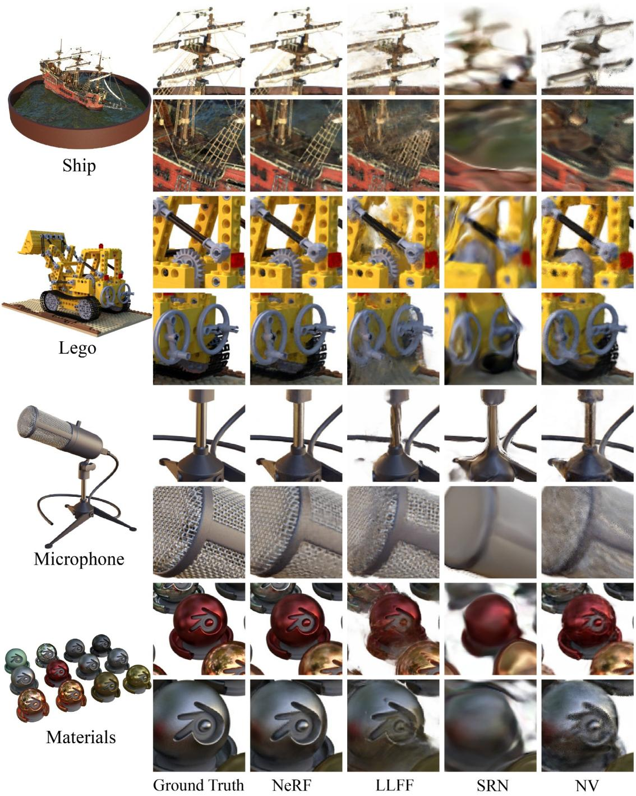

text_image

Ship
Lego
Microphone
Materials
Ground Truth
NeRF
LLFF
SRN
NV

FIGURE 12 | Comparison of different rendering methods [149].

# 6 | Open Problem and Future Directions

# 6.1 | GPS Denied Solution

In intelligent robotic systems, GPS signals are commonly used as a key input to provide absolute positioning and navigation capabilities. However, in practical applications, GPS signals are often affected by environmental factors (such as buildings, tunnels or adverse weather) or human interference (such as GPS spoofing attacks), resulting in unreliable or unavailable signals. Therefore, effectively combining and processing GPS signals in such situations to ensure the robustness and stability of the system is a significant challenge faced by SLAM systems. Based on a thorough investigation and feasibility analysis, we propose several potential research directions for the future in this part.

# 6.1.1 | AI Solution

In challenging environments where GPS signals are limited or completely denied, the innovation in SLAM technology is increasingly relying on the powerful capabilities of deep learning and machine learning. These technologies not only adapt to complex noise and interference environments but also optimise signal quality in real time, significantly enhancing the robustness and positioning accuracy of SLAM systems in the

TABLE 12 | Evaluation time (ms) of different SLAM methods. 

<table><tr><td>Method</td><td>nclt_2</td><td>nclt_4</td><td>utbm_2</td><td>utbm_3</td><td>utbm_4</td><td>utbm_5</td><td>ulhk_1</td><td>ulhk_2</td><td>liosam_1</td></tr><tr><td>FAST-LIO</td><td>15.33</td><td>15.45</td><td>20.37</td><td>20.65</td><td>21.14</td><td>21.59</td><td>13.73</td><td>13.69</td><td>12.28</td></tr><tr><td>FAST-LIO2</td><td>13.27</td><td>13.69</td><td>19.39</td><td>19.76</td><td>19.93</td><td>20.68</td><td>11.67</td><td>11.53</td><td>10.19</td></tr><tr><td>Faster-LIO [150]</td><td>6.58</td><td>8.56</td><td>5.49</td><td>5.47</td><td>5.57</td><td>6.09</td><td>3.08</td><td>3.87</td><td>5.79</td></tr><tr><td>Faster-LIO PHC</td><td>5.49</td><td>7.28</td><td>5.93</td><td>5.89</td><td>5.97</td><td>6.47</td><td>4.99</td><td>4.19</td><td>6.57</td></tr><tr><td>Spd inc</td><td>2.69</td><td>1.77</td><td>3.47</td><td>2.87</td><td>2.89</td><td>2.79</td><td>2.89</td><td>2.37</td><td>1.57</td></tr><tr><td>LIO-SAM</td><td>35.79</td><td>55.08</td><td>—</td><td>—</td><td>—</td><td>—</td><td>26.39</td><td>28.07</td><td>43.69</td></tr><tr><td>LiLi-OM [151]</td><td>18.39</td><td>18.09</td><td>17.19</td><td>17.77</td><td>18.49</td><td>17.49</td><td>11.69</td><td>11.87</td><td>14.37</td></tr><tr><td>Puma-LIO [152]</td><td>12.39</td><td>12.79</td><td>18.69</td><td>18.89</td><td>19.29</td><td>18.79</td><td>10.49</td><td>10.29</td><td>9.39</td></tr><tr><td>DLIO [153]</td><td>14.19</td><td>14.69</td><td>20.49</td><td>20.79</td><td>21.19</td><td>20.69</td><td>11.79</td><td>11.59</td><td>12.49</td></tr><tr><td>Inv-DLIO</td><td>12.89</td><td>13.19</td><td>18.89</td><td>19.19</td><td>19.49</td><td>18.99</td><td>9.99</td><td>9.79</td><td>28.39</td></tr><tr><td>LC-LIO [154]</td><td>13.89</td><td>13.69</td><td>19.39</td><td>19.37</td><td>19.49</td><td>18.89</td><td>9.79</td><td>9.89</td><td>30.09</td></tr><tr><td>LIOM</td><td>—</td><td>—</td><td>—</td><td>—</td><td>—</td><td>—</td><td>—</td><td>—</td><td>—</td></tr><tr><td>HDL-SLAM [155]</td><td>12.89</td><td>13.19</td><td>18.89</td><td>19.19</td><td>19.49</td><td>18.99</td><td>9.89</td><td>9.79</td><td>28.39</td></tr><tr><td>LINS [156]</td><td>12.89</td><td>13.19</td><td>18.89</td><td>19.19</td><td>19.49</td><td>18.99</td><td>9.99</td><td>9.79</td><td>28.39</td></tr><tr><td>VINS-mono</td><td>18.59</td><td>20.29</td><td>22.89</td><td>23.09</td><td>22.99</td><td>22.59</td><td>12.59</td><td>12.89</td><td>14.09</td></tr><tr><td>ORB-SLAM</td><td>14.39</td><td>15.09</td><td>20.09</td><td>20.69</td><td>20.49</td><td>19.69</td><td>10.19</td><td>9.89</td><td>20.47</td></tr><tr><td>ORB-SLAM2</td><td>13.89</td><td>13.69</td><td>19.39</td><td>19.37</td><td>19.49</td><td>18.89</td><td>9.79</td><td>9.89</td><td>30.09</td></tr><tr><td>ORB-SLAM3</td><td>12.87</td><td>13.13</td><td>18.83</td><td>19.17</td><td>19.43</td><td>18.97</td><td>9.93</td><td>9.77</td><td>28.33</td></tr></table>

Note: (1) Spd inc is short for speed increase against Fast‐LIO2. (2) means the algorithm failed in this sequence due to large drift or lack of necessary input data. (3) We do not adjust the parameter settings for LIO‐SAM, LiLi‐OM and LIOM, which may cause the older algorithms not perfectly running in newer datasets. The bold values are the best performance among all the methods in different datasets.

TABLE 13 | Absolute pose error (m) of different SLAM methods. 

<table><tr><td>Method</td><td>nclt_2</td><td>nclt_4</td><td>utbm_2</td><td>utbm_3</td><td>utbm_4</td><td>utbm_5</td><td>ulhk_1</td><td>ulhk_2</td><td>liosam_1</td></tr><tr><td>FAST-LIO</td><td>1.13</td><td>0.78</td><td>15.66</td><td>17.35</td><td>20.34</td><td>8.35</td><td>1.37</td><td>1.65</td><td>0.47</td></tr><tr><td>FAST-LIO2</td><td>0.91</td><td>0.82</td><td>12.73</td><td>13.37</td><td>14.67</td><td>7.22</td><td>1.21</td><td>1.11</td><td>0.83</td></tr><tr><td>Faster-LIO</td><td>0.94</td><td>1.32</td><td>14.48</td><td>15.13</td><td>14.84</td><td>7.77</td><td>1.24</td><td>1.14</td><td>1.78</td></tr><tr><td>Faster-LIO PHC</td><td>1.03</td><td>1.23</td><td>14.48</td><td>15.13</td><td>14.84</td><td>8.65</td><td>1.43</td><td>1.08</td><td>0.89</td></tr><tr><td>Spd inc</td><td>0.91</td><td>0.82</td><td>12.73</td><td>13.37</td><td>14.60</td><td>7.22</td><td>1.21</td><td>1.11</td><td>0.83</td></tr><tr><td>LIO-SAM</td><td>1.11</td><td>0.38</td><td>—</td><td>—</td><td>—</td><td>—</td><td>2.39</td><td>1.53</td><td>0.83</td></tr><tr><td>LiLi-OM</td><td>3.57</td><td>3.83</td><td>65.48</td><td>85.27</td><td>105.63</td><td>50.74</td><td>10.53</td><td>10.89</td><td>—</td></tr><tr><td>Puma-LIO</td><td>1.35</td><td>1.47</td><td>16.28</td><td>17.34</td><td>20.59</td><td>8.87</td><td>1.53</td><td>1.79</td><td>0.58</td></tr><tr><td>DLIO</td><td>1.58</td><td>1.83</td><td>18.27</td><td>19.43</td><td>22.38</td><td>9.56</td><td>1.87</td><td>2.04</td><td>0.69</td></tr><tr><td>Inv-DLIO</td><td>1.27</td><td>1.12</td><td>10.85</td><td>12.13</td><td>11.97</td><td>14.92</td><td>0.95</td><td>1.48</td><td>0.34</td></tr><tr><td>LC-LIO</td><td>1.46</td><td>1.69</td><td>17.35</td><td>18.64</td><td>21.27</td><td>9.08</td><td>1.68</td><td>1.85</td><td>0.57</td></tr><tr><td>LIOM</td><td>—</td><td>—</td><td>—</td><td>—</td><td>—</td><td>—</td><td>—</td><td>—</td><td>—</td></tr><tr><td>HDL-SLAM</td><td>4.07</td><td>4.28</td><td>30.74</td><td>32.69</td><td>35.48</td><td>15.73</td><td>5.09</td><td>5.26</td><td>1.27</td></tr><tr><td>LINS</td><td>2.83</td><td>3.07</td><td>22.63</td><td>24.39</td><td>26.84</td><td>10.73</td><td>3.58</td><td>3.79</td><td>0.86</td></tr><tr><td>VINS-Mono</td><td>2.51</td><td>2.81</td><td>18.69</td><td>18.54</td><td>18.28</td><td>17.53</td><td>3.51</td><td>3.87</td><td>2.23</td></tr><tr><td>ORB-SLAM</td><td>3.22</td><td>3.52</td><td>22.18</td><td>22.79</td><td>22.00</td><td>21.56</td><td>4.28</td><td>4.53</td><td>—</td></tr><tr><td>ORB-SLAM2</td><td>2.86</td><td>3.11</td><td>19.55</td><td>19.87</td><td>19.63</td><td>19.00</td><td>3.80</td><td>4.31</td><td>2.55</td></tr><tr><td>ORB-SLAM3</td><td>2.57</td><td>2.79</td><td>18.34</td><td>18.67</td><td>18.59</td><td>17.83</td><td>3.38</td><td>3.69</td><td>2.08</td></tr></table>

Note: (1) Spd inc is short for speed increase against Fast‐LIO2. (2) means the algorithm failed in this sequence due to large drift or lack of necessary input data. (3) We do not adjust the parameter settings for LIO‐SAM, LiLi‐OM and LIOM, which may cause the older algorithms not perfectly running in newer datasets. The bold values are the best performance among all the methods in different datasets.

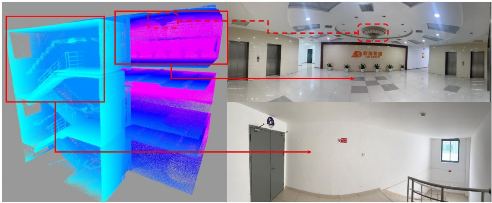

natural_image

Interior view of a modern office hallway with blue and purple thermal imaging overlays, featuring a company sign '欧博集团' on the wall (no readable text in main scene)

FIGURE 13 | Experiment with Livox Mid‐360.

TABLE 14 | Different performances of different SLAM methods in experiments. 

<table><tr><td>Parameter</td><td>Average surface thickness (cm)</td><td>Floor incline angle (°)</td><td>Stairwell wall incline angle (°)</td><td>Object radius error (m)</td></tr><tr><td>FAST-LIO</td><td>8.27</td><td>2.28</td><td>2.58</td><td>+0.09</td></tr><tr><td>FAST-LIO2</td><td>5.72</td><td>1.62</td><td>1.75</td><td>+0.03</td></tr><tr><td>Faster-LIO</td><td>4.58</td><td>1.13</td><td>1.84</td><td>+0.03</td></tr><tr><td>LIO-SAM</td><td>11.79</td><td>3.70</td><td>3.35</td><td>+0.17</td></tr><tr><td>LiLi-OM</td><td>8.33</td><td>2.72</td><td>2.78</td><td>+0.02</td></tr><tr><td>LIOM</td><td>10.25</td><td>3.72</td><td>3.58</td><td>+0.05</td></tr></table>

Note: The bold values are the best performance among all the methods in different datasets.

face of unstable GPS signals. The exceptional feature extraction and pattern recognition abilities demonstrated by AI algorithms have opened up new directions for the development of SLAM technology under GPS‐constrained conditions.

DL has demonstrated significant potential in denoising and enhancing GPS signals, especially when dealing with complex noise and interference environments. One of the most representative techniques is convolutional neural networks (CNNs). In the context of GPS signal denoising, CNNs can learn both spatial features and temporal patterns within the signal to identify and remove noise. By transforming GPS signals into a format suitable for CNN processing, the system can automatically learn features and optimise signal quality, even in the presence of complex noise patterns. For example, Ruwali [157] uses CNNs to identify and remove unreliable portions of the GPS signal in real time, thus improving the system's adaptability to unstable signals.

Compared to traditional signal processing methods, ML offers the advantage of automatically optimising denoising and enhancement strategies based on real‐time data, thereby improving system stability and positioning accuracy. Through supervised learning methods, the system can be trained on large volumes of GPS signal data to identify and classify different types of noise within the signals. This enables the system to dynamically adjust denoising strategies in real time, selecting the most appropriate model to optimise signal quality. Additionally, ML algorithms can classify the types of noise affecting the GPS signal—such as interference noise, blockage noise or spoofing attacks—and take tailored enhancement actions based on the noise type.

# 6.1.2 | Resilient State Estimation

Based on the existing work [158], unmanned aerial vehicles (UAVs) and other equipment need to operate not only in environments where GPS signals are blocked but also under the threat of GPS spoofing attacks. The security issues arising from the limited availability of sensors due to GPS spoofing attacks have emerged as a significant research direction for the future. We formulate the sensor drift problem as an increase in state estimation variance to quantify the sensor drift and introduce the concept of escape time, during which the state estimation error remains within an acceptable range with high confidence. Simultaneously, we have developed a novel safety‐constrained control framework that adjusts the UAV at the path re‐planning level to support robust state estimation against GPS spoofing attacks. In the presence of GPS spoofing attacks, the attacker location tracker (ALT) utilises an UKF with sliding window output to track the attacker's location and estimate the output power of the spoofing device. These estimates are then used by the escape controller (ESC), which drives the UAV out of the effective range of the spoofing device within the escape time to prevent sensor drift from exceeding acceptable limits.

# 6.2 | Integration With 4D mm Wave Radar

Integrating 4D mm‐wave radar with SLAM systems, particularly for fast‐moving objects, direct velocity sensing and challenging environmental conditions such as dust and rain, represents a promising yet under‐explored area. 4D mm‐wave radar can provide high‐resolution spatial and velocity information, with the potential to overcome the limitations of optical sensors and LiDAR in dynamic and complex environments. However, future research faces several key challenges and opportunities.

# 6.2.1 | Fast Moving Object Detection

4D mm‐wave radar offers significant advantages in detecting and tracking fast‐moving objects, providing real‐time relative velocity and position data. Compared to cameras and LiDAR, it is particularly well‐suited for tracking high‐speed objects. In dynamic scenarios such as highways or urban environments, the velocity sensing capability of radar can significantly enhance SLAM system performance. However, effectively integrating radar data with existing SLAM methods (such as EKF or graph optimisation‐based algorithms) remains a challenge. A robust fusion algorithm is needed to combine radar's velocity and position data with the spatial information from LiDAR or vision sensors, further improving the system's robustness in dynamic environments. Additionally, efficiently processing radar data streams while ensuring reasonable computational resource utilisation and avoiding excessive computational load is a key issue to address.

# 6.2.2 | Direct Velocity Sense

4D mm‐wave radar has the ability to simultaneously sense the velocity and position of objects, providing SLAM systems with a new dimension for more accurate estimation of object and environment motion. Unlike LiDAR or cameras, which primarily provide positional data, mm‐wave radar's direct velocity sensing capability offers a more comprehensive understanding of dynamic objects. This advantage is particularly critical in complex dynamic environments where traditional SLAM methods struggle, such as in high‐speed vehicles on highways or autonomous driving in urban settings.

In SLAM systems, the velocity data from 4D mm‐wave radar can replace or supplement traditional odometry data, enabling more accurate estimation of relative motion between the robot and its surroundings. However, how to accurately associate the measured velocity with specific objects, especially in dynamic environments, remains a challenge. Furthermore, radar data must be effectively integrated into the position and pose estimation frameworks to ensure system efficiency and robustness.

# 6.2.3 | Reliability in Harsh Environments

One of the key advantages of 4D mm‐wave radar over optical sensors and LiDAR is its ability to operate reliably in harsh environments such as dust, rain and fog. Unlike optical sensors that rely on light reflection, mm‐wave radar uses electromagnetic waves, which can penetrate these obstacles and provide reliable data even under adverse weather conditions. However, the accuracy of radar data can still be affected in extreme weather, such as heavy rain or dust clouds. Therefore, future research should focus on enhancing radar data quality through advanced filtering techniques, improving its performance under multi‐reflection interference and optimising multimodal sensor fusion methods to enhance system robustness across various environmental conditions.

# 7 | Conclusions

This paper systematically investigates the key challenges of SLAM technology in GPS‐denied environments, with a focus on LiDAR‐centric SLAM methods and multi‐sensor fusion techniques. It provides an in‐depth discussion of commonly used hardware configurations, relevant datasets, forward propagation and backward optimisation strategies in localisation algorithms, as well as keyframe selection, point cloud stacking and loop closure in mapping. Through performance comparisons of different hardware configurations, this study analyses the adaptability of SLAM systems in various complex environments and demonstrates their practical applications in underground tunnels, forests and mining shafts. Additionally, the paper explores the potential of integrating artificial intelligence and emerging sensors, such as 4D mm‐wave radar, to enhance the performance of SLAM systems, offering valuable insights for future research and development.

The practical applications of this research are extensive. In tunnel exploration, the proposed methods enable autonomous navigation and mapping in environments with weak lighting and highly reflective surfaces. In forest environments, where dense vegetation obstructs GPS signals, the framework ensures reliable localisation and mapping, making it particularly suitable for environmental monitoring and search‐and‐rescue operations. In mining shafts, the system's robustness to dynamic lighting and airborne particulates positions it as an essential tool for underground surveying, automated resource extraction and operational safety. By advancing SLAM technology, this study not only elevates the level of academic research but also lays a solid foundation for practical applications in extreme and complex scenarios.

# Acknowledgements

The authors would like to express their sincere gratitude to the relevant funding bodies and research teams. This work was partially supported by the research projects titled ‘3D tunnel map reconstruction for mining ground vehicles’ (Grant RDS10120240278), ‘Drone‐assisted forest patrol’ (Grant RDS10120250081) and ‘Development of drone hangar embedded with city light poles’ (Grant RDS10120250067). The financial and technical support provided by these projects has laid a solid foundation for the data collection, experimental verification and result analysis of this research, making the smooth progress of the study possible.

# Conflicts of Interest

The authors declare no conflicts of interest.

# Data Availability Statement

All relevant data supporting the findings of this study are included within the article and its cited materials. No additional external datasets were used.

# References

1. R. Munguia, J. Gonzalez, M. Perez, and C. I. Aldana, “Monocular‐Based SLAM for Mobile Robots: Filtering‐Optimization Hybrid Approach,” Journal of Intelligent and Robotic Systems 109, no. 3 (2023): 53, https://doi.org/10.1007/s10846‐023‐01981‐5.   
2. S. Zhang, R. Cui, W. Yan, M. Li, and H. Wang, “Dual‐Layer Path Planning With Pose SLAM for Autonomous Exploration in GPS‐Denied Environments,” IEEE Transactions on Industrial Electronics 71, no. 5 (2023): 4976–4986, https://doi.org/10.1109/TIE.2023.3288187.   
3. A. J. Davison, I. D. Reid, N. D. Molton, and O. Stasse, “MonoSLAM: Real‐Time Single Camera SLAM,” IEEE Transactions on Pattern Analysis and Machine Intelligence 29, no. 6 (2007): 1052–1067, https://doi. org/10.1109/TPAMI.2007.1049.   
4. G. Klein and D. Murray, “Parallel Tracking and Mapping for Small AR Workspaces,” in International Symposium on Mixed and Augmented Reality (ISMAR) (IEEE, 2007), 225–234.   
5. R. Mur‐Artal, J. M. M. Montiel, and J. D. Tardos, “ORB‐SLAM: A Versatile and Accurate Monocular SLAM System,” IEEE Transactions on Robotics 31, no. 5 (2015): 1147–1163, https://doi.org/10.1109/TRO. 2015.2463671.   
6. R. Mur‐Artal and J. D. Tardós, “ORB‐SLAM2: An Open‐Source SLAM System for Monocular, Stereo, and RGB‐D Cameras,” IEEE Transactions on Robotics 33, no. 5 (2017): 1255–1262, https://doi.org/10. 1109/TRO.2017.2705103.   
7. C. Campos, R. Elvira, J. J. G. Rodríguez, J. M. M. Montiel, and J. D. Tardós, “ORB‐SLAM3: An Accurate Open‐Source Library for Visual, Visual–Inertial, and Multimap SLAM,” IEEE Transactions on Robotics 37, no. 6 (2021): 1874–1890, https://doi.org/10.1109/TRO.2021.3075644.   
8. J. Engel, T. Schöps, and D. Cremers, LSD‐SLAM: Large‐Scale Direct Monocular SLAM (Springer, 2014), 834–849.   
9. C. Forster, Z. Zhang, M. Gassner, M. Werlberger, and D. Scaramuzza, “SVO: Semidirect Visual Odometry for Monocular and Multicamera Systems,” IEEE Transactions on Robotics 33, no. 2 (2016): 249–265, https://doi.org/10.1109/TRO.2016.2623335.   
10. J. Engel, V. Koltun, and D. Cremers, “Direct Sparse Odometry,” IEEE Transactions on Pattern Analysis and Machine Intelligence 40, no. 3 (2017): 611–625, https://doi.org/10.1109/TPAMI.2017.2658577.   
11. T. Whelan, R. F. Salas‐Moreno, B. Glocker, A. J. Davison, and S. Leutenegger, “ElasticFusion: Real‐Time Dense SLAM and Light Source Estimation,” International Journal of Robotics Research 35, no. 14 (2016): 1697–1716, https://doi.org/10.1177/0278364916669237.   
12. J. Zhang, Y. Yao, and B. Deng, “Fast and Robust Iterative Closest Point,” IEEE Transactions on Pattern Analysis and Machine Intelligence 44, no. 7 (2021): 3450–3466, https://doi.org/10.1109/TPAMI.2021.30 54619.   
13. R. A. Newcombe, S. J. Lovegrove, and A. J. Davison, “DTAM: Dense Tracking and Mapping in Real‐Time,” in 2011 International Conference on Computer Vision (IEEE, 2011): 2320–2327, https://doi.org/10.1109/ iccv.2011.6126513.   
14. H. Alismail, M. Kaess, B. Browning, and F. Dellaert, “Direct Visual Odometry in Low Light Using Binary Descriptors,” IEEE Robotics and Automation Letters 2, no. 2 (2016): 444–451, https://doi.org/10.1109/ LRA.2016.2635686.

15. M. Labbé and F. Michaud, “RTAB‐Map as an Open‐Source Lidar and Visual Simultaneous Localization and Mapping Library for Large‐Scale and Long‐Term Online Operation,” Journal of Field Robotics 36, no. 2 (2019): 416–446, https://doi.org/10.1002/rob.21831.   
16. Y. Li, N. Brasch, Y. Wang, D. Cremers, and F. Tombari, “Structure‐SLAM: Low‐Drift Monocular SLAM in Indoor Environments,” IEEE Robotics and Automation Letters 5, no. 4 (2020): 6583–6590, https://doi. org/10.1109/LRA.2020.3015456.   
17. J. Mo, M. J. Islam, and J. Sattar, “Fast Direct Stereo Visual SLAM,” IEEE Robotics and Automation Letters 7, no. 2 (2021): 778–785, https:// doi.org/10.1109/LRA.2021.3133860.   
18. W. Dai, Y. Zhang, P. Li, M. He, and P. Tan, “RGB‐D SLAM in Dynamic Environments Using Point Correlations,” IEEE Transactions on Pattern Analysis and Machine Intelligence 44, no. 1 (2020): 373–389, https://doi.org/10.1109/TPAMI.2020.3010942.   
19. B. He, S. Xu, Y. Dong, J. Liu, H. Zhang, and L. Ji, “A Robust Visual SLAM System for Low‐Texture and Semi‐Static Environments,” Multimedia Tools and Applications 83, no. 22 (2024): 61559–61583, https:// doi.org/10.1007/s11042‐022‐14013‐5.   
20. J. Cheng, L. Zhang, Q. Chen, X. Wang, and J. Li, “A Review of Visual SLAM Methods for Autonomous Driving Vehicles,” Engineering Applications of Artificial Intelligence 114 (2022): 104992, https://doi.org/ 10.1016/j.engappai.2022.104992.   
21. X. Bian, W. Zhao, L. Tang, Z. Wang, and C. Li, “FastSLAM‐MO‐PSO: A Robust Method for Simultaneous Localization and Mapping in Mobile Robots Navigating Unknown Environments,” Applied Sciences 14, no. 22 (2024): 10268, https://doi.org/10.3390/app142210268.   
22. B. Balasuriya, B. A. H. Chathuranga, B. Jayasundara, et al., “Outdoor Robot Navigation Using Gmapping Based SLAM Algorithm,” in 2016 Moratuwa Engineering Research Conference (MERCon) (IEEE, 2016): 403–408, https://doi.org/10.1109/mercon.2016.7480175.   
23. K. Daun, M. Schnaubelt, S. Kohlbrecher, and O. von Stryk, “HectorGrapher: Continuous‐Time Lidar SLAM With Multi‐Resolution Signed Distance Function Registration for Challenging Terrain,” in 2021 IEEE International Symposium on Safety, Security, and Rescue Robotics (SSRR) (IEEE, 2021): 152–159, https://doi.org/10.1109/ssrr53300. 2021.9597690.   
24. A. Dwijotomo, M. A. Abdul Rahman, M. H. Mohammed Ariff, H. A. Nugroho, and W. M. H. Wan Azree, “Cartographer SLAM Method for Optimization With an Adaptive Multi‐Distance Scan Scheduler,” Applied Sciences 10, no. 1 (2020): 347, https://doi.org/10.3390/app10010347.   
25. J. Zhang and S. Singh, “LOAM: LiDAR Odometry and Mapping in Real‐Time,” in Robotics: Science and systems, (2014) 2, 1–9.   
26. Z. Jiang, J. Zhu, Z. Lin, Q. Wang, and J. Zhang, “3D Mapping of Outdoor Environments by Scan Matching and Motion Averaging,” Neurocomputing 372 (2020): 17–32, https://doi.org/10.1016/j.neucom. 2019.09.022.   
27. W. Xu and F. Zhang, “Fast‐LIO: A Fast, Robust Lidar‐Inertial Odometry Package by Tightly‐Coupled Iterated Kalman Filter,” IEEE Robotics and Automation Letters 6, no. 2 (2021): 3317–3324, https://doi. org/10.1109/LRA.2021.3064227.   
28. H. Zhang, L. Du, S. Bao, J. Li, and Y. Wang, “LVIO‐Fusion: Tightly‐Coupled LiDAR‐Visual‐Inertial Odometry and Mapping in Degenerate Environments,” IEEE Robotics and Automation Letters 9, no. 3 (2024): 2145–2152, https://doi.org/10.1109/LRA.2024.3371383.   
29. T. Shan and B. Englot, “LeGO‐LOAM: Lightweight and Ground‐Optimized Lidar Odometry and Mapping on Variable Terrain,” in 2018 IEEE/RSJ International Conference on Intelligent Robots and Systems (IROS) (IEEE, 2018): 4758–4765, https://doi.org/10.1109/IROS. 2018.8594299.   
30. M. U. Khan, S. A. A. Zaidi, A. Ishtiaq, T. Ali, and A. N. Khan, “A Comparative Survey of LiDAR‐SLAM and Lidar‐Based Sensor

Technologies,” in Mohammad Ali Jinnah University Conference on Informatics and Computing 2021 (MAJICC'21) (IEEE, 2021): 1–8, https://doi.org/10.1109/MAJICC53071.2021.9526266.

31. A. Singandhupe and H. M. La, “A Review of SLAM Techniques and Security in Autonomous Driving,” in 2019 Third IEEE International Conference on Robotic Computing (IRC) (IEEE, 2019): 602–607, https:// doi.org/10.1109/irc.2019.00122.

32. L. Fahle, E. A. Holley, G. Walton, M. Thompson, and M. Dight, “Analysis of SLAM‐Based Lidar Data Quality Metrics for Geotechnical Underground Monitoring,” Mining, Metallurgy & Exploration 39, no. 5 (2022): 1939–1960, https://doi.org/10.1007/s42461‐022‐00664‐3.

33. E. S. Malinverni, R. Pierdicca, C. A. Bozzi, E. Frontoni, and A. Mancini, “Evaluating a SLAM‐Based Mobile Mapping System: A Methodological Comparison for 3D Heritage Scene Real‐Time Reconstruction,” in 2018 Metrology for Archaeology and Cultural Heritage (MetroArchaeo) (IEEE, 2018): 265–270, https://doi.org/10.1109/metroarchaeo43810.2018. 13684.

34. K. Chiang, Y. Chiu, S. Srinara, C. M. Lee, and S. Tsai, “Performance of LiDAR‐SLAM‐Based PNT With Initial Poses Based on NDT Scan Matching Algorithm,” Satellite Navigation 4, no. 1 (2023): 3, https://doi. org/10.1186/s43020‐022‐00092‐0.

35. S. Arshad and G. W. Kim, “Role of Deep Learning in Loop Closure Detection for Visual and LiDAR SLAM: A Survey,” Sensors 21, no. 4 (2021): 1243, https://doi.org/10.3390/s21041243.

36. A. Basiri, V. Mariani, and L. Glielmo, “Enhanced V‐SLAM Combining SVO and ORB‐SLAM2, With Reduced Computational Complexity, to Improve Autonomous Indoor Mini‐Drone Navigation Under Varying Conditions,” in IECON 2022 – 48th Annual Conference of the IEEE Industrial Electronics Society (IEEE, 2022): 1–7, https://doi.org/ 10.1109/iecon49645.2022.9968605.

37. LIVOX Technology, Livox Mid‐360 LiDAR Sensor (2025), https:// www.livoxtech.com/cn/mid‐360.

38. HESAI Technology, Hesai Pandar128 LiDAR Sensor (2025), https:// www.hesaitech.com/cn/product/Pandar128.

39. OUSTER Inc., Ouster VLS‐128 LiDAR Sensor (2025), https://ouster. com/products/hardware/vls‐128.

40. Intel Corporation, Intel Official Homepage (2025), https://www. intel.cn/content/www/cn/zh/homepage.html.

41. StereoLabs, Stereolabs ZED‐X Stereo Camera (2025), https://www. stereolabs.com/en‐jp/products/zed‐x.

42. ORBBEC, Orbbec Femto Mega TOF Camera (2025), https://www. orbbec.com/products/tof‐camera/femto‐mega/.

43. Y. K. Tee and Y. C. Han, “Lidar‐Based 2D SLAM for Mobile Robot in an Indoor Environment: A Review,” in 2021 International Conference on Green Energy, Computing and Sustainable Technology (GECOST) (IEEE, 2021): 1–7, https://doi.org/10.1109/gecost52368.2021.9538731.

44. AETHON Robot, Aethon Robot News and Updates (2025), http:// www.aethonrobot.com/cn/news/info\_19.aspx?itemid=58.

45. iRobot Corporation, iRobot Roomba Robot Vacuum Cleaners (2025), https://www.irobot.cn/roomba/index.html.

46. WHILL Inc., WHILL Personal Mobility Devices (2025), https:// www.whill.cn/product.html.

47. Hy‐Tek Intralogistics, MiR Autonomous Mobile Robots (AMR) Solutions (2025), https://hy‐tek.com/solutions/technology/amr‐agv/mir/.

48. T. H. Nguyen, T. M. Nguyen, and L. Xie, “Range‐Focused Fusion of Camera‐IMU‐UWB for Accurate and Drift‐Reduced Localization,” IEEE Robotics and Automation Letters 6, no. 2 (2021): 1678–1685, https://doi. org/10.1109/LRA.2021.3057838.

49. T. Qin, P. Li, and S. Shen, “VINS‐Mono: A Robust and Versatile Monocular Visual‐Inertial State Estimator,” IEEE Transactions on

Robotics and Automation 34, no. 4 (2018): 1004–1020, https://doi.org/10. 1109/TRO.2018.2853729.

50. S. Cho, C. Kim, M. Sunwoo, and J. Lee, “Robust Localization in Map Changing Environments Based on Hierarchical Approach of Sliding Window Optimization and Filtering,” IEEE Transactions on Intelligent Transportation Systems 23, no. 4 (2020): 3783–3789, https://doi.org/10. 1109/TITS.2020.3035801.

51. T. Tanaka, Y. Sasagawa, and T. Okatani, “Learning to Bundle‐Adjust: A Graph Network Approach to Faster Optimization of Bundle Adjustment for Vehicular SLAM,” in International Conference on Computer Vision (ICCV), (2021), 6250–6259, https://doi.org/10.1109/ ICCV48922.2021.00619.

52. TESLA Inc., Tesla China Official Homepage (2025), https://www. tesla.cn/.

53. DJI Technology Co., DJI Camera Drones Product Line, (2025), https://www.dji.com/jp/products/camera‐drones.

54. Microsoft Corporation, Microsoft HoloLens Documentation, (2025), https://learn.microsoft.com/zh‐cn/hololens/.

55. Apple Inc., Apple ARKit Developer Documentation, (2025), https:// developer.apple.com/cn/documentation/arkit/.

56. J. Zhu, H. Li, and T. Zhang, “Camera, LiDAR, and IMU Based Multi‐Sensor Fusion SLAM: A Survey,” Tsinghua Science and Technology 29, no. 2 (2023): 415–429, https://doi.org/10.26599/TST.2023.9010010.

57. Waymo LLC, Waymo Autonomous Driving Technology, (2025), https://waymo.com/intl/zh‐cn/.

58. Boston Dynamics, Boston Dynamics Spot Robot, (2025), https:// bostondynamics.com/products/spot/.

59. Clearpath Robotics, Clearpath Husky A300 Unmanned Ground Vehicle, (2025), https://clearpathrobotics.com/husky‐a300‐unmannedground‐vehicle‐robot/.

60. GoSLAM, GoSLAM M40 RTK SLAM System, (2025), https://www. goslam.com/product/M40‐RTK.

61. Y. Zhao, Y. Liang, Z. Ma, X. Wang, and W. Li, “Localization and Mapping Algorithm Based on LiDAR‐IMU‐Camera Fusion,” Journal of Intelligent and Connected Vehicles 7, no. 2 (2024): 97–107, https://doi. org/10.26599/JICV.2023.9210027.

62. X. Zuo, Y. Yang, P. Geneva, et al., “LIC‐Fusion 2.0: LiDAR‐Inertial‐Camera Odometry With Sliding‐Window Plane‐Feature Tracking,” in 2020 IEEE/RSJ International Conference on Intelligent Robots and Systems (IROS) (IEEE, 2020): 5112–5119, https://doi.org/10.1109/iros45743. 2020.9340704.

63. C. Zheng, Q. Zhu, W. Xu, and F. Zhang, “Fast‐LIVO: Fast and Tightly‐Coupled Sparse‐Direct LiDAR‐Inertial‐Visual Odometry,” in 2022 IEEE/ RSJ International Conference on Intelligent Robots and Systems (IROS) (IEEE, 2022): 4003–4009, https://doi.org/10.1109/IROS47612.2022.99 81107.

64. SIEMENS AG, Siemens Smart Buildings Solutions, (2025) https:// www.siemens.com/cn/zh/products/buildings/smart‐buildings.html.

65. GreyOrange, GreyOrange Autonomous Robotics and Supply Chain Solutions (2025), https://www.greyorange.com/.

66. Intuitive, Intuitive Da Vinci Surgical Systems (2025), https://www. intuitive.com/en‐us/products‐and‐services/da‐vinci.

67. Hexagon, Hexagon SmartScan 3D Scanning Solutions (2025), https://hexagon.com/products/smartscan.

68. W. Wang, J. Liu, C. Wang, S. Chen, and J. Zhang, “DV‐LOAM: Direct Visual Lidar Odometry and Mapping,” Remote Sensing 13, no. 16 (2021): 3340, https://doi.org/10.3390/rs13163340.

69. T. Shan, B. Englot, C. Ratti, and D. Rus, “LVI‐SAM: Tightly‐Coupled LiDAR‐visual‐inertial Odometry via Smoothing and Mapping,” in 2021

IEEE International Conference on Robotics and Automation (ICRA), (2021), 5692–5698.

70. G. Kurz, M. Holoch, and P. Biber, “Geometry‐Based Graph Pruning for Lifelong SLAM,” in 2021 IEEE/RSJ International Conference on Intelligent Robots and Systems (IROS) (2021): 3313–3320, https://doi.org/ 10.1109/iros51168.2021.9636530.

71. A. J. Ahmed and D. Jasim Kadhim, “Real‐Time SLAM Mobile Robot and Navigation Based on Cloud‐Based Implementation,” Journal of Robotics 2023, no. 1 (2023): 9967236, https://doi.org/10.1155/2023/ 9967236.

72. M. Servières, V. Renaudin, A. Dupuis, and S. Bonnabel, “Visual and Visual‐Inertial SLAM: State of the Art, Classification, and Experimental Benchmarking,” Journal of Sensors 2021, no. 1 (2021): 2054828, https:// doi.org/10.1155/2021/2054828.

73. S. Klenk, J. Chui, N. Demmel, J. Stückler, and B. Leibe, “TUM‐VIE: The TUM Stereo Visual‐Inertial Event Dataset,” in 2021 IEEE/RSJ International Conference on Intelligent Robots and Systems (IROS) (IEEE, 2021): 8601–8608, https://doi.org/10.1109/iros51168.2021.9636728.

74. J. I. Ortega‐Gomez, L. A. Morales‐Hernandez, and I. A. Cruz‐Albarran, “A Specialized Database for Autonomous Vehicles Based on the KITTI Vision Benchmark,” Electronics 12, no. 14 (2023): 3165, https://doi.org/10.3390/electronics12143165.

75. M. Ramezani, Y. Wang, M. Camurri, M. Bloesch, and S. Leutenegger, “The Newer College Dataset: Handheld Lidar, Inertial and Vision With Ground Truth,” in 2020 IEEE/RSJ International Conference on Intelligent Robots and Systems (IROS) (IEEE, 2020): 4353–4360, https://doi.org/10.1109/IROS45743.2020.9340849.

76. J. Yin, D. Luo, F. Yan, J. Zhang, and H. Li, “A Novel LiDAR‐Assisted Monocular Visual SLAM Framework for Mobile Robots in Outdoor Environments,” IEEE Transactions on Instrumentation and Measurement 71 (2022): 1–11, https://doi.org/10.1109/TIM.2022.3190031.

77. M. Xu, S. Lin, J. Wang, X. Chen, and Y. Liu, “A LiDAR SLAM System With Geometry Feature Group Based Stable Feature Selection and Three‐Stage Loop Closure Optimization,” IEEE Transactions on Instrumentation and Measurement 72, no. 1 (2023): 1–12, https://doi. org/10.1109/TIM.2023.3292956.

78. W. Wen, Y. Zhou, G. Zhang, et al., “UrbanLoco: A Full Sensor Suite Dataset for Mapping and Localization in Urban Scenes,” in 2020 IEEE International Conference on Robotics and Automation (ICRA) (IEEE, 2020): 2310–2316, https://doi.org/10.1109/icra40945.2020.9196526.

79. Y. Xu, J. Lin, J. Shi, F. Zhang, C. Liu, and H. Li, “Robust Self‐Supervised Lidar Odometry via Representative Structure Discovery and 3D Inherent Error Modeling,” IEEE Robotics and Automation Letters 7, no. 2 (2022): 1651–1658, https://doi.org/10.1109/LRA.2022.3140794.

80. X. Li, D. Liu, and J. Wu, “CTO‐SLAM: Contour Tracking for Object‐Level Robust 4D SLAM,” in Proceedings of the AAAI Conference on Artificial Intelligence 38, no. 9 (2024): 10323–10331, https://doi.org/10. 1609/aaai.v38i9.28899.

81. T. M. Nguyen, S. Yuan, M. Cao, H. Suresh, D. Cremers, and L. Xie, “NTU VIRAL: A Visual‐Inertial‐Ranging‐Lidar Dataset, From an Aerial Vehicle Viewpoint,” International Journal of Robotics Research 41, no. 3 (2022): 270–280, https://doi.org/10.1177/02783649211052312.

82. J. Lin and F. Zhang, “R3LIVE: A Robust, Real‐Time, RGB‐Colored, LiDAR‐Inertial‐Visual Tightly‐Coupled State Estimation and Mapping Package,” in 2022 International Conference on Robotics and Automation (ICRA) (IEEE, 2022): 10672–10678, https://doi.org/10.1109/ICRA46639. 2022.9811935.

83. S. Hening, C. A. Ippolito, K. S. Krishnakumar, V. Stepanyan, and M. Teodorescu, “3D LiDAR SLAM Integration With GPS/INS for UAVs in Urban GPS‐Degraded Environments,” AIAA (2017): 0448.

84. W. Xu, Y. Cai, D. He, and F. Zhang, “Fast‐LIO2: Fast Direct LiDAR‐Inertial Odometry,” IEEE Transactions on Robotics and Automation 38, no. 4 (2022): 2053–2073, https://doi.org/10.1109/TRO.2022.3141876.

85. H. Zhao, R. Zheng, M. Liu, Y. Li, and T. Zhang, “Detecting Loop Closure Using Enhanced Image for Underwater VINS‐Mono,” in Global Oceans 2020: Singapore – U.S. Gulf Coast (IEEE, 2020): 1–6, https://doi. org/10.1109/ieeeconf38699.2020.9388996.

86. T. Shan, B. Englot, D. Meyers, W. Wang, C. Ratti, and D. Rus, “LIO‐SAM: Tightly‐Coupled LiDAR Inertial Odometry via Smoothing and Mapping,” in 2020 IEEE/RSJ International Conference on Intelligent Robots and Systems (IROS) (IEEE, 2020): 5135–5142, https://doi.org/10. 1109/iros45743.2020.9341176.

87. L. Huang, C. Wang, J. Yun, S. Li, Y. Liu, et al., “Object Pose Estimation Based on Stereo Vision With Improved K‐D Tree ICP Algorithm,” Concurrency and Computation: Practice and Experience 35, no. 21 (2023): e7714, https://doi.org/10.1002/cpe.7714.

88. J. Hou, M. Goebel, P. Hübner, and A. Nüchter, “Octree‐Based Approach for Real‐Time 3D Indoor Mapping Using RGB‐D Video Data,” International Archives of the Photogrammetry, Remote Sensing and Spatial Information Sciences 48 (2023): 183–190, https://doi.org/10. 5194/isprs‐archives‐XLVIII‐1‐W1‐2023‐183‐2023.

89. Z. Wu, D. Li, C. Li, Y. Zhang, and J. Liu, “Feature Point Tracking Method for Visual SLAM Based on Multi‐Condition Constraints in Light Changing Environment,” Applied Sciences 13, no. 12 (2023): 7027, https://doi.org/10.3390/app13127027.

90. H. Qi, C. Wang, J. Li, Y. Zhang, and X. Liu, “Loop Closure Detection With CNN in RGB‐D SLAM for Intelligent Agricultural Equipment,” Agriculture 14, no. 6 (2024): 949, https://doi.org/10.3390/agriculture140 60949.

91. S. C. Prados, S. Villanueva Lorente, and M. Di Castro, “Graph SLAM Built Over Point Clouds Matching for Robot Localization in Tunnels,” Sensors 21, no. 16 (2021): 5340, https://doi.org/10.3390/s21165340.

92. H. Saleem, R. Malekian, and H. Munir, “Neural Network‐Based Recent Research Developments in SLAM for Autonomous Ground Vehicles: A Review,” IEEE Sensors Journal 23, no. 13 (2023): 13829–13858, https://doi.org/10.1109/JSEN.2023.3273913.

93. C. Pang, L. Zhou, and X. Huang, “A Low‐Cost 3D SLAM System Integration of Autonomous Exploration Based on Fast‐ICP Enhanced LiDAR‐Inertial Odometry,” Remote Sensing 16, no. 11 (2024): 1979, https://doi.org/10.3390/rs16111979.

94. S. Srinara, C. M. Lee, S. Tsai, and K. Chiang, “Performance Analysis of 3D NDT Scan Matching for Autonomous Vehicles Using INS/GNSS/ 3D LiDAR‐SLAM Integration Scheme,” in 2021 IEEE International Symposium on Inertial Sensors and Systems (INERTIAL) (IEEE, 2021): 1–4, https://doi.org/10.1109/inertial51137.2021.9430476.

95. B. Zhou, Y. He, K. Qian, Y. Liu, and C. Wang, “S4‐SLAM: A Real‐Time 3D LIDAR SLAM System for Ground/WaterSurface Multi‐Scene Outdoor Applications,” Autonomous Robots 45, no. 1 (2021): 77–98, https://doi.org/10.1007/s10514‐020‐09948‐3.

96. H. M. S. Bruno and E. L. Colombini, “LIFT‐SLAM: A Deep‐Learning Feature‐Based Monocular Visual SLAM Method,” Neurocomputing 455 (2021): 97–110, https://doi.org/10.1016/j.neucom.2021.05.027.

97. Y. Cui, X. Chen, Y. Zhang, Y. Liu, J. Liu, and F. Zhu, “Bow3D: Bag of Words for Real‐Time Loop Closing in 3D LiDAR SLAM,” IEEE Robotics and Automation Letters 8, no. 5 (2022): 2828–2835, https://doi.org/ 10.1109/LRA.2022.3221336.

98. C. Park, P. Moghadam, J. L. Williams, A. Kim, C. Kim, and C. Fookes, “Elasticity Meets Continuous‐Time: Map‐Centric Dense 3D LiDAR SLAM,” IEEE Transactions on Robotics and Automation 38, no. 2 (2021): 978–997, https://doi.org/10.1109/TRO.2021.3096650.

99. W. Chen, G. Shang, A. Ji, et al., “An Overview on Visual SLAM: From Tradition to Semantic,” Remote Sensing 14, no. 13 (2022): 3010, https://doi.org/10.3390/rs14133010.   
100. S. Li, D. Zhang, Y. Xian, J. Zhang, H. Li, and C. Zhong, “Overview of Deep Learning Application on Visual SLAM,” Displays 74 (2022): 102298, https://doi.org/10.1016/j.displa.2022.102298.   
101. X. Xu, L. Zhang, J. Yang, et al., “A Review of Multi‐Sensor Fusion SLAM Systems Based on 3D LIDAR,” Remote Sensing 14, no. 12 (2022): 2835, https://doi.org/10.3390/rs14122835.   
102. T. Li, L. Pei, Y. Xiang, et al., “P3 ‐LOAM: PPP/LiDAR Loosely Coupled SLAM With Accurate Covariance Estimation and Robust RAIM in Urban Canyon Environment,” IEEE Sensors Journal 21, no. 5 (2020): 6660–6671, https://doi.org/10.1109/JSEN.2020.3042968.   
103. C. C. Chou and C. F. Chou, “Efficient and Accurate Tightly‐Coupled Visual‐LiDAR SLAM,” IEEE Transactions on Intelligent Transportation Systems 23, no. 9 (2021): 14509–14523, https://doi.org/10. 1109/TITS.2021.3130089.   
104. Y. Zhang, P. Shi, and J. Li, “3D LiDAR SLAM: A Survey,” Photogrammetric Record 39, no. 128 (2024): 387–415, https://doi.org/10.1111/ phor.12497.   
105. W. Wan, H. Kim, Y. Cheng, Z. Chen, and H. Liu, “Safety Constrained Multi‐UAV Time Coordination: A Bi‐Level Control Framework in GPS Denied Environment,” in AIAA AVIATION 2021 FORUM, (2021).2463   
106. X. Wang and N. Hovakimyan, “L1 Adaptive Controller for Nonlinear Time‐Varying Reference Systems,” Systems & Control Letters 61, no. 4 (2012): 455–463, https://doi.org/10.1016/j.sysconle.2012.01.010.   
107. G. P. C. Júnior, A. M. C. Rezende, V. R. F. Miranda, et al., “EKF‐LOAM: An Adaptive Fusion of LiDAR SLAM With Wheel Odometry and Inertial Data for Confined Spaces With Few Geometric Features,” IEEE Transactions on Automation Science and Engineering 19, no. 3 (2022): 1458–1471, https://doi.org/10.1109/TASE.2022.3169442.   
108. N. Chebrolu, T. Läbe, O. Vysotska, and C. Stachniss, “Adaptive Robust Kernels for Non‐Linear Least Squares Problems,” IEEE Robotics and Automation Letters 6, no. 2 (2021): 2240–2247, https://doi.org/10. 1109/LRA.2021.3061331.   
109. F. Nie, W. Zhang, Z. Yao, J. Wang, H. Li, and Q. Huang, “LCPF: A Particle Filter LiDAR SLAM System With Loop Detection and Correction,” IEEE Access 8 (2020): 20401–20412, https://doi.org/10.1109/ACCES S.2020.2968353.   
110. N. Akai, “Reliable Monte Carlo Localization for Mobile Robots,” Journal of Field Robotics 40, no. 3 (2023): 595–613, https://doi.org/10. 1002/rob.22149.   
111. T. Liu, C. Xu, Y. Qiao, Y. Wang, and J. Li, “Particle Filter SLAM for Vehicle Localization,” arXiv preprint arXiv:2402.07429 (2024), https:// doi.org/10.48550/arXiv.2402.07429.   
112. M. Tang, Z. Chen, and F. Yin, “Robot Tracking in SLAM With Masreliez‐Martin Unscented Kalman Filter,” International Journal of Control, Automation and Systems 18, no. 9 (2020): 2315–2325, https:// doi.org/10.1007/s12555‐019‐0669‐1.   
113. A. Fontan, J. Civera, and M. Milford, “AnyFeature‐VSLAM: Automating the Usage of Any Chosen Feature Into Visual SLAM,” in Proceedings of the Robotics: Science and Systems, (2024), 2.   
114. D. Iwaszczuk and S. Roth, “Deeplio: Deep Lidar Inertial Sensor Fusion for Odometry Estimation,” ISPRS Annals of the Photogrammetry, Remote Sensing and Spatial Information Sciences 1, no. 1 (2021): 47–54, https://doi.org/10.5194/isprs‐annals‐v‐1‐2021‐47‐2021.   
115. V. Mohanty, S. Agrawal, S. Datta, and D. R. Parhi, “DeepVO: A Deep Learning Approach for Monocular Visual Odometry,” arXiv preprint arXiv:1611.06069 (2016), https://doi.org/10.48550/arXiv.1611. 06069.

116. J. Czarnowski, T. Laidlow, R. Clark, P. Newman, and A. J. Davison, “DeepFactors: Real‐Time Probabilistic Dense Monocular SLAM,” IEEE Robotics and Automation Letters 5, no. 2 (2020): 721–728, https:// doi.org/10.1109/LRA.2020.2965415.   
117. C. Yan, D. Qu, D. Xu, et al., “GS‐SLAM: Dense Visual SLAM With 3D Gaussian Splatting,” 2024 IEEE/CVF Conference on Computer Vision and Pattern Recognition (CVPR) (2024): 19595–19604, https://doi.org/10. 1109/cvpr52733.2024.01853.   
118. Y. Zhuang, P. Jia, Z. Liu, et al., “Amos‐SLAM: An Anti‐Dynamics Two‐Stage RGB‐D SLAM Approach,” IEEE Transactions on Instrumentation and Measurement 72, no. 1 (2023): 1–12, https://doi.org/10. 1109/TIM.2023.3332395.   
119. Y. Tao, Y. Bhalgat, L. F. T. Fu, J. Zhang, S. Chen, and M. Fallon, “SiLVR: Scalable Lidar‐Visual Reconstruction With Neural Radiance Fields for Robotic Inspection,” arXiv preprint arXiv:2403.06877 (2024): 17983–17989, https://doi.org/10.1109/ICRA57147.2024.10611278.   
120. S. Zhu, G. Wang, H. Blum, et al., “SNI‐SLAM: Semantic Neural Implicit SLAM,” 2024 IEEE/CVF Conference on Computer Vision and Pattern Recognition (CVPR) (2024): 21167–21177, https://doi.org/10. 1109/cvpr52733.2024.02000.   
121. G. Zhang, E. Sandström, Y. Zhang, X. Chen, and Y. Wang, “Glorie‐SLAM: Globally Optimized RGB‐Only Implicit Encoding Point Cloud SLAM,” arXiv preprint arXiv:2403.19549 (2024), https://doi.org/10. 48550/arXiv.2403.19549.   
122. Z. Yuan, J. Deng, R. Ming, Y. Li, and H. Zhang, “SR‐LIVO: LiDAR‐Inertial‐Visual Odometry and Mapping With Sweep Reconstruction,” IEEE Robotics and Automation Letters 9, no. 4 (2024): 3210–3217, https://doi.org/10.1109/LRA.2024.3389415.   
123. P. Geneva, J. Maley, and G. Huang, “An Efficient Schmidt‐EKF for 3D Visual‐Inertial SLAM,” in Proceedings of the IEEE/CVF Conference on Computer Vision and Pattern Recognition, (2019), 12105–12115.   
124. S. Leutenegger, “OKVIS2: Realtime Scalable Visual‐Inertial SLAM With Loop Closure,” arXiv preprint arXiv:2202.09199 (2022), https://doi. org/10.48550/arXiv.2202.09199.   
125. J. A. Placed and J. A. Castellanos, “A Deep Reinforcement Learning Approach for Active SLAM,” Applied Sciences 10, no. 23 (2020): 8386, https://doi.org/10.3390/app10238386.   
126. H. Ren, Z. Zheng, Y. Wu, J. Li, and H. Zhang, “DaCo: Domain‐Agnostic Contrastive Learning for Visual Place Recognition,” Applied Intelligence 53, no. 19 (2023): 21827–21840, https://doi.org/10.1007/ s10489‐023‐04629‐x.   
127. Z. Chen, B. Hu, Z. Chen, X. Liu, and Q. Wang, “Progress and Thinking on Self‐Supervised Learning Methods in Computer Vision: A Review,” IEEE Sensors Journal 24, no. 8 (2024): 11234–11252, https:// doi.org/10.1109/JSEN.2024.3443885.   
128. T. W. Jung, C. S. Jeong, S. C. Kwon, J. H. Lee, and J. H. Park, “Point‐Graph Neural Network Based Novel Visual Positioning System for Indoor Navigation,” Applied Sciences 11, no. 19 (2021): 9187, https:// doi.org/10.3390/app11199187.   
129. X. Shi, T. Liu, and X. Han, “Improved Iterative Closest Point (ICP) 3D Point Cloud Registration Algorithm Based on Point Cloud Filtering and Adaptive Fireworks for Coarse Registration,” International Journal of Remote Sensing 41, no. 8 (2020): 3197–3220, https://doi.org/10.1080/ 01431161.2019.1701211.   
130. W. Xin and J. Pu, “An Improved ICP Algorithm for Point Cloud Registration,” in 2010 International Conference on Computational and Information Sciences (IEEE, 2020): 565–568, https://doi.org/10.1109/ iccis.2010.144.   
131. Y. Cai, W. Xu, and F. Zhang, “IKD‐Tree: An Incremental KD Tree for Robotic Applications,” arXiv preprint arXiv:2102.10808 (2021), https://doi.org/10.48550/arXiv.2102.10808.

132. Y. Wang, Z. Wang, and X. Wu, “An Efficient and Accurate 3D SLAM Method for Dynamic Environment,” in 2022 4th International Conference on Robotics and Computer Vision (ICRCV) (2022): 148–153, https://doi.org/10.1109/icrcv55858.2022.9953253.   
133. C. Fu, G. Li, R. Song, M. Liu, and J. Zhang, “OctAttention: Octree‐Based Large‐Scale Contexts Model for Point Cloud Compression,” Proceedings of the AAAI Conference on Artificial Intelligence 36, no. 1 (2022): 625–633, https://doi.org/10.1609/aaai.v36i1.19942.   
134. J. Zhu, H. Li, Z. Wang, X. Chen, and Y. Liu, “i‐Octree: A Fast, Lightweight, and Dynamic Octree for Proximity Search,” in 2024 IEEE International Conference on Robotics and Automation (ICRA) (IEEE, 2024): 12290–12296, https://doi.org/10.1109/icra57147.2024.10611019.   
135. M. Muglikar, Z. Zhang, and D. Scaramuzza, “Voxel Map for Visual SLAM,” in 2020 IEEE International Conference on Robotics and Automation (ICRA) (IEEE, 2020): 4181–4187, https://doi.org/10.1109/icra409 45.2020.9197357.   
136. Z. Liu, H. Li, C. Yuan, Y. Wang, and J. Li, “Voxel‐SLAM: A Complete, Accurate, and Versatile LiDAR‐Inertial SLAM System,” arXiv preprint arXiv:2410.08935 (2024), https://doi.org/10.48550/arXiv.2410. 08935.   
137. T. Ma, L. Kong, Y. Ou, X. Zhang, and M. Liu, “Accurate 3D LiDAR SLAM System Based on Hash Multi‐Scale Map and Bidirectional Matching Algorithm,” Sensors 24, no. 12 (2024): 4011, https://doi.org/10. 3390/s24124011.   
138. J. Yu and S. Shen, “SemanticLoop: Loop Closure With 3D Semantic Graph Matching,” IEEE Robotics and Automation Letters 8, no. 2 (2022): 568–575, https://doi.org/10.1109/LRA.2022.3229228.   
139. X. Chen, T. Läbe, A. Milioto, T. Goll, and C. Stachniss, “OverlapNet: A Siamese Network for Computing LiDAR Scan Similarity With Applications to Loop Closing and Localization,” Autonomous Robots 46, no. 5 (2022): 689–706, https://doi.org/10.1007/s10514‐021‐09999‐0.   
140. Q. Zhang and J. Kim, “Shape BoW: Generalized Bag of Words for Appearance‐Based Loop Closure Detection in Bathymetric SLAM,” IEEE Robotics and Automation Letters 9, no. 5 (2024): 7405–7412, https://doi.org/10.1109/LRA.2024.3426370.   
141. T. T. Le, T. S. Le, Y. R. Chen, C. H. Lin, and S. H. Huang, “6D Pose Estimation With Combined Deep Learning and 3D Vision Techniques for a Fast and Accurate Object Grasping,” Robotics and Autonomous Systems 141 (2021): 103775, https://doi.org/10.1016/j.robot.2021.103775.   
142. Y. Zhou, J. Yang, Z. Guo, H. Li, X. Wang, and J. Chun‐Wei Lin, “An Indoor Blind Area‐Oriented Autonomous Robotic Path Planning Approach Using Deep Reinforcement Learning,” Expert Systems With Applications 254 (2024): 124277, https://doi.org/10.1016/j.eswa.2024. 124277.   
143. D. Cattaneo, M. Vaghi, and A. Valada, “LCDNet: Deep Loop Closure Detection and Point Cloud Registration for LiDAR SLAM,” IEEE Transactions on Robotics 38, no. 4 (2022): 2074–2093, https://doi. org/10.1109/TRO.2022.3150683.   
144. Q. Li, H. Huang, W. Yu, J. Zhang, and M. Liu, “Optimized Views Photogrammetry: Precision Analysis and a Large‐Scale Case Study in Qingdao,” IEEE Journal of Selected Topics in Applied Earth Observations and Remote Sensing 16 (2023): 1144–1159, https://doi.org/10.1109/ JSTARS.2022.3233359.   
145. Y. Zhang, F. Tosi, S. Mattoccia, and H. Li, “Go‐SLAM: Global Optimization for Consistent 3D Instant Reconstruction,” in 2023 IEEE/ CVF International Conference on Computer Vision (ICCV) (IEEE, 2023): 3727–3737.   
146. Z. Qian, S. Wang, M. Mihajlovic, X. Chen, and J. Li, “3DGS‐Avatar: Animatable Avatars via Deformable 3D Gaussian Splatting,” in 2024 IEEE/CVF Conference on Computer Vision and Pattern Recognition (CVPR) (IEEE, 2024): 5020–5030, https://doi.org/10.1109/cvpr52733. 2024.00480.

147. A. Rosinol, J. J. Leonard, and L. Carlone, “NeRF‐SLAM: Real‐Time Dense Monocular SLAM With Neural Radiance Fields,” in 2023 IEEE/RSJ International Conference on Intelligent Robots and Systems (IROS) (IEEE, 2023): 3437–3444, https://doi.org/10.1109/iros55552.2023.10341922.   
148. P. Pham, D. Patel, D. Conover, Y. Zhang, and H. Liu, “Go‐SLAM: Grounded Object Segmentation and Localization With Gaussian Splatting SLAM,” arXiv preprint arXiv:2409.16944 (2024), https://doi.org/10. 48550/arXiv.2409.16944.   
149. B. Mildenhall, P. P. Srinivasan, M. Tancik, J. T. Barron, R. Ramamoorthi, and R. Ng, “NeRF: Representing Scenes as Neural Radiance Fields for View Synthesis,” Communications of the ACM 65, no. 1 (2021): 99–106, https://doi.org/10.1145/3503250.   
150. C. Bai, W. Xu, F. Zhang, T. Chen, J. Liu, and X. Gao, “Faster‐LIO: Lightweight Tightly Coupled LiDAR‐Inertial Odometry Using Parallel Sparse Incremental Voxels,” IEEE Robotics and Automation Letters 7, no. 1 (2022): 4861–4868, https://doi.org/10.1109/LRA.2022.3152830.   
151. K. Li, M. Li, and U. D. Hanebeck, “Towards High‐Performance Solid‐State‐LiDAR‐Inertial Odometry and Mapping,” IEEE Robotics and Automation Letters 6, no. 3 (2021): 5167–5174, https://doi.org/10. 1109/LRA.2021.3070251.   
152. Y. Pan, X. Zhong, L. Wiesmann, T. Posewsky, J. Behley, and C. Stachniss, “PIN‐SLAM: LiDAR SLAM Using a Point‐Based Implicit Neural Representation for Achieving Global Map Consistency,” IEEE Transactions on Robotics 40, no. 3 (2024): 4045–4064, https://doi.org/10. 1109/TRO.2024.3422055.   
153. K. Fang, R. Song, and I. W. H. Ho, “Invariant‐DLIO: Direct LiDAR‐Inertial Odometry Based on Invariant Kalman Filtering,” IEEE Sensors Journal 25, no. 2 (2025): 20572–20583, https://doi.org/10.1109/JSEN. 2025.3558916.   
154. C. Forster, L. Carlone, F. Dellaert, and D. Scaramuzza, “On‐Manifold Preintegration for Real‐Time Visual–Inertial Odometry,” IEEE Transactions on Robotics 33, no. 1 (2016): 1–21, https://doi.org/10. 1109/TRO.2016.2597321.   
155. K. Koide, J. Miura, and E. Menegatti, “A Portable Three‐Dimensional LIDAR‐Based System for Long‐Term and Wide‐Area People Behavior Measurement,” International Journal of Advanced Robotic Systems 16, no. 2 (2019): 1729881419841532, https://doi.org/10. 1177/1729881419841532.   
156. C. Qin, H. Ye, C. E. Pranata, J. Han, S. Zhang, and M. Liu, “LINS: A LiDAR‐Inertial State Estimator for Robust and Efficient Navigation,” IEEE (2020): 8899–8906, https://doi.org/10.1109/icra40945.2020.9197567.   
157. A. Ruwali, A. J. S. Kumar, K. B. Prakash, R. Singh, and R. K. Yadav, “Implementation of Hybrid Deep Learning Model (LSTM‐CNN) for Ionospheric TEC Forecasting Using GPS Data,” IEEE Geoscience and Remote Sensing Letters 18, no. 6 (2020): 1004–1008, https://doi.org/10. 1109/LGRS.2020.2992633.   
158. W. Wan, H. Kim, N. Hovakimyan, Z. Chen, and P. G. Voulgaris, “A Safety Constrained Control Framework for UAVs in GPS Denied Environment,” IEEE (2020): 214–219, https://doi.org/10.1109/cdc42340. 2020.9304304.